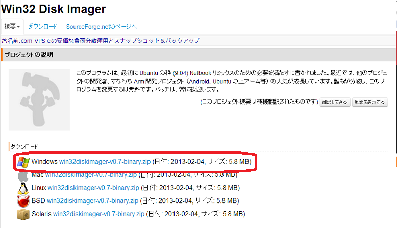
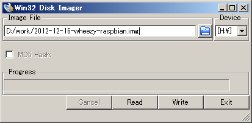
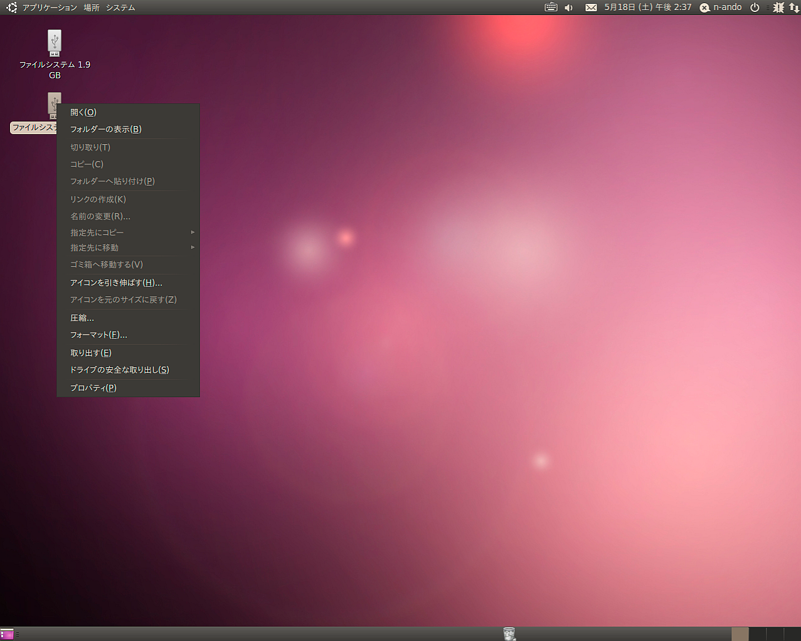

<!-- Title: Preparing the SD Card -->
<!-- -*- pukiwiki-edit -*- -->
#contents

## Introduction

This section explains how to install the runtime environment required to run OpenRTM-aist and its components on LEGO Mindstorms EV3.

Here, we will explain how to download the OS image provided by openrtm.org that includes OpenRTM-aist and perform the necessary setup.

The overall procedure for enabling OpenRTM on EV3 is as follows:

- Write the OS image to an SD card
- Perform basic OS setup
- Test execution of components

## SD Card

The EV3 has one micro SD card slot. By inserting a micro SD card containing a bootable OS, you can start the EV3 with an arbitrary operating system.

The SD card must be a **micro SD card** with a capacity between **2 GB and 32 GB**. Please note that mini SD cards and standard SD cards cannot be inserted.

The image file is approximately 2 GB in size, so at least 2 GB of capacity is required. EV3 does not support SDXC cards larger than 32 GB.

- Required SD Card
  - micro SD card
  - 2 GB or larger, up to 32 GB

## Downloading the OS Image

To run OpenRTM-aist on EV3, an operating system called **ev3dev** is used.

- ev3dev Website: http://www.ev3dev.org

Download **ev3-ev3dev-jessie-2015-12-30.img.zip** from the following site.

There are many similarly named files available, so be careful to download the correct one.

- https://github.com/ev3dev/ev3dev/releases

### Downloading the ev3dev OS Image

ev3dev is a Debian GNU/Linux distribution for EV3.

To run OpenRTM-aist, write ev3dev to a micro SD card and boot EV3 from that SD card.

Although the ev3dev OS image can be downloaded from the official website, it does not include OpenRTM-aist.

In most cases, download the ev3dev image containing OpenRTM-aist (C++ and Python) from the following link.

- [2015-08-05-ev3dev-openrtm.zip](http://openrtm.org)

### Image with Sample Components

This image includes sample components such as Educator Vehicle.

- [ev3-openrtm.img](https://drive.google.com/a/nobu777.net/uc?export=download&confirm=A1zJ&id=1nJ552cMdYkgDdRtF0RHYfkL1Bqu300Kv)

If the wireless LAN access point mode does not work correctly after replacing the EV3 wireless LAN adapter, connect to another access point and edit **70-persistent-net.rules** using the following command.

Log in with username **robot** and password **maker**.

```bash
sudo nano /etc/udev/rules.d/70-persistent-net.rules
```

Specifically, comment out all lines beginning with **SUBSYSTEM** in **70-persistent-net.rules**.

```bash
# USB device 0x:0x (rtl8192cu)
SUBSYSTEM=="net", ACTION=="add", DRIVERS=="?*", ATTR{address}=="00:22:cf:f6:52:a5", ATTR{dev_id}=="0x0", ATTR{type}=="1", KERNEL=="wlan*", NAME="wlan1"
```

### Extracting the Image

Extract the downloaded file **YYYY-MM-DD-ev3dev-openrtm.zip**.

A file named **YYYY-MM-DD-ev3dev-openrtm.img** of approximately 2 GB should be extracted.

#### Windows

Right-click the file and select **Extract All**.

#### Linux

```bash
$ unzip <image file>
```

If the **unzip** command is not installed, install it first.

```bash
$ unzip 2015-08-06-ev3dev-openrtm.zip
Archive:  2015-08-06-ev3dev-openrtm.zip
  inflating: 2015-08-06-ev3dev-openrtm.img

$ ls -l
total 2321300

-rw-rw-r-- 1 n-ando n-ando 1887436800 Aug  4 21:37 2015-08-06-ev3dev-openrtm.img
-rw-rw-r-- 1 n-ando n-ando  489565916 Aug  5 10:13 2015-08-06-ev3dev-openrtm.zip
```

If extraction fails, the downloaded file may be corrupted. Delete the damaged file and download it again.

## Writing the Image

The extracted file **yyyy-mm-dd-ev3dev-openrtm.img** is a disk image file containing a byte-for-byte copy of the bootable disk.

<span style="color:red;">Simply copying this file to the SD card will NOT work!</span>

Write the image to the SD card using one of the methods described below.

### Writing the Image (Windows)

On Windows, you can use **Win32DiskImager** to write the image.

Download the binary package from:

- Win32DiskImager: http://sourceforge.jp/projects/sfnet_win32diskimager/

<div align="center"><a href="win32diskimager_site.png"></a></div>
<div align="center"><strong>Downloading Win32DiskImager</strong></div>

Extract the downloaded archive (**win32diskimager-vX.X-binary.zip**).

<span style="color:red;">Win32DiskImager does not support double-byte characters. Extract the image file to a location whose path contains no non-ASCII characters or spaces.</span>

Insert the SD card into the PC and start Win32DiskImager.

<span style="color:red;">The SD card must be recognized as a drive. Format it as FAT32 beforehand.</span>

Select the extracted image file (**YYYY-MM-DD-ev3dev-openrtm.img**) in **Image File**, choose the SD card drive in **Drive**, and click **Write**.

<div align="center"><a href="win32diskimager.png"></a></div>
<div align="center"><strong>Writing the Image Data</strong></div>

The SD card is now ready.

After writing is complete, insert the SD card into the EV3 and power it on.

### Writing the Image (Linux)

On Linux, use the **dd** command.

The **dd** command is installed by default on most UNIX-like systems.

Insert the SD card and identify the device name using:

```bash
$ dmesg
```

Example:

```bash
[333478.822170] sd 3:0:0:0: [sdb] Assuming drive cache: write through
[333478.822174]  sdb: sdb1 sdb2
[333478.839563] sd 3:0:0:0: [sdb] Assuming drive cache: write through
[333478.839567] sd 3:0:0:0: [sdb] Attached SCSI removable disk
```

In this example, the SD card device appears to be **sdb**.

Check under `/dev`:

```bash
ls -al /dev/sd*
```

**Never touch `/dev/sda`**, as it is usually the system disk.

Some distributions automatically mount SD card partitions. If so, unmount them before writing.

<div align="center"><a href="ubuntu_adcard_mount.png"></a></div>
<div align="center"><strong>SD Card Mounted on Ubuntu (can be removed via right-click menu)</strong></div>

Write the image:

```bash
$ sudo dd if=2015-08-05-ev3dev-openrtm.img of=/dev/sdb bs=1M
```

You can monitor progress using **iostat**.

```bash
$ iostat -mx 1
```

If write speeds are around 6 MB/s for a Class 6 card or 10 MB/s for a Class 10 card, the process is working normally.

After completion, unmount the card if it is automatically mounted and remove it safely.

### Writing the Image (Mac OS X)

Mac OS X also uses the **dd** command.

However, the SD card is automatically mounted when inserted, so it must first be unmounted.

Locate the SD card in Finder and note its volume name (e.g., **Untitled**).

Use:

```bash
$ df -k
```

Find the mounted SD card, for example:

```bash
/dev/disk1s1 ... /Volumes/Untitled
```

Unmount it:

```bash
$ diskutil umount /Volumes/Untitled
```

Then write the image:

```bash
$ sudo dd if=2015-08-05-ev3dev-openrtm.img of=/dev/rdisk1 bs=1m
```

Here, `/dev/rdisk1` is derived from `/dev/disk1s1` by removing `s1` and adding the `r` prefix.

Example output:

```bash
$ sudo dd if=2015-08-05-ev3dev-openrtm.img of=/dev/rdisk1 bs=1m
1850+0 records in
1850+0 records out
1939865600 bytes transferred in 302.377337 secs (6415380 bytes/sec)
$
```

You can monitor write activity using **Activity Monitor**.

If the write speed is approximately 6 MB/s for a Class 6 card or 10 MB/s for a Class 10 card, writing is proceeding normally.

After writing completes, the SD card will be automatically remounted. This time, use Finder's eject button and remove the SD card safely.

