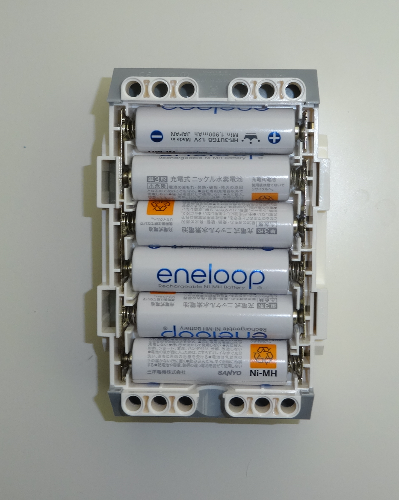
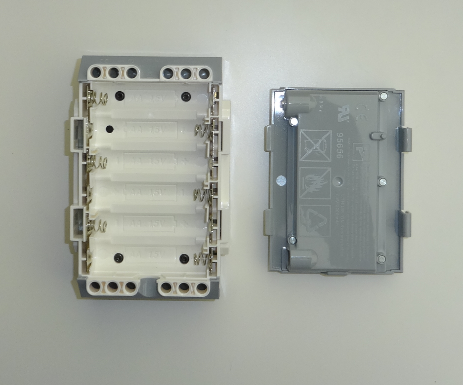
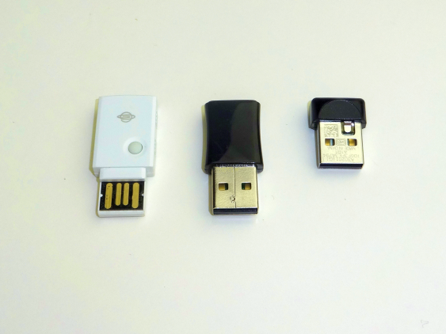
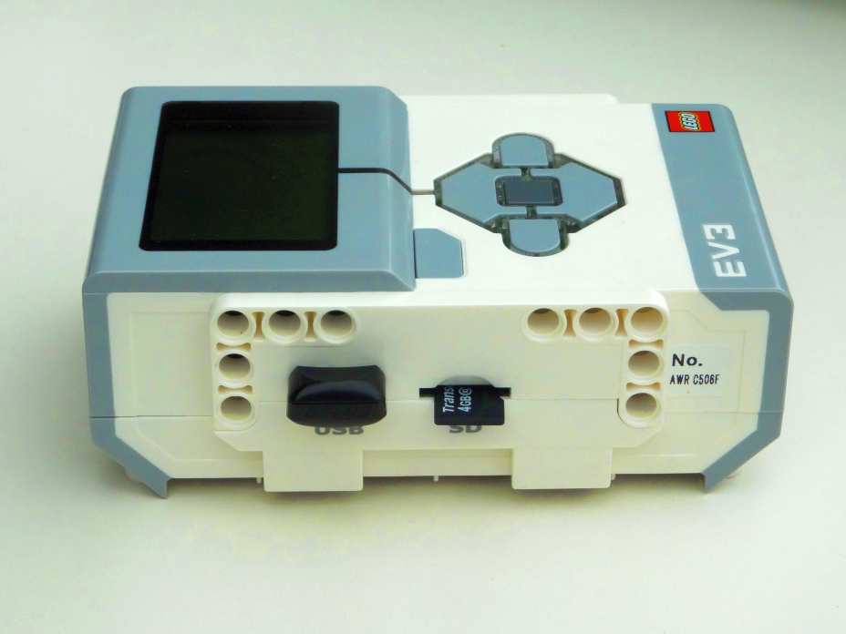
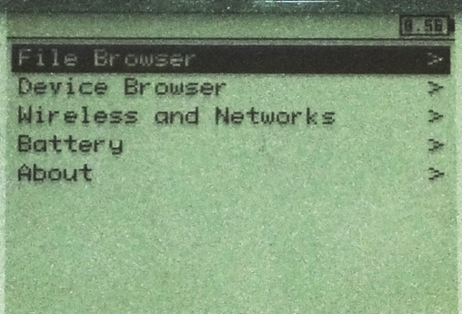
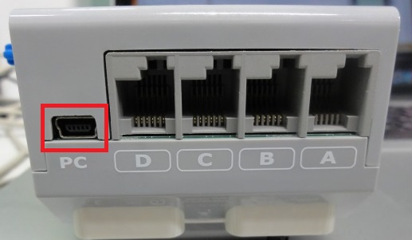

<!-- Title: Initial Setup of EV3 and ev3dev -->
<!-- -*- pukiwiki-edit -*- -->
<!-- * Initial Setup of EV3 and ev3dev -->

#contents

## Installing Batteries, Wireless LAN, and SD Card

### Batteries

The EV3 can be powered by six AA batteries or a dedicated battery pack. Insert either six AA batteries or the dedicated battery pack.

<div align="center"><a href="EV3_with_AAAbattery.png"></a></div>
<div align="center"><strong>AA Batteries</strong></div>

<div align="center"><a href="EV3_with_battery.png"></a></div>
<div align="center"><strong>Dedicated EV3 Battery Pack</strong></div>

### Wireless LAN

Prepare a USB wireless LAN adapter. The EV3 can also connect to the Internet through a PC using a wired connection, but this guide assumes a wireless LAN connection.

Most recent wireless LAN dongles should work. The following dongles have been tested and confirmed to work:

- BUFFALO WLI-UC-GNM2 Wireless LAN Adapter
- BUFFALO WLI-UC-GN Wireless LAN Adapter
- PLANEX GW-USMicro300

<div align="center"><a href="wlan_dongle.png"></a></div>
<div align="center"><strong>Example Wireless LAN Dongle</strong></div>

For other connection methods, refer to the ev3dev website.

- [Internet Connection via Bluetooth](http://www.ev3dev.org/docs/tutorials/connecting-to-the-internet-via-bluetooth/)
- [Connection via USB](http://www.ev3dev.org/docs/tutorials/connecting-to-the-internet-via-usb/)
- [Bluetooth Tethering](http://www.ev3dev.org/docs/tutorials/using-bluetooth-tethering/)
- [USB Tethering](http://www.ev3dev.org/docs/tutorials/using-usb-tethering/)

### Inserting the SD Card

Insert the SD card containing the ev3dev image into the side of the EV3 controller together with the wireless LAN dongle as shown below.

<div align="center"><a href="ev3_wlan_sdcard.png"></a></div>
<div align="center"><strong>Insert the Wireless LAN Dongle and SD Card into the Side of the EV3</strong></div>

## Starting ev3dev

Insert the SD card and press the power button (the dark gray button in the center of the directional pad) to power on the EV3.

The following boot screen will appear and the LEDs around the directional pad will flash.

<div align="center"><a href="ev3dev_screen_booting.png"></a></div>
<div align="center"><strong>ev3dev Boot Screen</strong></div>

After about one minute, startup will complete and the following screen will be displayed.

<div align="center"><a href="ev3dev_screen.png"></a></div>
<div align="center"><strong>Screen Immediately After Startup</strong></div>

## SSH Login

### Connecting to a Network

Immediately after startup, the EV3 is not connected to a network.

From the initial screen, use the directional buttons to select **Wireless and Networks**, then press the Enter button (the dark gray center button).

```text
 ------------------------------
                       V [8.12>
 ------------------------------
  File Brower                >
  Device Browser             >
 [Wireless and Networks      > ]
  Battery                    >
  About                      >
 ------------------------------
```

You will see the following screen:

```text
 ------------------------------
      Wireless and Network
 ------------------------------
        Status: Offline
 ------------------------------
 Bluetooth                    >
 USB                          >
 Wifi                         >
 All Network Connections      >
 Tethering                    >
 Offline Mode                □
 ------------------------------
```

Select **WiFi** to open the following screen:

```text
 ------------------------------
           WiFi
 ------------------------------
 Powered                      □
 Start Scan
            Networks
 ------------------------------
 [* MyWirelessNetwork   ?? ]

 ------------------------------
```

Turn **Powered** ON, scan for available networks, and select the SSID you want to connect to.

```text
 ------------------------------
      MyWirelessNetwork
 ------------------------------
 Status:                 Online
 Signal                     83%
 Security        WPA/2 PSK, WPS
 IP Address:
 [    Connect   ]
 [      Network Connection     ]
```

Select **Connect** and press Enter. A dialog for entering the key will appear. Press Enter again to display the keyboard shown below and enter the network key.

```text
 [_                           ]
 [ABC] [abc] [123] [!@# ] [INS]
 [Q][W][E][R][T][Y][U][I][O][P]
 [A][S][D][F][G][H][J][K][L][ ]
 [ ][Z][X][C][V][B][N][M][ ][ ]
 [ Accept ]          [ Cancel ]
```

After entering the key, select **Accept** and press Enter. The key will appear in the previous dialog. Press **Accept** again.

After a short wait, the EV3 should connect to the specified wireless LAN access point.

Press the Back button (bottom-left button on the screen) several times to return to the home screen.

The assigned IP address should now appear in the upper-left corner.

```text
 --------------------------
 192.168.11.3          V [8.12>
 --------------------------
  File Brower                >
  Device Browser             >
 [Wireless and Networks      > ]
  Battery                    >
  About                      >

 --------------------------
```

### Connecting via USB Cable

If wireless LAN cannot be used for some reason, you can connect via USB cable.

Connect the EV3 and PC using the supplied USB cable.

<div align="center"><a href="s_DSC00467.JPG"></a></div>

From the ev3dev home screen, select **Wireless and Networks**.

Next, select **All Network Connections**.

```text
 ------------------------------
      Wireless and Network
 ------------------------------
        Status: Offline
 ------------------------------
 Bluetooth                    >
 Wifi                         >
 All Network Connections      > ]
 Tethering                    >
 Offline Mode                □
 ------------------------------
```

Select **Wired**.

```text
 ------------------------------
      All Network Connections
 ------------------------------
 Wired                        ψ ]
 ------------------------------
```

Select **Connect** to establish the connection.

```text
 ------------------------------
             Wired
 ------------------------------
        Status: Offline
 ------------------------------
 Connect                        ]
 Connect automatically       □
 IPv4                         >
 DNS                          >
 ENET                         >
 ------------------------------
```

#### Configuring USB Tethering

This section explains how to configure USB tethering on the EV3.

First, select **Wireless and Networks** from the ev3dev home screen.

Next, select **Tethering**.

```text
 ------------------------------
      Wireless and Network
 ------------------------------
        Status: Offline
 ------------------------------
 Bluetooth                    >
 Wifi                         >
 All Network Connections      >
 Tethering                    > ]
 Offline Mode                □
 ------------------------------
```

Enable **Gadget**.

```text
 ------------------------------
           Tethering
 ------------------------------
 Bluetooth                   □
 Gadget                      ■
 Network Info                 >
 ------------------------------
```

### Logging In

Connect to the EV3 via SSH using the assigned IP address.

By default, ev3dev uses the following credentials:

<table class="table-alt">
  <tr>
    <td>ID</td>
    <td>robot</td>
  </tr>
  <tr>
    <td>Password</td>
    <td>maker</td>
  </tr>
</table>

On Windows, use terminal software such as Tera Term.

On Linux, connect from a terminal using:

```bash
$ ssh robot@<IP address>
```

After logging in, you should see a screen similar to the following:

```text
             _____     _
   _____   _|___ /  __| | _____   __
  / _ \ \ / / |_ \ / _` |/ _ \ \ / /
 |  __/\ V / ___) | (_| |  __/\ V /
  \___| \_/ |____/ \__,_|\___| \_/

 Debian jessie on LEGO MINDSTORMS EV3!

 The programs included with the Debian GNU/Linux system are free software;
 the exact distribution terms for each program are described in the
 individual files in /usr/share/doc/*/copyright.

 Debian GNU/Linux comes with ABSOLUTELY NO WARRANTY, to the extent
 permitted by applicable law.
 Last login: Tue Aug  4 01:34:12 2015 from openrtm.org
 root@ev3dev:~#
```

### Installing Tera Term (Reference)

To log in to the EV3 from Windows via SSH, an SSH client must be installed.

Many SSH clients are available for Windows; here we introduce Tera Term.

- [Tera Term](http://sourceforge.jp/projects/ttssh2/)

Download and install Tera Term from the link above.

<div align="center"><a href="teraterm_connect.png"></a></div>
<div align="center"><strong>Connecting with Tera Term</strong></div>

After installation, start Tera Term. The connection dialog will appear.

Enter the hostname configured earlier followed by **.local** in the Host field and click OK.

## Configuration

### Wireless LAN Configuration

The wireless LAN settings configured above will be lost after rebooting.

To automatically reconnect after startup, log in to the EV3 and configure the wireless LAN connection.

### Editing /etc/wpa_supplicant/wpa_supplicant.conf

Register the ESSID and key for your wireless LAN.

```bash
# cd /etc/wpa_supplicant
# wpa_passphrase ESSID pass >> wpa_supplicant.conf
```

Replace `ESSID` with your wireless LAN ESSID and `pass` with the network key.

Be careful to use **>>** (append) rather than **>** (overwrite).

The resulting file should look similar to this:

```text
ctrl_interface=DIR=/var/run/wpa_supplicant GROUP=netdev
update_config=1
network={
        ssid="OpenRTM"
        #psk="4332221111"
        psk=142914b76be167767055ff945898baaaf83c42b3ad3b99afb0ae531e8fb15e5e
}
```

Normally this is sufficient, but depending on your wireless access point configuration, additional settings may be required.

Example:

```text
ctrl_interface=DIR=/var/run/wpa_supplicant GROUP=netdev
update_config=1
network={
        ssid="OpenRTM"
        proto=WPA2
        key_mgmt=WPA-PSK
        pairwise=TKIP CCMP
        group=TKIP CCMP
        #psk="4332221111"
        psk=142914b76be167767055ff945898baaaf83c42b3ad3b99afb0ae531e8fb15e5e
}
```

Finally, reinitialize the interface:

```bash
# ifdown wlan0 ; ifup wlan0
```

To verify the configuration, reboot the EV3:

```bash
# reboot
```

After rebooting, if everything is configured correctly, the IP address should appear in the upper-left corner of the screen.

### Remote Access Using a Hostname

You can connect to the EV3 using the IP address displayed in the upper-left corner after connecting to a wireless LAN.

However, because the IP address is assigned by DHCP, it may change each time you connect.

ev3dev includes **avahi**, a Bonjour-compatible service.

Bonjour is a service proposed by Apple that automatically discovers services on a network.

Using avahi, you can access an EV3 with a dynamically assigned IP address by hostname.

#### Setting the Hostname

By default, ev3dev uses the hostname **ev3dev**.

Other machines with avahi or Bonjour installed can access it using the hostname **ev3dev.local**.

If multiple EV3 units are connected to the same network, configure unique hostnames.

```bash
$ sudo vi /etc/hostname
```

Enter the hostname on the first line of `/etc/hostname`.

### Installing avahi-daemon

To access the EV3 from a Linux host, avahi must be installed.

Most modern Linux distributions already include it, but if not, install it as follows (for Debian-based distributions):

```bash
$ sudo apt-get update
$ sudo apt-get install avahi-daemon
```

Test the connection by pinging the EV3:

```bash
$ ping ev3dev.local
```

If you receive replies, avahi is configured correctly.

### Installing Bonjour (Windows Only)

To access the EV3 from a PC, avahi or Bonjour must also be installed on the PC side.

Bonjour is not installed by default on Windows.

The easiest way to install Bonjour is by installing iTunes.

- [Download iTunes](http://www.apple.com/jp/itunes/download/)

If you do not want to install iTunes, you can extract `BonjourSetup.exe` from the downloaded `iTunesSetup.exe` using an archive utility.

Bonjour is also included in Apple's Bonjour Print Services package.

- [Apple Bonjour](http://www.apple.com/jp/support/bonjour/)
  - [Bonjour Print Services (v2.0.2.0)](http://support.apple.com/kb/DL999)

Apple no longer distributes Bonjour for Windows as a standalone package, but some third-party sites redistribute older versions. Use them at your own risk.

- [BonjourSetup.exe (v1.0.6.2)](http://www.download3k.com/Install-Bonjour.html)
- [Bonjour64Setup.exe (v1.0.6.2)](http://download.techworld.com/760/apple-bonjour-for-windows-106-64-bit/)
- [Apple Bonjour SDK (requires Apple Developer login)](https://developer.apple.com/downloads/index.action?q=Bonjour%20SDK%20for%20Windows)

#### If Bonjour Does Not Work Properly

If a firewall is enabled, Bonjour may not function correctly.

In that case, open UDP port 5353 or disable the firewall.

- [Bonjour for Windows does not work because of firewall settings](http://support.apple.com/kb/TS2235?viewlocale=ja_JP)

