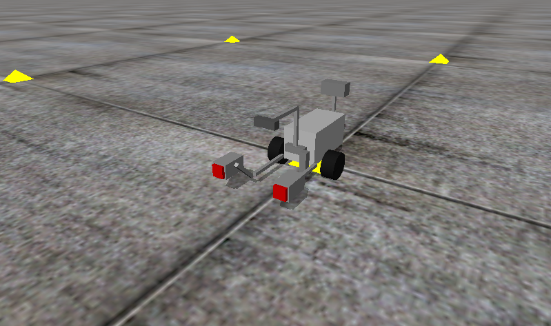
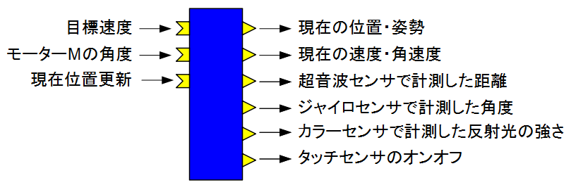
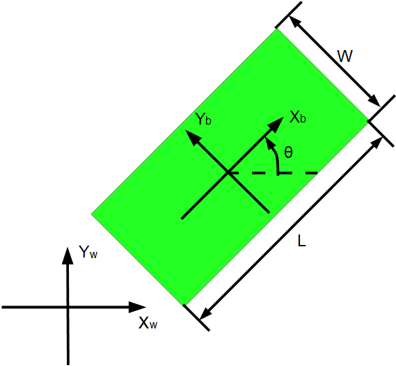
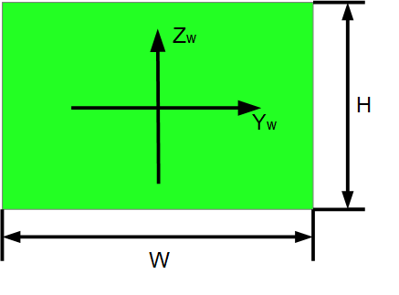

-------jp page!!-------

<!-- Title: シミュレーター利用方法 -->
#contents

このページでは Educator Vehicle 改 のシミュレーター RTC の仕様、利用方法について説明します。

# 仕様

<table class="table-alt">
  <tr>
    <th colspan="3" style="text-align: center;">EV3Simulator</th>
  </tr>
  <tr>
    <td colspan="3" style="text-align: center;">InPort</td>
  </tr>
  <tr>
    <td>名前</td>
    <td>データ型</td>
    <td>説明</td>
  </tr>
  <tr>
    <td>velocity2D</td>
    <td>RTC::TimedVelocity2D</td>
    <td>目標速度</td>
  </tr>
  <tr>
    <td>angle</td>
    <td>RTC::TimedDouble</td>
    <td>Mモーターの角度</td>
  </tr>
  <tr>
    <td>pos_update</td>
    <td>RTC::TimedPose2D</td>
    <td>現在位置更新</td>
  </tr>
  <tr>
    <td colspan="3" style="text-align: center;">OutPort</td>
  </tr>
  <tr>
    <td>名前</td>
    <td>データ型</td>
    <td>説明</td>
  </tr>
  <tr>
    <td>odometry</td>
    <td>RTC::TimedPose2D</td>
    <td>現在の位置</td>
  </tr>
  <tr>
    <td>current_vel</td>
    <td>RTC::TimedVelocity2D</td>
    <td>現在の速度</td>
  </tr>
  <tr>
    <td>ultrasonic</td>
    <td>RTC::RangeData</td>
    <td>超音波センサーで計測した距離</td>
  </tr>
  <tr>
    <td>gyro</td>
    <td>RTC::TimedDouble</td>
    <td>ジャイロセンサーで計測した角度</td>
  </tr>
  <tr>
    <td>light_reflect</td>
    <td>RTC::TimedDouble</td>
    <td>カラーセンサーで計測した反射光の強さ</td>
  </tr>
  <tr>
    <td>touch</td>
    <td>RTC::TimedBooleanSeq</td>
    <td>タッチセンサーのオンオフ。右側が0番目の要素、左側が1番目の要素</td>
  </tr>
  <tr>
    <td colspan="3" style="text-align: center;">コンフィギュレーションパラメーター</td>
  </tr>
  <tr>
    <td>名前</td>
    <td>デフォルト値</td>
    <td>説明</td>
  </tr>
  <tr>
    <td>medium_motor_speed</td>
    <td>1.6</td>
    <td>モーターMの速度</td>
  </tr>
  <tr>
    <td>blocksConfigFile</td>
    <td>None</td>
    <td>障害物の配置設定ファイルの名前</td>
  </tr>
  <tr>
    <td>touchSensorOnLength</td>
    <td>0.003</td>
    <td>タッチセンサーをオンと判定する押し込んだ距離</td>
  </tr>
  <tr>
    <td>lightReflectThreshold</td>
    <td>0.1</td>
    <td>カラーセンサーから物体までの距離がこの値以下になると255を出力</td>
  </tr>
  <tr>
    <td>plane_exist</td>
    <td>0</td>
    <td>1の時は新たに地面作成</td>
  </tr>
  <tr>
    <td>plane_x</td>
    <td>0</td>
    <td>地面の位置(X)</td>
  </tr>
  <tr>
    <td>plane_y</td>
    <td>0</td>
    <td>地面の位置(Y)</td>
  </tr>
  <tr>
    <td>plane_z</td>
    <td>0</td>
    <td>カラーセンサーから物体までの距離がこの値以下になると255を出力</td>
  </tr>
  <tr>
    <td>plane_lx</td>
    <td>1.0</td>
    <td>地面の長さ</td>
  </tr>
  <tr>
    <td>plane_ly</td>
    <td>1.0</td>
    <td>地面の幅</td>
  </tr>
  <tr>
    <td>plane_lz</td>
    <td>1.0</td>
    <td>地面の高さ</td>
  </tr>
  <tr>
    <td>draw_time</td>
    <td>0.01</td>
    <td>描画の周期</td>
  </tr>
  <tr>
    <td>sampling_time</td>
    <td>-1</td>
    <td>シミュレーションの刻み幅。負の値に設定した場合は実行コンテキストの周期で設定</td>
  </tr>
</table>

# 使用方法

以下からダウンロードできます。

- [ZIPファイル](https://github.com/Nobu19800/EV3SimulatorRTC/archive/master.zip)

展開したフォルダーの EXEフォルダー内に実行ファイル (EV3SimulatorComp.exe) があります。
この EXEファイルを実行すると RTC が起動します。

## コンフィギュレーションパラメーター
### 障害物の設定ファイル
blocksConfigFile というパラメーターで障害物の配置を設定する CSVファイルを指定できます。
サンプルとして test.csv というファイルを用意してあります。

このファイルに位置、角度、サイズを記述してください。

<table class="table-alt">
  <tr>
    <td>位置(X)</td>
    <td>位置(Y)</td>
    <td>位置(Z)</td>
    <td>長さ(L)</td>
    <td>幅(W)</td>
    <td>高さ(H)</td>
    <td>角度(θ)</td>
  </tr>
  <tr>
    <td>0.3</td>
    <td>0.0</td>
    <td>0.0</td>
    <td>0.1</td>
    <td>1.0</td>
    <td>0.3</td>
    <td>0.0</td>
  </tr>
</table>

ブロックは何個でも設定可能です。

### 地面の設定
Educator Vehicle 改 は超音波センサーにより設置可能な地面の有無を検知して回避する運動が可能になっています。
この制御シミュレーションのために、地面を新たに作成するコンフィギュレーションパラメーターを用意してあります。

plane_existを1に設定後、地面の位置、サイズを設定してください。
-------jp page!!-------
