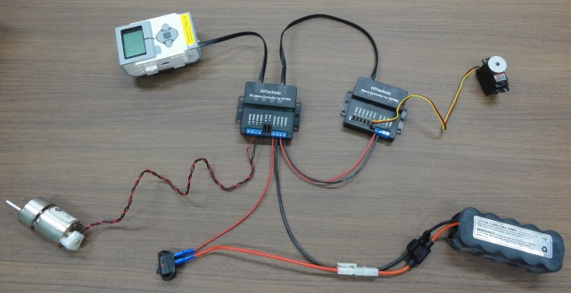
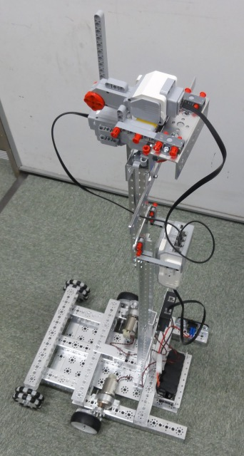
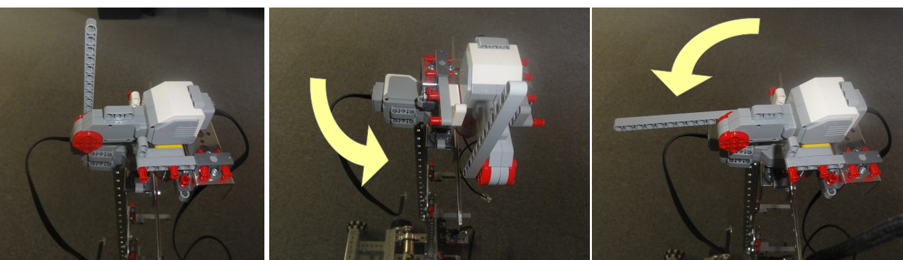
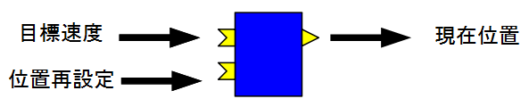
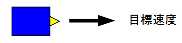

-------jp page!!-------

<!-- Title: TETRIX の利用方法 -->
#contents
## 概要
TETRIX は Pitsco Education が販売している LEGO Mindstroms の拡張製品です。
アルミ製フレーム、高トルクのモーター等がセットに含まれており、本格的なロボットの製作が可能になります。

- [http://www.afrel.co.jp/lineup/tetrix](http://www.afrel.co.jp/lineup/tetrix)

## 仕様

- DCモーター
<table class="table-alt">
  <tr>
    <th>電圧</th>
    <th>12V</th>
  </tr>
  <tr>
    <td>静止トルク</td>
    <td>2.1N・m</td>
  </tr>
  <tr>
    <td>回転数</td>
    <td>152rpm</td>
  </tr>
</table>

- RCサーボ
<table class="table-alt">
  <tr>
    <th>名前</th>
    <th>HS-485HB(HITEC)</th>
  </tr>
  <tr>
    <td>電圧</td>
    <td>6V</td>
  </tr>
  <tr>
    <td>静止トルク</td>
    <td>0.59N・m</td>
  </tr>
  <tr>
    <td>回転数</td>
    <td>56rpm</td>
  </tr>
</table>

## モータードライバ
TETRIX ベースセットには DCモータードライバ (DC Motor Controller for TETRIX)、RCサーボドライバ (Servo Controller for TETRIX) が付属しています。

これらのモータードライバと EV3 を接続することで DCモーター及び RCサーボの制御が可能になります。

## 接続方法
以下のように接続してください。

<div align="center"><a href="s_DSC00776.JPG"></a></div>

接続してモータードライバの電源が ON の状態で EV3 の電源を投入してください。

## 操作方法
EV3 とモータードライバの通信は I2C により行います。

接続に成功している場合、/dev以下にi2c-3、i2c-4、i2c-5、i2c-6 のいずれかのデバイスファイルが追加されているはずです。
後ろの値がポート番号に2を足した値になっています。例えばポート1に接続した場合は i2c-3 になります。
以下で ev3dev上で C++、及び Python によるモータードライバの制御方法について述べます。

まずは I2C 通信に必要なファイルをインクルードしてください。

- C++
```
 #include <fcntl.h>
 #include <sys/ioctl.h>
 #include <linux/i2c-dev.h>
```

- Python
```
 import smbus
```


I2C の通信を開始します。


- C++
```
 int fd; = open("/dev/i2c-3", O_RDWR);
```
<!-- ioctl(fd, I2C_SLAVE, "0x01") -->

- Python
```
 sm = smbus.SMBus(3)
```


モータードライバのアドレスは 0x01 に設定されますが、デイジーチェインで接続した場合 0x02～0x08 に設定されます。
上記の接続の場合、DCモータードライバは 0x01 で RCサーボドライバは 0x02 に設定されているはずです。
まずは DCモータードライバを操作してみます。

### DCモータードライバ

制御モードを設定します。
モーター1 は 0x44、モーター2 は 0x47 のレジスタに以下の値を書き込むことで制御モードが設定可能です。
※TETRIX ベースセットにはエンコーダーは付属していないので速度制御、位置制御モードを使用する場合は別途購入する必要があります。

<table class="table-alt">
  <tr>
    <th>入力値</th>
    <th>制御モード</th>
  </tr>
  <tr>
    <td>0b00</td>
    <td>PWM</td>
  </tr>
  <tr>
    <td>0b01</td>
    <td>速度制御</td>
  </tr>
  <tr>
    <td>0b10</td>
    <td>位置制御</td>
  </tr>
  <tr>
    <td>0b11</td>
    <td>エンコーダーリセット</td>
  </tr>
</table>

<br>
PWM モードに設定します。

- C++
```
 ioctl(fd, I2C_SLAVE, 0x01)
 unsigned char buf[2] = {0x44, 0x00};
 write(fd, buf, 2);
```

- Python
```
 sm.write_i2c_block_data(0x01, 0x44, [0x00])
```


最後に PWM の幅を設定します。
モーター1は 0x45、モーター2 は 0x46 のレジスタに書き込むことにより設定可能です。
PWM は正回転するばあいは 1～127 の値、逆回転する場合は -127～-1 の値で設定できます。
ただし、0 の場合はフロートモードで停止、128 の場合はブレーキモードで停止します。

- C++
```
 unsigned char buf[2] = {0x45, 0x30};
 write(fd, buf, 2);
```

- Python
```
 sm.write_i2c_block_data(0x01, 0x45, [0x30])
```


### RCサーボドライバ
RCサーボドライバは最大6個の RCサーボを制御可能であり、0x42～0x47 のレジスタに目標角度を書き込むことで制御できます。
パルス幅は 0.75ms～2.25ms で設定可能です。

- C++
```
 ioctl(fd, I2C_SLAVE, 0x02)
 unsigned char buf[2] = {0x42, 0x60};
 write(fd, buf, 2);
```

- Python
```
 sm.write_i2c_block_data(0x02, 0x42, [0x60])
```

## 応用例
以下は DCモーターを利用した乗り物の作成例です。

<div align="center"><a href="s_DSC00777.JPG"></a></div>

取っ手部分にLモーターが2個取り付けられており、Lモーターを回転させることで車体の制御が可能になっています。

<div align="center"><a href="tetrix_device.png"></a></div>

使用した RTC は以下の通りです。

### TetrixVehicle
上記の乗り物を制御するためのコンポーネントです。

- https://github.com/Nobu19800/TetrixVehicle

<div align="center"><a href="TetrixVehicle.png"></a></div>

<table class="table-alt">
  <tr>
    <th colspan="3" style="text-align: center;">TetrixVehicle</th>
  </tr>
  <tr>
    <td colspan="3" style="text-align: center;">InPort</td>
  </tr>
  <tr>
    <td>名前</td>
    <td>データ型</td>
    <td>説明</td>
  </tr>
  <tr>
    <td>target_velocity</td>
    <td>RTC::TimedVelocity2D</td>
    <td>目標速度</td>
  </tr>
  <tr>
    <td>update_position</td>
    <td>RTC::TimedPose2D</td>
    <td>位置の再設定</td>
  </tr>
  <tr>
    <td colspan="3" style="text-align: center;">OutPort</td>
  </tr>
  <tr>
    <td>名前</td>
    <td>データ型</td>
    <td>説明</td>
  </tr>
  <tr>
    <td>position</td>
    <td>RTC::TimedPose2D</td>
    <td>現在位置</td>
  </tr>
  <tr>
    <td colspan="3" style="text-align: center;">コンフィギュレーションパラメータ-</td>
  </tr>
  <tr>
    <td>名前</td>
    <td>デフォルト値</td>
    <td>説明</td>
  </tr>
  <tr>
    <td>wheelRadius</td>
    <td>0.04</td>
    <td>車輪の半径</td>
  </tr>
  <tr>
    <td>wheelDistance</td>
    <td>0.34</td>
    <td>車輪間の距離</td>
  </tr>
  <tr>
    <td>portNum</td>
    <td>1</td>
    <td>ポート番号</td>
  </tr>
  <tr>
    <td>rot_dir_left_motor</td>
    <td>1</td>
    <td>左車輪の回転方向</td>
  </tr>
  <tr>
    <td>rot_dir_righteft_motor</td>
    <td>-1</td>
    <td>右車輪の回転方向</td>
  </tr>
  <tr>
    <td>GearRatio</td>
    <td>3.0</td>
    <td>ギア比</td>
  </tr>
</table>


### VehicleController
Lモーターの角度から車体の目標速度を出力するコンポーネントです。

- [https://github.com/Nobu19800/VehicleController](https://github.com/Nobu19800/VehicleController)

<div align="center"><a href="VehicleController.png"></a></div>

<table class="table-alt">
  <tr>
    <th colspan="3" style="text-align: center;">TetrixVehicle</th>
  </tr>
  <tr>
    <td colspan="3" style="text-align: center;">OutPort</td>
  </tr>
  <tr>
    <td>名前</td>
    <td>データ型</td>
    <td>説明</td>
  </tr>
  <tr>
    <td>out</td>
    <td>RTC::TimedVelocity2D</td>
    <td>目標速度</td>
  </tr>
  <tr>
    <td colspan="3" style="text-align: center;">コンフィギュレーションパラメーター</td>
  </tr>
  <tr>
    <td>名前</td>
    <td>デフォルト値</td>
    <td>説明</td>
  </tr>
  <tr>
    <td>rotation_by_angle</td>
    <td>-0.6</td>
    <td>根元のモーターの角度に対する目標角速度の変化量</td>
  </tr>
  <tr>
    <td>velocity_by_angle</td>
    <td>-0.1</td>
    <td>先端のモーターの角度に対する目標速度の変化量</td>
  </tr>
</table>

-------jp page!!-------
