-------jp page!!-------

<!-- Title: チュートリアル(EV3) -->
#contents

このページでは RTM講習会での EV3 操作手順を説明します。
<br>

実習では以下の Educator Vehicle 改を制御します。

<br>

<div align="center"><a href="s_DSC00443.JPG"></a></div>
<br>

LEGO Mindstorms EV3 は LEGO の Mindstorms シリーズの新しいパッケージです。EV3 のメインのコントローラーは、Linux が標準搭載され、様々な言語でロボットの開発が可能になりました。

## 仕様

- [アフレル Webページ](http://www.afrel.co.jp/)

<table class="table-alt">
  <tr>
    <td colspan="2" style="text-align: center;"><strong>LEGO Mindstorms EV3 仕様</strong></td>
  </tr>
  <tr>
    <td>プロセッサ</td>
    <td>ARM9 300MHz</td>
  </tr>
  <tr>
    <td>メモリ(ROM)</td>
    <td>16MB Flash</td>
  </tr>
  <tr>
    <td>メモリ(RAM)</td>
    <td>64MB RAM</td>
  </tr>
  <tr>
    <td>OS</td>
    <td>Linuxベース</td>
  </tr>
  <tr>
    <td>ディスプレイ</td>
    <td>178 x 128 pixels</td>
  </tr>
  <tr>
    <td>出力ポート</td>
    <td>4個</td>
  </tr>
  <tr>
    <td>入力ポート</td>
    <td>4個 <br> アナログ <br> デジタル 460.8kbit/s</td>
  </tr>
  <tr>
    <td>USB通信速度</td>
    <td>High Speed (480Mbps)</td>
  </tr>
  <tr>
    <td>USBインターフェース</td>
    <td>EV3同士の連結可能 (最大4台) <br> Wi-Fi通信ドングル利用可能</td>
  </tr>
  <tr>
    <td>SDカードスロット</td>
    <td>Micro SDカード 32GBまでサポート</td>
  </tr>
  <tr>
    <td>スマートデバイス接続</td>
    <td>iOS、Android、Windows</td>
  </tr>
  <tr>
    <td>ユーザーインターフェース</td>
    <td>6ボタン, イルミネーション機能</td>
  </tr>
  <tr>
    <td>プログラムサイズ （ライントレースの場合）</td>
    <td>0.950KB</td>
  </tr>
  <tr>
    <td>センサー通信性能</td>
    <td>1000 回/秒、1ms</td>
  </tr>
  <tr>
    <td>データロギング</td>
    <td>最大 1,000サンプリング/秒</td>
  </tr>
  <tr>
    <td>Bluetooth通信</td>
    <td>最大7台のスレーブと接続可能</td>
  </tr>
  <tr>
    <td>動力</td>
    <td>リチャージブルバッテリー または、単3電池 6本</td>
  </tr>
</table>

## デバイス
EV3 には以下のデバイスが付属しています。

<table class="table-alt">
  <tr>
    <td>ジャイロセンサー</td>
    <td>確度モード: 精度 +/- 3°<br> 角速度モード: 最大 440 deg/sec <br> サンプリングレート 1,000 Hz</td>
  </tr>
  <tr>
    <td>カラーセンサー</td>
    <td>計測: 赤色光の反射光、 周囲の明るさ、色 <br> 検出カラー数: 8色 （無色、黒、青、緑、黄、赤、白、茶）<br> サンプリングレート	1,000 Hz <br> 距離 約1mm～18mm（アフレル調査値）</td>
  </tr>
  <tr>
    <td>タッチセンサー</td>
    <td>オン (1), オフ (0) <br> スイッチ可動域: 約4mm</td>
  </tr>
  <tr>
    <td>超音波センサー</td>
    <td>距離計測可能範囲: 3cmから250cm <br> 距離計測精度: +/- 1 cm <br> 前面電飾: 点灯：超音波発信中、 点滅：超音波観測中</td>
  </tr>
  <tr>
    <td>
    </td>
    <td>
    </td>
  </tr>
  <tr>
    <td>EV3 Lモーター</td>
    <td>フィードバック: 1°単位 <br> 回転数: 160から170RPM <br> 定格トルク: 0.21 N・m (30oz*in) <br> 停動トルク: 0.42 N・m (60oz*in) <br> 重さ: 76 g</td>
  </tr>
  <tr>
    <td>EV3 Mモーター</td>
    <td>フィードバック 1°単位 <br> 回転数: 240から250RPM <br> 定格トルク: 0.08 N・m (11oz*in) <br> 停動トルク: 0.12 N・m (17oz*in) <br> 重さ: 36 g</td>
  </tr>
</table>


## ダウンロード
最初にPC側で使用する RTC 等をダウンロードしてください。

- [RTM_Tutorial_EV3.zip](https://github.com/OpenRTM/RTM_Tutorial_EV3/archive/master.zip)

ZIPファイルを [Lhaplus](http://www.vector.co.jp/soft/win95/util/se169348.html) 等で展開してください。

## EV3 の組み立て方

EV3 は分解した状態で参加者に配ります。
組み立て方は以下の通りです。


※超音波センサー、カラーセンサー、ジャイロセンサーについては、講習で使用しないため取り付ける必要はありません。
以下の※の作業については、時間が余った人が実施してください。

まずは土台部分を取り出してください。

<br>

<div align="center"><a href="s_DSC00463.JPG"></a></div>
<br>


最初にMモーターにケーブル(25cm)を接続します※。

<br>

<div align="center"><a href="s_DSC00446.JPG"></a></div>
<br>


次に EV3 本体を取り付けます。
Mモーターにケーブルを接続した場合は、ケーブルが左側の隙間から出るようにしてください。


<br>

<div align="center"><div align="center"><a href="s_DSC00448.JPG"></a></div>;  <div align="center"><a href="s_DSC00450.JPG"></a></div>;</div>
<br>
<br>


右側のタッチセンサーを取り付けてください。

<br>

<div align="center"><div align="center"><a href="s_DSC00451.JPG"></a></div>;  <div align="center"><a href="s_DSC00452.JPG"></a></div>;</div>
<br>
<br>

超音波センサーを取り付けてください※。

<br>

<div align="center"><a href="s_DSC00454.JPG"></a></div>
<br>


ケーブルを接続してください。
必須なのは車輪駆動用のLモーター右、Lモーター左、タッチセンサーだけです。

<table class="table-alt">
  <tr>
    <td>Lモーター右</td>
    <td>ポート C</td>
    <td>25cmケーブル</td>
  </tr>
  <tr>
    <td>Lモーター左</td>
    <td>ポート B</td>
    <td>25cmケーブル</td>
  </tr>
  <tr>
    <td>Mモーター※</td>
    <td>ポートA</td>
    <td>25cmケーブル</td>
  </tr>
  <tr>
    <td>タッチセンサー右</td>
    <td>ポート 3</td>
    <td>35cmケーブル</td>
  </tr>
  <tr>
    <td>タッチセンサー左</td>
    <td>ポート 1</td>
    <td>35cmケーブル</td>
  </tr>
  <tr>
    <td>超音波センサー※</td>
    <td>ポート 4</td>
    <td>50cmケーブル</td>
  </tr>
  <tr>
    <td>ジャイロセンサー※</td>
    <td>ポート 2</td>
    <td>25cmケーブル</td>
  </tr>
</table>

ケーブルは EV3 の上下に A～D と 1～4 のポートがあるのでそこにケーブルを接続します。

<br>

<div align="center"><div align="center"><a href="s_DSC00.JPG"></a></div>;  <div align="center"><a href="s_DSC00471.JPG">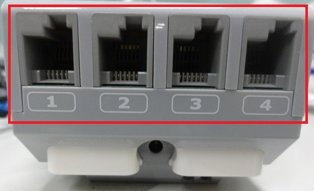</a></div>;</div>
<br>
<br>

<br>

<div align="center"><div align="center"><a href="s_DSC00455.JPG">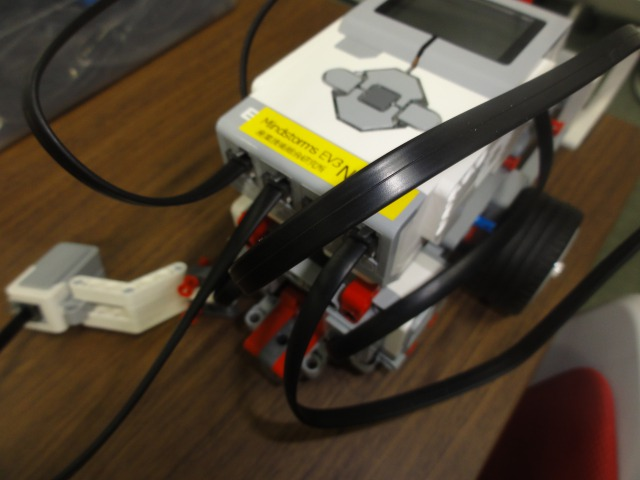</a></div>;  <div align="center"><a href="s_DSC00456.JPG">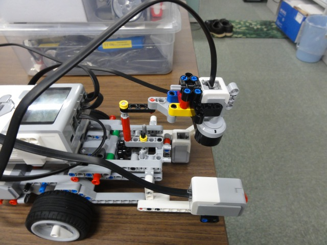</a></div>;</div>
<br>
<br>


左右にパーツを取り付けます※。
Lモーター右、Lモーター左、Mモーター、タッチセンサー右、タッチセンサー左のケーブルを挟むようにして取り付けてください※。
<br>

Lモーター右、タッチセンサー右のケーブルは右側から、Lモーター左、Mモーター、タッチセンサー左は左側から通してください※。

<br>

<div align="center"><a href="s_DSC00457.JPG"></a></div>
<br>


<br>

<div align="center"><a href="s_DSC00459.JPG">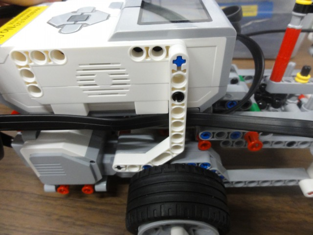</a></div>
<br>

これでとりあえず完成ですが、余裕のある人はジャイロセンサーを取り付けてみてください※。


<br>

<div align="center"><div align="center"><a href="s_DSC00460.JPG"></a></div>;  <div align="center"><a href="s_DSC00461.JPG">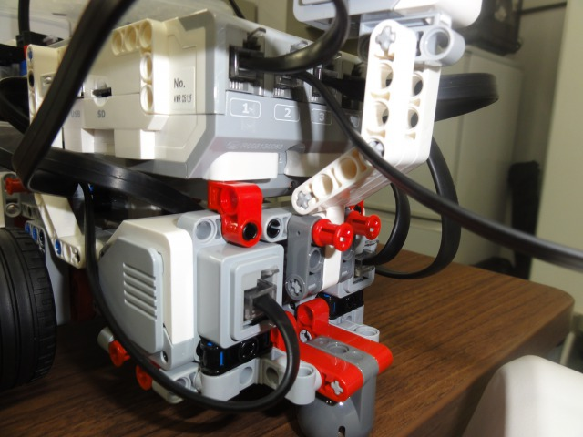</a></div>;</div>
<br>
<br>

## 電源の入れ方/切り方

### 電源の入れ方

中央のボタンを押せば電源が投入されます。

<br>

<div align="center"><a href="ev3_on.jpg">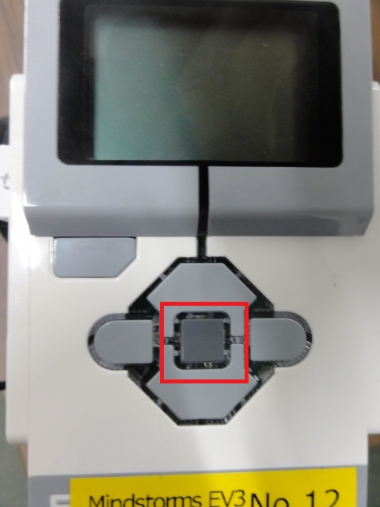</a></div>
<br>

### 電源の切り方

EV3 の電源を切る場合は最初の画面で EV3 本体の左上の戻るボタンを押して「Power Off」を選択してください。

<br>

<div align="center"><a href="ev3_off.jpg">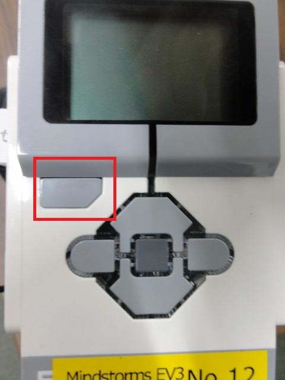</a></div>
<br>


<br>

<div align="center"><a href="s_DSC01033.JPG">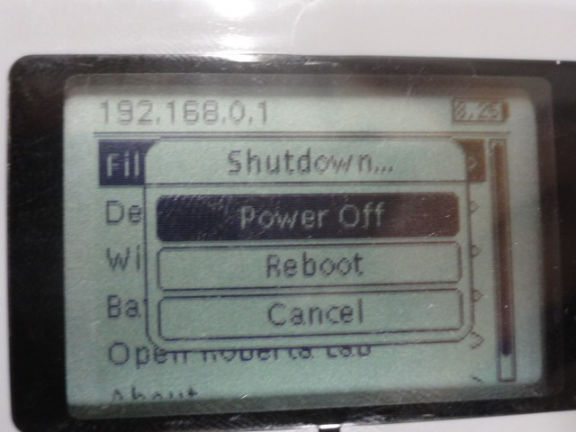</a></div>
<br>

### 再起動

再起動する場合は最初の画面で EV3 本体の左上の戻るボタンを押して「Reboot」を選択してください。

### リセット

ev3dev の起動が途中で停止する場合には、中央ボタン、戻るボタン(左上)、左ボタンを同時押ししてください。画面が消えたら戻るボタンを離すと再起動します。


<br>

<div align="center"><a href="ev3_reset.jpg"></a></div>
<br>


## EV3 への接続

EV3 へは<span style="color:red;">原則として無線LANで接続するようにしてください</span>;。


### 無線LANアクセスポイントへの接続

まずは EV3 の中央のスイッチを押して電源を投入してください。
<br>

ここで電源を投入する前に無線LANアダプタを取り付けておいてください。


以下の作業でスクリプトを実行するとアクセスポイントが起動します。

EV3 の操作画面から「File Browser」を上下ボタンで選択して中央のボタンを押してください。

```
 ------------------------------
 192.168.0.1
 ------------------------------
 [File Browser               > ]
  Device Browser             >
  Wireless and Networks      > 
  Battery                    >
  Open Roberta Lab           >
  About                      >
 ------------------------------
```

次に scripts を選択して中央ボタンを押してください。

```
 ------------------------------
 192.168.0.1
 ------------------------------
         File Browser
 ------------------------------
 /home/robot
 ------------------------------
 [scripts                     ]
 ・・
 ・・
 ------------------------------
```


次の画面から **start_ap.sh** を選択して中央ボタンを押すとスクリプトが起動します。

```
 ------------------------------
 192.168.0.1
 ------------------------------
         File Browser
 ------------------------------
 /home/robot/scripts
 ------------------------------
 ../
 Component/
 ・・
 [start_ap.sh                 ]
 ------------------------------
```


しばらくすると無線LANアクセスポイントが起動するので、指定の SSID のアクセスポイントに接続してください。
<!-- SSID は ev3_***(***は EV3 に貼り付けたテープ記載の番号)に接続します。 -->
SSID、パスワードは EV3 に貼り付けたテープに記載してあります。


<br>

<div align="center"><a href="tutorial_ev3_irex26.png"></a></div>
<br>


アクセスポイントへの接続方法は以下のページを参考にしてください。

- [Windows 7 で無線LANに接続する方法](http://121ware.com/qasearch/1007/app/servlet/qadoc?QID=011120)
- [Windows 8 / 8.1で無線LANに接続する方法](http://121ware.com/qasearch/1007/app/servlet/relatedqa?QID=014183)


まず右下のネットワークアイコンをクリックしてください。

<br>

<div align="center"><a href="tu_ev3_14.png"></a></div>
<br>

次に一覧から ev3_***を選択してください。


<br>

<div align="center"><a href="tu_ev3_11.png">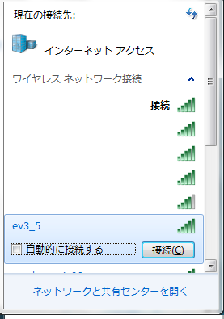</a></div>
<br>


パスワードを入力してください。

<br>

<div align="center"><a href="tu_ev3_12.png"></a></div>
<br>


### USBケーブルでの接続
<span style="color:red;">以下の作業は有線で接続する場合の作業なので、無線で接続する場合は不要です。</span>;


付属の USBケーブルで EV3 と PC を接続してください。


<br>

<div align="center"><a href="s_DSC00467.JPG"></a></div>
<br>


中央のボタンを押して電源を投入してください。

ここで EV3 の電源を投入する前に無線LANアダプタは取り外しておいてください。
<br>

以下の画面が表示されていれば ev3dev の起動に成功していますが、起動途中で停止した場合は [[この手順>#toc23]] で再起動してください。

<br>

<div align="center"><a href="s_DSC00470.JPG">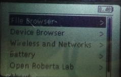</a></div>
<br>


デバイスマネージャで「EV3+ev3dev」が「その他のデバイス」の下にある場合は正しく機能していないので、以下の手順でデバイスソフトウェアの更新を行ってください。

- [https://sourceforge.net/p/etroboev3/wiki/lejosev3_win_eclipse_section05/](https://sourceforge.net/p/etroboev3/wiki/lejosev3_win_eclipse_section05/)

まずはコントロールパネルからデバイスマネージャを開いてください。

<br>

<div align="center"><a href="tu_ev3_17.png">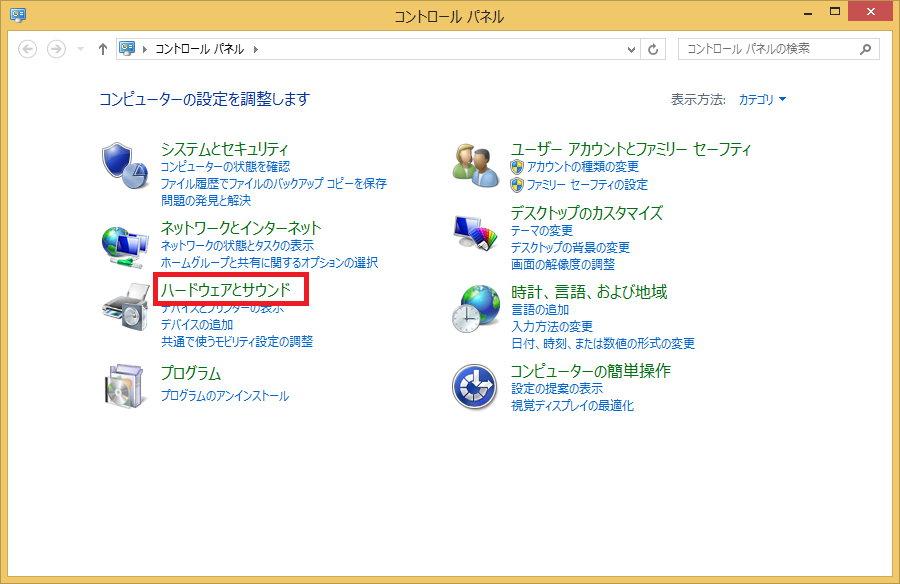</a></div>
<br>

<br>

<div align="center"><a href="tu_ev3_18.png">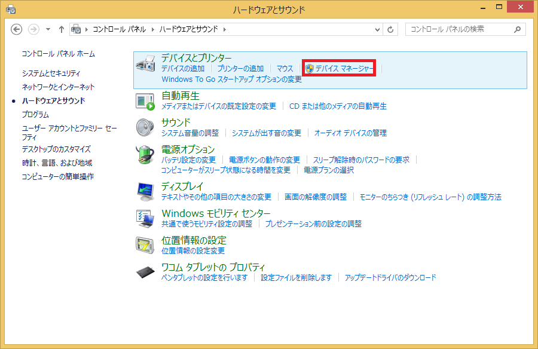</a></div>
<br>


開いたら EV3+ev3dev を右クリックして「ドライバソフトウェアの更新」を選択してください。
<br>

ここで EV3+ev3dev がネットワークアダプターの下にある場合は正常に認識されているので以下の作業は不要です。

<br>

<div align="center"><a href="tu_ev3_1.png">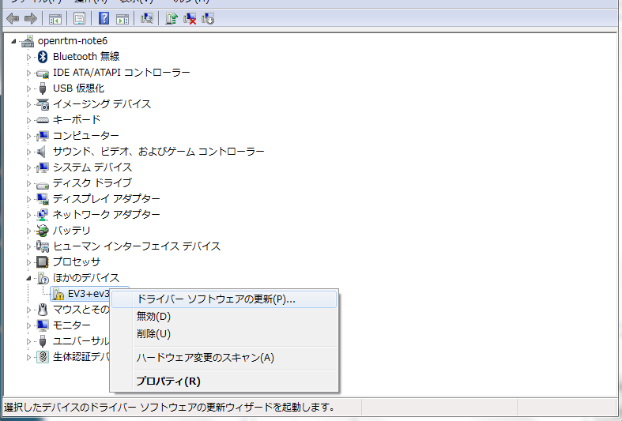</a></div>
<br>

「コンピューターを参照してドライバー ソフトウェアを検索します」を選択してください。

<br>


<div align="center"><a href="tu_ev3_3.png">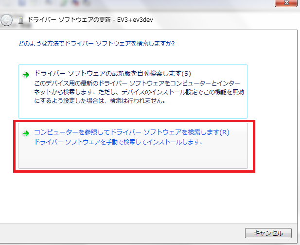</a></div>
<br>


「コンピューター上のデバイス ドライバーの一覧から選択します」を選択してください。

<br>

<div align="center"><a href="tu_ev3_4.png">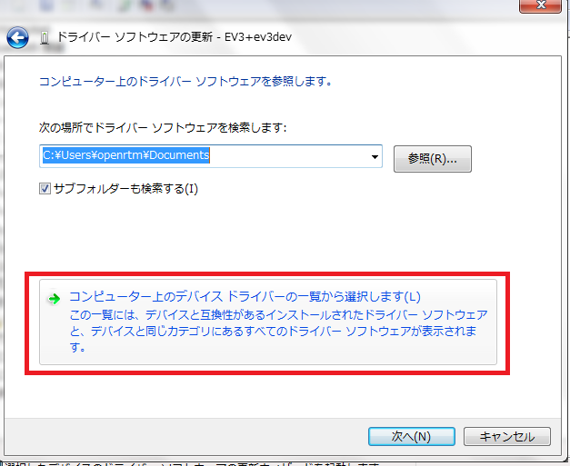</a></div>
<br>

ネットワーク アダプターを選択して次へをクリックしてください。

<br>


<div align="center"><a href="tu_ev3_5.png">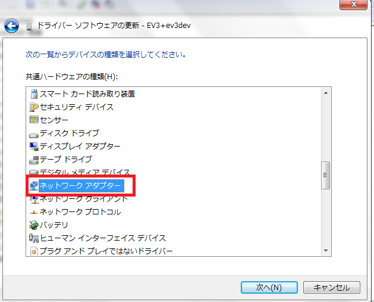</a></div>
<br>

製造元は「Microsoft Corporation」、ネットワークアダプタは「Remote RNDIS Compatible Device」を選択して次へをクリックしてください。

<br>

<div align="center"><a href="tu_ev3_9.png">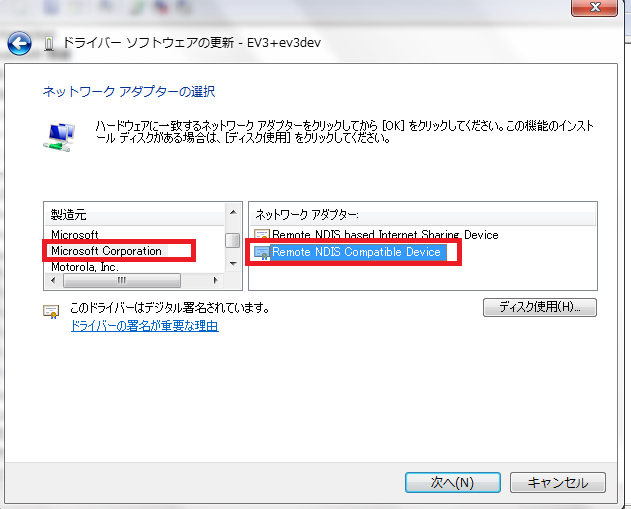</a></div>
<br>


ドライバー更新警告が出た場合は「はい」を選択してください。

<br>

<div align="center"><a href="tu_ev3_7.png">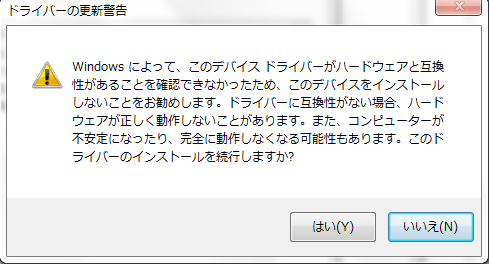</a></div>
<br>

正常に更新されたら閉じるを選択してください。

<br>

<div align="center"><a href="tu_ev3_8.png">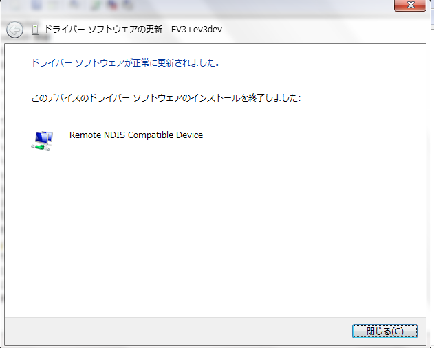</a></div>
<br>


## 事前準備


[このページ]({{ site.baseurl }}/ja/doc/installation/install_1_1/cpp_1_1/install_windows_1_1/quick_start_1_1_2#toc1) の手順に従ってネームサーバー、RTシステムエディタを起動してください。
予めネームサーバーを起動してある場合は再起動してください。


またネットワークインターフェースが2つ以上ある場合に通信に失敗する可能性があるため、有線で接続した場合は他のネットワークデバイスを無効にしてからネームサーバーを起動してください。

<br>

<div align="center"><a href="tu_ev3_16.png"></a></div>
<br>


<br>

<div align="center"><a href="raspi_tu25.png"></a></div>
<br>

### ネームサーバー追加

続いて RTシステムエディタのネームサーバー追加ボタンで192.168.0.1(無線LANで接続する場合は192.168.11.1)を追加してください。


<br>

<div align="center"><div align="center"><a href="tutorial_raspimouse0.png"></a></div>;  <div align="center"><a href="tu_ev3_25.png"></a></div>;</div>
<br>
<br>

するとEducatorVehicle0という RTC が見えるようになります。

<div align="center"><a href="tutorial_ev3_irex29.png"></a></div>

- [EducatorVehicle](../../raspberrypi_mouse/raspimouse_rtc_on_raspbian#toc0)

EducatorVehicle は EV3 の走行速度の入力、センサーのデータの出力等を行うためのコンポーネントです。

<br>

<div align="center"><a href="EducatorVehicle.png"></a></div>
<br>


<table class="table-alt">
  <tr>
    <th colspan="3" style="text-align: center;">EducatorVehicle</th>
  </tr>
  <tr>
    <td colspan="3" style="text-align: center;">InPort</td>
  </tr>
  <tr>
    <td>名前</td>
    <td>データ型</td>
    <td>説明</td>
  </tr>
  <tr>
    <td>velocity2D</td>
    <td>RTC::TimedVelocity2D</td>
    <td>目標速度</td>
  </tr>
  <tr>
    <td>angle</td>
    <td>RTC::TimedDouble</td>
    <td>Mモーターの角度</td>
  </tr>
  <tr>
    <td>lcd</td>
    <td>RTC::TimedString</td>
    <td>LCDに表示する画像ファイル名</td>
  </tr>
  <tr>
    <td>sound</td>
    <td>RTC::TimedString</td>
    <td>出力する音声</td>
  </tr>
  <tr>
    <td colspan="3" style="text-align: center;">OutPort</td>
  </tr>
  <tr>
    <td>名前</td>
    <td>データ型</td>
    <td>説明</td>
  </tr>
  <tr>
    <td>odometry</td>
    <td>RTC::TimedPose2D</td>
    <td>現在の位置・姿勢</td>
  </tr>
  <tr>
    <td>ultrasonic</td>
    <td>RTC::RangeData</td>
    <td>超音波センサーで計測した距離</td>
  </tr>
  <tr>
    <td>gyro</td>
    <td>RTC::TimedDouble</td>
    <td>ジャイロセンサーで計測した角度</td>
  </tr>
  <tr>
    <td>color</td>
    <td>RTC::TimedString</td>
    <td>カラーセンサーで計測した色</td>
  </tr>
  <tr>
    <td>light_reflect</td>
    <td>RTC::TimedDouble</td>
    <td>カラーセンサーで計測した反射光の強さ</td>
  </tr>
  <tr>
    <td>touch</td>
    <td>RTC::TimedBoolean</td>
    <td>タッチセンサーのオンオフ。右側が0番目の要素、左側が1番目の要素</td>
  </tr>
  <tr>
    <td colspan="3" style="text-align: center;">コンフィギュレーションパラメーター</td>
  </tr>
  <tr>
    <td>名前</td>
    <td>デフォルト値</td>
    <td>説明</td>
  </tr>
  <tr>
    <td>wheelRadius</td>
    <td>0.028</td>
    <td>車輪の半径</td>
  </tr>
  <tr>
    <td>wheelDistance</td>
    <td>0.054</td>
    <td>タイヤ間距離の1/2</td>
  </tr>
  <tr>
    <td>medium_motor_speed</td>
    <td>1.6</td>
    <td>Mモーターの速度</td>
  </tr>
</table>


#### TimedVelocity2D型について

TimedVelocity2D型は以下のように定義されています。

```
     struct Velocity2D
     {
         double vx;
         double vy;
         double va;
     };
```

```
     struct TimedVelocity2D
     {
         Time tm;
         Velocity2D data;
     };
```

vx、vy、va はロボット中心座標系での速度を表しています。

<br>

<div align="center"><a href="tu_ev3_19.png"></a></div>
<br>


vx は X方向の速度、vy は Y方向の速度、va は Z軸周りの角速度です。

Educator Vehicle のように2個の車輪が左右に取り付けられているロボットの場合、横滑りしないと仮定すると vy は0になります。

vx、va を指定することでロボットの操作を行います。

- [共通インターフェース仕様書](http://openrtm.org/openrtm/sites/default/files/Automobile_Interface1.0.zip)


#### 音声の出力
sound による音声の入力には以下のコマンドを利用できます。

- beep
  - beep と入力するとビープ音が鳴ります。

- tone
  - 以下のように tone、周波数、時間と入力すると指定周波数の音を指定ミリ秒数だけ鳴らします。

```
 tone,100,1000
```

- それ以外
  - それ以外は指定文字列を発音します


#### LCD に表示する画像について
LCD で表示する画像は付属資料の software/saveBinaryImage/EXE/saveBinaryImage.exeで変換したものを利用してください。
<br>

画像ファイルを saveBinaryImage.exe にドラッグ・アンド・ドロップすれば変換できます。


### サンプルコンポーネント起動

付属資料の<span style="color:red;">start_component_ev3.bat</span>;を起動してください。
※OpenRTM-aist Python版をインストールしていない場合、もしくはインストールに失敗している場合は個別に実行ファイル入りのUSBメモリーを配布いたしますので、その中の<span style="color:red;">start_component_ev3_exe.bat</span>;を利用してください。

すると以下の2つの RTC が起動します。

<div align="center"><a href="tu_ev3_24.png"></a></div>

- [FloatSeqToVelocity](../lego_sample_rts_exec#toc2)
- [TkJoyStick]({{ site.baseurl }}/ja/doc/installation/sample_components/tkjoystick_mobilerobotsimulator#toc0)

## 動作確認

まずはジョイスティックで EV3 を操作してみます。


RTシステムエディタで EducatorVehicle、FloatSeqToVelocity、TkJoyStick を以下のように接続します。

<br>

<div align="center"><a href="tutorial_ev3_16.png"></a></div>
<br>
そして RTC をアクティブ化するとジョイスティックで EV3 の操作ができるようになります。

<br>

<div align="center"><a href="tutorial_ev3_21.png"></a></div>
<br>

## 自作の RTC で制御

まずは FloatSeqToVelocity の out と EducatorVehicle の target_velocity_in のコネクタを切断してください。

<div align="center"><a href="tutorial_ev3_17.png"></a></div>

FloatSeqToVelocity と EducatorVehicle の間に自作の RTC を接続して、タッチセンサーがオンになった場合に停止して音を鳴らすようにします。

### ひな形コードの作成

RTC ビルダを起動してください。

<br>

<div align="center"><a href="tutorial_raspimouse8.png"></a></div>
<br>

起動したら新規にプロジェクトを作成します。

<br>

<div align="center"><a href="tutorial_raspimouse9.png"></a></div>
<br>

プロジェクト名は TestEV3CPP(TestEV3Py)にします。

以下のように設定を行ってください。
C++、もしくは Python で作成します。

<table class="table-alt">
  <tr>
    <th colspan="3" style="text-align: center;">基本</th>
  </tr>
  <tr>
    <td>モジュール名</td>
    <td colspan="2" style="text-align;">TestEV3CPP、もしくはTestEV3Py</td>
  </tr>
  <tr>
    <td colspan="3" style="text-align: center;">アクティビティ</td>
  </tr>
  <tr>
    <td>有効アクション</td>
    <td colspan="2" style="text-align;">onInitialize、onExecute、onActivated、onDeactivated</td>
  </tr>
  <tr>
    <td colspan="3" style="text-align: center;">データポート</td>
  </tr>
  <tr>
    <td colspan="3" style="text-align: center;">InPort</td>
  </tr>
  <tr>
    <td>名前</td>
    <td>データ型</td>
    <td>説明</td>
  </tr>
  <tr>
    <td>velocity_in</td>
    <td>RTC::TimedVelocity2D</td>
    <td>入力目標速度</td>
  </tr>
  <tr>
    <td>touch</td>
    <td>RTC::TimedBooleanSeq</td>
    <td>タッチセンサーのオンオフ</td>
  </tr>
  <tr>
    <td colspan="3" style="text-align: center;">OutPort</td>
  </tr>
  <tr>
    <td>名前</td>
    <td>データ型</td>
    <td>説明</td>
  </tr>
  <tr>
    <td>velocity_out</td>
    <td>RTC::TimedVelocity2D</td>
    <td>出力目標速度</td>
  </tr>
  <tr>
    <td>sound</td>
    <td>RTC::TimedString</td>
    <td>音声</td>
  </tr>
  <tr>
    <td colspan="3" style="text-align: center;">コンフィギュレーション</td>
  </tr>
  <tr>
    <td>名前</td>
    <td>型</td>
    <td>説明</td>
  </tr>
  <tr>
    <td>sound_output</td>
    <td>string</td>
    <td>タッチセンサーが ON の時に発する音声。デフォルト値は beep</td>
  </tr>
  <tr>
    <td colspan="3" style="text-align: center;">言語・環境</td>
  </tr>
  <tr>
    <td>言語</td>
    <td colspan="2" style="text-align;">C++、もしくはPython</td>
  </tr>
</table>


[コード生成] ボタンを押したらコードが生成されます。

<br>

<div align="center"><a href="tutorial_raspimouse10.png"></a></div>
<br>

### プロジェクト生成

コードが生成できたら C++ の場合は CMake で Visual Studio のプロジェクト(Ubuntu の場合は Code::Blocks)を生成してください。

- [Windows]({{ site.baseurl }}/ja/doc/toolmanuals/rtcbuilder-1_1_0/compile_win_cmake_cpp_rtcb_1_1_0)
- [Ubuntu]({{ site.baseurl }}/ja/content/build_ubuntu_codeblocks)

まず CMake (cmake-gui) を起動します。


- Windows 7

<br>

<div align="center"><a href="tu_ev3_10.png"></a></div>
<br>

- Windows 8.1

<br>

<div align="center"><a href="tutorial_raspimouse12.png"></a></div>
<br>

起動したらソースコードのディレクトリー、ビルドを行うディレクトリーに以下を指定します。
括弧内は eclipse の作業ディレクトリーを C:\workspace にした場合の例です。

<table class="table-alt">
  <tr>
    <td>Where is the source code</td>
    <td>RTCBuilder で生成したコードのフォルダー(C:\workspace\TestEV3CPP)</td>
  </tr>
  <tr>
    <td>Where to build the binaries</td>
    <td>RTCBuilder で生成したコードのフォルダーの下に作成したbuildフォルダー(C:\workspace\TestEV3CPP\build)</td>
  </tr>
</table>

<br>

<div align="center"><a href="tutorial_ev3_24.png"></a></div>
<br>

[Configure] ボタン→ [Generate] ボタンをクリックすると**Visual Studio**のプロジェクトが生成されます。


### ソースコードの編集

build ディレクトリーの TestEV3CPP.sln を開いてください。

次にコードの編集を行います。

**Python**の場合はまず変数の初期化部分を修正してください。

- TestEV3Py.py


```
 	def __init__(self, manager):
 		#self._d_velocity_in = RTC.TimedVelocity2D(*velocity_in_arg)
 		self._d_velocity_in = RTC.TimedVelocity2D(RTC.Time(0,0),RTC.Velocity2D(0,0,0))
```

```
 		#self._d_distance_sensor = RTC.TimedShortSeq(*distance_sensor_arg)
 		self._d_distance_sensor = RTC.TimedShortSeq(RTC.Time(0,0),[])
```

```
 		#self._d_velocity_out = RTC.TimedVelocity2D(*velocity_out_arg)
 		self._d_velocity_out = RTC.TimedVelocity2D(RTC.Time(0,0),RTC.Velocity2D(0,0,0))
```

```
 		#self._d_buzzer = RTC.TimedShort(*buzzer_arg)
 		self._d_buzzer = RTC.TimedShort(RTC.Time(0,0),0)
```


まずは onExecute で入力速度をそのまま出力するコードを書いてみます。
<br>

**C++**の場合は以下のようになります。
<br>

isNew関数で新規の入力データが存在するかを確認して、read関数で変数(m_velocity_in)に格納します。
そして m_velocity_out に出力データを格納して write関数を呼び出すとデータが送信されます。


- src/TestEV3CPP.cpp

```
 	if (m_velocity_inIn.isNew())
 	{
 		m_velocity_inIn.read();
 		//入力速度をそのまま出力
 		m_velocity_out.data.vx = m_velocity_in.data.vx;
 		m_velocity_out.data.vy = m_velocity_in.data.vy;
 		m_velocity_out.data.va = m_velocity_in.data.va;
 		setTimestamp(m_velocity_out);
 		m_velocity_outOut.write();
 	}
```


**Python**の場合は以下のようになります。

- TestEV3Py.py

```
 		if self._velocity_inIn.isNew():
 			data = self._velocity_inIn.read()
 			#入力速度をそのまま出力する
 			self._d_velocity_out.data.vx = data.data.vx
 			self._d_velocity_out.data.vy = data.data.vy
 			self._d_velocity_out.data.va = data.data.va
 			OpenRTM_aist.setTimestamp(self._d_velocity_out)
 			self._velocity_outOut.write()
```


次にタッチセンサーがオンの場合に停止する処理を記述します。
<br>

常にタッチセンサーのデータが入力されるとは限らないので、センサーのデータを格納する変数を宣言します。
<br>

**C++**の場合は TestEV3CPP.h に記述します。

- include/TestEV3CPP/TestEV3CPP.h

```
  private:
 	 bool m_last_sensor_data[2];
```
<br>

**Python**の場合はコンストラクタに記述します。

- TestEV3Py.py

```
 	def __init__(self, manager):
 		OpenRTM_aist.DataFlowComponentBase.__init__(self, manager)
 
 		self._last_sensor_data = [False, False]
```

次に onExecute に停止する処理を記述します。
<br>

**C++**の場合は以下のようになっています。
<br>

まずインポート touch に isNew 関数で新規にデータが入力されたかを確認して、入力されている場合は read関数で読み込みます。そして変数 m_last_sensor_data に格納します。
<br>

そしてインポート velocity_in で受信したデータの vx が 0 以上の場合には前進しているため障害物に接触するかもしれないと判定して、タッチセンサーがオンの場合は停止してブザーを鳴らします。


- src/TestEV3CPP.cpp

```
 RTC::ReturnCode_t TestEV3CPP::onExecute(RTC::UniqueId ec_id)
 {
 	//データを新規に受信した場合に、データをm_last_sensor_dataを格納する
 	if (m_touchIn.isNew())
 	{
 		m_touchIn.read();
 		if (m_touch.data.length() == 2)
 		{
 			for (int i = 0; i < 2; i++)
 			{
 				//タッチセンサがOFFからONになった時に音を鳴らす
 				if (!m_last_sensor_data[i] && m_touch.data[i])
 				{
 					m_sound.data = m_sound_output.c_str();
 					setTimestamp(m_sound);
 					m_soundOut.write();
 
 				}
 				m_last_sensor_data[i] = m_touch.data[i];
 			}
 		}
 	}
 	if (m_velocity_inIn.isNew())
 	{
 		m_velocity_inIn.read();
 		//vxが0以上(前進)のときのみ停止するか判定する
 		if (m_velocity_in.data.vx > 0)
 		{
 			for (int i = 0; i < 2; i++)
 			{
 				//タッチセンサがONの時に停止する
 				if (m_last_sensor_data[i])
 				{
 					//停止する
 					m_velocity_out.data.vx = 0;
 					m_velocity_out.data.vy = 0;
 					m_velocity_out.data.va = 0;
 					setTimestamp(m_velocity_out);
 					m_velocity_outOut.write();
 
 
 					return RTC::RTC_OK;
 				}
 			}
 		}
 		//入力速度をそのまま出力
 		m_velocity_out.data.vx = m_velocity_in.data.vx;
 		m_velocity_out.data.vy = m_velocity_in.data.vy;
 		m_velocity_out.data.va = m_velocity_in.data.va;
 		setTimestamp(m_velocity_out);
 		m_velocity_outOut.write();
   return RTC::RTC_OK;
 }
```


**Python**の場合は以下のようになっています。

- TestEV3Py.py

```
 	def onExecute(self, ec_id):
 		#データを新規に受信した場合に、データをm_last_sensor_dataを格納する
 		if self._touchIn.isNew():
 			data = self._touchIn.read()
 			if len(data.data) == 2:
 				for i in range(2):
 					#タッチセンサがOFFからONになった時に音を鳴らす
 					if not self._last_sensor_data[i] and data.data[i]:
 						self._d_sound.data = self._sound_output[0]
 						OpenRTM_aist.setTimestamp(self._d_sound)
 						self._soundOut.write()
 				self._last_sensor_data = data.data[:]
 
 		if self._velocity_inIn.isNew():
 			data = self._velocity_inIn.read()
 			#vxが0以上(前進)のときのみ停止するか判定する
 			if data.data.vx > 0:
 				for d in self._last_sensor_data:
 					#タッチセンサーがONの時に停止する
 					if d:
 						#停止する
 						self._d_velocity_out.data.vx = 0
 						self._d_velocity_out.data.vy = 0
 						self._d_velocity_out.data.va = 0
 						OpenRTM_aist.setTimestamp(self._d_velocity_out)
 						self._velocity_outOut.write()
 						
 						return RTC.RTC_OK
 
 			#入力速度をそのまま出力する
 			self._d_velocity_out.data.vx = data.data.vx
 			self._d_velocity_out.data.vy = data.data.vy
 			self._d_velocity_out.data.va = data.data.va
 			OpenRTM_aist.setTimestamp(self._d_velocity_out)
 			self._velocity_outOut.write()
 		return RTC.RTC_OK
```


コードの編集が終わったら C++ の場合はビルドしてください。
<br>

ビルドに成功すると build\src\Release(Debug) に TestEV3CPPComp.exe が生成されます。

### 動作確認
TestEV3CPPComp.exe (TestEV3CPPComp.py) をダブルクリックして起動してください。
<br>

TestEV3CPP(TestEV3Py)を以下のように接続してください。

<br>

<div align="center"><a href="tutorial_ev3_18.png"></a></div>
<br>

最後に RTC をアクティブ化して動作確認してください。

### RTシステム保存

RTシステムを保存する場合は System Diagram 上で右クリックして Save As... を選択してください。


<br>

<div align="center"><a href="tutorial_ev3_20.png"></a></div>

<br>

<div align="center"><a href="tutorial_raspimouse14.png"></a></div>

<br>


### RTシステム復元

復元する場合は Open and Restore を選択して、先ほど保存したファイルを選択してください。

<br>

<div align="center"><a href="raspi_tu28.png"></a></div>
<br>

### RTC 終了

RTC を終了する場合は RTシステムエディタ上で RTC を exit してください。

<br>

<div align="center"><a href="tutorial_ev3_19.png"></a></div>

## 補足

### スクリプトファイルについて

EV3 のボタン操作で File Brower を選択すると/home/robot以下のディレクトリーの操作ができます。
<br>

scripts フォルダー内のシェルスクリプトを実行することで以下の操作ができます。

<table class="table-alt">
  <tr>
    <td>スクリプトファイル名</td>
    <td>内容</td>
  </tr>
  <tr>
    <td>run_rtcs.sh</td>
    <td>RTC を起動する</td>
  </tr>
  <tr>
    <td>stop_rtcs.sh</td>
    <td>RTC を終了する</td>
  </tr>
</table>
-------jp page!!-------
