<!-- Title: Tutorial (EV3) -->
#contents

This page explains the EV3 operation procedures used in the RTM seminar.

<br>

In this hands-on session, you will control the following modified Educator Vehicle.

<br>

<div align="center"><a href="s_DSC00443.JPG"></a></div>
<br>

LEGO Mindstorms EV3 is a new package in the LEGO Mindstorms series. The main EV3 controller comes with Linux preinstalled, enabling robot development in a variety of programming languages.

## Specifications

- [Afrel Website](http://www.afrel.co.jp/)

<table class="table-alt">
  <tr>
    <td colspan="2" style="text-align: center;"><strong>LEGO Mindstorms EV3 Specifications</strong></td>
  </tr>
  <tr>
    <td>Processor</td>
    <td>ARM9 300MHz</td>
  </tr>
  <tr>
    <td>Memory (ROM)</td>
    <td>16MB Flash</td>
  </tr>
  <tr>
    <td>Memory (RAM)</td>
    <td>64MB RAM</td>
  </tr>
  <tr>
    <td>OS</td>
    <td>Linux-based</td>
  </tr>
  <tr>
    <td>Display</td>
    <td>178 x 128 pixels</td>
  </tr>
  <tr>
    <td>Output Ports</td>
    <td>4</td>
  </tr>
  <tr>
    <td>Input Ports</td>
    <td>4 <br> Analog <br> Digital 460.8kbit/s</td>
  </tr>
  <tr>
    <td>USB Communication Speed</td>
    <td>High Speed (480Mbps)</td>
  </tr>
  <tr>
    <td>USB Interface</td>
    <td>Can connect EV3 units together (up to 4 units) <br> Wi-Fi communication dongles supported</td>
  </tr>
  <tr>
    <td>SD Card Slot</td>
    <td>Supports Micro SD cards up to 32GB</td>
  </tr>
  <tr>
    <td>Smart Device Connectivity</td>
    <td>iOS, Android, Windows</td>
  </tr>
  <tr>
    <td>User Interface</td>
    <td>6 buttons, illumination function</td>
  </tr>
  <tr>
    <td>Program Size (Line Tracing Example)</td>
    <td>0.950KB</td>
  </tr>
  <tr>
    <td>Sensor Communication Performance</td>
    <td>1000 times/sec, 1ms</td>
  </tr>
  <tr>
    <td>Data Logging</td>
    <td>Up to 1,000 samples/sec</td>
  </tr>
  <tr>
    <td>Bluetooth Communication</td>
    <td>Can connect up to 7 slave devices</td>
  </tr>
  <tr>
    <td>Power Source</td>
    <td>Rechargeable battery or six AA batteries</td>
  </tr>
</table>

## Devices

The EV3 includes the following devices.

<table class="table-alt">
  <tr>
    <td>Gyro Sensor</td>
    <td>Angle Mode: Accuracy +/- 3°<br> Angular Velocity Mode: Up to 440 deg/sec <br> Sampling Rate: 1,000 Hz</td>
  </tr>
  <tr>
    <td>Color Sensor</td>
    <td>Measures reflected red light, ambient brightness, and color <br> Detectable Colors: 8 (None, Black, Blue, Green, Yellow, Red, White, Brown)<br> Sampling Rate: 1,000 Hz <br> Distance: Approx. 1mm–18mm (Afrel measurement)</td>
  </tr>
  <tr>
    <td>Touch Sensor</td>
    <td>On (1), Off (0) <br> Switch Travel Distance: Approx. 4mm</td>
  </tr>
  <tr>
    <td>Ultrasonic Sensor</td>
    <td>Measurement Range: 3cm–250cm <br> Accuracy: +/- 1cm <br> Front Indicator: Solid = transmitting, Flashing = receiving</td>
  </tr>
  <tr>
    <td>EV3 Large Motor</td>
    <td>Feedback Resolution: 1° <br> Rotation Speed: 160–170RPM <br> Rated Torque: 0.21 N·m <br> Stall Torque: 0.42 N·m <br> Weight: 76g</td>
  </tr>
  <tr>
    <td>EV3 Medium Motor</td>
    <td>Feedback Resolution: 1° <br> Rotation Speed: 240–250RPM <br> Rated Torque: 0.08 N·m <br> Stall Torque: 0.12 N·m <br> Weight: 36g</td>
  </tr>
</table>

## Download

First, download the RTCs and related tools used on the PC side.

- [RTM_Tutorial_EV3.zip](https://github.com/OpenRTM/RTM_Tutorial_EV3/archive/master.zip)

Extract the ZIP file using a tool such as Lhaplus.

## Assembling the EV3

Participants receive the EV3 in a disassembled state.

Follow the assembly instructions below.

*The ultrasonic sensor, color sensor, and gyro sensor are not used during the seminar and do not need to be installed. Steps marked with ※ may be completed if time permits.*

First, take out the base assembly.

<br>

<div align="center"><a href="s_DSC00463.JPG"></a></div>
<br>

Connect a 25cm cable to the Medium Motor first. ※

<br>

<div align="center"><a href="s_DSC00446.JPG">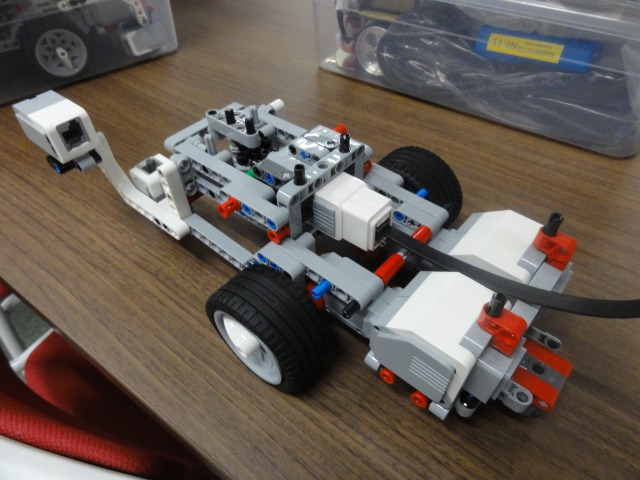</a></div>
<br>

Next, attach the EV3 main unit.

If you connected the cable to the Medium Motor, route it through the opening on the left side.

<br>

<div align="center"><div align="center"><a href="s_DSC00448.JPG"></a></div>;  <div align="center"><a href="s_DSC00450.JPG"></a></div>;</div>
<br>
<br>

Attach the right touch sensor.

<br>

<div align="center"><div align="center"><a href="s_DSC00451.JPG">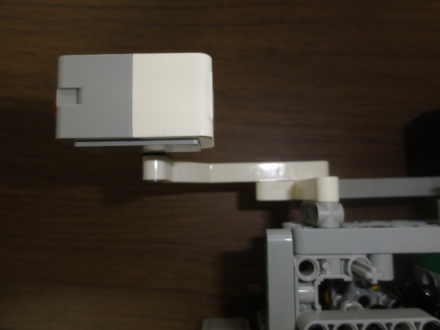</a></div>;  <div align="center"><a href="s_DSC00452.JPG"></a></div>;</div>
<br>
<br>

Attach the ultrasonic sensor. ※

<br>

<div align="center"><a href="s_DSC00454.JPG"></a></div>
<br>

Connect the cables.

The required devices are:

- Right Large Motor
- Left Large Motor
- Touch Sensor

<table class="table-alt">
  <tr>
    <td>Right Large Motor</td>
    <td>Port C</td>
    <td>25cm cable</td>
  </tr>
  <tr>
    <td>Left Large Motor</td>
    <td>Port B</td>
    <td>25cm cable</td>
  </tr>
  <tr>
    <td>Medium Motor ※</td>
    <td>Port A</td>
    <td>25cm cable</td>
  </tr>
  <tr>
    <td>Right Touch Sensor</td>
    <td>Port 3</td>
    <td>35cm cable</td>
  </tr>
  <tr>
    <td>Left Touch Sensor</td>
    <td>Port 1</td>
    <td>35cm cable</td>
  </tr>
  <tr>
    <td>Ultrasonic Sensor ※</td>
    <td>Port 4</td>
    <td>50cm cable</td>
  </tr>
  <tr>
    <td>Gyro Sensor ※</td>
    <td>Port 2</td>
    <td>25cm cable</td>
  </tr>
</table>

The EV3 has ports A–D and 1–4 on the top and bottom. Connect the cables to the appropriate ports.

## Powering On and Off

### Power On

Press the center button to turn on the EV3.

### Power Off

From the main screen, press the Back button (upper-left button on the EV3) and select **Power Off**.

### Reboot

From the main screen, press the Back button and select **Reboot**.

### Reset

If ev3dev stops during startup, press and hold the Center, Back (upper-left), and Left buttons simultaneously. When the screen turns off, release the Back button to reboot.

## Connecting to the EV3

<span style="color:red;">As a general rule, connect to the EV3 via Wi-Fi.</span>

### Connecting to the Wi-Fi Access Point

Press the center button to power on the EV3.

Before powering it on, make sure the Wi-Fi adapter is attached.

Execute the provided script to start the access point.

From the EV3 menu, select **File Browser** and press the center button.

Then select the **scripts** folder.

From the next screen, select **start_ap.sh** and press the center button.

After a short time, the wireless access point will start.

Connect to the designated SSID.

The SSID and password are written on the label attached to the EV3.

### Connecting via USB Cable

<span style="color:red;">The following procedure is only required for wired connections. If you are using Wi-Fi, skip this section.</span>

Connect the EV3 to the PC using the supplied USB cable.

Press the center button to power on the EV3.

Before powering on, remove the Wi-Fi adapter.

If the ev3dev startup screen appears, startup was successful.

If startup freezes, perform the reset procedure described earlier.

If "EV3+ev3dev" appears under "Other Devices" in Device Manager, update the device driver according to the instructions provided in the document.


## Preparation

Follow the procedure on [this page]({{ site.baseurl }}/ja/doc/installation/install_1_1/cpp_1_1/install_windows_1_1/quick_start_1_1_2#toc1) to start the Name Server and RT System Editor.

If the Name Server is already running, restart it before proceeding.

If two or more network interfaces are available, communication may fail. Therefore, when using a wired connection, disable other network devices before starting the Name Server.

<br>

<div align="center"><a href="tu_ev3_16.png"></a></div>
<br>

<br>

<div align="center"><a href="raspi_tu25.png">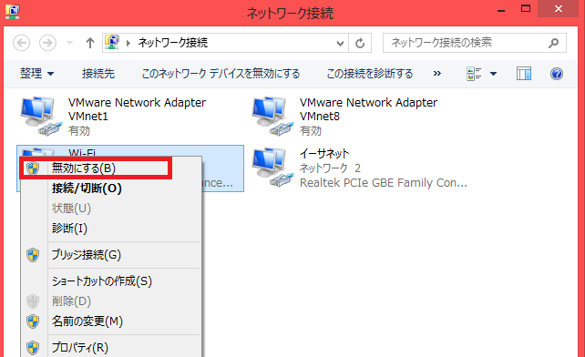</a></div>
<br>

### Adding the Name Server

Next, use the **Add Name Server** button in RT System Editor and add **192.168.0.1** (or **192.168.11.1** when connecting via wireless LAN).

<br>

<div align="center"><div align="center"><a href="tutorial_raspimouse0.png"></a></div>;  <div align="center"><a href="tu_ev3_25.png">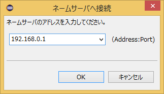</a></div>;</div>
<br>
<br>

An RTC named **EducatorVehicle0** will then become visible.

<div align="center"><a href="tutorial_ev3_irex29.png"></a></div>

- [EducatorVehicle](../../raspberrypi_mouse/raspimouse_rtc_on_raspbian#toc0)

EducatorVehicle is a component used for inputting EV3 driving speeds, outputting sensor data, and related functions.

<br>

<div align="center"><a href="EducatorVehicle.png">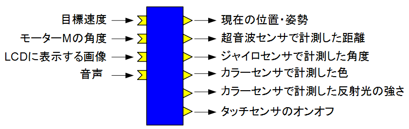</a></div>
<br>

<table class="table-alt">
  <tr>
    <th colspan="3" style="text-align: center;">EducatorVehicle</th>
  </tr>
  <tr>
    <td colspan="3" style="text-align: center;">InPort</td>
  </tr>
  <tr>
    <td>Name</td>
    <td>Data Type</td>
    <td>Description</td>
  </tr>
  <tr>
    <td>velocity2D</td>
    <td>RTC::TimedVelocity2D</td>
    <td>Target velocity</td>
  </tr>
  <tr>
    <td>angle</td>
    <td>RTC::TimedDouble</td>
    <td>M motor angle</td>
  </tr>
  <tr>
    <td>lcd</td>
    <td>RTC::TimedString</td>
    <td>Image file name to display on the LCD</td>
  </tr>
  <tr>
    <td>sound</td>
    <td>RTC::TimedString</td>
    <td>Audio to output</td>
  </tr>
  <tr>
    <td colspan="3" style="text-align: center;">OutPort</td>
  </tr>
  <tr>
    <td>Name</td>
    <td>Data Type</td>
    <td>Description</td>
  </tr>
  <tr>
    <td>odometry</td>
    <td>RTC::TimedPose2D</td>
    <td>Current position and orientation</td>
  </tr>
  <tr>
    <td>ultrasonic</td>
    <td>RTC::RangeData</td>
    <td>Distance measured by the ultrasonic sensor</td>
  </tr>
  <tr>
    <td>gyro</td>
    <td>RTC::TimedDouble</td>
    <td>Angle measured by the gyro sensor</td>
  </tr>
  <tr>
    <td>color</td>
    <td>RTC::TimedString</td>
    <td>Color measured by the color sensor</td>
  </tr>
  <tr>
    <td>light_reflect</td>
    <td>RTC::TimedDouble</td>
    <td>Reflected light intensity measured by the color sensor</td>
  </tr>
  <tr>
    <td>touch</td>
    <td>RTC::TimedBoolean</td>
    <td>Touch sensor ON/OFF state. The right side is element 0 and the left side is element 1.</td>
  </tr>
  <tr>
    <td colspan="3" style="text-align: center;">Configuration Parameters</td>
  </tr>
  <tr>
    <td>Name</td>
    <td>Default Value</td>
    <td>Description</td>
  </tr>
  <tr>
    <td>wheelRadius</td>
    <td>0.028</td>
    <td>Wheel radius</td>
  </tr>
  <tr>
    <td>wheelDistance</td>
    <td>0.054</td>
    <td>Half of the distance between the wheels</td>
  </tr>
  <tr>
    <td>medium_motor_speed</td>
    <td>1.6</td>
    <td>M motor speed</td>
  </tr>
</table>

#### About the TimedVelocity2D Type

The TimedVelocity2D type is defined as follows.

```cpp
     struct Velocity2D
     {
         double vx;
         double vy;
         double va;
     };
```

```cpp
     struct TimedVelocity2D
     {
         Time tm;
         Velocity2D data;
     };
```

vx, vy, and va represent velocities in the robot-centered coordinate system.

<br>

<div align="center"><a href="tu_ev3_19.png">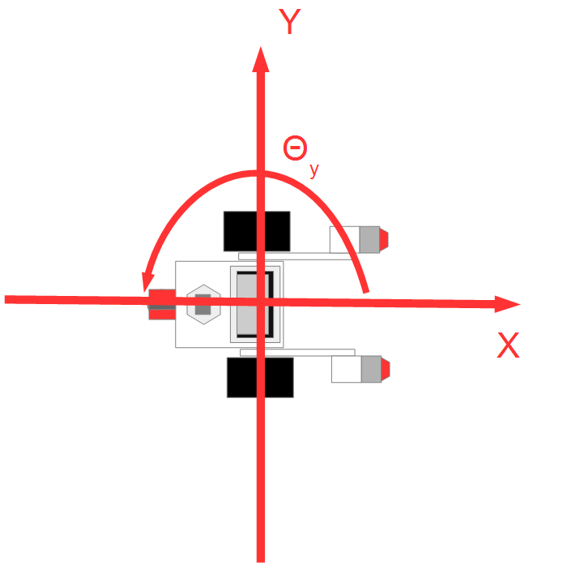</a></div>
<br>

vx represents velocity in the X direction, vy represents velocity in the Y direction, and va represents angular velocity around the Z axis.

For a robot such as the Educator Vehicle, which has two wheels mounted on the left and right sides, vy becomes 0 if side-slipping is assumed not to occur.

The robot is controlled by specifying vx and va.

- [Common Interface Specification](http://openrtm.org/openrtm/sites/default/files/Automobile_Interface1.0.zip)

#### Audio Output

The following commands can be used for audio input through the sound port.

- beep
  - Entering `beep` produces a beep sound.

- tone
  - Enter tone, frequency, and duration as shown below to play a sound at the specified frequency for the specified number of milliseconds.

```text
tone,100,1000
```

- Other strings
  - Any other string will be spoken as speech.

#### Images Displayed on the LCD

For images displayed on the LCD, use images converted by:

`software/saveBinaryImage/EXE/saveBinaryImage.exe`

included in the distributed materials.

Drag and drop an image file onto `saveBinaryImage.exe` to perform the conversion.

### Starting the Sample Components

Start **start_component_ev3.bat** included in the distributed materials.

*If the Python version of OpenRTM-aist is not installed, or if the installation failed, a USB memory containing standalone executables will be distributed separately. In that case, use **start_component_ev3_exe.bat**.*

The following two RTCs will start.

<div align="center"><a href="tu_ev3_24.png">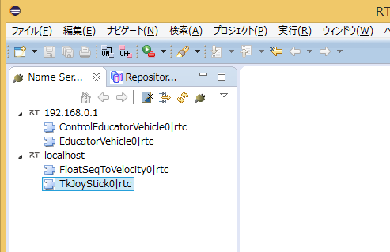</a></div>

- [FloatSeqToVelocity](../lego_sample_rts_exec#toc2)
- [TkJoyStick]({{ site.baseurl }}/ja/doc/installation/sample_components/tkjoystick_mobilerobotsimulator#toc0)

## Operation Check

First, try controlling the EV3 using the joystick.

Connect **EducatorVehicle**, **FloatSeqToVelocity**, and **TkJoyStick** in RT System Editor as shown below.

<br>

<div align="center"><a href="tutorial_ev3_16.png">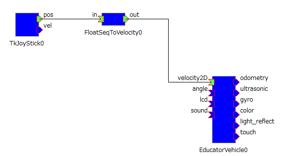</a></div>
<br>

After activating the RTCs, you will be able to control the EV3 using the joystick.

<br>

<div align="center"><a href="tutorial_ev3_21.png">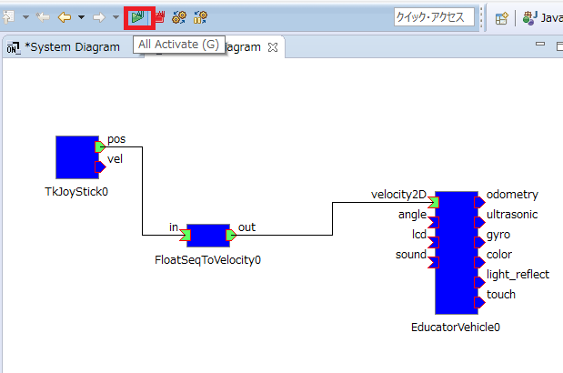</a></div>
<br>

## Controlling with Your Own RTC

First, disconnect the connector between **FloatSeqToVelocity::out** and **EducatorVehicle::target_velocity_in**.

<div align="center"><a href="tutorial_ev3_17.png">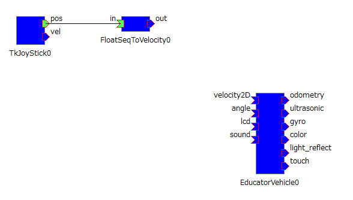</a></div>

Connect your own RTC between **FloatSeqToVelocity** and **EducatorVehicle**, and implement behavior that stops the robot and plays a sound when the touch sensor is activated.

### Creating Template Code

Start RTC Builder.

<br>

<div align="center"><a href="tutorial_raspimouse8.png"></a></div>
<br>

After RTC Builder starts, create a new project.

<br>

<div align="center"><a href="tutorial_raspimouse9.png"></a></div>
<br>

Set the project name to **TestEV3CPP** (or **TestEV3Py**).

Configure the settings as shown below.

Create the component in either **C++** or **Python**.

<table class="table-alt">
  <tr>
    <th colspan="3" style="text-align: center;">Basic</th>
  </tr>
  <tr>
    <td>Module Name</td>
    <td colspan="2" style="text-align;">TestEV3CPP or TestEV3Py</td>
  </tr>
  <tr>
    <td colspan="3" style="text-align: center;">Activity</td>
  </tr>
  <tr>
    <td>Enabled Actions</td>
    <td colspan="2" style="text-align;">onInitialize, onExecute, onActivated, onDeactivated</td>
  </tr>
  <tr>
    <td colspan="3" style="text-align: center;">Data Ports</td>
  </tr>
  <tr>
    <td colspan="3" style="text-align: center;">InPort</td>
  </tr>
  <tr>
    <td>Name</td>
    <td>Data Type</td>
    <td>Description</td>
  </tr>
  <tr>
    <td>velocity_in</td>
    <td>RTC::TimedVelocity2D</td>
    <td>Input target velocity</td>
  </tr>
  <tr>
    <td>touch</td>
    <td>RTC::TimedBooleanSeq</td>
    <td>Touch sensor ON/OFF state</td>
  </tr>
  <tr>
    <td colspan="3" style="text-align: center;">OutPort</td>
  </tr>
  <tr>
    <td>Name</td>
    <td>Data Type</td>
    <td>Description</td>
  </tr>
  <tr>
    <td>velocity_out</td>
    <td>RTC::TimedVelocity2D</td>
    <td>Output target velocity</td>
  </tr>
  <tr>
    <td>sound</td>
    <td>RTC::TimedString</td>
    <td>Audio output</td>
  </tr>
  <tr>
    <td colspan="3" style="text-align: center;">Configuration</td>
  </tr>
  <tr>
    <td>Name</td>
    <td>Type</td>
    <td>Description</td>
  </tr>
  <tr>
    <td>sound_output</td>
    <td>string</td>
    <td>Audio played when the touch sensor is ON. The default value is beep.</td>
  </tr>
  <tr>
    <td colspan="3" style="text-align: center;">Language / Environment</td>
  </tr>
  <tr>
    <td>Language</td>
    <td colspan="2" style="text-align;">C++ or Python</td>
  </tr>
</table>

Click the **[Generate Code]** button to generate the source code.

<br>

<div align="center"><a href="tutorial_raspimouse10.png">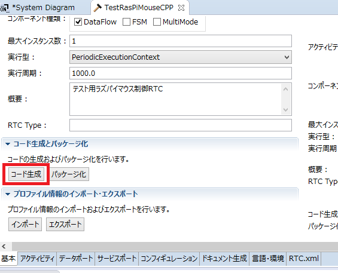</a></div>
<br>

### Generating the Project

After the code has been generated, use CMake to generate a Visual Studio project (or Code::Blocks project on Ubuntu) if you are using C++.

- [Windows]({{ site.baseurl }}/ja/doc/toolmanuals/rtcbuilder-1_1_0/compile_win_cmake_cpp_rtcb_1_1_0)
- [Ubuntu]({{ site.baseurl }}/ja/content/build_ubuntu_codeblocks)

First, start **CMake (cmake-gui)**.

- Windows 7

<br>

<div align="center"><a href="tu_ev3_10.png"></a></div>
<br>

- Windows 8.1

<br>

<div align="center"><a href="tutorial_raspimouse12.png"></a></div>
<br>

After starting CMake, specify the source code directory and build directory as shown below.

The values in parentheses are examples assuming the Eclipse workspace directory is **C:\workspace**.

<table class="table-alt">
  <tr>
    <td>Where is the source code</td>
    <td>Folder containing the code generated by RTCBuilder (C:\workspace\TestEV3CPP)</td>
  </tr>
  <tr>
    <td>Where to build the binaries</td>
    <td>build folder created under the folder containing the code generated by RTCBuilder (C:\workspace\TestEV3CPP\build)</td>
  </tr>
</table>

<br>

<div align="center"><a href="tutorial_ev3_24.png">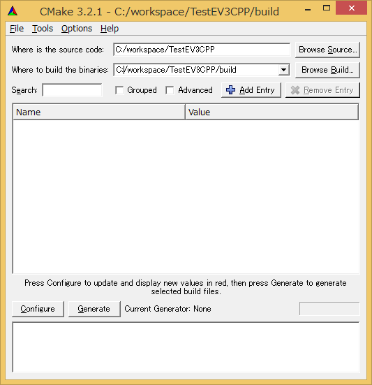</a></div>
<br>

Click **[Configure]** and then **[Generate]** to generate the **Visual Studio** project.


### Editing the Source Code

Open **TestEV3CPP.sln** in the build directory.

Next, edit the source code.

For **Python**, first modify the variable initialization section.

- TestEV3Py.py

```python
 	def __init__(self, manager):
 		#self._d_velocity_in = RTC.TimedVelocity2D(*velocity_in_arg)
 		self._d_velocity_in = RTC.TimedVelocity2D(RTC.Time(0,0),RTC.Velocity2D(0,0,0))
```

```python
 		#self._d_distance_sensor = RTC.TimedShortSeq(*distance_sensor_arg)
 		self._d_distance_sensor = RTC.TimedShortSeq(RTC.Time(0,0),[])
```

```python
 		#self._d_velocity_out = RTC.TimedVelocity2D(*velocity_out_arg)
 		self._d_velocity_out = RTC.TimedVelocity2D(RTC.Time(0,0),RTC.Velocity2D(0,0,0))
```

```python
 		#self._d_buzzer = RTC.TimedShort(*buzzer_arg)
 		self._d_buzzer = RTC.TimedShort(RTC.Time(0,0),0)
```

First, write code in **onExecute** that outputs the input velocity unchanged.

<br>

For **C++**, it is implemented as follows.

<br>

Use the **isNew** function to check whether new input data exists, and store it in the variable (**m_velocity_in**) using the **read** function.

Then store the output data in **m_velocity_out** and call the **write** function to transmit the data.

- src/TestEV3CPP.cpp

```cpp
 	if (m_velocity_inIn.isNew())
 	{
 		m_velocity_inIn.read();
 		// Output the input velocity unchanged
 		m_velocity_out.data.vx = m_velocity_in.data.vx;
 		m_velocity_out.data.vy = m_velocity_in.data.vy;
 		m_velocity_out.data.va = m_velocity_in.data.va;
 		setTimestamp(m_velocity_out);
 		m_velocity_outOut.write();
 	}
```

For **Python**, it is implemented as follows.

- TestEV3Py.py

```python
 		if self._velocity_inIn.isNew():
 			data = self._velocity_inIn.read()
 			# Output the input velocity unchanged
 			self._d_velocity_out.data.vx = data.data.vx
 			self._d_velocity_out.data.vy = data.data.vy
 			self._d_velocity_out.data.va = data.data.va
 			OpenRTM_aist.setTimestamp(self._d_velocity_out)
 			self._velocity_outOut.write()
```

Next, implement processing that stops the robot when the touch sensor is ON.

<br>

Since touch sensor data is not always received continuously, declare a variable to store the sensor state.

<br>

For **C++**, add the following to **TestEV3CPP.h**.

- include/TestEV3CPP/TestEV3CPP.h

```cpp
  private:
 	 bool m_last_sensor_data[2];
```

<br>

For **Python**, add the following to the constructor.

- TestEV3Py.py

```python
 	def __init__(self, manager):
 		OpenRTM_aist.DataFlowComponentBase.__init__(self, manager)

 		self._last_sensor_data = [False, False]
```

Next, add the stop-processing logic to **onExecute**.

<br>

For **C++**, the implementation is shown below.

<br>

First, check whether new data has arrived on the **touch** InPort using **isNew**. If new data exists, read it using **read** and store it in **m_last_sensor_data**.

Then, if **vx** of the data received from **velocity_in** is greater than or equal to 0, the robot is considered to be moving forward and may collide with an obstacle. If the touch sensor is ON, the robot stops and a buzzer sound is played.

- src/TestEV3CPP.cpp

```cpp
 RTC::ReturnCode_t TestEV3CPP::onExecute(RTC::UniqueId ec_id)
 {
 	// Store newly received sensor data in m_last_sensor_data
 	if (m_touchIn.isNew())
 	{
 		m_touchIn.read();
 		if (m_touch.data.length() == 2)
 		{
 			for (int i = 0; i < 2; i++)
 			{
 				// Play a sound when the touch sensor changes from OFF to ON
 				if (!m_last_sensor_data[i] && m_touch.data[i])
 				{
 					m_sound.data = m_sound_output.c_str();
 					setTimestamp(m_sound);
 					m_soundOut.write();

 				}
 				m_last_sensor_data[i] = m_touch.data[i];
 			}
 		}
 	}
 	if (m_velocity_inIn.isNew())
 	{
 		m_velocity_inIn.read();
 		// Determine whether to stop only when vx >= 0 (moving forward)
 		if (m_velocity_in.data.vx > 0)
 		{
 			for (int i = 0; i < 2; i++)
 			{
 				// Stop when the touch sensor is ON
 				if (m_last_sensor_data[i])
 				{
 					// Stop the robot
 					m_velocity_out.data.vx = 0;
 					m_velocity_out.data.vy = 0;
 					m_velocity_out.data.va = 0;
 					setTimestamp(m_velocity_out);
 					m_velocity_outOut.write();


 					return RTC::RTC_OK;
 				}
 			}
 		}
 		// Output the input velocity unchanged
 		m_velocity_out.data.vx = m_velocity_in.data.vx;
 		m_velocity_out.data.vy = m_velocity_in.data.vy;
 		m_velocity_out.data.va = m_velocity_in.data.va;
 		setTimestamp(m_velocity_out);
 		m_velocity_outOut.write();
   return RTC::RTC_OK;
 }
```

For **Python**, the implementation is as follows.

- TestEV3Py.py

```python
 	def onExecute(self, ec_id):
 		# Store newly received sensor data in m_last_sensor_data
 		if self._touchIn.isNew():
 			data = self._touchIn.read()
 			if len(data.data) == 2:
 				for i in range(2):
 					# Play a sound when the touch sensor changes from OFF to ON
 					if not self._last_sensor_data[i] and data.data[i]:
 						self._d_sound.data = self._sound_output[0]
 						OpenRTM_aist.setTimestamp(self._d_sound)
 						self._soundOut.write()
 				self._last_sensor_data = data.data[:]

 		if self._velocity_inIn.isNew():
 			data = self._velocity_inIn.read()
 			# Determine whether to stop only when vx >= 0 (moving forward)
 			if data.data.vx > 0:
 				for d in self._last_sensor_data:
 					# Stop when the touch sensor is ON
 					if d:
 						# Stop the robot
 						self._d_velocity_out.data.vx = 0
 						self._d_velocity_out.data.vy = 0
 						self._d_velocity_out.data.va = 0
 						OpenRTM_aist.setTimestamp(self._d_velocity_out)
 						self._velocity_outOut.write()

 						return RTC.RTC_OK

 			# Output the input velocity unchanged
 			self._d_velocity_out.data.vx = data.data.vx
 			self._d_velocity_out.data.vy = data.data.vy
 			self._d_velocity_out.data.va = data.data.va
 			OpenRTM_aist.setTimestamp(self._d_velocity_out)
 			self._velocity_outOut.write()
 		return RTC.RTC_OK
```

After editing the code, build the project if you are using **C++**.

<br>

If the build succeeds, **TestEV3CPPComp.exe** will be generated in:

```text
build\src\Release
```

(or `build\src\Debug`).

### Operation Check

Start **TestEV3CPPComp.exe** (or **TestEV3CPPComp.py**) by double-clicking it.

<br>

Connect **TestEV3CPP** (or **TestEV3Py**) as shown below.

<br>

<div align="center"><a href="tutorial_ev3_18.png">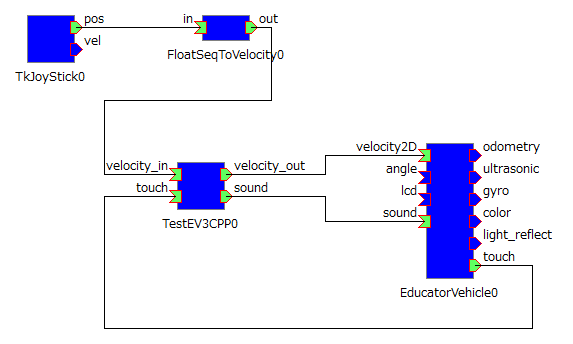</a></div>
<br>

Finally, activate the RTCs and verify that the system operates correctly.

### Saving an RT System

To save the RT System, right-click on the **System Diagram** and select **Save As...**

<br>

<div align="center"><a href="tutorial_ev3_20.png">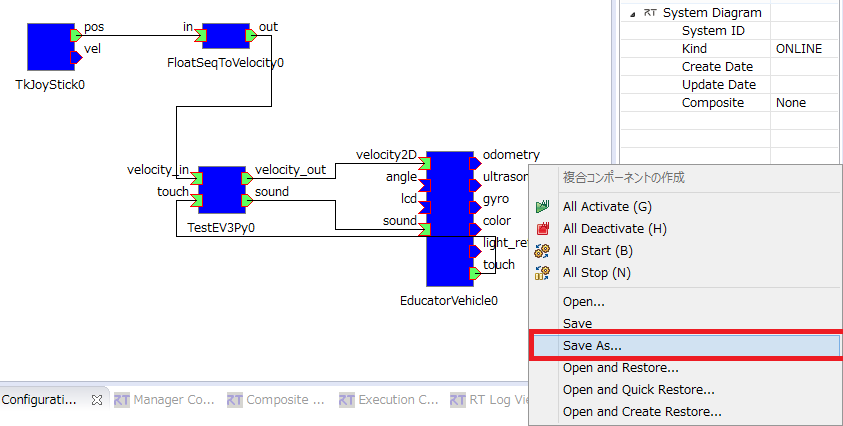</a></div>

<br>

<div align="center"><a href="tutorial_raspimouse14.png"></a></div>

<br>

### Restoring an RT System

To restore a saved RT System, select **Open and Restore** and choose the file you saved earlier.

<br>

<div align="center"><a href="raspi_tu28.png"></a></div>
<br>

### Exiting an RTC

To terminate an RTC, execute **Exit** on the RTC from RT System Editor.

<br>

<div align="center"><a href="tutorial_ev3_19.png">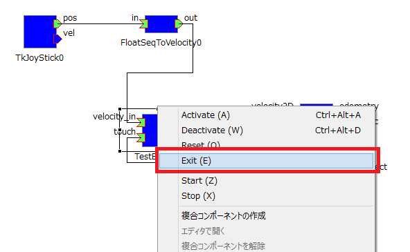</a></div>

## Supplement

### About the Script Files

By selecting **File Browser** from the EV3 button menu, you can operate files and directories under:

```text
/home/robot
```

<br>

The following operations can be performed by executing shell scripts in the **scripts** folder.

<table class="table-alt">
  <tr>
    <td>Script File Name</td>
    <td>Description</td>
  </tr>
  <tr>
    <td>run_rtcs.sh</td>
    <td>Start RTCs</td>
  </tr>
  <tr>
    <td>stop_rtcs.sh</td>
    <td>Stop RTCs</td>
  </tr>
</table>
