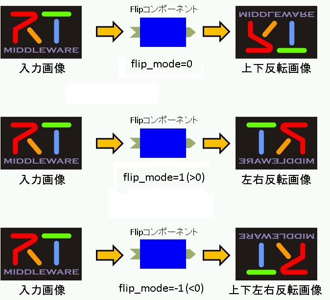
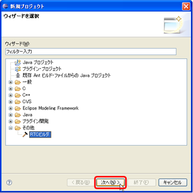
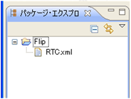
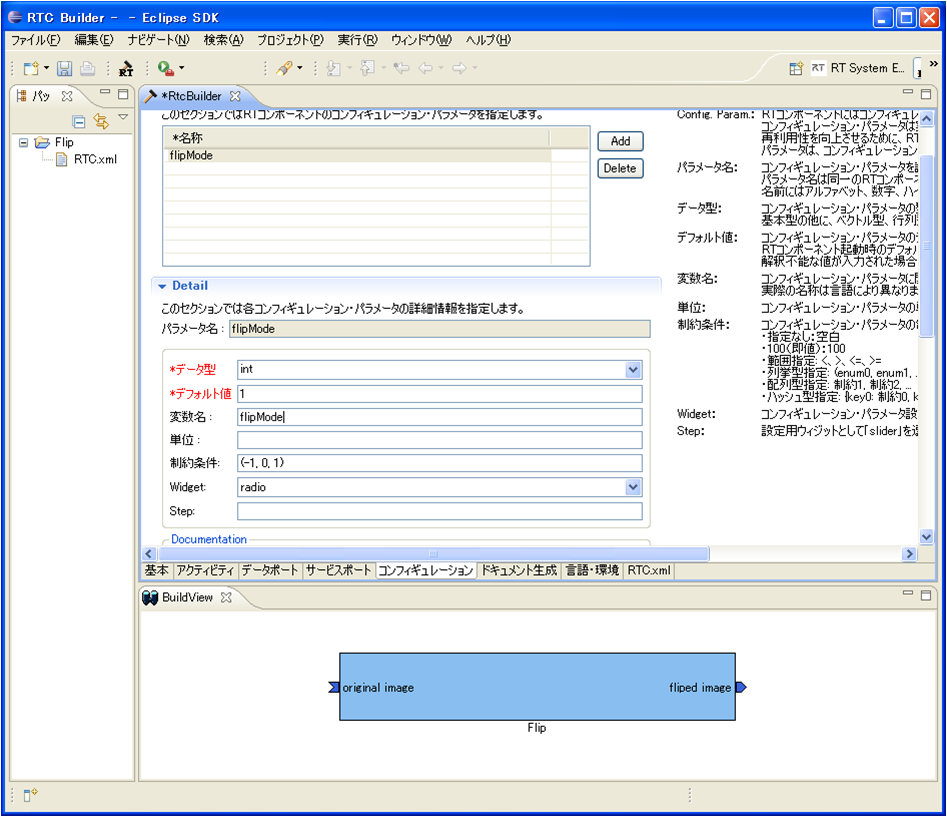
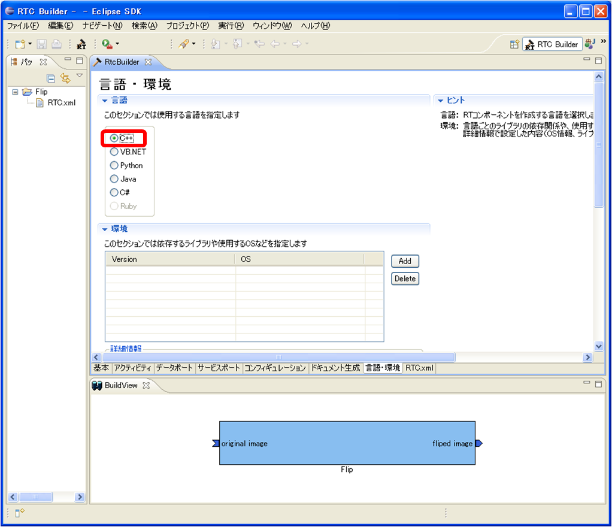
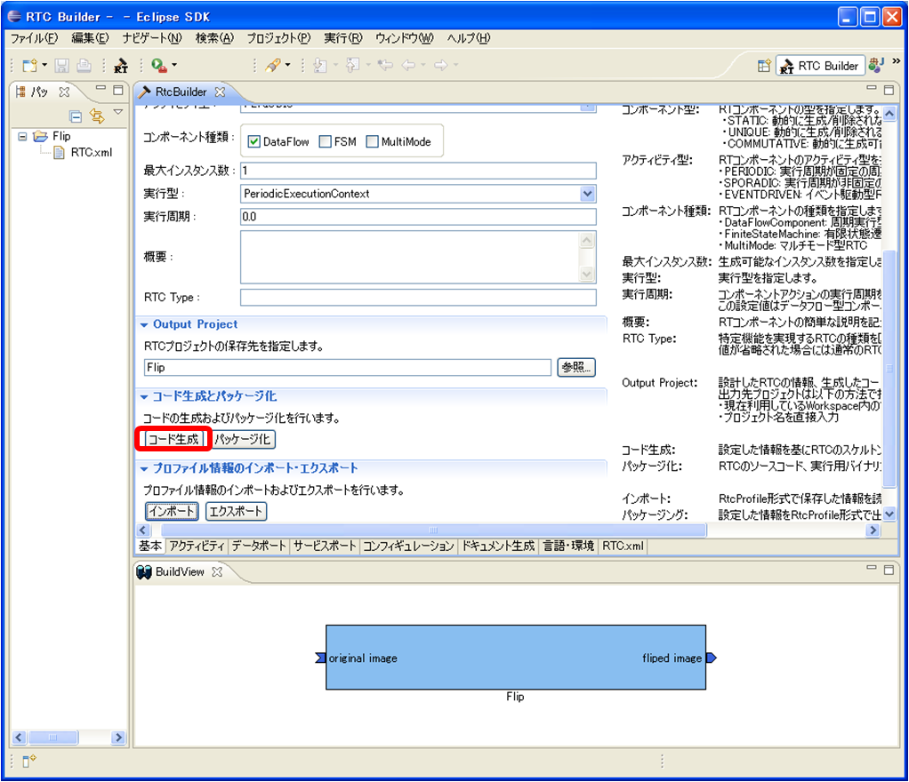
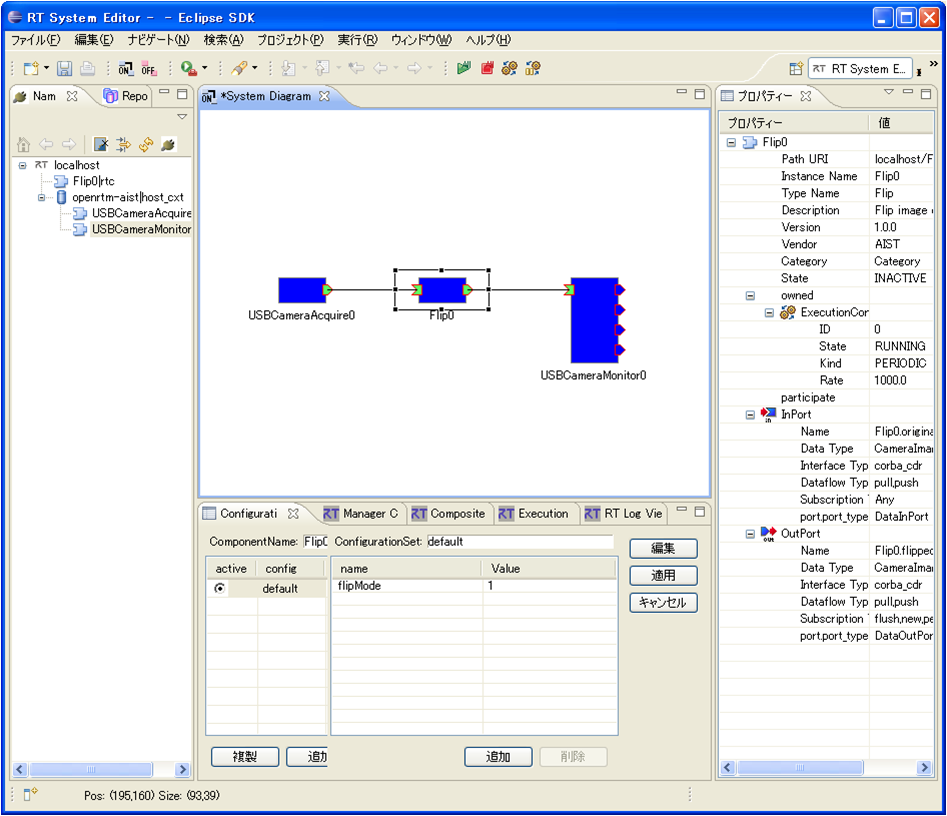

<!-- Title: Creating an Image Processing Component (OpenRTM-aist-1.1, CMake, Linux Ubuntu 14.04) -->
#contents

## Introduction

This case study introduces how to componentize simple image processing.

Using an existing camera component and image display component, a component is created that performs horizontal (or vertical) image flipping on camera images, and a system is built to display the flipped camera image.

Although image flipping can be implemented easily, this tutorial uses the OpenCV library to simplify the implementation further and create a more versatile RT Component.

### What is OpenCV?

[OpenCV](http://opencv.jp/) is an open-source computer vision library originally developed and released by Intel and currently maintained by Willow Garage.

Excerpted from [Wikipedia](https://ja.wikipedia.org/wiki/OpenCV).

### RT Component to be Created

- Flip Component: An RT Component that performs image flipping using the `cvFlip()` function, one of the many image processing functions provided by the OpenCV library.

## Converting the cvFlip Function into an RT Component

An RT Component that flips input images horizontally or vertically and outputs the result is created using the OpenCV library's `cvFlip` function.

The development and execution environment assumes Visual C++ on Windows. The target OpenRTM-aist version is 1.1.

The overall development procedure is as follows:

- Verify the runtime and development environments
- Review OpenCV and the cvFlip function
- Define the component specifications
- Generate a source code template using RTCBuilder
- Implement activity processing
- Verify component operation

### Verifying the Runtime Environment

A development environment is built on Linux (Ubuntu 14.04 is assumed here).

#### Installing OpenRTM-aist

&color(red){
When using Choreonoid, install OpenRTM-aist from the PPA as shown below.

If you have already executed the all-in-one installation script, comment out the openrtm.org repository entries added near the bottom of `/etc/apt/sources.list`, and then run `apt-get update`.
};

```bash
 $ sudo add-apt-repository ppa:hrg/daily
 $ sudo apt-get update
 $ sudo apt-get install openrtm-aist openrtm-aist-dev doxygen
```

#### Installing OpenRTP

Download and install the Linux version of OpenRTP (integrated component development and system development environment) from [this URL]({{ site.baseurl }}/ja/download/openrtp/openrtp-110-rc5-ja).

Java is also required to run OpenRTP, so install the `default-jre` package.

```bash
 $ apt-get install default-jre
 $ wget http://openrtm.org/pub/openrtp/packages/1.1.0.rc5v20150317/eclipse381-openrtp110rc5v20150317-ja-linux-gtk-x86_64.tar.gz
 $ tar xvzf eclipse381-openrtp110rc5v20150317-ja-linux-gtk-x86_64.tar.gz
 $ cd eclipse
```

<!-- $ ./eclipse -->

```bash
 $ ./openrtp
```

<span style="color:red;">After starting Eclipse, RTSystemEditor may not be able to connect to the Name Server. In that case, add your host name to the localhost entry in `/etc/hosts`.</span>;

```bash
 $ hostname
 ubuntu1404 ← The host name is ubuntu1404
 $ sudo vi /etc/hosts
```

```text
 127.0.0.1       localhost
 Change it as follows:
 127.0.0.1       localhost ubuntu1404
```

#### Installing OpenCV and OpenCV Components

Install OpenCV and the OpenCV components.

First, install the OpenCV packages provided by Ubuntu as follows:

```bash
 $ sudo apt-get install libopencv-dev libcv2.4 libcvaux2.4 libhighgui2.4
```

The OpenCV RTC package is available at the URL below. Download it manually and install it using the `dpkg` command.

```bash
 $ wget http://openrtm.org/pub/Linux/ubuntu/dists/trusty/main/binary-amd64/imageprocessing-1.1.0.deb
 $ sudo dpkg -i imageprocessing-1.1.0.deb
 $ ls /usr/share/openrtm-1.1/components/c++/opencv-rtcs/
 AffineComp                       FlipComp               RockPaperScissorsComp
 Affine.so                        Flip.so                RockPaperScissors.so
 BackGroundSubtractionSimpleComp  HistogramComp          RotateComp
 BackGroundSubtractionSimple.so   Histogram.so           Rotate.so
 BinarizationComp                 HoughComp              ScaleComp
 Binarization.so                  Hough.so               Scale.so
 CameraViewerComp                 ImageCalibrationComp   SepiaComp
 CameraViewer.so                  ImageCalibration.so    Sepia.so
 ChromakeyComp                    ImageSubstractionComp  SubStractCaptureImageComp
 Chromakey.so                     ImageSubstraction.so   SubStractCaptureImage.so
 DilationErosionComp              ObjectTrackingComp     TemplateComp
 DilationErosion.so               ObjectTracking.so      Template.so
 EdgeComp                         OpenCVCameraComp       TranslateComp
 Edge.so                          OpenCVCamera.so        Translate.so
 FindcontourComp                  PerspectiveComp
 Findcontour.so                   Perspective.so
```

### About the cvFlip Function

The `cvFlip` function flips image data of type `IplImage`, which is commonly used in OpenCV, around the vertical axis (horizontal flip), horizontal axis (vertical flip), or both axes (horizontal and vertical flip). The function prototype and the meanings of its arguments are as follows.

```cpp
 void cvFlip(IplImage* src, IplImage* dst=NULL, int flipMode=0);
 #define cvMirror cvFlip

 src       Input array
 dst       Output array. If dst=NULL, src is overwritten.
 flipMode  Specifies the flip operation:
   flipMode = 0: Flip around the X axis (vertical flip)
   flipMode > 0: Flip around the Y axis (horizontal flip)
   flipMode < 0: Flip around both axes (horizontal and vertical flip)
```

### Component Specifications

The component to be created will be called the **Flip Component**.

This component has an image data input port (InPort) and an output port (OutPort) for outputting the flipped image.

The port names are defined as follows:

- Input Port (InPort): **originalImage**
- Output Port (OutPort): **flippedImage**

OpenRTM-aist includes sample vision-related components that use OpenCV.

The data ports of these components use the following `CameraImage` type for image input and output.

```cpp
   struct CameraImage
     {
         /// Time stamp.
         Time tm;
         /// Image pixel width.
         unsigned short width;
         /// Image pixel height.
         unsigned short height;
         /// Bits per pixel.
         unsigned short bpp;
         /// Image format (e.g. bitmap, jpeg, etc.).
         string format;
         /// Scale factor for images, such as disparity maps,
         /// where the integer pixel value should be divided
         /// by this factor to get the real pixel value.
         double fDiv;
         /// Raw pixel data.
         sequence<octet> pixels;
     };
```

This Flip component will also use the `CameraImage` type for both its InPort and OutPort so that it can exchange data with these sample components.

The `CameraImage` type is defined in `InterfaceDataTypes.idl`, and in C++ it becomes available by including `InterfaceDataTypesSkel.h`.

In addition, there are three possible flip directions: horizontal flip, vertical flip, and horizontal + vertical flip.

To allow this to be specified at runtime, the RT Component configuration mechanism will be used.

The parameter name will be **flipMode**.

To match the specification of the `cvFlip` function, the type will be `int`, and the following values will be assigned:

- 0: Vertical flip
- 1: Horizontal flip
- -1: Horizontal and vertical flip

The image processing behavior for each value of `flipMode` is shown below.

<div align="center"><a href="cvFlip_and_FlipRTC.png"></a></div>
<div align="center"><strong>Image Flip Patterns for the Flip Component Depending on flipMode</strong></div>

The specifications of the Flip component are summarized as follows.

<table class="table-alt">
  <tr>
    <th>Component Name</th>
    <th>Flip</th>
  </tr>
  <tr>
    <td colspan="2" style="text-align: center;">InPort</td>
  </tr>
  <tr>
    <td>Port Name</td>
    <td>originalImage</td>
  </tr>
  <tr>
    <td>Type</td>
    <td>CameraImage</td>
  </tr>
  <tr>
    <td>Description</td>
    <td>Input image</td>
  </tr>
  <tr>
    <td colspan="2" style="text-align: center;">OutPort</td>
  </tr>
  <tr>
    <td>Port Name</td>
    <td>flippedImage</td>
  </tr>
  <tr>
    <td>Type</td>
    <td>CameraImage</td>
  </tr>
  <tr>
    <td>Description</td>
    <td>Flipped image</td>
  </tr>
  <tr>
    <td colspan="2" style="text-align: center;">Configuration</td>
  </tr>
  <tr>
    <td>Parameter Name</td>
    <td>flipMode</td>
  </tr>
  <tr>
    <td>Type</td>
    <td>int</td>
  </tr>
  <tr>
    <td>Description</td>
    <td><strong>Flip Mode</strong><br>Vertical flip: 0<br>Horizontal flip: 1<br>Horizontal and vertical flip: -1</td>
  </tr>
</table>

### Runtime Environment and Development Environment

Let's verify the runtime and development environment.

- OS: Windows XP SP3 (Vista and Windows 7 are also supported)
- Compiler: [Visual C++ 2010 Express Edition Japanese Version](http://go.microsoft.com/fwlink/?LinkId=190491&clcid=0x411)

- [OpenRTM-aist-1.1.0-RC3 (C++ Version), Win32 VC2010]({{ site.baseurl }}/ja/download/openrtm-aist-content/110-rc3)

- RTSystemEditor 1.1
- RTCBuilder 1.1
  - [Eclipse 3.4.2 + RTSE + RTCB (1.1.0-RC2) All-in-One Package for Windows](http://www.openrtm.org/pub/OpenRTM-aist/tools/1.1.0/eclipse342_rtmtools110-rc2_win32_ja.zip)

- [Doxygen](http://ftp.stack.nl/pub/users/dimitri/doxygen-1.8.11-setup.exe) Required for document generation
- [CMake](https://cmake.org/files/v2.8/cmake-2.8.5-win32-x86.exe)

- [Archive Extraction Tool (Lhaplus)](http://www.forest.impress.co.jp/lib/arc/archive/archiver/lhaplus.html)

From OpenRTM-aist 1.1 onward, CMake is used to build components.

In addition, RTCBuilder can automatically generate component manuals by passing documentation to Doxygen.

For this reason, Doxygen is required when running Configure with CMake and must be installed beforehand.

### Generating the Flip Component Template

The Flip component template is generated using RTCBuilder.

#### Starting RTCBuilder

In Eclipse, the folder used for development work is called a **workspace**, and in principle all generated files are stored under this folder.

The workspace may be located anywhere that is accessible, but this tutorial assumes the following workspace:

- `/workspace` (meaning `/home/<username>/workspace`)

When Eclipse starts, it prompts for the workspace location.

When Eclipse is started for the first time, or when started with the `-clean` option, the directory above is specified by default. Simply click the **[OK]** button.

The following Welcome screen will be displayed.

Since the Welcome screen is not needed at this point, click the **×** button in the upper-left corner to close it.

<div align="center"><a href="fig1-1EclipseInit.png"></a></div>
<div align="center"><strong>Screen Displayed When Eclipse Starts for the First Time</strong></div>

Click the **[Open Perspective]** button in the upper-right corner and select **Other...** from the pull-down menu.

<div align="center"><a href="fig2-2PerspectiveSwitch.png"></a></div>
<div align="center"><strong>Switching Perspectives</strong></div>

Select **RTC Builder** to start RTCBuilder.

The RTCBuilder icon (hammer and RT symbol) will appear on the menu bar.

<div align="center"><a href="fig2-3PerspectiveSelection.png"></a></div>
<div align="center"><strong>Selecting a Perspective</strong></div>

#### Creating a New Project

To create the Flip component, a new project must be created in RTCBuilder.

There are two methods for creating a project.

1. Select **[File] > [New] > [Project]** from the menu at the top of the screen (standard Eclipse operation)
   - In the **New Project** screen, select **[Other] > [RTC Builder]** and click **[Next]**.

2. Click the **RTCBuilder** icon on the menu bar.

<div align="center"><a href="fig2-5CreateProject.png"></a></div>
<div align="center"><strong>Creating an RTC Builder Project 1 (From the File Menu)</strong></div>

<div align="center"><a href="fig2-6CreateProject2.png"></a></div>
<div align="center"><strong>Creating an RTC Builder Project 2 (From the File Menu)</strong></div>

Either method launches the project creation wizard shown below.

Enter the project name (**Flip** in this example) in the **Project Name** field and click the **[Finish]** button.

<div align="center"><a href="RT-Component-BuilderProject.png"></a></div>
<div align="center"><strong>Creating an RTC Builder Project 3</strong></div>

A project with the specified name is generated and added to the Package Explorer.

<div align="center"><a href="PackageExplolrer.png"></a></div>
<div align="center"><strong>Creating an RTC Builder Project 4</strong></div>

An RTC profile XML file (`RTC.xml`) with default values is automatically generated within the created project.

#### Starting the RTC Profile Editor

When `RTC.xml` is generated, the RTCBuilder editor associated with the project workspace should open automatically.

If it does not open, click the **Open New RtcBuilder Editor** button on the toolbar, or select **[File] > [Open New Builder Editor]** from the menu bar.

<div align="center"><a href="Open_RTCBuilder.png"></a></div>
<div align="center"><strong>Open New RtcBuilder Editor from the Toolbar</strong></div>

<div align="center"><a href="fig2-10FileMenuOpenNewBuilder.png"></a></div>
<div align="center"><strong>Open New Builder Editor from the File Menu</strong></div>


#### Entering Profile Information and Generating Code

First, select the **Basic** tab on the far left and enter the basic information.

In addition to the Flip component specifications (name) defined earlier, enter information such as the description and version.

Items with red labels are required.

The other items may be left at their default values.

- Module Name: Flip
- Module Description: Flip image component
- Version: 1.0.0
- Vendor Name: AIST
- Module Category: Category
- Component Type: STATIC
- Activity Type: PERIODIC
- Component Kind: DataFlowComponent
- Maximum Number of Instances: 1
- Execution Type: PeriodicExecutionContext
- Execution Period: 0.0 (<span style="color:RED;">The figure below shows 1.0, but set this to 0.0.</span>;)

<br>

<div align="center"><a href="Basic.png"></a></div>
<div align="center"><strong>Entering Basic Information</strong></div>
<br>

Next, select the **Activity** tab and specify the action callbacks to use.

The Flip component uses the `onActivated()`, `onDeactivated()`, and `onExecute()` callbacks.

As shown in the figure below, first click ① `onActivated`, then select **[ON]** using radio button ②.

Perform the same operation for `onDeactivated` and `onExecute`.

<br>

<div align="center"><a href="Activity.png"></a></div>
<div align="center"><strong>Selecting Activity Callbacks</strong></div>
<br>

Next, select the **Data Ports** tab and enter the data port information.

Enter the following values according to the specifications defined earlier.

The variable names and display positions are optional, so they may be left unchanged.

<br>

- InPort Profile:
  - Port Name: originalImage
  - Data Type: CameraImage
  - Variable Name: originalImage
  - Display Position: left

<br>

- OutPort Profile:
  - Port Name: flippedImage
  - Data Type: CameraImage
  - Variable Name: flippedImage
  - Display Position: right

<br>

<div align="center"><a href="DataPort.png"></a></div>
<div align="center"><strong>Entering Data Port Information</strong></div>
<br>

Next, select the **Configuration** tab and enter the Configuration information based on the specifications defined earlier.

The constraint conditions and Widget settings are used when displaying component configuration parameters in RTSystemEditor, allowing values to be changed through GUI controls such as sliders, spin buttons, and radio buttons.

Here, when the specifications were defined earlier, `flipMode` was set to take only three possible values: -1, 0, and 1. Therefore, a radio button will be used.

<br>

- flipMode
  - Name: flipMode
  - Data Type: int
  - Default Value: 1
  - Variable Name: flipMode
  - Constraint: (-1, 0, 1) <span style="color:RED;">* (-1: horizontal and vertical flip, 0: vertical flip, 1: horizontal flip)</span>;
  - Widget: radio

<br>

<div align="center"><a href="Configuration.png"></a></div>
<div align="center"><strong>Entering Configuration Information</strong></div>
<br>

Next, select the **Language / Environment** tab and choose the programming language.

Here, select **C++** as the language.

The language/environment fields have no default values. If you forget to specify the language, an error will occur during code generation, so be sure to specify it.

Also, for C++, the default is to build using CMake. If you want RTCBuilder to directly generate old-style VC projects or solution files, check **[Use old build environment]**.

<div align="center"><a href="Language.png"></a></div>
<div align="center"><strong>Selecting the Programming Language</strong></div>
<br>

Finally, click the **[Generate Code]** button on the **Basic** tab to generate the component template.

<br>

<div align="center"><a href="Generate.png"></a></div>
<div align="center"><strong>Generating the Template (Generate)</strong></div>
<br>

&color(Red){*The generated code files are created in the workspace folder specified when Eclipse was started.
You can check the current workspace from [File] > [Switch Workspace].*};

#### Temporary Build

At this point, the source code for the Flip component has been generated.

Since the processing itself has not yet been implemented, nothing will be output even if an image is input to the InPort. However, the source code immediately after generation can still be compiled and executed.

*For components that have service ports and providers, some may not build successfully unless their implementation is completed.*

Now, first use CMake to configure the build environment.

On Linux, in the directory where the Flip component source code was generated:

```bash
 $ cd workspace/Flip
 $ mkdir build
 $ cd build
 $ cmake ..
 $ make
```

This should complete Configure and build.

After the build finishes, try starting the generated `FlipComp`.

```bash
 $ cd src
 $ ./FlipComp
```

After startup, try accessing it using RTSystemEditor or a similar tool.

A component named **Flip** should be displayed.

It can also be connected to a camera component (`OpenCVCameraComp`) or display component (`CameraViewerComp`), but since no processing is performed inside yet, nothing will be displayed in the display component.

From the next section, the component source code will be created and its internal processing will be implemented.


### Editing the Header and Source Files

Next, edit the header file (`include/Flip/Flip.h`) and source file (`src/Flip.cpp`).

The files can be opened in Eclipse by double-clicking them in the Package Explorer.

<div align="center"><a href="EditSource.png"></a></div>
<div align="center"><strong>Editing Source Files</strong></div>

### Editing the Header File (Flip.h)

First, include the OpenCV header files.

Add the following include statements.

```cpp
 #include <cv.h>
 #include <cxcore.h>
 #include <highgui.h>
```

Next, add variables to store image data.

Add the following declarations to the private section.

```cpp
 private:
   IplImage* m_imageBuff;
   IplImage* m_flipImageBuff;
```

The purpose of these variables is as follows.

- `m_imageBuff`
  - Stores the image received from the InPort.

- `m_flipImageBuff`
  - Stores the image after flipping.

### Editing the Source File (Flip.cpp)

#### Initialization Processing

Initialize the image buffers when the component becomes active.

Edit `onActivated()` as follows.

```cpp
 RTC::ReturnCode_t Flip::onActivated(RTC::UniqueId ec_id)
 {
   // Initialize image memory
   m_imageBuff = NULL;
   m_flipImageBuff = NULL;

   // Initialize output image size
   m_flippedImage.width = 0;
   m_flippedImage.height = 0;

   return RTC::RTC_OK;
 }
```

#### Cleanup Processing

Release the allocated image memory when the component is deactivated.

Edit `onDeactivated()` as follows.

```cpp
 RTC::ReturnCode_t Flip::onDeactivated(RTC::UniqueId ec_id)
 {
   if(m_imageBuff != NULL)
   {
     cvReleaseImage(&m_imageBuff);
     cvReleaseImage(&m_flipImageBuff);
   }

   return RTC::RTC_OK;
 }
```

#### Image Processing

The main image processing is implemented in `onExecute()`.

First, check whether new image data has arrived at the InPort.

```cpp
 if (m_originalImageIn.isNew())
 {
   m_originalImageIn.read();
 }
```

The received image is stored in `m_originalImage`.

#### Allocating Image Buffers

The image size may change depending on the camera.

Therefore, before processing, verify whether the image size has changed.

If it has changed, release the existing buffers and allocate new ones.

```cpp
 if( m_originalImage.width != m_flippedImage.width ||
     m_originalImage.height != m_flippedImage.height)
 {
   m_flippedImage.width = m_originalImage.width;
   m_flippedImage.height = m_originalImage.height;

   if(m_imageBuff != NULL)
   {
     cvReleaseImage(&m_imageBuff);
     cvReleaseImage(&m_flipImageBuff);
   }

   m_imageBuff =
     cvCreateImage(
       cvSize(
         m_originalImage.width,
         m_originalImage.height),
       IPL_DEPTH_8U,
       3);

   m_flipImageBuff =
     cvCreateImage(
       cvSize(
         m_originalImage.width,
         m_originalImage.height),
       IPL_DEPTH_8U,
       3);
 }
```

#### Copying Image Data

Copy the image data received through the data port into the OpenCV image buffer.

```cpp
 memcpy(
   m_imageBuff->imageData,
   (void *)&(m_originalImage.pixels[0]),
   m_originalImage.pixels.length());
```

The `pixels` member of `CameraImage` contains the actual image data.

#### Executing the Flip Operation

Perform image flipping using the OpenCV `cvFlip()` function.

```cpp
 cvFlip(
   m_imageBuff,
   m_flipImageBuff,
   m_flipMode);
```

The meaning of `m_flipMode` is as follows.

```text
  0 : Vertical flip
  1 : Horizontal flip
 -1 : Horizontal and vertical flip
```

Since `m_flipMode` is bound to a configuration parameter, the user can change it at runtime through RTSystemEditor.

#### Preparing Output Data

After processing is completed, copy the flipped image into the output data structure.

First, determine the image data size.

```cpp
 int len =
   m_flipImageBuff->nChannels *
   m_flipImageBuff->width *
   m_flipImageBuff->height;
```

Resize the output image buffer.

```cpp
 m_flippedImage.pixels.length(len);
```

Copy the processed image data.

```cpp
 memcpy(
   (void *)&(m_flippedImage.pixels[0]),
   m_flipImageBuff->imageData,
   len);
```

#### Writing Data to the OutPort

Finally, output the flipped image.

```cpp
 m_flippedImageOut.write();
```

#### Complete onExecute() Processing

Combining the processing described above results in the following implementation.

```cpp
 RTC::ReturnCode_t Flip::onExecute(RTC::UniqueId ec_id)
 {
   if (m_originalImageIn.isNew())
   {
     m_originalImageIn.read();

     if( m_originalImage.width != m_flippedImage.width ||
         m_originalImage.height != m_flippedImage.height)
     {
       m_flippedImage.width = m_originalImage.width;
       m_flippedImage.height = m_originalImage.height;

       if(m_imageBuff != NULL)
       {
         cvReleaseImage(&m_imageBuff);
         cvReleaseImage(&m_flipImageBuff);
       }

       m_imageBuff =
         cvCreateImage(
           cvSize(
             m_originalImage.width,
             m_originalImage.height),
           IPL_DEPTH_8U,
           3);

       m_flipImageBuff =
         cvCreateImage(
           cvSize(
             m_originalImage.width,
             m_originalImage.height),
           IPL_DEPTH_8U,
           3);
     }

     memcpy(
       m_imageBuff->imageData,
       (void *)&(m_originalImage.pixels[0]),
       m_originalImage.pixels.length());

     cvFlip(
       m_imageBuff,
       m_flipImageBuff,
       m_flipMode);

     int len =
       m_flipImageBuff->nChannels *
       m_flipImageBuff->width *
       m_flipImageBuff->height;

     m_flippedImage.pixels.length(len);

     memcpy(
       (void *)&(m_flippedImage.pixels[0]),
       m_flipImageBuff->imageData,
       len);

     m_flippedImageOut.write();
   }

   return RTC::RTC_OK;
 }
```


### Generating Files Required for Building with CMake

#### Editing CMakeLists.txt

Double-click `src/CMakeLists.txt` in the Package Explorer on the left side of the Eclipse screen, or drag and drop it into the editor to edit it.

<div align="center"><a href="EditCmakeLists.png"></a></div>
<div align="center"><strong>Editing CMakeLists.txt</strong></div>

Since this component uses OpenCV, you need to provide the include path for the OpenCV headers, the libraries, and the library search paths.

Fortunately, OpenCV supports CMake, so OpenCV libraries can be linked and used simply by adding or modifying the following two lines.

- Modify `src/CMakeLists.txt`
  - Double-click `src/CMakeLists.txt` in Eclipse's Package Explorer.
1. Add `find_package(OpenCV REQUIRED)`.
1. Add `${OpenCV_LIBS}` to the first `target_link_libraries`.
  - There are two `target_link_libraries` entries. The upper one specifies the DLL library, and the lower one specifies the executable file library.

```cmake
 set(comp_srcs Flip.cpp )
 set(standalone_srcs FlipComp.cpp)

 find_package(OpenCV REQUIRED) ← Add this line
   ：omitted
 add_dependencies(${PROJECT_NAME} ALL_IDL_TGT)
 target_link_libraries(${PROJECT_NAME} ${OPENRTM_LIBRARIES} ${OpenCV_LIBS}) ← Add OpenCV_LIBS
   ：omitted
 add_executable(${PROJECT_NAME}Comp ${standalone_srcs}
   ${comp_srcs} ${comp_headers} ${ALL_IDL_SRCS})
 target_link_libraries(${PROJECT_NAME}Comp ${OPENRTM_LIBRARIES} ${OpenCV_LIBS}) ← Add OpenCV_LIBS
```

### Build

#### Executing the Build

Since `CMakeLists.txt` has been edited, run Configure and Generate again with CMake.

```bash
 $ cd workspace/Flip (move to the Flip directory under the Eclipse workspace)
 $ rm -rf build (delete the directory created during the temporary build just in case)
 $ mkdir build (create the build directory again)
 $ cd build
 $ cmake ..
 $ make
```

Confirm that CMake Generate has completed successfully, then run `make`.

If there is a problem during Configure, there may be an error in the `Flip/src/CMakeLists.txt` file edited earlier.

If an error occurs during `make`, there may be an error in the source code or header file edits.

Carefully check the error messages and correct the problem.

### Verifying Operation of the Flip Component

Here, operation is verified by connecting the camera component (`OpenCVCameraComp` or `DirectShowCamComp`) and the viewer component (`CameraViewerComp`), which have been included since OpenRTM-aist 1.1.

#### Starting NameService

Start the Name Service used to register component references.

<br>

```bash
 $ rtm-naming
```

#### Creating rtc.conf

In RT Components, information such as the Name Server address and the registration format for the Name Server must be specified in a file named `rtc.conf`.

Save the following content in a file named `rtc.conf` and place it in the `workspace/Flip/build/src/` directory.

```text
 corba.nameservers: localhost
 naming.formats: %n.rtc
```


#### Starting the Flip Component

Start the Flip component.

Run the `FlipComp.exe` file in the folder where you placed the `rtc.conf` file earlier.

```bash
 $ cd workspace/Flip/build/src (if you are currently somewhere other than build/src)
 $ ./FlipComp
```

#### Starting the Camera Component and Viewer Component

Start `OpenCVCameraComp`, which outputs captured images from a USB camera through an OutPort, and `CameraViewerComp`, which displays images received through an InPort on the screen.

```bash
 $ /usr/share/openrtm-1.1/components/c++/opencv-rtcs/OpenCVCameraComp
 $ /usr/share/openrtm-1.1/components/c++/opencv-rtcs/CameraViewerComp
```

### Connecting the Components

In RTSystemEditor, connect `OpenCVCameraComp` (or `DirectShowcomp`), `Flip`, and `CameraviewerComp` as shown below.

<div align="center"><a href="RTSE_Connect.png"></a></div>
<div align="center"><strong>Connecting the Components</strong></div>

<span style="color:red;">After starting Eclipse, RTSystemEditor may fail to connect to the Name Server. In that case, add your host name to the localhost entry in `/etc/hosts`.</span>;

```bash
 $ hostname
 ubuntu1404 ← The host name is ubuntu1404
 $ sudo vi /etc/hosts
```

```text
 127.0.0.1       localhost
 Change it as follows:
 127.0.0.1       localhost ubuntu1404
```

#### Activating the Components

Click the **ALL** icon at the top of RTSystemEditor to activate all components.

If activation is successful, the components will be displayed in yellow-green as shown below.

<br>

<div align="center"><a href="RTSE_Activate.png"></a></div>
<div align="center"><strong>Activating the Components</strong></div>
<br>

#### Operation Check

As shown below, the configuration can be changed in the Configuration View.

Change the Flip component's configuration parameter `flipMode` to values such as `0` or `-1`, and verify that the image is flipped.

<br>

<div align="center"><a href="RTSE_Configuration.png"></a></div>
<div align="center"><strong>Changing Configuration Parameters</strong></div>
<br>


### Complete Source Code of the Flip Component

#### Flip Component Source File (Flip.cpp)

```cpp
 // -*- C++ -*-
 /*!
  * @file  Flip.cpp
  * @brief Flip image component
  * @date $Date$
  *
  * $Id$
  */

 #include "Flip.h"

 // Module specification
 static const char* flip_spec[] =
   {
     "implementation_id", "Flip",
     "type_name",         "Flip",
     "description",       "Flip image component",
     "version",           "1.0.0",
     "vendor",            "AIST",
     "category",          "Category",
     "activity_type",     "PERIODIC",
     "kind",              "DataFlowComponent",
     "max_instance",      "1",
     "language",          "C++",
     "lang_type",         "compile",
     // Configuration variables
     "conf.default.flipMode", "1",
     // Widget
     "conf.__widget__.flipMode", "radio",
     // Constraints
     "conf.__constraints__.flip_mode", "(-1,0,1)",
     ""
   };

 /*!
  * @brief constructor
  * @param manager Maneger Object
  */
 Flip::Flip(RTC::Manager* manager)
   : RTC::DataFlowComponentBase(manager),
     m_originalImageIn("originalImage", m_originalImage),
     m_flippedImageOut("flippedImage", m_flippedImage)
 {
 }

 /*!
  * @brief destructor
  */
 Flip::~Flip()
 {
 }


 RTC::ReturnCode_t Flip::onInitialize()
 {
   // Registration: InPort/OutPort/Service
   // Set InPort buffers
   addInPort("originalImage", m_originalImageIn);

   // Set OutPort buffer
   addOutPort("flippedImage", m_flippedImageOut);

   // Bind variables and configuration variable
   bindParameter("flipMode", m_flipMode, "1");

   return RTC::RTC_OK;
 }


 RTC::ReturnCode_t Flip::onActivated(RTC::UniqueId ec_id)
 {
   // Initialize image memory
   m_imageBuff = NULL;
   m_flipImageBuff = NULL;

   // Initialize the OutPort image size
   m_flippedImage.width = 0;
   m_flippedImage.height = 0;

   return RTC::RTC_OK;
 }


 RTC::ReturnCode_t Flip::onDeactivated(RTC::UniqueId ec_id)
 {
   if(m_imageBuff != NULL)
   {
     // Release image memory
     cvReleaseImage(&m_imageBuff);
     cvReleaseImage(&m_flipImageBuff);
   }

   return RTC::RTC_OK;
 }


 RTC::ReturnCode_t Flip::onExecute(RTC::UniqueId ec_id)
 {
   // Check for new data
   if (m_originalImageIn.isNew()) {
     // Read InPort data
     m_originalImageIn.read();

     // Process the InPort and OutPort image sizes and allocate image memory
     if( m_originalImage.width != m_flippedImage.width || m_originalImage.height != m_flippedImage.height)
       {
         m_flippedImage.width = m_originalImage.width;
         m_flippedImage.height = m_originalImage.height;

         // If the image size of the InPort has changed
         if(m_imageBuff != NULL)
           {
             cvReleaseImage(&m_imageBuff);
             cvReleaseImage(&m_flipImageBuff);
           }

         // Allocate image memory
         m_imageBuff = cvCreateImage(cvSize(m_originalImage.width, m_originalImage.height), IPL_DEPTH_8U, 3);
         m_flipImageBuff = cvCreateImage(cvSize(m_originalImage.width, m_originalImage.height), IPL_DEPTH_8U, 3);
       }

     // Copy the InPort image data to the imageData of IplImage
     memcpy(m_imageBuff->imageData,(void *)&(m_originalImage.pixels[0]),m_originalImage.pixels.length());

     // Flip the image data from the InPort. m_flipMode 0: around the X axis, 1: around the Y axis, -1: around both axes
     cvFlip(m_imageBuff, m_flipImageBuff, m_flipMode);

     // Get the image data size
     int len = m_flipImageBuff->nChannels * m_flipImageBuff->width * m_flipImageBuff->height;
     m_flippedImage.pixels.length(len);

     // Copy the flipped image data to the OutPort
     memcpy((void *)&(m_flippedImage.pixels[0]),m_flipImageBuff->imageData,len);

     // Output the flipped image data from the OutPort.
     m_flippedImageOut.write();
   }

   return RTC::RTC_OK;
 }


 extern "C"
 {

   void FlipInit(RTC::Manager* manager)
   {
     coil::Properties profile(flip_spec);
     manager->registerFactory(profile,
                              RTC::Create<Flip>,
                              RTC::Delete<Flip>);
   }

 };
```

#### Flip Component Header File (Flip.h)

```cpp
 // -*- C++ -*-
 /*!
  * @file  Flip.h
  * @brief Flip image component
  * @date  $Date$
  *
  * $Id$
  */

 #ifndef FLIP_H
 #define FLIP_H

 #include <rtm/Manager.h>
 #include <rtm/DataFlowComponentBase.h>
 #include <rtm/CorbaPort.h>
 #include <rtm/DataInPort.h>
 #include <rtm/DataOutPort.h>
 #include <rtm/idl/BasicDataTypeSkel.h>
 #include <rtm/idl/ExtendedDataTypesSkel.h>
 #include <rtm/idl/InterfaceDataTypesSkel.h>

 // Include OpenCV include files
 #include<cv.h>
 #include<cxcore.h>
 #include<highgui.h>

 using namespace RTC;

 /*!
  * @class Flip
  * @brief Flip image component
  *
  */
 class Flip
   : public RTC::DataFlowComponentBase
 {
  public:
   /*!
    * @brief constructor
    * @param manager Maneger Object
    */
   Flip(RTC::Manager* manager);

   /*!
    * @brief destructor
    */
   ~Flip();

   /***
    *
    * The initialize action (on CREATED->ALIVE transition)
    * former rtc_init_entry()
    *
    * @return RTC::ReturnCode_t
    *
    *
    */
    virtual RTC::ReturnCode_t onInitialize();

   /***
    *
    * The activated action (Active state entry action)
    * former rtc_active_entry()
    *
    * @param ec_id target ExecutionContext Id
    *
    * @return RTC::ReturnCode_t
    *
    *
    */
    virtual RTC::ReturnCode_t onActivated(RTC::UniqueId ec_id);

   /***
    *
    * The deactivated action (Active state exit action)
    * former rtc_active_exit()
    *
    * @param ec_id target ExecutionContext Id
    *
    * @return RTC::ReturnCode_t
    *
    *
    */
    virtual RTC::ReturnCode_t onDeactivated(RTC::UniqueId ec_id);

   /***
    *
    * The execution action that is invoked periodically
    * former rtc_active_do()
    *
    * @param ec_id target ExecutionContext Id
    *
    * @return RTC::ReturnCode_t
    *
    *
    */
    virtual RTC::ReturnCode_t onExecute(RTC::UniqueId ec_id);

  protected:

   // Configuration variable declaration

   /*!
    *
    * - Name:  flipMode
    * - DefaultValue: 1
    */
   int m_flipMode;


   // DataInPort declaration

   CameraImage m_originalImage;

   /*!
    */
   InPort<CameraImage> m_originalImageIn;


   // DataOutPort declaration

   CameraImage m_flippedImage;

   /*!
    */
   OutPort<CameraImage> m_flippedImageOut;


  private:

   // Buffer for processed images
   IplImage* m_imageBuff;
   IplImage* m_flipImageBuff;

 };


 extern "C"
 {
   DLL_EXPORT void FlipInit(RTC::Manager* manager);
 };

 #endif // FLIP_H
```

### Complete Source Code of the Flip Component

The complete source code of the Flip component is attached below.

- [Flip.zip](Flip.zip)
