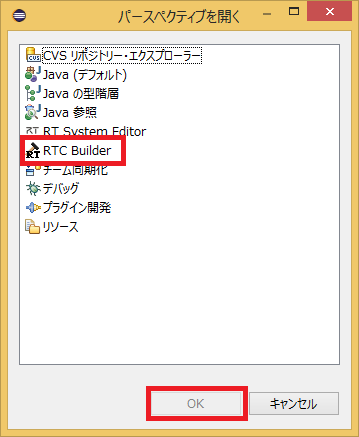
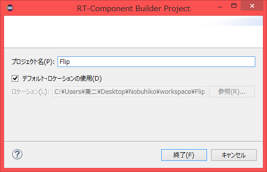
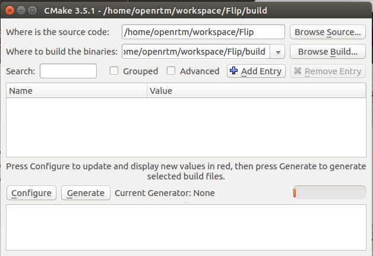
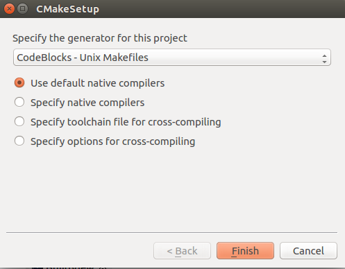

<!-- Title: Creating an Image Processing Component (Ubuntu 16.04, OpenRTM-aist-1.1.2-RELEASE, OpenRTP-1.1.2, CMake-3.5.1, Code::Blocks-16.01) -->
#contents

## Introduction

This case study introduces how to componentize simple image processing.

Using an existing camera component and image display component, a component is created that performs horizontal (or vertical) image flipping on images from a camera, and a system is built to display the flipped camera image.

Although image flipping can be implemented easily, OpenCV is used here to simplify implementation further and create a more versatile RT Component.

### What is OpenCV?

[OpenCV](http://opencv.jp/) is an open-source computer vision library that was formerly developed and released by Intel and is currently developed and maintained by Itseez.

Excerpted from [Wikipedia](https://ja.wikipedia.org/wiki/OpenCV).

### RT Component to be Created

- Flip Component: An RT Component that performs image flipping using the `cv::flip()` function, one of the various image processing functions provided by the OpenCV library.

## Converting the cv::flip Function into an RT Component

An RT Component that flips input images horizontally or vertically and outputs the result is created using the OpenCV library's `cv::flip` function. The development and execution environment assumes Code::Blocks (gcc compiler) running on Ubuntu.

The target version of OpenRTM-aist is 1.1.2.

The overall procedure is as follows.

- Verify the runtime and development environments
- Review OpenCV and the cv::flip function
- Define the component specifications
- Generate a source code template using RTCBuilder
- Implement activity processing
- Verify component operation

### About the cv::flip Function

The `cv::flip` function flips image data of type `cv::Mat`, which is commonly used in OpenCV, around the vertical axis (horizontal flip), horizontal axis (vertical flip), or both axes (horizontal and vertical flip).

The function prototype and the meanings of its input/output arguments are as follows.

```cpp
 void flip(const Mat& src, Mat& dst, int flipMode)

 src       Input array
 dst       Output array. If dst=NULL, src is overwritten.
 flipMode  Specifies how the array is flipped:
   flipMode = 0: Flip around the X axis (vertical flip)
   flipMode > 0: Flip around the Y axis (horizontal flip)
   flipMode < 0: Flip around both axes (horizontal and vertical flip)
```

### Component Specifications

The component to be created will be called the Flip Component.

This component has an image data input port (InPort) and an output port (OutPort) for outputting the flipped image.

The names of the ports are:

- Input Port (InPort): **originalImage**
- Output Port (OutPort): **flippedImage**

OpenRTM-aist includes sample vision-related components that use OpenCV.

The data ports of these components use the following `CameraImage` type for image input and output.

```cpp
   struct CameraImage
     {
            /// Time stamp.
            Time tm;
            /// Image pixel width.
            unsigned short width;
            /// Image pixel height.
            unsigned short height;
            /// Bits per pixel.
            unsigned short bpp;
            /// Image format (e.g. bitmap, jpeg, etc.).
            string format;
            /// Scale factor for images, such as disparity maps,
            /// where the integer pixel value should be divided
            /// by this factor to get the real pixel value.
            double fDiv;
            /// Raw pixel data.
            sequence<octet> pixels;
     };
```

This Flip component also uses the same `CameraImage` type for its InPort and OutPort so that it can exchange data with these sample components.

The `CameraImage` type is defined in `InterfaceDataTypes.idl`, and in C++ it becomes available by including `InterfaceDataTypesSkel.h`.

In addition, there are three possible image flip directions: horizontal flip, vertical flip, and horizontal+vertical flip.

To allow this to be specified at runtime, the RT Component configuration mechanism will be used.

The parameter name will be **flipMode**.

To match the specification of the `cv::flip` function, `flipMode` is defined as type `int`, and the values 0, 1, and -1 are assigned to vertical flip, horizontal flip, and horizontal+vertical flip respectively.

The image processing behavior for each value of `flipMode` is shown below.

<div align="center"><a href="cvFlip_and_FlipRTC.png"></a></div>
<div align="center"><strong>Image Flip Patterns of the Flip Component for Each flipMode Setting</strong></div>

The specifications of the Flip component are summarized below.

<table class="table-alt">
  <tr>
    <th>Component Name</th>
    <th>Flip</th>
  </tr>
  <tr>
    <td colspan="2" style="text-align: center;">InPort</td>
  </tr>
  <tr>
    <td>Port Name</td>
    <td>originalImage</td>
  </tr>
  <tr>
    <td>Type</td>
    <td>CameraImage</td>
  </tr>
  <tr>
    <td>Description</td>
    <td>Input image</td>
  </tr>
  <tr>
    <td colspan="2" style="text-align: center;">OutPort</td>
  </tr>
  <tr>
    <td>Port Name</td>
    <td>flippedImage</td>
  </tr>
  <tr>
    <td>Type</td>
    <td>CameraImage</td>
  </tr>
  <tr>
    <td>Description</td>
    <td>Flipped image</td>
  </tr>
  <tr>
    <td colspan="2" style="text-align: center;">Configuration</td>
  </tr>
  <tr>
    <td>Parameter Name</td>
    <td>flipMode</td>
  </tr>
  <tr>
    <td>Type</td>
    <td>int</td>
  </tr>
  <tr>
    <td>Default Value</td>
    <td>0</td>
  </tr>
  <tr>
    <td>Constraint</td>
    <td>(0,-1,1)</td>
  </tr>
  <tr>
    <td>Widget</td>
    <td>radio</td>
  </tr>
  <tr>
    <td>Description</td>
    <td><strong>Flip Mode</strong><br> Vertical Flip: 0 <br> Horizontal Flip: 1 <br> Horizontal and Vertical Flip: -1</td>
  </tr>
</table>

### Runtime Environment and Development Environment

A development environment is built on Linux (Ubuntu 16.04 is assumed here).

Install using the installation script.

```bash
 $ wget http://svn.openrtm.org/OpenRTM-aist/tags/RELEASE_1_1_1/OpenRTM-aist/build/pkg_install_ubuntu.sh
 $ sudo sh pkg_install_ubuntu.sh
```

#### Installing OpenRTP

Download and install the Linux version of OpenRTP (integrated environment for component development tools and system development tools) from [this URL]({{ site.baseurl }}/ja/download/tools/openrtp_1_1_2).

Java is also required to run OpenRTP, so install the `default-jre` package.

```bash
 $ apt-get install default-jre
 $ wget http://openrtm.org/pub/openrtp/packages/1.1.2.v20160526/eclipse442-openrtp112v20160526-ja-linux-gtk-x86_64.tar.gz
 $ tar xvzf eclipse442-openrtp112v20160526-ja-linux-gtk-x86_64.tar.gz
```

<!-- $ cd eclipse -->
<!-- $ ./eclipse -->
<!-- $ ./openrtp -->

<span style="color:red;">After starting Eclipse, RTSystemEditor may not be able to connect to the Name Server. In that case, add your host name to the localhost entry in `/etc/hosts`.</span>;

```bash
 $ hostname
 ubuntu1404 ← The host name is ubuntu1404
 $ sudo vi /etc/hosts
```

```text
 127.0.0.1       localhost
 Change it as follows:
 127.0.0.1       localhost ubuntu1404
```

#### Installing CMake

```bash
 $ sudo apt-get install cmake cmake-gui
```

#### Installing OpenCV and OpenCV Components

Install OpenCV and the OpenCV components.

First, install the OpenCV packages provided by Ubuntu as follows.

```bash
 $ sudo apt-get install libopencv-dev libcv2.4 libcvaux2.4 libhighgui2.4
```

Next, check out the source code from the repository and compile it manually.

```bash
 $ svn  co http://svn.openrtm.org/ImageProcessing/trunk/ImageProcessing/opencv/
 $ cd opencv
 $ mkdir work
 $ cd work
 $ cmake ..
 $ make
 $ sudo make install
 AffineComp                       FlipComp               RockPaperScissorsComp
 Affine.so                        Flip.so                RockPaperScissors.so
 BackGroundSubtractionSimpleComp  HistogramComp          RotateComp
 BackGroundSubtractionSimple.so   Histogram.so           Rotate.so
 BinarizationComp                 HoughComp              ScaleComp
 Binarization.so                  Hough.so               Scale.so
 CameraViewerComp                 ImageCalibrationComp   SepiaComp
 CameraViewer.so                  ImageCalibration.so    Sepia.so
 ChromakeyComp                    ImageSubstractionComp  SubStractCaptureImageComp
 Chromakey.so                     ImageSubstraction.so   SubStractCaptureImage.so
 DilationErosionComp              ObjectTrackingComp     TemplateComp
 DilationErosion.so               ObjectTracking.so      Template.so
 EdgeComp                         OpenCVCameraComp       TranslateComp
 Edge.so                          OpenCVCamera.so        Translate.so
 FindcontourComp                  PerspectiveComp
 Findcontour.so                   Perspective.so
```

#### Installing Code::Blocks

Code::Blocks is an integrated development environment (IDE) that supports C/C++.

It can be installed using the following command.

```bash
 $ sudo apt-get install codeblocks
```

If you want to install the latest version, enter the following commands.

```bash
 $ sudo add-apt-repository ppa:damien-moore/codeblocks-stable
 $ sudo apt-get update
 $ sudo apt-get install codeblocks
```

### Generating the Flip Component Template

The Flip component template is generated using RTCBuilder.

#### Starting RTCBuilder

In Eclipse, the folder used for development work is called the **workspace**, and in principle all generated files are stored under this folder.

The workspace can be created anywhere that is accessible, but this tutorial assumes the following workspace.

- /home/<username>/workspace

First, start Eclipse.

Move to the directory where OpenRTP was extracted and enter the following command.

```bash
 $ ./openrtp
```

You will first be prompted to specify the workspace location. Specify the workspace shown above.

<div align="center"><a href="workspace_ubuntu.png"></a></div>

<br>

A Welcome screen similar to the one below will appear.<br>
Since the Welcome screen is not needed, click the [×] button in the upper-left corner to close it.
<br>

<div align="center"><a href="install41.png"></a></div>
<div align="center"><strong>Initial Eclipse Startup Screen</strong></div>

Click the [Open Perspective] button in the upper-right corner.

<div align="center"><a href="install42.png"></a></div>
<div align="center"><strong>Switching Perspectives</strong></div>

Select **RTC Builder** and click the [OK] button to start RTCBuilder.

<div align="center"><a href="SelectRTCBuilder.png"></a></div>
<div align="center"><strong>Selecting a Perspective</strong></div>

#### Creating a New Project

To create the Flip component, you must create a new project in RTCBuilder.

Click the [Open New RTCBuilder Editor] icon in the upper-left corner.

<div align="center"><a href="CreateProject_0.png"></a></div>
<div align="center"><strong>Creating an RTC Builder Project</strong></div>

Enter the project name to create (**Flip** in this example) in the "Project Name" field and click [Finish].

<div align="center"><a href="RT-Component-BuilderProject_0.png"></a></div>

A project with the specified name is generated and added to the Package Explorer.

<div align="center"><a href="PackageExplolrer_0.png"></a></div>

Within the generated project, an RTC Profile XML file (`RTC.xml`) with default values is automatically generated.

#### Starting the RTC Profile Editor

When `RTC.xml` is generated, the RTCBuilder editor associated with this project should open automatically.

If it does not start, double-click `RTC.xml` in the Package Explorer.

<div align="center"><a href="Open_RTCBuilder_0.png"></a></div>


#### Entering Profile Information and Generating Code

First, select the **Basic** tab on the far left and enter the basic information.

In addition to the Flip component specifications (name) defined earlier, enter information such as the description and version.

Items with red labels are required.

The remaining items may be left at their default values.

<table class="table-alt">
<tr>
<td>Module Name</td>
<td>Flip</td>
</tr>
<tr>
<td>Module Description</td>
<td>Flip image component</td>
</tr>
<tr>
<td>Version</td>
<td>1.0.0</td>
</tr>
<tr>
<td>Vendor Name</td>
<td>AIST</td>
</tr>
<tr>
<td>Module Category</td>
<td>Category</td>
</tr>
<tr>
<td>Component Type</td>
<td>STATIC</td>
</tr>
<tr>
<td>Activity Type</td>
<td>PERIODIC</td>
</tr>
<tr>
<td>Component Kind</td>
<td>DataFlowComponent</td>
</tr>
<tr>
<td>Maximum Number of Instances</td>
<td>1</td>
</tr>
<tr>
<td>Execution Type</td>
<td>PeriodicExecutionContext</td>
</tr>
<tr>
<td>Execution Period</td>
<td>0.0 <span style="color:RED;">(The figure below shows 1.0, but set this to 0.0.)</span></td>
</tr>
</table>

<br>

<div align="center"><a href="Basic.png"></a></div>
<div align="center"><strong>Entering Basic Information</strong></div>

<br>

Next, select the **Activity** tab and specify the action callbacks to use.

The Flip component uses the following callbacks:

- onActivated()
- onDeactivated()
- onExecute()

As shown in the figure below, first click ① **onActivated**, then select **[ON]** using radio button ②.

Perform the same operation for **onDeactivated** and **onExecute**.

<br>

<div align="center"><a href="Activity.png"></a></div>
<div align="center"><strong>Selecting Activity Callbacks</strong></div>

<br>

Next, select the **Data Ports** tab and enter the data port information.

Enter the values below according to the specifications defined earlier.

The variable names and display positions are optional and may be left unchanged.

### InPort Profile

- Port Name: originalImage
- Data Type: RTC::CameraImage
- Variable Name: originalImage
- Display Position: left

### OutPort Profile

- Port Name: flippedImage
- Data Type: RTC::CameraImage
- Variable Name: flippedImage
- Display Position: right

<br>

<div align="center"><a href="DataPort_0.png"></a></div>
<div align="center"><strong>Entering Data Port Information</strong></div>

<br>

Next, select the **Configuration** tab and enter the configuration information based on the specifications defined earlier.

The constraint conditions and Widget settings are used when displaying component configuration parameters in RTSystemEditor, allowing values to be changed through GUI controls such as sliders, spin buttons, and radio buttons.

Since `flipMode` was defined earlier to take only three possible values (-1, 0, and 1), a radio button will be used.

### flipMode

- Name: flipMode
- Data Type: int
- Default Value: 1
- Variable Name: flipMode
- Constraint: (-1, 0, 1)
  <span style="color:RED;">* (-1: horizontal and vertical flip, 0: vertical flip, 1: horizontal flip)</span>
- Widget: radio

<br>

<div align="center"><a href="Configuration_0.png"></a></div>
<div align="center"><strong>Entering Configuration Information</strong></div>

<br>

Next, select the **Language / Environment** tab and specify the programming language.

Here, select **C++**.

The language/environment fields have no default values. If you forget to specify the language, an error will occur during code generation, so be sure to specify it.

For C++, the default build system is CMake. If you want RTCBuilder to directly generate old-style Code::Blocks projects, check **[Use old build environment]**.

<div align="center"><a href="Language_0.png"></a></div>
<div align="center"><strong>Selecting the Programming Language</strong></div>

<br>

Finally, click the **[Generate Code]** button on the **Basic** tab to generate the component template.

<br>

<div align="center"><a href="Generate_0.png"></a></div>
<div align="center"><strong>Generating the Template (Generate)</strong></div>

<br>

&color(Red){ The generated code files are created in the workspace folder specified when Eclipse was started. You can check the current workspace from [File] → [Switch Workspace]. };


### Generating Files Required for Building with CMake

The code generated by RTC Builder includes a `CMakeLists.txt` file for generating the various files required for building with CMake.

By using CMake, project files, solution files for Visual Studio, Makefiles, and other build-related files can be generated automatically from `CMakeLists.txt`.

#### Editing CMakeLists.txt

Open and edit `src/CMakeLists.txt` using gedit or another editor.

Alternatively, in Eclipse, you can edit it by double-clicking `src/CMakeLists.txt` in the Package Explorer on the left side of the screen, or by dragging and dropping it into the editor.

<div align="center"><a href="EditCmakeLists_0.png"></a></div>
<div align="center"><strong>Editing CMakeLists.txt</strong></div>

Since this component uses OpenCV, it is necessary to specify the OpenCV header include paths, libraries, and library search paths.

Fortunately, OpenCV supports CMake, so simply adding/modifying the following two lines enables linking and use of the OpenCV libraries.

- Modify `src/CMakeLists.txt`
  - Double-click `src/CMakeLists.txt` in Eclipse's Package Explorer.
- Add `find_package(OpenCV REQUIRED)`
- Add `${OpenCV_LIBS}` to the first `target_link_libraries`
  - There are two `target_link_libraries` entries. The upper one specifies the DLL library, and the lower one specifies the executable library.

```text
 set(comp_srcs Flip.cpp )
 set(standalone_srcs FlipComp.cpp)
 
 find_package(OpenCV REQUIRED) ← Add this line
   ：omitted
 add_dependencies(${PROJECT_NAME} ALL_IDL_TGT)
 target_link_libraries(${PROJECT_NAME} ${OPENRTM_LIBRARIES} ${OpenCV_LIBS}) ← Add OpenCV_LIBS
   ：omitted
 add_executable(${PROJECT_NAME}Comp ${standalone_srcs}
   ${comp_srcs} ${comp_headers} ${ALL_IDL_SRCS})
 target_link_libraries(${PROJECT_NAME}Comp ${OPENRTM_LIBRARIES} ${OpenCV_LIBS}) ← Add OpenCV_LIBS
```

#### Using CMake (cmake-gui)

Use CMake to configure the build environment.

First, start CMake (`cmake-gui`).

```text
 $ cmake-gui
```

<div align="center"><a href="CMakeGUI0_0_ubuntu.png"></a></div>
<div align="center"><strong>Starting CMake GUI and Specifying Directories</strong></div>

At the top of the screen there are text boxes similar to the following. Specify the location of the source code (where `CMakeLists.txt` is located) and the build directory.

- **Where is the source code**
- **Where to build the binaries**

The source code location is the directory where the Flip component source code was generated and where `CMakeLists.txt` exists.

By default, this is:

```text
<workspace directory>/Flip
```

The build directory is where project files, object files, and binaries used for building are stored.

The location can be anywhere, but in this case it is recommended to specify a subdirectory of Flip with an easy-to-understand name, such as:

```text
<workspace directory>/Flip/build
```

<table class="table-alt">
  <tr>
    <td><strong>Where is the source code</strong></td>
    <td><code>/home/&lt;username&gt;/workspace/Flip</code></td>
  </tr>
  <tr>
    <td><strong>Where to build the binaries</strong></td>
    <td><code>/home/&lt;username&gt;/workspace/Flip/build</code></td>
  </tr>
</table>


After specifying the directories, click the **Configure** button at the bottom.

A dialog like the one shown below will appear, where you specify the type of project to generate.

This time, select **CodeBlocks - Unix Makefiles**.

If you are not using Code::Blocks, select **Unix Makefiles**.

<div align="center"><a href="CMakeGUI1_0_ubuntu.png"></a></div>
<div align="center"><strong>Selecting the Type of Project to Generate</strong></div>

If you do not use cmake-gui, you can generate the files using the following commands.

```text
 $ mkdir build
 $ cd build
 $ cmake .. -G "CodeBlocks - Unix Makefiles"
```

When you click **[Finish]** in the dialog, Configure begins.

If there are no problems, **"Configuring done"** will be displayed in the log window at the bottom. Then click the **[Generate]** button.

When **"Generating done"** is displayed, generation of the project file (`.cbp`), Makefile, and related files is complete.

Note that CMake generates cache files during the Configure stage. Therefore, if you change settings or modify the environment while troubleshooting, delete the cache via **[File] > [Delete Cache]** and rerun Configure from the beginning.


