<!-- Title: Image Processing Component Development (Windows 10, OpenRTM-aist-2.0.0, OpenRTP-2.0.0, CMake-3.19.8, VS2019) -->
#contents

## Introduction

This case study introduces how to convert a simple image processing function into a component.

Using an existing camera component and image viewer component, we will create a component that flips images horizontally (or vertically), and build a system that displays the flipped camera image.

Although image flipping is easy to implement, we will use the OpenCV library to simplify the implementation and create a highly reusable RT Component.

### What is OpenCV?

[OpenCV](http://opencv.jp/) (Open Source Computer Vision Library) is an open-source computer vision library originally developed by Intel and currently maintained by Itseez.

Excerpted from [Wikipedia](https://ja.wikipedia.org/wiki/OpenCV).

### RT Component to be Created

- Flip Component: An RT Component that flips images using the `cv::flip()` function provided by the OpenCV library.

## Converting the cv::flip Function into an RT Component

We will create an RT Component that receives an image, flips it horizontally or vertically, and outputs the processed image using the OpenCV `cv::flip()` function.

The development and execution environment assumes Visual Studio running on Windows.

The target OpenRTM-aist version is 1.1.2.

The development process is roughly as follows:

- Confirm the runtime and development environment
- Understand OpenCV and the cv::flip function
- Define the component specifications
- Generate source code templates using RTCBuilder
- Implement activity processing
- Verify component operation

### About the cv::flip Function

The `cv::flip` function flips image data stored in OpenCV's standard `cv::Mat` format around a vertical axis (horizontal flip), horizontal axis (vertical flip), or both axes.

The function prototype and argument descriptions are as follows.

```cpp
void flip(const Mat& src, Mat& dst, int flipMode)
```

<table class="table-alt">
  <tr>
    <td>src</td>
    <td>Input array</td>
  </tr>
  <tr>
    <td>dst</td>
    <td>Output array</td>
  </tr>
  <tr>
    <td>flipMode</td>
    <td>Flip method:<br>
    flipMode = 0: Flip around the X-axis (vertical flip)<br>
    flipMode > 0: Flip around the Y-axis (horizontal flip)<br>
    flipMode < 0: Flip around both axes</td>
  </tr>
</table>

### Component Specifications &aname(flip_info);

We will call the component being created the **Flip Component**.

This component has an input port (InPort) for image data and an output port (OutPort) for outputting the flipped image.

The port names are:

- InPort: **originalImage**
- OutPort: **flippedImage**

OpenRTM-aist includes sample vision components that use OpenCV.

These components use the following `CameraImage` type for image input/output.

```cpp
struct CameraImage
{
    /// Time stamp.
    Time tm;
    /// Image pixel width.
    unsigned short width;
    /// Image pixel height.
    unsigned short height;
    /// Bits per pixel.
    unsigned short bpp;
    /// Image format (e.g. bitmap, jpeg, etc.).
    string format;
    /// Scale factor for images.
    double fDiv;
    /// Raw pixel data.
    sequence<octet> pixels;
};
```

To maintain compatibility with these sample components, this Flip Component will also use the `CameraImage` type for both InPort and OutPort.

The `CameraImage` type is defined in `InterfaceDataTypes.idl`.

In C++, it becomes available by including `InterfaceDataTypesSkel.h`.

The image can be flipped in three ways:

- Vertical
- Horizontal
- Both vertical and horizontal

To allow runtime selection, the RT Component configuration mechanism will be used.

The parameter name will be **flipMode**.

The type is `int`, matching the cv::flip specification:

- 0 : Vertical flip
- 1 : Horizontal flip
- -1 : Both axes

The image processing behavior for each value is shown below.

<div align="center"><a href="cvFlip_and_FlipRTC.png"></a></div>
<div align="center"><strong>Image Flip Patterns for Flip Component flipMode Settings</strong></div>

The specifications of the Flip Component are summarized below.

<table class="table-alt">
  <tr>
    <th>Component Name</th>
    <th>Flip</th>
  </tr>
  <tr>
    <td colspan="2" style="text-align: center;">InPort</td>
  </tr>
  <tr>
    <td>Port Name</td>
    <td>originalImage</td>
  </tr>
  <tr>
    <td>Type</td>
    <td>RTC::CameraImage</td>
  </tr>
  <tr>
    <td>Description</td>
    <td>Input image</td>
  </tr>
  <tr>
    <td colspan="2" style="text-align: center;">OutPort</td>
  </tr>
  <tr>
    <td>Port Name</td>
    <td>flippedImage</td>
  </tr>
  <tr>
    <td>Type</td>
    <td>RTC::CameraImage</td>
  </tr>
  <tr>
    <td>Description</td>
    <td>Flipped image</td>
  </tr>
  <tr>
    <td colspan="2" style="text-align: center;">Configuration</td>
  </tr>
  <tr>
    <td>Parameter Name</td>
    <td>flipMode</td>
  </tr>
  <tr>
    <td>Type</td>
    <td>int</td>
  </tr>
  <tr>
    <td>Default Value</td>
    <td>0</td>
  </tr>
  <tr>
    <td>Constraint</td>
    <td>(0, -1, 1)</td>
  </tr>
  <tr>
    <td>Widget</td>
    <td>radio</td>
  </tr>
  <tr>
    <td>Description</td>
    <td><strong>Flip Mode</strong><br>
    Vertical Flip: 0<br>
    Horizontal Flip: 1<br>
    Vertical + Horizontal Flip: -1</td>
  </tr>
</table>
### Runtime and Development Environment

Let's first verify the runtime and development environment.

- OS: Windows 10 (Windows 11 and Windows 8.1 are also supported)
- Compiler: [Visual Studio 2019 Community]({{ site.baseurl }}/en/doc/installation/install_1_2/cpp_1_2/install_windows_1_2/visual_studio_1_2/visual_studio_2022)
- [OpenRTM-aist-2.0.0-RC220404_x86_64](https://openrtm.org/pub/Windows/OpenRTM-aist/2.0/OpenRTM-aist-2.0.0-RC220404_x86_64.msi)
- [CMake](https://github.com/Kitware/CMake/releases/download/v3.23.1/cmake-3.23.1-windows-x86_64.msi)

Since OpenRTM-aist 1.1, CMake has been used to build components.

### Generating the Flip Component Template

The Flip component template is generated using RTCBuilder.

#### Starting RTCBuilder

In Eclipse, the folder used for development work is called a "workspace", and in principle all generated files are stored under this folder.

The workspace can be located anywhere that is accessible. In this tutorial, the following workspace is assumed:

- C:\workspace

First, launch Eclipse.

In Windows 10, double-click the following shortcut on the desktop.

<div align="center"><a href="flip1.png">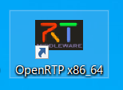</a></div>

You will first be prompted for the workspace location. Specify the workspace above and click [OK].

<div align="center"><a href="flip2.png">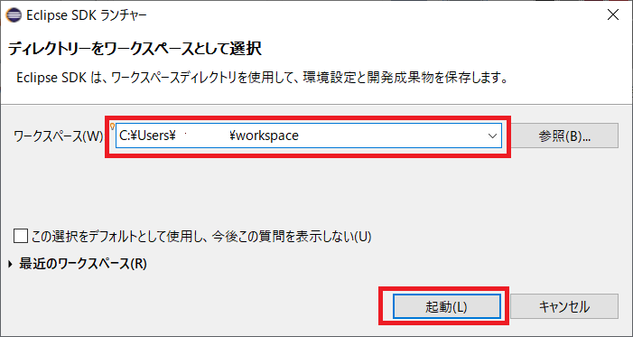</a></div>

The following Welcome page will appear.

The Welcome page is not needed, so click the [×] button in the upper-left corner to close it.

<br>

<div align="center"><a href="flip3.png">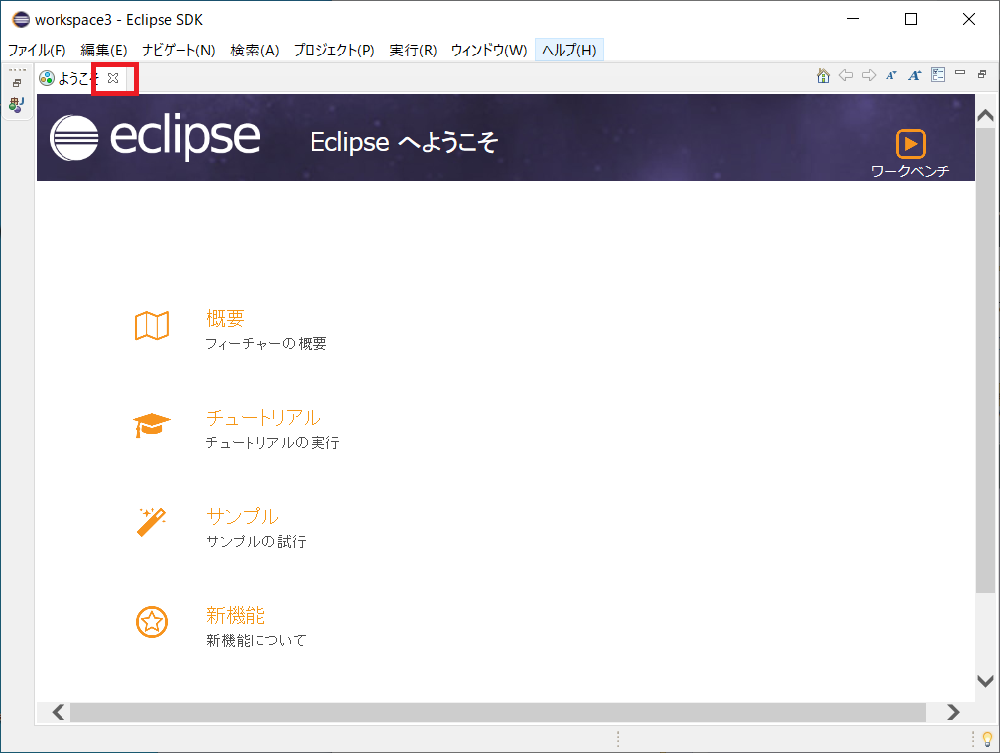</a></div>
<div align="center"><strong>Initial Eclipse Startup Screen</strong></div>

Click the [Open Perspective] button in the upper-right corner.

<div align="center"><a href="flip4.png">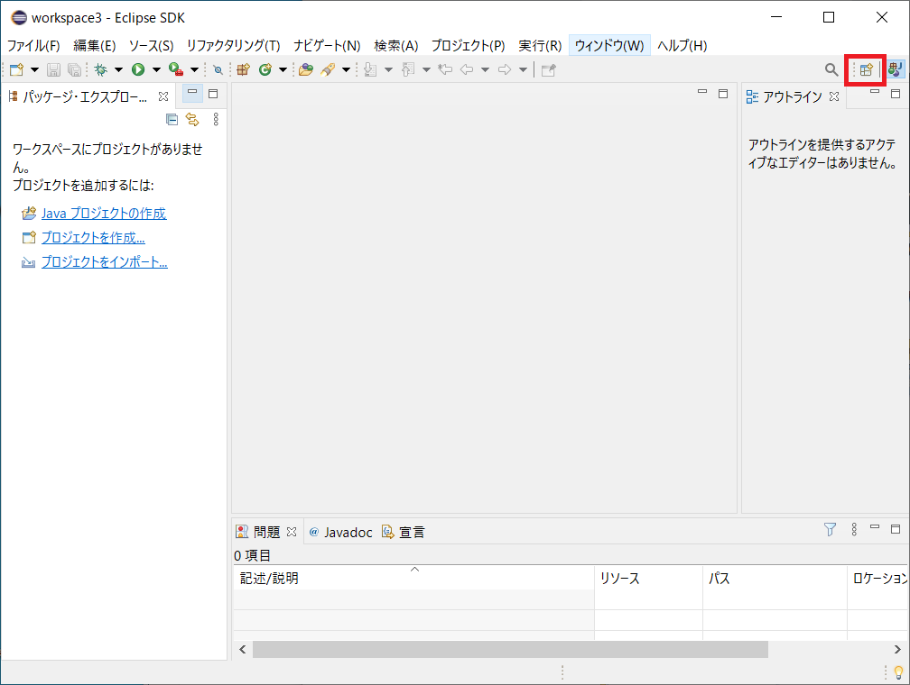</a></div>
<div align="center"><strong>Switching Perspectives</strong></div>

Select "RTC Builder" and click the [OK] button.

RTCBuilder will start.

<div align="center"><a href="flip5.png">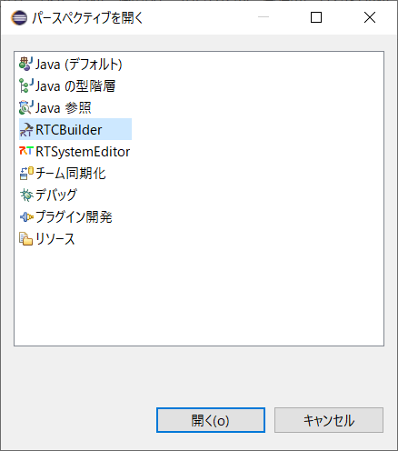</a></div>
<div align="center"><strong>Selecting a Perspective</strong></div>

#### Creating a New Project

To create the Flip component, you need to create a new project in RTCBuilder.

Click the [Open New RTCBuilder Editor] icon in the upper-left corner.

<div align="center"><a href="flip6.png">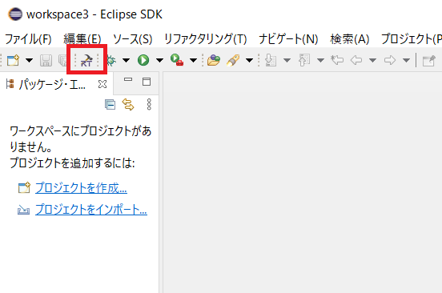</a></div>
<div align="center"><strong>Creating an RTC Builder Project</strong></div>

Enter the project name to create (here, **Flip**) in the "Project Name" field and click [Finish].

<div align="center"><a href="flip7.png">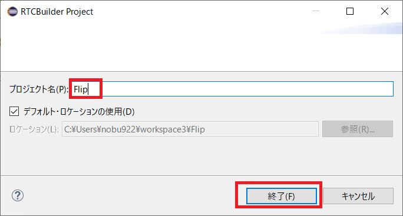</a></div>

A project with the specified name will be generated and added to the Package Explorer.

<div align="center"><a href="flip8.png">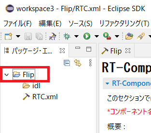</a></div>

An RTC profile XML file (RTC.xml) with default values will automatically be generated in the project.

#### Starting the RTC Profile Editor

When RTC.xml is generated, the RTCBuilder editor associated with the project should automatically open.

#### Entering Profile Information and Generating Code

First, select the leftmost "Basic" tab and enter the basic information.

In addition to the Flip component name defined earlier, enter a description, version, and other information.

Items shown in red are required fields. All others can remain at their default values.

- Module Name: Flip
- Module Description: Optional (Flip image component)
- Version: Optional (1.0.0)
- Vendor Name: Optional
- Module Category: Optional (ImageProcessing)
- Component Type: STATIC
- Activity Type: PERIODIC
- Component Kind: DataFlowComponent
- Maximum Number of Instances: 1
- Execution Type: PeriodicExecutionContext
- Execution Rate: 1000.0

<br>

<div align="center"><a href="flip9.png">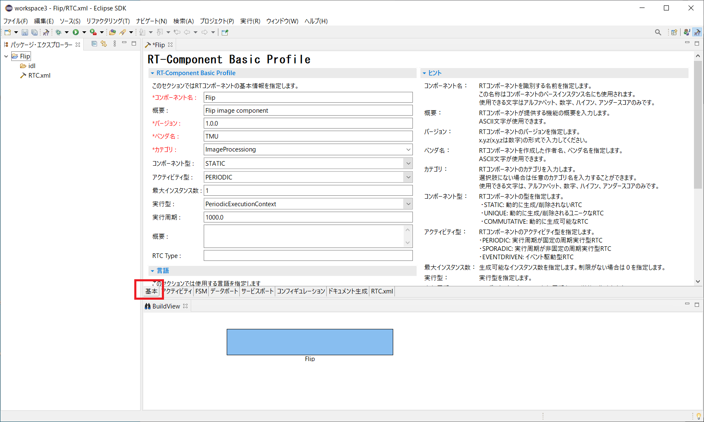</a></div>
<div align="center"><strong>Entering Basic Information</strong></div>
<br>

Next, select the "Activity" tab and specify the action callbacks to use.

The Flip component uses the onActivated(), onDeactivated(), and onExecute() callbacks.

As shown below, click on onActivated and then select [ON] using the radio button.

Perform the same operation for onDeactivated and onExecute.

<br>

<div align="center"><a href="flip10.png">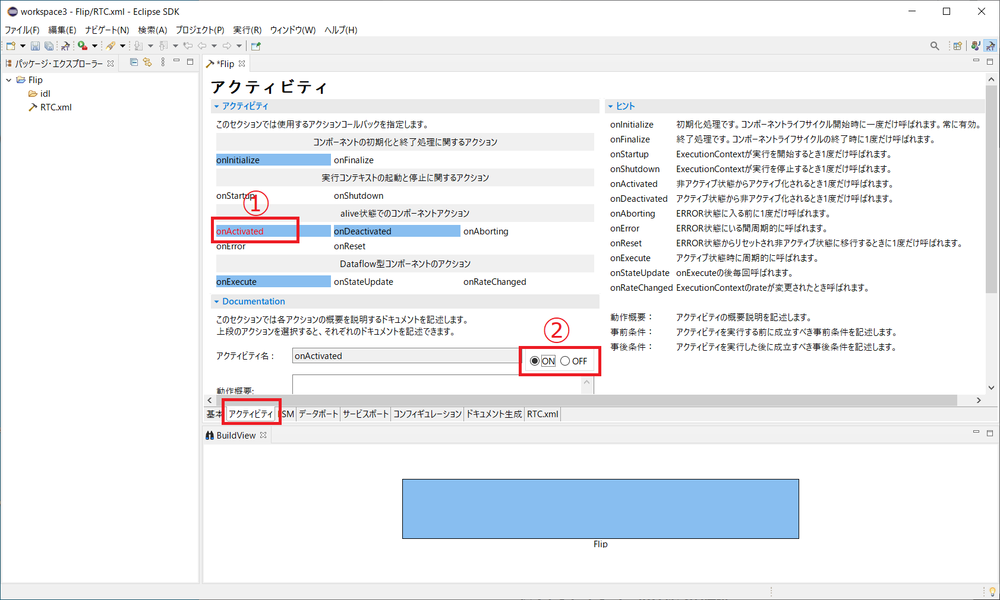</a></div>
<div align="center"><strong>Selecting Activity Callbacks</strong></div>
<br>

Next, select the "Data Port" tab and enter the data port information.

Based on the specifications defined earlier, enter the following information.

Variable names and display positions are optional and do not need to be changed.

<br>

- InPort Profile:
  - Port Name: originalImage
  - Data Type: RTC::CameraImage
  - Variable Name: originalImage
  - Display Position: left

<br>

- OutPort Profile:
  - Port Name: flippedImage
  - Data Type: RTC::CameraImage
  - Variable Name: flippedImage
  - Display Position: right

<br>

<div align="center"><a href="flip11.png">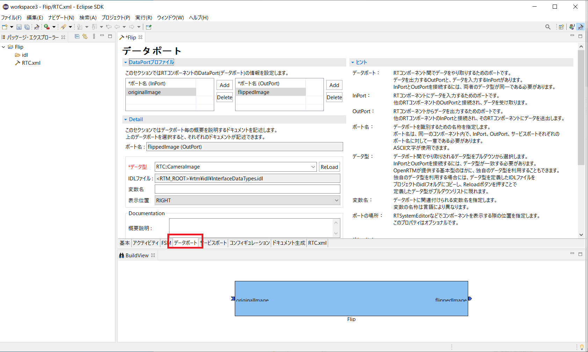</a></div>
<div align="center"><strong>Entering Data Port Information</strong></div>
<br>

Next, select the "Configuration" tab and enter the configuration information according to the specifications defined earlier.

The Constraint and Widget settings are used by RTSystemEditor to determine how configuration parameters are displayed and edited in the GUI (for example, sliders, spin buttons, or radio buttons).

In this case, flipMode can only take the values -1, 0, and 1, so we will use radio buttons.

<br>

- flipMode
  - Name: flipMode
  - Data Type: int
  - Default Value: 0
  - Constraint: (0, -1, 1)
    - <span style="color:red;">※ (-1: vertical & horizontal flip, 0: vertical flip, 1: horizontal flip)</span>
  - Widget: radio

<br>

<div align="center"><a href="flip12.png">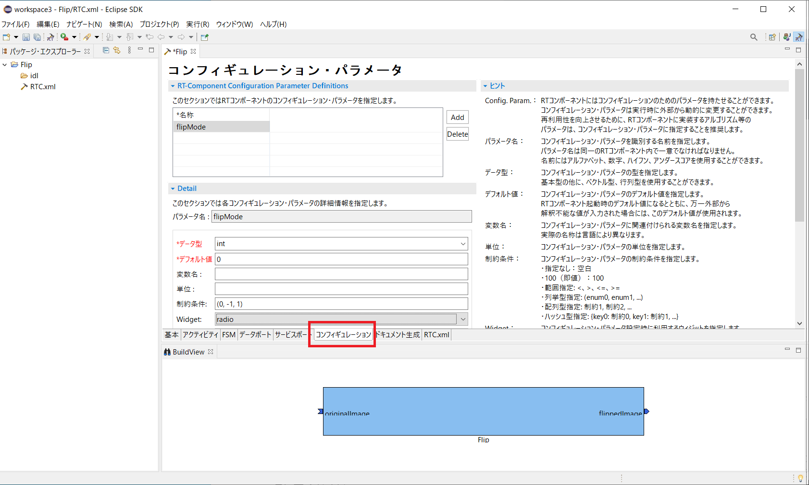</a></div>
<div align="center"><strong>Entering Configuration Information</strong></div>
<br>

Next, we will select the programming language and generate the code.

<span style="color:red;">The tool specifications differ between OpenRTM-aist 1.2 and 2.0.</span>

First, the procedure for version 1.2.2 and earlier is explained.

Select the "Language / Environment" tab and choose the programming language.

Here, select C++.

Since no default language is set, forgetting to specify the language will result in an error during code generation.

Be sure to select a language.

<div align="center"><a href="Language_0.png">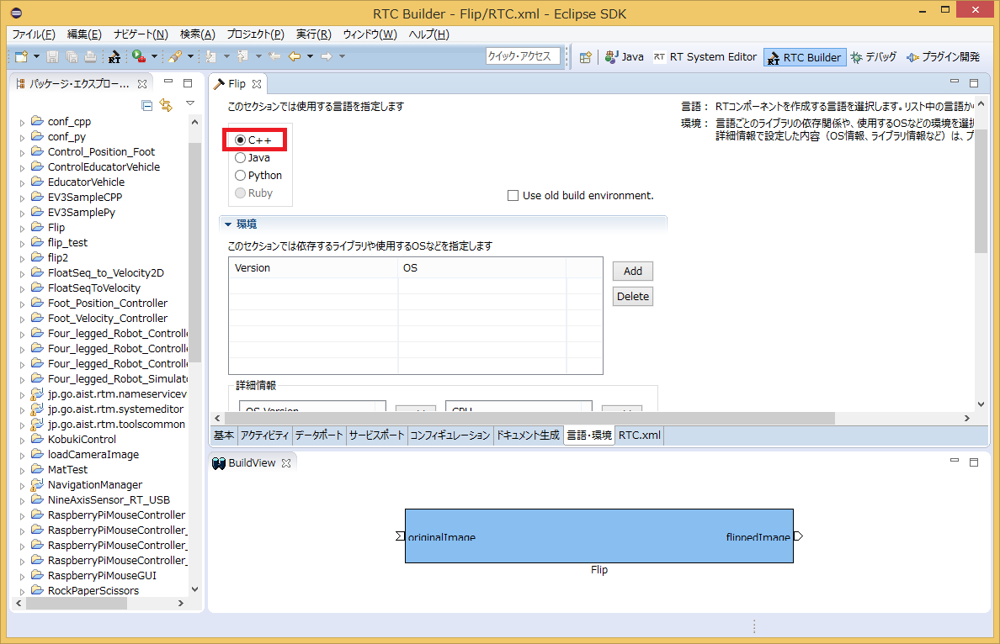</a></div>
<div align="center"><strong>Selecting the Programming Language</strong></div>
<br>

Finally, click the "Generate Code" button on the "Basic" tab to generate the component template.

<br>

<div align="center"><a href="Generate_0.png"></a></div>
<div align="center"><strong>Generating the Template (Generate)</strong></div>
<br>

Next, the procedure for version 2.0 and later is explained.

Select the "Basic" tab and scroll down to the "Language" section.

Select C++.

<div align="center"><a href="flip13.png">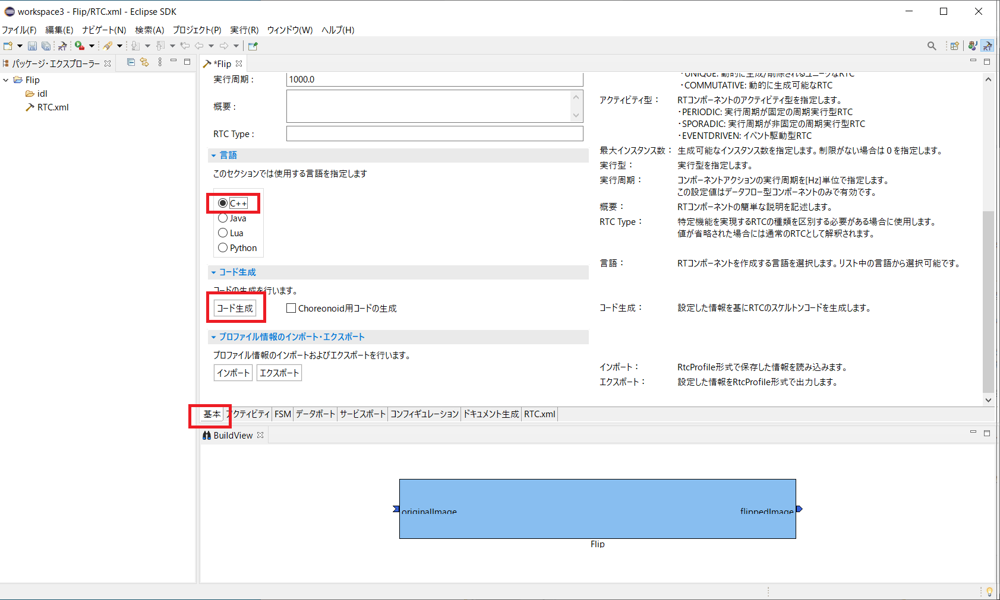</a></div>

Finally, click the **Generate Code** button to generate the component template.

After code generation is complete, right-click the Flip project and select:

"Show In" → "System Explorer"

to open the workspace folder in Windows Explorer.

Verify that the necessary files have been generated in the Flip folder.

<div align="center"><a href="flip14.png">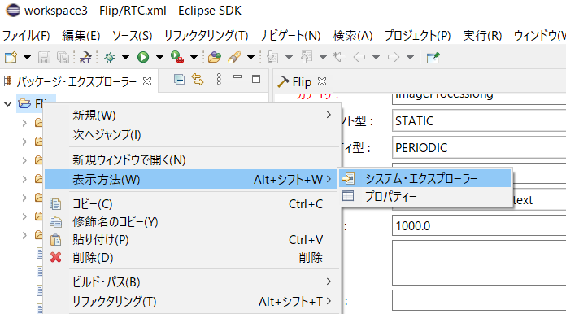</a></div>
### Generating Files Required for Building with CMake

The code generated by RTC Builder includes a `CMakeLists.txt` file for generating the various files required for building with CMake.

By using CMake, Visual Studio project files, solution files, Makefiles, and so on can be automatically generated from `CMakeLists.txt`.

#### Editing CMakeLists.txt

Open and edit `src/CMakeLists.txt` in the Flip folder using Notepad or another editor.

<div align="center"><a href="flip15.png">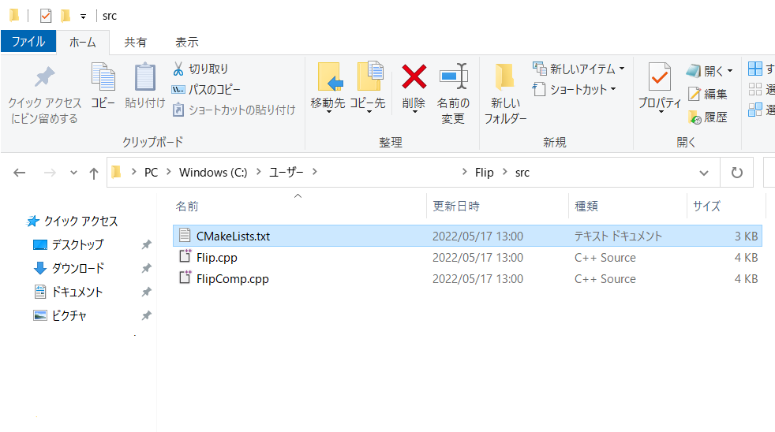</a></div>
<div align="center"><strong>Editing CMakeLists.txt</strong></div>

This component uses OpenCV, so it is necessary to configure the OpenCV header include paths, libraries, and library search paths.

OpenCV supports CMake, so OpenCV libraries can be linked and used by adding and modifying only the following two lines.

- Modify `src/CMakeLists.txt`
  - Double-click `src/CMakeLists.txt` in Explorer and open it with Notepad
1. Add `find_package(OpenCV REQUIRED)`
1. Add `${OpenCV_LIBS}` to the first `target_link_libraries`
  - There are two `target_link_libraries` entries. The upper one specifies the library for the DLL, and the lower one specifies the library for the executable file.

```cmake
 set(comp_srcs Flip.cpp )
 set(standalone_srcs FlipComp.cpp)
 
 find_package(OpenCV REQUIRED) # <- Add this line
   ：Omitted
 add_dependencies(${PROJECT_NAME} ALL_IDL_TGT)
 target_link_libraries(${PROJECT_NAME} ${OPENRTM_LIBRARIES} ${OpenCV_LIBS}) # <- Add OepnCV_LIBS
   ：Omitted
 add_executable(${PROJECT_NAME}Comp ${standalone_srcs}
   ${comp_srcs} ${comp_headers} ${ALL_IDL_SRCS})
 add_dependencies(${PROJECT_NAME}Comp ALL_IDL_TGT)
 target_link_libraries(${PROJECT_NAME}Comp ${OPENRTM_LIBRARIES} ${OpenCV_LIBS})  # <- Add OepnCV_LIBS
```

#### Operating CMake (cmake-gui)

Use CMake to configure the build environment.

First, start CMake (cmake-gui). In Windows 10, enter "CMake" in the search box at the lower-left of the screen.

<div align="center"><a href="flip16.png">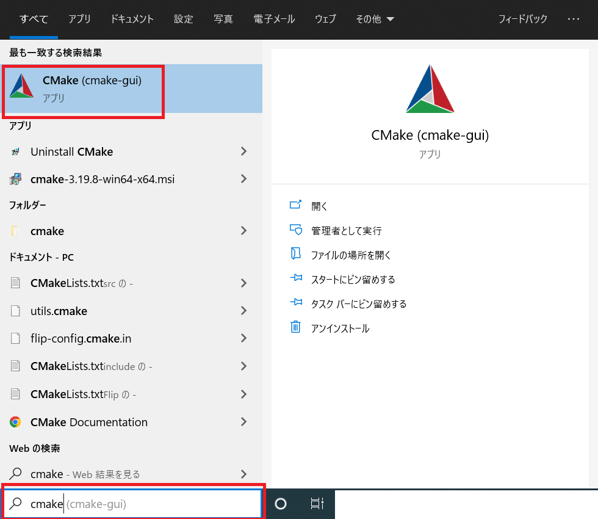</a></div>

<div align="center"><a href="flip17.png">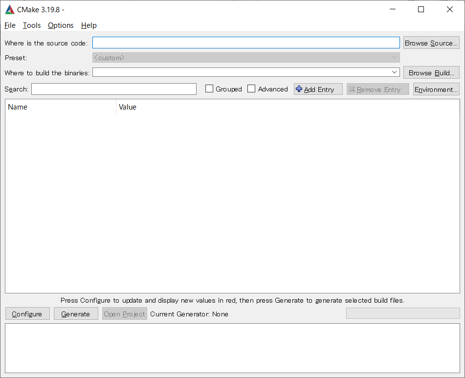</a></div>
<div align="center"><strong>Starting CMake GUI and Specifying Directories</strong></div>

There are text boxes at the top of the screen as shown below. Specify the source code location (where `CMakeLists.txt` is located) and the build directory.

- **Where is the source code**
- **Where to build the binaries**

The source code location is the directory where the Flip component source code was generated and where `CMakeLists.txt` exists. By default, this is `<workspace directory>/Flip`.

If you drag and drop `CMakeLists.txt` in the Flip folder into cmake-gui, the path to the Flip folder will be entered automatically.

<div align="center"><a href="flipzu1.png">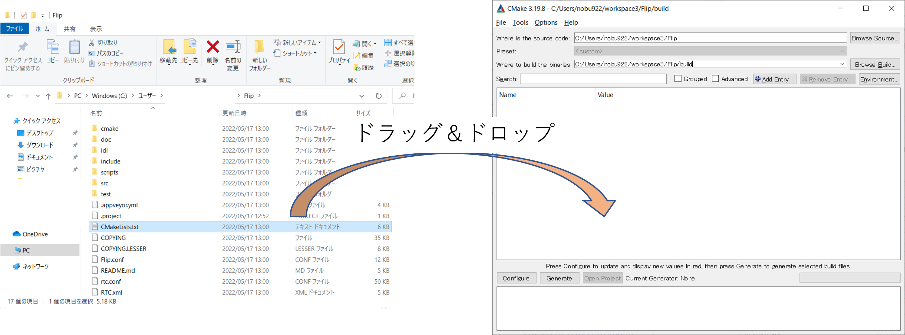</a></div>

The build directory is the location where project files, object files, and binaries required for building are stored.

The location can be arbitrary, but in this case it is recommended to specify a subdirectory of Flip with an easy-to-understand name, such as `<workspace directory>/Flip/build`.

<table class="table-alt">
  <tr>
    <th>**Where is the source code**</th>
    <th>C:\workspace\Flip</th>
  </tr>
  <tr>
    <td>**Where to build the binaries**</td>
    <td>C:\workspace\Flip\build</td>
  </tr>
</table>

After specifying the directories, click the Configure button at the bottom.

If the Create Directory screen appears, click YES.

<div align="center"><a href="flip20.png">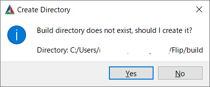</a></div>

Then a dialog like the one below will appear. Specify the type of project you want to generate.

Here, select Visual Studio 16 2019.

If you are using VS2017 or VS2022, select the corresponding version instead. If Visual Studio 2022 does not appear in the list, your cmake-gui version is old, so install the latest version.

<div align="center"><a href="flip21.png">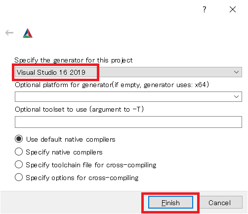</a></div>
<div align="center"><strong>Specifying the Type of Project to Generate</strong></div>

Click [Finish] in the dialog to start Configure.

If there are no problems, "Configuring done" will appear in the log window at the bottom. Then click the [Generate] button.

When "Generating done" is displayed, output of the project files, solution files, and related files is complete.

<div align="center"><a href="flip22.png">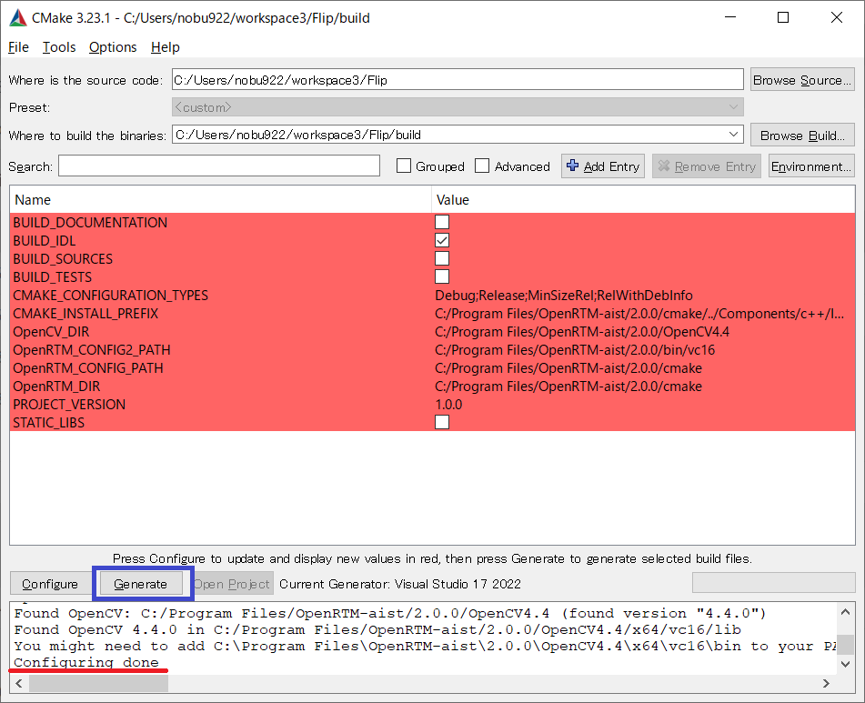</a></div>

Click the "Open Project" button to start Visual Studio 2019 and open `Flip.sln` in the build directory specified earlier.

<div align="center"><a href="flip23.png">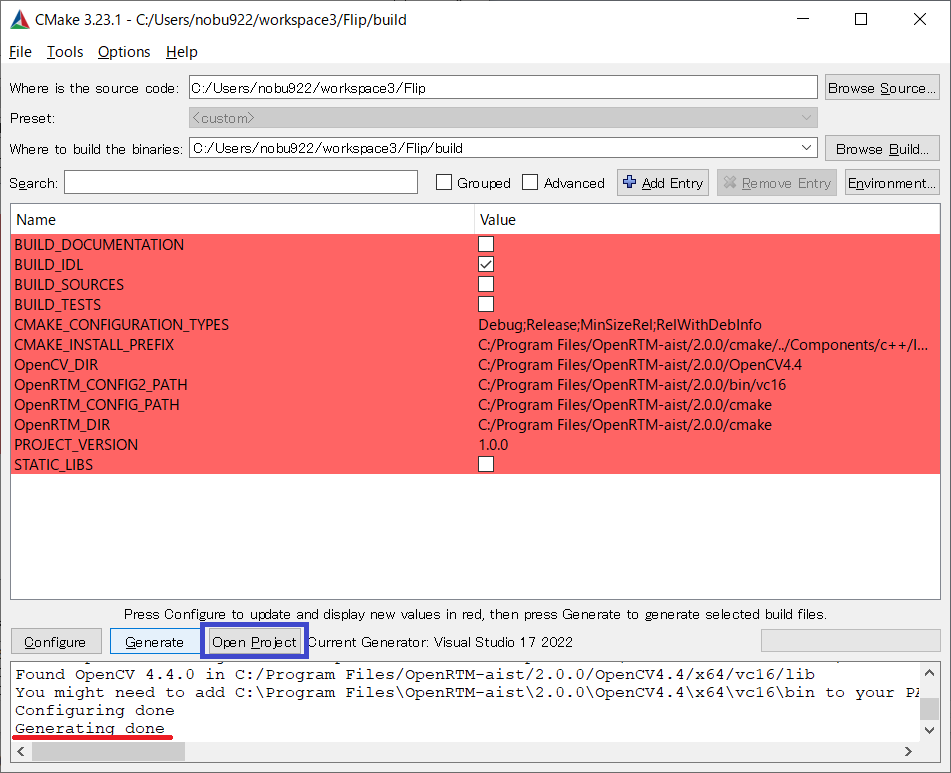</a></div>

CMake generates cache files during the Configure step. If you change settings or modify the environment due to trouble or other reasons, delete the cache from [File] > [Delete Cache] and restart from Configure.

### Editing Headers and Source Files

Edit the header file (`include/Flip/Flip.h`) and source code (`src/Flip.cpp`).

Click `Flip.h` and `Flip.cpp` from Visual Studio's Solution Explorer to open the editing screen.

<div align="center"><a href="flip25.png">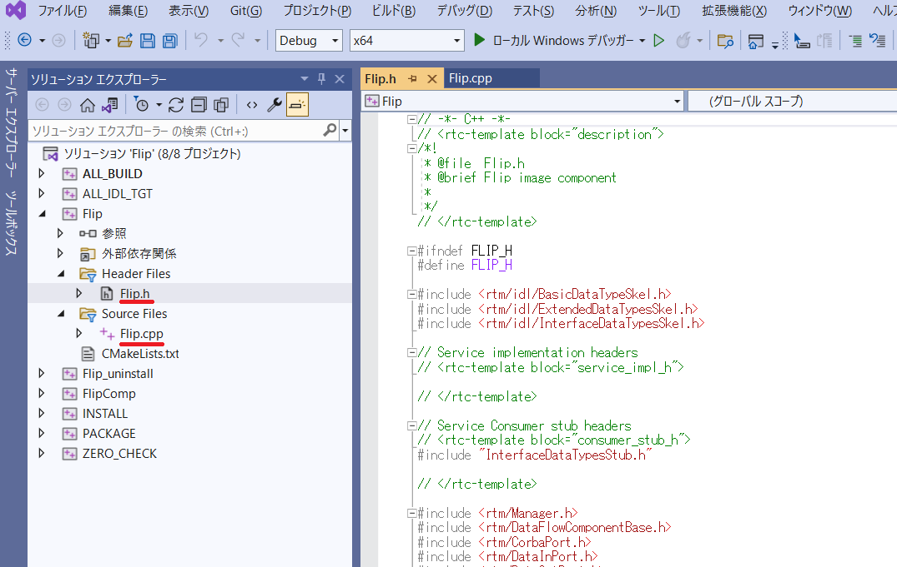</a></div>

#### Implementing Activity Processing

In the Flip component, the image received from the InPort is stored in an image buffer. The stored image is then converted using OpenCV's `cv::flip()` function.

After that, the converted image is sent from the OutPort.

<br>
The processing performed in `onActivated()`, `onExecute()`, and `onDeactivated()` is shown below.
<br>

<div align="center"><a href="FlipRTC_State_0.png"></a></div>
<div align="center"><strong>Overview of Activity Processing</strong></div>
<br>

The processing performed in `onExecute()` is shown below.

<br>

<div align="center"><a href="FlipRTC.png"></a></div>
<div align="center"><strong>Processing Performed in onExecute()</strong></div>
<br>
#### Editing the Header File (Flip.h)

Since OpenCV libraries are used, include the OpenCV header files.

```cpp
 #include <rtm/DataInPort.h>
 #include <rtm/DataOutPort.h>
 
 #include <opencv2/opencv.hpp> // Add this line
 
 
 // <rtc-template block="component_description">
```

Add member variables for storing the flipped image.

```cpp
 private:
   // <rtc-template block="private_attribute">
  
   // </rtc-template>
  
   // <rtc-template block="private_operation">
  
   // </rtc-template>
  cv::Mat m_imageBuff; // Add this line
  cv::Mat m_flipImageBuff; // Add this line
```

#### Editing the Source File (Flip.cpp)

Implement `onActivated()`, `onDeactivated()`, and `onExecute()` as shown below.

```cpp
 RTC::ReturnCode_t Flip::onActivated(RTC::UniqueId ec_id)
 {
 
 	   // Set the OutPort image size to 0
 	   m_flippedImage.width = 0;
 	   m_flippedImage.height = 0;
 
 	   return RTC::RTC_OK;
 }
```

```cpp
 RTC::ReturnCode_t Flip::onDeactivated(RTC::UniqueId ec_id)
 {
 	   if (!m_imageBuff.empty())
 	   {
 		   // Release image memory
 		   m_imageBuff.release();
 		   m_flipImageBuff.release();
 	   }
 
 	   return RTC::RTC_OK;
 }
```

```cpp
 RTC::ReturnCode_t Flip::onExecute(RTC::UniqueId ec_id)
 {
 	   // Check for new data
 	   if (m_originalImageIn.isNew()) {
 		   // Read InPort data
 		   m_originalImageIn.read();
 
 		   // Handle image size changes and allocate image memory
 		   if (m_originalImage.width != m_flippedImage.width || m_originalImage.height != m_flippedImage.height)
 		   {
 			   m_flippedImage.width = m_originalImage.width;
 			   m_flippedImage.height = m_originalImage.height;
 
 			   m_imageBuff.create(cv::Size(m_originalImage.width, m_originalImage.height), CV_8UC3);
 			   m_flipImageBuff.create(cv::Size(m_originalImage.width, m_originalImage.height), CV_8UC3);
 
 			
 		   }
 
 		   // Copy InPort image data to m_imageBuff
 		   memcpy(m_imageBuff.data, (void *)&(m_originalImage.pixels[0]), m_originalImage.pixels.length());
 
 		   // Flip the image received from InPort.
 		   // m_flipMode: 0 = around X-axis, 1 = around Y-axis, -1 = around both axes
 		   cv::flip(m_imageBuff, m_flipImageBuff, m_flipMode);
 
 		   // Get image data size
 		   int len = m_flipImageBuff.channels() * m_flipImageBuff.cols * m_flipImageBuff.rows;
 		   m_flippedImage.pixels.length(len);
 
 		   // Copy the flipped image data to OutPort
 		   memcpy((void *)&(m_flippedImage.pixels[0]), m_flipImageBuff.data, len);
 
 		   // Output the flipped image data from OutPort
 		   m_flippedImageOut.write();
 	   }
 
      return RTC::RTC_OK;
 }
```

### Building with Visual Studio

#### Running the Build

Select **Build → Build Solution** from the Visual Studio menu to build the project.

<br>

<div align="center"><a href="flip27.png">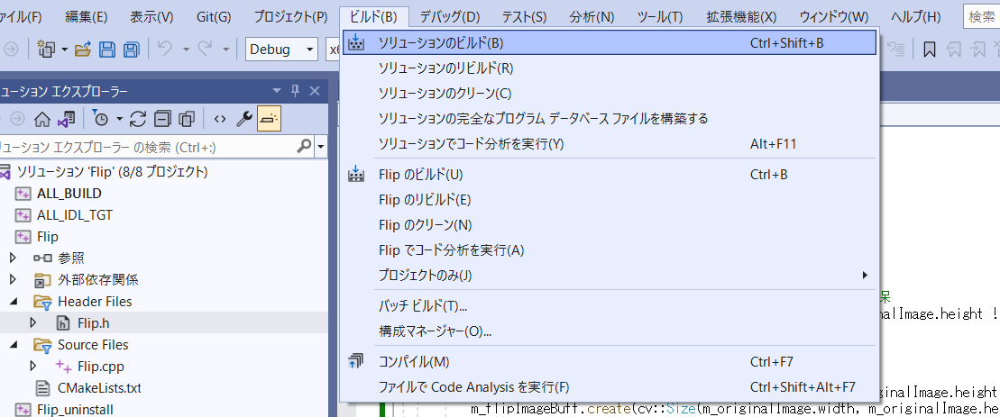</a></div>
<div align="center"><strong>Running the Build</strong></div>
<br>

### Verifying the Operation of the Flip Component

In this section, we will verify the operation by connecting the camera component (**OpenCVCameraComp**) and viewer component (**CameraViewerComp**) that have been included with OpenRTM-aist since version 1.1.

First, start RTSystemEditor.
From the OpenRTP perspective selection screen, open RTSystemEditor.

<div align="center"><a href="flip4.png"></a></div>

<div align="center"><a href="flip28.png">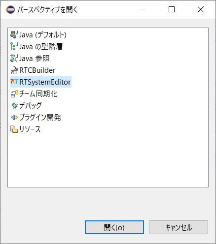</a></div>

#### Starting the Name Service

Start the Name Service used to register component references.

<br>
Click the **Start Name Service** button at the top of the Name Service View in RTSystemEditor.

<div align="center"><a href="flip29.png">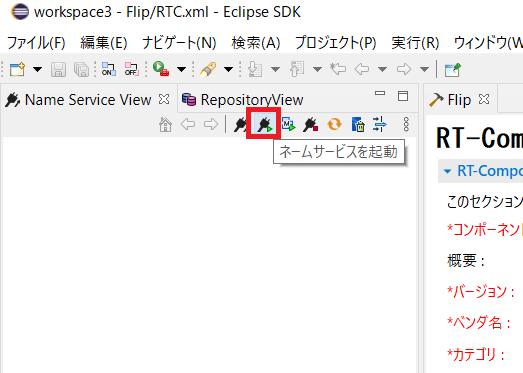</a></div>

#### Starting the Flip Component

Start the Flip component.

Run the `FlipComp.exe` file located in the `build/src/Debug` (or `build/src/Release`) folder.

<div align="center"><a href="flip30.png">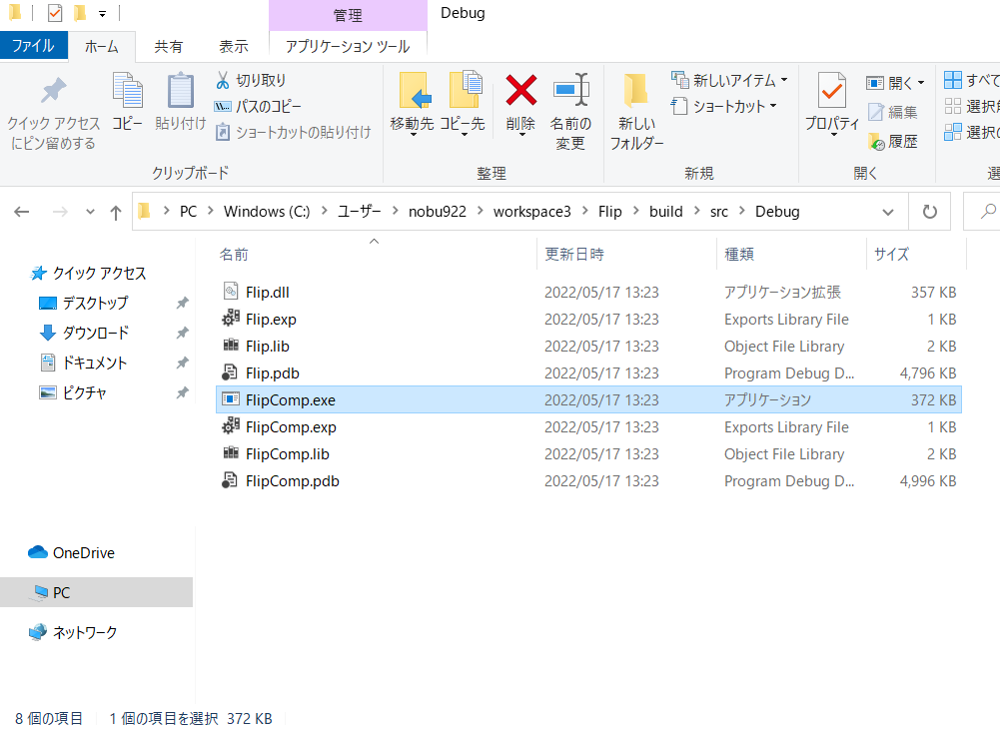</a></div>

#### Starting the Camera Component and Viewer Component

Start **OpenCVCameraComp**, which outputs images captured from a USB camera through an OutPort, and **CameraViewerComp**, which displays images received through an InPort.

These two components can be started using the following procedure.

- For Windows 10, type **C++_OpenCV-Examples** into the search box at the lower-left corner of the screen.

<div align="center"><a href="flip31.png">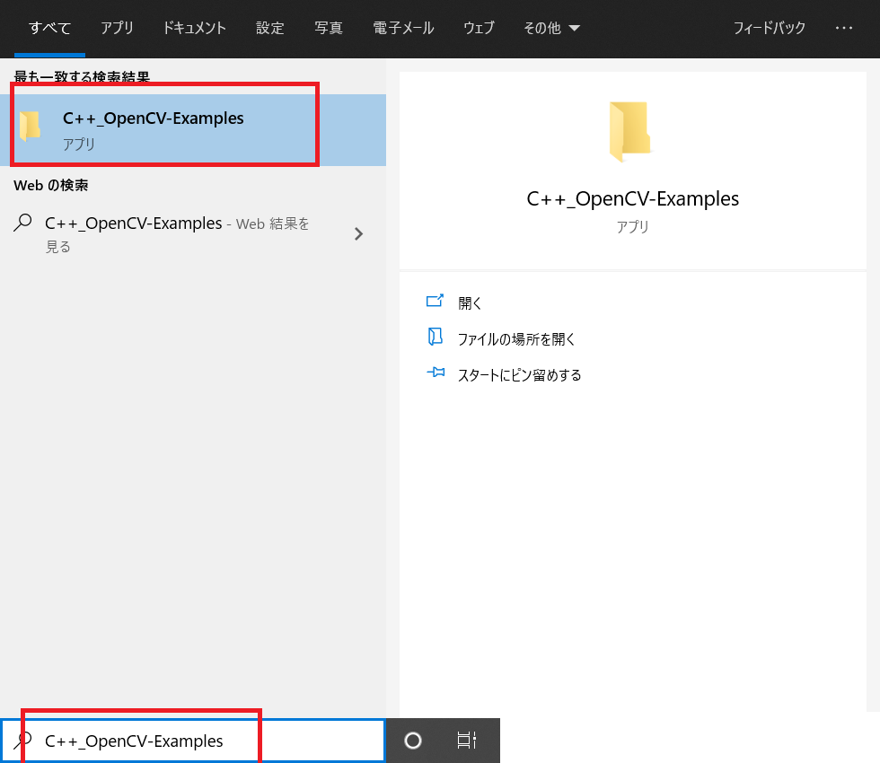</a></div>

- When Explorer opens, click and run both **OpenCVCameraComp.bat** and **CameraViewerComp.bat**.

<div align="center"><a href="flip32.png">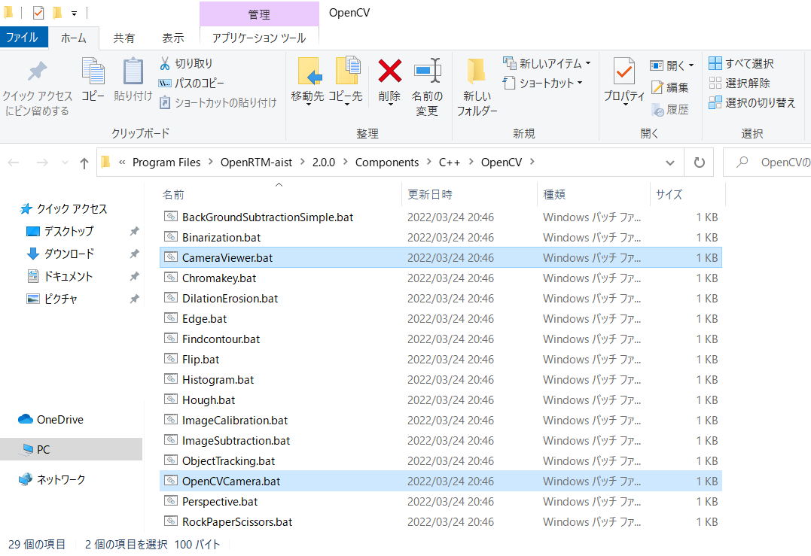</a></div>

### Connecting the Components

When the components are started, the Flip, CameraViewer, and OpenCVCamera components will appear in the Name Service View as shown below.

Click the **Open New System Editor** button (the ON button) in the upper-left corner to open the editor, then drag and drop the components into the editor.

<div align="center"><a href="flipzu2.png">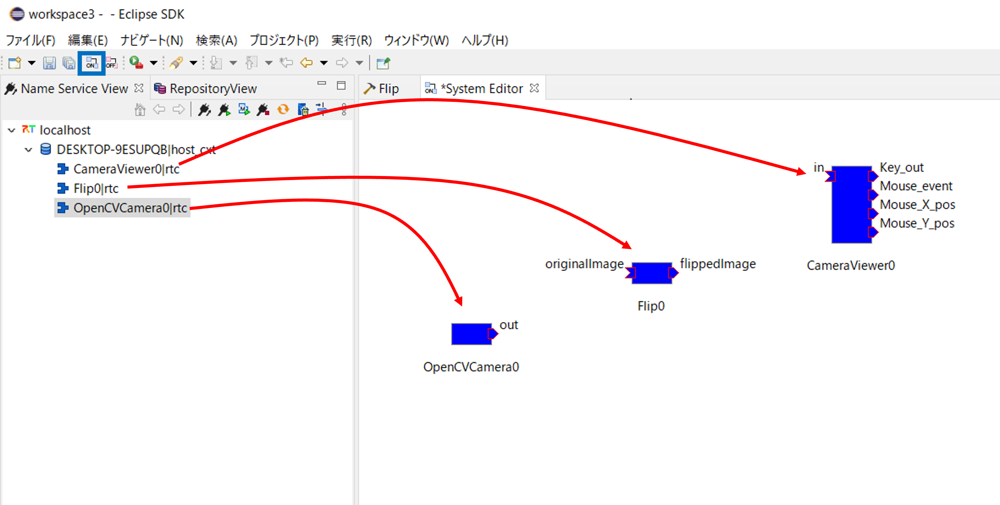</a></div>

Connect **OpenCVCameraComp**, **Flip**, and **CameraViewerComp** in RTSystemEditor as shown below.

<div align="center"><a href="flip35.png">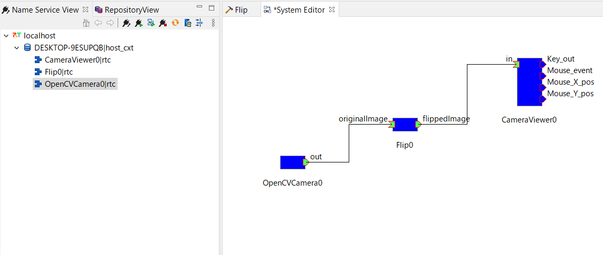</a></div>
<div align="center"><strong>Connecting Components</strong></div>

Port connections are created by dragging from one port and dropping onto the other port.

<div align="center"><a href="flip39.png">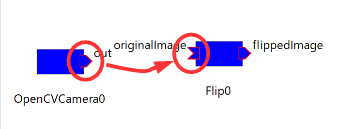</a></div>

#### Activating the Components

Click the **All Activate** icon located at the top of RTSystemEditor to activate all components.

If activation succeeds, the components will be displayed in light green as shown below.

<br>

<div align="center"><a href="flip36.png">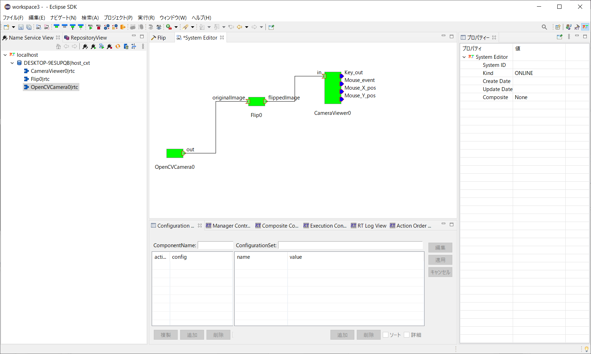</a></div>
<div align="center"><strong>Activating Components</strong></div>
<br>

#### Verifying Operation

As shown below, configuration parameters can be modified in the Configuration View.

<div align="center"><a href="flip40.png">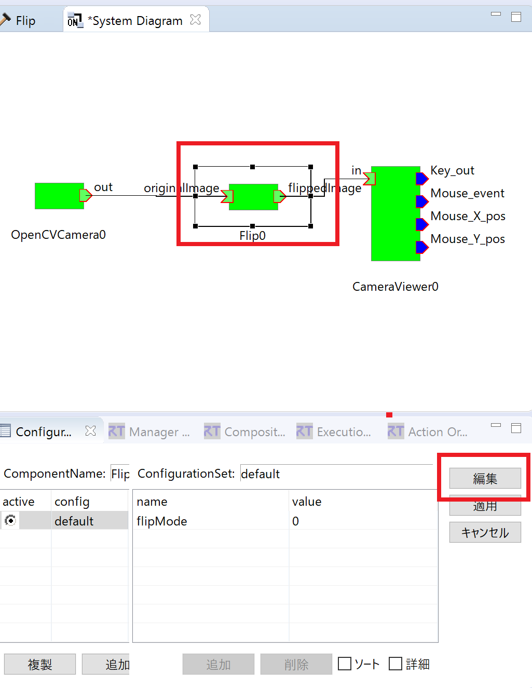</a></div>

Click the Flip component in the editor and press the Edit button.

Change the Flip component configuration parameter **flipMode** to values such as **0** or **-1**, and verify that the image is flipped correctly.

<br>

<div align="center"><a href="flip37.png">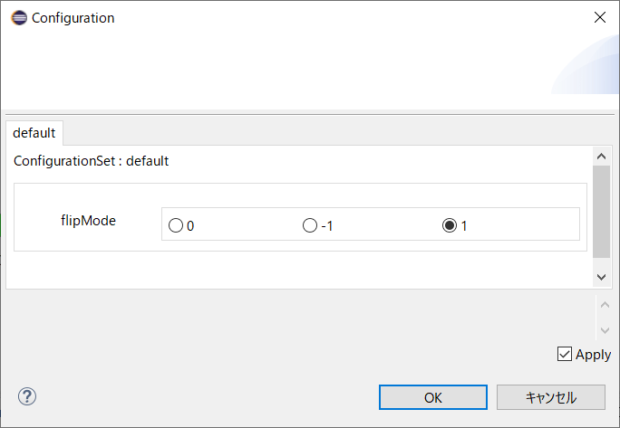</a></div>
<div align="center"><strong>Changing Configuration Parameters</strong></div>
<br>

To terminate the components, click the **All Exit** button. All components displayed in the editor will be shut down.

<div align="center"><a href="flip38.png">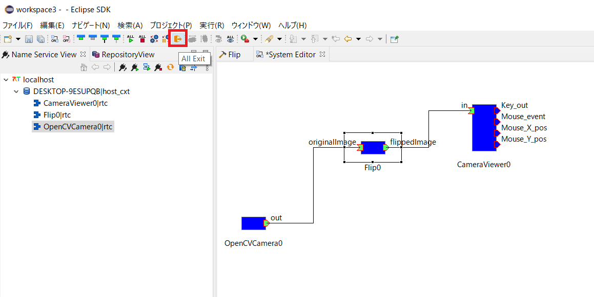</a></div>
