<!-- Title: Creating an Image Processing Component (Windows 8.1, OpenRTM-aist-1.1.2-RELEASE, OpenRTP-1.1.2, CMake-3.5.2, VS2015) -->
#contents

## Introduction

This case study introduces how to create a component for simple image processing. By utilizing an existing camera component and image viewer component, we will create a component that performs horizontal (or vertical) image flipping on images captured from a camera, and build a system that displays the flipped images.

Although image flipping can be implemented easily, in this example we will use the OpenCV library to simplify implementation and create a highly reusable RT Component.

### What is OpenCV?

[OpenCV](http://opencv.jp/) (Open Source Computer Vision Library) is an open-source computer vision library originally developed by Intel and currently maintained and released by Itseez.

Excerpted from [Wikipedia](https://en.wikipedia.org/wiki/OpenCV).

### RT Component to be Created

- **Flip Component**: An RT Component that flips images using the **cv::flip()** function provided by the OpenCV library.

## Converting the cv::flip Function into an RT Component

We will create an RT Component that receives an image, flips it horizontally or vertically, and outputs the result using the OpenCV library's **cv::flip** function. The development and execution environment assumed here is Visual Studio on Windows. The target version of OpenRTM-aist is 1.1.2.

The overall procedure is as follows:

- Confirm the runtime and development environments
- Understand OpenCV and the cv::flip function
- Define the component specification
- Generate source code templates using RTCBuilder
- Implement activity processing
- Verify component operation

### About the cv::flip Function

The **cv::flip** function flips image data of type **cv::Mat**, which is commonly used in OpenCV, around the vertical axis (horizontal flip), horizontal axis (vertical flip), or both axes. The function prototype and argument descriptions are shown below.

```cpp
void flip(const Mat& src, Mat& dst, int flipMode)


src       Input array
dst       Output array. If dst = NULL, src is overwritten.
flipMode  Specifies the flipping method:
  flipMode = 0: Flip around the X-axis (vertical flip)
  flipMode > 0: Flip around the Y-axis (horizontal flip)
  flipMode < 0: Flip around both axes (vertical and horizontal flip)
```

### Component Specification &aname(flip_info);

The component we are about to create will be called the **Flip Component**.

This component has an image data input port (**InPort**) and an output port (**OutPort**) that outputs the flipped image. The port names are:

- Input Port (InPort): **originalImage**
- Output Port (OutPort): **flippedImage**

OpenRTM-aist includes sample vision-related components that use OpenCV. These components use the following **CameraImage** type for image input and output.

```cpp
struct CameraImage
{
       /// Time stamp.
       Time tm;
       /// Image pixel width.
       unsigned short width;
       /// Image pixel height.
       unsigned short height;
       /// Bits per pixel.
       unsigned short bpp;
       /// Image format (e.g. bitmap, jpeg, etc.).
       string format;
       /// Scale factor for images, such as disparity maps,
       /// where the integer pixel value should be divided
       /// by this factor to get the real pixel value.
       double fDiv;
       /// Raw pixel data.
       sequence<octet> pixels;
};
```

To enable data exchange with these sample components, the Flip component will also use the **CameraImage** type for both its InPort and OutPort.

The **CameraImage** type is defined in **InterfaceDataTypes.idl**. In C++, it becomes available by including **InterfaceDataTypesSkel.h**.

In addition, there are three possible image flipping directions:

- Vertical flip
- Horizontal flip
- Vertical and horizontal flip

To allow this to be specified at runtime, we will use the RT Component configuration feature. The parameter name will be **flipMode**.

Following the specification of the **cv::flip** function, **flipMode** will be of type **int**, with the following values assigned:

- Vertical flip: 0
- Horizontal flip: 1
- Vertical and horizontal flip: -1

The image processing behavior for each value of **flipMode** is illustrated below.

<div align="center"><a href="cvFlip_and_FlipRTC.png"></a></div>
<div align="center"><strong>Image Flip Patterns Specified by flipMode in the Flip Component</strong></div>

The specifications of the Flip component are summarized below.

<table class="table-alt">
  <tr>
    <th>Component Name</th>
    <th>Flip</th>
  </tr>
  <tr>
    <td colspan="2" style="text-align: center;">InPort</td>
  </tr>
  <tr>
    <td>Port Name</td>
    <td>originalImage</td>
  </tr>
  <tr>
    <td>Type</td>
    <td>CameraImage</td>
  </tr>
  <tr>
    <td>Description</td>
    <td>Input image</td>
  </tr>
  <tr>
    <td colspan="2" style="text-align: center;">OutPort</td>
  </tr>
  <tr>
    <td>Port Name</td>
    <td>flippedImage</td>
  </tr>
  <tr>
    <td>Type</td>
    <td>CameraImage</td>
  </tr>
  <tr>
    <td>Description</td>
    <td>Flipped image</td>
  </tr>
  <tr>
    <td colspan="2" style="text-align: center;">Configuration</td>
  </tr>
  <tr>
    <td>Parameter Name</td>
    <td>flipMode</td>
  </tr>
  <tr>
    <td>Type</td>
    <td>int</td>
  </tr>
  <tr>
    <td>Default Value</td>
    <td>0</td>
  </tr>
  <tr>
    <td>Constraint</td>
    <td>(0,-1,1)</td>
  </tr>
  <tr>
    <td>Widget</td>
    <td>radio</td>
  </tr>
  <tr>
    <td>Description</td>
    <td><strong>Flip Mode</strong> <br> Vertical Flip: 0 <br> Horizontal Flip: 1 <br> Vertical and Horizontal Flip: -1</td>
  </tr>
</table>
### Runtime and Development Environment

Here, we will confirm the runtime and development environment.

- OS: Windows 8.1 (Windows 10 and 7 are also supported)
- Compiler: [Visual Studio 2015 Express](https://www.visualstudio.com/ja/post-download-vs/?sku=xdesk&clcid=0x409&telem=ga)


- [OpenRTM-aist-1.1.2-Release]({{ site.baseurl }}/ja/download/openrtm-aist-cpp/openrtm-aist-cpp_1_1_2_release)

- [Doxygen](http://ftp.stack.nl/pub/users/dimitri/doxygen-1.8.11-setup.exe) Required for document generation
- [CMake](https://cmake.org/files/v3.5/cmake-3.5.2-win32-x86.msi)

- [Extraction tool (Lhaplus)](https://forest.watch.impress.co.jp/library/software/lhaplus/)

Since OpenRTM-aist 1.1, CMake is used to build components.
In addition, RTCBuilder, the RTC template generation tool, can automatically generate component manuals by entering documentation and processing it with Doxygen. Since Doxygen is required when running Configure with CMake, it must be installed in advance.

### Generating the Flip Component Template

The Flip component template is generated using RTCBuilder.

#### Starting RTCBuilder

In Eclipse, the folder used for various tasks is called a "workspace" (Work Space), and in principle all generated files are stored under this folder.

The workspace can be created anywhere as long as it is accessible, but this tutorial assumes the following workspace:

- C:\workspace

First, start Eclipse.
In Windows 8.1, click "Start" → "Apps View (down arrow in the lower-right corner)" → "OpenRTM-aist 1.1.2" → "OpenRTP" to start it.

You will first be asked for the workspace location, so specify the workspace above and click [OK].

<div align="center"><a href="install40.png"></a></div>

Then the following "Welcome" screen will appear.<br>
The "Welcome" screen is not needed, so click the [×] button in the upper-left corner to close it.
<br>

<div align="center"><a href="install41.png">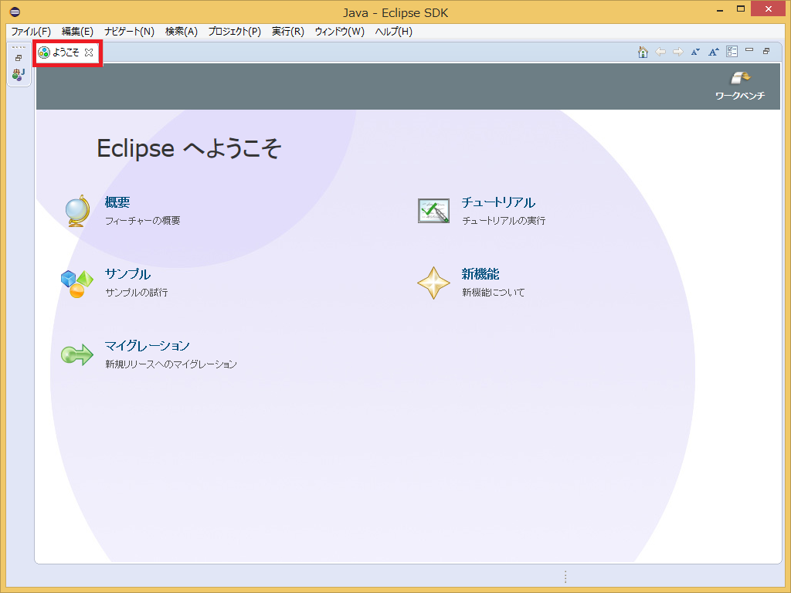</a></div>
<div align="center"><strong>Initial Eclipse Startup Screen</strong></div>

Click the [Open Perspective] button in the upper-right corner.

<div align="center"><a href="install42.png">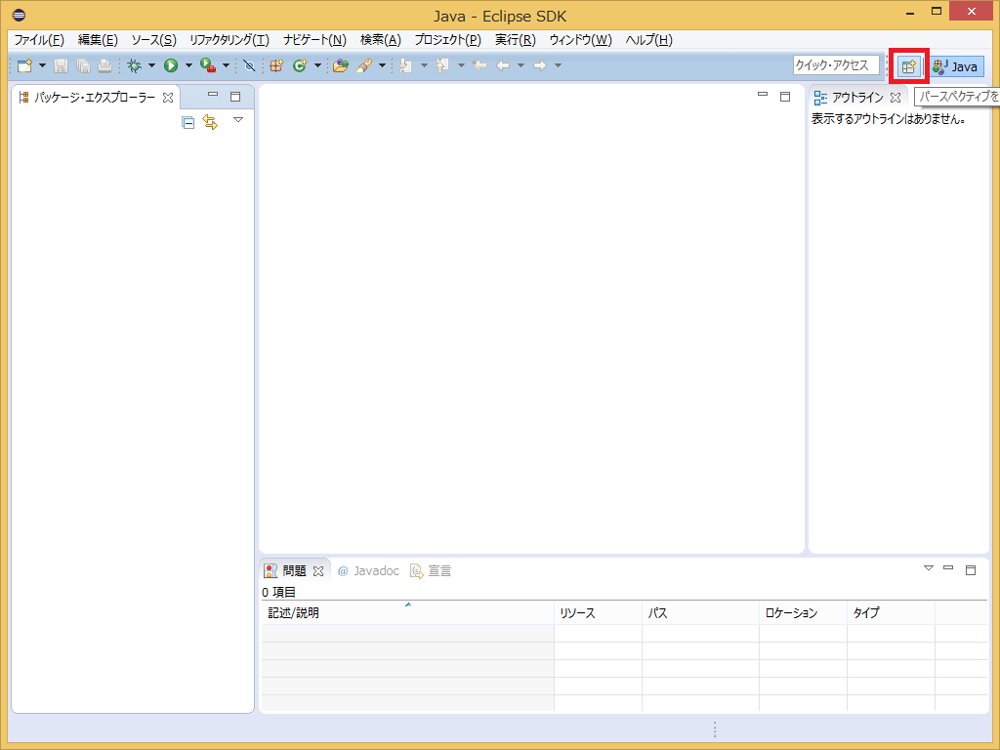</a></div>
<div align="center"><strong>Switching Perspectives</strong></div>

Select "RTC Builder" and click the [OK] button.<br>
RTCBuilder will start.

<div align="center"><a href="SelectRTCBuilder.png"></a></div>
<div align="center"><strong>Selecting a Perspective</strong></div>

#### Creating a New Project

To create the Flip component, you need to create a new project in RTCBuilder.

Click the [Open New RTCBuilder Editor] icon in the upper-left corner.

<div align="center"><a href="CreateProject_0.png"></a></div>
<div align="center"><strong>Creating a Project for RTC Builder</strong></div>

Enter the project name to create (here, **Flip**) in the "Project Name" field and click [Finish].

<div align="center"><a href="RT-Component-BuilderProject_0.png"></a></div>

A project with the specified name is generated and added to the Package Explorer.

<div align="center"><a href="PackageExplolrer_0.png">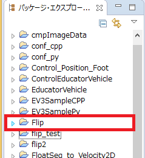</a></div>

An RTC profile XML (RTC.xml) with default values is automatically generated in the created project.

#### Starting the RTC Profile Editor

When RTC.xml is generated, the RTCBuilder editor should open as the workspace associated with this project.
If it does not open, double-click RTC.xml in the Package Explorer.

<div align="center"><a href="Open_RTCBuilder_0.png"></a></div>
#### Entering Profile Information and Generating Code

First, select the leftmost "Basic" tab and enter the basic information. In addition to the Flip component specification (name) defined earlier, enter the description, version, and other information. Items with red labels are required. The other items may be left at their default values.

- Module Name: Flip
- Module Description: Optional (Flip image component)
- Version: Optional (1.0.0)
- Vendor Name: Optional
- Module Category: Optional (ImageProcessing)
- Component Type: STATIC
- Activity Type: PERIODIC
- Component Kind: DataFlowComponent
- Maximum Number of Instances: 1
- Execution Type: PeriodicExecutionContext
- Execution Period: 1000.0

<br>

<div align="center"><a href="Basic_0.png">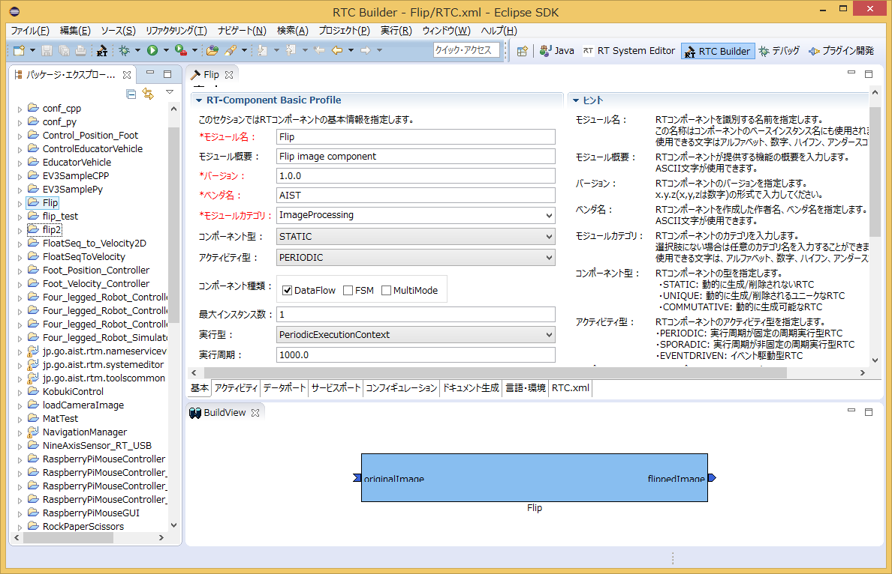</a></div>
<div align="center"><strong>Entering Basic Information</strong></div>
<br>


Next, select the "Activity" tab and specify the action callbacks to use.

The Flip component uses the onActivated(), onDeactivated(), and onExecute() callbacks. As shown below, after clicking ① onActivated, check [ON] using the radio button ②. Perform the same operation for onDeactivated and onExecute.

<br>

<div align="center"><a href="Activity_0.png">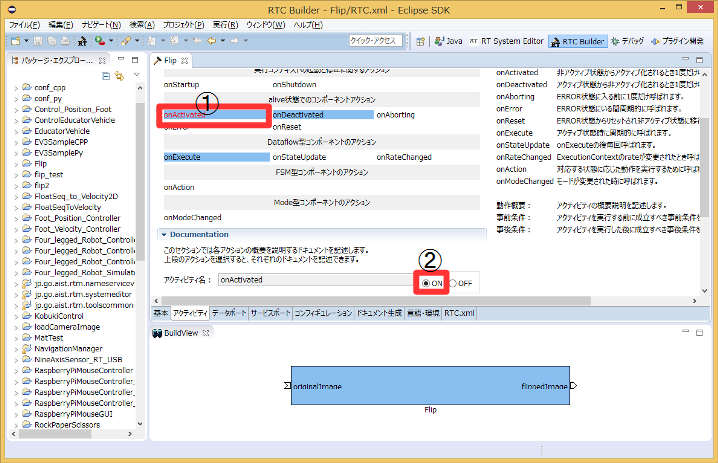</a></div>
<div align="center"><strong>Selecting Activity Callbacks</strong></div>
<br>


Next, select the "Data Port" tab and enter the data port information.
Based on the specification defined earlier, enter the following. Variable names and display positions are optional, so they do not need to be changed.

<br>

- InPort Profile:
  - Port Name: originalImage
  - Data Type: CameraImage
  - Variable Name: originalImage
  - Display Position: left

<br>

- OutPort Profile:
  - Port Name: flippedImage
  - Data Type: CameraImage
  - Variable Name: flippedImage
  - Display Position: right

<br>

<div align="center"><a href="DataPort_0.png">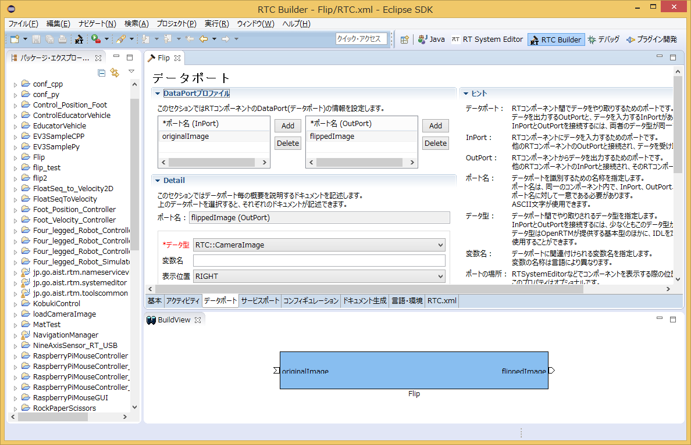</a></div>
<div align="center"><strong>Entering Data Port Information</strong></div>
<br>

Next, select the "Configuration" tab and enter the Configuration information based on the specification defined earlier. The Constraint and Widget settings are used when RTSystemEditor displays component configuration parameters, allowing values to be changed through GUI elements such as sliders, spin buttons, and radio buttons.

Here, since flipMode was defined earlier to take only three values: -1, 0, and 1, we will use radio buttons.

<br>

- flipMode
  - Name: flipMode
  - Data Type: int
  - Default Value: 0
  - Variable Name: flipMode
  - Constraint: (0, -1, 1) <span style="color:red;">※ (-1: vertical and horizontal flip, 0: vertical flip, 1: horizontal flip)</span>;
  - Widget: radio

<br>

<div align="center"><a href="Configuration_0.png">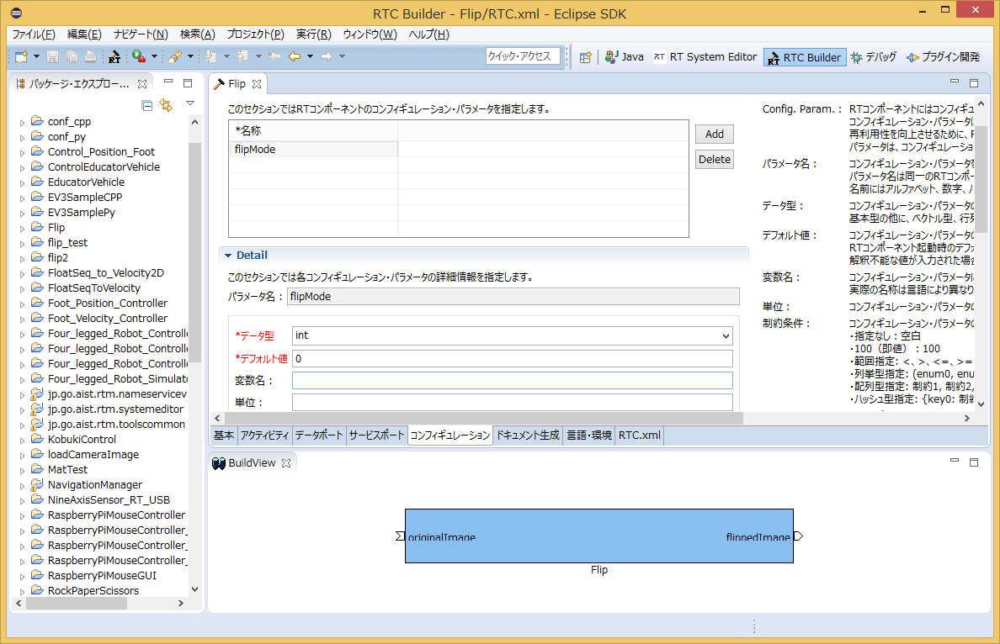</a></div>
<div align="center"><strong>Entering Configuration Information</strong></div>
<br>
Next, select the "Language / Environment" tab and choose the programming language. Here, select C++ (language). Note that no default settings are configured for Language / Environment. If you forget to specify the language, an error will occur during code generation, so be sure to specify the language.

Also, for C++, the default setting is to use CMake for building. However, if you want RTCBuilder to directly generate old-style VC project files or solution files, check [Use old build environment].

<div align="center"><a href="Language_0.png"></a></div>
<div align="center"><strong>Selecting the Programming Language</strong></div>
<br>

Finally, click the "Generate Code" button on the "Basic" tab to generate the component template.

<br>

<div align="center"><a href="Generate_0.png">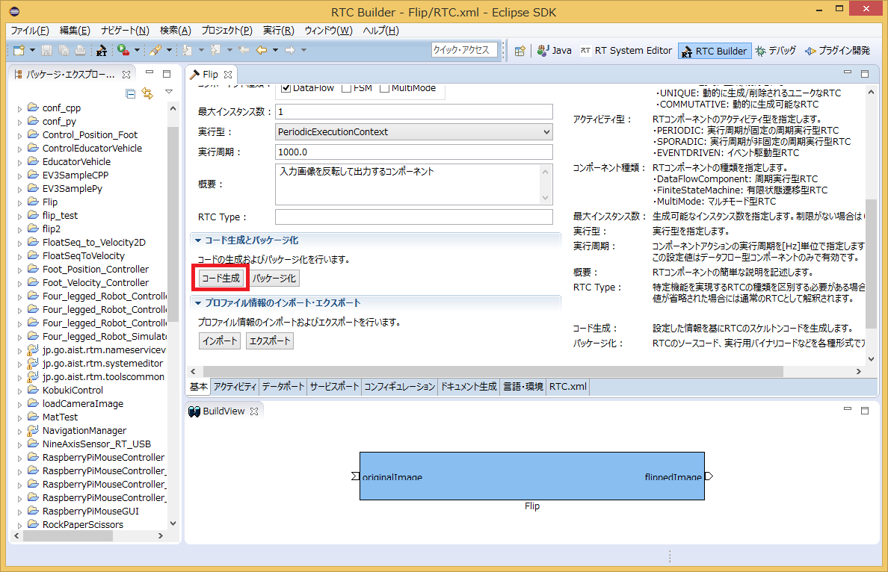</a></div>
<div align="center"><strong>Generating the Template (Generate)</strong></div>
<br>

<span style="color:red;">※ The generated code files are created in the workspace folder specified when Eclipse was launched. The current workspace can be checked from [File] > [Switch Workspace].</span>;


### Generating Files Required for Building with CMake

The code generated by RTC Builder includes a CMakeLists.txt file for generating the various files required for building with CMake.
By using CMake, Visual Studio project files, solution files, Makefiles, and so on can be automatically generated from CMakeLists.txt.

#### Editing CMakeLists.txt

Open src/CMakeLists.txt in Notepad or another editor and edit it.
Alternatively, you can also edit it by double-clicking src/CMakeLists.txt in the Package Explorer on the left side of the Eclipse screen, or by dragging and dropping it into the editor.

<div align="center"><a href="EditCmakeLists_0.png">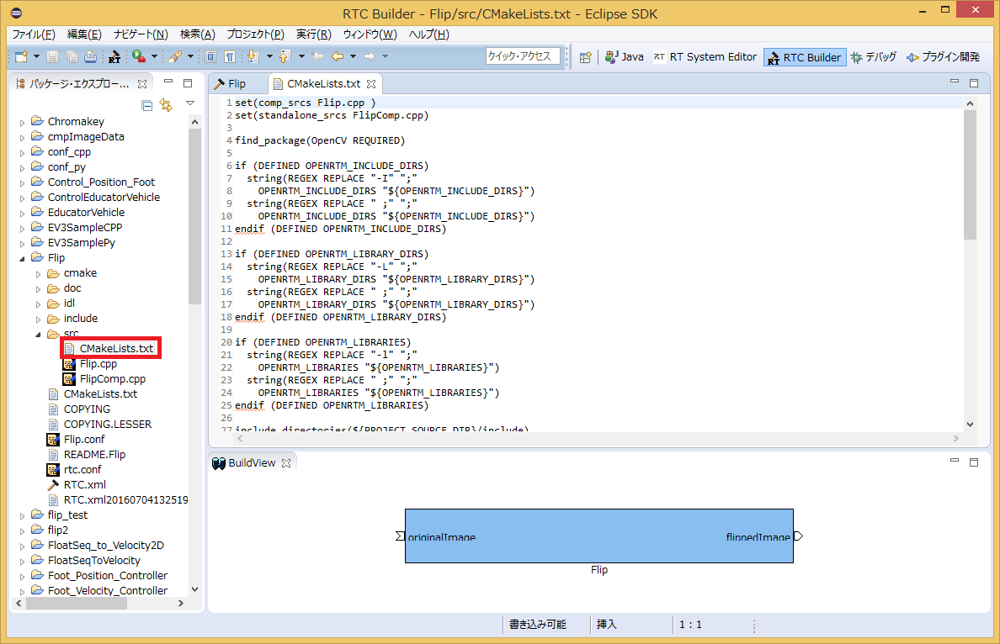</a></div>
<div align="center"><strong>Editing CMakeLists.txt</strong></div>

Since this component uses OpenCV, it is necessary to provide the OpenCV header include path, libraries, and library search paths. Fortunately, OpenCV supports CMake, so the OpenCV libraries can be linked and used by simply adding and modifying the following two lines.

- Modify src/CMakeLists.txt
  - Double-click src/CMakeLists.txt in Eclipse's Package Explorer
1. Add find_package(OpenCV REQUIRED)
1. Add ${OpenCV_LIBS} to the first target_link_libraries
  - There are two target_link_libraries entries. The upper one specifies libraries for the DLL, and the lower one specifies libraries for the executable file.

```cmake
 set(comp_srcs Flip.cpp )
 set(standalone_srcs FlipComp.cpp)
 
 find_package(OpenCV REQUIRED) ← Add this line
   ：Omitted
 add_dependencies(${PROJECT_NAME} ALL_IDL_TGT)
 target_link_libraries(${PROJECT_NAME} ${OPENRTM_LIBRARIES} ${OpenCV_LIBS}) ← Add OepnCV_LIBS
   ：Omitted
 add_executable(${PROJECT_NAME}Comp ${standalone_srcs}
   ${comp_srcs} ${comp_headers} ${ALL_IDL_SRCS})
 target_link_libraries(${PROJECT_NAME}Comp ${OPENRTM_LIBRARIES} ${OpenCV_LIBS}) ← Add OepnCV_LIBS
```
#### Operating CMake (cmake-gui)

Use CMake to configure the build environment.
First, start CMake (cmake-gui). You can start it by clicking **"Start" → "Apps View (down arrow in the lower-right corner)" → "CMake 3.2.1" → "CMake (cmake-gui)"**.

<div align="center"><a href="CMakeGUI0_0.png">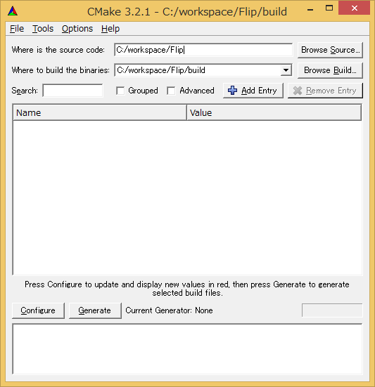</a></div>
<div align="center"><strong>Starting CMake GUI and Specifying Directories</strong></div>

There are text boxes at the top of the screen as shown below. Specify the source code location (where CMakeLists.txt is located) and the build directory.

- **Where is the soruce code**
- **Where to build the binaries**

The source code location is the directory where the Flip component source code was generated and where CMakeLists.txt exists. By default, this is `<workspace directory>/Flip`.

The build directory is the location where project files, object files, and binaries for building are stored. The location can be arbitrary, but in this case it is recommended to specify a subdirectory of Flip with an easy-to-understand name, such as `<workspace directory>/Flip/build`.

<table class="table-alt">
  <tr>
    <td>Where is the soruce code</td>
    <td>C:\workspace\Flip</td>
  </tr>
  <tr>
    <td>Where to build the binaries</td>
    <td>C:\workspace\Flip\build</td>
  </tr>
</table>

After specifying the settings, click the **Configure** button below. A dialog like the one shown below will appear, allowing you to select the type of project to generate.

In this example, select **Visual Studio 12 2013**. If you are using VS10 or VS11, select the corresponding version instead. Depending on your environment, you may also be able to choose between 32-bit and 64-bit project types. Be sure to select the one that matches your installed version of OpenRTM-aist.

<div align="center"><a href="CMakeGUI1_0.png"></a></div>
<div align="center"><strong>Selecting the Project Type to Generate</strong></div>

Click **[Finish]** in the dialog to start the Configure process. If there are no problems, **"Configuring done"** will appear in the log window at the bottom. Then click the **[Generate]** button. When **"Generating done"** is displayed, the project files, solution files, and other output files have been successfully generated.

Note that CMake generates cache files during the Configure stage. If you change settings or your environment due to troubleshooting, delete the cache using **[File] > [Delete Cache]** and rerun Configure from the beginning.


### Editing Header and Source Files

Next, double-click **Flip.sln** in the build directory specified earlier to start Visual Studio 2013.

Edit the header file (**include/Flip/Flip.h**) and source file (**src/Flip.cpp**).
You can open them for editing by clicking **Flip.h** and **Flip.cpp** in Visual Studio's Solution Explorer.

<div align="center"><a href="VisualStudio0_0.png"></a></div>


#### Implementing Activity Processing

The Flip component stores images received from the InPort into an image buffer, processes the stored image using OpenCV's **cv::flip()** function, and then sends the processed image through the OutPort.

<br>
The processing performed in **onActivated()**, **onExecute()**, and **onDeactivated()** is shown below.
<br>

<div align="center"><a href="FlipRTC_State_0.png">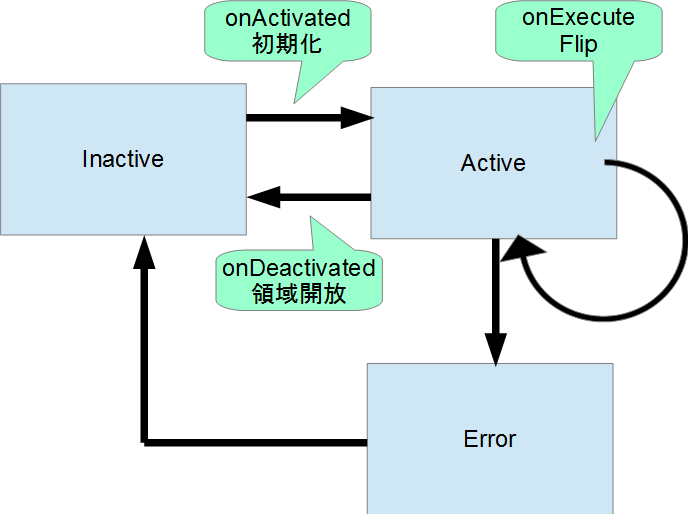</a></div>
<div align="center"><strong>Overview of Activity Processing</strong></div>
<br>

The processing performed in **onExecute()** is shown below.

<br>

<div align="center"><a href="FlipRTC.png">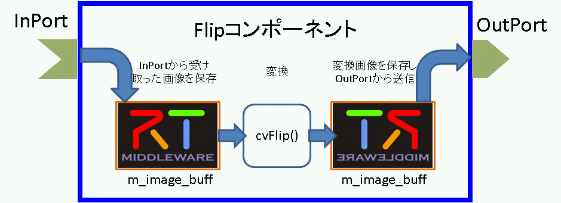</a></div>
<div align="center"><strong>Processing Performed in onExecute()</strong></div>
<br>

#### Editing the Header File (Flip.h)

To use the OpenCV library, include the OpenCV header file.

```cpp
 // Include OpenCV header file
 #include <opencv2/opencv.hpp>
```

Add member variables for storing the flipped image.

```cpp
 private:
     // <rtc-template block="private_attribute">
  
     // </rtc-template>
 
     // <rtc-template block="private_operation">
  
     // </rtc-template>
         cv::Mat m_imageBuff;
         cv::Mat m_flipImageBuff;
```

#### Editing the Source File (Flip.cpp)

Implement **onActivated()**, **onDeactivated()**, and **onExecute()** as shown below.

```cpp
 RTC::ReturnCode_t Flip::onActivated(RTC::UniqueId ec_id)
 {
 
        // Initialize OutPort image size
        m_flippedImage.width = 0;
        m_flippedImage.height = 0;
 
        return RTC::RTC_OK;
 }
```

```cpp
 RTC::ReturnCode_t Flip::onDeactivated(RTC::UniqueId ec_id)
 {
        if (!m_imageBuff.empty())
        {
            // Release image memory
            m_imageBuff.release();
            m_flipImageBuff.release();
        }
 
        return RTC::RTC_OK;
 }
```

```cpp
 RTC::ReturnCode_t Flip::onExecute(RTC::UniqueId ec_id)
 {
        // Check for new data
        if (m_originalImageIn.isNew()) {
            // Read InPort data
            m_originalImageIn.read();
 
            // Handle image size changes and allocate memory
            if (m_originalImage.width != m_flippedImage.width || m_originalImage.height != m_flippedImage.height)
            {
                m_flippedImage.width = m_originalImage.width;
                m_flippedImage.height = m_originalImage.height;
 
                m_imageBuff.create(cv::Size(m_originalImage.width, m_originalImage.height), CV_8UC3);
                m_flipImageBuff.create(cv::Size(m_originalImage.width, m_originalImage.height), CV_8UC3);
            }
 
            // Copy InPort image data to m_imageBuff
            memcpy(m_imageBuff.data, (void *)&(m_originalImage.pixels[0]), m_originalImage.pixels.length());
 
            // Flip image data
            // m_flipMode: 0 = around X-axis, 1 = around Y-axis, -1 = around both axes
            cv::flip(m_imageBuff, m_flipImageBuff, m_flipMode);
 
            // Get image data size
            int len = m_flipImageBuff.channels() * m_flipImageBuff.cols * m_flipImageBuff.rows;
            m_flippedImage.pixels.length(len);
 
            // Copy flipped image data to OutPort
            memcpy((void *)&(m_flippedImage.pixels[0]), m_flipImageBuff.data, len);
 
            // Output flipped image data
            m_flippedImageOut.write();
        }
 
        return RTC::RTC_OK;
 }
```


### Building with Visual Studio

#### Running the Build

In Visual Studio, select **Build → Build Solution** to build the project.

<br>

<div align="center"><a href="VC++_build_0.png">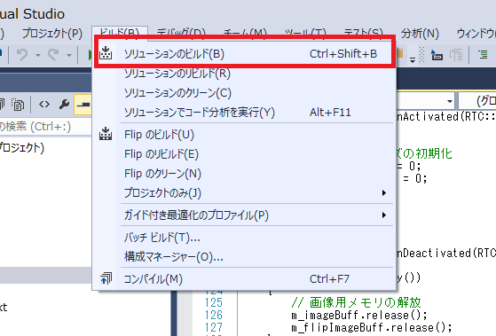</a></div>
<div align="center"><strong>Running the Build</strong></div>
<br>


### Verifying the Flip Component

Here, we will verify the operation of the Flip component by connecting it to the camera component (**OpenCVCameraComp**) and viewer component (**CameraViewerComp**) that have been included with OpenRTM-aist since version 1.1.

#### Starting the Name Service

Start the Name Service, which is used to register component references.

<br>

Navigate through:

**Start → Apps View (down arrow in the lower-right corner) → OpenRTM-aist 1.1.2**

and click **Start Naming Service**.

<span style="color:red;">※ If omniNames does not start when you click "Start Naming Service", make sure that the full computer name is 14 characters or fewer.</span>


#### Creating rtc.conf

RT Components require a file named **rtc.conf** to specify information such as the Name Server address and the registration format used for the Name Server.

Save the following contents as a file named **rtc.conf**, and place it in:

**Flip\build\src\Debug** (or **Release**) folder.

<span style="color:red;">※ If you left the workspace setting at its default when starting Eclipse, the Flip folder path will be:</span>

<span style="color:red;">C:\Documents and Settings\<LoginUserName>\workspace</span>

```ini
 corba.nameservers: localhost
 naming.formats: %n.rtc
```

#### Starting the Flip Component

Start the Flip component.

Run **FlipComp.exe** located in the folder where you placed **rtc.conf**.

#### Starting the Camera Component and Viewer Component

Start **OpenCVCameraComp**, which outputs images captured from a USB camera through an OutPort, and **CameraViewerComp**, which displays images received through an InPort.

These two components can be started as follows:

Navigate through:

**Start → Apps View (down arrow in the lower-right corner) → OpenRTM-aist 1.1.2**

and run **OpenCVCameraComp** and **CameraViewerComp** respectively.


### Connecting Components

As shown below, connect **OpenCVCameraComp**, **Flip**, and **CameraViewerComp** in RTSystemEditor.

<div align="center"><a href="RTSE_Connect_0.png">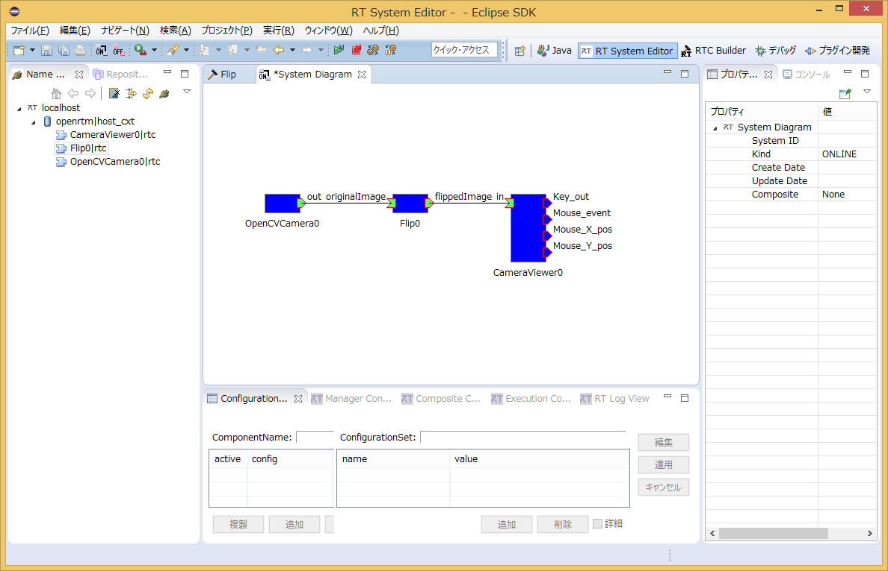</a></div>
<div align="center"><strong>Connecting Components</strong></div>

#### Activating Components

Click the **All Activate** icon at the top of RTSystemEditor to activate all components. If activation succeeds, the components will be displayed in yellow-green as shown below.

<br>

<div align="center"><a href="RTSE_Activate_0.png">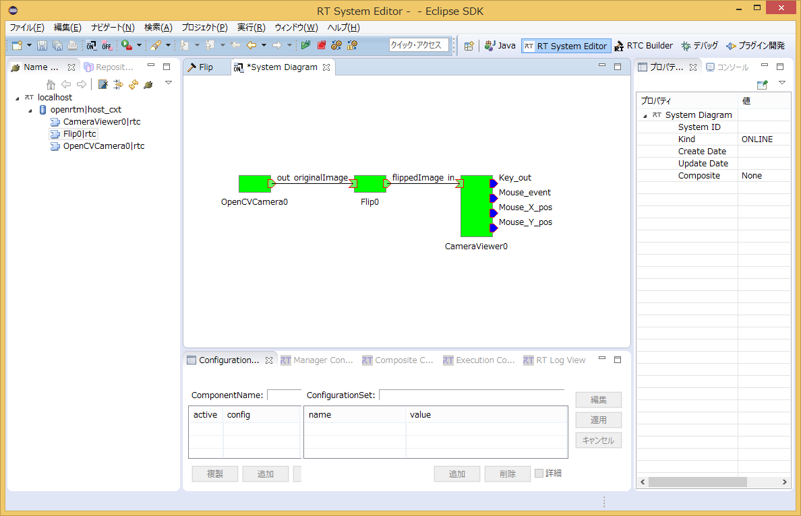</a></div>
<div align="center"><strong>Activating Components</strong></div>
<br>

#### Verifying Operation

You can modify configuration parameters from the Configuration View as shown below.

Change the Flip component's configuration parameter **flipMode** to values such as **0** or **-1**, and verify that the image is flipped accordingly.

<br>

<div align="center"><a href="RTSE_Configuration_0.png">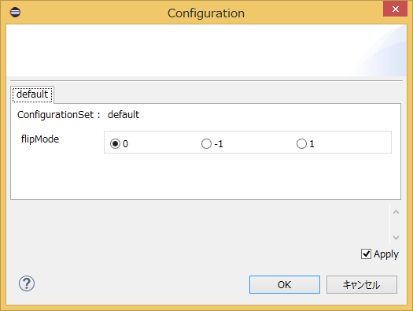</a></div>
<div align="center"><strong>Changing Configuration Parameters</strong></div>
<br>
