<!-- Title: Creating an Image Processing Component (Windows XP, OpenRTM-aist-1.1, rtmtools-1.1.0-RC3, CMake, VC2010) -->
#contents

## Introduction

In this case study, we introduce how to componentize a simple image-processing function.

Using an existing camera component and image viewer component, we create a component that performs image flipping (horizontal or vertical) and build a system that displays images captured by the camera after flipping them.

Although image flipping can be implemented very easily, in this tutorial we use the OpenCV library to create a more versatile RT-Component with even less effort.

### What is OpenCV?

[OpenCV](http://opencv.jp/) (Open Source Computer Vision Library) is an open-source computer vision library that was originally developed by Intel and is currently maintained and released by Willow Garage.

Excerpt from [Wikipedia](https://ja.wikipedia.org/wiki/OpenCV).

### RT-Component to Be Created

- Flip Component: An RT-Component that performs image flipping using the `cvFlip()` function, one of the many image-processing functions provided by the OpenCV library.

## Converting the cvFlip Function into an RT-Component

We will create an RT-Component that flips input images horizontally or vertically and outputs the result using the OpenCV library's `cvFlip` function.

The development and execution environment assumes Visual C++ on Windows. The target version of OpenRTM-aist is 1.1.0.

The overall procedure is as follows:

- Confirm the runtime and development environments
- Review OpenCV and the `cvFlip` function
- Define the component specifications
- Generate a source-code skeleton using RTCBuilder
- Implement the activity processing
- Verify component operation

### About the cvFlip Function

The `cvFlip` function flips image data of type `IplImage`, the standard image format used by OpenCV, around the vertical axis (horizontal flip), horizontal axis (vertical flip), or both axes.

The function prototype and argument meanings are as follows.

```cpp
 void cvFlip(IplImage* src, IplImage* dst=NULL, int flipMode=0);
 #define cvMirror cvFlip
  
 src       Input array
 dst       Output array. If dst=NULL, src is overwritten.
 flipMode  Specifies the flipping method:
 　flipMode = 0: Flip around the X-axis (vertical flip)
 　flipMode > 0: Flip around the Y-axis (horizontal flip)
 　flipMode < 0: Flip around both axes (horizontal and vertical flip)
```

### Component Specifications

The component we are about to create will be called the Flip component.

This component has an image-data input port (InPort) and an output port (OutPort) that outputs the flipped image.

The port names are:

- Input Port (InPort): **originalImage**
- Output Port (OutPort): **flippedImage**

OpenRTM-aist includes sample vision-related components that use OpenCV.

These components use the following `CameraImage` type for image input/output through data ports.

```cpp
   struct CameraImage
     {
         /// Time stamp.
         Time tm;
         /// Image pixel width.
         unsigned short width;
         /// Image pixel height.
         unsigned short height;
         /// Bits per pixel.
         unsigned short bpp;
         /// Image format (e.g. bitmap, jpeg, etc.).
         string format;
         /// Scale factor for images, such as disparity maps,
         /// where the integer pixel value should be divided
         /// by this factor to get the real pixel value.
         double fDiv;
         /// Raw pixel data.
         sequence<octet> pixels;
     };
```

In order to exchange data with these sample components, this Flip component will also use the `CameraImage` type for both its InPort and OutPort.

The `CameraImage` type is defined in `InterfaceDataTypes.idl` and can be used in C++ by including `InterfaceDataTypesSkel.h`.

The image can be flipped in three ways:

- Horizontal flip
- Vertical flip
- Horizontal and vertical flip

To allow selection at runtime, we use the RT-Component configuration feature.

The parameter name is **flipMode**.

Following the `cvFlip` specification, `flipMode` is of type `int`, with the following values assigned:

- Vertical flip: `0`
- Horizontal flip: `1`
- Horizontal and vertical flip: `-1`

The image-processing behavior for each value of `flipMode` is shown in the figure below.

<div align="center"><a href="cvFlip_and_FlipRTC.png"></a></div>
<div align="center"><strong>Image Flip Patterns for Flip Component flipMode Settings</strong></div>

The specifications of the Flip component are summarized below.

<table class="table-alt">
  <tr>
    <th>Component Name</th>
    <th>Flip</th>
  </tr>
  <tr>
    <td colspan="2" style="text-align: center;">InPort</td>
  </tr>
  <tr>
    <td>Port Name</td>
    <td>originalImage</td>
  </tr>
  <tr>
    <td>Type</td>
    <td>CameraImage</td>
  </tr>
  <tr>
    <td>Description</td>
    <td>Input image</td>
  </tr>
  <tr>
    <td colspan="2" style="text-align: center;">OutPort</td>
  </tr>
  <tr>
    <td>Port Name</td>
    <td>flippedImage</td>
  </tr>
  <tr>
    <td>Type</td>
    <td>CameraImage</td>
  </tr>
  <tr>
    <td>Description</td>
    <td>Flipped image</td>
  </tr>
  <tr>
    <td colspan="2" style="text-align: center;">Configuration</td>
  </tr>
  <tr>
    <td>Parameter Name</td>
    <td>flipMode</td>
  </tr>
  <tr>
    <td>Type</td>
    <td>int</td>
  </tr>
  <tr>
    <td>Description</td>
    <td><strong>Flip mode</strong><br>Vertical flip: 0<br>Horizontal flip: 1<br>Horizontal and vertical flip: -1</td>
  </tr>
</table>

### Runtime Environment and Development Environment

Let's first confirm the runtime and development environments.

- OS: Windows XP SP3 (Vista and Windows 7 are also supported)
- Compiler: [Visual C++ 2010 Express Edition Japanese Version](http://go.microsoft.com/fwlink/?LinkId=190491&clcid=0x411)

- [OpenRTM-aist-1.1.0-RC3 (C++ Version), Win32 VC2010]({{ site.baseurl }}/ja/download/openrtm-aist-content/110-rc3)

- RTSystemEditor 1.1
- RTCBuilder 1.1
  - [Eclipse3.4.2+RTSE+RTCB(1.1.0-RC2) Complete Windows Package](http://www.openrtm.org/pub/OpenRTM-aist/tools/1.1.0/eclipse342_rtmtools110-rc2_win32_ja.zip)

- [Doxygen](http://ftp.stack.nl/pub/users/dimitri/doxygen-1.8.11-setup.exe) Required for documentation generation
- [CMake](https://cmake.org/files/v2.8/cmake-2.8.5-win32-x86.exe)

- [Archive Extraction Tool (Lhaplus)](http://www.forest.impress.co.jp/lib/arc/archive/archiver/lhaplus.html)

Since OpenRTM-aist-1.1, CMake has been used for component builds.

In addition, RTCBuilder can automatically generate component manuals by passing entered documentation to Doxygen. Therefore, Doxygen is required during the CMake configuration process and must be installed in advance.

### Generating the Flip Component Skeleton

The Flip component skeleton is generated using RTCBuilder.

#### Starting RTCBuilder

In Eclipse, the folder used for development work is called a "workspace" (Work Space), and all generated files are generally stored under this folder.

The workspace can be created anywhere accessible. In this tutorial, we assume the following workspace:

- C:\rtcws

When you double-click `eclipse.exe`, you will first be prompted to specify the workspace location. Select the workspace above.

The Welcome page shown below will then appear.

<br>

<div align="center"><a href="fig1-1EclipseInit.png"></a></div>
<div align="center"><strong>Initial Eclipse Startup Screen</strong></div>

Since the Welcome page is not needed, close it by clicking the "×" button in the upper-left corner.

<div align="center"><a href="fig2-2PerspectiveSwitch.png"></a></div>
<div align="center"><strong>Switching Perspectives</strong></div>

Click the [Open Perspective] button in the upper-right corner and select "Other..." from the pull-down menu.

<div align="center"><a href="fig2-3PerspectiveSelection.png">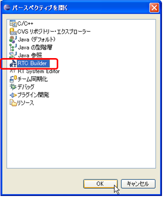</a></div>
<div align="center"><strong>Selecting a Perspective</strong></div>

Select "RTC Builder" to start RTCBuilder. An RTCBuilder icon labeled with a hammer and RT will appear in the menu bar.

<!-- #ref(NewRTCBEditor.png,nolink,70%,center) -->
<!-- CENTER:''RTC Builder Initial Startup Screen'' -->
<br>

#### Creating a New Project

To create the Flip component, you must first create a new project in RTCBuilder.

There are two ways to create a project:

1. Select [File] > [New] > [Project] from the menu bar (standard Eclipse operation)
   - In the "New Project" dialog, select "Other" > "RTC Builder" and click [Next]
2. Click the RTCBuilder icon in the menu bar

<div align="center"><a href="fig2-5CreateProject.png">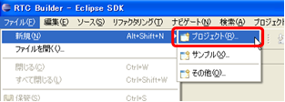</a></div>
<div align="center"><strong>Creating an RTC Builder Project 1 (From the File Menu)</strong></div>

<div align="center"><a href="fig2-6CreateProject2.png"></a></div>
<div align="center"><strong>Creating an RTC Builder Project 2 (From the File Menu)</strong></div>

Either method launches the project creation wizard shown below.

Enter the project name to create (here, **Flip**) in the "Project Name" field and click [Finish].

<div align="center"><a href="RT-Component-BuilderProject.png">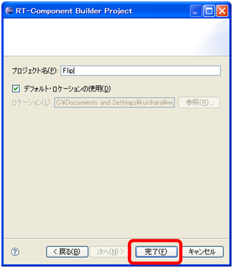</a></div>
<div align="center"><strong>Creating an RTC Builder Project 3</strong></div>

A project with the specified name is generated and added to the Package Explorer.

<div align="center"><a href="PackageExplolrer.png"></a></div>
<div align="center"><strong>Creating an RTC Builder Project 4</strong></div>

Inside the generated project, an RTC profile XML file (`RTC.xml`) with default values is automatically generated.

#### Launching the RTC Profile Editor

When `RTC.xml` is generated, the RTCBuilder editor associated with the project workspace should open automatically.

If it does not, click the [Open New RtcBuilder Editor] button on the toolbar or select [File] > [Open New Builder Editor] from the menu bar.

<div align="center"><a href="Open_RTCBuilder.png">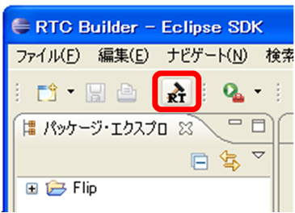</a></div>
<div align="center"><strong>Open New RtcBuilder Editor from Toolbar</strong></div>

<div align="center"><a href="fig2-10FileMenuOpenNewBuilder.png">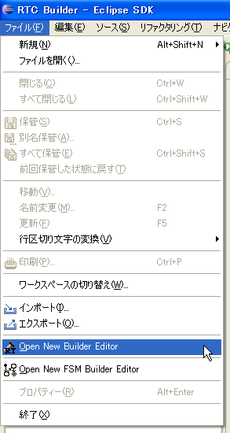</a></div>
<div align="center"><strong>Open New Builder Editor from File Menu</strong></div>

#### Entering Profile Information and Generating Code

First, select the leftmost "Basic" tab and enter the basic information.

In addition to the Flip component name defined earlier, enter information such as the summary and version.

Fields displayed in red are required. Other fields may be left at their default values.

- Module Name: Flip
- Module Description: Flip image component
- Version: 1.0.0
- Vendor: AIST
- Module Category: Category
- Component Type: STATIC
- Activity Type: PERIODIC
- Component Kind: DataFlowComponent
- Maximum Number of Instances: 1
- Execution Type: PeriodicExecutionContext
- Execution Period: 0.0 (<span style="color:RED;">The figure below shows 1.0, but please set it to 0.0.</span>)

<br>

<div align="center"><a href="Basic.png"></a></div>
<div align="center"><strong>Entering Basic Information</strong></div>
<br>

Next, select the "Activity" tab and specify the action callbacks to be used.

The Flip component uses the following callbacks:

- onActivated()
- onDeactivated()
- onExecute()

As shown below, click onActivated in section ① and then enable the [ON] radio button in section ②.

Repeat the same procedure for onDeactivated and onExecute.

<br>

<div align="center"><a href="Activity.png"></a></div>
<div align="center"><strong>Selecting Activity Callbacks</strong></div>
<br>

Next, select the "Data Ports" tab and enter the data port information.

Based on the specifications defined earlier, enter the following values.

Variable names and display positions are optional and may remain unchanged.

<br>

- InPort Profile:
  - Port Name: originalImage
  - Data Type: CameraImage
  - Variable Name: originalImage
  - Position: left

<br>

- OutPort Profile:
  - Port Name: flippedImage
  - Data Type: CameraImage
  - Variable Name: flippedImage
  - Position: right

<br>

<div align="center"><a href="DataPort.png"></a></div>
<div align="center"><strong>Entering Data Port Information</strong></div>
<br>

Next, select the "Configuration" tab and enter the Configuration information according to the specifications.

Constraints and Widgets determine how configuration parameters are displayed in RTSystemEditor, allowing values to be changed through GUI controls such as sliders, spin buttons, and radio buttons.

Since `flipMode` is restricted to the three values defined earlier (-1, 0, and 1), we use radio buttons.

<br>

- flipMode
  - Name: flipMode
  - Data Type: int
  - Default Value: 1
  - Variable Name: flipMode
  - Constraint: (-1, 0, 1) <span style="color:RED;">* (-1: Horizontal and vertical flip, 0: Vertical flip, 1: Horizontal flip)</span>
  - Widget: radio

<br>

<div align="center"><a href="Configuration.png"></a></div>
<div align="center"><strong>Entering Configuration Information</strong></div>
<br>

Next, select the "Language / Environment" tab and choose the programming language.

In this example, select **C++** as the programming language.

Note that no default value is set for the Language / Environment field. If you forget to specify it, code generation will fail, so be sure to select a language.

For C++, the default build environment uses CMake. However, if you want RTCBuilder to generate legacy Visual C++ project or solution files directly, check **[Use old build environment]**.

<div align="center"><a href="Language.png"></a></div>
<div align="center"><strong>Selecting the Programming Language</strong></div>
<br>

Finally, return to the "Basic" tab and click the **[Generate]** button to generate the component skeleton.

<br>

<div align="center"><a href="Generate.png"></a></div>
<div align="center"><strong>Generating the Skeleton (Generate)</strong></div>
<br>

<span style="color:Red;">* The generated source files are created inside the workspace folder specified when Eclipse was started. You can check the current workspace via [File] > [Switch Workspace...].</span>

#### Preliminary Build

At this point, the Flip component source code has been generated.

Since the processing logic has not yet been implemented, nothing will be output even if image data is supplied to the InPort. However, the generated source code can still be compiled and executed.

* For components with service ports and providers, some implementations may fail to build unless the service implementation is completed.

First, configure the build environment using CMake.

On Linux, run the following commands in the directory where the Flip component source code was generated:

```bash
 $ cmake .
 $ make
```

This should complete both configuration and build.

For Windows, use the GUI version of CMake.

Launch **CMake (cmake-gui)** from the Start menu.

<div align="center"><a href="CMakeGUI0.png">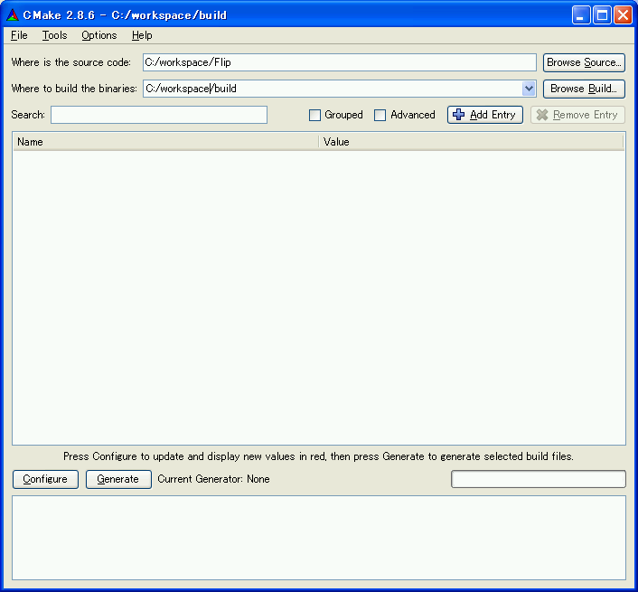</a></div>
<div align="center"><strong>Launching CMake GUI and Specifying Directories</strong></div>

At the top of the window, you will find the following text boxes.

Specify the source-code directory (where `CMakeLists.txt` exists) and the build directory.

- **Where is the source code**
- **Where to build the binaries**

The source-code directory is the location where the Flip component source code was generated and where `CMakeLists.txt` exists.

By default, this will be:

```text
<workspace directory>/Flip
```

The quickest way is to drag and drop `CMakeLists.txt` located under the Flip project in the Eclipse Package Explorer into the **Where is the source code** text box.

<div align="center"><a href="ProjectToCMake.png">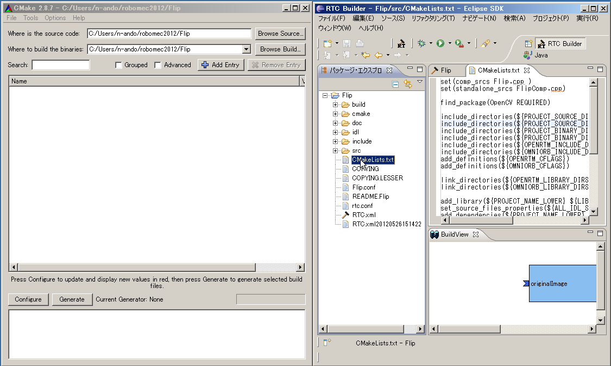</a></div>
<div align="center"><strong>Specifying CMakeLists.txt</strong></div>

The build directory is where project files, object files, and binaries generated during the build process are stored.

Although any location can be used, it is recommended to specify an easy-to-understand subdirectory such as:

```text
<workspace directory>/Flip/build
```

<table class="table-alt">
  <tr>
    <th><strong>Where is the source code</strong></th>
    <th>C:\rtcws\Flip</th>
  </tr>
  <tr>
    <td><strong>Where to build the binaries</strong></td>
    <td>C:\rtcws\Flip\build</td>
  </tr>
</table>

After specifying the directories, click the **[Configure]** button.

A dialog similar to the figure below will appear.

Specify the type of project to generate.

In this example, select **Visual Studio 10**.

If you are using VS8 or VS9, select the corresponding version.

You may also be able to choose between 32-bit and 64-bit project types. Select the one that matches your installed OpenRTM-aist version.

<div align="center"><a href="CMakeGUI1.png">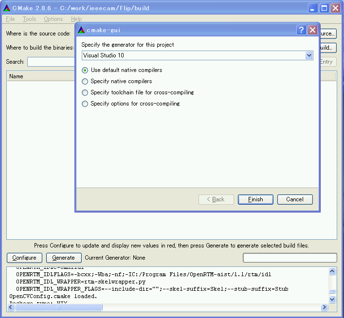</a></div>
<div align="center"><strong>Selecting the Project Type to Generate</strong></div>

Click **[Finish]** to start configuration.

If successful, the log window at the bottom will display:

```text
Configuring done
```

Then click the **[Generate]** button.

When:

```text
Generating done
```

is displayed, generation of project files and solution files is complete.

Since CMake creates cache files during configuration, if you change settings or modify the environment due to troubleshooting, delete the cache via:

```text
[File] > [Delete Cache]
```

and rerun the configuration process.

Next, double-click `Flip.sln` inside the build directory specified earlier to launch Visual Studio 2010.

After Visual Studio starts, right-click **ALL_BUILD** in the Solution Explorer and select **Build**.

If there are no problems, the build should complete successfully.

<div align="center"><a href="VCbuild0.png">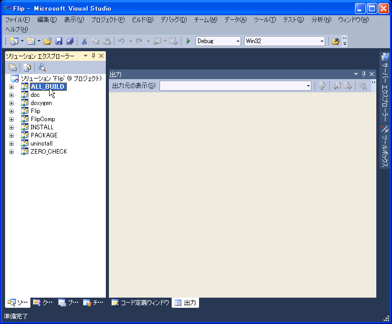</a></div>
<div align="center"><strong>Build Screen</strong></div>

### Editing the Header and Source Files

Edit the header file (`include/Flip/Flip.h`) and source file (`src/Flip.cpp`).

In the Eclipse Package Explorer, double-click the corresponding files.

Normally, the Visual C++ editor will open, allowing you to edit them there.

You can also drag and drop the files into Eclipse's central editor area.

#### Implementing the Activity Processing

In the Flip component, images received through the InPort are stored in an image buffer.

The stored image is then processed using OpenCV's `cvFlip()` function.

Finally, the converted image is sent through the OutPort.

<br>

The processing performed by `onActivated()`, `onExecute()`, and `onDeactivated()` is shown below.

<br>

<div align="center"><a href="FlipRTC_State.png">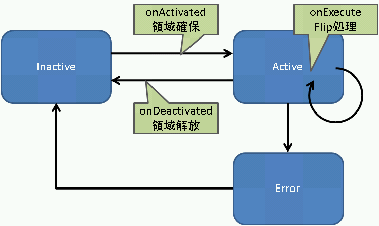</a></div>
<div align="center"><strong>Overview of Activity Processing</strong></div>

<br>

The processing performed in `onExecute()` is shown below.

<br>

<div align="center"><a href="FlipRTC.png"></a></div>
<div align="center"><strong>Processing Performed in onExecute()</strong></div>

<br>

#### Editing the Header File (Flip.h)

To use the OpenCV library, include the OpenCV header files.

```cpp
 // Include files for OpenCV
 #include<cv.h>
 #include<cxcore.h>
 #include<highgui.h>
```

This `cvFlip` component performs image-buffer allocation, image flipping, and image-buffer release.

These processes are handled in the callback functions `onActivated()`, `onExecute()`, and `onDeactivated()` respectively.

```cpp
   /***
    *
    * The activated action (Active state entry action)
    * former rtc_active_entry()
    *
    * @param ec_id target ExecutionContext Id
    *
    * @return RTC::ReturnCode_t
    *
    *
    */
   virtual RTC::ReturnCode_t onActivated(RTC::UniqueId ec_id);

   /***
    *
    * The deactivated action (Active state exit action)
    * former rtc_active_exit()
    *
    * @param ec_id target ExecutionContext Id
    *
    * @return RTC::ReturnCode_t
    *
    *
    */
   virtual RTC::ReturnCode_t onDeactivated(RTC::UniqueId ec_id);

   /***
    *
    * The execution action that is invoked periodically
    * former rtc_active_do()
    *
    * @param ec_id target ExecutionContext Id
    *
    * @return RTC::ReturnCode_t
    *
    *
    */
   virtual RTC::ReturnCode_t onExecute(RTC::UniqueId ec_id);
```

Add member variables for storing flipped images.

```cpp
   IplImage* m_imageBuff;
   IplImage* m_flipImageBuff;
```
#### Editing the Source File (Flip.cpp)

Implement `onActivated()`, `onDeactivated()`, and `onExecute()` as shown below.

```cpp
 RTC::ReturnCode_t Flip::onActivated(RTC::UniqueId ec_id)
 {
   // Initialize image memory
   m_imageBuff = NULL;
   m_flipImageBuff = NULL;

   // Initialize OutPort image size
   m_flippedImage.width = 0;
   m_flippedImage.height = 0;

   return RTC::RTC_OK;
 }


 RTC::ReturnCode_t Flip::onDeactivated(RTC::UniqueId ec_id)
 {
   if(m_imageBuff != NULL)
   {
     // Release image memory
     cvReleaseImage(&m_imageBuff);
     cvReleaseImage(&m_flipImageBuff);
   }

   return RTC::RTC_OK;
 }


 RTC::ReturnCode_t Flip::onExecute(RTC::UniqueId ec_id)
 {
   // Check for new data
   if (m_originalImageIn.isNew()) {
     // Read InPort data
     m_originalImageIn.read();

     // Process image size and allocate image memory
     if( m_originalImage.width != m_flippedImage.width || m_originalImage.height != m_flippedImage.height)
       {
         m_flippedImage.width = m_originalImage.width;
         m_flippedImage.height = m_originalImage.height;

         // If the image size has changed
         if(m_imageBuff != NULL)
           {
             cvReleaseImage(&m_imageBuff);
             cvReleaseImage(&m_flipImageBuff);
           }

         // Allocate image memory
         m_imageBuff = cvCreateImage(cvSize(m_originalImage.width, m_originalImage.height), IPL_DEPTH_8U, 3);
         m_flipImageBuff = cvCreateImage(cvSize(m_originalImage.width, m_originalImage.height), IPL_DEPTH_8U, 3);
       }

     // Copy image data from InPort to IplImage imageData
     memcpy(m_imageBuff->imageData,(void *)&(m_originalImage.pixels[0]),m_originalImage.pixels.length());

     // Flip image data from InPort
     // m_flipMode 0: X-axis, 1: Y-axis, -1: both axes
     cvFlip(m_imageBuff, m_flipImageBuff, m_flipMode);

     // Get image data size
     int len = m_flipImageBuff->nChannels * m_flipImageBuff->width * m_flipImageBuff->height;
     m_flippedImage.pixels.length(len);

     // Copy flipped image data to OutPort
     memcpy((void *)&(m_flippedImage.pixels[0]),m_flipImageBuff->imageData,len);

     // Output flipped image data from OutPort
     m_flippedImageOut.write();
   }

   return RTC::RTC_OK;
 }
```

### Generating Files Required for CMake Build

#### Editing CMakeLists.txt

In the Eclipse Package Explorer, edit `src/CMakeLists.txt` by double-clicking it or dragging and dropping it into the editor.

<div align="center"><a href="EditCmakeLists.png">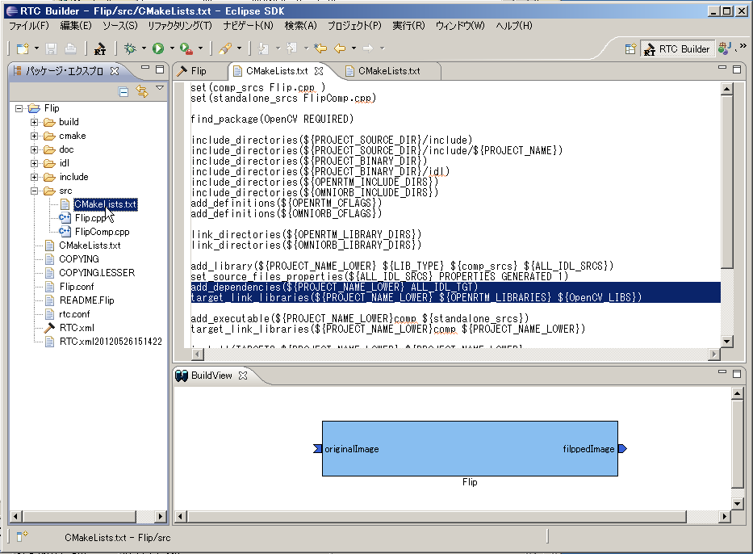</a></div>
<div align="center"><strong>Editing CMakeLists.txt</strong></div>

Since this component uses OpenCV, you must provide the OpenCV include path, library path, and libraries to the build system.

Fortunately, OpenCV supports CMake, so only the following two modifications are required.

- Modify `src/CMakeLists.txt`
  - Double-click `src/CMakeLists.txt` in Eclipse Package Explorer
- Add `find_package(OpenCV REQUIRED)`
- Add `${OpenCV_LIBS}` to the first `target_link_libraries`
  - There are two `target_link_libraries` entries:
    - The upper one specifies DLL libraries
    - The lower one specifies executable libraries

```cmake
 set(comp_srcs Flip.cpp )
 set(standalone_srcs FlipComp.cpp)

 find_package(OpenCV REQUIRED) ← Add this line
   ：(omitted)
 add_dependencies(${PROJECT_NAME} ALL_IDL_TGT)
 target_link_libraries(${PROJECT_NAME} ${OPENRTM_LIBRARIES} ${OpenCV_LIBS}) ← Add OpenCV_LIBS
   ：(omitted)
 add_executable(${PROJECT_NAME}Comp ${standalone_srcs}
   ${comp_srcs} ${comp_headers} ${ALL_IDL_SRCS})
 target_link_libraries(${PROJECT_NAME}Comp ${OPENRTM_LIBRARIES} ${OpenCV_LIBS}) ← Add OpenCV_LIBS
```

### Building with Visual C++

#### Executing the Build

Since `CMakeLists.txt` has been modified, run **Configure** and **Generate** again using CMake GUI.

After confirming that CMake generation completed successfully, double-click `Flip.sln` and start Visual C++ 2010.

Once Visual C++ 2010 has started, build the component as shown below.

<br>

<div align="center"><a href="VC++_build.png"></a></div>
<div align="center"><strong>Executing the Build</strong></div>

<br>

### Verifying Operation of the Flip Component

Here, we verify operation by connecting the camera component (`OpenCVCameraComp` or `DirectShowCamComp`) and the viewer component (`CameraViewerComp`) included with OpenRTM-aist 1.1 and later.

#### Starting the Name Service

Start the Name Service used to register component references.

<br>

Navigate through:

```text
[Start]
  > [All Programs]
    > [OpenRTM-aist]
      > [C++]
        > [tools]
```

and click **Start Naming Service**.

&color(RED){* If omniNames does not start when you click "Start Naming Service", verify that the full computer name is set to 14 characters or fewer.}

#### Creating rtc.conf

RT-Components require a file called `rtc.conf` that specifies information such as the Name Server address and registration format.

Save the following contents as a file named `rtc.conf` and place it in:

```text
Flip\FlipComp\Debug
```

(or the Release folder).

<span style="color:RED;">* If the workspace was left at the default location when Eclipse was started, the Flip folder path will be:</span>

<span style="color:RED;">C:\Documents and Settings\<login user name>\workspace</span>

```ini
 corba.nameservers: localhost
 naming.formats: %n.rtc
```

#### Starting the Flip Component

Start the Flip component.

Execute `FlipComp.exe` located in the folder where you placed `rtc.conf`.

#### Starting the Camera Component and Viewer Component

Start `OpenCVCameraComp` (or `DirectShowCamComp`), which outputs USB camera images through an OutPort, and `CameraViewerComp`, which displays images received through an InPort.

These components can be started as follows.

Navigate through:

```text
[Start]
  > [All Programs]
    > [OpenRTM-aist]
      > [components]
        > [C++]
          > [examples]
            > [opencv-rtcs]
```

and execute **OpenCVCameraComp** and **CameraViewerComp**.

In some cases, OpenCVCameraComp may fail to recognize the camera.

If this occurs, try using DirectShowCamComp instead.


### Connecting the Components

As shown below, connect `OpenCVCameraComp` (or `DirectShowCamComp`), `Flip`, and `CameraViewerComp` using RTSystemEditor.

<div align="center"><a href="RTSE_Connect.png"></a></div>
<div align="center"><strong>Connecting Components</strong></div>

#### Activating the Components

Click the **ALL** icon located at the top of RTSystemEditor to activate all components.

If activation is successful, the components will be displayed in light green as shown below.

<br>

<div align="center"><a href="RTSE_Activate.png">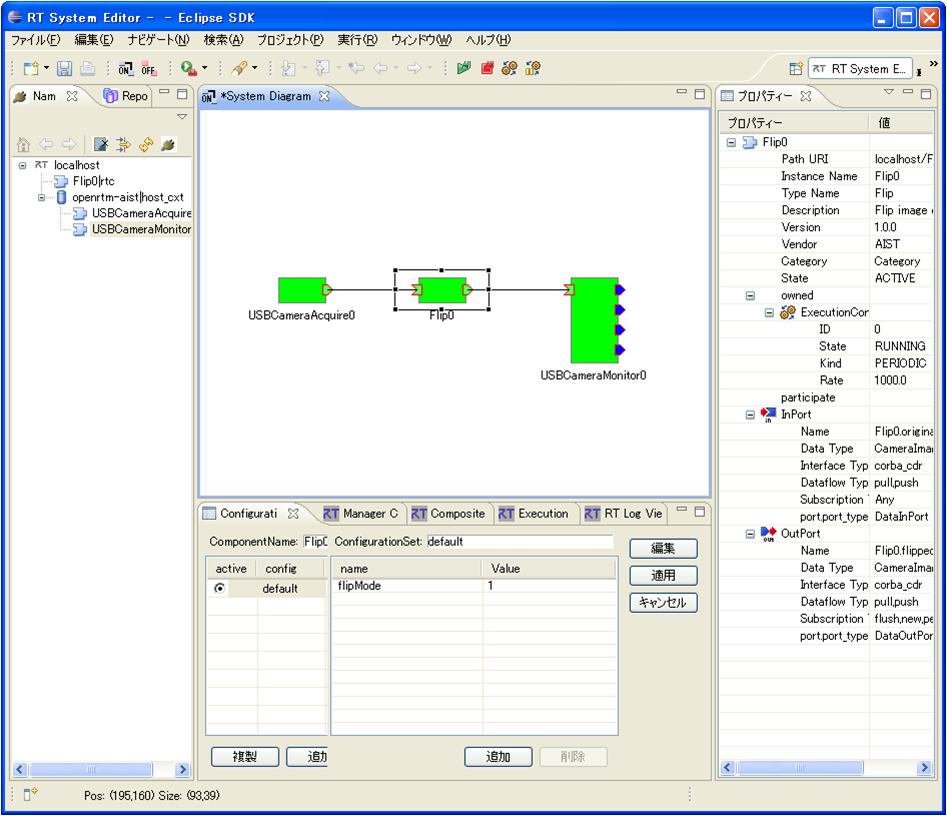</a></div>
<div align="center"><strong>Activating Components</strong></div>

<br>

#### Verifying Operation

As shown below, configuration parameters can be modified in the Configuration View.

Change the Flip component configuration parameter **flipMode** to values such as **0** or **-1**, and verify that the image is flipped correctly.

<br>

<div align="center"><a href="RTSE_Configuration.png"></a></div>
<div align="center"><strong>Changing Configuration Parameters</strong></div>

<br>

## Complete Source Code for the Flip Component

### Flip Component Source File (Flip.cpp)

```cpp
 // -*- C++ -*-
 /*!
  * @file  Flip.cpp
  * @brief Flip image component
  * @date $Date$
  *
  * $Id$
  */

 #include "Flip.h"

 // Module specification
 static const char* flip_spec[] =
   {
     "implementation_id", "Flip",
     "type_name",         "Flip",
     "description",       "Flip image component",
     "version",           "1.0.0",
     "vendor",            "AIST",
     "category",          "Category",
     "activity_type",     "PERIODIC",
     "kind",              "DataFlowComponent",
     "max_instance",      "1",
     "language",          "C++",
     "lang_type",         "compile",
     // Configuration variables
     "conf.default.flipMode", "1",
     // Widget
     "conf.__widget__.flipMode", "radio",
     // Constraints
     "conf.__constraints__.flip_mode", "(-1,0,1)",
     ""
   };

 /*!
  * @brief constructor
  * @param manager Maneger Object
  */
 Flip::Flip(RTC::Manager* manager)
   : RTC::DataFlowComponentBase(manager),
     m_originalImageIn("originalImage", m_originalImage),
     m_flippedImageOut("flippedImage", m_flippedImage)
 {
 }

 /*!
  * @brief destructor
  */
 Flip::~Flip()
 {
 }


 RTC::ReturnCode_t Flip::onInitialize()
 {
   // Registration: InPort/OutPort/Service
   // Set InPort buffers
   addInPort("originalImage", m_originalImageIn);

   // Set OutPort buffer
   addOutPort("flippedImage", m_flippedImageOut);

   // Bind variables and configuration variable
   bindParameter("flipMode", m_flipMode, "1");

   return RTC::RTC_OK;
 }


 RTC::ReturnCode_t Flip::onActivated(RTC::UniqueId ec_id)
 {
   // Initialize image memory
   m_imageBuff = NULL;
   m_flipImageBuff = NULL;

   // Initialize OutPort image size
   m_flippedImage.width = 0;
   m_flippedImage.height = 0;

   return RTC::RTC_OK;
 }


 RTC::ReturnCode_t Flip::onDeactivated(RTC::UniqueId ec_id)
 {
   if(m_imageBuff != NULL)
   {
     // Release image memory
     cvReleaseImage(&m_imageBuff);
     cvReleaseImage(&m_flipImageBuff);
   }

   return RTC::RTC_OK;
 }


 RTC::ReturnCode_t Flip::onExecute(RTC::UniqueId ec_id)
 {
   // Check for new data
   if (m_originalImageIn.isNew()) {
     // Read InPort data
     m_originalImageIn.read();

     // Process InPort/OutPort image size and allocate image memory
     if( m_originalImage.width != m_flippedImage.width || m_originalImage.height != m_flippedImage.height)
       {
         m_flippedImage.width = m_originalImage.width;
         m_flippedImage.height = m_originalImage.height;

         // When the InPort image size changes
         if(m_imageBuff != NULL)
           {
             cvReleaseImage(&m_imageBuff);
             cvReleaseImage(&m_flipImageBuff);
           }

         // Allocate image memory
         m_imageBuff = cvCreateImage(cvSize(m_originalImage.width, m_originalImage.height), IPL_DEPTH_8U, 3);
         m_flipImageBuff = cvCreateImage(cvSize(m_originalImage.width, m_originalImage.height), IPL_DEPTH_8U, 3);
       }

     // Copy InPort image data to IplImage imageData
     memcpy(m_imageBuff->imageData,(void *)&(m_originalImage.pixels[0]),m_originalImage.pixels.length());

     // Flip image data from InPort.
     // m_flipMode 0: X-axis, 1: Y-axis, -1: both axes
     cvFlip(m_imageBuff, m_flipImageBuff, m_flipMode);

     // Obtain image data size
     int len = m_flipImageBuff->nChannels * m_flipImageBuff->width * m_flipImageBuff->height;
     m_flippedImage.pixels.length(len);

     // Copy flipped image data to OutPort
     memcpy((void *)&(m_flippedImage.pixels[0]),m_flipImageBuff->imageData,len);

     // Output flipped image data through OutPort
     m_flippedImageOut.write();
   }

   return RTC::RTC_OK;
 }


 extern "C"
 {

   void FlipInit(RTC::Manager* manager)
   {
     coil::Properties profile(flip_spec);
     manager->registerFactory(profile,
                              RTC::Create<Flip>,
                              RTC::Delete<Flip>);
   }

 };
```

### Flip Component Header File (Flip.h)

```cpp
 // -*- C++ -*-
 /*!
  * @file  Flip.h
  * @brief Flip image component
  * @date  $Date$
  *
  * $Id$
  */

 #ifndef FLIP_H
 #define FLIP_H

 #include <rtm/Manager.h>
 #include <rtm/DataFlowComponentBase.h>
 #include <rtm/CorbaPort.h>
 #include <rtm/DataInPort.h>
 #include <rtm/DataOutPort.h>
 #include <rtm/idl/BasicDataTypeSkel.h>
 #include <rtm/idl/ExtendedDataTypesSkel.h>
 #include <rtm/idl/InterfaceDataTypesSkel.h>

 // Include files for OpenCV
 #include<cv.h>
 #include<cxcore.h>
 #include<highgui.h>

 using namespace RTC;
```

```cpp
 /*!
  * @class Flip
  * @brief Flip image component
  *
  */
 class Flip
   : public RTC::DataFlowComponentBase
 {
  public:
   /*!
    * @brief constructor
    * @param manager Maneger Object
    */
   Flip(RTC::Manager* manager);

   /*!
    * @brief destructor
    */
   ~Flip();

   /***
    *
    * The initialize action (on CREATED->ALIVE transition)
    * formaer rtc_init_entry()
    *
    * @return RTC::ReturnCode_t
    *
    *
    */
    virtual RTC::ReturnCode_t onInitialize();

   /***
    *
    * The activated action (Active state entry action)
    * former rtc_active_entry()
    *
    * @param ec_id target ExecutionContext Id
    *
    * @return RTC::ReturnCode_t
    *
    *
    */
    virtual RTC::ReturnCode_t onActivated(RTC::UniqueId ec_id);

   /***
    *
    * The deactivated action (Active state exit action)
    * former rtc_active_exit()
    *
    * @param ec_id target ExecutionContext Id
    *
    * @return RTC::ReturnCode_t
    *
    *
    */
    virtual RTC::ReturnCode_t onDeactivated(RTC::UniqueId ec_id);

   /***
    *
    * The execution action that is invoked periodically
    * former rtc_active_do()
    *
    * @param ec_id target ExecutionContext Id
    *
    * @return RTC::ReturnCode_t
    *
    *
    */
    virtual RTC::ReturnCode_t onExecute(RTC::UniqueId ec_id);

  protected:
   // Configuration variable declaration
   /*!
    *
    * - Name: flipMode
    * - DefaultValue: 1
    */
   int m_flipMode;

   // DataInPort declaration
   CameraImage m_originalImage;

   /*!
    */
   InPort<CameraImage> m_originalImageIn;

   // DataOutPort declaration
   CameraImage m_flippedImage;

   /*!
    */
   OutPort<CameraImage> m_flippedImageOut;

  private:
   // Processing image buffers
   IplImage* m_imageBuff;
   IplImage* m_flipImageBuff;
 };


 extern "C"
 {
   DLL_EXPORT void FlipInit(RTC::Manager* manager);
 };

 #endif // FLIP_H
```

### Complete Source Code for the Flip Component

The complete source code for the Flip component is attached below.

[Flip.zip](Flip.zip)

<!-- div align="center"><a href="Flip.zip"></a></div>;-->

