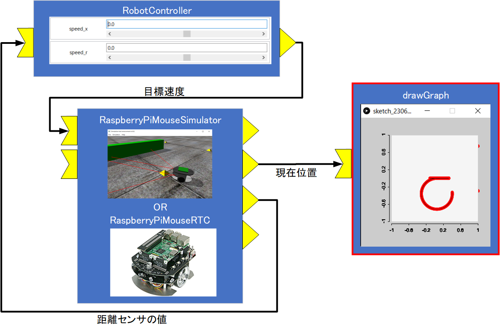
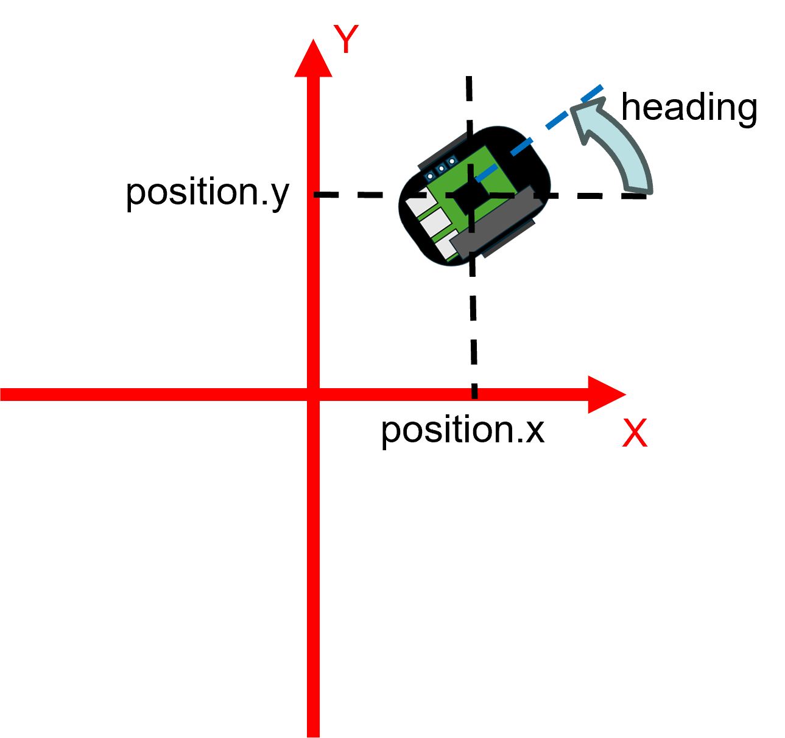
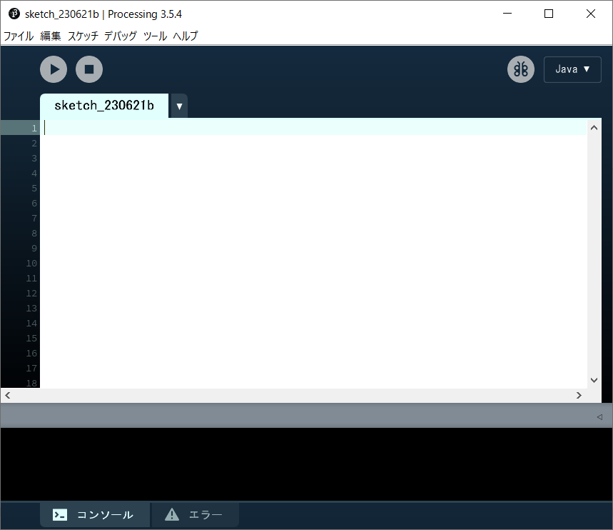
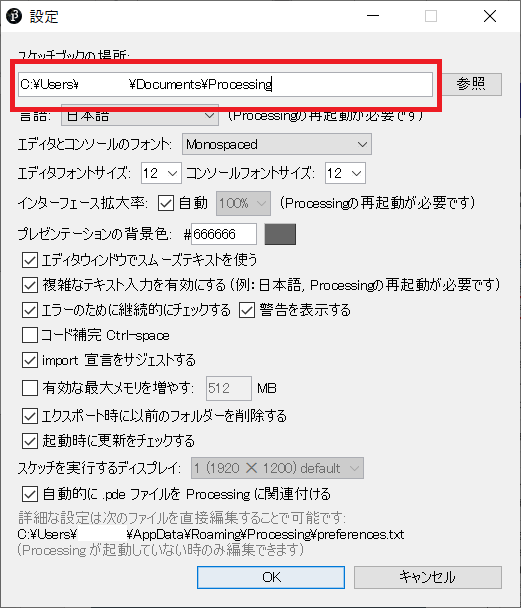
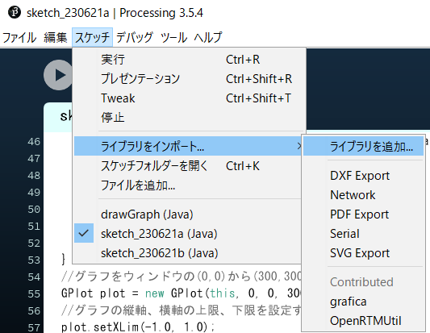
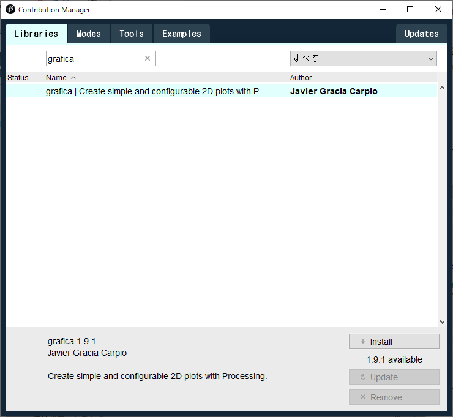
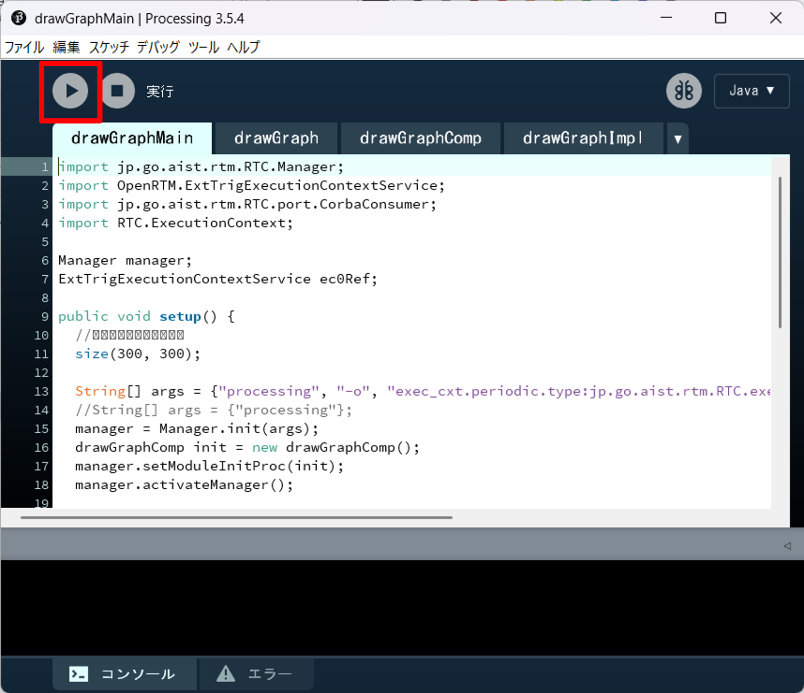
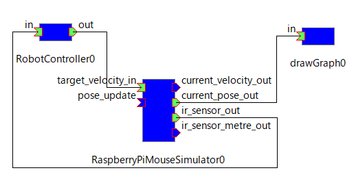

#contents

## What is Processing?

Processing is an open-source programming language that is considered beginner-friendly because of the following features:

- Visual expression is easier than in many other programming languages (graphs, animations, interactive graphics, etc.)
- The development environment is easy to install and set up

## Overview of the Exercise

In this exercise, you will create a system that executes an RTC for graph drawing in Processing and displays the movement trajectory of a Raspberry Pi Mouse on a graph.

<br>

<div align="center"><a href="processing10.png"></a></div>
<br>

## Creating the drawGraph Component

### Generating Skeleton Code with RTCBuilder

Create the drawGraph component in RTCBuilder using the following specification.

<table class="table-alt">
  <tr>
    <th>Component Name</th>
    <th>drawGraph</th>
  </tr>
  <tr>
    <td>Activity</td>
    <td>onActivated, onExecute</td>
  </tr>
  <tr>
    <td>Language</td>
    <td><strong>Processing</strong></td>
  </tr>
  <tr>
    <td colspan="2" style="text-align: center;">InPort</td>
  </tr>
  <tr>
    <td>Port Name</td>
    <td>in</td>
  </tr>
  <tr>
    <td>Data Type</td>
    <td>RTC::TimedPose2D</td>
  </tr>
</table>

### About the RTC::TimedPose2D Type

The RTC::TimedPose2D type is a data type that represents position and orientation on a two-dimensional plane.

```cpp
    struct Point2D
    {
        /// X coordinate in metres.
        double x;
        /// Y coordinate in metres.
        double y;
    };

    struct Pose2D
    {
        /// 2D position.
        Point2D position;
        /// Heading in radians.
        double heading;
    };
````

<br>

<div align="center"><a href="rtmtutorial12.png"></a></div>
<br>

## Starting the Processing Development Environment

First, start the Processing IDE (Integrated Development Environment).

Download the Processing development environment from the Processing repository.

* https://github.com/processing/processing/releases/tag/processing-0270-3.5.4

Run **processing.exe** in the extracted folder.

Due to Java version compatibility issues, OpenRTM-aist currently cannot run in Processing 4.0 or later environments.

If training materials are distributed on a USB drive, use the following files:

* Windows: **Processing\processing-3.5.4-windows64\processing.exe**
* Ubuntu: **Processing/processing-3.5.4-linux64/processing**

After execution, the following IDE window will appear.

<br>

<div align="center"><a href="processing3.png"></a></div>
<br>

## Installing the OpenRTM-aist Library for Processing

Install the library required to use OpenRTM-aist functionality from Processing.

First, determine the location of the Processing Sketchbook.

This can be found by selecting **File → Preferences**.

<br>

<div align="center"><a href="processing4.png"></a></div>
<br>

Open the Sketchbook location using Explorer.

Copy the extracted **OpenRTMUtil** folder from the following ZIP archive into the **libraries** folder within the Sketchbook directory.

* [OpenRTMUtil.zip](https://github.com/Nobu19800/OpenRTMProcessing/releases/download/robomech2024/OpenRTMUtil.zip)

*For workshops and training sessions, the **Processing\OpenRTMUtil** folder on the USB drive may be used instead.*

After copying, the directory structure should look like this:

```text
 Sketchbook
    ├ examples
    ├ modes
    ├ templates
    ├ tools
    └ libraries
         └ OpenRTMUtil
                └ library
                     ├ commons-cli-1.1.jar
                     ├ jna-4.2.2.jar
                     ├ jna-platform-4.2.2.jar
                     ├ LogicalTimeTriggeredEC.jar
                     ├ NameserviceFile.jar
                     ├ OpenRTM-aist-2.1.0.jar
                     ├ OpenRTMUtil.jar
                     ├ rtcd.jar
                     └ rtcprof.jar
```

## Installing grafica

Install the **grafica** graph-drawing library.

In Processing, select:

**Sketch → Import Library → Add Library**

<br>

<div align="center"><a href="processing5.png"></a></div>
<br>

Search for **grafica** in the Contribution Manager and install it.

<br>

<div align="center"><a href="processing1.png"></a></div>
<br>

## Programming

Next, implement the RTC in Processing.

Open **drawGraphMain.pde**, which was generated by RTCBuilder.

You can open it by dragging and dropping **drawGraphMain.pde** onto **processing.exe**.

In the Processing editor, add window size and frame rate settings to the `setup()` function in **drawGraphMain.pde**.

```java
 public void setup() {
   // Set window size
   size(300, 300); // Added
   frameRate(10);  // Added
```

Next, edit **drawGraphImpl.pde**.

Add the following import statement for the grafica library.

```java
 import RTC.ReturnCode_t;

 import grafica.*; // Added
```

Next, declare the variable `data`, which stores the received position and orientation data.

```java
    protected InPort<TimedPose2D> m_inIn;

    // Array for storing graph points
    GPointsArray data; // Added
```

Modify the `onActivated()` function as follows:

```java
    @Override
    protected ReturnCode_t onActivated(int ec_id) {
        // Initialize data array
        data = new GPointsArray();
        return super.onActivated(ec_id);
    }
```

Finally, modify the `onExecute()` function as follows:

```java
    @Override
    protected ReturnCode_t onExecute(int ec_id) {
        // Processing when data is received from InPort
        if (m_inIn.isNew())
        {
          // Read received data
          m_inIn.read();

          // Add the received position to the data array
          data.add((float)m_in.v.data.position.x,
                   (float)m_in.v.data.position.y);

          // Discard old data if more than 1000 points exist
          if (data.getNPoints() > 1000)
          {
            data.remove(0);
          }
        }

        // Draw the graph in the area from (0,0) to (300,300)
        GPlot plot = new GPlot(m_applet, 0, 0, 300, 300);

        // Set graph axis limits
        plot.setXLim(-1.0, 1.0);
        plot.setYLim(-1.0, 1.0);
        plot.setFixedXLim(true);
        plot.setFixedYLim(true);

        // Set graph data
        plot.addPoints(data);

        // Start drawing
        plot.beginDraw();

        // Draw graph frame, points, lines, and axes
        plot.drawBox();
        plot.drawPoints();
        plot.drawLines();
        plot.drawXAxis();
        plot.drawYAxis();

        // Finish drawing
        plot.endDraw();

        return super.onExecute(ec_id);
    }
```

## Building the RT System and Verifying Operation

Next, verify the operation of the created drawGraph component.

Use either:

* Raspberry Pi Mouse Simulator (**RaspberryPiSimulator**)
* Raspberry Pi Mouse hardware RTC (**RaspberryPiMouseRTC**)

You will also use **RobotController**, created in the following tutorial:

* [Tutorial (Introduction to RT Component Development, Raspberry Pi Mouse, Windows)](/ja/node/6550)

Start the **drawGraph** component created in Processing.

Click the **Run** button in Processing.

<br>

<div align="center"><a href="rtmtutorial13.png"></a></div>
<br>

Connect the ports in RT System Editor as shown below.

<br>

<div align="center"><a href="processing7.png"></a></div>
<br>

Activate the RTCs.

When you operate the RobotController configuration parameters using the sliders, the Raspberry Pi Mouse will move, and its movement trajectory will be displayed on the graph.

## Procedure for OpenRTM-aist Versions Prior to 2.0

OpenRTM-aist versions earlier than 2.0 do not provide Processing code-generation functionality.

Therefore, source code using the OpenRTMUtil library shown below is required.

Enter the following code into the Processing development environment.

Processing uses:

* `setup()` — called once when execution starts
* `draw()` — called periodically

The `setup()` function creates the RTC, while the `draw()` function reads InPort data and updates the graph display.

(The source code below remains unchanged.)

```java
[Keep the original code block exactly as provided]
```

