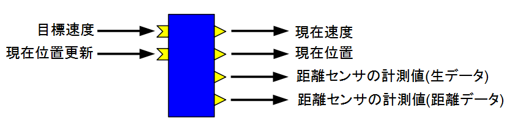

<!-- Title: シミュレーター利用方法 -->
#contents

このページでは Rapberry Pi マウスのシミュレーターRTC の仕様、利用方法について説明します。

# 仕様

<table class="table-alt">
  <tr>
    <th colspan="3" style="text-align: center;">RaspberryPiMouseSimulator</th>
  </tr>
  <tr>
    <td colspan="3" style="text-align: center;">InPort</td>
  </tr>
  <tr>
    <td>名前</td>
    <td>データ型</td>
    <td>説明</td>
  </tr>
  <tr>
    <td>target_velocity_in</td>
    <td>RTC::TimedVelocity2D</td>
    <td>目標速度</td>
  </tr>
  <tr>
    <td>pose_update</td>
    <td>RTC::TimedPose2D</td>
    <td>現在位置の更新</td>
  </tr>
  <tr>
    <td colspan="3" style="text-align: center;">OutPort</td>
  </tr>
  <tr>
    <td>名前</td>
    <td>データ型</td>
    <td>説明</td>
  </tr>
  <tr>
    <td>current_velocity_out</td>
    <td>RTC::TimedVelocity2D</td>
    <td>現在の速度</td>
  </tr>
  <tr>
    <td>current_pose_out</td>
    <td>RTC::TimedPose2D</td>
    <td>現在位置</td>
  </tr>
  <tr>
    <td>ir_sensor_out</td>
    <td>RTC::TimedShortSeq</td>
    <td>距離センサーから取得したデータを再現した値</td>
  </tr>
  <tr>
    <td>ir_sensor_metre_out</td>
    <td>RTC::TimedDoubleSeq</td>
    <td>距離センサーで計測した距離</td>
  </tr>
  <tr>
    <td colspan="3" style="text-align: center;">コンフィギュレーションパラメーター</td>
  </tr>
  <tr>
    <td>名前</td>
    <td>デフォルト値</td>
    <td>説明</td>
  </tr>
  <tr>
    <td>sampling_time</td>
    <td>-1</td>
    <td>シミュレーションの刻み幅。負の値に設定した場合は実行コンテキストの周期で設定</td>
  </tr>
  <tr>
    <td>draw_time</td>
    <td>0.01</td>
    <td>描画の周期</td>
  </tr>
  <tr>
    <td>sensor_param</td>
    <td>1394,792,525,373,299,260,222,181,135,100,81,36,17,16</td>
    <td>距離センサーのデータを生データに変換するパラメーター。0.01、0.02、0.03、0.04、0.05、0.06、0.07、0.08、0.09、0.10、0.15、0.20、0.25、0.30[m]に対応した値を設定</td>
  </tr>
  <tr>
    <td>blocksConfigFile</td>
    <td>None</td>
    <td>障害物の配置設定ファイルの名前</td>
  </tr>
</table>

# 使用方法

以下からダウンロードできます。

- [ZIPファイル](https://github.com/Nobu19800/RasPiMouseSimulatorRTC/archive/master.zip)

**RTミドルウェア講習会で使用するシミュレータは設定が異なっているため、講習会のページからダウンロードしてください。**

展開したフォルダーの EXEフォルダー内に実行ファイル(RaspberryPiMouseSimulatorComp.exe)があります。
この EXEファイルを実行すると RTC が起動します。

## データポート
### 距離センサーのデータ出力
ir_sensor_out、ir_sensor_metre_out と距離センサーのデータ出力を行うポートが2つありますが、RaspberryPiMouseRTC が距離センサーのデータを直接出力するようになっているため、ir_sensor_out ではシミュレーター上で計測した距離からセンサーのデータを再現して出力するようになっています。
ir_sensor_metre_out はメートル単位で距離を出力します。

## コンフィギュレーションパラメーター
### 障害物の設定ファイル
blocksConfigFile というパラメーターで障害物の配置を設定する CSVファイルを指定できます。
サンプルとして test.csv というファイルを用意してあります。

このファイルに位置、角度、サイズを記述してください。

<table class="table-alt">
  <tr>
    <th>位置(X)</th>
    <th>位置(Y)</th>
    <th>位置(Z)</th>
    <th>長さ(L)</th>
    <th>幅(W)</th>
    <th>高さ(H)</th>
    <th>角度(θ)</th>
  </tr>
  <tr>
    <td>0.3</td>
    <td>0.0</td>
    <td>0.0</td>
    <td>0.1</td>
    <td>1.0</td>
    <td>0.3</td>
    <td>0.0</td>
  </tr>
</table>

ブロックは何個でも設定可能です。

