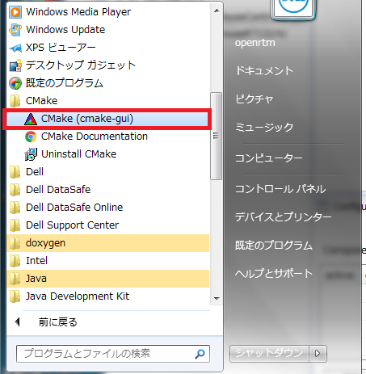
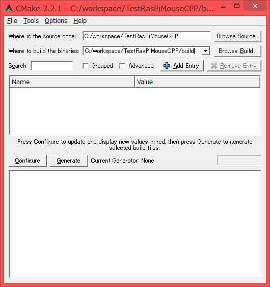
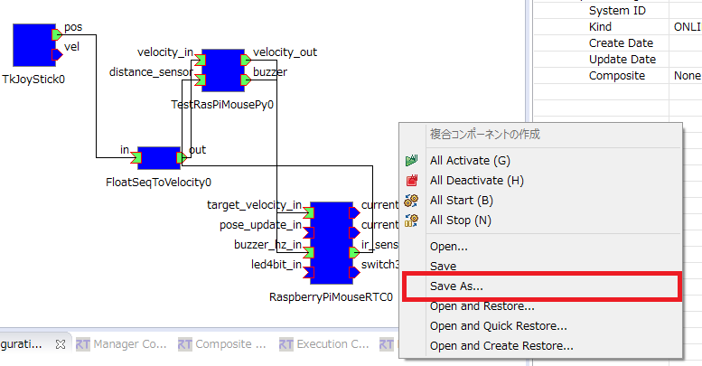
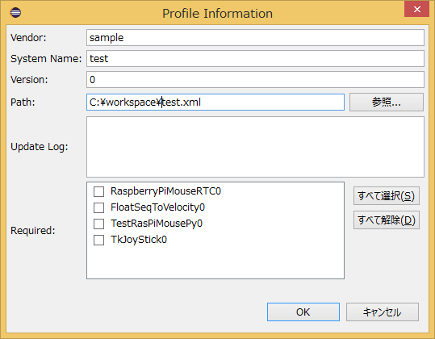
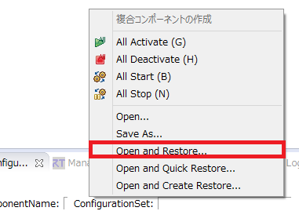
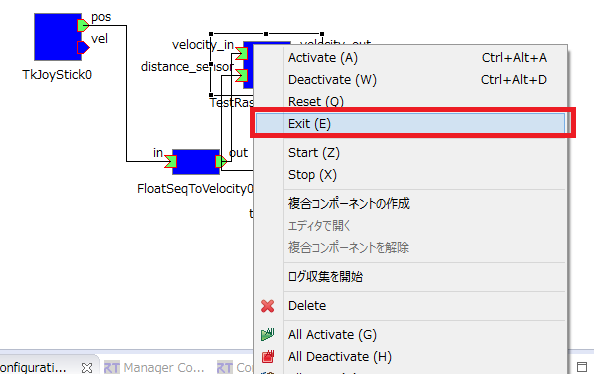

-------jp page!!-------

<!-- Title: チュートリアル(Raspberry Pi Mouse) -->
#contents

このページでは RTM講習会での Raspberry Pi Mouse 操作手順を説明します。

<div align="center"><a href="s_DSC00444.JPG"></a></div>

Raspberry Pi Mouse (以下ラズパイマウス)はアールティが販売している二輪方式の移動ロボットです。 Raspberry Pi を搭載しているため Linux(Raspbian) 等での開発が可能です。

## 仕様

<table class="table-alt">
  <tr>
    <th colspan="2" style="text-align: center;">ラズパイマウスの仕様</th>
  </tr>
  <tr>
    <td>CPU</td>
    <td>Raspberry Pi 2 Model B</td>
  </tr>
  <tr>
    <td>モーター</td>
    <td>ステッピングモーターST-42BYG020 2個</td>
  </tr>
  <tr>
    <td>モータードライバ</td>
    <td>SLA7070MRPT 2個</td>
  </tr>
  <tr>
    <td>距離センサー</td>
    <td>赤色LED+フォトトランジスタ(ST-1K3) 4個</td>
  </tr>
  <tr>
    <td>モニター用赤色LED</td>
    <td>4個</td>
  </tr>
  <tr>
    <td>ブザー</td>
    <td>1個</td>
  </tr>
  <tr>
    <td>スイッチ</td>
    <td>3個</td>
  </tr>
  <tr>
    <td>バッテリー</td>
    <td>LiPo3セル(11.1V)1000mAh 1個</td>
  </tr>
</table>


## ダウンロード

最初に PC側で使用する RTC 等をダウンロードしてください。

<!-- - [[robomech2016_tutorial.zip>https://github.com/Nobu19800/robomech2016_tutorial/archive/master.zip]] -->
<!-- - [[openrtm_tutorial.zip>https://github.com/Nobu19800/openrtm_tutorial/archive/master.zip]] -->
- [robomech2017_tutorial.zip](https://github.com/Nobu19800/robomech2017_tutorial/archive/master.zip)

ZIPファイルを [Lhaplus](http://www.vector.co.jp/soft/win95/util/se169348.html) 等で展開してください。

## 電源の入れ方/切り方

### 電源の入れ方

内側のスイッチが Raspberry Pi の電源スイッチです。
このスイッチをオンにすると電源が投入できます。

<br>

<div align="center"><a href="rpm9_raspi.png"></a></div>
<br>

### 電源の切り方

電源を切る場合は真ん中のスイッチを1秒ほど押すと OS がシャットダウンするため、その後にスイッチを切ってください。
<br>

※スイッチを直接切るのはデータの破損などの危険があるため絶対にやらないでください。

<br>

<div align="center"><a href="rpm8.png"></a></div>
<br>


## Raspberry Pi への接続

Raspberry Pi へは<span style="color:red;">原則として無線LANで接続するようにしてください</span>;。


### 無線LANアクセスポイントへの接続

まずは無線LANアダプタを取り付けた状態で Raspberry Pi Mouse の電源スイッチをオンにしてください。


しばらくすると無線LANアクセスポイントが起動するので、指定の SSID のアクセスポイントに接続してください。

SSID、パスワードは Rasoberry Pi マウスに貼り付けたシールに記載してあります。


アクセスポイントへの接続方法は以下のページを参考にしてください。

- [Windows 7で無線LANに接続する方法](http://121ware.com/qasearch/1007/app/servlet/qadoc?QID=011120)
- [Windows 8 / 8.1で無線LANに接続する方法](http://121ware.com/qasearch/1007/app/servlet/relatedqa?QID=014183)


まず右下のネットワークアイコンをクリックしてください。

<br>

<div align="center"><a href="tu_ev3_14.png"></a></div>
<br>

次に一覧から raspberrypi_*** を選択してください。


<br>

<div align="center"><a href="tu_ev3_15.png"></a></div>
<br>


パスワードを入力してください。

<br>

<div align="center"><a href="tu_ev3_12.png"></a></div>
<br>

### LANケーブルでの接続
<span style="color:red;">以下の作業は有線で接続する場合の作業なので、無線で接続する場合は不要です。</span>;

まず最初にLANケーブルで PC と Raspberry Pi を接続してください。

<br>

<div align="center"><a href="s_DSC00465.JPG"></a></div>
<br>

次に Raspberry Pi Mouse の電源スイッチをオンにしてください。
<br>


## 事前準備

[このページ]({{ site.baseurl }}/ja/doc/installation/install_1_1/cpp_1_1/install_windows_1_1/quick_start_1_1_2#toc1) の手順に従ってネームサーバー、RTシステムエディタを起動してください。
予めネームサーバーを起動してある場合は再起動してください。


またネットワークインターフェースが2つ以上ある場合に通信に失敗する可能性があるため、有線で接続した場合は他のネットワークデバイスを無効にしてからネームサーバーを起動してください。

<br>

<div align="center"><a href="tu_ev3_16.png"></a></div>
<br>


<br>

<div align="center"><a href="raspi_tu25.png"></a></div>
<br>


### ネームサーバー追加


続いて RTシステムエディタの [ネームサーバー追加] ボタンをクリックして <span style="color:red;">192.168.11.1</span>; を追加してください。


<br>

<div align="center"><div align="center"><a href="tutorial_raspimouse0.png"></a></div>;  <div align="center"><a href="tutorial_raspimouse1.png"></a></div>;</div>
<br>
<br>

すると以下の2つの RTC が起動します。

<div align="center"><a href="tutorial_raspimouse2.png"></a></div>

- [RaspberryPiMouseRTC]({{ site.baseurl }}/ja/doc/casestudy/raspberrypi_mouse/raspimouse_rtc_on_raspbian#toc0)
- [RaspberryPiMouseController_DistanceSensor]({{ site.baseurl }}/ja/doc/casestudy/raspberrypi_mouse/raspimouse_rtc_on_raspbian#toc1)

RaspberryPiMouseRTC は名城大学のロボットシステムデザイン研究室で開発されているラズパイマウス制御用の RTコンポーネントです。

<br>

<div align="center"><a href="tutorial_raspimouse18.png"></a></div>
<br>


<table class="table-alt">
  <tr>
    <th colspan="3" style="text-align: center;">RaspberryPiMouseRTC</th>
  </tr>
  <tr>
    <td colspan="3" style="text-align: center;">InPort</td>
  </tr>
  <tr>
    <td>名前</td>
    <td>データ型</td>
    <td>説明</td>
  </tr>
  <tr>
    <td>target_velocity_in</td>
    <td>RTC::TimedVelocity2D</td>
    <td>目標速度</td>
  </tr>
  <tr>
    <td>pose_update_in</td>
    <td>RTC::TimedPose2D</td>
    <td>位置設定</td>
  </tr>
  <tr>
    <td>buzzer_hz_in</td>
    <td>RTC::TimedShort</td>
    <td>ブザー</td>
  </tr>
  <tr>
    <td>led4bit_in</td>
    <td>RTC::TimedBooleanSeq</td>
    <td>LED</td>
  </tr>
  <tr>
    <td colspan="3" style="text-align: center;">OutPort</td>
  </tr>
  <tr>
    <td>名前</td>
    <td>データ型</td>
    <td>説明</td>
  </tr>
  <tr>
    <td>current_velocity_out</td>
    <td>RTC::TimedVelocity2D</td>
    <td>現在の速度</td>
  </tr>
  <tr>
    <td>current_pose_out</td>
    <td>RTC::TimedPose2D</td>
    <td>現在位置</td>
  </tr>
  <tr>
    <td>ir_sensor_out</td>
    <td>RTC::TimedShortSeq</td>
    <td>距離センサーの計測値</td>
  </tr>
  <tr>
    <td>switch3bit_out</td>
    <td>RTC::TimedBooleanSeq</td>
    <td>スイッチのオンオフ</td>
  </tr>
</table>


#### TimedVelocity2D 型について

TimedVelocity2D 型は以下のように定義されています。

```
     struct Velocity2D
     {
         double vx;
         double vy;
         double va;
     };
```

```
     struct TimedVelocity2D
     {
         Time tm;
         Velocity2D data;
     };
```

vx、vy、va はロボット中心座標系での速度を表しています。

<br>

<div align="center"><a href="tu_ev3_20.png"></a></div>
<br>

vx は X方向の速度、vy は Y方向の速度、va は Z軸周りの角速度です。


ラズパイマウスのように2個の車輪が左右に取り付けられているロボットの場合、横滑りしないと仮定すると vy は 0 になります。

vx、va を指定することでロボットの操作を行います。


### サンプルコンポーネント起動

付属資料の<span style="color:red;">start_component_raspimouse.bat</span>;を起動してください。
※OpenRTM-aist Python版をインストールしていない場合、もしくはインストールに失敗している場合は個別に実行ファイル入りの USBメモリーを配布しますので、<span style="color:red;">start_component_raspimouse_exe.bat</span>;を利用してください。

すると以下の2つの RTC が起動します。

<div align="center"><a href="tutorial_raspimouse3_2.png"></a></div>

- [FloatSeqToVelocity]({{ site.baseurl }}/ja/doc/casestudy/lego_mindstorm/lego_sample_rts_exec#toc2)
<!-- - [[RaspberryPiMouseGUI>/ja/node/6016#toc1]] -->
- [TkJoyStick]({{ site.baseurl }}/ja/doc/installation/sample_components/tkjoystick_mobilerobotsimulator#toc0)

## 動作確認

まずはジョイスティックでラズパイマウスを操作してみます。

動作の前にモーター電源スイッチをオンにしておいてください。動作確認が終了したら、モーター電源はオフにするようにしてください。

<div align="center"><a href="rpm10_raspi.png"></a></div>


RTシステムエディタで RaspberryPiMouseRTC、FloatSeqToVelocity、TkJoyStick を以下のように接続します。

<div align="center"><a href="tutorial_raspimouse4.png"></a></div>

そして RTC をアクティブ化するとジョイスティックでラズパイマウスの操作ができるようになります。

<div align="center"><a href="tutorial_raspimouse6.png"></a></div>

<div align="center"><a href="tutorial_raspimouse5.png"></a></div>

## 自作の RTC で制御

まずは FloatSeqToVelocity の out と RaspberryPiMouseRTC の target_velocity_in のコネクタを切断してください。

<div align="center"><a href="tutorial_raspimouse7.png"></a></div>

FloatSeqToVelocity と RaspberryPiMouseRTC の間に自作の RTC を接続して、距離センサーの値が一定以上になった場合に停止して音を鳴らすようにします。

### ひな形コードの作成

RTC ビルダを起動してください。

<br>

<div align="center"><a href="tutorial_raspimouse8.png"></a></div>
<br>

起動したら新規にプロジェクトを作成します。

<br>

<div align="center"><a href="tutorial_raspimouse9.png"></a></div>
<br>

プロジェクト名は TestRasPiMouseCPP(TestRasPiMousePy) にします。

以下のように設定を行ってください。
C++、もしくは Python で作成します。

<table class="table-alt">
  <tr>
    <th colspan="3" style="text-align: center;">基本</th>
  </tr>
  <tr>
    <td>モジュール名</td>
    <td colspan="2" style="text-align;">TestRasPiMouseCPP、もしくはTestRasPiMousePy</td>
  </tr>
  <tr>
    <td colspan="3" style="text-align: center;">アクティビティ</td>
  </tr>
  <tr>
    <td>有効アクション</td>
    <td colspan="2" style="text-align;">onInitialize、onExecute、onActivated、onDeactivated</td>
  </tr>
  <tr>
    <td colspan="3" style="text-align: center;">データポート</td>
  </tr>
  <tr>
    <td colspan="3" style="text-align;">InPort</td>
  </tr>
  <tr>
    <td>名前</td>
    <td>データ型</td>
    <td>説明</td>
  </tr>
  <tr>
    <td>velocity_in</td>
    <td>RTC::TimedVelocity2D</td>
    <td>入力目標速度</td>
  </tr>
  <tr>
    <td>distance_sensor</td>
    <td>RTC::TimedShortSeq</td>
    <td>距離センサーの計測値</td>
  </tr>
  <tr>
    <td colspan="3" style="text-align: center;">OutPort</td>
  </tr>
  <tr>
    <td>名前</td>
    <td>データ型</td>
    <td>説明</td>
  </tr>
  <tr>
    <td>velocity_out</td>
    <td>RTC::TimedVelocity2D</td>
    <td>出力目標速度</td>
  </tr>
  <tr>
    <td>buzzer</td>
    <td>RTC::TimedShort</td>
    <td>ブザー</td>
  </tr>
  <tr>
    <td colspan="3" style="text-align: center;">コンフィギュレーション</td>
  </tr>
  <tr>
    <td>名前</td>
    <td>型</td>
    <td>説明</td>
  </tr>
  <tr>
    <td>stop_distance</td>
    <td>short</td>
    <td>距離センサーで物体を検知した場合に前進しなくなる距離センサーの計測値、デフォルト値は300</td>
  </tr>
  <tr>
    <td colspan="3" style="text-align: center;">言語・環境</td>
  </tr>
  <tr>
    <td>言語</td>
    <td colspan="2" style="text-align;">C++、もしくはPython</td>
  </tr>
</table>

[コード生成] ボタンをクリックするとコードが生成されます。

<div align="center"><a href="tutorial_raspimouse10.png"></a></div>


#### 距離センサー

ラズパイマウスの距離センサーは近ければ近いほど大きな値を出力します。

参考までにですが、/dev/rtlightsensor0のデバイスファイルから取得できる数値とセンサーまでの距離との関係は以下のようになっています。

<br>

<div align="center"><a href="rpm14_graph.png"></a></div>
<br>

<table class="table-alt">
  <tr>
    <th>デバイスファイルから取得した数値</th>
    <th>実際の距離[m]</th>
  </tr>
  <tr>
    <td>1394</td>
    <td>0.01</td>
  </tr>
  <tr>
    <td>792</td>
    <td>0.02</td>
  </tr>
  <tr>
    <td>525</td>
    <td>0.03</td>
  </tr>
  <tr>
    <td>373</td>
    <td>0.04</td>
  </tr>
  <tr>
    <td>299</td>
    <td>0.05</td>
  </tr>
  <tr>
    <td>260</td>
    <td>0.06</td>
  </tr>
  <tr>
    <td>222</td>
    <td>0.07</td>
  </tr>
  <tr>
    <td>181</td>
    <td>0.08</td>
  </tr>
  <tr>
    <td>135</td>
    <td>0.09</td>
  </tr>
  <tr>
    <td>100</td>
    <td>0.10</td>
  </tr>
  <tr>
    <td>81</td>
    <td>0.15</td>
  </tr>
  <tr>
    <td>36</td>
    <td>0.20</td>
  </tr>
  <tr>
    <td>17</td>
    <td>0.25</td>
  </tr>
  <tr>
    <td>16</td>
    <td>0.30</td>
  </tr>
</table>


### プロジェクト生成

コードが生成できたら C++ の場合は CMake で Visual Studio のプロジェクト(Ubuntu の場合は Code::Blocks)を生成してください。

- [Windows]({{ site.baseurl }}/ja/doc/toolmanuals/rtcbuilder-1_1_0/compile_win_cmake_cpp_rtcb_1_1_0)
- [Ubuntu]({{ site.baseurl }}/ja/content/build_ubuntu_codeblocks)

まずCMake (cmake-gui) を起動します。

- Windows 7

<br>

<div align="center"><a href="tu_ev3_10.png"></a></div>
<br>

- Windows 8.1

<br>

<div align="center"><a href="tutorial_raspimouse12.png"></a></div>
<br>

起動したらソースコードのディレクトリー、ビルドを行うディレクトリーに以下を指定します。
括弧内は eclipse の作業ディレクトリーをC:\workspaceにした場合の例です。

<table class="table-alt">
  <tr>
    <td>Where is the source code</td>
    <td>RTCBuilder で生成したコードのフォルダー(C:\workspace\TestRasPiMouseCPP)</td>
  </tr>
  <tr>
    <td>Where to build the binaries</td>
    <td>RTCBuilder で生成したコードのフォルダーの下に作成した build フォルダー(C:\workspace\TestRasPiMouseCPP\build)</td>
  </tr>
</table>

<br>

<div align="center"><a href="raspi_tu26.png"></a></div>
<br>

[Configure] ボタン → [Generate] ボタンをクリックすると **Visual Studio** のプロジェクトが生成されます。

### ソースコードの編集

build ディレクトリーの TestRasPiMouseCPP.sln を開いてください。

次にコードの編集を行います。

**Python** の場合はまず変数の初期化部分を修正してください。

- TestRasPiMousePy.py


```
 	def __init__(self, manager):
 		#self._d_velocity_in = RTC.TimedVelocity2D(*velocity_in_arg)
 		self._d_velocity_in = RTC.TimedVelocity2D(RTC.Time(0,0),RTC.Velocity2D(0,0,0))
```

```
 		#self._d_distance_sensor = RTC.TimedShortSeq(*distance_sensor_arg)
 		self._d_distance_sensor = RTC.TimedShortSeq(RTC.Time(0,0),[])
```

```
 		#self._d_velocity_out = RTC.TimedVelocity2D(*velocity_out_arg)
 		self._d_velocity_out = RTC.TimedVelocity2D(RTC.Time(0,0),RTC.Velocity2D(0,0,0))
```

```
 		#self._d_buzzer = RTC.TimedShort(*buzzer_arg)
 		self._d_buzzer = RTC.TimedShort(RTC.Time(0,0),0)
```


まずは onExecute で入力速度をそのまま出力するコードを書いてみます。
<br>

**C++**の場合は以下のようになります。
<br>

isNew 関数で新規の入力データが存在するかを確認して、read 関数で変数(m_velocity_in)に格納します。
そして m_velocity_out に出力データを格納してwrite 関数を呼び出すとデータが送信されます。


- src/TestRaspiMouseCPP.cpp

```
 	if (m_velocity_inIn.isNew())
 	{
 		m_velocity_inIn.read();
 		//入力速度をそのまま出力
 		m_velocity_out.data.vx = m_velocity_in.data.vx;
 		m_velocity_out.data.vy = m_velocity_in.data.vy;
 		m_velocity_out.data.va = m_velocity_in.data.va;
 		setTimestamp(m_velocity_out);
 		m_velocity_outOut.write();
 
 
 	}
```


**Python**の場合は以下のようになります。

- TestRasPiMousePy.py

```
 		if self._velocity_inIn.isNew():
 			data = self._velocity_inIn.read()
 			#入力速度をそのまま出力する
 			self._d_velocity_out.data.vx = data.data.vx
 			self._d_velocity_out.data.vy = data.data.vy
 			self._d_velocity_out.data.va = data.data.va
 			OpenRTM_aist.setTimestamp(self._d_velocity_out)
 			self._velocity_outOut.write()
```


次に距離センサーの計測値が一定以上の場合に停止する処理を記述します。
<br>

常に距離センサーのデータが入力されるとは限らないので、センサーのデータを格納する変数を宣言します。

<br>

**C++**の場合は TestRasPiMouseCPP.h に記述します。

- include/TestRasPiMouseCPP/TestRasPiMouseCPP.h

```
  private:
 	 int m_last_sensor_data[4];
```


**Python**の場合はコンストラクタに記述します。

- TestRasPiMousePy.py

```
 	def __init__(self, manager):
 		OpenRTM_aist.DataFlowComponentBase.__init__(self, manager)
 
 		self._last_sensor_data = [0, 0, 0, 0]
```


次に onExecute に停止する処理を記述します。
<br>

**C++**の場合は以下のようになっています。
<br>

まずインポート distance_sensor に isNew 関数で新規にデータが入力されたかを確認して、入力されている場合は read 関数で読み込みます。そして変数 m_last_sensor_data に格納します。
<br>

そしてインポート velocity_in で受信したデータの vx が0以上の場合には前進しているため障害物に接触するかもしれないと判定して、距離センサーの値が一定以上の場合は停止してブザーを鳴らします。


- src/TestRaspiMouseCPP.cpp

```
 RTC::ReturnCode_t TestRasPiMouseCPP::onExecute(RTC::UniqueId ec_id)
 {
 	//データを新規に受信した場合に、データを m_last_sensor_data を格納する
 	if (m_distance_sensorIn.isNew())
 	{
 		m_distance_sensorIn.read();
 		if (m_distance_sensor.data.length() == 4)
 		{
 			for (int i = 0; i < 4; i++)
 			{
 				m_last_sensor_data[i] = m_distance_sensor.data[i];
 			}
 		}
 	}
 
 	if (m_velocity_inIn.isNew())
 	{
 		m_velocity_inIn.read();
 		//vxが0以上(前進)のときのみ停止するか判定する
 		if (m_velocity_in.data.vx > 0)
 		{
 			for (int i = 0; i < 4; i++)
 			{
 				//センサーの計測値がstop_distance以上の時に前進しないようにする
 				if (m_last_sensor_data[i] > m_stop_distance)
 				{
 					//停止する
 					m_velocity_out.data.vx = 0;
 					m_velocity_out.data.vy = 0;
 					m_velocity_out.data.va = 0;
 					setTimestamp(m_velocity_out);
 					m_velocity_outOut.write();
 					
 					//ブザーを鳴らす
 					m_buzzer.data = 50;
 					setTimestamp(m_buzzer);
 					m_buzzerOut.write();
 
 					return RTC::RTC_OK;
 				}
 			}
 		}
 		//ブザーを止める
 		m_buzzer.data = 0;
 		setTimestamp(m_buzzer);
 		m_buzzerOut.write();
 
 		//入力速度をそのまま出力
 		m_velocity_out.data.vx = m_velocity_in.data.vx;
 		m_velocity_out.data.vy = m_velocity_in.data.vy;
 		m_velocity_out.data.va = m_velocity_in.data.va;
 		setTimestamp(m_velocity_out);
 		m_velocity_outOut.write();
  	}
 	
   return RTC::RTC_OK;
 }
```

**Python**の場合は以下のようになっています。

- TestRasPiMousePy.py

```
 	def onExecute(self, ec_id):
 		#データを新規に受信した場合に、データをm_last_sensor_dataを格納する
 		if self._distance_sensorIn.isNew():
 			data = self._distance_sensorIn.read()
 			if len(data.data) == 4:
 				self._last_sensor_data = data.data[:]
 
 
 		
 		if self._velocity_inIn.isNew():
 			data = self._velocity_inIn.read()
 			#vxが0以上(前進)のときのみ停止するか判定する
 			if data.data.vx > 0:
 				for d in self._last_sensor_data:
 					#センサーの計測値がstop_distance以上の時に前進しないようにする
 					if d > self._stop_distance[0]:
 						#停止する
 						self._d_velocity_out.data.vx = 0
 						self._d_velocity_out.data.vy = 0
 						self._d_velocity_out.data.va = 0
 						OpenRTM_aist.setTimestamp(self._d_velocity_out)
 						self._velocity_outOut.write()
 
 						#ブザーを鳴らす
 						self._d_buzzer.data = 50
 						OpenRTM_aist.setTimestamp(self._d_buzzer)
 						self._buzzerOut.write()
 						
 						return RTC.RTC_OK
 
 			#ブザーを止める
 			self._d_buzzer.data = 0
 			OpenRTM_aist.setTimestamp(self._d_buzzer)
 			self._buzzerOut.write()
 
 			#入力速度をそのまま出力する
 			self._d_velocity_out.data.vx = data.data.vx
 			self._d_velocity_out.data.vy = data.data.vy
 			self._d_velocity_out.data.va = data.data.va
 			OpenRTM_aist.setTimestamp(self._d_velocity_out)
 			self._velocity_outOut.write()
 
 		return RTC.RTC_OK
```

コードの編集が終わったら C++ の場合はビルドしてください。
<br>

ビルドに成功すると build\src\Release(Debug) に TestRasPiMouseCPPComp.exe が生成されます。

### 動作確認
TestRasPiMouseCPPComp.exe (TestRasPiMouseCPPComp.py) をダブルクリックして起動してください。
<br>

TestRaspiMouseCPP (TestRaspiMousePy) を以下のように接続してください。

<div align="center"><a href="tutorial_raspimouse11.png"></a></div>


最後に RTC をアクティブ化して動作確認してください。

### RTシステム保存

RTシステムを保存する場合は System Diagram 上で右クリックして [Save As...] を選択してください。

<br>

<div align="center"><a href="tutorial_raspimouse15.png"></a></div>
<br>

<div align="center"><a href="tutorial_raspimouse14.png"></a></div>
<br>

### RTシステム復元

復元する場合は [Open and Restore] を選択して、先ほど保存したファイルを選択してください。

<br>

<div align="center"><a href="raspi_tu28.png"></a></div>
<br>

### RTC 終了

RTC を終了する場合はRTシステムエディタ上で RTC を [exit] してください。

<br>

<div align="center"><a href="tutorial_raspimouse16.png"></a></div>
<br>
-------jp page!!-------
