<!-- Title: Tutorial (Raspberry Pi Mouse) -->
#contents

This page explains the Raspberry Pi Mouse operating procedures used in RTM training workshops. :contentReference[oaicite:0]{index=0}

<div align="center"><a href="s_DSC00444.JPG"></a></div>

Raspberry Pi Mouse (hereafter referred to as "RasPiMouse") is a two-wheeled mobile robot sold by RT Corporation. Since it is equipped with a Raspberry Pi, development can be performed using Linux (Raspbian) and other environments. :contentReference[oaicite:1]{index=1}

## Specifications

<table class="table-alt">
  <tr>
    <th colspan="2" style="text-align: center;">Raspberry Pi Mouse Specifications</th>
  </tr>
  <tr>
    <td>CPU</td>
    <td>Raspberry Pi 2 Model B</td>
  </tr>
  <tr>
    <td>Motor</td>
    <td>Two ST-42BYG020 stepping motors</td>
  </tr>
  <tr>
    <td>Motor Driver</td>
    <td>Two SLA7070MRPT units</td>
  </tr>
  <tr>
    <td>Distance Sensor</td>
    <td>Four red LEDs + phototransistors (ST-1K3)</td>
  </tr>
  <tr>
    <td>Red LEDs for Monitoring</td>
    <td>4</td>
  </tr>
  <tr>
    <td>Buzzer</td>
    <td>1</td>
  </tr>
  <tr>
    <td>Switch</td>
    <td>3</td>
  </tr>
  <tr>
    <td>Battery</td>
    <td>One LiPo 3-cell (11.1V) 1000mAh battery</td>
  </tr>
</table>

## Download

First, download the RTCs and related software used on the PC side.

<!-- - [[robomech2016_tutorial.zip>https://github.com/Nobu19800/robomech2016_tutorial/archive/master.zip]] -->
<!-- - [[openrtm_tutorial.zip>https://github.com/Nobu19800/openrtm_tutorial/archive/master.zip]] -->
- [robomech2017_tutorial.zip](https://github.com/Nobu19800/robomech2017_tutorial/archive/master.zip)

Extract the ZIP file using [Lhaplus](http://www.vector.co.jp/soft/win95/util/se169348.html) or a similar archive extraction tool.

## Powering On and Off

### Powering On

The inner switch is the Raspberry Pi power switch.

Turning this switch on powers up the system.

<br>

<div align="center"><a href="rpm9_raspi.png"></a></div>
<br>

### Powering Off

To shut down the system, press and hold the center switch for approximately one second. The operating system will shut down, after which you can turn off the power switch.

<br>

*Never turn off the power switch directly, as doing so may cause data corruption or other issues.*

<br>

<div align="center"><a href="rpm8.png"></a></div>
<br>

## Connecting to the Raspberry Pi

<span style="color:red;">As a general rule, connect to the Raspberry Pi via wireless LAN.</span>

### Connecting to a Wireless LAN Access Point

First, turn on the Raspberry Pi Mouse with the wireless LAN adapter attached.

After a short time, a wireless LAN access point will start.

Connect to the access point with the specified SSID.

The SSID and password are printed on the label attached to the Raspberry Pi Mouse.

For instructions on connecting to a wireless LAN access point, refer to the following pages:

- [How to Connect to Wireless LAN in Windows 7](http://121ware.com/qasearch/1007/app/servlet/qadoc?QID=011120)
- [How to Connect to Wireless LAN in Windows 8 / 8.1](http://121ware.com/qasearch/1007/app/servlet/relatedqa?QID=014183)

First, click the network icon in the lower-right corner.

<br>

<div align="center"><a href="tu_ev3_14.png"></a></div>
<br>

Next, select **raspberrypi_*** from the list.

<br>

<div align="center"><a href="tu_ev3_15.png"></a></div>
<br>

Enter the password.

<br>

<div align="center"><a href="tu_ev3_12.png"></a></div>
<br>

### Connecting via LAN Cable

<span style="color:red;">The following steps are only required when connecting via a wired LAN. They are unnecessary when using a wireless connection.</span>

First, connect the PC and Raspberry Pi using a LAN cable.

<br>

<div align="center"><a href="s_DSC00465.JPG">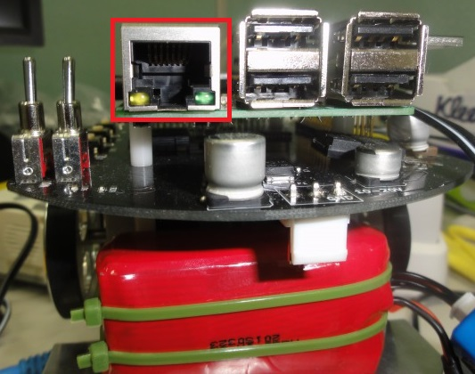</a></div>
<br>

Next, turn on the Raspberry Pi Mouse power switch.

<br>

## Preparation

Follow the instructions on [this page]({{ site.baseurl }}/en/doc/installation/install_1_1/cpp_1_1/install_windows_1_1/quick_start_1_1_2#toc1) to start the Name Server and RT System Editor.

If a Name Server is already running, restart it.

Also, if your PC has two or more network interfaces, communication may fail. If you are using a wired connection, disable the other network devices before starting the Name Server.

<br>

<div align="center"><a href="tu_ev3_16.png">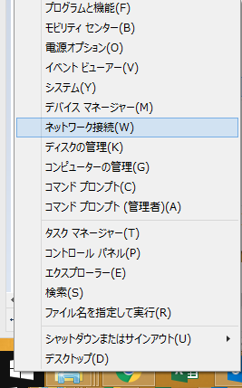</a></div>
<br>

<div align="center"><a href="raspi_tu25.png"></a></div>
<br>

### Adding a Name Server

Next, click the **Add Name Server** button in RT System Editor and add <span style="color:red;">192.168.11.1</span>.

<br>

<div align="center"><div align="center"><a href="tutorial_raspimouse0.png"></a></div>;  <div align="center"><a href="tutorial_raspimouse1.png"></a></div>;</div>

<br>
<br>

The following two RTCs will appear:

<div align="center"><a href="tutorial_raspimouse2.png">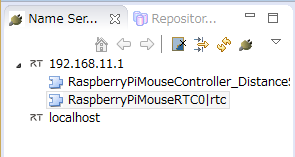</a></div>

- [RaspberryPiMouseRTC]({{ site.baseurl }}/en/doc/casestudy/raspberrypi_mouse/raspimouse_rtc_on_raspbian#toc0)
- [RaspberryPiMouseController_DistanceSensor]({{ site.baseurl }}/en/doc/casestudy/raspberrypi_mouse/raspimouse_rtc_on_raspbian#toc1)

RaspberryPiMouseRTC is an RT-Component for controlling Raspberry Pi Mouse, developed by the Robot System Design Laboratory at Meijo University.

<br>

<div align="center"><a href="tutorial_raspimouse18.png">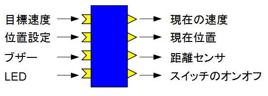</a></div>
<br>


<table class="table-alt">
  <tr>
    <th colspan="3" style="text-align: center;">RaspberryPiMouseRTC</th>
  </tr>
  <tr>
    <td colspan="3" style="text-align: center;">InPort</td>
  </tr>
  <tr>
    <td>Name</td>
    <td>Data Type</td>
    <td>Description</td>
  </tr>
  <tr>
    <td>target_velocity_in</td>
    <td>RTC::TimedVelocity2D</td>
    <td>Target velocity</td>
  </tr>
  <tr>
    <td>pose_update_in</td>
    <td>RTC::TimedPose2D</td>
    <td>Position setting</td>
  </tr>
  <tr>
    <td>buzzer_hz_in</td>
    <td>RTC::TimedShort</td>
    <td>Buzzer</td>
  </tr>
  <tr>
    <td>led4bit_in</td>
    <td>RTC::TimedBooleanSeq</td>
    <td>LEDs</td>
  </tr>
  <tr>
    <td colspan="3" style="text-align: center;">OutPort</td>
  </tr>
  <tr>
    <td>Name</td>
    <td>Data Type</td>
    <td>Description</td>
  </tr>
  <tr>
    <td>current_velocity_out</td>
    <td>RTC::TimedVelocity2D</td>
    <td>Current velocity</td>
  </tr>
  <tr>
    <td>current_pose_out</td>
    <td>RTC::TimedPose2D</td>
    <td>Current position</td>
  </tr>
  <tr>
    <td>ir_sensor_out</td>
    <td>RTC::TimedShortSeq</td>
    <td>Distance sensor measurements</td>
  </tr>
  <tr>
    <td>switch3bit_out</td>
    <td>RTC::TimedBooleanSeq</td>
    <td>Switch on/off status</td>
  </tr>
</table>

#### About the TimedVelocity2D Type

The `TimedVelocity2D` type is defined as follows.

```cpp
     struct Velocity2D
     {
         double vx;
         double vy;
         double va;
     };
```

```cpp
     struct TimedVelocity2D
     {
         Time tm;
         Velocity2D data;
     };
```

`vx`, `vy`, and `va` represent velocities in the robot-centered coordinate system.

<br>

<div align="center"><a href="tu_ev3_20.png"></a></div>
<br>

- `vx`: Velocity in the X direction
- `vy`: Velocity in the Y direction
- `va`: Angular velocity around the Z axis

For a robot such as Raspberry Pi Mouse, which has two wheels mounted on its left and right sides, `vy` is assumed to be 0 because sideways slipping is not considered.

The robot is controlled by specifying `vx` and `va`.

### Starting the Sample Components

Run **start_component_raspimouse.bat** included in the supplementary materials.

*If the Python version of OpenRTM-aist is not installed or the installation failed, a USB memory device containing standalone executable files will be distributed separately. In that case, use **start_component_raspimouse_exe.bat** instead.*

The following two RTCs will start:

<div align="center"><a href="tutorial_raspimouse3_2.png">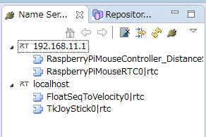</a></div>

- [FloatSeqToVelocity]({{ site.baseurl }}/en/doc/casestudy/lego_mindstorm/lego_sample_rts_exec#toc2)
<!-- - [[RaspberryPiMouseGUI>/ja/node/6016#toc1]] -->
- [TkJoyStick]({{ site.baseurl }}/en/doc/installation/sample_components/tkjoystick_mobilerobotsimulator#toc0)

## Operation Check

First, try operating the Raspberry Pi Mouse using the joystick.

Before operation, turn on the motor power switch.

After completing the operation check, be sure to turn the motor power off.

<div align="center"><a href="rpm10_raspi.png"></a></div>

In RT System Editor, connect `RaspberryPiMouseRTC`, `FloatSeqToVelocity`, and `TkJoyStick` as shown below.

<div align="center"><a href="tutorial_raspimouse4.png">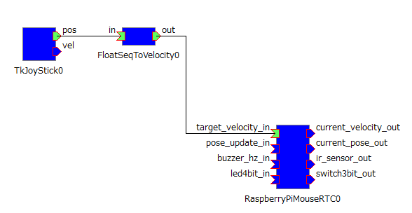</a></div>

After activating the RTCs, you will be able to operate the Raspberry Pi Mouse using the joystick.

<div align="center"><a href="tutorial_raspimouse6.png">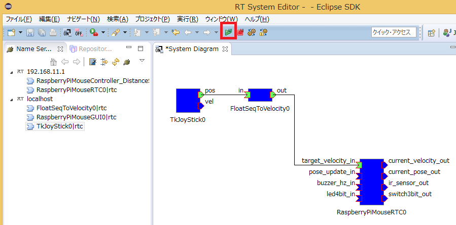</a></div>

<div align="center"><a href="tutorial_raspimouse5.png">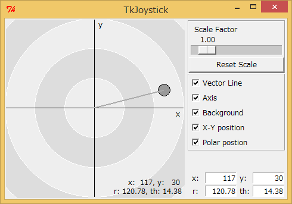</a></div>

## Control Using a Custom RTC

First, disconnect the connector between the `out` port of `FloatSeqToVelocity` and the `target_velocity_in` port of `RaspberryPiMouseRTC`.

<div align="center"><a href="tutorial_raspimouse7.png">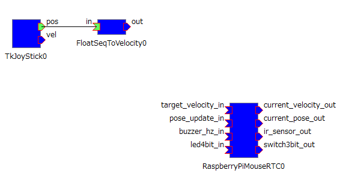</a></div>

Insert your custom RTC between `FloatSeqToVelocity` and `RaspberryPiMouseRTC` so that the robot stops and sounds a buzzer when the distance sensor value exceeds a specified threshold.

### Creating Skeleton Code

Start RTCBuilder.

<br>

<div align="center"><a href="tutorial_raspimouse8.png">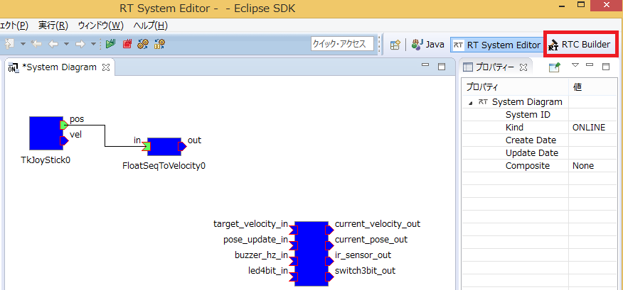</a></div>
<br>

After startup, create a new project.

<br>

<div align="center"><a href="tutorial_raspimouse9.png">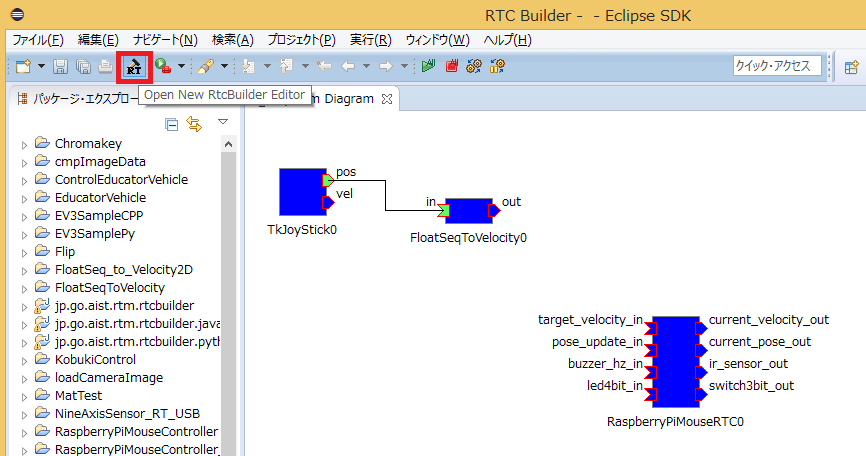</a></div>
<br>

Set the project name to **TestRasPiMouseCPP** (or **TestRasPiMousePy**).

Configure the project as shown below.

Create it in either C++ or Python.

<table class="table-alt">
  <tr>
    <th colspan="3" style="text-align: center;">Basic</th>
  </tr>
  <tr>
    <td>Module Name</td>
    <td colspan="2">TestRasPiMouseCPP or TestRasPiMousePy</td>
  </tr>
  <tr>
    <td colspan="3" style="text-align: center;">Activity</td>
  </tr>
  <tr>
    <td>Enabled Actions</td>
    <td colspan="2">onInitialize, onExecute, onActivated, onDeactivated</td>
  </tr>
  <tr>
    <td colspan="3" style="text-align: center;">Data Ports</td>
  </tr>
  <tr>
    <td colspan="3">InPort</td>
  </tr>
  <tr>
    <td>Name</td>
    <td>Data Type</td>
    <td>Description</td>
  </tr>
  <tr>
    <td>velocity_in</td>
    <td>RTC::TimedVelocity2D</td>
    <td>Input target velocity</td>
  </tr>
  <tr>
    <td>distance_sensor</td>
    <td>RTC::TimedShortSeq</td>
    <td>Distance sensor measurements</td>
  </tr>
  <tr>
    <td colspan="3">OutPort</td>
  </tr>
  <tr>
    <td>Name</td>
    <td>Data Type</td>
    <td>Description</td>
  </tr>
  <tr>
    <td>velocity_out</td>
    <td>RTC::TimedVelocity2D</td>
    <td>Output target velocity</td>
  </tr>
  <tr>
    <td>buzzer</td>
    <td>RTC::TimedShort</td>
    <td>Buzzer</td>
  </tr>
  <tr>
    <td colspan="3" style="text-align: center;">Configuration</td>
  </tr>
  <tr>
    <td>Name</td>
    <td>Type</td>
    <td>Description</td>
  </tr>
  <tr>
    <td>stop_distance</td>
    <td>short</td>
    <td>Distance sensor threshold above which forward motion is stopped when an object is detected. Default value: 300</td>
  </tr>
  <tr>
    <td colspan="3" style="text-align: center;">Language / Environment</td>
  </tr>
  <tr>
    <td>Language</td>
    <td colspan="2">C++ or Python</td>
  </tr>
</table>

Click the **[Generate Code]** button to generate the code.

<div align="center"><a href="tutorial_raspimouse10.png"></a></div>

### Creating the Processing Logic

#### C++

Open `TestRasPiMouseCPP.cpp` and add the following processing to `onExecute()`.

```cpp
RTC::ReturnCode_t TestRasPiMouseCPP::onExecute(RTC::UniqueId ec_id)
{
  if(m_distance_sensorIn.isNew())
  {
    m_distance_sensorIn.read();
  }

  if(m_velocity_inIn.isNew())
  {
    m_velocity_inIn.read();

    if(m_distance_sensor.data[0] > m_stop_distance ||
       m_distance_sensor.data[3] > m_stop_distance)
    {
      m_velocity_out.data.vx = 0;
      m_velocity_out.data.vy = 0;
      m_velocity_out.data.va = 0;

      m_buzzer.data = 1000;

      m_buzzerOut.write();
    }
    else
    {
      m_velocity_out = m_velocity_in;

      m_buzzer.data = 0;

      m_buzzerOut.write();
    }

    m_velocity_outOut.write();
  }

  return RTC::RTC_OK;
}
```

#### Python

Open `TestRasPiMousePy.py` and add the following processing to `onExecute()`.

```python
  def onExecute(self, ec_id):

    if self._distance_sensorIn.isNew():
      data = self._distance_sensorIn.read()

    if self._velocity_inIn.isNew():
      self._d_velocity_in = self._velocity_inIn.read()

      if self._d_distance_sensor.data[0] > self._stop_distance[0] or self._d_distance_sensor.data[3] > self._stop_distance[0]:
        self._d_velocity_out.data.vx = 0
        self._d_velocity_out.data.vy = 0
        self._d_velocity_out.data.va = 0

        self._d_buzzer.data = 1000

        OpenRTM_aist.setTimestamp(self._d_buzzer)
        self._buzzerOut.write()
      else:
        self._d_velocity_out = self._d_velocity_in

        self._d_buzzer.data = 0

        OpenRTM_aist.setTimestamp(self._d_buzzer)
        self._buzzerOut.write()

      OpenRTM_aist.setTimestamp(self._d_velocity_out)
      self._velocity_outOut.write()

    return RTC.RTC_OK
```

This RTC reads the distance sensor values and the target velocity.

If the sensor value exceeds the threshold specified by the `stop_distance` configuration parameter, the RTC stops the robot and sounds the buzzer.

Otherwise, it outputs the input target velocity unchanged.

### Building the RTC

#### C++

Open a command prompt and move to the generated project directory.

Execute the following commands:

```bash
cmake .
cmake --build . --config Release
```

If the build completes successfully, the executable will be generated.

#### Python

No build process is required.

### Starting the RTC

Launch the RTC you created.

#### C++

Execute:

```bash
Release\TestRasPiMouseCPPComp.exe
```

#### Python

Execute:

```bash
python TestRasPiMousePy.py
```

The RTC will be registered with the Name Server.

### Connecting the RTC

Connect the RTCs as shown below.

<div align="center"><a href="tutorial_raspimouse11.png">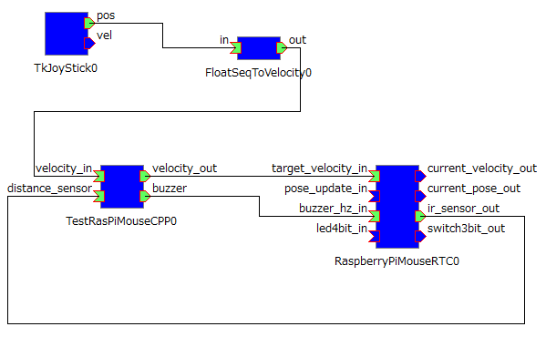</a></div>

Connection order:

```text
TkJoyStick
    ↓
FloatSeqToVelocity
    ↓
TestRasPiMouseCPP (or TestRasPiMousePy)
    ↓
RaspberryPiMouseRTC
```

In addition, connect the distance sensor output:

```text
RaspberryPiMouseRTC.ir_sensor_out
    ↓
TestRasPiMouseCPP.distance_sensor
```

And connect the buzzer output:

```text
TestRasPiMouseCPP.buzzer
    ↓
RaspberryPiMouseRTC.buzzer_hz_in
```

### Activating the RTCs

Activate all RTCs.

<div align="center"><a href="tutorial_raspimouse12.png">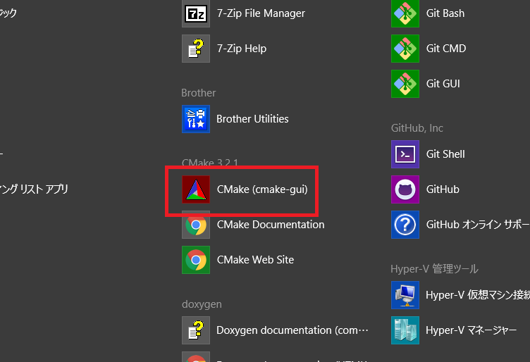</a></div>

### Verifying Operation

Move the Raspberry Pi Mouse using the joystick.

When an object approaches the front-left or front-right distance sensor and the sensor value exceeds the configured threshold, the robot should stop and the buzzer should sound.

You can adjust the detection threshold from the RTC configuration view by changing the value of `stop_distance`.

<div align="center"><a href="tutorial_raspimouse13.png"></a></div>

### Summary

In this tutorial, you learned:

- How to connect to Raspberry Pi Mouse
- How to operate Raspberry Pi Mouse using RT-Components
- How to create a simple RTC that uses distance sensor information
- How to integrate a custom RTC into an RT system
- How to use RTCBuilder to generate component skeletons
- How to build and execute RTCs in both C++ and Python

By extending the RTC created in this tutorial, you can implement more advanced autonomous behaviors such as obstacle avoidance, wall following, and waypoint navigation.

