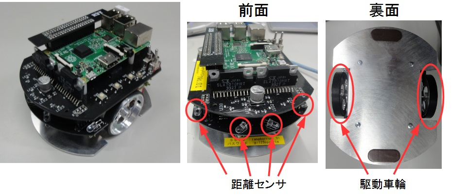
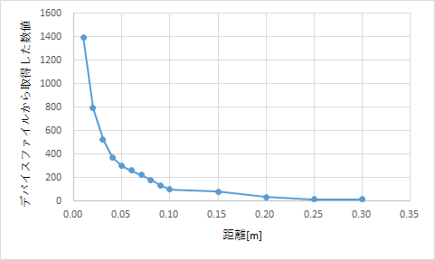
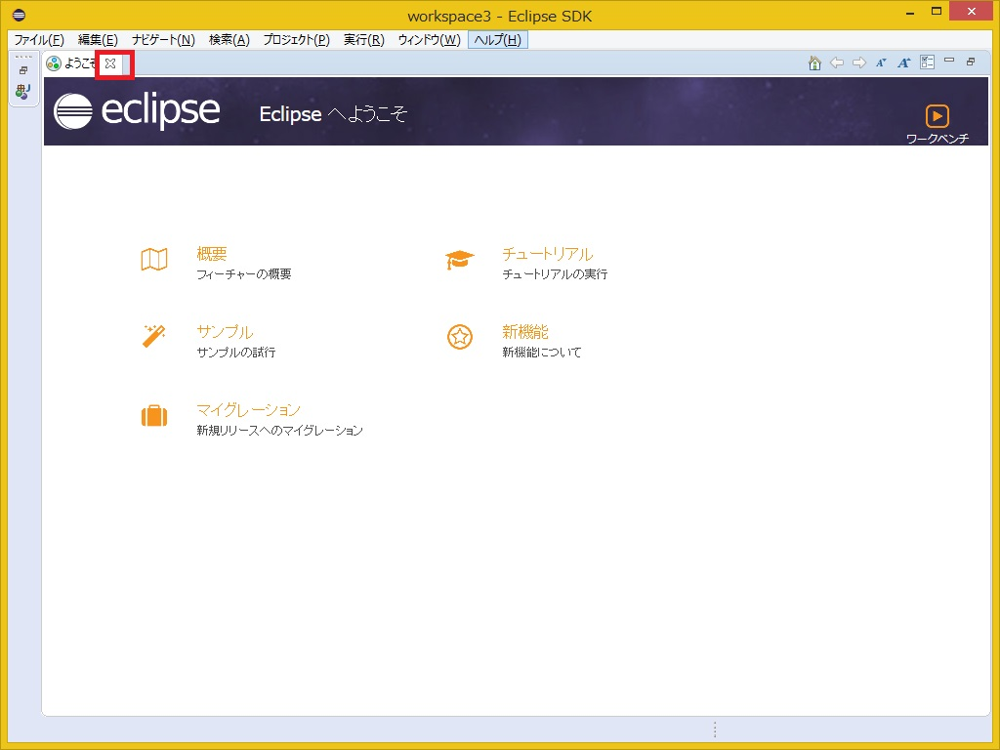
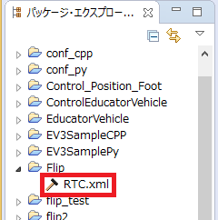
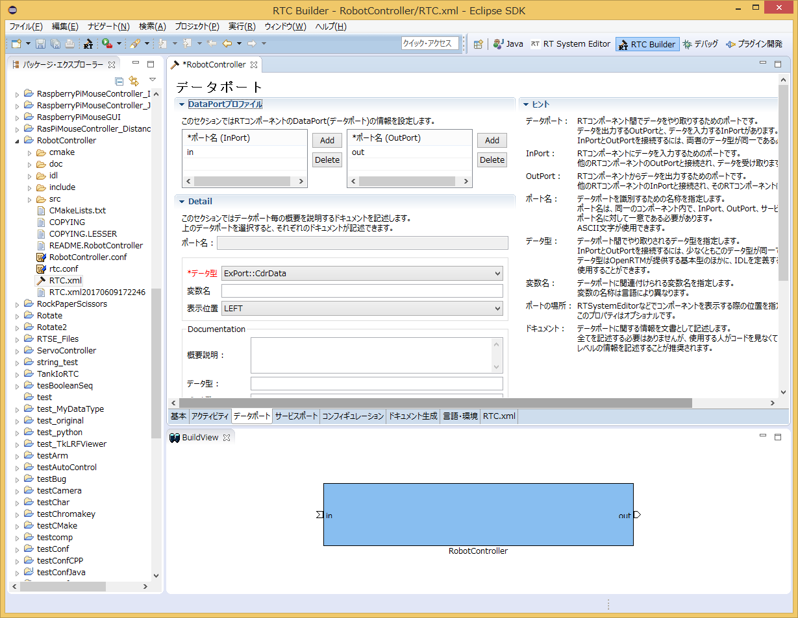
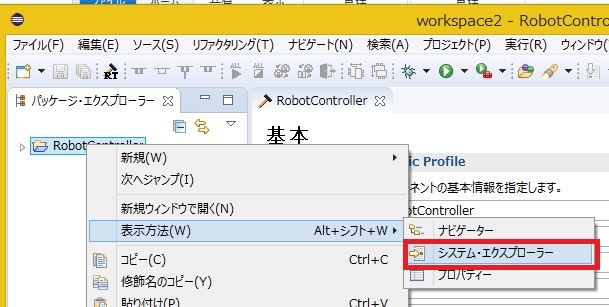
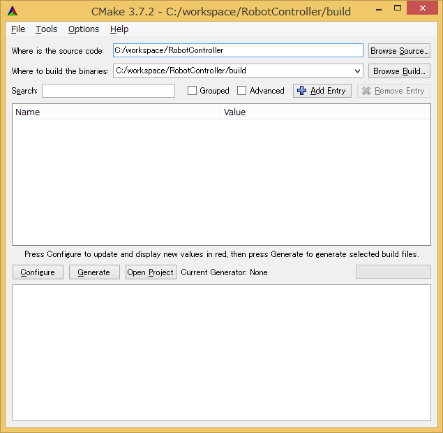
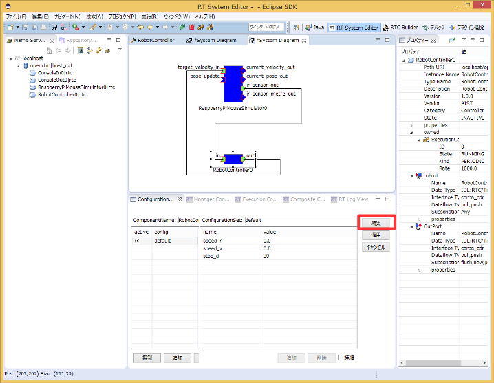
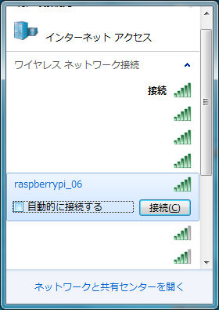
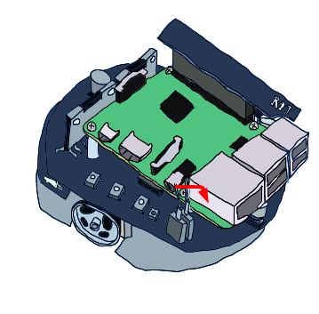

<!-- Title: チュートリアル(Raspberry Pi Mouse、C++、Windows、強化月間用) -->
#contents

## Introduction

This page explains the procedure for creating a component to control a Raspberry Pi Mouse in the simulator.

<div align="center"><a href="raspimouse2.png"></a></div>

## Downloading the Materials

First, download the materials.

- [RTM_Tutorial_RaspberryPiMouse.zip](https://github.com/OpenRTM/RTM_Tutorial_RaspberryPiMouse/archive/master.zip)

Extract the ZIP file using [Lhaplus](http://forest.watch.impress.co.jp/library/software/lhaplus/) or a similar tool.

Workshops may sometimes be conducted in environments without Internet access. In such cases, the files are included on the distributed USB memory.

### Simulator

- [RaspberryPiMouseSimulator Component](/content/simulator_rtc_raspbian_raspimouse)

The simulator was developed using the physics engine [Open Dynamics Engine (ODE)](http://www.ode.org/) and the drawing library (drawstuff) included with ODE.

Since it runs as long as OpenGL is available, it should work in most environments.

It can simulate the following robot, the [Raspberry Pi Mouse](http://products.rt-net.jp/micromouse/raspberry-pi-mouse).

<div align="center"><a href="s_DSC00444.JPG"></a></div>

The simulator reproduces not only the dynamics calculations and contact responses of the Raspberry Pi Mouse, but also distance sensor data with values close to those of the actual robot.

## Raspberry Pi Mouse Specifications

The Raspberry Pi Mouse is an independently driven two-wheel mobile robot sold by RT Corporation.

<div align="center"><a href="raspi_gaiyou.jpg"></a></div>

<table class="table-alt">
  <tr>
    <th colspan="2" style="text-align: center;">Raspberry Pi Mouse Specifications</th>
  </tr>
  <tr>
    <td>CPU</td>
    <td>Raspberry Pi 2 Model B</td>
  </tr>
  <tr>
    <td>Motor</td>
    <td>Two ST-42BYG020 stepper motors</td>
  </tr>
  <tr>
    <td>Motor Driver</td>
    <td>Two SLA7070MRPT units</td>
  </tr>
  <tr>
    <td>Distance Sensor</td>
    <td>Four red LEDs + phototransistors (ST-1K3)</td>
  </tr>
  <tr>
    <td>Red Monitoring LED</td>
    <td>4</td>
  </tr>
  <tr>
    <td>Buzzer</td>
    <td>1</td>
  </tr>
  <tr>
    <td>Switch</td>
    <td>3</td>
  </tr>
  <tr>
    <td>Battery</td>
    <td>One LiPo 3-cell (11.1V) 1000mAh battery</td>
  </tr>
</table>

## RT Component to Create

- RobotController Component

This component connects to the RaspberryPiMouseSimulator component and controls the robot in the simulator.

## Creating the RobotController Component

In this tutorial, you will create a component that controls the robot in the simulator using a GUI (slider) and automatically stops when the sensor value exceeds a specified threshold.

<div align="center"><a href="robotcomp.png"></a></div>

### Development Procedure

The development procedure is as follows.

- Verify the development environment
- Define the component specifications
- Generate template source code using RTC Builder
- Edit the source code
- Verify component operation

### Verifying the Development Environment

The following environment is assumed.

- OS: Windows 8.1 (Windows 7 and 10 are also supported)
- [OpenRTM-aist: 1.2.1-RC](https://github.com/OpenRTM/OpenRTM-aist/releases/download/v1.2.0/OpenRTM-aist-1.2.1-RC190514_x86_64.msi)
- [Visual Studio: 2017](https://www.visualstudio.com/ja-jp/downloads/download-visual-studio-vs.aspx) (2013, 2015, and 2019 are also supported)
- [CMake](https://github.com/Kitware/CMake/releases/download/v3.14.1/cmake-3.14.1-win64-x64.msi): Version 3.5 or later recommended
- [Python 2.7](https://www.python.org/ftp/python/2.7.16/python-2.7.16.amd64.msi)
- [Doxygen:ftp](//ftp.stack.nl/pub/users/dimitri/doxygen-1.8.14-setup.exe)

### Component Specifications

RobotController has an OutPort that outputs target velocity, an InPort that receives sensor values, and configuration parameters that define the target velocity and the sensor value threshold for stopping.

<table class="table-alt">
  <tr>
    <th>Component Name</th>
    <th>RobotController</th>
  </tr>
  <tr>
    <td colspan="2" style="text-align: center;">InPort</td>
  </tr>
  <tr>
    <td>Port Name</td>
    <td>in</td>
  </tr>
  <tr>
    <td>Type</td>
    <td>TimedShortSeq</td>
  </tr>
  <tr>
    <td>Description</td>
    <td>Sensor values</td>
  </tr>
  <tr>
    <td colspan="2" style="text-align: center;">OutPort</td>
  </tr>
  <tr>
    <td>Port Name</td>
    <td>out</td>
  </tr>
  <tr>
    <td>Type</td>
    <td>TimedVelocity2D</td>
  </tr>
  <tr>
    <td>Description</td>
    <td>Target velocity</td>
  </tr>
  <tr>
    <td colspan="2" style="text-align: center;">Configuration</td>
  </tr>
  <tr>
    <td>Parameter Name</td>
    <td>speed_x</td>
  </tr>
  <tr>
    <td>Type</td>
    <td>double</td>
  </tr>
  <tr>
    <td>Default Value</td>
    <td>0.0</td>
  </tr>
  <tr>
    <td>Constraint</td>
    <td>-1.5&lt;x&lt;1.5</td>
  </tr>
  <tr>
    <td>Widget</td>
    <td>slider</td>
  </tr>
  <tr>
    <td>Step</td>
    <td>0.01</td>
  </tr>
  <tr>
    <td>Description</td>
    <td>Forward velocity setting</td>
  </tr>
  <tr>
    <td colspan="2" style="text-align: center;">Configuration</td>
  </tr>
  <tr>
    <td>Parameter Name</td>
    <td>speed_r</td>
  </tr>
  <tr>
    <td>Type</td>
    <td>double</td>
  </tr>
  <tr>
    <td>Default Value</td>
    <td>0.0</td>
  </tr>
  <tr>
    <td>Constraint</td>
    <td>-2.0&lt;x&lt;2.0</td>
  </tr>
  <tr>
    <td>Widget</td>
    <td>slider</td>
  </tr>
  <tr>
    <td>Step</td>
    <td>0.01</td>
  </tr>
  <tr>
    <td>Description</td>
    <td>Rotational velocity setting</td>
  </tr>
  <tr>
    <td colspan="2" style="text-align: center;">Configuration</td>
  </tr>
  <tr>
    <td>Parameter Name</td>
    <td>stop_d</td>
  </tr>
  <tr>
    <td>Type</td>
    <td>int</td>
  </tr>
  <tr>
    <td>Default Value</td>
    <td>30</td>
  </tr>
  <tr>
    <td>Description</td>
    <td>Sensor value threshold setting for stopping</td>
  </tr>
</table>

#### About the TimedVelocity2D Type

The TimedVelocity2D type is used to store the movement velocity of a mobile robot on a two-dimensional plane.

```
     struct Velocity2D
     {
           /// Velocity along the x axis in metres per second.
           double vx;
           /// Velocity along the y axis in metres per second.
           double vy;
           /// Yaw velocity in radians per second.
           double va;
     };
 
 
     struct TimedVelocity2D
     {
           Time tm;
           Velocity2D data;
     };
```

This data type can store the X-axis velocity **vx**, Y-axis velocity **vy**, and rotational velocity around the Z-axis **va**.

**vx**, **vy**, and **va** represent velocities in the robot-centered coordinate system.

<br>

<div align="center"><a href="tu_ev3_20.png"></a></div>
<br>

**vx** is the velocity in the X direction, **vy** is the velocity in the Y direction, and **va** is the angular velocity around the Z axis.

For robots such as the Raspberry Pi Mouse, which have two wheels mounted on the left and right sides, **vy** is assumed to be 0 if lateral slipping is ignored.

The robot is controlled by specifying the forward velocity **vx** and rotational velocity **va**.

#### About Distance Sensor Data

The Raspberry Pi Mouse distance sensors output larger values as an object gets closer.

<br>

<div align="center"><a href="rpm14_graph.png"></a></div>
<br>

<table class="table-alt">
  <tr>
    <th>Value Obtained from Device File</th>
    <th>Actual Distance [m]</th>
  </tr>
  <tr>
    <td>1394</td>
    <td>0.01</td>
  </tr>
  <tr>
    <td>792</td>
    <td>0.02</td>
  </tr>
  <tr>
    <td>525</td>
    <td>0.03</td>
  </tr>
  <tr>
    <td>373</td>
    <td>0.04</td>
  </tr>
  <tr>
    <td>299</td>
    <td>0.05</td>
  </tr>
  <tr>
    <td>260</td>
    <td>0.06</td>
  </tr>
  <tr>
    <td>222</td>
    <td>0.07</td>
  </tr>
  <tr>
    <td>181</td>
    <td>0.08</td>
  </tr>
  <tr>
    <td>135</td>
    <td>0.09</td>
  </tr>
  <tr>
    <td>100</td>
    <td>0.10</td>
  </tr>
  <tr>
    <td>81</td>
    <td>0.15</td>
  </tr>
  <tr>
    <td>36</td>
    <td>0.20</td>
  </tr>
  <tr>
    <td>17</td>
    <td>0.25</td>
  </tr>
  <tr>
    <td>16</td>
    <td>0.30</td>
  </tr>
</table>

The simulator reproduces and outputs these values.

The RobotController component implements processing to automatically stop when these values exceed a specified threshold.


### Generating the RobotController Component Template

The RobotController component template is generated using RTCBuilder.

#### Starting RTCBuilder

In Eclipse, the folder used for various work is called a "workspace" (Work Space), and in principle, all generated files are saved under this folder.

The workspace can be created in any accessible folder, but this tutorial assumes the following workspace.

- C:\workspace

First, start Eclipse.

In Windows 8.1, you can start it by clicking "Start" > "Apps View (lower-right arrow)" > "OpenRTM-aist 1.2.0" > "OpenRTP".

When prompted for the workspace location at startup, specify the workspace above.

<div align="center"><a href="robomech2018_1.jpg"></a></div>

The following Welcome page will then be displayed.

<br>

<div align="center"><a href="robomech2018_2_2.jpg"></a></div>
<div align="center"><strong>Screen Displayed When Eclipse Starts for the First Time</strong></div>

The Welcome page is not needed now, so click the "×" button in the upper-left corner to close it.

Click the [Open Perspective] button in the upper-right corner.

<div align="center"><a href="install42.png"></a></div>
<div align="center"><strong>Switching Perspectives</strong></div>

Select "RTC Builder" to start RTCBuilder. The RTCBuilder icon with a "hammer and RT" will appear in the menu bar.

<div align="center"><a href="robomech2018_3.jpg"></a></div>
<div align="center"><strong>Selecting a Perspective</strong></div>

#### Creating a New Project

To create the RobotController component, you need to create a new project in RTC Builder.

Click the [Open New RTCBuilder Editor] icon in the upper-left corner.

<div align="center"><a href="CreateProject_0.png"></a></div>
<div align="center"><strong>Creating an RTC Builder Project</strong></div>

Enter the project name to create (in this case, **RobotController**) in the "Project Name" field and click the [Finish] button.

<div align="center"><a href="RT-Component-BuilderProject_1.png"></a></div>

A project with the specified name will be generated and added to the Package Explorer.

<div align="center"><a href="PackageExplolrer_1.png"></a></div>

Within the generated project, an RTC profile XML (RTC.xml) with default values is automatically generated.

#### Starting the RTC Profile Editor

When RTC.xml is generated, the RTCBuilder editor associated with this project should open as part of the workspace.

If it does not start, double-click RTC.xml in the Package Explorer.

<div align="center"><a href="Open_RTCBuilder_0.png"></a></div>

#### Entering Profile Information and Generating Code

First, select the leftmost "Basic" tab and enter the basic information.

In addition to the RobotController component specification (name) defined earlier, enter the description, version, and other information.

Fields with red labels are required. All other fields can remain at their default values.

- Module Name: RobotController
- Module Description: Optional (Robot Controller component)
- Version: Optional (1.0.0)
- Vendor Name: Optional
- Module Category: Optional (Controller)

<br>

<div align="center"><a href="Basic_1.png"></a></div>
<div align="center"><strong>Entering Basic Information</strong></div>
<br>

Next, select the "Activity" tab and specify the action callbacks to use.

The RobotController component uses the onActivated(), onDeactivated(), and onExecute() callbacks. As shown below, click onActivated (①), then check [ON] using the radio button (②).

Perform the same procedure for onDeactivated and onExecute.

<br>

<div align="center"><a href="Activity_1.png"></a></div>
<div align="center"><strong>Selecting Activity Callbacks</strong></div>
<br>

Next, select the "Data Ports" tab and enter the data port information.

Enter the following based on the specifications defined earlier. The variable names and display positions are optional and may be left unchanged.

<br>

- InPort Profile:
  - Port Name: in
  - Data Type: TimedShortSeq

<br>

- OutPort Profile:
  - Port Name: out
  - Data Type: TimedVelocity2D

<br>

<div align="center"><a href="DataPort_1.png"></a></div>
<div align="center"><strong>Entering Data Port Information</strong></div>
<br>

Next, select the "Configuration" tab and enter the Configuration information based on the specifications defined earlier.

Constraints and Widgets are used to change values through GUI elements such as sliders, spin buttons, and radio buttons when displaying component configuration parameters in RTSystemEditor.

The forward velocity speed_x and rotational velocity speed_r will be controllable using sliders.

<br>

- speed_x
  - Name: speed_x
  - Data Type: double
  - Default Value: 0.0
  - Constraint: -1.5&lt;x&lt;1.5
  - Widget: slider
  - Step: 0.01
- speed_r
  - Name: speed_r
  - Data Type: double
  - Default Value: 0.0
  - Constraint: -2.0&lt;x&lt;2.0
  - Widget: slider
  - Step: 0.01
- stop_d
  - Name: stop_d
  - Data Type: int
  - Default Value: 30
  - Widget: text

<br>

<div align="center"><a href="Configuration_1.png"></a></div>
<div align="center"><strong>Entering Configuration Information</strong></div>
<br>

Next, select the "Language / Environment" tab and choose the programming language.

In this tutorial, select C++ (language). Note that the Language / Environment field has no default value. If you forget to specify a language, an error will occur during code generation, so be sure to specify the language.

<div align="center"><a href="Language_1.png"></a></div>
<div align="center"><strong>Selecting the Programming Language</strong></div>
<br>

Finally, click the [Generate Code] button on the "Basic" tab to generate the component template.

<br>

<div align="center"><a href="Generate_1.png"></a></div>
<div align="center"><strong>Generating the Template (Generate)</strong></div>
<br>

Right-click the project and select "Show In" → "System Explorer" to open the workspace in Explorer.

<div align="center"><a href="robomech2018_4.jpg"></a></div>


### Generating Files Required for Building with CMake

The code generated by RTC Builder includes a CMakeLists.txt file used to generate various files required for building with CMake.

By using CMake, project files, solution files for Visual Studio, Makefiles, and other build-related files can be automatically generated from CMakeLists.txt.

#### Using CMake (cmake-gui)

Use CMake to configure the build environment.

First, start CMake (cmake-gui). In Windows, you can launch it by selecting:

"Start" > "Apps View (lower-right arrow)" > "CMake 3.11.2" > "CMake (cmake-gui)"

<div align="center"><a href="CMakeGUI0_1.png"></a></div>
<div align="center"><strong>Starting CMake GUI and Specifying Directories</strong></div>

At the top of the screen, there are the following text boxes. Specify the source code location (where CMakeLists.txt exists) and the build directory.

- **Where is the source code**
- **Where to build the binaries**

The source code location is the directory where the RobotController component source code was generated and where CMakeLists.txt exists.

By default, it is:

- `<Workspace Directory>/RobotController`

You can also set this directory by dragging and dropping it from Explorer into cmake-gui instead of entering it manually.

The build directory is the location where project files, object files, and binaries generated during the build process are stored.

The location is arbitrary, but it is recommended to specify a RobotController subdirectory with an easy-to-understand name, such as:

- `<Workspace Directory>/RobotController/build`

<table class="table-alt">
  <tr>
    <td><strong>Where is the source code</strong></td>
    <td>C:\workspace\RobotController</td>
  </tr>
  <tr>
    <td><strong>Where to build the binaries</strong></td>
    <td>C:\workspace\RobotController\build</td>
  </tr>
</table>

After specifying the directories, click the [Configure] button below.

A dialog similar to the one below will appear. Select the type of project you want to generate.

For this tutorial, select **Visual Studio 15 2017**.

If you are using Visual Studio 2013 or Visual Studio 2019, select the corresponding version.

Also set the platform to **x64**. If you installed the 32-bit version, select **Win32**.

<div align="center"><a href="cmake_vs.png"></a></div>
<div align="center"><strong>Specifying the Type of Project to Generate</strong></div>

Click the [Finish] button in the dialog to start configuration.

If there are no problems, **Configuring done** will be displayed in the log window at the bottom.

Next, click the [Generate] button.

When **Generating done** is displayed, generation of project files, solution files, and related files is complete.

Note that CMake generates cache files during the Configure stage. If you change settings or modify the environment due to troubleshooting, delete the cache using:

**[File] > [Delete Cache]**

and then run Configure again from the beginning.

### Editing Header and Source Files

Next, open Visual Studio by double-clicking **RobotController.sln** in the build directory specified earlier.

*In newer versions of cmake-gui, Visual Studio can be launched directly by clicking a button in cmake-gui.*

<br>

<div align="center"><a href="cmake_gui.png"></a></div>
<br>

Edit the header file (**include/RobotController/RobotController.h**) and source file (**src/RobotController.cpp**).

You can open the editor by clicking **RobotController.h** and **RobotController.cpp** in Visual Studio's Solution Explorer.

<div align="center"><a href="robomech2018_5.jpg"></a></div>

#### Implementing Activity Processing

In the RobotController component, the configuration parameters (**speed_x**, **speed_y**) are controlled using sliders, and their values are output as target velocity through the OutPort (**out**).

Values input through the InPort (**in**) are stored in variables, and the robot is stopped when any value exceeds a specified threshold.

<br>

The processing performed in **onActivated()**, **onExecute()**, and **onDeactivated()** is shown below.

<br>

<div align="center"><a href="RCRTC_State_1.png"></a></div>
<div align="center"><strong>Overview of Activity Processing</strong></div>

<br>

#### Editing the Header File (RobotController.h)

Declare the variable **sensor_data** to temporarily store sensor values.

```
   private:
 	 int sensor_data[4];	//センサー値を一時格納する変数
```

#### Editing the Source File (RobotController.cpp)

Implement **onActivated()**, **onDeactivated()**, and **onExecute()** as shown below.

```
 RTC::ReturnCode_t RobotController::onActivated(RTC::UniqueId ec_id)
 {
 	    //センサー値初期化
 	    for (int i = 0; i < 4; i++)
 	    {
 		        sensor_data[i] = 0;
 	    }
 
 	    return RTC::RTC_OK;
 }
```

```
 RTC::ReturnCode_t RobotController::onDeactivated(RTC::UniqueId ec_id)
 {
 	    //ロボットを停止する
 	    m_out.data.vx = 0;
 	    m_out.data.va = 0;
 	    m_outOut.write();
 
 	    return RTC::RTC_OK;
 }
```

```
 RTC::ReturnCode_t RobotController::onExecute(RTC::UniqueId ec_id)
 {
 	    //入力データの存在確認
 	    if (m_inIn.isNew())
 	    {
 		    //入力データ読み込み
 		    m_inIn.read();
 		    for (int i = 0; i < m_in.data.length(); i++)
 		    {
 			    //入力データ格納
 			    if (i < 4)
 			    {
 				    sensor_data[i] = m_in.data[i];
 			    }
 		    }
 	    }
 
 	    //前進するときのみ停止するかを判定
 	    if (m_speed_x > 0)
 	    {
 		    for (int i = 0; i < 4; i++)
 		    {
 			    //センサー値が設定値以上か判定
 			    if (sensor_data[i] > m_stop_d)
 			    {
 				        //センサー値が設定値以上の場合は停止
 				        m_out.data.vx = 0;
 				        m_out.data.va = 0;
 				        m_outOut.write();
 				        return RTC::RTC_OK;
 			    }
 		    }
 	    }
 	    //設定値以上の値のセンサーが無い場合はコンフィギュレーションパラメーターの値で操作
 	    m_out.data.vx = m_speed_x;
 	    m_out.data.va = m_speed_r;
 	    m_outOut.write();
           return RTC::RTC_OK;
 }
```

### Building with Visual Studio

#### Executing the Build

Build the project by selecting:

**[Build] > [Build Solution]**

in Visual Studio.

<br>

<div align="center"><a href="VC++_build_0.png"></a></div>
<div align="center"><strong>Executing the Build</strong></div>

<br>

## Verifying the Operation of the RobotController Component

Connect the created RobotController component to the simulator component and verify its operation.

### Starting the NameService

Start the naming service used to register component references.

<br>

Click the Name Service start button in RT System Editor.

<div align="center"><a href="robomech2018_6.jpg"></a></div>

&color(red){※ If omniNames does not start when you click "Start Naming Service", make sure that the full computer name is set to 14 characters or fewer.

### Starting the RobotController Component

Start the RobotController component.

Run the **RobotControllerComp.exe** file located in:

**RobotController\build\src\Debug** (or **Release**) folder.

### Starting the Simulator Component

This component can be started by running:

**EXE/RaspberryPiMouseSimulatorComp.exe**

in the folder where you extracted the previously downloaded file (**RTM_Tutorial_RaspberryPiMouse.zip**).


### Connecting Components

As shown below, connect the RobotController component and the RaspberryPiMouseSimulator component in RTSystemEditor.

<div align="center"><a href="RTSE_Connect_1.png"></a></div>
<div align="center"><strong>Connecting Components</strong></div>

### Activating Components

Click the **[All Activate]** icon at the top of RTSystemEditor to activate all components.

If activation is successful, the components will be displayed in light green as shown below.

<br>

<div align="center"><a href="robomech2018_26.jpg"></a></div>
<div align="center"><strong>Activating Components</strong></div>

<br>

### Operation Check

As shown below, you can modify configuration parameters using the **[Edit]** button in the Configuration View.

<br>

<div align="center"><a href="RTSE_Configuration_10.png"></a></div>
<br>

Use the sliders to verify that you can control the Raspberry Pi Mouse in the simulator.

<br>

<div align="center"><a href="RTSE_Configuration_1.png"></a></div>
<div align="center"><strong>Changing Configuration Parameters</strong></div>

<br>

## Operation Check on the Actual Robot

If an actual Raspberry Pi Mouse is available at the workshop, you can also verify operation on the real hardware. If you have extra time, try it out.

The procedure is as follows:

- Turn on the Raspberry Pi Mouse
- Connect to the Raspberry Pi Mouse access point
- Connect the ports
- Activate the components

### Turning on the Power

The Raspberry Pi Mouse has two power switches: one for the Raspberry Pi and one for the motors.

<br>

<div align="center"><a href="rpm8_raspi.png"></a></div>

<br>

Turning on the inner power switch starts the Raspberry Pi.

<br>

<div align="center"><a href="rpm9_raspi.png"></a></div>

<br>

#### Turning off the Power

When shutting down the Raspberry Pi, do not turn it off directly using the power switch.

Press and hold the center button among the three aligned buttons for a few seconds to begin shutdown.

Raspbian will finish shutting down in about 10 seconds. After that, turn off the power switch.

<br>

<div align="center"><a href="rpm8.png"></a></div>

<br>

### Connecting to the Access Point

Refer to the following pages for instructions on connecting to the wireless access point.

- [How to connect to a wireless LAN in Windows 7](http://121ware.com/qasearch/1007/app/servlet/qadoc?QID=011120)
- [How to connect to a wireless LAN in Windows 8 / 8.1](http://121ware.com/qasearch/1007/app/servlet/relatedqa?QID=014183)

The SSID and password are written on the label attached to the Raspberry Pi Mouse.

First, click the network icon in the lower-right corner.

<br>

<div align="center"><a href="tu_ev3_14.png"></a></div>

<br>

Next, select **raspberrypi_*** from the list.

<br>

<div align="center"><a href="tu_ev3_15.png"></a></div>

<br>

Enter the password.

<br>

<div align="center"><a href="tu_ev3_12.png"></a></div>

<br>

*If the network changes, component registration with the Name Server or port connections may fail. In that case, temporarily stop all Name Servers and components.*

*If they are started after the network switch, there is no problem and restarting them is unnecessary.*

### Adding a Name Server

Next, use the **[Add Name Server]** button in RT System Editor to add **192.168.11.1**.

<br>

<div align="center"><div align="center"><a href="tutorial_raspimouse0.png"></a></div>;  <div align="center"><a href="tutorial_raspimouse1.png"></a></div>;</div>

<br>
<br>

After that, the following three RTCs will become visible.

<div align="center"><a href="robomech2018_7.jpg"></a></div>

- [RaspberryPiMouseRTC](/ja/node/6015#toc0)
- OpenCVCamera
- artp

RaspberryPiMouseRTC is an RT component for controlling the Raspberry Pi Mouse, developed by the Robot System Design Laboratory at Meijo University.

### Connecting the Ports

In RT System Editor, connect the RaspberryPiMouseRTC component and the RobotController component as shown below.

<div align="center"><a href="tutorial_raspimouse41.png"></a></div>

### Turning on the Motor Power

Before operation, turn on the motor power switch.

Be sure to turn off the motor power whenever it is not needed.

<br>

<div align="center"><a href="rpm10_raspi.png"></a></div>

<br>

### Activation

After activating the RTCs, you will be able to control the Raspberry Pi Mouse.
