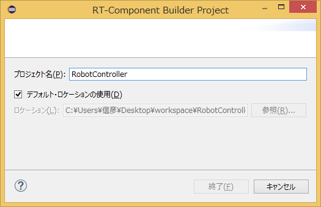
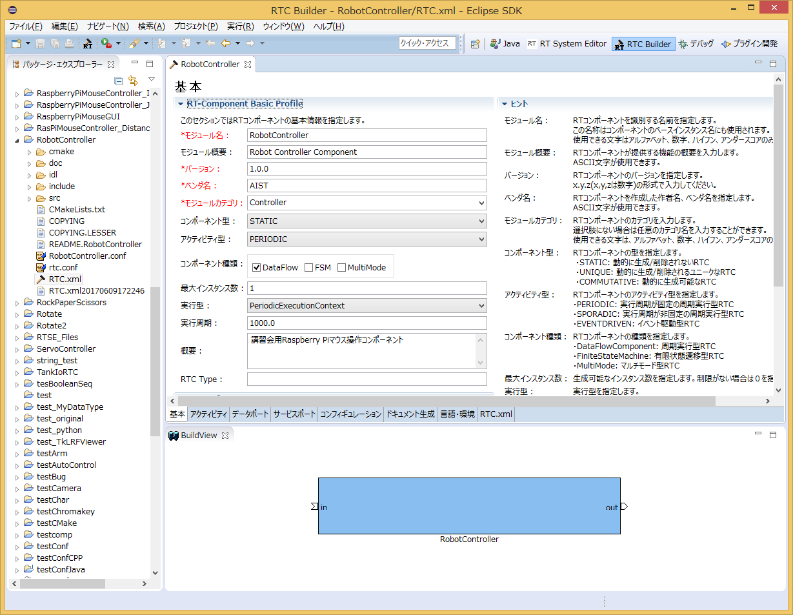
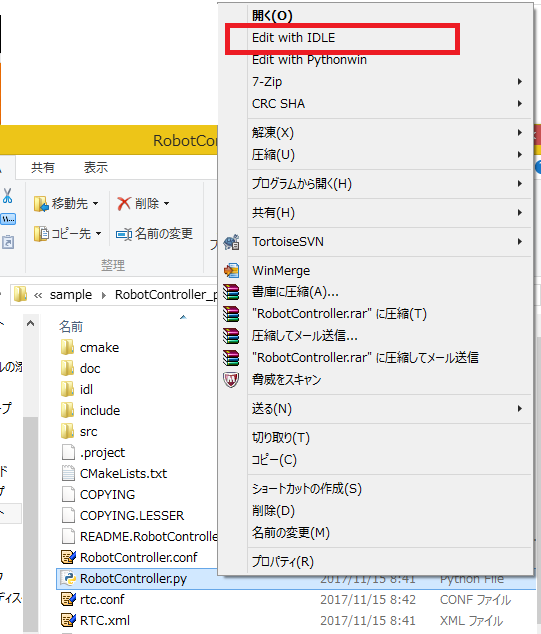
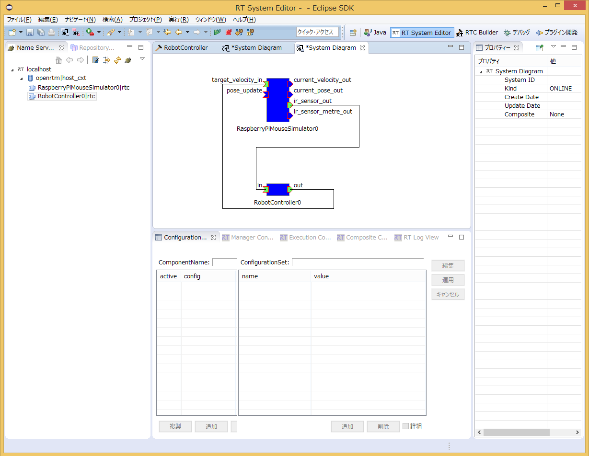
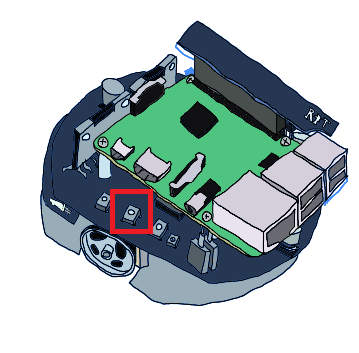
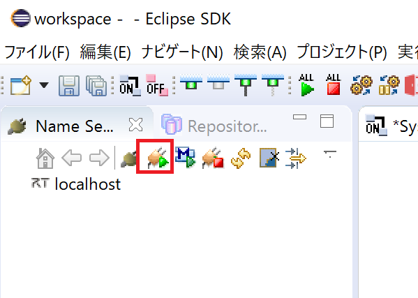
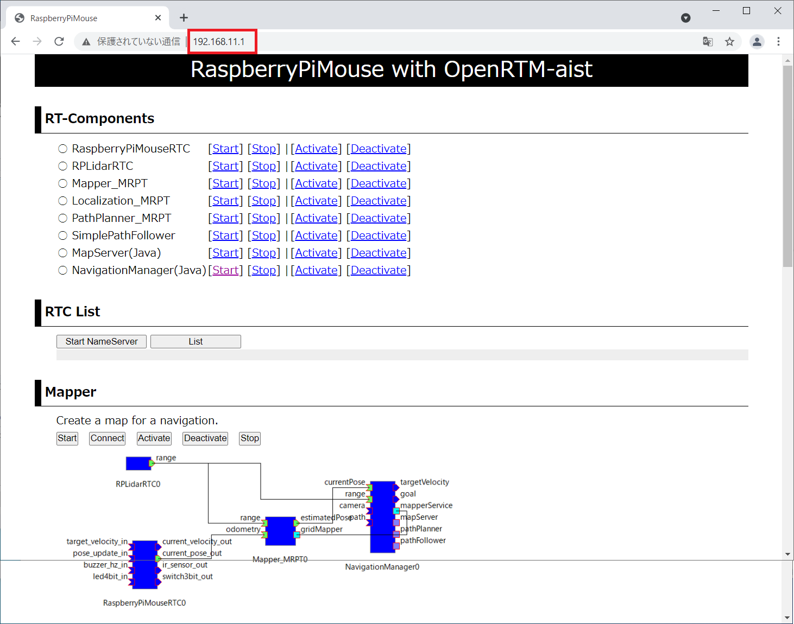
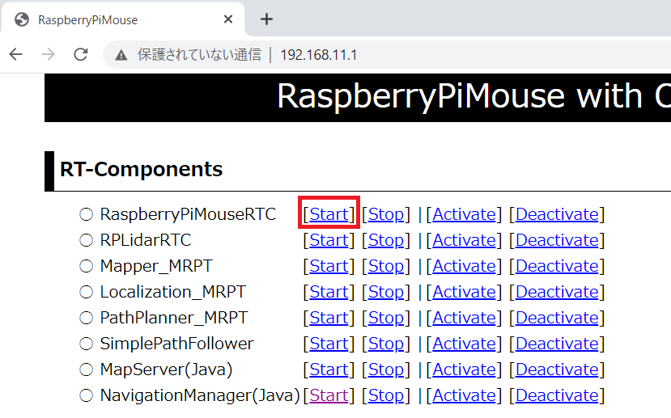
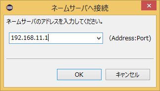

<!-- Title: チュートリアル(Raspberry Pi Mouse、Python、Ubuntu、強化月間用) -->
#contents

## はじめに

このページではシミュレーター上の Raspberry Pi マウスを操作するためのコンポーネントの作成手順を説明します。

<div align="center"><a href="raspimouse2.png"></a></div>


## 資料のダウンロード

まずは資料をダウンロードしてください。

```
 git clone https://github.com/OpenRTM/RTM_Tutorial_RaspberryPiMouse_Python
```

インターネットに接続できない環境で講習会を実施している場合がありますので、その場合は配布のUSBメモリーに入れてあります。


### 作成する RTコンポーネント

- RobotController コンポーネント

RaspberryPiMouseSimulator コンポーネントと接続してシミュレーター上のロボットを操作するためのコンポーネントです。

## RobotController コンポーネントの作成

GUI(スライダー)によりシミュレーター上のロボットの操作を行い、センサー値が一定以上の時には自動的に停止するコンポーネントの作成を行います。

<div align="center"><a href="robotcomp.png"></a></div>

### 作成手順
作成手順は以下の通りです。

- 開発環境の確認
- コンポーネントの仕様を決める
- RTC Builder によるソースコードのひな型コードの作成
- ソースコードの編集
- コンポーネントの動作確認

### 動作環境・開発環境
Linux (ここでは Ubuntu 16.04 を仮定) 上に開発環境を構築します。


#### OpenRTM-aistのインストール
```
 $ wget https://raw.githubusercontent.com/OpenRTM/OpenRTM-aist/master/scripts/pkg_install_ubuntu.sh
 $ pkg_install_ubuntu.sh -l all --yes
```

#### JDKのインストール

```
 # Ubuntu 18.04、18.10の場合
 $ sudo apt-get install openjdk-8-jdk
 # Ubuntu 16.04の場合
 $ sudo apt-get install default-jdk
```

Ubuntu 18.04、18.10の場合は以下のコマンドでjava8に切り替えます。

```
 $ sudo update-alternatives --config java
```

<span style="color:red;">openrtp起動後、RTSystemEditor でネームサーバに接続できない場合があります。その場合、/etc/hosts の localhost の行に自ホスト名を追記してください。</span>;

```
 $ hostname
 ubuntu1804 ← ホスト名は ubuntu1804
 $ sudo vi /etc/hosts
```

```
 127.0.0.1       localhost
 を以下のように変更
 127.0.0.1       localhost ubuntu1804
```


#### Python用エディタのインストール
Visual Studio Code、PyDev等のエディタをインストールしてください。

#### gitのインストール

```
 $ sudo apt-get install git
```

#### cmakeのインストール

```
 $ sudo apt-get install cmake
```

#### Premake、GLUTのインストール
ODEのビルドに必要です。

```
 $ sudo apt-get install premake4 freeglut3-dev
```

#### RaspberryPiMouseSimulator コンポーネント
シミュレーターコンポーネントについては手動でビルドを行います。
以下のコマンドを入力してください。

```
 $ wget https://raw.githubusercontent.com/OpenRTM/RTM_Tutorial/master/script/install_raspimouse_simulator.sh
 $ sudo sh install_raspimouse_simulator.sh
```


インターネットに接続できない環境で講習会を実施している場合がありますので、その場合は配布の USBメモリー内のスクリプトを起動してください。

```
 $ sudo sh install_raspimouse_simulator_usb.sh
```


### コンポーネントの仕様

RobotController は目標速度を出力するアウトポート、センサー値を入力するインポート、目標速度や停止するセンサー値を設定するコンフィギュレーションパラメーターを持っています。

<table class="table-alt">
  <tr>
    <th>コンポーネント名称</th>
    <th>RobotController</th>
  </tr>
  <tr>
    <td colspan="2" style="text-align: center;">InPort</td>
  </tr>
  <tr>
    <td>ポート名</td>
    <td>in</td>
  </tr>
  <tr>
    <td>型</td>
    <td>TimedShortSeq</td>
  </tr>
  <tr>
    <td>説明</td>
    <td>センサー値</td>
  </tr>
  <tr>
    <td colspan="2" style="text-align: center;">OutPort</td>
  </tr>
  <tr>
    <td>ポート名</td>
    <td>out</td>
  </tr>
  <tr>
    <td>型</td>
    <td>TimedVelocity2D</td>
  </tr>
  <tr>
    <td>説明</td>
    <td>目標速度</td>
  </tr>
  <tr>
    <td colspan="2" style="text-align: center;">Configuration</td>
  </tr>
  <tr>
    <td>パラメーター名</td>
    <td>speed_x</td>
  </tr>
  <tr>
    <td>型</td>
    <td>double</td>
  </tr>
  <tr>
    <td>デフォルト値</td>
    <td>0.0</td>
  </tr>
  <tr>
    <td>制約</td>
    <td>-1.5&lt;x&lt;1.5</td>
  </tr>
  <tr>
    <td>Widget</td>
    <td>slider</td>
  </tr>
  <tr>
    <td>Step</td>
    <td>0.01</td>
  </tr>
  <tr>
    <td>説明</td>
    <td>直進速度の設定</td>
  </tr>
  <tr>
    <td colspan="2" style="text-align: center;">Configuration</td>
  </tr>
  <tr>
    <td>パラメーター名</td>
    <td>speed_r</td>
  </tr>
  <tr>
    <td>型</td>
    <td>double</td>
  </tr>
  <tr>
    <td>デフォルト値</td>
    <td>0.0</td>
  </tr>
  <tr>
    <td>制約</td>
    <td>-2.0&lt;x&lt;2.0</td>
  </tr>
  <tr>
    <td>Widget</td>
    <td>slider</td>
  </tr>
  <tr>
    <td>Step</td>
    <td>0.01</td>
  </tr>
  <tr>
    <td>説明</td>
    <td>回転速度の設定</td>
  </tr>
  <tr>
    <td colspan="2" style="text-align: center;">Configuration</td>
  </tr>
  <tr>
    <td>パラメーター名</td>
    <td>stop_d</td>
  </tr>
  <tr>
    <td>型</td>
    <td>int</td>
  </tr>
  <tr>
    <td>デフォルト値</td>
    <td>30</td>
  </tr>
  <tr>
    <td>説明</td>
    <td>停止するセンサー値の設定</td>
  </tr>
</table>

#### TimedVelocity2D 型について
2次元平面上の移動ロボットの移動速度を格納するデータ型である TimedVelocity2D 型を使用します。

```
     struct Velocity2D
     {
         /// Velocity along the x axis in metres per second.
         double vx;
         /// Velocity along the y axis in metres per second.
         double vy;
         /// Yaw velocity in radians per second.
         double va;
     };
 
 
     struct TimedVelocity2D
     {
         Time tm;
         Velocity2D data;
     };
```


このデータ型にはX軸方向の速度**vx**、Y軸方向の速度**vy**、Z軸周りの回転速度**va**が格納できます。

**vx**、**vy**、**va**はロボット中心座標系での速度を表しています。

<br>

<div align="center"><a href="tu_ev3_20.png"></a></div>
<br>

**vx**はX方向の速度、**vy**はY方向の速度、**va**はZ軸周りの角速度です。

Raspberry Piマウスのように2個の車輪が左右に取り付けられているロボットの場合、横滑りしないと仮定すると**vy**は0になります。

直進速度**vx**、回転速度**va**を指定することでロボットの操作を行います。

#### 距離センサーのデータについて
Raspberry Pi マウスの距離センサーのデータは物体との距離が近づくほど大きな値を出力するようになっています。


<br>

<div align="center"><a href="rpm14_graph.png"></a></div>
<br>


<table class="table-alt">
  <tr>
    <th>デバイスファイルから取得した数値</th>
    <th>実際の距離[m]</th>
  </tr>
  <tr>
    <td>1394</td>
    <td>0.01</td>
  </tr>
  <tr>
    <td>792</td>
    <td>0.02</td>
  </tr>
  <tr>
    <td>525</td>
    <td>0.03</td>
  </tr>
  <tr>
    <td>373</td>
    <td>0.04</td>
  </tr>
  <tr>
    <td>299</td>
    <td>0.05</td>
  </tr>
  <tr>
    <td>260</td>
    <td>0.06</td>
  </tr>
  <tr>
    <td>222</td>
    <td>0.07</td>
  </tr>
  <tr>
    <td>181</td>
    <td>0.08</td>
  </tr>
  <tr>
    <td>135</td>
    <td>0.09</td>
  </tr>
  <tr>
    <td>100</td>
    <td>0.10</td>
  </tr>
  <tr>
    <td>81</td>
    <td>0.15</td>
  </tr>
  <tr>
    <td>36</td>
    <td>0.20</td>
  </tr>
  <tr>
    <td>17</td>
    <td>0.25</td>
  </tr>
  <tr>
    <td>16</td>
    <td>0.30</td>
  </tr>
</table>

シミュレーターではこの値を再現して出力しています。
RobotController コンポーネントではこの値が一定以上の時に自動的に停止する処理を実装します。


### RobotController コンポーネントのひな型コードの生成

RobotController コンポーネントのひな型コードの生成は、RTCBuilder を用いて行います。

#### RTCBuilder の起動
Eclipse では、各種作業を行うフォルダーを「ワークスペース」(Work Space)とよび、原則としてすべての生成物はこのフォルダーの下に保存されます。
ワークスペースはアクセスできるフォルダーであれば、どこに作っても構いませんが、このチュートリアルでは以下のワークスペースを仮定します。

- /home/ユーザー名/workspace

まずは Eclipse を起動します。
OpenRTP を展開したディレクトリーに移動して以下のコマンドを入力します。

```
 $ ./openrtp
```

最初にワークスペースの場所を尋ねられますので、上記のワークスペースを指定してください。


<div align="center"><a href="workspace_ubuntu.png"></a></div>


すると、以下のような Welcome ページが表示されます。

<br>


<div align="center"><a href="install41.png"></a></div>
<div align="center"><strong>Eclipse の初期起動時の画面</strong></div>

Welcome ページはいまは必要ないので左上の「×」ボタンをクリックして閉じてください。

右上の [Open Perspective] ボタンをクリックしてください。

<div align="center"><a href="install42.png"></a></div>
<div align="center"><strong>パースペクティブの切り替え</strong></div>

「RTC Builder」を選択することで、RTCBuilderが起動します。メニューバーに「カナヅチとRT」の RTCBuilder のアイコンが現れます。

<div align="center"><a href="install43.png"></a></div>
<div align="center"><strong>パースペクティブの選択</strong></div>


#### 新規プロジェクトの作成

RobotController コンポーネントを作成するために、RTC Builder で新規プロジェクトを作成する必要があります。

左上の [Open New RTCBuilder Editor] のアイコンをクリックしてください。


<div align="center"><a href="CreateProject_0.png"></a></div>
<div align="center"><strong>RTC Builder 用プロジェクトの作成</strong></div>

｢プロジェクト名｣欄に作成するプロジェクト名 (ここでは **RobotController**) を入力して [終了] をクリックします。


<div align="center"><a href="RT-Component-BuilderProject_1.png"></a></div>

指定した名称のプロジェクトが生成され、パッケージエクスプローラ内に追加されます。


<div align="center"><a href="PackageExplolrer_1.png"></a></div>

生成したプロジェクト内には、デフォルト値が設定された RTC プロファイル XML(RTC.xml) が自動的に生成されます。

#### RTC プロファイルエディタの起動

RTC.xmlが生成された時点で、このプロジェクトに関連付けられているワークスペースとして RTCBuilder のエディタが開くはずです。
もし起動しない場合はパッケージエクスプローラーの RTC.xml をダブルクリックしてください。


<div align="center"><a href="Open_RTCBuilder_0.png"></a></div>


#### プロファイル情報入力とコードの生成

まず、いちばん左の「基本」タブを選択し、基本情報を入力します。先ほど決めた RobotController コンポーネントの仕様(名前)の他に、概要やバージョン等を入力してください。
ラベルが赤字の項目は必須項目です。その他はデフォルトで構いません。

- モジュール名: RobotController
- モジュール概要: 任意(Robot Controller component)
- バージョン: 任意(1.0.0)
- ベンダ名: 任意
- モジュールカテゴリ: 任意(Controller)


<br>

<div align="center"><a href="Basic_1.png"></a></div>
<div align="center"><strong>基本情報の入力</strong></div>
<br>


次に、「アクティビティ」タブを選択し、使用するアクションコールバックを指定します。

RobotController コンポーネントでは、onActivated()、onDeactivated()、onExecute() コールバックを使用します。下図のように①の onAtivated をクリック後に②のラジオボタンにて [ON] にチェックを入れます。
onDeactivated、onExecute についても同様の手順を行います。

<br>

<div align="center"><a href="Activity_1.png"></a></div>
<div align="center"><strong>アクティビティコールバックの選択</strong></div>
<br>


さらに、「データポート」タブを選択し、データポートの情報を入力します。
先ほど決めた仕様を元に以下のように入力します。なお、変数名や表示位置はオプションで、そのままで結構です。


<br>


- InPort Profile:
  - ポート名: in
  - データ型: TimedShortSeq

<br>

- OutPort Profile:
  - ポート名: out
  - データ型: TimedVelocity2D

<br>


<div align="center"><a href="DataPort_1.png"></a></div>
<div align="center"><strong>データポート情報の入力</strong></div>
<br>

次に、「コンフィギュレーション」タブを選択し、先ほど決めた仕様を元に、Configuration の情報を入力します。
制約条件および Widget とは、RTSystemEditor でコンポーネントのコンフィギュレーションパラメーターを表示する際に、スライダー、スピンボタン、ラジオボタンなど、GUI で値の変更を行うためのものです。

直進速度 speed_x、回転速度 speed_r はスライダーのより操作できるようにします。

<br>

- speed_x
  - 名称: speed_x
  - データ型: double
  - デフォルト値: 0.0
  - 制約条件: -1.5&lt;x&lt;1.5
  - Widget: slider
  - Step: 0.01
- speed_r
  - 名称: speed_r
  - データ型: double
  - デフォルト値: 0.0
  - 制約条件: -2.0&lt;x&lt;2.0
  - Widget: slider
  - Step: 0.01
- stop_d
  - 名称: stop_d
  - データ型: int
  - デフォルト値: 30
  - Widget: text

<br>


<div align="center"><a href="Configuration_1.png"></a></div>
<div align="center"><strong>コンフィグレーション情報の入力</strong></div>
<br>

次に、「言語・環境」タブを選択し、プログラミング言語を選択します。
ここでは、C++(言語) を選択します。なお、言語・環境はデフォルト等が設定されておらず、指定し忘れるとコード生成時にエラーになりますので、必ず言語の指定を行うようにしてください。


<div align="center"><a href="Language_1.png"></a></div>
<div align="center"><strong>プログラミング言語の選択</strong></div>
<br>

最後に、「基本」タブにある [コード生成] ボタンをクリックし、コンポーネントのひな型コードを生成します。

<br>


<div align="center"><a href="Generate_1.png"></a></div>
<div align="center"><strong>ひな型コードの生成(Generate)</strong></div>
<br>

&color(red){※ 生成されるコード群は、eclipse起動時に指定したワークスペースフォルダーの中に生成されます。
現在のワークスペースは、[ファイル] > [ワークスペースの切り替え...] で確認することができます。};


### ソースコードの編集

`<ワークスペースディレクトリー>/RobotController/RobotController.py`をPython用エディタで開いて編集してください。


<br>

<div align="center"><a href="idle_1.png"></a></div>

<br>


#### 変数初期化部分の修正
OpenRTM-aist 1.1.2のRTC Builderを使用している場合は、変数初期化部分を修正する必要があります。(OpenRTM-aist 1.2.0では修正される予定です)

まずは、<u>init</u>関数の**self._d_in**変数初期化部分を修正してください。

```
 	def __init__(self, manager):
 		OpenRTM_aist.DataFlowComponentBase.__init__(self, manager)
 
 		#in_arg = [None] * ((len(RTC._d_TimedShortSeq) - 4) / 2)　←削除
 		#self._d_in = RTC.TimedShortSeq(*in_arg)　←削除
 		#以下の行を追加
 		self._d_in = RTC.TimedShortSeq(RTC.Time(0,0),[])
```


次に**self._d_out** 変数初期化部分を修正してください。

```
 		#out_arg = [None] * ((len(RTC._d_TimedVelocity2D) - 4) / 2)　←削除
 		#self._d_out = RTC.TimedVelocity2D(*out_arg)　←削除
 		#以下の行を追加
 		self._d_out = RTC.TimedVelocity2D(RTC.Time(0,0),RTC.Velocity2D(0.0,0.0,0.0))
```

これで完了です。


#### アクティビティ処理の実装


RobotController コンポーネントでは、コンフィギュレーションパラメーター(speed_x、speed_y)をスライダーで操作しその値を目標速度としてアウトポート(out)から出力します。
インポート(in) から入力された値を変数に格納して、その値が一定以上の場合は停止するようにします。

<br>
onActivated()、onExecute()、onDeactivated() での処理内容を下図に示します。
<br>

<div align="center"><a href="RCRTC_State_1.png"></a></div>
<div align="center"><strong>アクティビティ処理の概要</strong></div>
<br>

下記のように、onActivated()、onDeactivated()、onExecute() を実装します。

```
 	def onActivated(self, ec_id):
 		#センサー値初期化
 		self.sensor_data = [0,0,0,0]
 		return RTC.RTC_OK
```


```
 	def onDeactivated(self, ec_id):
 		#ロボットを停止する
 		self._d_out.data.vx = 0
 		self._d_out.data.va = 0
 		self._outOut.write()
 		return RTC.RTC_OK
```


```
 	def onExecute(self, ec_id):
 		#入力データの存在確認
 		if self._inIn.isNew():
 			data = self._inIn.read()
 			#この時点で入力データがm_inに格納される
 			#入力データを別変数に格納
 			self.sensor_data = data.data[:]
 		#前進するときのみ停止するかを判定
 		if self._speed_x[0] > 0:
 			for d in self.sensor_data:
 				#センサ値が設定値以上か判定
 				if d > self._stop_d[0]:
 					#センサ値が設定値以上の場合は停止
 					self._d_out.data.vx = 0
 					self._d_out.data.va = 0
 					self._outOut.write()
 					return RTC.RTC_OK
 				
 		#設定値以上の値のセンサが無い場合はコンフィギュレーションパラメータの値で操作
 		self._d_out.data.vx = self._speed_x[0]
 		self._d_out.data.va = self._speed_r[0]
 		self._outOut.write()
 				
 		return RTC.RTC_OK
```


## RobotController コンポーネントの動作確認
作成した RobotController をシミュレーターコンポーネントと接続して動作確認を行います。


以下より RaspberryPiMouseSimulator コンポーネントをダウンロードしてください。

- [RTM_Tutorial_2017](https://github.com/Nobu19800/RTM_Tutorial_JSAI2017/archive/master.zip)


インターネットに接続できない環境で講習会を実施している場合がありますので、その場合は配布のUSBメモリーに入れてあります。


### NameService の起動

コンポーネントの参照を登録するためのネームサービスを起動します。

<br>
```
 $ rtm-naming
```


### RobotController コンポーネントの起動

RobotController コンポーネントを起動します。

RobotController\build\srcフォルダーの RobotControllerComp ファイルを実行してください。


```
 $ RobotControllerComp
```


### シミュレーターコンポーネントの起動

RaspberryPiMouseSimulator コンポーネントをインストールしたディレクトリーに移動後、下記のコマンドにて起動できます。

```
 $ src/RaspberryPiMouseSimulatorComp
```


### コンポーネントの接続

下図のように、RTSystemEditorにて
RobotController コンポーネント、RaspberryPiMouseSimulator コンポーネントを接続します。


<div align="center"><a href="RTSE_Connect_1.png"></a></div>
<div align="center"><strong>コンポーネントの接続</strong></div>

### コンポーネントの Activate

RTSystemEditor の上部にあります [All Activate] というアイコンをクリックし、全てのコンポーネントをアクティブ化します。
正常にアクティベートされた場合、下図のように黄緑色でコンポーネントが表示されます。

<br>

<div align="center"><a href="RTSE_Activate_1.png"></a></div>
<div align="center"><strong>コンポーネントのアクティブ化</strong></div>
<br>

### 動作確認

下図のようにコンフィギュレーションビューの [編集] ボタンからコンフィギュレーションを変更することができます。

<br>

<div align="center"><a href="RTSE_Configuration_10.png"></a></div>
<br>

スライダーを操作してシミュレーター上の Raspberry Pi マウスの操作ができるかを確認してください。

<br>

<div align="center"><a href="RTSE_Configuration_1.png"></a></div>
<div align="center"><strong>コンフィギュレーションパラメーターの変更</strong></div>
<br>


## 実機での動作確認
講習会で Raspberry Pi マウス実機を用意している場合は実機での動作確認が可能です。

手順は以下の通りです。

- Raspberry Pi マウスの電源を投入する
- Raspberry Pi マウスのアクセスポイントに接続
- ポートの接続
- コンポーネントのアクティブ化


### 電源を投入する

Raspberry PiマウスにはRaspberry Piの電源スイッチとモーターの電源スイッチの2つがあります。

<br>

<div align="center"><a href="rpm8_raspi.png"></a></div>

<br>


内側の電源スイッチをオンにするとRaspberry Piが起動します。

<br>

<div align="center"><a href="rpm9_raspi.png"></a></div>

<br>


#### 電源を切る場合

Raspberry Piの電源を切る場合は、電源スイッチから直接オフにはしないようにしてください。
3つ並んだボタンの中央のボタンを数秒押すとシャットダウンが始まります。
10秒程度でRaspbianのシャットダウンが終了するため、その後に電源スイッチをオフにしてください。

<br>

<div align="center"><a href="rpm8.png"></a></div>
<br>


### アクセスポイントに接続

SSID、パスワードは Rasoberry Pi マウスに貼り付けたシールに記載してあるので、その SSID に接続してください。


※ネットワークが切り替わった場合にネームサーバーへのコンポーネントの登録やポートの接続が失敗する場合があるのでOpenRTP、ネームサーバ、コンポーネントを一旦全て終了してください。
ネットワーク切り替え後に起動した場合には問題ないので、終了させる必要はありません。

OpenRTPを終了するには右上の×を押して終了してください。システムダイアグラムを保存するかどうか聞かれますが、Don't Saveを選択してください。

<div align="center"><a href="rtse0150.png"></a></div>

**openrtp**コマンドを実行してOpenRTPを起動してください。

RT System Editor上でネームサーバーを再起動するには「ネームサービスを起動」ボタンを再度クリックします。

<div align="center"><a href="rtse400.png"></a></div>


### Raspberry Pi上のネームサーバー、RTC起動
**※この作業は以下のLiDAR付Raspberry Piマウスで必要な作業です。LiDAR無しのRaspberry Piマウスの場合は次の作業へ進んでください。**

<div align="center"><a href="https://rt-net.jp/mobility/wp-content/uploads/2019/12/23b47429c42d672e7f94ae0a3c9c9d6c.png"></a></div>

Edge、Chrome、Firefox等のWEBブラウザで**192.168.11.1**のアドレスにアクセスしてください。


<div align="center"><a href="slam40.png"></a></div>


するとRaspberryPiMouse with OpenRTM-aistの画面が表示されます。

まずはネームサーバーを起動するため、**Start NameServer**ボタンを押してください。

<div align="center"><a href="slam42.png"></a></div>


**RaspberryPiMouseRTC**の**Start**を押してください。

<div align="center"><a href="slam41.png"></a></div>


元の画面に戻らない場合は**Back to the top page.**をクリックしてください。

<div align="center"><a href="slam43.png"></a></div>

これで完了です。


### ネームサーバー追加

続いてRTシステムエディタの [ネームサーバー追加] ボタンで <span style="color:red;">192.168.11.1</span>; を追加してください。


<br>

<div align="center"><div align="center"><a href="tutorial_raspimouse0.png"></a></div>;  <div align="center"><a href="tutorial_raspimouse1.png"></a></div>;</div>
<br>
<br>

すると以下の2つの RTC が見えるようになります。

<div align="center"><a href="tutorial_raspimouse2.png"></a></div>

- [RaspberryPiMouseRTC](/ja/node/6015#toc0)
- [RaspberryPiMouseController_DistanceSensor](/ja/node/6015#toc1)

RaspberryPiMouseRTC は名城大学のロボットシステムデザイン研究室で開発されているラズパイマウス制御用の RTコンポーネントです。


### ポートの接続

RTシステムエディタで RaspberryPiMouseRTC、RobotController コンポーネントを以下のように接続します。


<div align="center"><a href="tutorial_raspimouse41.png"></a></div>


### モーターの電源を投入する
動作の前に、モーターの電源スイッチをオンにしてください。
モーターの電源はこまめに切るようにしてください。


<br>

<div align="center"><a href="rpm10_raspi.png"></a></div>

<br>


### アクティブ化
そして RTC をアクティブ化すると Raspberry Pi マウスの操作ができるようになります。

