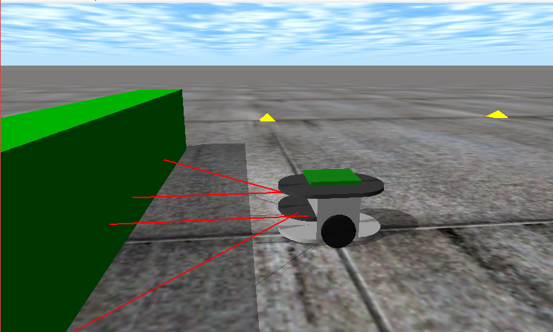
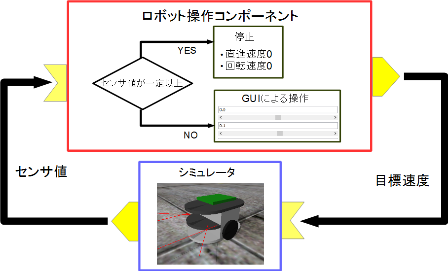
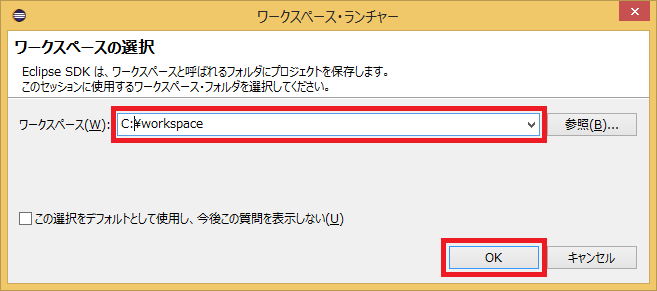
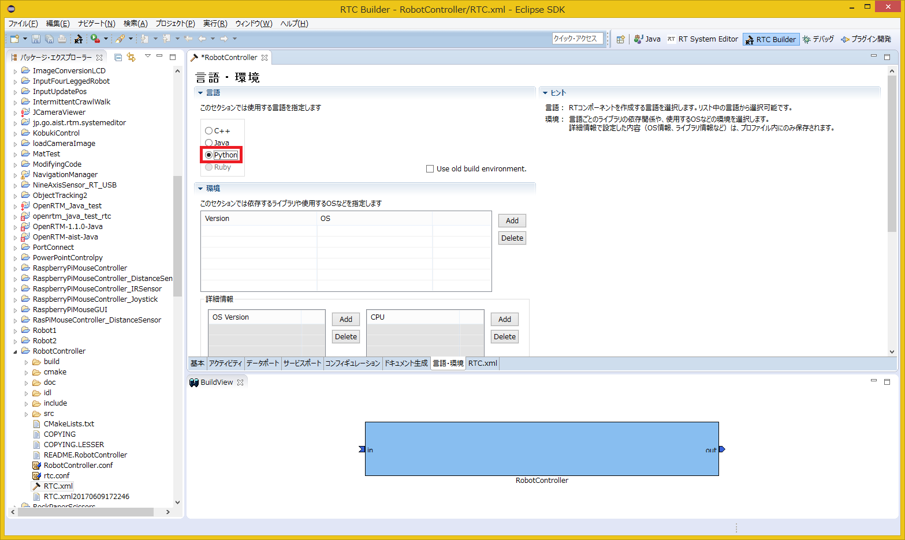
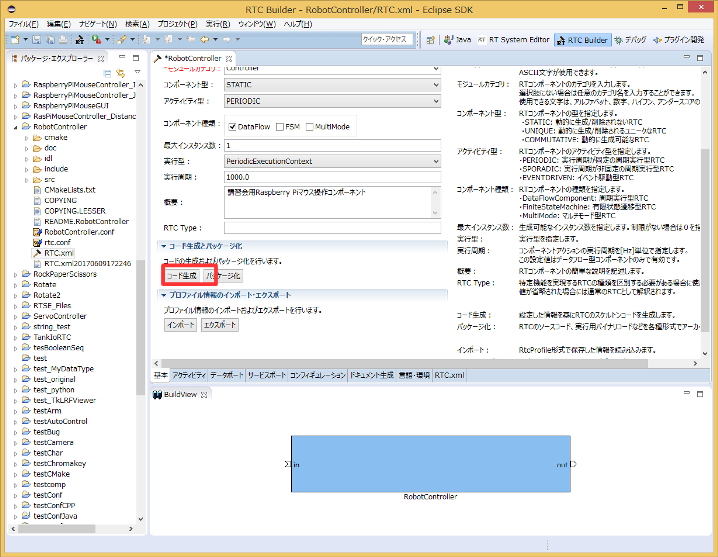
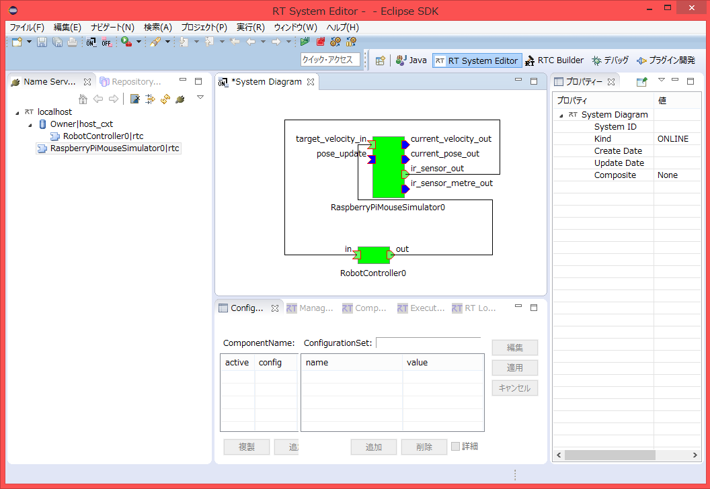
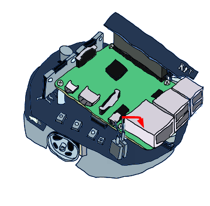
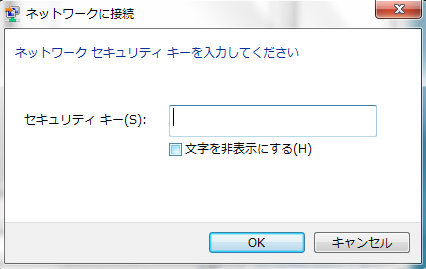
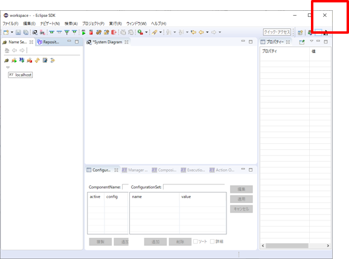
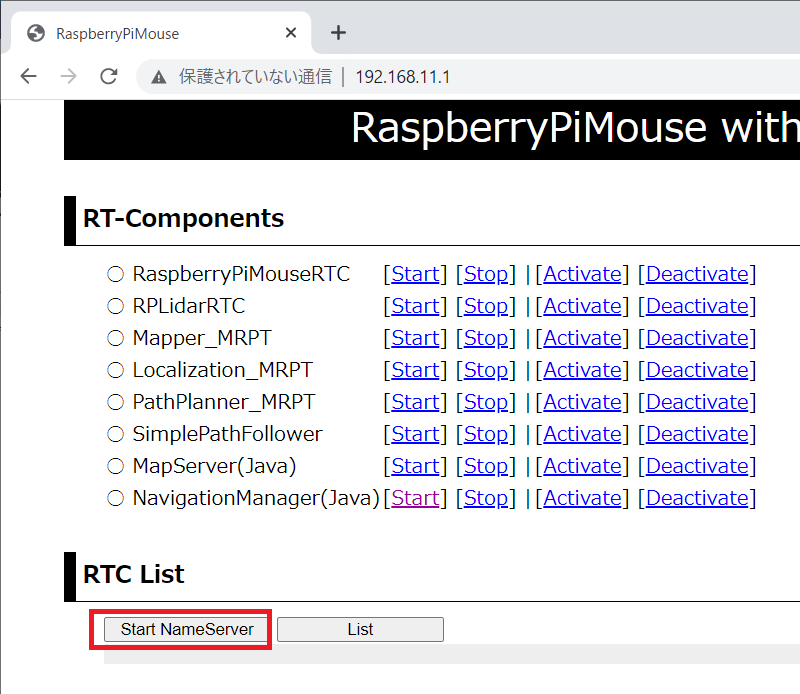

<!-- Title: チュートリアル(Raspberry Pi Mouse、Python、Windows、強化月間用) -->
#contents

## Introduction

This page explains the procedure for creating a component to control a Raspberry Pi Mouse running in a simulator.

<div align="center"><a href="raspimouse2.png"></a></div>

## Downloading the Materials

First, download the materials.

- [RTM_Tutorial_RaspberryPiMouse_Python.zip](https://github.com/OpenRTM/RTM_Tutorial_RaspberryPiMouse_Python)

Extract the ZIP file using [Lhaplus](http://forest.watch.impress.co.jp/library/software/lhaplus/) or a similar tool.

Workshops may sometimes be conducted in environments without Internet access. In that case, the files are included on the distributed USB memory device.

### Simulator

- [RaspberryPiMouseSimulator Component](http://www.openrtm.org/openrtm/ja/content/simulator_rtc_raspbian_raspimouse)

The simulator was developed using a physics engine called [Open Dynamics Engine (ODE)](http://www.ode.org/) and the drawing library (drawstuff) included with ODE.

Since it runs wherever OpenGL is available, it should work in most environments.

It simulates the following robot, the [Raspberry Pi Mouse](http://products.rt-net.jp/micromouse/raspberry-pi-mouse).

<div align="center"><a href="s_DSC00444.JPG"></a></div>

The simulator reproduces not only the dynamics calculations and contact responses of the Raspberry Pi Mouse, but also distance sensor data with values close to those of the actual robot.

### RT Component to Be Created

- RobotController Component

This component connects to the RaspberryPiMouseSimulator component and controls the robot in the simulator.

## Creating the RobotController Component

You will create a component that controls the robot in the simulator using a GUI (slider) and automatically stops when a sensor value exceeds a specified threshold.

<div align="center"><a href="robotcomp.png"></a></div>

### Creation Procedure

The creation procedure is as follows.

- Verify the development environment
- Define the component specifications
- Generate template source code using RTC Builder
- Edit the source code
- Verify component operation

### Verifying the Development Environment

The following environment is assumed.

- OS: Windows 8.1 (Windows 7 and 10 are also supported)
- [OpenRTM-aist: 1.2.2-Release](https://github.com/OpenRTM/OpenRTM-aist/releases/download/v1.2.2/OpenRTM-aist-1.2.2-RELEASE_x86_64.msi)
- [Python 3.8](https://www.python.org/downloads/windows/)
- Python editor
  - IDLE (included with Python)
  - [PythonWin](https://wiki.python.org/moin/PythonWin)
  - [PyScripter](https://sourceforge.net/projects/pyscripter/)
  - PyDev
  - Visual Studio Code

### Component Specifications

RobotController has an OutPort for outputting target velocity, an InPort for receiving sensor values, and configuration parameters for setting the target velocity and the sensor threshold for stopping.

<table class="table-alt">
  <tr>
    <th>Component Name</th>
    <th>RobotController</th>
  </tr>
  <tr>
    <td colspan="2" style="text-align: center;">InPort</td>
  </tr>
  <tr>
    <td>Port Name</td>
    <td>in</td>
  </tr>
  <tr>
    <td>Type</td>
    <td>TimedShortSeq</td>
  </tr>
  <tr>
    <td>Description</td>
    <td>Sensor values</td>
  </tr>
  <tr>
    <td colspan="2" style="text-align: center;">OutPort</td>
  </tr>
  <tr>
    <td>Port Name</td>
    <td>out</td>
  </tr>
  <tr>
    <td>Type</td>
    <td>TimedVelocity2D</td>
  </tr>
  <tr>
    <td>Description</td>
    <td>Target velocity</td>
  </tr>
  <tr>
    <td colspan="2" style="text-align: center;">Configuration</td>
  </tr>
  <tr>
    <td>Parameter Name</td>
    <td>speed_x</td>
  </tr>
  <tr>
    <td>Type</td>
    <td>double</td>
  </tr>
  <tr>
    <td>Default Value</td>
    <td>0.0</td>
  </tr>
  <tr>
    <td>Constraint</td>
    <td>-1.5&lt;x&lt;1.5</td>
  </tr>
  <tr>
    <td>Widget</td>
    <td>slider</td>
  </tr>
  <tr>
    <td>Step</td>
    <td>0.01</td>
  </tr>
  <tr>
    <td>Description</td>
    <td>Forward velocity setting</td>
  </tr>
  <tr>
    <td colspan="2" style="text-align: center;">Configuration</td>
  </tr>
  <tr>
    <td>Parameter Name</td>
    <td>speed_r</td>
  </tr>
  <tr>
    <td>Type</td>
    <td>double</td>
  </tr>
  <tr>
    <td>Default Value</td>
    <td>0.0</td>
  </tr>
  <tr>
    <td>Constraint</td>
    <td>-2.0&lt;x&lt;2.0</td>
  </tr>
  <tr>
    <td>Widget</td>
    <td>slider</td>
  </tr>
  <tr>
    <td>Step</td>
    <td>0.01</td>
  </tr>
  <tr>
    <td>Description</td>
    <td>Rotational velocity setting</td>
  </tr>
  <tr>
    <td colspan="2" style="text-align: center;">Configuration</td>
  </tr>
  <tr>
    <td>Parameter Name</td>
    <td>stop_d</td>
  </tr>
  <tr>
    <td>Type</td>
    <td>int</td>
  </tr>
  <tr>
    <td>Default Value</td>
    <td>30</td>
  </tr>
  <tr>
    <td>Description</td>
    <td>Sensor value threshold for stopping</td>
  </tr>
</table>

#### About the TimedVelocity2D Type

The TimedVelocity2D type is used to store the movement velocity of a mobile robot on a two-dimensional plane.

```cpp
     struct Velocity2D
     {
           /// Velocity along the x axis in metres per second.
           double vx;
           /// Velocity along the y axis in metres per second.
           double vy;
           /// Yaw velocity in radians per second.
           double va;
     };
 
 
     struct TimedVelocity2D
     {
           Time tm;
           Velocity2D data;
     };
```

This data type stores the X-axis velocity **vx**, Y-axis velocity **vy**, and rotational velocity around the Z-axis **va**.

**vx**, **vy**, and **va** represent velocities in the robot-centered coordinate system.

<br>

<div align="center"><a href="tu_ev3_20.png"></a></div>
<br>

**vx** is the velocity in the X direction, **vy** is the velocity in the Y direction, and **va** is the angular velocity around the Z axis.

For robots such as the Raspberry Pi Mouse, which have two wheels mounted on the left and right sides, **vy** is assumed to be 0 because lateral slipping is ignored.

The robot is controlled by specifying the forward velocity **vx** and rotational velocity **va**.

#### About Distance Sensor Data

The distance sensor of the Raspberry Pi Mouse outputs larger values as an object gets closer.

<br>

<div align="center"><a href="rpm14_graph.png"></a></div>
<br>

<table class="table-alt">
  <tr>
    <th>Value Obtained from Device File</th>
    <th>Actual Distance [m]</th>
  </tr>
  <tr><td>1394</td><td>0.01</td></tr>
  <tr><td>792</td><td>0.02</td></tr>
  <tr><td>525</td><td>0.03</td></tr>
  <tr><td>373</td><td>0.04</td></tr>
  <tr><td>299</td><td>0.05</td></tr>
  <tr><td>260</td><td>0.06</td></tr>
  <tr><td>222</td><td>0.07</td></tr>
  <tr><td>181</td><td>0.08</td></tr>
  <tr><td>135</td><td>0.09</td></tr>
  <tr><td>100</td><td>0.10</td></tr>
  <tr><td>81</td><td>0.15</td></tr>
  <tr><td>36</td><td>0.20</td></tr>
  <tr><td>17</td><td>0.25</td></tr>
  <tr><td>16</td><td>0.30</td></tr>
</table>

The simulator reproduces these values.

The RobotController component implements processing to automatically stop when these values exceed a specified threshold.


### Generating Template Code for the RobotController Component

Template code for the RobotController component is generated using RTCBuilder.

#### Starting RTCBuilder

In Eclipse, the folder used for development work is called a "Workspace," and in principle all generated files are stored under this folder.

The workspace can be created anywhere as long as it is accessible, but this tutorial assumes the following workspace.

- C:\workspace

First, start Eclipse.

For Windows 8.1, select "Start" > "Apps View (lower-right arrow)" > "OpenRTM-aist 1.1.2" > "OpenRTP".

When Eclipse starts, you will be asked to specify the workspace location. Specify the workspace described above.

<div align="center"><a href="install40.png"></a></div>

Then the following Welcome page will be displayed.

<br>

<div align="center"><a href="install41.png"></a></div>
<div align="center"><strong>Screen Displayed When Eclipse Starts for the First Time</strong></div>

The Welcome page is not needed now, so click the "×" button in the upper-left corner to close it.

Click the [Open Perspective] button in the upper-right corner.

<div align="center"><a href="install42.png"></a></div>
<div align="center"><strong>Switching Perspectives</strong></div>

Select "RTC Builder" to start RTCBuilder. The RTCBuilder icon ("Hammer and RT") will appear in the menu bar.

<div align="center"><a href="install43.png"></a></div>
<div align="center"><strong>Selecting a Perspective</strong></div>

#### Creating a New Project

To create the RobotController component, you must first create a new project in RTCBuilder.

Click the [Open New RTCBuilder Editor] icon in the upper-left corner.

<div align="center"><a href="CreateProject_0.png"></a></div>
<div align="center"><strong>Creating an RTC Builder Project</strong></div>

Enter the project name to create (in this example, **RobotController**) in the "Project Name" field and click the [Finish] button.

<div align="center"><a href="RT-Component-BuilderProject_1.png"></a></div>

A project with the specified name will be generated and added to the Package Explorer.

<div align="center"><a href="PackageExplolrer_1.png"></a></div>

Within the generated project, an RTC profile XML file (RTC.xml) with default values is automatically created.

#### Starting the RTC Profile Editor

When RTC.xml is generated, the RTCBuilder editor associated with this project should open automatically.

If it does not start, double-click RTC.xml in the Package Explorer.

<div align="center"><a href="Open_RTCBuilder_0.png"></a></div>

#### Entering Profile Information and Generating Code

First, select the leftmost "Basic" tab and enter the basic information.

In addition to the RobotController component name defined earlier, enter a description, version number, and other information.

Fields with red labels are required. All other fields can remain at their default values.

- Module Name: RobotController
- Module Description: Optional (Robot Controller component)
- Version: Optional (1.0.0)
- Vendor: Optional
- Module Category: Optional (Controller)

<br>

<div align="center"><a href="Basic_1.png"></a></div>
<div align="center"><strong>Entering Basic Information</strong></div>
<br>

Next, select the "Activity" tab and specify the action callbacks to use.

The RobotController component uses the onActivated(), onDeactivated(), and onExecute() callbacks.

As shown below, click onActivated (①) and then select [ON] using the radio button (②).

Perform the same procedure for onDeactivated and onExecute.

<br>

<div align="center"><a href="Activity_1.png"></a></div>
<div align="center"><strong>Selecting Activity Callbacks</strong></div>
<br>

Next, select the "Data Ports" tab and enter the data port information.

Enter the information according to the specifications defined earlier.

Variable names and display positions are optional and may be left unchanged.

<br>

- InPort Profile:
  - Port Name: in
  - Data Type: TimedShortSeq

<br>

- OutPort Profile:
  - Port Name: out
  - Data Type: TimedVelocity2D

<br>

<div align="center"><a href="DataPort_1.png"></a></div>
<div align="center"><strong>Entering Data Port Information</strong></div>
<br>

Next, select the "Configuration" tab and enter the Configuration information according to the specifications defined earlier.

Constraint conditions and Widgets are used by RTSystemEditor when displaying component configuration parameters, allowing values to be changed through GUI elements such as sliders, spin buttons, and radio buttons.

The forward velocity speed_x and rotational velocity speed_r will be adjustable using sliders.

<br>

- speed_x
  - Name: speed_x
  - Data Type: double
  - Default Value: 0.0
  - Constraint: -1.5&lt;:x&lt;:1.5
  - Widget: slider
  - Step: 0.01

- speed_r
  - Name: speed_r
  - Data Type: double
  - Default Value: 0.0
  - Constraint: -2.0&lt;:x&lt;:2.0
  - Widget: slider
  - Step: 0.01

- stop_d
  - Name: stop_d
  - Data Type: int
  - Default Value: 30
  - Widget: text

<br>

<div align="center"><a href="Configuration_1.png"></a></div>
<div align="center"><strong>Entering Configuration Information</strong></div>
<br>

Next, select the "Language / Environment" tab and choose the programming language.

In this tutorial, select Python as the language.

Note that no default value is set for the language/environment field. If you forget to specify a language, code generation will fail, so be sure to select one.

<div align="center"><a href="Language_1_2.png"></a></div>
<div align="center"><strong>Selecting the Programming Language</strong></div>
<br>

Finally, return to the "Basic" tab and click the [Generate Code] button to generate the component template code.

<br>

<div align="center"><a href="Generate_1.png"></a></div>
<div align="center"><strong>Generating Template Code (Generate)</strong></div>
<br>

<span style="color:red;">* The generated code files are created inside the workspace folder specified when Eclipse was started. You can check the current workspace from [File] > [Switch Workspace...].</span>

### Editing the Source Code

Open `<Workspace Directory>/RobotController/RobotController.py` with a Python editor and edit it.

If you are using IDLE, which is included with Python, right-click the file and select <strong>Edit with IDLE</strong>.

<br>
<div align="center"><a href="idle_1.png"></a></div>

#### Modifying Variable Initialization

If you are using RTC Builder included with OpenRTM-aist 1.1.2, you must modify the variable initialization section.

(This issue is planned to be fixed in OpenRTM-aist 1.2.0.)

First, modify the initialization of the **self._d_in** variable in the `__init__` function.

```python
 	def __init__(self, manager):
 		OpenRTM_aist.DataFlowComponentBase.__init__(self, manager)

 		#in_arg = [None] * ((len(RTC._d_TimedShortSeq) - 4) / 2) ← Delete
 		#self._d_in = RTC.TimedShortSeq(*in_arg) ← Delete
 		#Add the following line
 		self._d_in = RTC.TimedShortSeq(RTC.Time(0,0),[])
```

Next, modify the initialization of the **self._d_out** variable.

```python
 		#out_arg = [None] * ((len(RTC._d_TimedVelocity2D) - 4) / 2) ← Delete
 		#self._d_out = RTC.TimedVelocity2D(*out_arg) ← Delete
 		#Add the following line
 		self._d_out = RTC.TimedVelocity2D(RTC.Time(0,0),RTC.Velocity2D(0.0,0.0,0.0))
```

This completes the modification.


#### Implementing Activity Processing

In the RobotController component, the configuration parameters (speed_x and speed_y) are controlled with sliders, and their values are output from the OutPort (out) as the target velocity.

Values input from the InPort (in) are stored in a variable, and if the values exceed a specified threshold, the robot stops.

<br>
The processing performed in onActivated(), onExecute(), and onDeactivated() is shown below.
<br>

<div align="center"><a href="RCRTC_State_1.png"></a></div>
<div align="center"><strong>Overview of Activity Processing</strong></div>
<br>

Implement onActivated(), onDeactivated(), and onExecute() as follows.

```python
 	def onActivated(self, ec_id):
 		#センサー値初期化
 		self.sensor_data = [0,0,0,0]
 		return RTC.RTC_OK
```

```python
 	def onDeactivated(self, ec_id):
 		#ロボットを停止する
 		self._d_out.data.vx = 0
 		self._d_out.data.va = 0
 		self._outOut.write()
 		return RTC.RTC_OK
```

```python
 	def onExecute(self, ec_id):
 		#入力データの存在確認
 		if self._inIn.isNew():
 			data = self._inIn.read()
 			#この時点で入力データがm_inに格納される
 			#入力データを別変数に格納
 			self.sensor_data = data.data[:]
 		#前進するときのみ停止するかを判定
 		if self._speed_x[0] > 0:
 			for d in self.sensor_data:
 				#センサ値が設定値以上か判定
 				if d > self._stop_d[0]:
 					#センサ値が設定値以上の場合は停止
 					self._d_out.data.vx = 0
 					self._d_out.data.va = 0
 					self._outOut.write()
 					return RTC.RTC_OK
 				
 		#設定値以上の値のセンサが無い場合はコンフィギュレーションパラメータの値で操作
 		self._d_out.data.vx = self._speed_x[0]
 		self._d_out.data.va = self._speed_r[0]
 		self._outOut.write()
 				
 		return RTC.RTC_OK
```

## Verifying Operation of the RobotController Component

Connect the created RobotController to the simulator component and verify its operation.

Download the RaspberryPiMouseSimulator component from the following link.

- [RTM_Tutorial_2017](https://github.com/Nobu19800/RTM_Tutorial_JSAI2017/archive/master.zip)

Extract the ZIP file using [Lhaplus](http://forest.watch.impress.co.jp/library/software/lhaplus/) or a similar tool.

Workshops may sometimes be conducted in environments without Internet access. In that case, the files are included on the distributed USB memory device.

### Starting NameService

Start the Name Service used to register component references.

<br>
Select "Start" > "Apps View (lower-right arrow)" > "OpenRTM-aist 1.1.2", then click "Start Naming Service".

<span style="color:red;">* If omniNames does not start even after clicking "Start Naming Service", check whether the full computer name is set to 14 characters or fewer.</span>

### Starting the RobotController Component

Start the RobotController component.

Double-click and execute the RobotControllerComp.py file.

### Starting the Simulator Component

This component starts by executing EXE/RaspberryPiMouseSimulatorComp.exe in the folder extracted from the previously downloaded file (RTM_Tutorial_2017.zip).

### Connecting the Components

In RTSystemEditor, connect the RobotController component and RaspberryPiMouseSimulator component as shown below.

<div align="center"><a href="RTSE_Connect_1.png"></a></div>
<div align="center"><strong>Connecting the Components</strong></div>

### Activating the Components

Click the [All Activate] icon at the top of RTSystemEditor to activate all components.

If activation succeeds, the components are displayed in yellow-green as shown below.

<br>

<div align="center"><a href="RTSE_Activate_1.png"></a></div>
<div align="center"><strong>Activating the Components</strong></div>
<br>

### Operation Check

As shown below, you can change the configuration from the [Edit] button in the Configuration View.

<br>

<div align="center"><a href="RTSE_Configuration_10.png"></a></div>
<br>

Operate the sliders and check whether you can control the [Raspberry Pi] Mouse in the simulator.

<br>

<div align="center"><a href="RTSE_Configuration_1.png"></a></div>
<div align="center"><strong>Changing Configuration Parameters</strong></div>
<br>

## Operation Check on the Actual Robot

If an actual Raspberry Pi Mouse is available in the workshop, you can verify operation on the real robot.

The procedure is as follows.

- Turn on the Raspberry Pi Mouse
- Connect to the Raspberry Pi Mouse access point
- Connect the ports
- Activate the components

### Turning On the Power

The Raspberry Pi Mouse has two power switches: one for the Raspberry Pi and one for the motors.

<br>

<div align="center"><a href="rpm8_raspi.png"></a></div>

<br>

Turning on the inner power switch starts the Raspberry Pi.

<br>

<div align="center"><a href="rpm9_raspi.png"></a></div>

<br>

#### Turning Off the Power

When turning off the Raspberry Pi, do not turn it off directly using the power switch.

Press and hold the center button among the three aligned buttons for a few seconds to start shutdown.

After Raspbian finishes shutting down in about 10 seconds, turn off the power switch.

<br>

<div align="center"><a href="rpm8.png"></a></div>
<br>

### Connecting to the Access Point

Refer to the following pages for how to connect to an access point.

- [How to Connect to Wireless LAN on Windows 7](http://121ware.com/qasearch/1007/app/servlet/qadoc?QID=011120)
- [How to Connect to Wireless LAN on Windows 8 / 8.1](http://121ware.com/qasearch/1007/app/servlet/relatedqa?QID=014183)

The SSID and password are written on the label attached to the Raspberry Pi Mouse.

First, click the network icon in the lower-right corner.

<br>

<div align="center"><a href="tu_ev3_14.png"></a></div>
<br>

Next, select raspberrypi_*** from the list.

<br>

<div align="center"><a href="tu_ev3_15.png"></a></div>
<br>

Enter the password.

<br>

<div align="center"><a href="tu_ev3_12.png"></a></div>
<br>

*When the network is switched, component registration with the Name Server or port connection may fail. Therefore, exit OpenRTP, the Name Server, and all components once.*

If they were started after switching the network, there is no problem, so you do not need to exit them.

To exit OpenRTP, click the × button in the upper-right corner. You will be asked whether to save the system diagram; select Don't Save.

<div align="center"><a href="rtse0150.png"></a></div>

Start OpenRTP by double-clicking the desktop shortcut.

To restart the Name Server in RT System Editor, click the "Start Name Service" button again.

<div align="center"><a href="rtse400.png"></a></div>

### Starting the Name Server and RTC on Raspberry Pi

**This step is required for the following Raspberry Pi Mouse with LiDAR. If you are using a Raspberry Pi Mouse without LiDAR, proceed to the next step.**

<div align="center"><a href="https://rt-net.jp/mobility/wp-content/uploads/2019/12/23b47429c42d672e7f94ae0a3c9c9d6c.png"></a></div>

Access the address **192.168.11.1** using a web browser such as Edge, Chrome, or Firefox.

<div align="center"><a href="slam40.png"></a></div>

The RaspberryPiMouse with OpenRTM-aist screen will then be displayed.

First, click the **Start NameServer** button to start the Name Server.

<div align="center"><a href="slam42.png"></a></div>

Click **Start** for **RaspberryPiMouseRTC**.

<div align="center"><a href="slam41.png"></a></div>

If the original screen does not return, click **Back to the top page.**

<div align="center"><a href="slam43.png"></a></div>

This completes the procedure.

### Adding the Name Server

Next, use the [Add Name Server] button in RT System Editor to add <span style="color:red;">192.168.11.1</span>.

<br>

<div align="center"><div align="center"><a href="tutorial_raspimouse0.png"></a></div>;  <div align="center"><a href="tutorial_raspimouse1.png"></a></div>;</div>
<br>
<br>

The following two RTCs will then become visible.

<div align="center"><a href="tutorial_raspimouse2.png"></a></div>

- [RaspberryPiMouseRTC]({{ site.baseurl }}/en/doc/casestudy/raspberrypi_mouse/raspimouse_rtc_on_raspbian#toc0)
- [RaspberryPiMouseController_DistanceSensor]({{ site.baseurl }}/en/doc/casestudy/raspberrypi_mouse/raspimouse_rtc_on_raspbian#toc1)

RaspberryPiMouseRTC is an RT component for controlling the Raspberry Pi Mouse, developed by the Robot System Design Laboratory at Meijo University.

### Connecting the Ports

In RT System Editor, connect the RaspberryPiMouseRTC and RobotController components as shown below.

<div align="center"><a href="tutorial_raspimouse41.png"></a></div>

### Turning On the Motor Power

Before operation, turn on the motor power switch.

Be sure to turn off the motor power frequently when it is not needed.

<br>

<div align="center"><a href="rpm10_raspi.png"></a></div>

<br>

### Activation

When you activate the RTCs, you will be able to control the Raspberry Pi Mouse.

## Summary

In this tutorial, you learned:

- How to create a RobotController component for controlling a Raspberry Pi Mouse in a simulator.
- How to define RTC specifications, including InPorts, OutPorts, and configuration parameters.
- How to generate Python template code using RTCBuilder.
- How to edit the generated RobotController.py source code.
- How to implement activity processing for activation, execution, and deactivation.
- How to connect RobotController to RaspberryPiMouseSimulator and verify operation in RTSystemEditor.
- How to operate the simulator using configuration sliders.
- How to connect to an actual Raspberry Pi Mouse access point and verify operation on real hardware.
- How to start the Name Server and RTC on the Raspberry Pi Mouse when required.
- How to connect RaspberryPiMouseRTC and RobotController and activate the RTCs.

By completing this tutorial, you have learned how to build, edit, connect, and operate a Python-based RobotController RTC for controlling a Raspberry Pi Mouse in both simulation and actual hardware environments.

