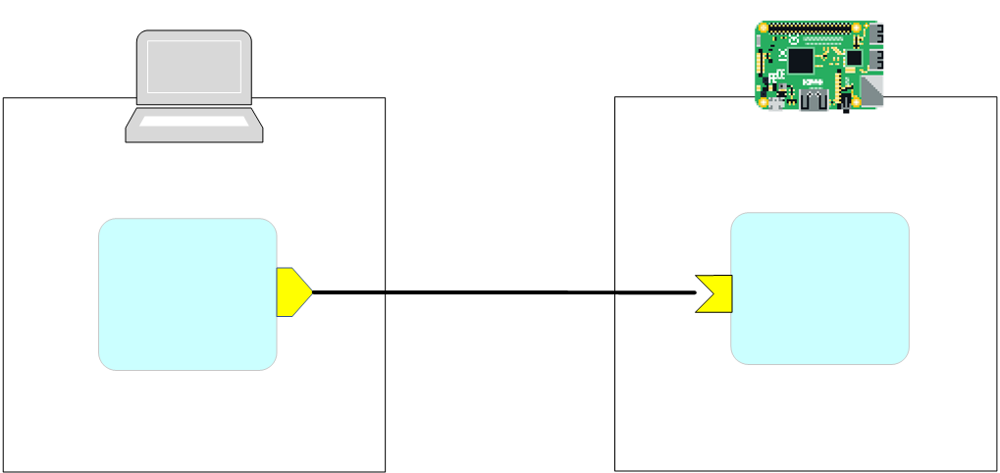
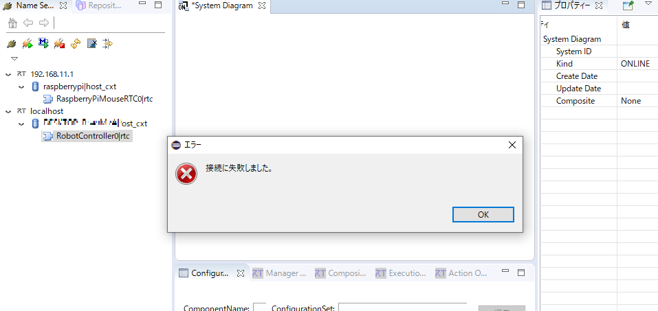
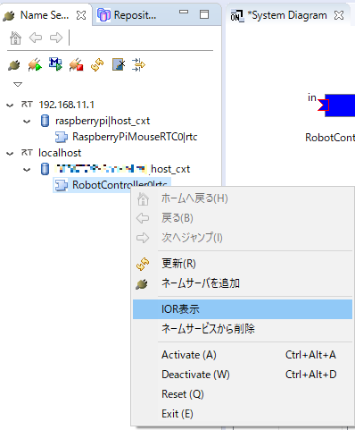
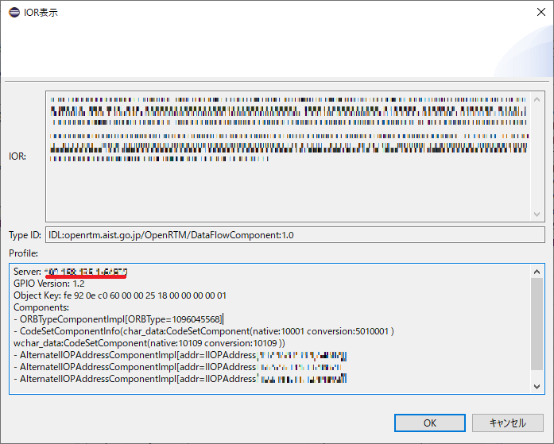
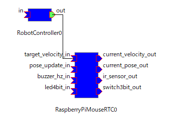
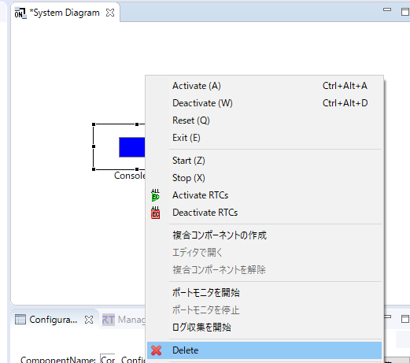

<!-- ポートの接続に失敗した場合の対処方法 -->
#contents

## Introduction

This page explains how to resolve issues that occur when connecting data ports or service ports between RTCs running on different machines.

<div align="center"><a href="iorkakunin6.png"></a></div>

## When RTSystemEditor Displays "Connection Failed"

If RTSystemEditor displays "Connection Failed" as shown below, the endpoint configuration may be incorrect, or communication may be blocked by a firewall or similar software.

<div align="center"><a href="iorkakunin3.png"></a></div>

### When Communication Is Blocked by a Firewall
<a name="firewall"></a>

For Windows Firewall, you must either disable the firewall or configure it to allow communication for RobotController.exe.

- [Windows 10 – Allow/Block App Communication Through the Firewall](https://pc-karuma.net/windows-10-firewall-app-allow-communicate/)

If communication is blocked by the firewall included with antivirus software, refer to the manual of the antivirus software you are using and configure it appropriately.

### When the Endpoint Is Configured with an Unreachable Address

Open Command Prompt and use the ipconfig command to check the IP address.

- [ipconfig Command](https://www.pc-master.jp/trouble/ipconfig.html)

When connected to the Raspberry Pi Mouse access point used in the workshop, an IP address in the range 192.168.11.** should be assigned.

For the EV3 access point, the address range is 192.168.0.**.

Next, check the endpoint configuration of the RTC running on the PC.

In the Name Service View of RTSystemEditor, right-click the RTC and display the IOR.

<div align="center"><a href="iorkakunin1.png"></a></div>

You can check the IP address from the Profile section of the IOR display screen.

<div align="center"><a href="iorkakunin2.png"></a></div>

If the IP address displayed here is not 192.168.11.** (or 192.168.0.**), you must configure the endpoint when starting the RTC.

Configure it using the **corba.endpoints** option in rtc.conf.

```text
 corba.endpoints: 192.168.11.**
```

Open rtc.conf in a text editor, edit it, place it in the same folder as the RTC executable, and start the RTC, or specify rtc.conf using a command-line option.

```sh
 RobotControllerComp.exe -f rtc.conf
```

Alternatively, you can configure **corba.endpoints** directly from the command line.

```sh
 RobotControllerComp.exe -o corba.endpoints:192.168.11.**
```

## When Only One Data Port Changes Color or No Connector Is Displayed

After connecting data ports in RTSystemEditor, there are cases where only one side of the data port changes color as shown below.

<div align="center"><a href="iorkakunin4.png"></a></div>

In some cases, the connector may not be displayed at all.

If this occurs, temporarily remove the RTC from the System Diagram. *This is not the same as exiting (exit).*

Select the RTC and press the Delete key, or right-click it and select Delete.

<div align="center"><a href="iorkakunin7.png"></a></div>

After removing it, drag and drop the RTC from the Name Service View onto the System Diagram again.

If the issue is resolved, it was most likely caused by the RTSystemEditor Component Observer feature.

In most cases, restarting OpenRTP resolves the problem.

## When RTSystemEditor Becomes Unresponsive

RTSystemEditor may become unresponsive, or it may eventually recover after some time while only one port changes color.

In most cases, this is caused by [communication being blocked by a firewall or similar software](/ja/node/7103#firewall).

If that does not resolve the issue, restart the RTCs running on the Raspberry Pi or EV3.

The RTC may have become unresponsive due to a runtime issue.

In addition, problems may occur if the System Diagram has been used for a long time.

Close the System Diagram by clicking the × button, then display the System Diagram again.

## Summary

In this tutorial, you learned:

- How to troubleshoot failed port connections between RTCs running on different machines.
- How to identify firewall-related communication problems.
- How to check and configure RTC endpoint settings using rtc.conf and command-line options.
- How to verify RTC IP address settings using the IOR display in RTSystemEditor.
- How to resolve issues where only one data port changes color or connectors are not displayed.
- How to refresh RTCs in the System Diagram by removing and re-adding them.
- How to troubleshoot situations where RTSystemEditor becomes unresponsive.
- How to restart RTCs and refresh the System Diagram when communication issues occur.

By completing this tutorial, you have learned how to diagnose and resolve common port connection and communication problems in RTSystemEditor and OpenRTM systems.
