<!-- チュートリアル(画像処理実習) -->
#contents

## Introduction

This page explains the procedure for creating an RTC that detects shapes using OpenCV image processing and makes a mobile robot (Raspberry Pi Mouse) follow them. :contentReference[oaicite:0]{index=0}

## RT Component to Be Created

- CircleTracking Component: An RTC that detects circles from images using the OpenCV library's HoughCircles function and controls the mobile robot to rotate toward the detected circle. :contentReference[oaicite:1]{index=1}

<div align="center"><a href="opencv10.jpg">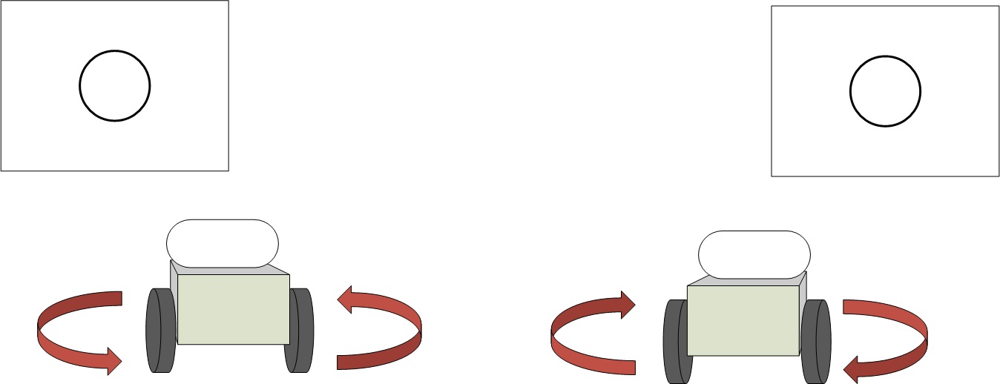</a></div>

## About the HoughCircles Function

HoughCircles is a function that detects circles from grayscale images using the Hough Transform.

For details, refer to the following page.

- [Feature Detection — opencv 2.2 documentation](http://opencv.jp/opencv-2svn/cpp/feature_detection.html#cv-houghcircles)

## RTC Overview

After converting images captured by a camera into grayscale images, circles are detected using the HoughCircles function.

The robot is controlled so that it rotates toward the detected circle.

Specifically, when the detected circle is located on the right side of the image, a clockwise rotational target velocity is commanded; when it is located on the left side, a counterclockwise rotational target velocity is commanded.

For operation verification, an image containing circle position information is also output. :contentReference[oaicite:2]{index=2}

<div align="center"><a href="opencv2.jpg">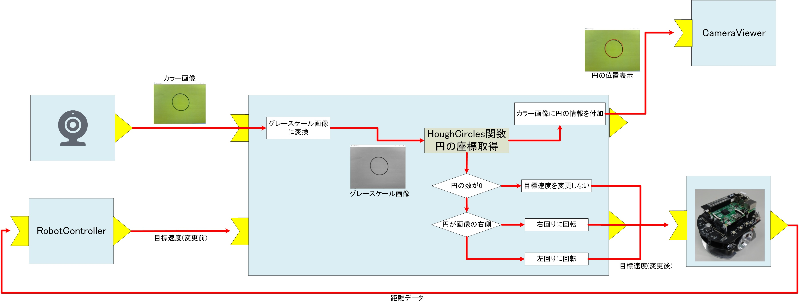</a></div>

## Creating the RTC

The following explanation assumes that you already understand the basic procedure for creating RTCs.

Refer to the following page for the basic creation procedure.

- [Tutorial (Raspberry Pi Mouse, RTM Seminar)](https://openrtm.org/openrtm/ja/node/6549)

### Generating Template Code with RTCBuilder

Use RTCBuilder to generate template code for an RTC with the following specifications. :contentReference[oaicite:3]{index=3}

<table class="table-alt">
  <tr>
    <th>Component Name</th>
    <th>CircleTracking</th>
  </tr>
  <tr>
    <td>Activity</td>
    <td>onActivated, onDeactivated, onExecute</td>
  </tr>
  <tr>
    <td>Language</td>
    <td>C++</td>
  </tr>
  <tr>
    <td colspan="2" style="text-align: center;">InPort</td>
  </tr>
  <tr>
    <td>Port Name</td>
    <td>image_in</td>
  </tr>
  <tr>
    <td>Type</td>
    <td>RTC::CameraImage</td>
  </tr>
  <tr>
    <td>Description</td>
    <td>Input image</td>
  </tr>
  <tr>
    <td colspan="2" style="text-align: center;">InPort</td>
  </tr>
  <tr>
    <td>Port Name</td>
    <td>velocity_in</td>
  </tr>
  <tr>
    <td>Type</td>
    <td>RTC::TimedVelocity2D</td>
  </tr>
  <tr>
    <td>Description</td>
    <td>Target velocity before modification</td>
  </tr>
  <tr>
    <td colspan="2" style="text-align: center;">OutPort</td>
  </tr>
  <tr>
    <td>Port Name</td>
    <td>image_out</td>
  </tr>
  <tr>
    <td>Type</td>
    <td>RTC::CameraImage</td>
  </tr>
  <tr>
    <td>Description</td>
    <td>Image with circle information added</td>
  </tr>
  <tr>
    <td colspan="2" style="text-align: center;">OutPort</td>
  </tr>
  <tr>
    <td>Port Name</td>
    <td>velocity_out</td>
  </tr>
  <tr>
    <td>Type</td>
    <td>RTC::TimedVelocity2D</td>
  </tr>
  <tr>
    <td>Description</td>
    <td>Modified target velocity</td>
  </tr>
  <tr>
    <td colspan="2" style="text-align: center;">Configuration</td>
  </tr>
  <tr>
    <td>Parameter Name</td>
    <td>speed_r</td>
  </tr>
  <tr>
    <td>Type</td>
    <td>double</td>
  </tr>
  <tr>
    <td>Default Value</td>
    <td>0.5</td>
  </tr>
  <tr>
    <td>Constraint</td>
    <td>0.0&lt;x&lt;2.0</td>
  </tr>
  <tr>
    <td>Widget</td>
    <td>slider</td>
  </tr>
  <tr>
    <td>Step</td>
    <td>0.01</td>
  </tr>
  <tr>
    <td>Description</td>
    <td>Rotational speed used when rotating left or right according to the shape position</td>
  </tr>
  <tr>
    <td>Configuration</td>
  </tr>
  <tr>
    <td>Parameter Name</td>
    <td>houghcircles_dp</td>
  </tr>
  <tr>
    <td>Type</td>
    <td>double</td>
  </tr>
  <tr>
    <td>Default Value</td>
    <td>2</td>
  </tr>
  <tr>
    <td>Widget</td>
    <td>text</td>
  </tr>
  <tr>
    <td>Description</td>
    <td>dp argument of the HoughCircles function</td>
  </tr>
  <tr>
    <td colspan="2" style="text-align: center;">Configuration</td>
  </tr>
  <tr>
    <td>Parameter Name</td>
    <td>houghcircles_minDist</td>
  </tr>
  <tr>
    <td>Type</td>
    <td>double</td>
  </tr>
  <tr>
    <td>Default Value</td>
    <td>30</td>
  </tr>
  <tr>
    <td>Widget</td>
    <td>text</td>
  </tr>
  <tr>
    <td>Description</td>
    <td>minDist argument of the HoughCircles function</td>
  </tr>
  <tr>
    <td colspan="2" style="text-align: center;">Configuration</td>
  </tr>
  <tr>
    <td>Parameter Name</td>
    <td>houghcircles_param1</td>
  </tr>
  <tr>
    <td>Type</td>
    <td>double</td>
  </tr>
  <tr>
    <td>Default Value</td>
    <td>100</td>
  </tr>
  <tr>
    <td>Widget</td>
    <td>text</td>
  </tr>
  <tr>
    <td>Description</td>
    <td>param1 argument of the HoughCircles function</td>
  </tr>
</table>


<table class="table-alt">
  <tr>
    <td colspan="2" style="text-align: center;">Configuration</td>
  </tr>
  <tr>
    <td>Parameter Name</td>
    <td>houghcircles_param2</td>
  </tr>
  <tr>
    <td>Type</td>
    <td>double</td>
  </tr>
  <tr>
    <td>Default Value</td>
    <td>100</td>
  </tr>
  <tr>
    <td>Widget</td>
    <td>text</td>
  </tr>
  <tr>
    <td>Description</td>
    <td>param2 argument of the HoughCircles function</td>
  </tr>
  <tr>
    <td colspan="2" style="text-align: center;">Configuration</td>
  </tr>
  <tr>
    <td>Parameter Name</td>
    <td>houghcircles_minRadius</td>
  </tr>
  <tr>
    <td>Type</td>
    <td>int</td>
  </tr>
  <tr>
    <td>Default Value</td>
    <td>0</td>
  </tr>
  <tr>
    <td>Widget</td>
    <td>text</td>
  </tr>
  <tr>
    <td>Description</td>
    <td>minRadius argument of the HoughCircles function</td>
  </tr>
  <tr>
    <td colspan="2" style="text-align: center;">Configuration</td>
  </tr>
  <tr>
    <td>Parameter Name</td>
    <td>houghcircles_maxRadius</td>
  </tr>
  <tr>
    <td>Type</td>
    <td>int</td>
  </tr>
  <tr>
    <td>Default Value</td>
    <td>0</td>
  </tr>
  <tr>
    <td>Widget</td>
    <td>text</td>
  </tr>
  <tr>
    <td>Description</td>
    <td>maxRadius argument of the HoughCircles function</td>
  </tr>
</table>

## About the RTC::CameraImage Type

The RTC::CameraImage type is a data type used to store image data.

```cpp
    struct CameraImage
    {
        /// Time stamp.
        Time tm;
        /// Image pixel width.
        unsigned short width;
        /// Image pixel height.
        unsigned short height;
        /// Bits per pixel.
        unsigned short bpp;
        /// Image format (e.g. bitmap, jpeg, etc.).
        string format;
        /// Scale factor for images, such as disparity maps, where the integer pixel value should be divided by this factor to get the real pixel value.
        double fDiv;
        /// Raw pixel data.
        sequence<octet> pixels;
    };
```

This data type can store the image width **width**, image height **height**, image data **pixels**, and other values.

<div align="center"><a href="CameraImage.png">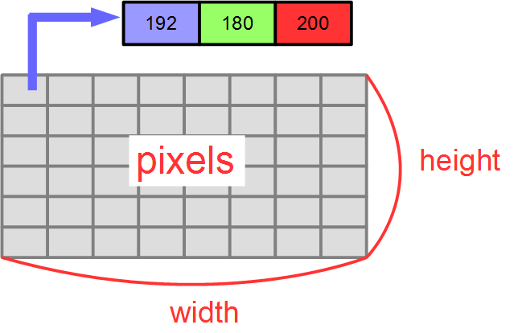</a></div>

## Editing Files

Edit the following files.

- src/CMakeLists.txt
- include/CircleTracking/CircleTracking.h
- src/CircleTracking.cpp

### Editing src/CMakeLists.txt

Open **CMakeLists.txt** in the **src** folder with Notepad or another editor and edit it.

Here, you will configure settings for using OpenCV.

Detect the OpenCV library using **find_package** as shown below.

Add the find_package line.

```cmake
 set(comp_srcs CircleTracking.cpp )
 set(standalone_srcs CircleTrackingComp.cpp)
 
 find_package(OpenCV REQUIRED) # Add
```

Next, add the OpenCV libraries to the linked libraries.

Modify the following two locations.

```cmake
 # target_link_libraries(${PROJECT_NAME} ${OPENRTM_LIBRARIES}) # Before modification
 target_link_libraries(${PROJECT_NAME} ${OPENRTM_LIBRARIES} ${OpenCV_LIBS}) # After modification: add ${OpenCV_LIBS}
```

```cmake
 # target_link_libraries(${PROJECT_NAME}Comp ${OPENRTM_LIBRARIES} ${OpenCV_LIBS}) # Before modification
 target_link_libraries(${PROJECT_NAME}Comp  ${OPENRTM_LIBRARIES} ${OpenCV_LIBS}) # After modification: add ${OpenCV_LIBS}
```

### include/CircleTracking/CircleTracking.h

Edit **include/CircleTracking/CircleTracking.h**.

First, add the include file around line 37.

```cpp
 #include <rtm/DataInPort.h>
 #include <rtm/DataOutPort.h>
 
 #include <opencv2/opencv.hpp> // Add
```

Around line 314, there is a line that says **private:**. Add the three member variables **m_imageBuff**, **m_outputBuff**, and **m_direction** below it.

```cpp
 private:
   cv::Mat m_imageBuff; // Add: variable for storing the input image
   cv::Mat m_outputBuff; // Add: variable for storing the image with circle information added
   int m_direction; // Add: variable for storing the rotation direction of the mobile robot
```

### src/CircleTracking.cpp

Edit **src/CircleTracking.cpp**.

Edit the three functions **onActivated**, **onDeactivated**, and **onExecute**.

```cpp
 RTC::ReturnCode_t CircleTracking::onActivated(RTC::UniqueId /*ec_id*/)
 {
   // OutPortの画面サイズを0に設定
   m_image_out.width = 0;
   m_image_out.height = 0;
 
   //進行方向を0(回転方向を指定しない)に設定
   m_direction = 0;
   return RTC::RTC_OK;
 }
```

```cpp
 RTC::ReturnCode_t CircleTracking::onDeactivated(RTC::UniqueId /*ec_id*/)
 {
   if (!m_outputBuff.empty())
   {
     // 画像用メモリの解放
     m_imageBuff.release();
     m_outputBuff.release();
   }
 
   return RTC::RTC_OK;
 }
```

```cpp
 RTC::ReturnCode_t CircleTracking::onExecute(RTC::UniqueId /*ec_id*/)
 {
   if (m_image_inIn.isNew()) {
     cv::Mat gray;
     std::vector<cv::Vec3f> circles;
     // 画像データの読み込み
     m_image_inIn.read();
 
     // InPortとOutPortの画面サイズ処理およびイメージ用メモリの確保
     if (m_image_in.width != m_image_out.width || m_image_in.height != m_image_out.height)
     {
       m_image_out.width = m_image_in.width;
       m_image_out.height = m_image_in.height;
 
       m_imageBuff.create(cv::Size(m_image_in.width, m_image_in.height), CV_8UC3);
       m_outputBuff.create(cv::Size(m_image_in.width, m_image_in.height), CV_8UC3);
 
     }
 
     // InPortの画像データをm_imageBuffにコピー
     std::memcpy(m_imageBuff.data, (void*)&(m_image_in.pixels[0]), m_image_in.pixels.length());
 
     //カラー画像をグレースケールに変換
     cv::cvtColor(m_imageBuff, gray, cv::COLOR_BGR2GRAY);
 
     //HoughCircles関数で円を検出する
     cv::HoughCircles(gray, circles, cv::HOUGH_GRADIENT, m_houghcircles_dp, m_houghcircles_minDist, 
       m_houghcircles_param1, m_houghcircles_param2, m_houghcircles_minRadius, m_houghcircles_maxRadius);
 
     
     //円を検出できた場合の処理
     if (!circles.empty())
     {
       //円の位置が画像の左側の場合は左回りに回転するように設定
       if (circles[0][0] < gray.cols / 2)
       {
         m_direction = 1;
       }
       //円の位置が画像の右側の場合は右回りに回転するように設定
       else
       {
         m_direction = 2;
       }
     }
     //円を検出できなかった場合は回転方向の指定をしないように設定
     else
     {
       m_direction = 0;
     }
 
     //元のカラー画像をコピーして円の情報を画像に追加
     m_outputBuff = m_imageBuff.clone();
 
     for (auto circle : circles)
     {
       cv::circle(m_outputBuff, cv::Point(static_cast<int>(circle[0]), static_cast<int>(circle[1])), static_cast<int>(circle[2]), cv::Scalar(0, 0, 255), 2);
     }
 
     // 画像データのサイズ取得
     int len = m_outputBuff.channels() * m_outputBuff.cols * m_outputBuff.rows;
     m_image_out.pixels.length(len);
 
     // 円の情報を付加した画像データをOutPortにコピー
     std::memcpy((void*)&(m_image_out.pixels[0]), m_outputBuff.data, len);
     //画像データを出力
     m_image_outOut.write();
   }
 
   if (m_velocity_inIn.isNew()) {
     //速度指令値を読み込み
     m_velocity_inIn.read();
     m_velocity_out = m_velocity_in;
     
     //円が画像の左側にある場合、左回りに回転する
     if (m_direction == 1)
     {
       m_velocity_out.data.va = m_speed_r;
     }
     //円が画像の右側にある場合、右回りに回転する
     else if (m_direction == 2)
     {
       m_velocity_out.data.va = -m_speed_r;
     }
     //速度指令値を出力
     m_velocity_outOut.write();
   }
   return RTC::RTC_OK;
 }
```

## Building the RT System and Verifying Operation

From here, work in RTSystemEditor.

If you are using the Raspberry Pi Mouse, perform the work while connected to the Raspberry Pi access point.

Since the RobotController component from the following pages is required, complete the procedure up to operation verification on the actual robot.

- [Tutorial (Introduction to RT Component Development, Raspberry Pi Mouse, Windows)](/en/node/6550)
- [Tutorial (Introduction to RT Component Development, Raspberry Pi Mouse, Ubuntu)](/en/node/6551)

### Preparation

For operation verification, you need a Raspberry Pi Mouse, a USB camera, a camera mount, screws included with the LiDAR, and a sheet of paper printed with a circular shape.

In the workshop, the USB camera and camera mount are already connected. The paper is also distributed.

<div align="center"><a href="DSC04155.JPG">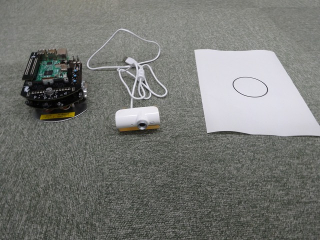</a></div>

The screws used differ depending on whether you are using the dedicated LiDAR mount or the multi-LiDAR mount.

First, for the dedicated LiDAR mount shown below, use the two screws included with it.

<div align="center"><a href="DSC04139.JPG">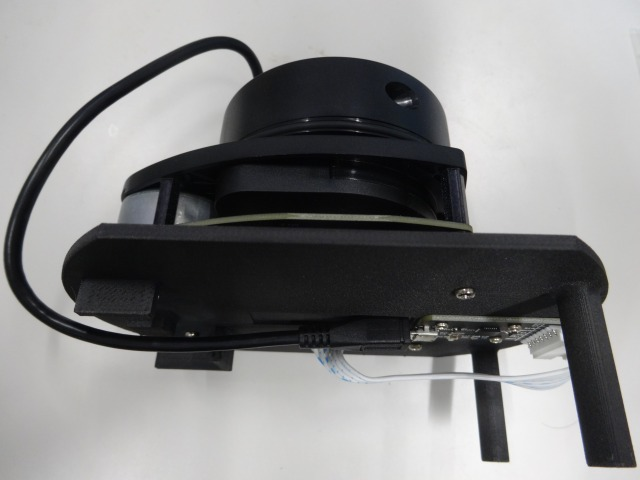</a></div>

<div align="center"><a href="DSC04152.JPG">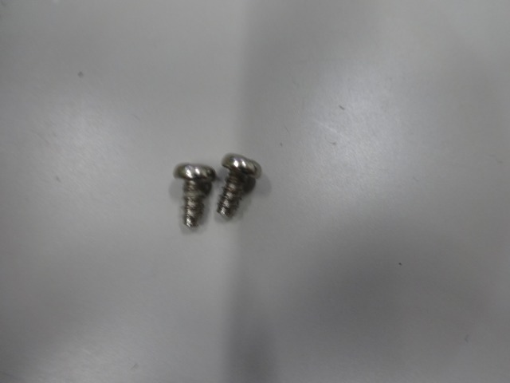</a></div>

For the multi-LiDAR mount shown below, use 3-8 pan-head tapping screws.

<div align="center"><a href="DSC04142.JPG">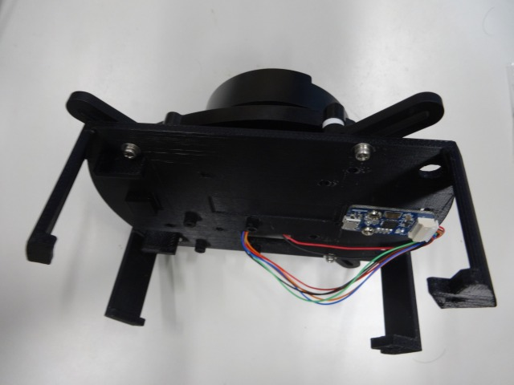</a></div>

<div align="center"><a href="DSC04151.JPG"></a></div>

Fix it at the two locations on the front of the Raspberry Pi Mouse as shown below.

<div align="center"><a href="DSC04153.JPG">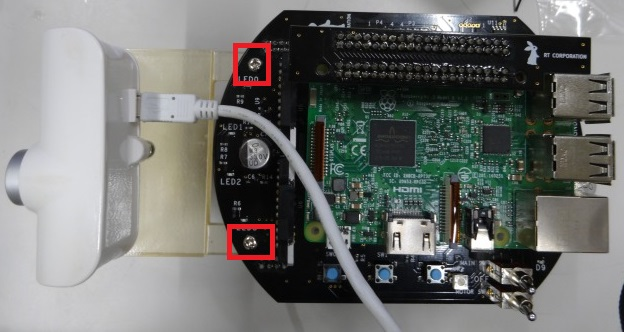</a></div>

Connect the PC and USB camera using a USB port.

<div align="center"><a href="DSC04154.JPG">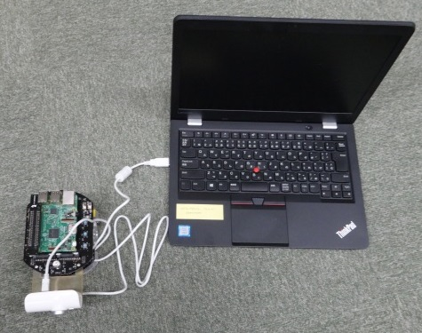</a></div>

### Operation Verification

#### Starting the RTCs

For operation verification, the following five RTCs must be started.

- RaspberryPiMouseRTC
- RobotController
- OpenCVCamera
- CameraViewer
- CircleTracking

For how to start RaspberryPiMouseRTC and the RobotController component, refer to the procedures on the following pages.

- [Tutorial (Introduction to RT Component Development, Raspberry Pi Mouse, Windows)](/en/node/6550)
- [Tutorial (Introduction to RT Component Development, Raspberry Pi Mouse, Ubuntu)](/en/node/6551)

OpenCVCamera and CameraViewer are sample components included with OpenRTM-aist.

For Windows 10, enter **C++_OpenCV-Examples** in "Type here to search" at the lower-left of the screen, select C++_OpenCV-Examples, and then double-click **CameraViewer.bat** and **OpenCVCamera.bat** in the Explorer window that opens.

<div align="center"><a href="opencv8.jpg">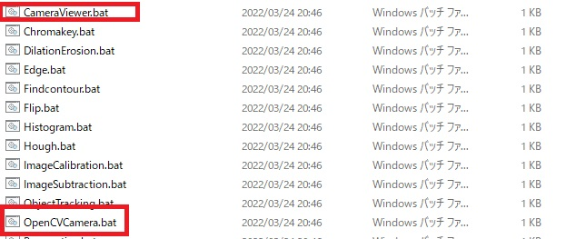</a></div>

For Ubuntu, build and installation are required.

- [Build Procedure for OpenCV Samples on Linux](/en/node/6974)

For CircleTracking, execute CircleTrackingComp.exe generated by the build.

#### Building the RT System

Connect the ports in RTSystemEditor as shown below.

<div align="center"><a href="opencv3.jpg">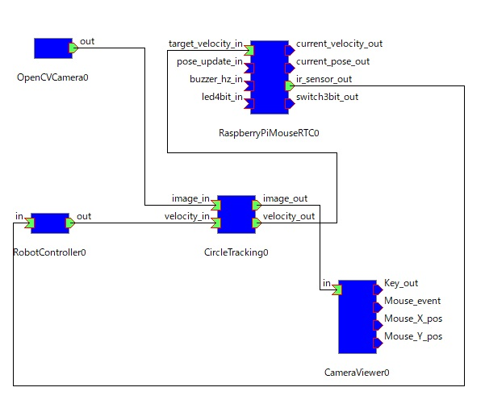</a></div>

<table class="table-alt">
  <tr>
    <th>RTC Name</th>
    <th>OutPort Name</th>
    <th>RTC Name</th>
    <th>InPort Name</th>
  </tr>
  <tr>
    <td>OpenCVCamera0</td>
    <td>out</td>
    <td>CircleTracking0</td>
    <td>image_in</td>
  </tr>
  <tr>
    <td>RobotController0</td>
    <td>out</td>
    <td>CircleTracking0</td>
    <td>velocity_in</td>
  </tr>
  <tr>
    <td>CircleTracking0</td>
    <td>image_out</td>
    <td>CameraViewer0</td>
    <td>in</td>
  </tr>
  <tr>
    <td>CircleTracking0</td>
    <td>velocity_out</td>
    <td>RaspberryPiMouseRTC0</td>
    <td>target_velocity_in</td>
  </tr>
  <tr>
    <td>RaspberryPiMouseRTC0</td>
    <td>ir_sensor_out</td>
    <td>RobotController</td>
    <td>in</td>
  </tr>
</table>


Activate the RTCs to start operation verification.

Move the paper with the printed circular shape left and right in front of the camera and check the operation.

<div align="center"><a href="opencv9.png">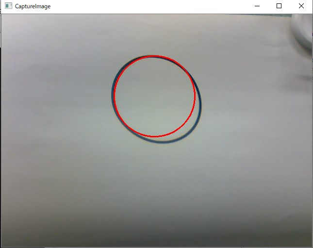</a></div>

The OpenCVCamera component may use another USB camera or the laptop's built-in camera instead of the USB camera attached to the Raspberry Pi Mouse.

In this case, an image from another camera is displayed. Select OpenCVCamera0 in RTSystemEditor and edit the configuration parameters.

<div align="center"><a href="opencv4_2.jpg">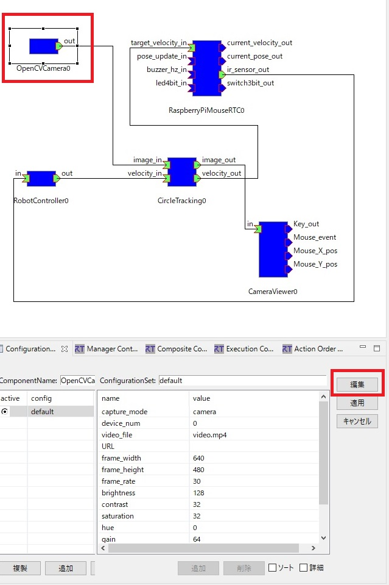</a></div>

Change **device_num** below and check the result.

<div align="center"><a href="opencv5_2.jpg">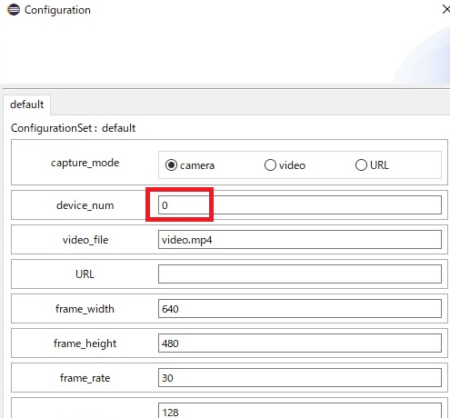</a></div>

If there are many false circle detections, select CircleTracking0 in RTSystemEditor and try changing the configuration parameters.

<div align="center"><a href="opencv6_2.jpg">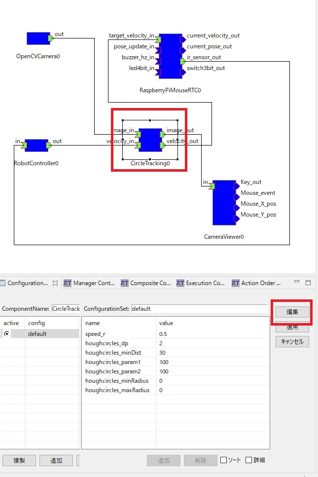</a></div>

For details on the arguments of the HoughCircles function, refer to the OpenCV documentation.

<div align="center"><a href="opencv7_2.jpg">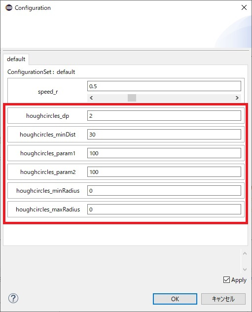</a></div>

## Using a USB Camera Connected to Raspberry Pi

Start the OpenCVCamera component on the Raspberry Pi and build a system that sends images from the USB camera connected to the Raspberry Pi to the PC for processing.

Connect the USB camera to the Raspberry Pi.

<div align="center"><a href="sytemopencvcamera.png">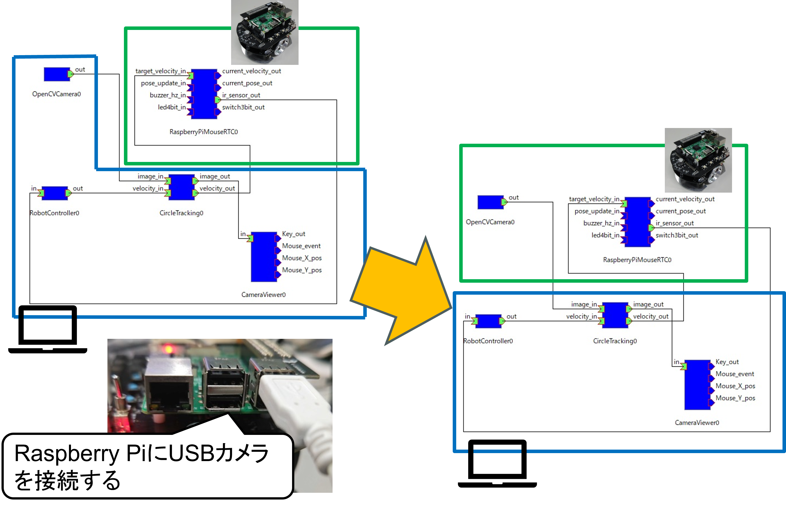</a></div>

First, because the OpenCVCamera component cannot be started from the web browser interface, log in to Linux on the Raspberry Pi via SSH using Tera Term and operate it there.

- [TeraTerm](https://teratermproject.github.io/)

After starting Tera Term, enter **192.168.11.1** as the host and connect to Linux.

The user name and passphrase are explained in the workshop.

After logging in, execute the following command from Tera Term to start the preinstalled OpenCVCamera component.

```sh
 /usr/local/share/openrtm-1.2/components/c++/opencv-rtcs/OpenCVCamera/OpenCVCameraComp
```

Connect OpenCVCamera0 running on the Raspberry Pi to the data port of CircleTracking0.

OpenCVCamera0 running on the PC is no longer needed, so terminate it.

<div align="center"><a href="systemopencv2.png">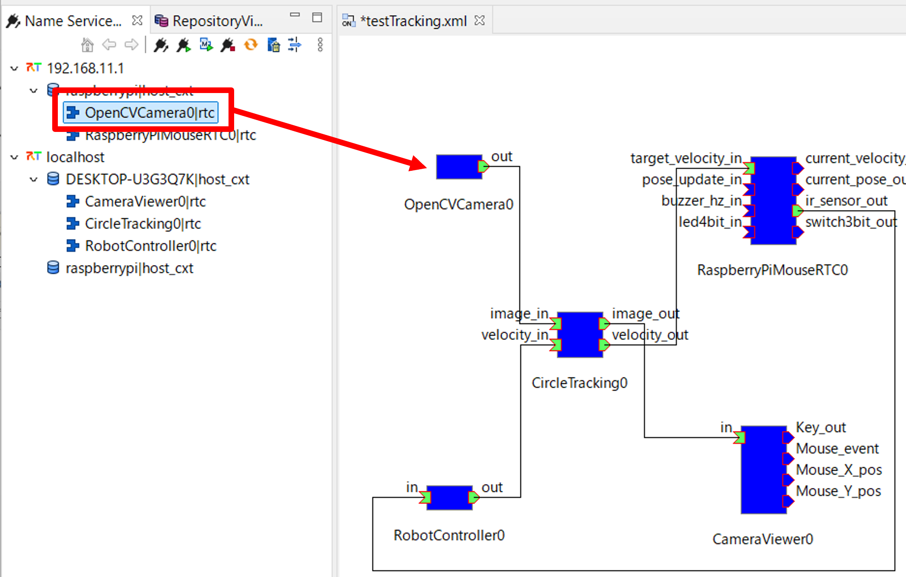</a></div>

When you verify operation, you will see that displaying camera images on the PC causes a large delay because the image data transmitted over the wireless LAN is large.

Therefore, modify the system so that compressed images are sent and received.

First, in the configuration parameters of OpenCVCamera0, change **string_encode** to **jpeg**.

Next, temporarily terminate the CircleTracking component and modify the onExecute function as follows.

```cpp
 RTC::ReturnCode_t CircleTracking::onExecute(RTC::UniqueId /*ec_id*/)
 {
    (中略)
       m_outputBuff.create(cv::Size(m_image_in.width, m_image_in.height), CV_8UC3);
 
     }
     (以下を追加)
     //圧縮のフォーマットにより処理を分岐
     std::string format = (const char*)m_image_in.format;
     if (format == "jpeg" || format == "png")
     {
        std::vector<uchar> buff;
        int len = m_image_in.pixels.length();
        buff.resize(len);
        memcpy(&buff[0], &m_image_in.pixels[0], sizeof(unsigned char) * len);
        m_imageBuff = cv::imdecode(cv::Mat(buff), cv::IMREAD_COLOR);
     }
     else
     {
        std::memcpy(m_imageBuff.data,
            (void*)&(m_image_in.pixels[0]),
            m_image_in.pixels.length());
     }
     //以下の部分はコメントアウト。
     /*
     // InPortの画像データをm_imageBuffにコピー
     std::memcpy(m_imageBuff.data,
            (void *)&(m_image_in.pixels[0]),
            m_image_in.pixels.length());
     */
```

After building the CircleTracking component, start the RTC, connect the data ports, and verify operation.

## Summary

In this tutorial, you learned:

- How to create a CircleTracking RTC that detects circles in camera images using OpenCV.
- How to define InPorts, OutPorts, and configuration parameters for image processing and robot velocity control.
- How to configure CMakeLists.txt to link OpenCV libraries.
- How to add OpenCV image buffers and direction variables to the RTC header file.
- How to implement circle detection using HoughCircles and output annotated images.
- How to control the Raspberry Pi Mouse to rotate toward the detected circle.
- How to build an RT system using OpenCVCamera, CameraViewer, CircleTracking, RobotController, and RaspberryPiMouseRTC.
- How to adjust camera selection and HoughCircles parameters during operation verification.
- How to use a USB camera connected to the Raspberry Pi by starting OpenCVCamera via SSH.
- How to reduce wireless image transmission delay by using compressed image formats such as JPEG.

By completing this tutorial, you have learned how to build and verify an OpenCV-based RT system that detects circular shapes from camera images and controls a Raspberry Pi Mouse based on the detected circle position.

