-------jp page!!-------

<!-- Title: チュートリアル(RTM講習会、第3部) -->
#contents

このページではRaspberry PiマウスとLEGO Mindstorms EV3を連携したRTシステムの構築を行います。

Raspberry Piマウスをアクセスポイントとして、ノートPCとEV3をアクセスポイントに接続します。

※Raspberry Piマウスと同じ番号のEV3を使用するようにしてください。

<br>

<div align="center"><a href="robomech2018_8.jpg">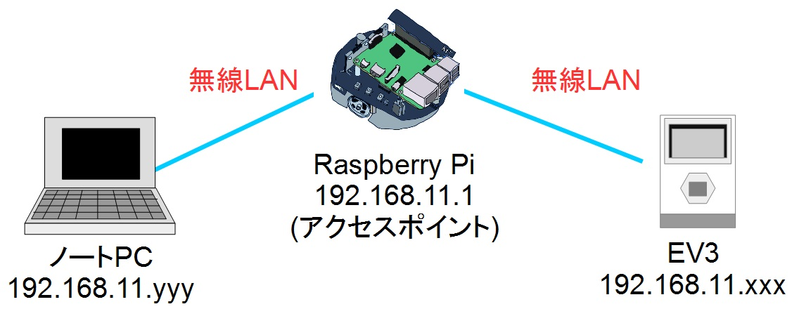</a></div>
<br>


## EV3のデバイス
EV3 には以下のデバイスが付属しています。

<table class="table-alt">
  <tr>
    <td><strong>ジャイロセンサー</strong><br> <div align="center"><a href="https://afrel.co.jp/pages-assets/images/technology/ev3/technology-ev3-img7.jpg"></a></div></td>
    <td>確度モード: 精度 +/- 3°<br> 角速度モード: 最大 440 deg/sec <br> サンプリングレート 1,000 Hz</td>
  </tr>
  <tr>
    <td><strong>カラーセンサー</strong> <br> <div align="center"><a href="https://afrel.co.jp/pages-assets/images/technology/ev3/technology-ev3-img5.jpg"></a></div></td>
    <td>計測: 赤色光の反射光、 周囲の明るさ、色 <br> 検出カラー数: 8色 （無色、黒、青、緑、黄、赤、白、茶）<br> サンプリングレート	1,000 Hz <br> 距離 約1mm～18mm（アフレル調査値）</td>
  </tr>
  <tr>
    <td><strong>タッチセンサー</strong><br> <div align="center"><a href="https://afrel.co.jp/pages-assets/images/technology/ev3/technology-ev3-img6.jpg"></a></div></td>
    <td>オン (1), オフ (0) <br> スイッチ可動域: 約4mm</td>
  </tr>
  <tr>
    <td><strong>超音波センサー</strong><br> <div align="center"><a href="https://afrel.co.jp/pages-assets/images/technology/ev3/technology-ev3-img8.jpg"></a></div></td>
    <td>距離計測可能範囲: 3cmから250cm <br> 距離計測精度: +/- 1 cm <br> 前面電飾: 点灯：超音波発信中、 点滅：超音波観測中</td>
  </tr>
  <tr>
    <td><strong>EV3 Lモーター</strong><br> <div align="center"><a href="https://afrel.co.jp/images/2013/04/45502_LargeMotor.jpg"></a></div></td>
    <td>フィードバック: 1°単位 <br> 回転数: 160から170RPM <br> 定格トルク: 0.21 N・m (30oz*in) <br> 停動トルク: 0.42 N・m (60oz*in) <br> 重さ: 76 g</td>
  </tr>
  <tr>
    <td><strong>EV3 Mモーター</strong> <br> <div align="center"><a href="https://afrel.co.jp/images/2013/04/45503_MediumMotor.jpg"></a></div></td>
    <td>フィードバック 1°単位 <br> 回転数: 240から250RPM <br> 定格トルク: 0.08 N・m (11oz*in) <br> 停動トルク: 0.12 N・m (17oz*in) <br> 重さ: 36 g</td>
  </tr>
</table>


## EV3の組立て
まず、EV3本体を土台に装着します。

<br>

<div align="center"><a href="robomech2018_12.jpg">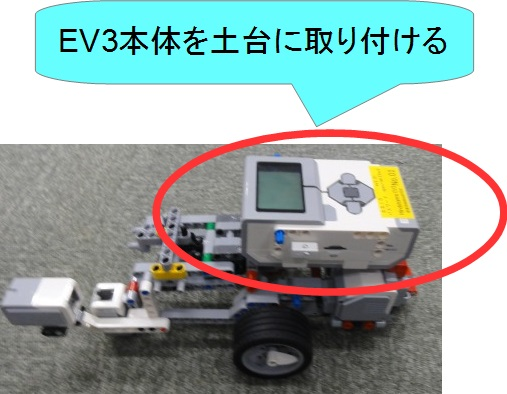</a></div>
<br>

次に25cmケーブルでEV3と左右のLモーターを接続します。

<br>


<table class="table-alt">
  <tr>
    <td>Lモーター右</td>
    <td>ポート C</td>
    <td>25cmケーブル</td>
  </tr>
  <tr>
    <td>Lモーター左</td>
    <td>ポート B</td>
    <td>25cmケーブル</td>
  </tr>
</table>

<br>

<div align="center"><a href="robomech2018_13.jpg">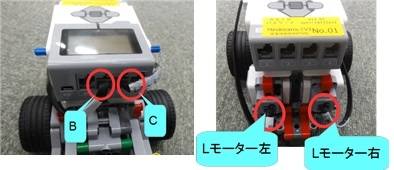</a></div>
<br>

ケーブルに接続するポート、デバイス名は記載してあります。

他のデバイスを取り付ける場合は、[チュートリアル(EV3)](/ja/node/6381#toc30)を参考にしてください。

## EV3との接続
### ノートPCとRaspberry Piの接続
[第二部](/ja/node/6551)の、実機での動作確認まで完了してください。
この時点でノートPCとアクセスポイントのRaspberry Piが接続されているはずです。


<br>

<div align="center"><a href="robomech2018_9.jpg">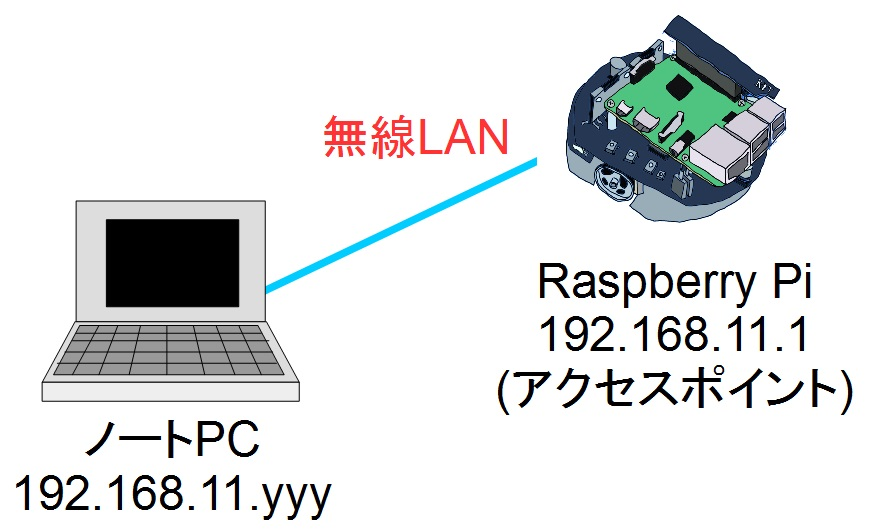</a></div>
<br>


## EV3の電源の入れ方/切り方

### 電源の入れ方

中央のボタンを押せば電源が投入されます。

<br>

<div align="center"><a href="ev3_on.jpg"></a></div>
<br>

### 電源の切り方

EV3 の電源を切る場合は最初の画面で EV3 本体の左上の戻るボタンを押して「Power Off」を選択してください。

<br>

<div align="center"><a href="ev3_off.jpg"></a></div>
<br>


<br>

<div align="center"><a href="s_DSC01033.JPG"></a></div>
<br>

### 再起動

再起動する場合は最初の画面で EV3 本体の左上の戻るボタンを押して「Reboot」を選択してください。

### リセット

ev3dev の起動が途中で停止する場合には、中央ボタン、戻るボタン(左上)、左ボタンを同時押ししてください。画面が消えたら戻るボタンを離すと再起動します。


<br>

<div align="center"><a href="ev3_reset.jpg"></a></div>
<br>


### Raspberry PiとEV3の接続

EV3の電源を投入してください。

起動後にRaspberry Piに自動接続します。
自動接続できた場合は、EV3の画面左上にIPアドレスが表示されます。
IPアドレスは192.168.11.yyyが表示されます。


<br>

<div align="center"><a href="tutorial_ev3_irex25.png"></a></div>
<br>


#### ネームサーバー、RTCの起動
EV3の画面上の操作でネームサーバーとRTCを起動します。

EV3 の操作画面から「File Browser」→「scripts」を選択してください。


ネームサーバー、RTCは**start_rtcs.sh**のスクリプトを実行することで起動します。

```
 ------------------------------
 192.168.11.yyy
 ------------------------------
         File Browser
 ------------------------------
 /home/robot/scripts
 ------------------------------
 ../
 Component/
 ・・
 [start_rtcs.sh                 ]
 ------------------------------
```


<br>

<div align="center"><a href="tutorial_ev3_irex32.png"></a></div>
<br>


### ネームサーバー追加
RTシステムエディタから、192.168.11.yyyのネームサーバーに接続してください。


<br>

<div align="center"><div align="center"><a href="tutorial_raspimouse0.png"></a></div>;  <div align="center"><a href="tutorial_ev3_irex22.png"></a></div>;</div>
<br>
<br>


この時点でRTシステムエディタのネームサービスビューにはlocalhost、192.168.11.1、192.168.11.yyyのネームサーバーが登録されています。
192.168.11.yyyのネームサーバーに登録されているRTCの名前は**EducatorVehicle1**となります。


<br>

<div align="center"><a href="robomech2018_10.jpg">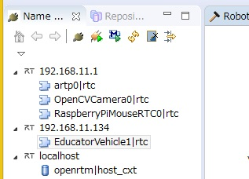</a></div>
<br>

- localhost
  - RobotController0
- 192.168.11.1
  - RaspberryPiMouseRTC0
  - OpenCVCamera0
  - artp0
- 192.168.11.yyy
  - EducatorVehicle1


## 動作確認

RaspberryPiMouseRTC0(192.168.11.1)とEducatorVehicle1(192.168.11.yyy)をシステムダイアグラム上で接続してください。
EducatorVehicle0の現在の速度出力をRaspberryPiMouseRTC0の目標速度入力に接続することで、EV3の動きにRaspberry Piマウスが追従するようになります。


<br>

<div align="center"><a href="robomech2018_14.jpg">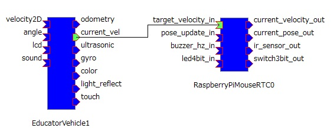</a></div>
<br>


RTCをアクティベートしてEducator Vehicleの車輪を転がすと、Raspberry Piマウスがそれに合わせて動作します。


<br>

<div align="center"><a href="robomech2018_11.jpg">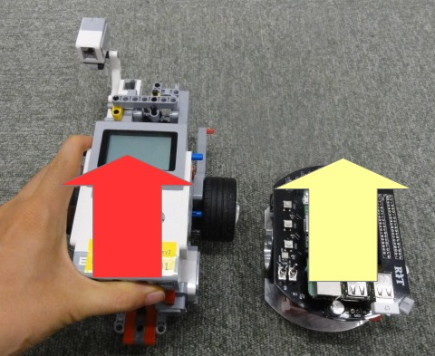</a></div>
<br>


## 自由課題
これで実習は一通り終了ですが、時間が余っている場合は以下のような課題に挑戦してみてください。


### EV3のタッチセンサのオンオフでRaspberry Piマウスを操作

EV3のタッチセンサーのオンオフでRaspberry Piマウスを前進後退させるRTシステムを作成します。


<br>

<!-- div align="center"><a href="https://afrel.co.jp/cms/wp-content/uploads/2013/04/45507_TouchSensor.jpg"></a></div-->
<div align="center"><strong>タッチセンサー</strong></div>
<br>

#### タッチセンサー接続

EV3とタッチセンサーを35cmケーブルで接続してください。


<table class="table-alt">
  <tr>
    <th>タッチセンサー右</th>
    <th>ポート 3</th>
    <th>35cmケーブル</th>
  </tr>
  <tr>
    <td>タッチセンサー左</td>
    <td>ポート 1</td>
    <td>35cmケーブル</td>
  </tr>
</table>

#### RTCの作成

以下のような仕様のRTCを作成します。

<table class="table-alt">
  <tr>
    <th>コンポーネント名称</th>
    <th>SampleTouchSensor</th>
  </tr>
  <tr>
    <td colspan="2" style="text-align: center;">InPort</td>
  </tr>
  <tr>
    <td>ポート名</td>
    <td>touch</td>
  </tr>
  <tr>
    <td>型</td>
    <td>TimedBooleanSeq</td>
  </tr>
  <tr>
    <td>説明</td>
    <td>タッチセンサーのオンオフ</td>
  </tr>
  <tr>
    <td colspan="2" style="text-align: center;">OutPort</td>
  </tr>
  <tr>
    <td>ポート名</td>
    <td>target_velocity</td>
  </tr>
  <tr>
    <td>型</td>
    <td>TimedVelocity2D</td>
  </tr>
  <tr>
    <td>説明</td>
    <td>目標速度</td>
  </tr>
  <tr>
    <td colspan="2" style="text-align: center;">Configuration</td>
  </tr>
  <tr>
    <td>パラメーター名</td>
    <td>speed</td>
  </tr>
  <tr>
    <td>型</td>
    <td>double</td>
  </tr>
  <tr>
    <td>デフォルト値</td>
    <td>0.2</td>
  </tr>
  <tr>
    <td>説明</td>
    <td>タッチセンサがオンの時の直進速度の設定</td>
  </tr>
</table>

アクティビティでonExecuteを有効にしてください。

SampleTouchSensorのonExecute関数に以下のように記述します。


```
 RTC::ReturnCode_t SampleTouchSensor::onExecute(RTC::UniqueId ec_id)
 {
 	//新規データの確認
 	if (m_touchIn.isNew())
 	{
 		//データの読み込み
 		m_touchIn.read();
 		//配列の要素数が1以上かを確認
 		if (m_touch.data.length() == 2)
 		{
 			//0番目のデータがオンの場合は直進する指令を出力
 			//0番目のデータは右側のタッチセンサに対応
 			if (m_touch.data[0])
 			{
 				//目標速度を格納
 				m_target_velocity.data.vx = m_speed;
 				m_target_velocity.data.vy = 0;
 				m_target_velocity.data.va = 0;
 				setTimestamp(m_target_velocity);
 				//データ出力
 				m_target_velocityOut.write();
 			}
 			//1番目のデータがオンの場合は後退する指令を出力
 			//1番目のデータは左側のタッチセンサに対応
 			else if (m_touch.data[1])
 			{
 				//目標速度を格納
 				m_target_velocity.data.vx = -m_speed;
 				m_target_velocity.data.vy = 0;
 				m_target_velocity.data.va = 0;
 				setTimestamp(m_target_velocity);
 				//データ出力
 				m_target_velocityOut.write();
 			}
 			//オフの場合は停止する
 			else
 			{
 				//目標速度を格納
 				m_target_velocity.data.vx = 0;
 				m_target_velocity.data.vy = 0;
 				m_target_velocity.data.va = 0;
 				setTimestamp(m_target_velocity);
 				//データ出力
 				m_target_velocityOut.write();
 			}
 		}
 	}
   return RTC::RTC_OK;
 }
```

#### RTシステム作成

データポートを以下のように接続後、タッチセンサをオンオフするとRaspberry Piが前進後退します。

<br>

<div align="center"><a href="robomech2018_15.jpg">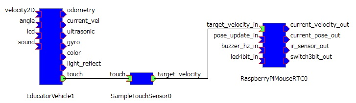</a></div>
<br>

### ジョイスティックコンポーネントで2台同時に操作

以下GUIジョイスティックでRaspberry Piマウス、EV3を操作するRTシステムを作成します。

<br>

<div align="center"><a href="robomech2018_18.jpg">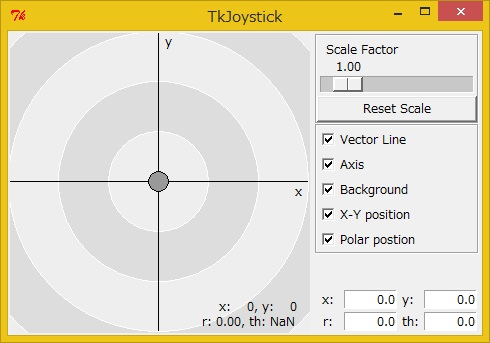</a></div>
<br>

#### ジョイスティックコンポーネント起動

ジョイスティックコンポーネントはOpenRTM-aist Python版のサンプルにあります(**TkJoyStickComp.py**)。
ジョイスティックコンポーネントは、Windows 8.1の場合は「スタート」>「アプリビュー(右下矢印)」>「OpenRTM-aist 1.2.0」>「Python_Examples」をクリックして、エクスプローラーで「TkJoyStickComp.bat」をダブルクリックして起動してください。

#### RTC作成

TkJoyStickComp.pyのアウトポートのデータ型は**TimedFloatSeq**型であるため、**TimedVelocity2D**型に変換するRTCを作成する必要があります。

以下のような仕様のRTCを作成してください。

<table class="table-alt">
  <tr>
    <th>コンポーネント名称</th>
    <th>FloatSeqToVelocity</th>
  </tr>
  <tr>
    <td colspan="2" style="text-align: center;">InPort</td>
  </tr>
  <tr>
    <td>ポート名</td>
    <td>in</td>
  </tr>
  <tr>
    <td>型</td>
    <td>TimedFloatSeq</td>
  </tr>
  <tr>
    <td>説明</td>
    <td>変換前のデータ</td>
  </tr>
  <tr>
    <td colspan="2" style="text-align: center;">OutPort</td>
  </tr>
  <tr>
    <td>ポート名</td>
    <td>out</td>
  </tr>
  <tr>
    <td>型</td>
    <td>TimedVelocity2D</td>
  </tr>
  <tr>
    <td>説明</td>
    <td>変換後のデータ</td>
  </tr>
  <tr>
    <td colspan="2" style="text-align: center;">Configuration</td>
  </tr>
  <tr>
    <td>パラメーター名</td>
    <td>rotation_by_position</td>
  </tr>
  <tr>
    <td>型</td>
    <td>double</td>
  </tr>
  <tr>
    <td>デフォルト値</td>
    <td>-0.02</td>
  </tr>
  <tr>
    <td>説明</td>
    <td>ジョイスティックのX座標の位置に対する角速度の変化量</td>
  </tr>
  <tr>
    <td colspan="2" style="text-align: center;">Configuration</td>
  </tr>
  <tr>
    <td>パラメーター名</td>
    <td>velocity_by_position</td>
  </tr>
  <tr>
    <td>型</td>
    <td>double</td>
  </tr>
  <tr>
    <td>デフォルト値</td>
    <td>0.002</td>
  </tr>
  <tr>
    <td>説明</td>
    <td>ジョイステックのY座標に対する速度の変化量</td>
  </tr>
</table>

アクティビティはonExecuteをオンにしてください。

onExecute関数を以下のように編集してください。

```
 RTC::ReturnCode_t FloatSeqToVelocity::onExecute(RTC::UniqueId ec_id)
 {
 	//新規データの確認
 	if (m_inIn.isNew())
 	{
 		//データの読み込み
 		m_inIn.read();
 		//配列のデータ数確認
 		if (m_in.data.length() >= 2)
 		{
 			//目標速度格納
 			m_out.data.vx = m_in.data[1] * m_velocity_by_position;
 			m_out.data.vy = 0;
 			m_out.data.va = m_in.data[0] * m_rotation_by_position;
 			setTimestamp(m_out);
 			//目標速度出力
 			m_outOut.write();
 		}
 	}
   return RTC::RTC_OK;
 }
```

#### RTシステム作成

以下のようにデータポートを接続してください。

<br>

<div align="center"><a href="robomech2018_16.jpg">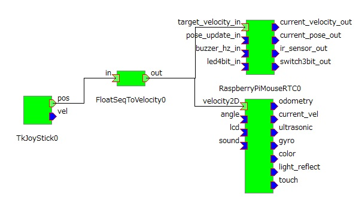</a></div>
<br>


### EV3をしゃべらせる

EducatorVehicleRTCの**sound**という名前のインポートに文字列(TimedString型)を入力すると、EV3が発声します。

#### RTC作成

以下のような仕様のRTCを作成してください。

<table class="table-alt">
  <tr>
    <th>コンポーネント名称</th>
    <th>SpeechSample</th>
  </tr>
  <tr>
    <td colspan="2" style="text-align: center;">OutPort</td>
  </tr>
  <tr>
    <td>ポート名</td>
    <td>out</td>
  </tr>
  <tr>
    <td>型</td>
    <td>TimedString</td>
  </tr>
  <tr>
    <td>説明</td>
    <td>発話する文字列</td>
  </tr>
</table>

アクティビティはonExecuteをオンにしてください。

onExecute関数を以下のように編集してください。


```
 RTC::ReturnCode_t SpeechSample::onExecute(RTC::UniqueId ec_id)
 {
 	std::cout << "Please input: ";
 	std::string ret;
 	//文字入力
 	std::cin >> ret;
 	//データに格納
 	m_out.data = CORBA::string_dup(ret.c_str());
 	setTimestamp(m_out);
 	//データ出力
 	m_outOut.write();
 
   return RTC::RTC_OK;
 }
```


文字列(const char*)をデータポートで出力する際は**CORBA::string_dup関数**で文字列をコピーする必要があります。

```
 m_out.data= CORBA::string_dup("abc");
```


#### RTシステム作成

以下のようにデータポートを接続してください。

<br>

<div align="center"><a href="robomech2018_17.jpg">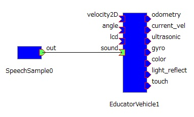</a></div>
<br>

### マーカーの追従

Raspberry Piマウスを起動すると、OpenCVCameraコンポーネントとarptコンポーネントが起動します。
OpenCVCameraコンポーネントは画像を取得するコンポーネント、artpコンポーネントは画像データからマーカの位置姿勢を計算して出力するコンポーネントです。

<br>

<div align="center"><a href="robomech2018_19.jpg">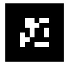</a></div>
<br>

Raspberry Piマウスがマーカーに追従するRTシステムを作成します。

#### カメラの装着

まずはカメラをRaspberry Piマウスに装着します。

以下の土台部品をRaspberry Piマウスに取り付けていきます。

<br>

<div align="center"><a href="robomech2018_23.jpg">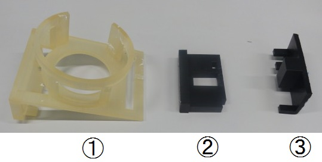</a></div>
<br>

部品①をRaspberry Piマウスの上部に装着してください。
左から押し込むようにして取り付けます。

<br>

<div align="center"><a href="s_DSC09198.JPG">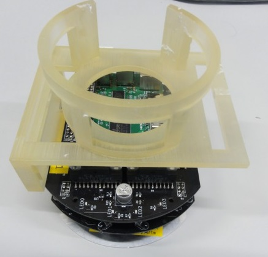</a></div>
<br>

<br>

この時、左側の突起がプレートを挟むように取り付けてください。

<br>

<div align="center"><a href="robomech2018_22.jpg">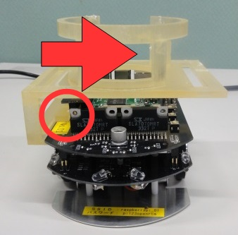</a></div>
<br>


部品②を部品①の左側に上から差し込んでください。

<br>

<div align="center"><a href="s_DSC09201.JPG">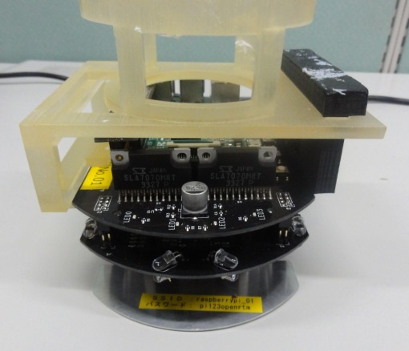</a></div>
<br>

<br>


<br>

<div align="center"><a href="robomech2018_25.jpg">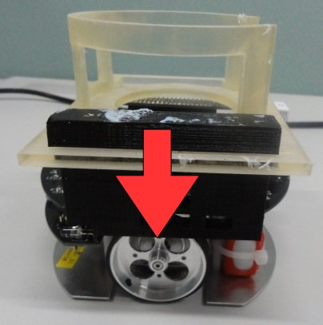</a></div>
<br>


部品③を左側から部品②に差し込んでください。


<br>

<div align="center"><a href="robomech2018_24.jpg">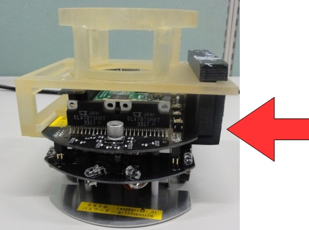</a></div>
<br>


最後にカメラを搭載して、USBケーブルをRaspberry Piに差し込んだら完成です。

<br>

<div align="center"><a href="s_DSC01096.JPG">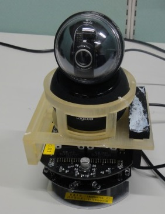</a></div>
<br>

<br>

<br>

<div align="center"><a href="s_DSC01098.JPG">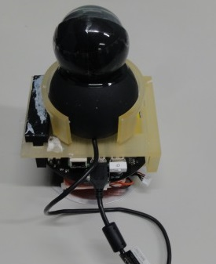</a></div>
<br>

<br>


#### RTC作成

以下の仕様でRTCを作成してください。


<table class="table-alt">
  <tr>
    <th>コンポーネント名称</th>
    <th>testARToolKit</th>
  </tr>
  <tr>
    <td colspan="2" style="text-align: center;">InPort</td>
  </tr>
  <tr>
    <td>ポート名</td>
    <td>marker_pos</td>
  </tr>
  <tr>
    <td>型</td>
    <td>TimedPose3D</td>
  </tr>
  <tr>
    <td>説明</td>
    <td>マーカーの位置</td>
  </tr>
  <tr>
    <td colspan="2" style="text-align: center;">OutPort</td>
  </tr>
  <tr>
    <td>ポート名</td>
    <td>target_vel</td>
  </tr>
  <tr>
    <td>型</td>
    <td>TimedVelocity2D</td>
  </tr>
  <tr>
    <td>説明</td>
    <td>ロボットの目標速度</td>
  </tr>
  <tr>
    <td colspan="2" style="text-align: center;">Configuration</td>
  </tr>
  <tr>
    <td>パラメーター名</td>
    <td>x_distance</td>
  </tr>
  <tr>
    <td>型</td>
    <td>double</td>
  </tr>
  <tr>
    <td>デフォルト値</td>
    <td>0.5</td>
  </tr>
  <tr>
    <td>説明</td>
    <td>マーカーまでの目標距離(X軸)</td>
  </tr>
  <tr>
    <td colspan="2" style="text-align: center;">Configuration</td>
  </tr>
  <tr>
    <td>パラメーター名</td>
    <td>y_distance</td>
  </tr>
  <tr>
    <td>型</td>
    <td>double</td>
  </tr>
  <tr>
    <td>デフォルト値</td>
    <td>0</td>
  </tr>
  <tr>
    <td>説明</td>
    <td>マーカーまでの目標距離(Y軸)</td>
  </tr>
  <tr>
    <td colspan="2" style="text-align: center;">Configuration</td>
  </tr>
  <tr>
    <td>パラメーター名</td>
    <td>x_speed</td>
  </tr>
  <tr>
    <td>型</td>
    <td>double</td>
  </tr>
  <tr>
    <td>デフォルト値</td>
    <td>0.1</td>
  </tr>
  <tr>
    <td>説明</td>
    <td>X軸方向移動速度</td>
  </tr>
  <tr>
    <td colspan="2" style="text-align: center;">Configuration</td>
  </tr>
  <tr>
    <td>パラメーター名</td>
    <td>r_speed</td>
  </tr>
  <tr>
    <td>型</td>
    <td>double</td>
  </tr>
  <tr>
    <td>デフォルト値</td>
    <td>0.2</td>
  </tr>
  <tr>
    <td>説明</td>
    <td>回転方向移動速度</td>
  </tr>
  <tr>
    <td colspan="2" style="text-align: center;">Configuration</td>
  </tr>
  <tr>
    <td>パラメーター名</td>
    <td>error_range_x</td>
  </tr>
  <tr>
    <td>型</td>
    <td>double</td>
  </tr>
  <tr>
    <td>デフォルト値</td>
    <td>0.1</td>
  </tr>
  <tr>
    <td>説明</td>
    <td>X軸方向目標距離の許容範囲</td>
  </tr>
  <tr>
    <td colspan="2" style="text-align: center;">Configuration</td>
  </tr>
  <tr>
    <td>パラメーター名</td>
    <td>error_range_y</td>
  </tr>
  <tr>
    <td>型</td>
    <td>double</td>
  </tr>
  <tr>
    <td>デフォルト値</td>
    <td>0.05</td>
  </tr>
  <tr>
    <td>説明</td>
    <td>Y軸方向目標距離の許容範囲</td>
  </tr>
</table>


アクティビティはonExecuteをONにしてください。

onExecuteを以下のように編集してください。


```
 RTC::ReturnCode_t testARToolKit::onExecute(RTC::UniqueId ec_id)
 {
 	//新規データの確認
 	if (m_marker_posIn.isNew())
 	{
 		m_target_vel.data.vx = 0;
 		m_target_vel.data.vy = 0;
 		m_target_vel.data.va = 0;
 
 		//データの読み込み
 		m_marker_posIn.read();
 		//マーカーの位置(X軸)が目標距離(X軸)よりも大きい場合
 		if (m_marker_pos.data.position.x > m_x_distance + m_error_range_x/2.0)
 		{
 			m_target_vel.data.vx = m_x_speed;
 		}
 		//マーカーの位置(X軸)が目標距離(X軸)よりも小さい場合
 		else if (m_marker_pos.data.position.x < m_x_distance - m_error_range_x/2.0)
 		{
 			m_target_vel.data.vx = -m_x_speed;
 		}
 		//マーカーの位置(Y軸)が目標距離(Y軸)よりも大きい場合
 		else if (m_marker_pos.data.position.y > m_y_distance + m_error_range_y/2.0)
 		{
 			m_target_vel.data.va = m_r_speed;
 		}
 		//マーカーの位置(Y軸)が目標距離(Y軸)よりも小さい場合
 		else if (m_marker_pos.data.position.y < m_y_distance - m_error_range_y/2.0)
 		{
 			m_target_vel.data.va = -m_r_speed;
 		}
 		setTimestamp(m_target_vel);
 		//データ書き込み
 		m_target_velOut.write();
 	}
   return RTC::RTC_OK;
 }
```

#### RTシステム作成

データポートを以下のように接続してください。

<br>

<div align="center"><a href="robomech2018_20.jpg">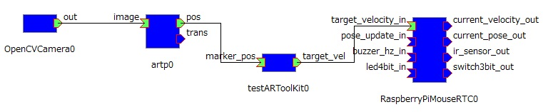</a></div>
<br>

RTCをアクティベートしてカメラの前でマーカーを動かして、Raspberry Piマウスが移動するかを確認してください。


-------jp page!!-------
