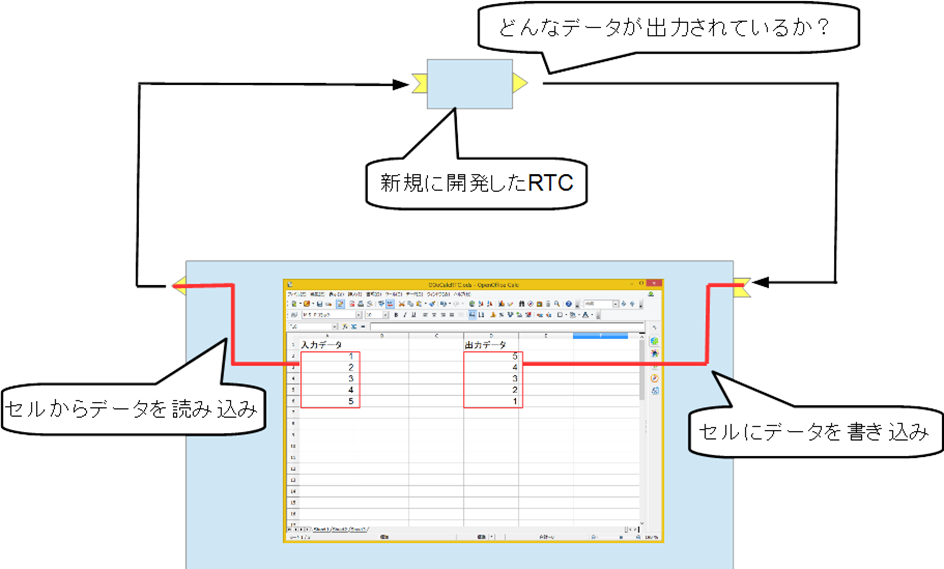
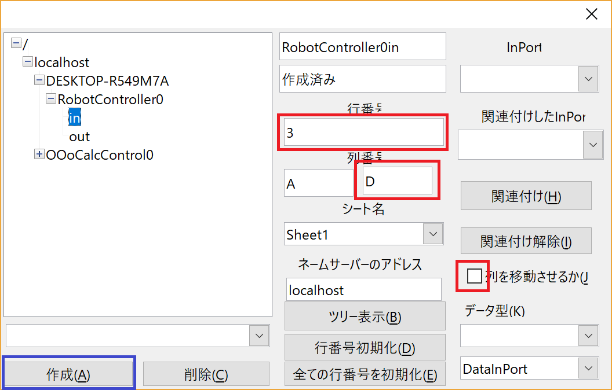
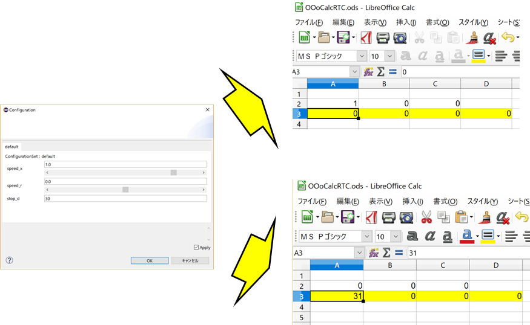

<!-- Title: チュートリアル(RTM講習会、第4部) -->
#contents

## Introduction

This page explains the procedure for verifying RTC operation using the RTC for LibreOffice Calc.

You can verify the behavior of the target RTC by inputting cell values in Calc to an InPort and displaying values output from an OutPort in cells.

<div align="center"><a href="calc1.png"></a></div>

In the RTM workshop, a portable version of LibreOffice and RTCs are distributed on a USB memory device.

They can be executed on Windows.

<br>

For Ubuntu, they can be installed using the following commands.

```sh
 sudo apt install libreoffice-script-provider-python
 git clone https://github.com/Nobu19800/OOoRTCs
 cd OOoRTCs
 sh install.sh
```

In this exercise, the RobotController component created in [Part 2](../tutorial_rtm_seminar_win_part2) will be used.

## What is LibreOffice?

LibreOffice is an office suite that provides spreadsheet, presentation, word processing, and other functions.

It is released as free software, and in this workshop the following portable version is used.

- [Portable Version LibreOffice Portable](https://ja.libreoffice.org/download/portable-versions/)

## Starting the RTC for LibreOffice Calc

For Windows, execute **Portable LibreOffice\run_CalcRTC.bat** from the distributed USB memory device.

<br>

For Ubuntu, open OOoRTCs/OOoCalcRTC/OOoCalcRTC.ods by double-clicking it.

<br>

LibreOffice Calc will start. Click the **Start RTC** button to start the RTC named OOoCalcControl.

<div align="center"><a href="calc2.png"></a></div>

## Connecting an OutPort

Connect to the OutPort of RobotController so that output data can be monitored in Calc.

Click the **Launch Operation Dialog** button in Calc.

<div align="center"><a href="calc3.png"></a></div>

First, connect to the OutPort whose output data you want to monitor.

Click the **Tree Display** button to display a list of RTC ports registered in the Name Server, then select **out** of RobotController0 from the tree.

<div align="center"><a href="calc4.png"></a></div>

Next, change some settings.

Uncheck **Move Column**.

When this option is enabled, the component operates in a mode where the cell position moves whenever data is received.

This mode is used when drawing graphs, but in this exercise we only want to check the values, so disable it.

Enter **3** in **Row Number**.

<br>

Enter **C** in the box to the right of **Column Letter**.

<br>

This configures the OutPort output data to be displayed in cells from columns **A** to **C** of row **2**.

After completing the settings, click the Create button.

<div align="center"><a href="calc9.png"></a></div>

## Verifying OutPort Operation

Activate the RTC in RT System Editor and verify its operation.

<div align="center"><a href="calc6.png"></a></div>

In this state, manipulate the configuration parameters and verify that the values in the Calc cells change.

<div align="center"><a href="calc7.png"></a></div>

## Connecting an InPort

Connect to the InPort of RobotController so that data can be input from Calc.

Click the **Tree Display** button to display a list of RTC ports registered in the Name Server, then select **in** of RobotController0 from the tree.

<div align="center"><a href="calc8.png"></a></div>

Next, change some settings.

Uncheck **Move Column**.

''''

Enter **D** in the box to the right of **Column Letter**.

This configures the OutPort output data to be displayed in cells from columns **A** to **C** of row **3**.

After completing the settings, click the Create button.

<div align="center"><a href="calc10.png"></a></div>

## Verifying InPort Operation

Activate the RTC in RT System Editor and verify its operation.

In this state, set the forward movement speed using the configuration parameters and operate the RTC so that the configured speed is output from the OutPort.

Then, enter a value greater than or equal to 31, or a value less than or equal to 30, into the cells in columns **A** to **C** of row **3** in Calc, and verify that the behavior changes accordingly.

<div align="center"><a href="calc11.png"></a></div>

## Summary

In this tutorial, you learned:

- How to use the RTC for LibreOffice Calc to verify RTC operation.
- How to install and start the LibreOffice Calc RTC environment on Windows and Ubuntu.
- How to launch the OOoCalcControl RTC from LibreOffice Calc.
- How to connect an RTC OutPort and display output data in Calc cells.
- How to monitor RTC output values by changing configuration parameters.
- How to connect an RTC InPort and send input data from Calc cells.
- How to verify RTC behavior by changing cell values and observing the resulting operation.

By completing this tutorial, you have learned how to use LibreOffice Calc as a simple interface for monitoring RTC output data and supplying input data to RTCs for operation verification.

