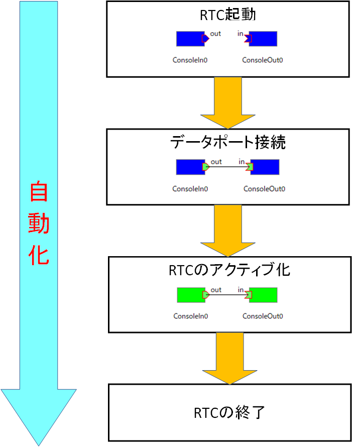
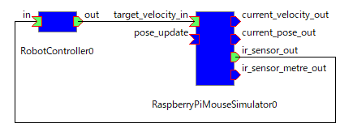
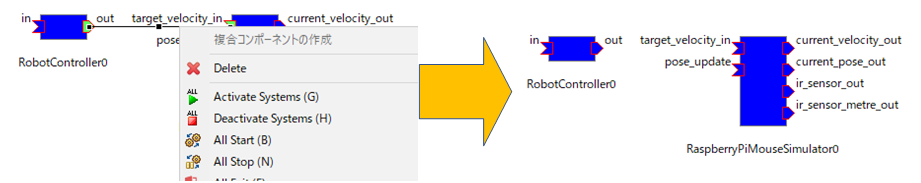
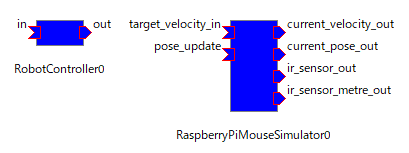
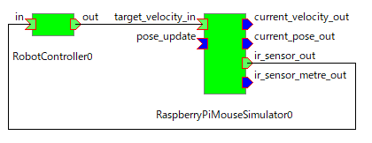
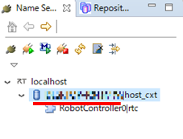

<!--  チュートリアル(rtshell入門、Raspberry Pi Mouse) -->

#contents

## Introduction

This section explains how to create batch files and shell scripts that automate the startup and shutdown of an RT system that controls a Raspberry Pi Mouse running in a simulator.

Previously, you had to start executable files by double-clicking them and connect ports manually through RTSystemEditor. By executing a script, all processing required to start the system can be performed automatically.

In this exercise, the RobotController component created in [Introduction to RT Component Development](/ja/node/6550) will be used.

You will create batch files and shell scripts that automate RTC startup and operations normally performed in RTSystemEditor.

<div align="center"><a href="rtshell1_tutorial.png"></a></div>

### rtshell

rtshell is a tool for operating RTCs from the command line and provides functionality equivalent to RTSystemEditor.

- [Managing RT Systems with rtshell](/ja/node/5014)
- [Introduction to rtshell](https://openrtm.org/openrtm/sites/default/files/5620/rtshell.pdf)

## Automating RT System Startup

The startup and shutdown procedure for a system that controls a Raspberry Pi Mouse in a simulator using the RobotController component is as follows.

1. Start the RaspberryPiMouseSimulator component and RobotController component.
1. Connect ports using connectors.
1. Activate the RTCs.
1. Exit the RTCs.

### Preparation

Since this exercise uses command-line operations, start Command Prompt (Windows) or Terminal (Ubuntu).

- [How to Open Command Prompt in Windows 10](https://pc-karuma.net/windows10-open-command-prompt-window/)
- [Linux FAQ: How to Open a Terminal and Execute Commands in Ubuntu](https://linuxfan.info/ubuntu-open-terminal-emulator)

After starting Command Prompt or Terminal, enter **rtls**.

If the message **'rtls' is not recognized as an internal or external command, operable program or batch file.** appears, the Python Scripts folder (for example, `C:\Python38\Scripts`) is not configured in the Path environment variable.

Check the Python installation location and configure the environment variable.

- [Python Installation Location (Windows)](https://gammasoft.jp/blog/python-install-location/)
- [Setting/Editing the Path Environment Variable in Windows 10](https://www.atmarkit.co.jp/ait/articles/1805/11/news035.html)

### Automating Port Connections

The procedure for automating data port connections is as follows.

- Connect ports using RTSystemEditor (or the rtshell rtcon command).
- Save the connection information to a file using the rtshell **rtcryo** command.
- Restore the connections after restart using the rtshell **rtresurrect** command.

As preparation, save the connection information to an XML file and restore the state with the rtresurrect command during automatic startup.

After starting **RobotControllerComp** and **RaspberryPiMouseSimulatorComp**, connect the ports in RTSystemEditor.

The current state is as follows.

<div align="center"><a href="rtshell3_tutorial.png"></a></div>

After connecting the ports, save the XML file with the following command.

Change the XML file save location to a location of your choice.

```sh
 rtcryo -o C:\work\robotcontroller.xml localhost
```

Next, try the rtresurrect command.

First, delete all connectors.

In RTSystemEditor, click a connector and press the Delete key, or right-click it and select Delete.

<div align="center"><a href="rtshell2_tutorial.png"></a></div>

The current state is now as follows.

<div align="center"><a href="rtshell4_tutorial.png"></a></div>

Enter the following command.

Change the XML file path to the location where you saved it.

```sh
 rtresurrect C:\work\robotcontroller.xml
```

Verify that the ports have returned to the connected state.

The current state should now be as follows.

<div align="center"><a href="rtshell3_tutorial.png"></a></div>

### Automating RTC Activation

Use the rtshell **rtstart** command to activate RTCs.

Enter the following command.

```sh
 rtstart C:\work\robotcontroller.xml
```

The current state should now be as shown below, and the Raspberry Pi Mouse in the simulator should be controllable.

<div align="center"><a href="rtshell5_tutorial.png"></a></div>

Next, try deactivating the RTCs.

Enter the following **rtstop** command.

```sh
 rtstop C:\work\robotcontroller.xml
```

The RTCs should now be deactivated and return to the following state.

<div align="center"><a href="rtshell3_tutorial.png"></a></div>

### Automating RTC Shutdown

Use the rtshell **rtexit** command to exit RTCs.

Try the following commands.

```sh
 rtexit localhost/RaspberryPiMouseSimulator0.rtc
 rtexit localhost/%COMPUTERNAME%.host_cxt/RobotController0.rtc
```

By default, RTCs register their components under the context named `hostname.host_cxt`.

<div align="center"><a href="rtshell6_tutorial.png"></a></div>

*For Ubuntu, add **HOSTNAME=`hostname`** and replace **%COMPUTERNAME%** with **${HOSTNAME}**.*

The RTCs should now have exited.

### Creating Batch Files and Shell Scripts

Create batch files and shell scripts for starting and stopping the RT system.

For Windows, create the following batch files.

- robotcontroller_start.bat
- robotcontroller_exit.bat

The procedure for creating batch files is as follows.

- [How to Create Batch Files: For Beginners Using Windows Batch Files](https://jj-blues.com/cms/wantto-howtomakebatforbeginer/)

When renaming files, be careful if Explorer is configured to hide file extensions.

Open the batch files using Notepad or another text editor.

For Ubuntu, create the following shell scripts.

- robotcontroller_start.sh
- robotcontroller_exit.sh

#### Creating the Startup Script

First, edit **robotcontroller_start.bat** and **robotcontroller_start.sh**.

Open robotcontroller_start.bat in Notepad or another editor, and write the procedure for starting RobotControllerComp and RaspberryPiMouseSimulatorComp in the batch file or shell script.

For Windows, enter the following commands.

```bat
 start "" /d C:\workspace\RobotController\build\src\Release RobotControllerComp.exe
 start "" /d C:\work\RTM_Tutorial\EXE RaspberryPiMouseSimulatorComp.exe
 timeout 2
```

For Ubuntu, enter the following commands.

```sh
 cd ~/workspace/RobotController/build/src/
 ./RobotControllerComp&
 cd ~/RasPiMouseSimulatorRTC/build
 src/RaspberryPiMouseSimulatorComp&
 sleep 2
```

Change the paths to RobotControllerComp and RaspberryPiMouseSimulatorComp according to your environment.

Since subsequent commands cannot be executed until the RTCs have started, the timeout and sleep commands are used to wait.

Next, add the commands for connecting ports and activating RTCs.

```sh
 rtresurrect C:\work\robotcontroller.xml
 rtstart C:\work\robotcontroller.xml
```

After editing, execute robotcontroller_start.bat or robotcontroller_start.sh.

If everything is configured correctly, the RTCs should start automatically and the simulator should begin running.

If the RTCs do not start or the ports are not connected, check the paths to the executable files and the XML file.

#### Creating the Shutdown Script

Next, edit **robotcontroller_exit.bat** and **robotcontroller_exit.sh**.

Enter the following commands.

```bat
 rtexit localhost/RaspberryPiMouseSimulator0.rtc
 rtexit localhost/%COMPUTERNAME%.host_cxt/RobotController0.rtc
```

For Ubuntu, enter the following commands.

```sh
 HOSTNAME=`hostname`
 rtexit localhost/RaspberryPiMouseSimulator0.rtc
 rtexit localhost/${HOSTNAME}.host_cxt/RobotController0.rtc
```

After editing, execute robotcontroller_exit.bat or robotcontroller_exit.sh.

If everything is configured correctly, the running RTCs should terminate.

## Summary

In this tutorial, you learned:

- How to use rtshell to operate RTCs from the command line.
- How to automate RT system startup and shutdown procedures.
- How to save and restore port connection information using rtcryo and rtresurrect.
- How to activate and deactivate RTCs using rtstart and rtstop.
- How to terminate RTCs using rtexit.
- How to create batch files for Windows and shell scripts for Ubuntu.
- How to automate component startup, port restoration, RTC activation, and RTC shutdown using scripts.
- How to verify automatic startup and shutdown of a Raspberry Pi Mouse simulation system.

By completing this tutorial, you have learned how to automate the startup, operation, and shutdown of an RT system using rtshell, batch files, and shell scripts.

