init
<!-- チュートリアル(SLAM実習) -->
#contents

## はじめに

このページではLiDAR付RaspberryPiマウスを用いてSLAMによるナビゲーションを行います。

SLAMはSimultaneous Localization and Mappingの略で、環境地図作成と自己位置推定を同時に実行することを指し、本チュートリアルでは[[
移動ロボットのナビゲーションに関わるRTコンポーネント群:https://ogata-lab.jp/ja/technology_ja/mobile_nav_rtcs_ja.html]]を使用します。

移動ロボットのナビゲーションに関わるRTコンポーネント群は[MRPT](https://www.mrpt.org/)という自己位置推定、環境地図作成、経路計画などの機能を提供するクロスプラットフォームなライブラリを使用しています。

## 事前準備

### LiDARの取り付け
まずRaspberryPiマウスにLiDARを取り付けます。

LiDARマウントには2種類あります。以下に記載の(1)専用LiDARマウント、(2)マルチLiDARマウントの取付手順を参考にしてRaspberry Piマウス本体に取り付けてください。

#### 専用LiDARマウント

以下の画像のように2本のねじで止めるマウントの場合、下記の手順で取り付けてください。

以下のRaspberry Piマウス本体、LiDAR、タッピングビスを用意してください。

<a href="slam29_2.png">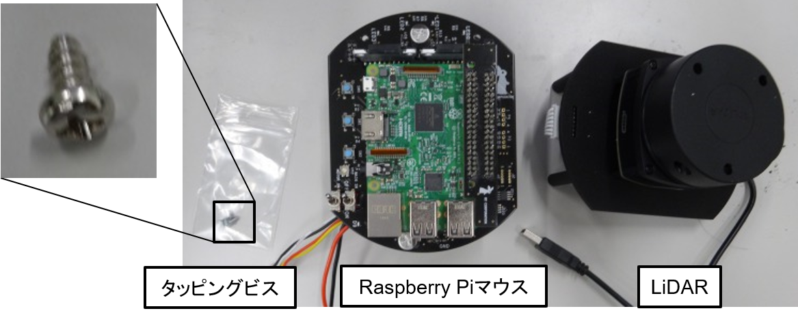</a>

次にRaspberry Piマウス底面のねじを外してください。

<a href="slam30.png">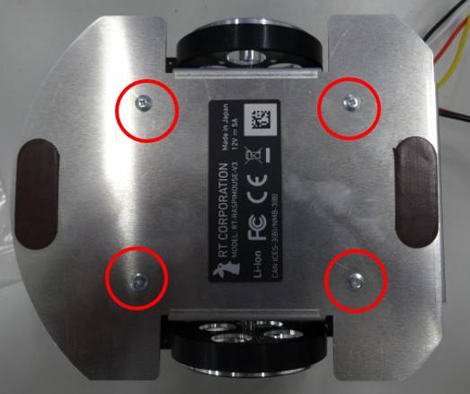</a>

基盤部分をフレームごとずらしてください。

<a href="slam31.png">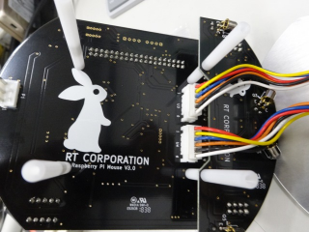</a>

次にスペーサーを手で回して外してください。

<a href="slam32.png">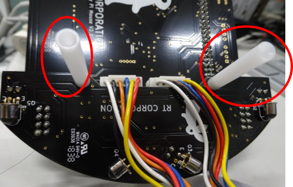</a>

センサ基盤を外してください。

<a href="slam33.png">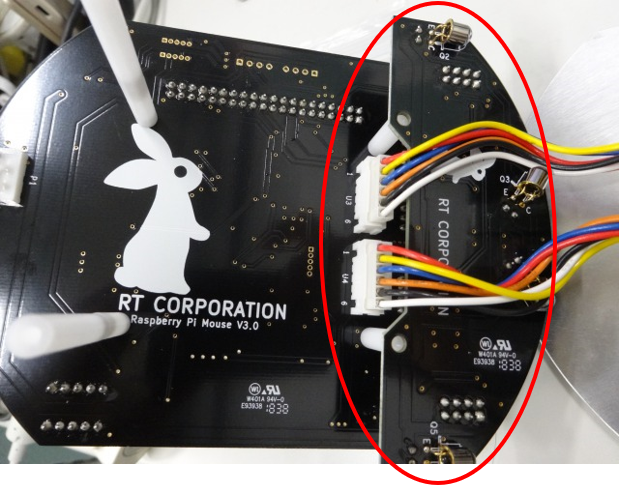</a>

<a href="slam34.png">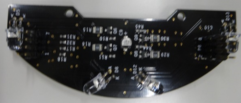</a>

LiDARをRaspberry Piマウスの上部分に載せてビスで固定してください。

<a href="slam35.png">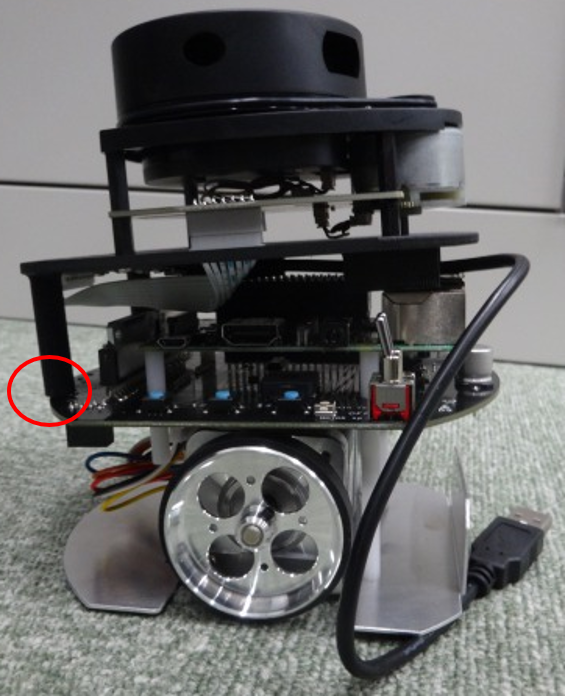</a>

<a href="slam36.png">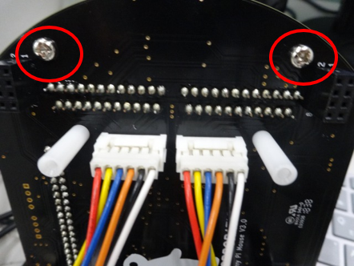</a>

<a href="slam37.png">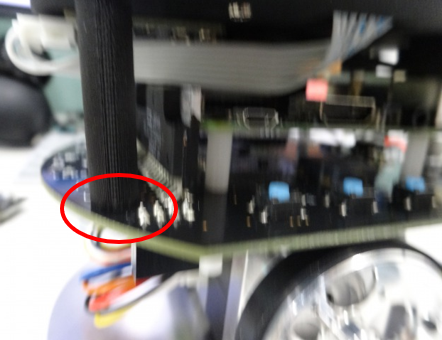</a>

Raspberry PiマウスとLiDARをUSBポートで接続してください。

<a href="slam38.png">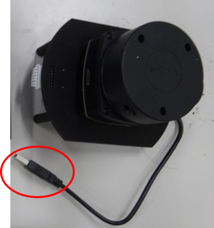</a>

<a href="slam39.png">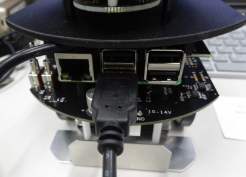</a>

外したパーツを元に戻せば完成です。

#### マルチLiDARマウント

以下の画像のように4つのツメを引っかけるマウントの場合、下記の手順で取り付けてください。

以下のように4つのツメをRaspberry Piマウス本体に引っかけます。

まず、前方の2つのツメを引っかけてください。

<a href="DSC04145.JPG">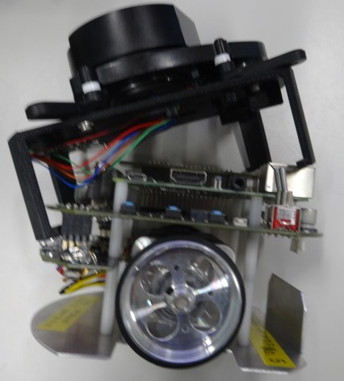</a>

次に後ろのツメを引っかけます。

<a href="DSC04146.JPG">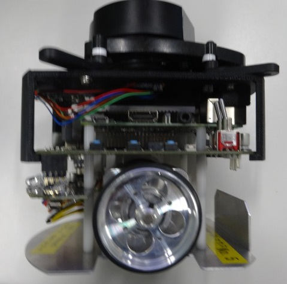</a>

そして、マルチLiDARマウントの前方2か所をなべタッピングネジ3-8で固定すれば取付完了です。

<a href="DSC04151.JPG">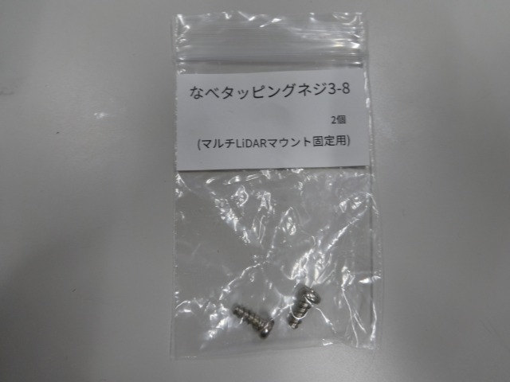</a>

<a href="DSC04147.JPG">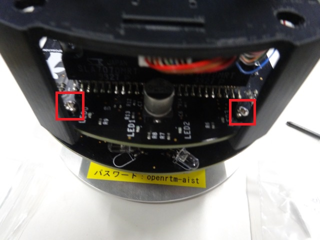</a>

Raspberry PiマウスとLiDARをUSBポートで接続してください。

<a href="DSC04148.JPG">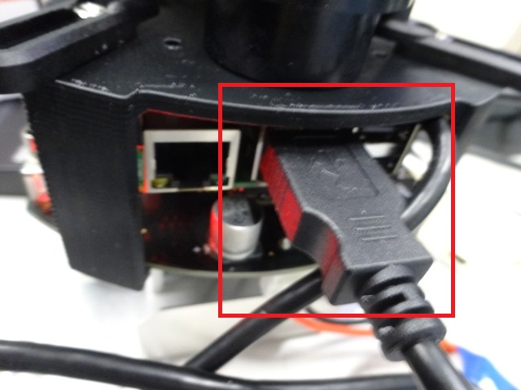</a>

LiDARの取り付け作業が完了したらRaspberryPiマウスの電源スイッチをオンにしてアクセスポイントに接続してください。

<!-- *** MapServer、NavigationManagerのダウンロード -->

<!-- 講習会でUSBメモリを配布している場合は、ダウンロードは不要です。 -->

<!-- MapServer、NavigationManagerはGUIで操作します。 -->
<!-- Raspberry Piでも起動可能ですが、その場合Raspberry Piをディスプレイに接続するか、X Window Systemで他のPCに画面を表示するかする必要があります。 -->
<!-- 今回はMapServer、NavigationManagerをPC上で起動するため、以下から実行に必要なファイルをダウンロードしてください。 -->

<!-- - [[RTM_Tutorial.zip:https://github.com/OpenRTM/RTM_Tutorial/releases/download/20220930/RTM_Tutorial.zip]] -->

<!-- MapServer、NavigationManagerはRTM_Tutorial.zipを展開したフォルダの''Navigation''フォルダに含まれています。 -->

<!-- *** 起動済みのRTC終了 -->

<!-- RobotController、RaspberryPiMouseRTCなどが起動済みの場合は終了します。 -->

<!-- RaspberryPiMouseRTCはWEBブラウザの操作でStopをクリックしてください。 -->

<!-- #ref(slam47.png,/jp/node/7098,center) -->

## SLAMによるナビゲーション地図生成システム

この章では自己位置推定をしながら環境地図生成を行うシステムを試してみます。
MRPTは[ICP-SLAM、RBPF-SLAM](https://www.mrpt.org/List_of_SLAM_algorithms)などのアルゴリズムが使用可能ですが、移動ロボットのナビゲーションに関わるRTコンポーネント群ではICP-SLAMを使用します。
ICPアルゴリズムは2つの点群データ(地図データ、LRFで取得した最新のデータ)を平行移動、回転を繰り返すことで、対応関係にある点の距離が最短になるように位置合わせをするアルゴリズムです。
ICPアルゴリズムで作成中の地図データの点群データとLRFで取得したデータを位置合わせすることで現在の位置を計算します。

### Mapperシステムの起動(Raspberry Pi)
まずはWEBブラウザの操作でMapperシステムを起動します。

<a href="slam1.png">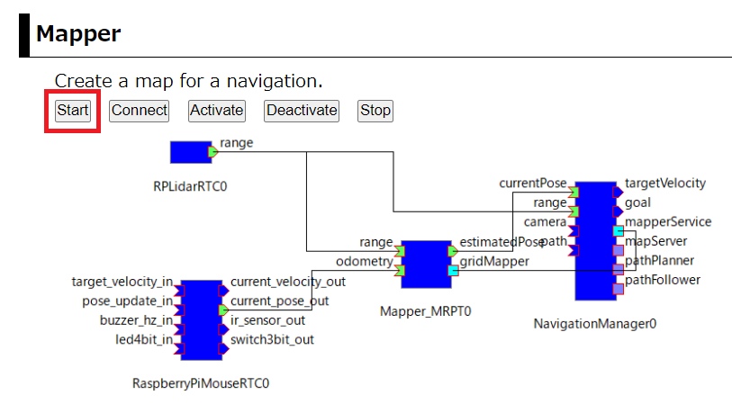</a>

元の画面に戻らない場合は「Back to the top page.」を押してください。

<a href="slam2.png">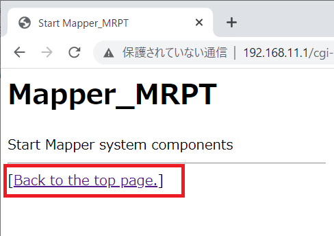</a>

### NavigationManagerの起動(PC)
次にNavigationManagerを起動します。
Navigationフォルダ内の以下のバッチファイル、シェルスクリプトを実行してください。

- NavigationManager.bat(Windows)
- NavigationManager.sh(Ubuntu)

すると以下のGUIが起動します。

<a href="slam48.png">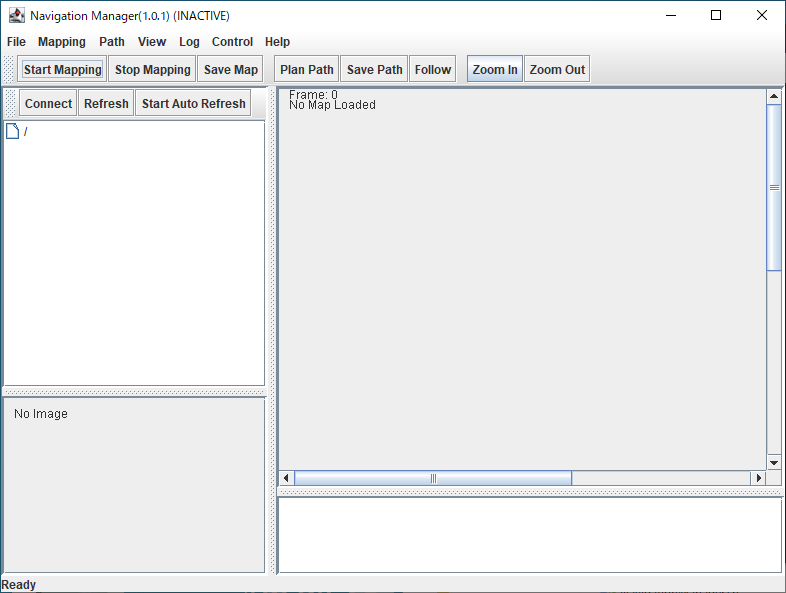</a>

### ポートの接続、RTCのアクティブ化

RTSystemEditorのネームサービスビューは以下の状態になっているはずです。

<a href="slam28.png">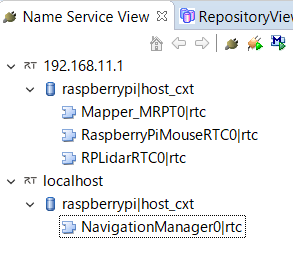</a>

まずはWEBブラウザの操作で**Connect**ボタンを押してください。
これでRaspberry Pi上のRTCのポートは接続されます。

<a href="slam14.png">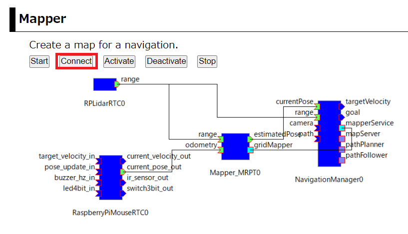</a>

システムダイアグラム上で以下のように接続してください。

<a href="slam46.png">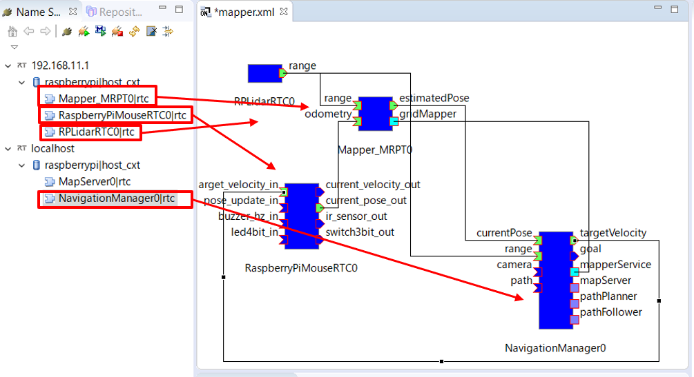</a>

NavigationManagerに関わる部分以外は接続済みのため、以下のポートを接続します。

<table class="table-alt">
  <tr>
    <th>コンポーネント名</th>
    <th>ポート名</th>
    <th>コンポーネント名</th>
    <th>ポート名</th>
  </tr>
  <tr>
    <td>NavigationManager0</td>
    <td>mapperService</td>
    <td>Mapper_MRPT0</td>
    <td>gridMapper</td>
  </tr>
  <tr>
    <td>NavigationManager0</td>
    <td>currentPose</td>
    <td>Mapper_MRPT0</td>
    <td>estimatedPose</td>
  </tr>
  <tr>
    <td>NavigationManager0</td>
    <td>targetVelocity</td>
    <td>RaspberryPiMouseRTC0</td>
    <td>target_velocity_in</td>
  </tr>
  <tr>
    <td>NavigationManager0</td>
    <td>range</td>
    <td>RPLiderRTC0(RobotisLDSensor0)</td>
    <td>range</td>
  </tr>
</table>

接続したらRTCをアクティブ化してください。

<a href="slam5.png">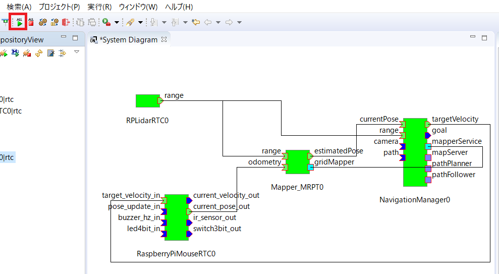</a>

### 地図作成

NavigationManagerのGUIの**Start Mapping**ボタンを押してください。

<a href="slam6.png">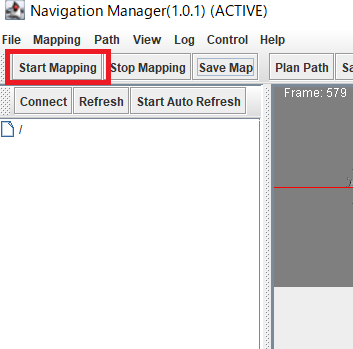</a>

次にRTCをアクティブ化した時に以下のジョイスティックGUIが起動しているため、黄色い円をマウスで操作してください。
それでRaspberry Piマウスが移動します。

<a href="slam8.png">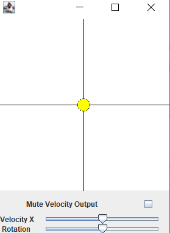</a>

しばらく操作すると以下のように環境地図が得られます。

<a href="testMap.png">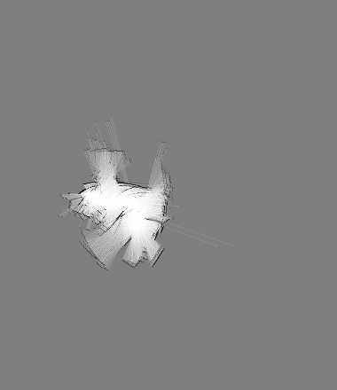</a>

地図生成が終了したら**Stop Mapping**ボタンを押してください。

<a href="slam10.png">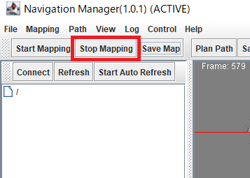</a>

次に地図データを保存します。
**Save Map**ボタンを押してください。

<a href="slam11.png">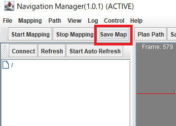</a>

ファイル名を**testMap**と設定して、Navigationフォルダに保存してください。
 ※**開く**ボタンをクリックすると保存されます。

<a href="slam45.png">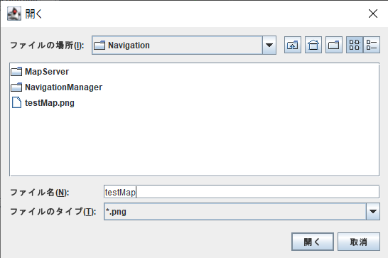</a>

最後にWEBブラウザの操作でMapperシステムを終了させます。

<a href="slam13.png">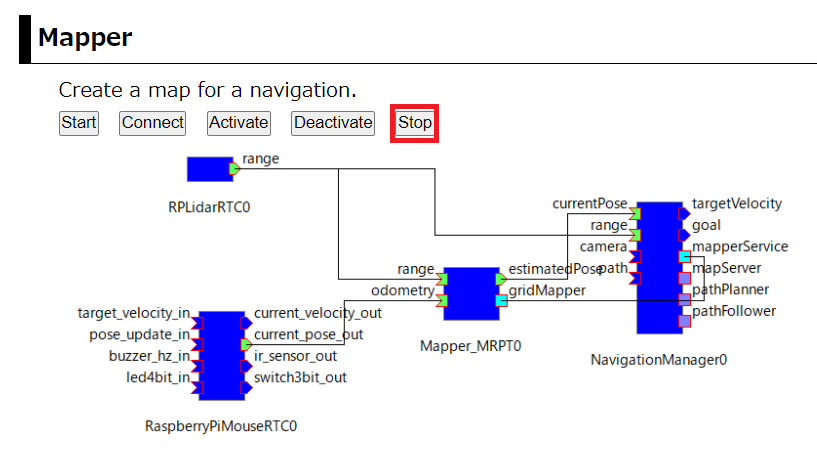</a>

## ナビゲーション(経路計画)システムの実行

ここからは作成した環境地図データを用いてRaspberry Piマウスの経路計画を試してみます。

### PathPlanシステムの起動(Raspberry Pi)
WEBブラウザの操作でPathPlanシステムを起動します。

<a href="slam15.png">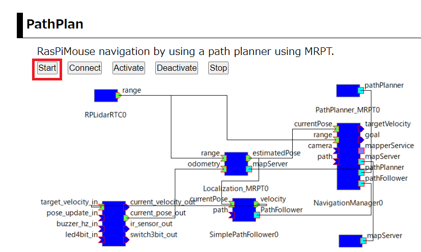</a>

元の画面に戻らない場合は「Back to the top page.」を押してください。

### NavigationManager、MapServerの起動(PC)
次にNavigationManagerとMapServerを起動します。
NavigationManagerが起動済みの場合はMapServerのみを起動してください。
Navigationフォルダ内の以下のバッチファイル、シェルスクリプトを実行してください。

- NavigationManager.bat(Windows)、NavigationManager.sh(Ubuntu)
- MapServer.bat(Windows)、MapServer.sh(Ubuntu)

### ポートの接続、RTCのアクティブ化

RTSystemEditorのネームサービスビューは以下の状態になっているはずです。

<a href="slam18.png">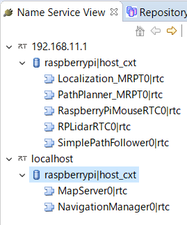</a>

まずはWEBブラウザの操作で**Connect**ボタンを押してください。
これでRaspberry Pi上のRTCのポートは接続されます。

<a href="slam16.png">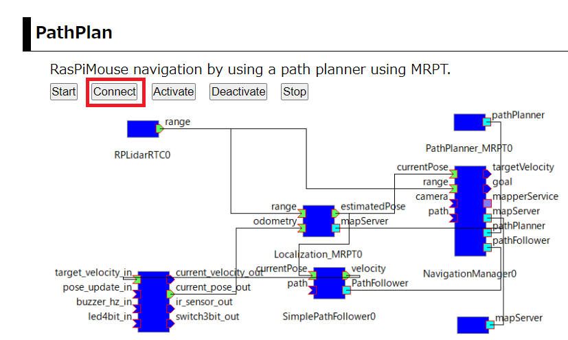</a>

システムダイアグラム上で以下のように接続してください。

<a href="slam19.png">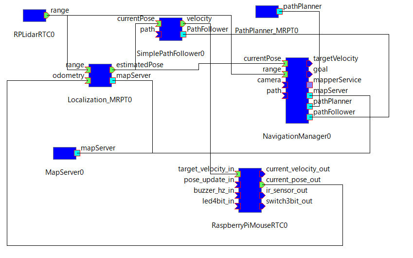</a>

<table class="table-alt">
  <tr>
    <th>コンポーネント名</th>
    <th>ポート名</th>
    <th>コンポーネント名</th>
    <th>ポート名</th>
  </tr>
  <tr>
    <td>NavigationManager0</td>
    <td>mapServer</td>
    <td>MapServer0</td>
    <td>mapServer</td>
  </tr>
  <tr>
    <td>NavigationManager0</td>
    <td>pathPlanner</td>
    <td>PathPlanner_MRPT0</td>
    <td>pathPlanner</td>
  </tr>
  <tr>
    <td>NavigationManager0</td>
    <td>pathFollower</td>
    <td>SimplePathFollower0</td>
    <td>PathFollower</td>
  </tr>
  <tr>
    <td>NavigationManager0</td>
    <td>currentPose</td>
    <td>Localization_MRPT0</td>
    <td>estimatedPose</td>
  </tr>
  <tr>
    <td>NavigationManager0</td>
    <td>range</td>
    <td>RPLiderRTC0(RobotisLDSensor0)</td>
    <td>range</td>
  </tr>
  <tr>
    <td>MapServer0</td>
    <td>mapServer</td>
    <td>Localization_MRPT</td>
    <td>mapServer</td>
  </tr>
</table>

接続したらRTCをアクティブ化してください。

<a href="slam20.png">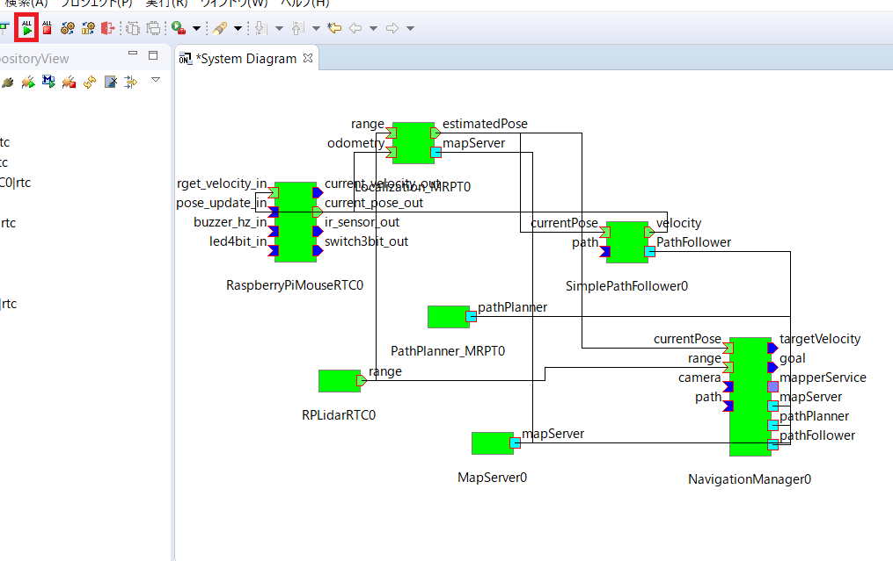</a>

### 経路生成
まずはRaspberry Piマウスの目標位置、目標姿勢角を設定します。
NavigationManagerのGUIの地図上の目標位置となる場所をクリックしてください。
地図上の白い部分が障害物を検出しなかった範囲のため、白い範囲のどこかをクリックしてください。

<a href="slam21.png">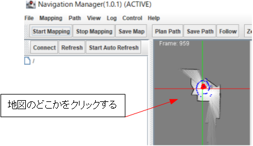</a>

以下の画面が表示されるので、目標角度を設定します。

<a href="slam22.png">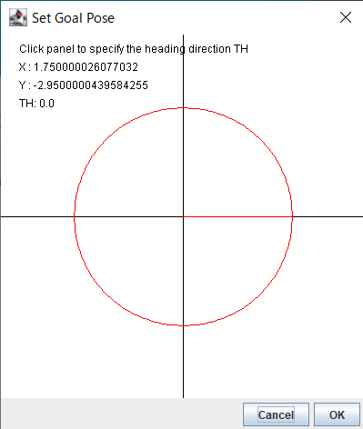</a>

適当な場所をクリックすると中心から延びる赤い線の角度が変化するので、適当な角度に設定してください。

<a href="path23.png">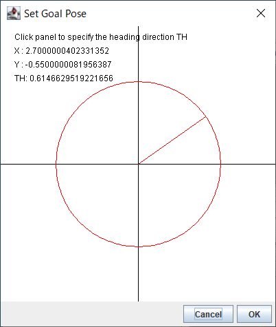</a>

**OK**ボタンを押すと地図上に目標位置が表示されます。

<a href="slam23.png">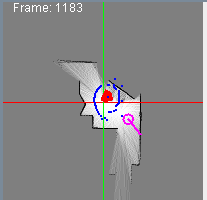</a>

次に**Plan Path**ボタンを押してください。

<a href="slam24.png">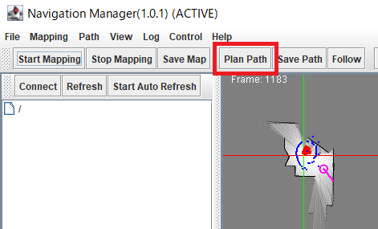</a>

これで目標位置までの目標経路が計算されました。

<a href="slam25.png">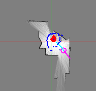</a>

### 経路追従

**Follow**ボタンを押すと経路追従を開始します。

<a href="slam26.png">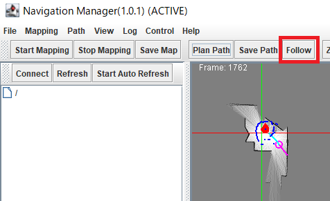</a>

動作確認が終了したら、WEBブラウザのStopボタンからPathPlanシステムを終了してください。
<!-- [[Raspberry Piマウスの電源をオフ:/ja/node/6550#shutdown]]にしてください。 -->

<a href="slam27.png">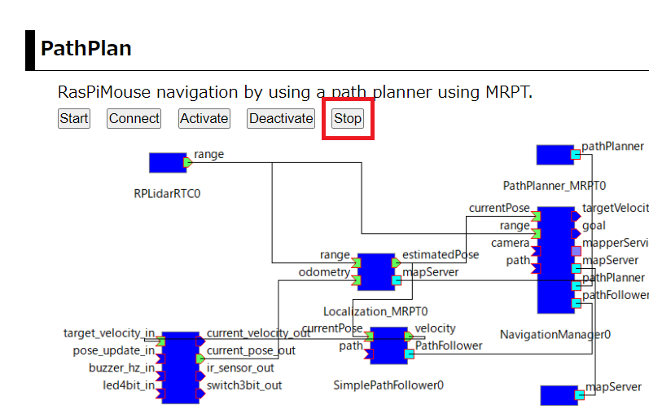</a>

