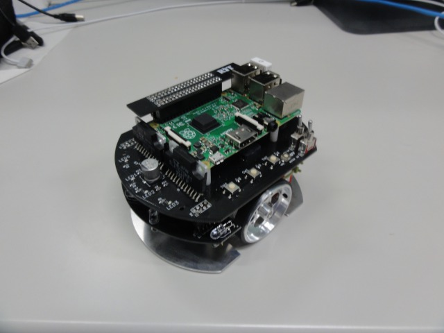
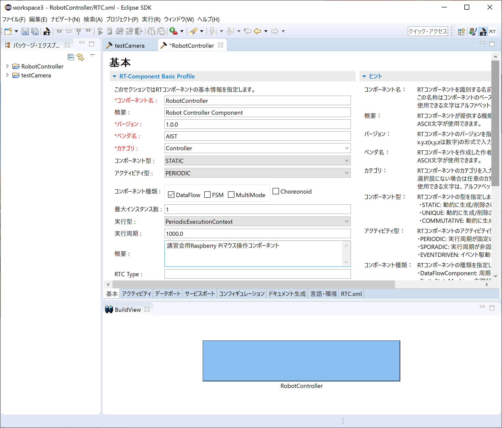
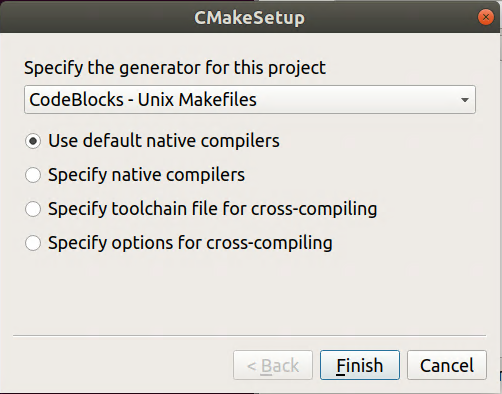
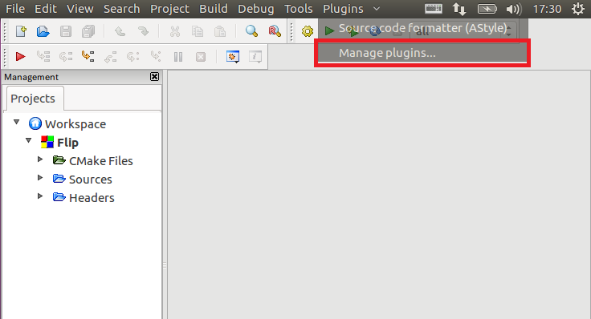
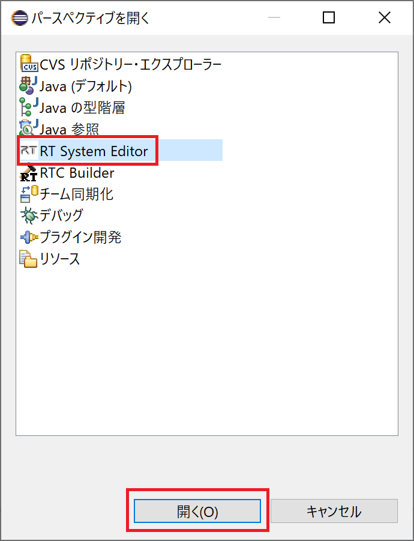
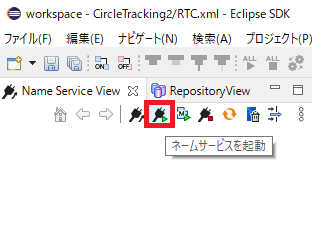
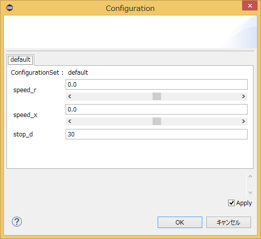
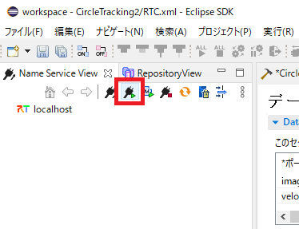
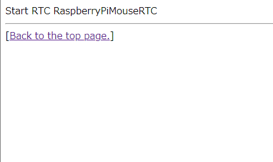
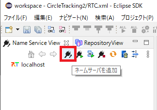

#contents

## Introduction

This page explains the procedure for creating a component to operate the Raspberry Pi Mouse in the simulator.

<div align="center"><a href="raspimouse2.png"></a></div>

## Downloading the Materials

First, download the tutorial materials. If a USB flash drive has been distributed during the seminar, downloading is not necessary.

```bash
 git clone https://github.com/OpenRTM/RTM_Tutorial
```

Seminars may sometimes be conducted in environments without Internet access. In such cases, the materials are included on the distributed USB flash drive.

### Simulator

- [RaspberryPiMouseSimulator Component](/ja/node/6198)

The simulator was developed using the physics engine [Open Dynamics Engine (ODE)](http://www.ode.org/) and the rendering library (drawstuff) included with ODE.

Since it only requires OpenGL support, it should run in most environments.

It can simulate the following robot, the [Raspberry Pi Mouse](http://products.rt-net.jp/micromouse/raspberry-pi-mouse).

<div align="center"><a href="s_DSC00444.JPG"></a></div>

The simulator reproduces not only the dynamics calculations and collision responses of the Raspberry Pi Mouse, but also distance sensor data with values close to those of the actual robot.

## Raspberry Pi Mouse Specifications

The Raspberry Pi Mouse is an independently driven two-wheel mobile robot sold by RT Corporation.

<div align="center"><a href="raspi_gaiyou.jpg"></a></div>

<table class="table-alt">
  <tr>
    <th colspan="2" style="text-align: center;">Raspberry Pi Mouse Specifications</th>
  </tr>
  <tr>
    <td>CPU</td>
    <td>Raspberry Pi 2 Model B</td>
  </tr>
  <tr>
    <td>Motor</td>
    <td>Two ST-42BYG020 stepping motors</td>
  </tr>
  <tr>
    <td>Motor Driver</td>
    <td>Two SLA7070MRPT units</td>
  </tr>
  <tr>
    <td>Distance Sensor</td>
    <td>Four red LEDs + phototransistors (ST-1K3)</td>
  </tr>
  <tr>
    <td>Red LEDs for Monitoring</td>
    <td>4</td>
  </tr>
  <tr>
    <td>Buzzer</td>
    <td>1</td>
  </tr>
  <tr>
    <td>Switch</td>
    <td>3</td>
  </tr>
  <tr>
    <td>Battery</td>
    <td>One LiPo 3-cell (11.1V) 1000mAh battery</td>
  </tr>
</table>


## RT-Component to Be Created

- RobotController Component

This component connects to the RaspberryPiMouseSimulator component and controls the robot in the simulator.

## Creating the RobotController Component

In this tutorial, you will create a component that operates the robot in the simulator using a GUI (slider) and automatically stops the robot when the sensor value exceeds a specified threshold.

<div align="center"><a href="robotcomp.png"></a></div>

### Development Procedure

The procedure is as follows:

- Verify the development environment
- Define the component specification
- Generate source code skeletons using RTC Builder
- Edit the source code
- Verify component operation

### Runtime Environment and Development Environment

Set up the development environment on Linux. In this tutorial, Ubuntu 18.04 is assumed.

#### Installing OpenRTM-aist

```bash
 $ wget https://raw.githubusercontent.com/OpenRTM/OpenRTM-aist/master/scripts/pkg_install_ubuntu.sh
 $ pkg_install_ubuntu.sh -l all --yes
```

#### Installing the JDK

```bash
 # For Ubuntu 18.04 and 18.10
 $ sudo apt-get install openjdk-8-jdk
 # For Ubuntu 16.04
 $ sudo apt-get install default-jdk
```

For Ubuntu 18.04 and 18.10, switch to Java 8 using the following command:

```bash
 $ sudo update-alternatives --config java
```

<!-- **** Installing OpenRTP -->

<!-- Download and install the Linux version of OpenRTP (integrated environment for component development tools and system development tools) from [[this URL:/ja/node/6037]]. -->
<!-- Java is also required to run OpenRTP, so install the default-jre package. -->

<!-- **** Installing JRE -->

<!-- $ apt-get install default-jre -->
<!-- $ wget http://openrtm.org/pub/openrtp/packages/1.1.2.v20160526/eclipse442-openrtp112v20160526-ja-linux-gtk-x86_64.tar.gz -->
<!-- $ tar xvzf eclipse442-openrtp112v20160526-ja-linux-gtk-x86_64.tar.gz -->
<!-- $ cd eclipse -->
<!-- $ ./eclipse -->
<!-- $ ./openrtp -->

<span style="color:red;">After starting openrtp, RTSystemEditor may not be able to connect to the Name Server. In that case, add your host name to the localhost line in /etc/hosts.</span>

```bash
 $ hostname
 ubuntu1804 ← The host name is ubuntu1804
 $ sudo vi /etc/hosts
```

```text
 127.0.0.1       localhost
 Change it as follows:
 127.0.0.1       localhost ubuntu1804
```

#### Installing git

```bash
 $ sudo apt-get install git
```

#### Installing cmake-gui

```bash
 $ sudo apt-get install cmake-qt-gui
```

#### Installing Code::Blocks

Code::Blocks is an integrated development environment that supports C/C++.

It can be installed using the following command:

```bash
 $ sudo apt-get install codeblocks
```

To install the latest version, enter the following commands:

```bash
 $ sudo add-apt-repository ppa:damien-moore/codeblocks-stable
 $ sudo apt-get update
 $ sudo apt-get install codeblocks
```

#### Installing Premake and GLUT

These are required to build ODE.

```bash
 $ sudo apt-get install premake4 freeglut3-dev
```

#### RaspberryPiMouseSimulator Component

The simulator component must be built manually.

Enter the following commands:

```bash
 $ wget https://raw.githubusercontent.com/OpenRTM/RTM_Tutorial/master/script/install_raspimouse_simulator.sh
 $ sudo sh install_raspimouse_simulator.sh
```

Seminars may sometimes be conducted in environments without Internet access. In such cases, run the script included on the distributed USB flash drive.

```bash
 $ sudo sh install_raspimouse_simulator_usb.sh
```

### Component Specification

RobotController has an OutPort for outputting target velocity, an InPort for inputting sensor values, and Configuration parameters for setting the target velocity and the sensor value at which the robot stops.

<table class="table-alt">
  <tr>
    <th>Component Name</th>
    <th>RobotController</th>
  </tr>
  <tr>
    <td colspan="2" style="text-align: center;">InPort</td>
  </tr>
  <tr>
    <td>Port Name</td>
    <td>in</td>
  </tr>
  <tr>
    <td>Type</td>
    <td>RTC::TimedShortSeq</td>
  </tr>
  <tr>
    <td>Description</td>
    <td>Sensor values</td>
  </tr>
  <tr>
    <td colspan="2" style="text-align: center;">OutPort</td>
  </tr>
  <tr>
    <td>Port Name</td>
    <td>out</td>
  </tr>
  <tr>
    <td>Type</td>
    <td>RTC::TimedVelocity2D</td>
  </tr>
  <tr>
    <td>Description</td>
    <td>Target velocity</td>
  </tr>
  <tr>
    <td colspan="2" style="text-align: center;">Configuration</td>
  </tr>
  <tr>
    <td>Parameter Name</td>
    <td>speed_x</td>
  </tr>
  <tr>
    <td>Type</td>
    <td>double</td>
  </tr>
  <tr>
    <td>Default Value</td>
    <td>0.0</td>
  </tr>
  <tr>
    <td>Constraint</td>
    <td>-1.5&lt;:x&lt;:1.5</td>
  </tr>
  <tr>
    <td>Widget</td>
    <td>slider</td>
  </tr>
  <tr>
    <td>Step</td>
    <td>0.01</td>
  </tr>
  <tr>
    <td>Description</td>
    <td>Forward velocity setting</td>
  </tr>
  <tr>
    <td colspan="2" style="text-align: center;">Configuration</td>
  </tr>
  <tr>
    <td>Parameter Name</td>
    <td>speed_r</td>
  </tr>
  <tr>
    <td>Type</td>
    <td>double</td>
  </tr>
  <tr>
    <td>Default Value</td>
    <td>0.0</td>
  </tr>
  <tr>
    <td>Constraint</td>
    <td>-2.0&lt;:x&lt;:2.0</td>
  </tr>
  <tr>
    <td>Widget</td>
    <td>slider</td>
  </tr>
  <tr>
    <td>Step</td>
    <td>0.01</td>
  </tr>
  <tr>
    <td>Description</td>
    <td>Rotational velocity setting</td>
  </tr>
  <tr>
    <td colspan="2" style="text-align: center;">Configuration</td>
  </tr>
  <tr>
    <td>Parameter Name</td>
    <td>stop_d</td>
  </tr>
  <tr>
    <td>Type</td>
    <td>int</td>
  </tr>
  <tr>
    <td>Default Value</td>
    <td>30</td>
  </tr>
  <tr>
    <td>Description</td>
    <td>Sensor threshold for stopping</td>
  </tr>
</table>


#### About the TimedVelocity2D Type

The `TimedVelocity2D` type is used to store the velocity of a mobile robot moving on a two-dimensional plane.

```cpp
     struct Velocity2D
     {
         /// Velocity along the x axis in metres per second.
         double vx;
         /// Velocity along the y axis in metres per second.
         double vy;
         /// Yaw velocity in radians per second.
         double va;
     };
 
 
     struct TimedVelocity2D
     {
         Time tm;
         Velocity2D data;
     };
```

This data type can store the X-axis velocity **vx**, the Y-axis velocity **vy**, and the rotational velocity around the Z-axis **va**.

**vx**, **vy**, and **va** represent velocities in the robot-centered coordinate system.

<br>

<div align="center"><a href="tu_ev3_20.png"></a></div>
<br>

**vx** is the velocity in the X direction, **vy** is the velocity in the Y direction, and **va** is the angular velocity around the Z axis.

For a robot such as Raspberry Pi Mouse, which has two wheels mounted on the left and right sides, **vy** is assumed to be 0 if lateral slipping is not considered.

The robot is controlled by specifying the forward velocity **vx** and rotational velocity **va**.

#### About Distance Sensor Data

The Raspberry Pi Mouse distance sensors output larger values as an object gets closer.

<br>

<div align="center"><a href="rpm14_graph.png"></a></div>
<br>

<table class="table-alt">
  <tr>
    <th>Value Obtained from Device File</th>
    <th>Actual Distance [m]</th>
  </tr>
  <tr>
    <td>1394</td>
    <td>0.01</td>
  </tr>
  <tr>
    <td>792</td>
    <td>0.02</td>
  </tr>
  <tr>
    <td>525</td>
    <td>0.03</td>
  </tr>
  <tr>
    <td>373</td>
    <td>0.04</td>
  </tr>
  <tr>
    <td>299</td>
    <td>0.05</td>
  </tr>
  <tr>
    <td>260</td>
    <td>0.06</td>
  </tr>
  <tr>
    <td>222</td>
    <td>0.07</td>
  </tr>
  <tr>
    <td>181</td>
    <td>0.08</td>
  </tr>
  <tr>
    <td>135</td>
    <td>0.09</td>
  </tr>
  <tr>
    <td>100</td>
    <td>0.10</td>
  </tr>
  <tr>
    <td>81</td>
    <td>0.15</td>
  </tr>
  <tr>
    <td>36</td>
    <td>0.20</td>
  </tr>
  <tr>
    <td>17</td>
    <td>0.25</td>
  </tr>
  <tr>
    <td>16</td>
    <td>0.30</td>
  </tr>
</table>

The simulator reproduces and outputs these values.

In the RobotController component, we will implement processing that automatically stops the robot when this value exceeds a specified threshold.

### Generating the Skeleton Code for the RobotController Component

The skeleton code for the RobotController component is generated using RTCBuilder.

#### Starting RTCBuilder

In OpenRTP, the folder used for various tasks is called a "workspace" (Work Space), and in principle, all generated files are stored under this folder.

The workspace can be created in any accessible folder, but this tutorial assumes the following workspace:

- /home/user_name/workspace

First, start OpenRTP.

```bash
 $ openrtp2
```

You will first be asked to specify the workspace location. Specify the workspace shown above.

<div align="center"><a href="workspace_ubuntu.png"></a></div>

A Welcome page like the one below will then appear.

<br>

<div align="center"><a href="install41.png"></a></div>
<div align="center"><strong>Initial OpenRTP Startup Screen</strong></div>

The Welcome page is not needed at this point, so close it by clicking the "×" button in the upper-left corner.

Click the [Open Perspective] button in the upper-right corner.

<div align="center"><a href="install42.png"></a></div>
<div align="center"><strong>Switching Perspectives</strong></div>

Select "RTC Builder" to start RTCBuilder. The RTCBuilder icon labeled with a "hammer and RT" will appear in the menu bar.

<div align="center"><a href="robomech2018_3.jpg"></a></div>
<div align="center"><strong>Selecting a Perspective</strong></div>


#### Creating a New Project

To create the RobotController component, you need to create a new project in RTC Builder.

Click the [Open New RTCBuilder Editor] icon in the upper-left corner.

<div align="center"><a href="CreateProject_0.png"></a></div>
<div align="center"><strong>Creating a Project for RTC Builder</strong></div>

Enter the project name to create (**RobotController** in this example) in the "Project Name" field and click [Finish].

<div align="center"><a href="RT-Component-BuilderProject_1.png"></a></div>

A project with the specified name is generated and added to the Package Explorer.

<div align="center"><a href="PackageExplolrer_1.png"></a></div>

An RTC profile XML file (`RTC.xml`) with default values is automatically generated in the generated project.

#### Starting the RTC Profile Editor

When `RTC.xml` is generated, the RTCBuilder editor associated with this project should open automatically.

If it does not start, double-click `RTC.xml` in the Package Explorer.

<div align="center"><a href="Open_RTCBuilder_0.png"></a></div>

#### Entering Profile Information and Generating Code

First, select the leftmost "Basic" tab and enter the basic information.

In addition to the RobotController component specification (name) defined earlier, enter information such as the description and version.

Fields displayed in red are required. Other fields may be left at their default values.

- Component Name: RobotController
- Description: Optional (Robot Controller component)
- Version: Optional (1.0.0)
- Vendor: Optional
- Category: Optional (Controller)

<br>

<div align="center"><a href="rtcb10.png"></a></div>
<div align="center"><strong>Entering Basic Information</strong></div>
<br>

Next, select the "Activity" tab and specify the action callbacks to use.

The RobotController component uses the `onActivated()`, `onDeactivated()`, and `onExecute()` callbacks.

As shown below, click onActivated in ①, then check [ON] using the radio button in ②.

Follow the same procedure for onDeactivated and onExecute.

<br>

<div align="center"><a href="Activity_1.png"></a></div>
<div align="center"><strong>Selecting Activity Callbacks</strong></div>
<br>

Next, select the "Data Ports" tab and enter the data port information.

Enter the following values based on the specifications defined earlier. Variable names and display positions are optional and may be left unchanged.

<br>

- InPort Profile:
  - Port Name: in
  - Data Type: RTC::TimedShortSeq

<br>

- OutPort Profile:
  - Port Name: out
  - Data Type: RTC::TimedVelocity2D

<br>

<div align="center"><a href="DataPort_1.png"></a></div>
<div align="center"><strong>Entering Data Port Information</strong></div>
<br>

Next, select the "Configuration" tab and enter the Configuration information based on the specifications defined earlier.

Constraints and Widgets are used to change values through the GUI, such as sliders, spin buttons, and radio buttons, when displaying component configuration parameters in RTSystemEditor.

The forward velocity `speed_x` and rotational velocity `speed_r` will be controlled using sliders.

<br>

- speed_x
  - Name: speed_x
  - Data Type: double
  - Default Value: 0.0
  - Constraint: -1.5&lt;:x&lt;:1.5
  - Widget: slider
  - Step: 0.01
- speed_r
  - Name: speed_r
  - Data Type: double
  - Default Value: 0.0
  - Constraint: -2.0&lt;:x&lt;:2.0
  - Widget: slider
  - Step: 0.01
- stop_d
  - Name: stop_d
  - Data Type: int
  - Default Value: 30
  - Widget: text

<br>

<div align="center"><a href="Configuration_1.png"></a></div>
<div align="center"><strong>Entering Configuration Information</strong></div>
<br>

Next, select the "Language / Environment" tab and choose the programming language.

In this tutorial, select C++ (language). Note that no default value is set for Language / Environment. If you forget to specify it, code generation will fail, so be sure to select a language.

<div align="center"><a href="Language_1.png"></a></div>
<div align="center"><strong>Selecting the Programming Language</strong></div>
<br>

Finally, click the [Generate Code] button on the "Basic" tab to generate the component skeleton code.

<br>

<div align="center"><a href="Generate_1.png"></a></div>
<div align="center"><strong>Generating Skeleton Code (Generate)</strong></div>
<br>

&color(red){* The generated source files are created inside the workspace folder specified when OpenRTP was started.
You can check the current workspace from [File] > [Switch Workspace...].};


### Generating Files Required for CMake Build

The code generated by RTC Builder includes a `CMakeLists.txt` file used to generate various files required for building with CMake.

By using CMake, Visual Studio project files, solution files, Makefiles, and other build files can be automatically generated from `CMakeLists.txt`.

#### Using CMake (cmake-gui)

Use CMake to configure the build environment.

First, start CMake (cmake-gui).

```bash
 $ cmake-gui
```

<div align="center"><a href="CMakeGUI0_2_ubuntu.png"></a></div>
<div align="center"><strong>Starting CMake GUI and Specifying Directories</strong></div>

At the top of the window, there are the following text boxes. Specify the source code location (where `CMakeLists.txt` is located) and the build directory.

- **Where is the source code**
- **Where to build the binaries**

The source code location is the directory where the RobotController component source code was generated and where `CMakeLists.txt` exists.

By default, this is:

```text
<workspace directory>/RobotController
```

You can also drag and drop this directory from Explorer into cmake-gui instead of entering it manually.

The build directory is the location where project files, object files, and generated binaries are stored.

Although any location may be used, it is recommended to specify a RobotController subdirectory with a clear name, such as:

```text
<workspace directory>/RobotController/build
```

<table class="table-alt">
  <tr>
    <td><strong>Where is the source code</strong></td>
    <td>/home/user_name/workspace/RobotController</td>
  </tr>
  <tr>
    <td><strong>Where to build the binaries</strong></td>
    <td>/home/user_name/workspace/RobotController/build</td>
  </tr>
</table>

After entering the paths, click the **[Configure]** button.

A dialog similar to the figure below will appear, allowing you to select the type of project to generate.

In this tutorial, select **CodeBlocks - Unix Makefiles**.

If you do not use Code::Blocks, use **Unix Makefiles**.

<div align="center"><a href="cmake_ubuntu.png"></a></div>
<div align="center"><strong>Selecting the Project Type to Generate</strong></div>

If you do not use cmake-gui, you can generate the files using the following commands:

```bash
 $ mkdir build
 $ cd build
 $ cmake .. -G "CodeBlocks - Unix Makefiles"
```

Click **[Finish]** in the dialog to start configuration.

If there are no problems, **"Configuring done"** will be displayed in the log window at the bottom.

Next, click the **[Generate]** button.

When **"Generating done"** is displayed, generation of the project files, solution files, and related files is complete.

CMake creates cache files during configuration.

If you change settings or modify the environment while troubleshooting, select:

```text
[File] > [Delete Cache]
```

delete the cache, and then rerun the configuration process from the beginning.

### Editing the Header and Source Files

Next, start Code::Blocks by double-clicking `RobotController.cbp` in the build directory specified earlier.

Edit the header file (`include/RobotController/RobotController.h`) and the source file (`src/RobotController.cpp`).

You can open the editor by clicking `RobotController.h` and `RobotController.cpp` from Projects in Code::Blocks.

<div align="center"><a href="codeblocks0_2.png"></a></div>

&color(red){In a 64-bit environment, Code::Blocks may become unstable.
In that case, disabling the plug-in called code completion may resolve the issue.};

Select "Plugins" > "Manage plugins...".

<div align="center"><a href="codeblocks1_0.png"></a></div>

Select "code completion" and click the [Disable] button.

<div align="center"><a href="codeblocks2_0.png"></a></div>

If Code::Blocks does not work properly, try this procedure.

#### Implementing Activity Processing

In the RobotController component, the configuration parameters (`speed_x`, `speed_y`) are controlled using sliders, and their values are output as target velocities through the OutPort (`out`).

The values received through the InPort (`in`) are stored in variables, and the robot is stopped when any value exceeds a specified threshold.

<br>

The processing performed by `onActivated()`, `onExecute()`, and `onDeactivated()` is shown in the figure below.

<br>

<div align="center"><a href="RCRTC_State_1.png"></a></div>

<div align="center"><strong>Overview of Activity Processing</strong></div>
<br>

#### Editing the Header File (RobotController.h)

Declare the variable `sensor_data` for temporarily storing sensor values.

```cpp
   private:
     double sensor_data[4];    // Variable for temporarily storing sensor values
```

#### Editing the Source File (RobotController.cpp)

Implement `onActivated()`, `onDeactivated()`, and `onExecute()` as shown below.

```cpp
 RTC::ReturnCode_t RobotController::onActivated(RTC::UniqueId ec_id)
 {
     // Initialize sensor values
     for (int i = 0; i < 4; i++)
     {
         sensor_data[i] = 0;
     }
 
   return RTC::RTC_OK;
 }
```

```cpp
 RTC::ReturnCode_t RobotController::onDeactivated(RTC::UniqueId ec_id)
 {
     // Stop the robot
     m_out.data.vx = 0;
     m_out.data.va = 0;
     m_outOut.write();
 
   return RTC::RTC_OK;
 }
```

```cpp
 RTC::ReturnCode_t RobotController::onExecute(RTC::UniqueId ec_id)
 {
     // Check for input data
     if (m_inIn.isNew())
     {
         // Read input data
         m_inIn.read();
         for (int i = 0; i < m_in.data.length(); i++)
         {
             // Store input data
             if (i < 4)
             {
                 sensor_data[i] = m_in.data[i];
             }
         }
     }
 
     // Determine whether to stop only when moving forward
     if (m_speed_x > 0)
     {
         for (int i = 0; i < 4; i++)
         {
             // Check whether the sensor value exceeds the threshold
             if (sensor_data[i] > m_stop_d)
             {
                 // Stop if the sensor value exceeds the threshold
                 m_out.data.vx = 0;
                 m_out.data.va = 0;
                 m_outOut.write();
                 return RTC::RTC_OK;
             }
         }
     }
     // If no sensor value exceeds the threshold, operate according to the configuration parameters
     m_out.data.vx = m_speed_x;
     m_out.data.va = m_speed_r;
     m_outOut.write();
   return RTC::RTC_OK;
 }
```

### Building with Code::Blocks

#### Executing the Build

Click the [Build] button in Code::Blocks to build the project.

<br>

<div align="center"><a href="codeblocks_build_2.png"></a></div>
<div align="center"><strong>Executing the Build</strong></div>
<br>

## Verifying Operation of the RobotController Component

Connect the created RobotController component to the simulator component and verify its operation.

### Starting RTSystemEditor

Open the OpenRTP perspective selection window and start RT System Editor.

<br>

<div align="center"><a href="rtse2000.png"></a></div>
<br>

### Starting the Name Service

Start the Name Service used to register component references.

<br>

Click the **Start Naming Service** button in RT System Editor.

<div align="center"><a href="robomech2018_6_2.png"></a></div>

<span style="color:red;">* If omniNames does not start when you click "Start Naming Service", verify that the full computer name is set to 14 characters or fewer.</span>

### Starting the RobotController Component

Start the RobotController component.

Execute the `RobotControllerComp` file in the `RobotController/build/src` folder.

```bash
 $ ./RobotControllerComp
```

### Starting the Simulator Component

After moving to the directory where the RaspberryPiMouseSimulator component was installed (**{directory where install_raspimouse_simulator.sh was executed}/RasPiMouseSimulatorRTC/build**), start it using the following command:

```bash
 $ ./src/RaspberryPiMouseSimulatorComp
```

### Connecting the Components

Using RTSystemEditor, connect the RobotController component and the RaspberryPiMouseSimulator component as shown below.

<div align="center"><a href="RTSE_Connect_1.png"></a></div>
<div align="center"><strong>Connecting Components</strong></div>

### Activating the Components

Click the **[Activate Systems]** icon located at the top of RTSystemEditor to activate all components.

If activation is successful, the components will be displayed in light green as shown below.

<br>

<div align="center"><a href="RTSE_Activate_1.png"></a></div>
<div align="center"><strong>Activating Components</strong></div>
<br>

### Verifying Operation

As shown below, configuration parameters can be modified using the **[Edit]** button in the Configuration View.

<br>

<div align="center"><a href="RTSE_Configuration_10.png"></a></div>
<br>

Verify that you can control the Raspberry Pi Mouse in the simulator by adjusting the sliders.

<br>

<div align="center"><a href="RTSE_Configuration_1.png"></a></div>
<div align="center"><strong>Changing Configuration Parameters</strong></div>
<br>

## Verifying Operation on the Actual Robot

&aname(realrobot);

If an actual Raspberry Pi Mouse is available during the seminar, you can verify operation on the real robot.

The procedure is as follows:

- Power on the Raspberry Pi Mouse
- Connect to the Raspberry Pi Mouse access point
- Connect the ports
- Activate the components

### Powering On

The Raspberry Pi Mouse has two power switches:

- Raspberry Pi power switch
- Motor power switch

<br>

<div align="center"><a href="rpm8_raspi.png"></a></div>

<br>

Turning on the inner power switch starts the Raspberry Pi.

<br>

<div align="center"><a href="rpm9_raspi.png"></a></div>

<br>

#### Powering Off

&aname(shutdown);

When shutting down the Raspberry Pi, do not turn it off directly using the power switch.

Press and hold the center button among the three buttons for several seconds to begin shutdown.

Raspbian will complete shutdown in approximately 10 seconds.

After that, turn off the power switch.

<br>

<div align="center"><a href="rpm8.png"></a></div>
<br>

### Connecting to the Access Point

The SSID and password are printed on the label attached to the Raspberry Pi Mouse. Connect to that SSID.

*If the network connection changes, component registration to the Name Server or port connections may fail. In that case, temporarily terminate OpenRTP, the Name Server, and all components.*

If they were started after the network switch, restarting is not necessary.

To close OpenRTP, click the **×** button in the upper-right corner.

You will be prompted to save the system diagram; select **Don't Save**.

<div align="center"><a href="rtse0150.png"></a></div>

Run the **openrtp** command to start OpenRTP.

To restart the Name Server in RT System Editor, click the **Start Naming Service** button again.

<div align="center"><a href="rtse400_2.png"></a></div>

### Starting the Name Server and RTC on the Raspberry Pi

**※ This step is required for the Raspberry Pi Mouse with LiDAR shown below. If you are using a Raspberry Pi Mouse without LiDAR, proceed to the next step.**

<div align="center"><a href="https://rt-net.jp/mobility/wp-content/uploads/2019/12/23b47429c42d672e7f94ae0a3c9c9d6c.png"></a></div>

Using a web browser such as Edge, Chrome, or Firefox, access:

**192.168.11.1**

<div align="center"><a href="slam40.png"></a></div>

The RaspberryPiMouse with OpenRTM-aist page will be displayed.

First, click the **Start NameServer** button to start the Name Server.

<div align="center"><a href="slam42.png"></a></div>

Next, click **Start** for **RaspberryPiMouseRTC**.

<div align="center"><a href="slam41.png"></a></div>

If the page does not automatically return to the main screen, click **Back to the top page.**

<div align="center"><a href="slam43.png"></a></div>

This completes the setup.


### Adding the Name Server

Next, click the **[Add Name Server]** button in RT System Editor and add:

<span style="color:red;">192.168.11.1</span>

<br>

<div align="center"><div align="center"><a href="tutorial_raspimouse0_2.png"></a></div>;  <div align="center"><a href="tutorial_raspimouse1.png"></a></div>;</div>
<br>
<br>

You should then be able to see the RTC named [RaspberryPiMouseRTC](/ja/node/6015#toc0).

<div align="center"><a href="tutorial_raspimouse2.png"></a></div>

RaspberryPiMouseRTC is an RT-Component for controlling Raspberry Pi Mouse, developed by the Robot System Design Laboratory at Meijo University.

### Connecting the Ports

Using RT System Editor, connect the RaspberryPiMouseRTC and RobotController components as shown below.

<div align="center"><a href="tutorial_raspimouse41.png"></a></div>

### Turning On the Motor Power

Before operating the robot, turn on the motor power switch.

Be sure to turn off the motor power whenever it is not needed.

<br>

<div align="center"><a href="rpm10_raspi.png"></a></div>

<br>

### Activating the Components

Once the RTCs are activated, you will be able to operate the Raspberry Pi Mouse.

## Summary

In this tutorial, you learned:

- How to set up a development environment for Raspberry Pi Mouse on Ubuntu
- How to install OpenRTM-aist, OpenRTP, Code::Blocks, CMake, and related tools
- How to build and start the RaspberryPiMouseSimulator component
- How to create a RobotController RT-Component using RTC Builder
- How to define InPorts, OutPorts, and Configuration parameters
- How to generate build files using CMake and Code::Blocks
- How to edit `RobotController.h` and `RobotController.cpp`
- How to implement processing in `onActivated()`, `onExecute()`, and `onDeactivated()`
- How to build and run the RobotController component
- How to connect RobotController to RaspberryPiMouseSimulator in RT System Editor
- How to verify operation in the simulator
- How to connect to an actual Raspberry Pi Mouse and start RaspberryPiMouseRTC
- How to connect and activate RTCs to operate the actual robot

By extending the RobotController component created in this tutorial, you can implement more advanced robot behaviors such as obstacle avoidance, autonomous navigation, and sensor-based motion control.

