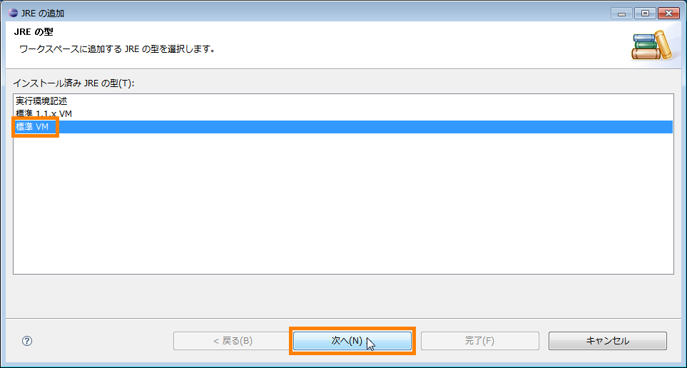
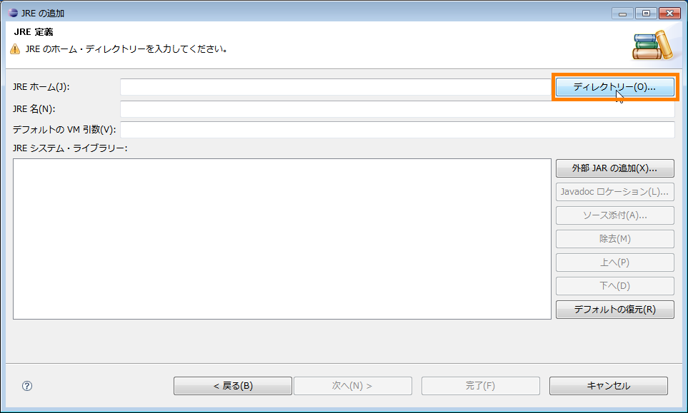
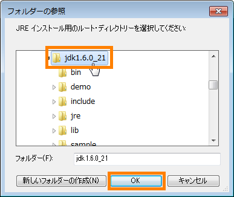
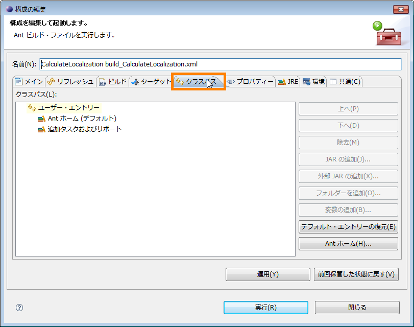

<!-- Title: RTコンポーネント作成について -->
#contents(4)
This section summarizes FAQs related to creating RT components.

#clear
<br>

#### What are the naming rules for RT component instances?
: |The naming rules for RT component instances are as follows:
::[RT component type name] + [number (0, 1, 2, 3...)]
: |~
The RT component type name is the name specified with the --type-name option in rtc-template, or the name specified for "type_name" in the component profile (usually written at the beginning of the *.cpp file).~
Numbers are assigned sequentially as 0, 1, 2, 3... to components created on the same manager.~
~
If multiple instances of the same component are launched in separate processes, the instance number starts from 0 in each process, resulting in multiple components with the same name being launched.~
In some cases, multiple components may be registered with the naming service under the same name, and a previously registered component will be overwritten by one registered later.~
~
To avoid this, methods include:
:: Launching multiple components in the same process
:: Specifying non-conflicting name formats for each component using the naming.formats option in rtc.conf
: |.

<br>

#### How can I use non-standard data types with InPort/OutPort?
: |Normally, OpenRTM-aist allows the following 20 data types defined in rtm/idl/BasicDataType.idl to be used as the data types for InPort and OutPort: TimedShort, TimedLong, TimedUShort, TimedULong, TimedFloat, TimedDouble, TimedChar, TimedBoolean, TimedOctet, TimedString, TimedShortSeq, TimedLongSeq, TimedUShortSeq, TimedULongSeq, TimedFloatSeq, TimedDoubleSeq, TimedCharSeq, TimedBooleanSeq, TimedOctetSeq, and TimedStringSeq.~
~
If you want to define and use a different data type with InPort/OutPort, you must define that data type in IDL and compile and link it at the same time as the component.~
~
Suppose you want to use a data type for storing images that has members for size (width, height), depth, image data, and other values. In IDL, this data type is defined as follows.~
```
 #include <BasicDataType.idl>
 module RTC
 {
   struct TimedImage
   {
     Time tm;
     long width;
     long height;
     long depth;
     sequence<octet> data;
   };
 };
```
: |The Time type is a type defined in OpenRTM for timestamps. It is not required, but it is recommended that you include it.~
Save this as a file named TimedImage.idl.~
~
Place this file in the directory where the component will be created.~
Next, create the component using rtc-template. At that time, specify this IDL file with the --consumer-idl option.~
```
 rtc-template -bcxx \
```
   --module-name=ConsoleIn --module-type='DataFlowComponent' \
   --module-desc='Console input component' \
   --module-version=1.0 --module-vendor='Noriaki Ando, AIST' \
   --module-category=example \
   --module-comp-type=DataFlowComponent --module-act-type=SPORADIC \
   --module-max-inst=10 --outport=out:TimedImage \
   --consumer-idl=TimedImage.idl
: |In this example, the TimedImage type defined in TimedImage.idl is used as the data type for OutPort. Compile the generated code.~
```
 make -f Makefile.ConsoleIn
```
: |TimedImage.idl is then compiled by the IDL compiler, stubs are generated, and they are linked to the component.~
The data can be used within the component in the same way as usual.~
If you want to use the same data type in other components, copy only this IDL file and specify the file in the same way using the --consumer-idl option of rtc-template.~
You can then use this data type for communication between components.

<br>

#### I want to send approximately 2 MB or more of data through a data port
: |When sending image data or similar data through a data port, care is required if the size of the data sent at one time exceeds approximately 2 MB.~
In omniORB, the default maximum size that can be handled by giop (General Inter-ORB Protocol) is "2097152B(2MB)".~
If you try to send data larger than this size at one time, the data cannot be transmitted correctly due to the giop limit.~
There are two ways to change this maximum size.
::Specify the maximum size in rtc.conf.~
```
 # file: rtc.conf
 corba.nameservers: localhost
 naming.formats: %n.rtc
 corba.args: -ORBgiopMaxMsgSize 3145728 # この行を追加
                                          # Maxサイズを3Mに指定
```
:: Specify it using an environment variable~
```
  export ORBgiopMaxMsgSize=3145728
```
:: |* When specifying giopMaxMsgSize, it must be configured on both the server and client (the paired components).~
~
(omniORB configuration and API) [http](//omniorb.sourceforge.net/omni41/omniORB/omniORB004.html:http://omniorb.sourceforge.net/omni41/omniORB/omniORB004.html)

<br>

<!-- **入出力ポートのデータ型の選択  -->
<!-- **ConsoleOut でコールバックが必要な訳は？ -->
&aname(errorjavaJDK);
#### A new Java project cannot be created as JDK6 (1.6) compliant
: |When you try to create a Java project as a new project, a dialog like the following may appear, preventing you from selecting JDK compliance.
: |For projects that use RTCBuilder to create RT components in Java, the JRE (Java Runtime Environment) specified in this dialog must be the JRE included in the JDK. Since the JRE inside the JDK cannot be selected in the current state, change the settings.

: |Click the "Configure JREs..." link in the JRE frame as shown below. (Alternatively, cancel this dialog, then select "Installed JREs" under "Java" from the tree on the left side of the "Preferences" dialog by selecting [Window] > [Preferences] from the Eclipse menu bar.)

<div align="center"><a href="new_project_name_ja.png"></a></div>
<div align="center"><strong>New Java Project dialog (when JDK is not available for selection)</strong></div>

<br>

: |Click the [Add] button.

<div align="center"><a href="new_JRE_setting_ja.png"></a></div>
<div align="center"><strong>Installed JREs dialog (JDK is not yet displayed)</strong></div>

<br>

: |Select Standard VM and click the [Next] button.

<div align="center"><a href="new_JRE_VM_setting_ja.png"></a></div>
<div align="center"><strong>JRE type selection dialog</strong></div>

** |Click the [Directory] button and select the path to JDK6. (Reference: Normally, the JDK6 path is C**: \Program Files\Java\jdk1.6.0_XX)

<div align="center"><a href="add_JRE_ja.png"></a></div>
<div align="center"><strong>Add JRE dialog</strong></div>
<br>

<div align="center"><a href="select_JDK_ja.png"></a></div>
<div align="center"><strong>Select the path to JDK6 and have the "Add JRE" dialog reference the JDK</strong></div>
<br>
: |When the path to the JDK is successfully referenced, the "Add JRE" dialog appears as shown below. Click the [Finish] button to close the dialog.

<div align="center"><a href="load_JDK_ja.png"></a></div>
<div align="center"><strong>Successfully referenced the JDK6 path</strong></div>
<br>

: |You will return to the "Installed JREs" dialog with the JDK added. Select the checkbox for the JRE to be made active as shown below, and click the [OK] button.

<div align="center"><a href="set_active_JDK_ja.png"></a></div>
<div align="center"><strong>The JDK has been added to the "Installed JREs" dialog, so change the active selection to the JDK</strong></div>
<br>

: |The JDK can now be selected in the "New Java Project" dialog.

<div align="center"><a href="SelectJDKasJRE_ja.png"></a></div>
<div align="center"><strong>Specify that the JRE inside the JDK should be used as the "JRE"</strong></div>

<br>
````

```markdown
## Part 2/2

&aname(Antbuild);
#### How can I configure a classpath to an arbitrary folder and perform an Ant build?
: |OpenRTM-aist (Java edition) establishes integration between code generation in RTCBuilder and Ant builds by setting the environment variable RTM_JAVA_ROOT to the base path (path to the parent folder) of the "jar" folder containing the OpenRTM-aist (Java edition) library "OpenRTM-aist-X.X.X.jar" (where X.X.X is the version), and using that setting for the classpath. Therefore, RTM_JAVA_ROOT must always contain the path (or base path) to the OpenRTM-aist (Java edition) library folder. However, as its name indicates, RTM_JAVA_ROOT originally points to the installation location of OpenRTM-aist (Java edition). As a result, the OpenRTM-aist (Java edition) libraries and other components (documents, samples, and utility tools) must always retain that folder structure.~
~
Another possible method is to use the environment variable RTM_JAVA_ROOT exclusively for classpath configuration. You could place the OpenRTM-aist (Java edition) library folder in any location and configure RTM_JAVA_ROOT accordingly. However, in this case, you must ensure that "the environment variable RTM_JAVA_ROOT is not used for anything other than the classpath to the library."~
~
Therefore, this section explains how to configure the classpath when, for some reason, you want to set it to a location different from the one specified by RTM_JAVA_ROOT.

<br>

:: **Open the Ant Settings Dialog in Eclipse**|In the usual left-side "Package Explorer" view in Eclipse, right-click build_<CompName>.xml and select [Run As] > [Ant Build...].

<div align="center"><a href="Call_Ant_Setting_ja.png"></a></div>
<div align="center"><strong>Open the Ant settings dialog</strong></div>

<br>

: |
:: **Configure the Classpath**|When the Ant settings dialog appears, select the "Classpath" tab.

<div align="center"><a href="Ant_Setting_Classpath_ja.png"></a></div>
<div align="center"><strong>Select the "Classpath" tab</strong></div>

<br>

: |
:: |Select "User Entries" once, and then click the "Add External JARs" button.

<div align="center"><a href="Ant_External_Jar_ja.png"></a></div>
<div align="center"><strong>Add an external JAR</strong></div>
<br>
: |
:: |When the "JAR Selection" dialog appears, specify the path to the desired JAR library. As a result, the added JAR library is displayed in the Ant settings dialog as shown below.

<div align="center"><a href="Ant_Add_Jar_ja.png"></a></div>
<div align="center"><strong>Added JAR</strong></div>

<br>

: |
::**Important Notes**|The environment variable RTM_JAVA_ROOT must always be set (although it may be a dummy value). Even if the RTM_JAVA_ROOT setting becomes unnecessary because the classpath is specified manually, deleting the setting or leaving it unset will cause an error during the build. In addition, a folder named "jar" must actually exist at the path specified by RTM_JAVA_ROOT, even if the folder is empty.


