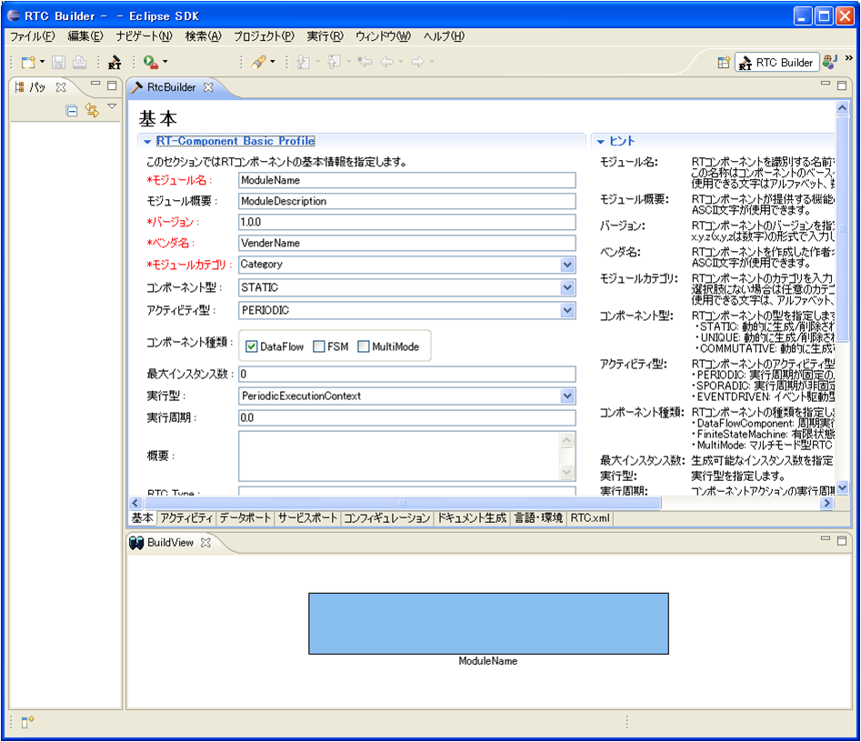
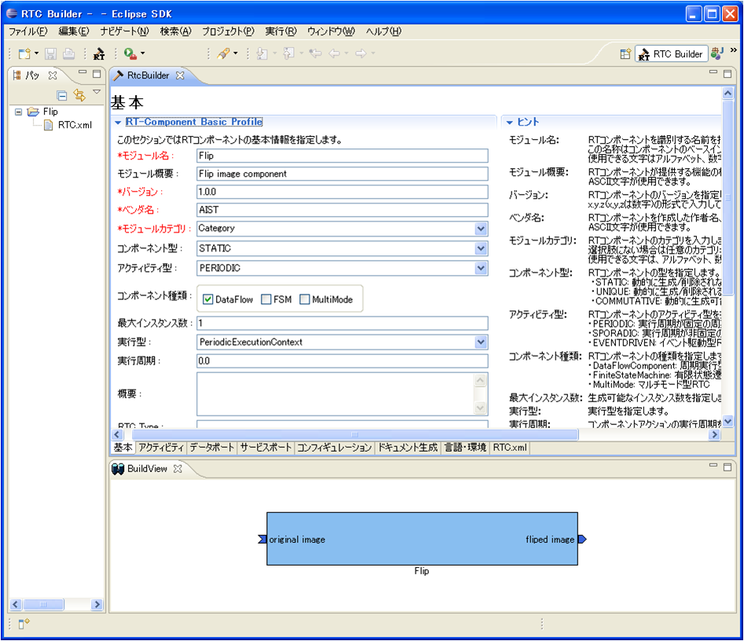
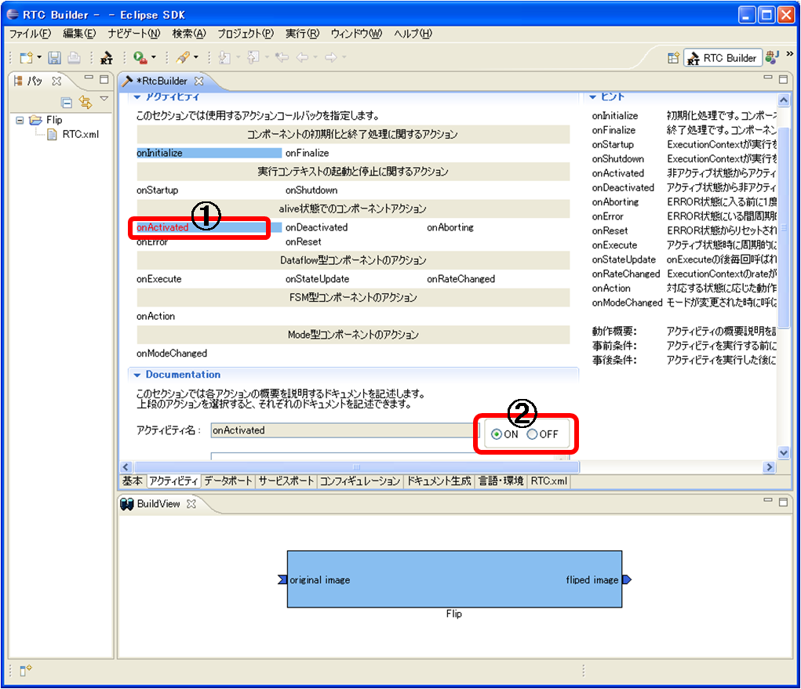
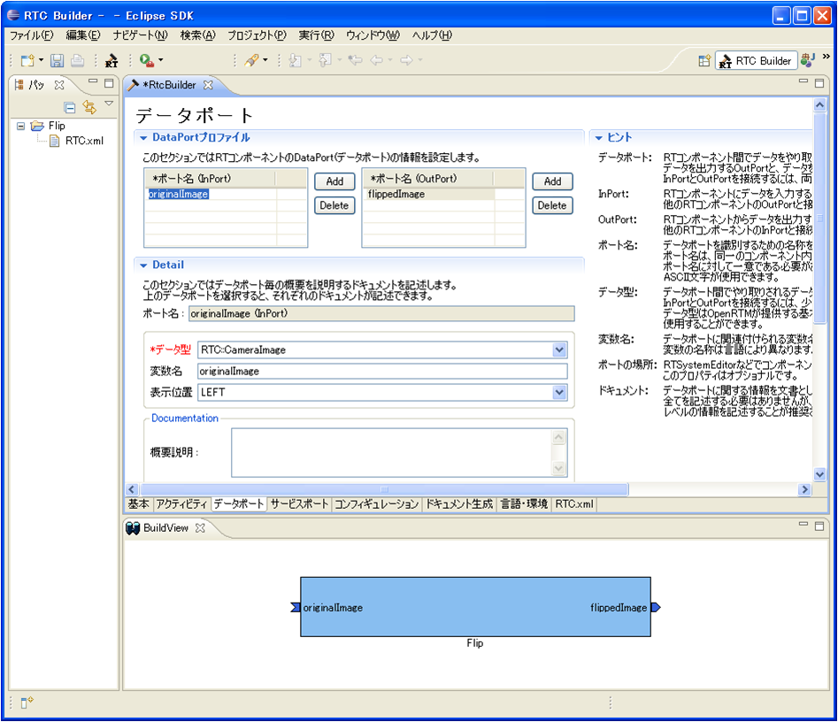
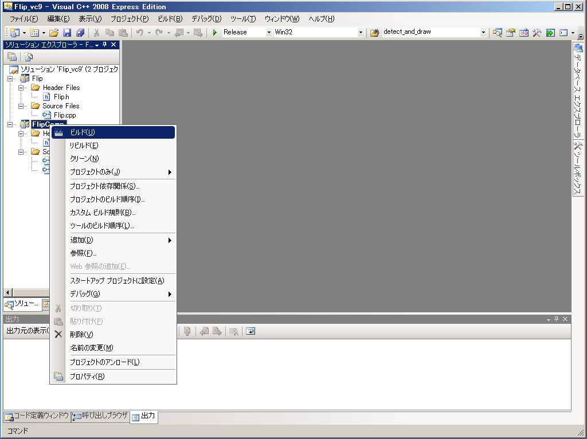
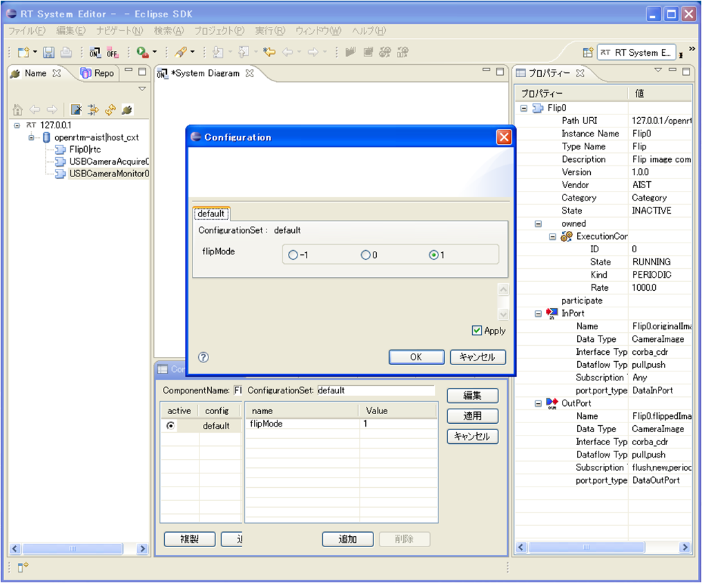

<!-- Title: RTコンポーネント作成(OpenCV編 CameraImage型の使用) -->
#contents

# Introduction
This section introduces the procedure for converting the OpenCV library into an RT component using VC9.

## What Is OpenCV?

[OpenCV](http://opencv.jp/) is an open-source computer vision library developed and released by Intel.

Excerpt from [Wikipedia](http://ja.wikipedia.org/wiki/OpenCV).

## RT Component to Be Created

- Flip component: An RT component that flips images using the cvFlip() function from the OpenCV library.

# Creating an RT Component from the OpenCV Library (Flip Component)

Here, we create an RT component in VC9 from cvFlip(), a function in the OpenCV library that flips images.

The following is the workflow.

- About the cvFlip function
- Component overview
- Operating environment and development environment
- Generating the Flip component template
- Implementing activity processing
- Checking component operation

## About the cvFlip Function

The cvFlip function flips a two-dimensional array vertically, horizontally, or along both axes.

```
 void cvFlip(IplImage* src, IplImage* dst=NULL, int flip_mode=0);
 #define cvMirror cvFlip
  
 src       入力配列
 dst       出力配列。もし dst = NULL であれば、src が上書きされます。
 flip_mode 配列の反転方法の指定内容:
 　flip_mode = 0: X軸周りでの反転(上下反転)
 　flip_mode > 0: Y軸周りでの反転(左右反転)
 　flip_mode < 0: 両軸周りでの反転(上下左右反転)
```

## Component Overview

A component that flips an input image from an InPort and outputs it from an OutPort.

<br>
The target axis for flipping is specified using the RTC configuration function with a parameter named flipMode.

Specify flipMode as follows according to the direction in which you want to flip the image.

- To flip vertically, specify 0

- To flip horizontally, specify 1

- To flip vertically and horizontally, specify -1

<br>

The specifications of the RTC to be created are as follows.

- InPort
  - Captured image data (CameraImage)

- OutPort
  - Flipped image data (CameraImage)

- Configuration
  - Flip method specification (int)

* The CameraImage type is a data type defined in InterfaceDataTypes.idl of OpenRTM-aist as follows.

```
   struct CameraImage
     {
         /// Time stamp.
         Time tm;
         /// Image pixel width.
         unsigned short width;
         /// Image pixel height.
         unsigned short height;
         /// Bits per pixel.
         unsigned short bpp;
         /// Image format (e.g. bitmap, jpeg, etc.).
         string format;
         /// Scale factor for images, such as disparity maps,
         /// where the integer pixel value should be divided
         /// by this factor to get the real pixel value.
         double fDiv;
         /// Raw pixel data.
         sequence<octet> pixels;
     };
```


<br>
Figure 1 shows an image of the image processing for each flipMode.

<br>

<div align="center"><a href="cvFlip_and_FlipRTC.png"></a></div>
<div align="center"><strong>Figure 1. flipMode specification patterns of the Flip component</strong></div>
<br>

## Operating Environment and Development Environment
- OS: Windows XP SP3
- Compiler: [Visual C++ 2008 Express Edition Japanese Version](http://www.microsoft.com/japan/msdn/vstudio/express/default.aspx)

- [OpenCV 2.1 (for VC2008)](http://sourceforge.net/projects/opencvlibrary/files/opencv-win/2.1/OpenCV-2.1.0-win32-vs2008.exe/download)
- [OpenRTM-aist-1.0.0-RELEASE (C++ version), Win32 VC2008](http://www.openrtm.org/pub/Windows/OpenRTM-aist/cxx/OpenRTM-aist-1.0.0-RELEASE_vc9_100212.msi)

- [OpenCV RTCs (Win32 installer)](http://www.openrtm.org/pub/OpenRTM-aist/components/OpenCV/OpenCV-RTC-0.0.1.msi)
- [OpenCV RTCs (source code)](http://www.openrtm.org/pub/OpenRTM-aist/components/OpenCV/OpenCV_RTC_0.0.1.tar.gz)

- RTSystemEditor 1.0
- RTCBuilder 1.0
  - [All-in-one package for Windows: Eclipse3.4.2+RTSE(1.0.0-RELEASE)+RTCB(1.0.0-RELEASE)](http://www.openrtm.org/pub/OpenRTM-aist/tools/1.0.0/eclipse342_rtmtools100release_win32_ja.zip)

- [Extraction tool (Lhaplus)](http://www.forest.impress.co.jp/lib/arc/archive/archiver/lhaplus.html)

## Generating the Flip Component Template

The Flip component template is generated using RTCBuilder.

### Starting RTCBuilder

When you start Eclipse by specifying a new workspace, a "Welcome" screen like the following is displayed.
<br>

<div align="center"><a href="fig1-1EclipseInit.png"></a></div>
<!-- CENTER:''図 1-1 Eclipseの初期起動時の画面'' -->
<div align="center"><strong>Figure 2. Screen at initial startup of Eclipse</strong></div>
<br>
Click the "X" at the upper left of this "Welcome" screen to close it, and the following screen is displayed.
Click the [Open Perspective] button at the upper right and select "Other..." from the pull-down menu.
<br>

<div align="center"><a href="fig2-2PerspectiveSwitch.png"></a></div>
<!-- CENTER:''図 2-2 パースペクティブの切り替え'' -->
<div align="center"><strong>Figure 3. Switching perspectives</strong></div>
<br>
Select "RTC Builder" and click the [OK] button.
<br>

<div align="center"><a href="fig2-3PerspectiveSelection.png"></a></div>
<!-- CENTER:''図 2-3　パースペクティブの選択'' -->
<div align="center"><strong>Figure 4. Selecting a perspective</strong></div>
<br>
RTCBuilder starts.
<br>

<div align="center"><a href="NewRTCBEditor.png"></a></div>
<!-- CENTER:''図 2-4 RTC Builderの初期起動時画面'' -->
<div align="center"><strong>Figure 5. Screen at initial startup of RTC Builder</strong></div>
<br>

### Creating an RTCBuilder Project
First, create an Eclipse project for creating an RT component.
From the menu at the top of the screen, select [File] > [New] > [Project].
<br>

<div align="center"><a href="fig2-5CreateProject.png"></a></div>
<!-- CENTER:''図 2-5 RTC Builder 用プロジェクトの作成　１'' -->
<div align="center"><strong>Figure 6. Creating an RTC Builder project 1</strong></div>
<br>
In the displayed "New Project" screen, select [Other] > [RTC Builder], and click [Next].
<br>

<div align="center"><a href="fig2-6CreateProject2.png"></a></div>
<!-- CENTER:''図 2-6 RTC Builder 用プロジェクトの作成　２'' -->
<div align="center"><strong>Figure 7. Creating an RTC Builder project 2</strong></div>
<br>
Enter the project name to be created in the "Project name" field and click [Finish].
<br>

<div align="center"><a href="RT-Component-BuilderProject.png"></a></div>
<!-- CENTER:''図 2-7 RTC Builder 用プロジェクトの作成　３'' -->
<div align="center"><strong>Figure 8. Creating an RTC Builder project 3</strong></div>
<br>
A project with the specified name is generated and added to the Package Explorer.
<br>

<div align="center"><a href="PackageExplolrer.png"></a></div>
<!-- CENTER:''図 2-8 RTC Builder 用プロジェクトの作成　４'' -->
<div align="center"><strong>Figure 9. Creating an RTC Builder project 4</strong></div>
<br>
Inside the generated project, an RTC profile XML (RTC.xml) with default values is automatically generated.

### Starting the RTC Profile Editor
To open the RTC profile editor, click the [Open New RtcBuilder Editor] button on the toolbar, or select [File] > [Open New Builder Editor] from the menu.
<br>

<div align="center"><a href="Open_RTCBuilder.png"></a></div>
<!-- CENTER:''図 2-9 ツールバーから Open New RtcBuilder Editor'' -->
<div align="center"><strong>Figure 10. Open New RtcBuilder Editor from the toolbar</strong></div>
<br>
<br>

<div align="center"><a href="fig2-10FileMenuOpenNewBuilder.png"></a></div>
<!-- CENTER:''図 2-10 File メニューから Open New Builder Editor'' -->
<div align="center"><strong>Figure 11. Open New Builder Editor from the File menu</strong></div>
<br>

### Entering Component Profile Information and Generating Code

1. Select the "Basic" tab and enter the basic information.

<br>
- Module name: Flip
- Module description: Flip image component
- Version: 1.0.0
- Vendor name: AIST
- Module category: Category
- Component type: STATIC
- Activity type: PERIODIC
- Component kind: DataFlowComponent
- Maximum number of instances: 1
- Execution type: PeriodicExecutionContext
- Execution period: 0.0 (<span style="color:RED;">Figure 13 shows 1.0, but set it to 0.0.</span>;)
<br>
- Output Project: Flip


<br>

<div align="center"><a href="Basic.png"></a></div>
<div align="center"><strong>Figure 13. Entering basic information</strong></div>
<br>

2. Select the "Activity" tab and specify the action callbacks to use.

The Flip component uses the onActivated(), onDeactivated(), and onExecute() callbacks.
As shown in Figure 14, after clicking onActivated in ①, check the [ON] radio button in ②. Perform the same operation for onDeactivated and onExecute.

<br>

<div align="center"><a href="Activity.png"></a></div>
<div align="center"><strong>Figure 14. Selecting activity callbacks</strong></div>
<br>

3. Select the "Data Ports" tab and enter the data port information.

<br>
- InPort Profile:
  - Port name: originalImage
  - Data type: CameraImage
  - Variable name:  originalImage
  - Display position: left
<br>
- OutPort Profile:
  - Port name: flippedImage
  - Data type: CameraImage
  - Variable name:  flippedImage
  - Display position: right

<br>

<div align="center"><a href="DataPort.png"></a></div>
<div align="center"><strong>Figure 15. Entering data port information</strong></div>
<br>

4. Select the "Configuration" tab and enter the Configuration information.

The configuration is changed with radio buttons.

<br>
- flipMode
  - Name: flipMode
  - Data type: int
  - Default value: 1
  - Variable name: flipMode
  - Constraint condition: (-1, 0, 1) <span style="color:RED;">* (-1: vertical and horizontal flip, 0: vertical flip, 1: horizontal flip)</span>;
  - Widget: radio

<br>

<div align="center"><a href="Configuration.png"></a></div>
<div align="center"><strong>Figure 16. Entering configuration information</strong></div>
<br>

5. Select the "Language and Environment" tab and select the programming language.

This time, select C++ (language).

<br>

<div align="center"><a href="Language.png"></a></div>
<div align="center"><strong>Figure 17. Selecting the programming language</strong></div>
<br>

6. Click the [Code Generation] button on the "Basic" tab to generate the component template.

<br>

<div align="center"><a href="Generate.png"></a></div>
<div align="center"><strong>Figure 18. Generating the template (Generate)</strong></div>
<br>

<span style="color:Red;">* The generated code files are generated in the workspace folder specified when Eclipse was started. You can check the current workspace from [File] > [Switch Workspace].</span>;

## Implementing Activity Processing

In the Flip component, the image received from the InPort is saved in an image storage buffer, and the saved image is converted using the OpenCV cvFlip() function. After that, the converted image is sent from the OutPort.
<br>

<br>
Figure 19 shows the processing performed in onActivated(), onExecute(), and onDeactivated().
<br>

<div align="center"><a href="FlipRTC_State.png"></a></div>
<div align="center"><strong>Figure 19. Overview of activity processing</strong></div>
<br>

Figure 20 shows the processing in onExecute().

<br>

<div align="center"><a href="FlipRTC.png"></a></div>
<div align="center"><strong>Figure 20. Processing in onExecute()</strong></div>
<br>


### Copying the User Property Sheet for OpenCV
A property sheet is a type of VC configuration file that describes various options required for compilation, such as include paths, library load paths, libraries, and macros.
In VC projects generated by RTCBuilder or rtc-template, VC property sheets are used to provide various options. In addition, a user-defined property sheet is also included so that users can add additional options.
- rtm_config.vsprop: A property sheet containing information related to OpenRTM. Since this file depends on the installed OpenRTM-aist, use copyprops.bat to copy it from the OpenRTM system directory to the current project.
- user_config.vsprops: A user-defined property sheet. It is empty by default. For usage, refer to user_config.vsprops (OpenCV settings) included in the source code: OpenRTM-aist/win32/OpenRTM-aist/example/USBCamera.

Save the following content with the file name user_config.vsprops and copy it to the Flip folder.

Alternatively, download the vsprops file from the link below and save it to the Flip folder.

<br>
[user_config.vsprops](http://www.openrtm.org/OpenRTM-aist/download/ROBOMEC2010/user_config.vsprops)

* A user_config.vsprops file already exists in the Flip folder, but you can overwrite it.

<br>
```
 <?xml version="1.0" encoding="shift_jis"?>
 <VisualStudioPropertySheet
 	ProjectType="Visual C++"
 	Version="8.00"
 	Name="OpenCV21"
 	>
 	<Tool
 		Name="VCCLCompilerTool"
 		AdditionalIncludeDirectories="$(cv_includes)"
 	/>
 	<Tool
 		Name="VCLinkerTool"
 		AdditionalLibraryDirectories="$(cv_libdir)"
 	/>
 	<UserMacro
 		Name="user_lib"
 		Value="$(cv_lib)"
 	/>
 	<UserMacro
 		Name="user_libd"
 		Value="$(cv_libd)"
 	/>
 	<UserMacro
 		Name="cv_root"
 		Value="C:\OpenCV2.1"
 	/>
 	<UserMacro
 		Name="cv_includes"
 		Value="&quot;$(cv_root)\include\opencv&quot;"
 	/>
 	<UserMacro
 		Name="cv_libdir"
 		Value="&quot;$(cv_root)\lib&quot;"
 	/>
 	<UserMacro
 		Name="cv_bin"
 		Value="$(cv_root)\bin"
 	/>
 	<UserMacro
 		Name="cv_lib"
 		Value="cv210.lib cvaux210.lib highgui210.lib cxcore210.lib"
 	/>
 	<UserMacro
 		Name="cv_libd"
 		Value="cv210d.lib cvaux210d.lib highgui210d.lib cxcore210d.lib"
 	/>
 </VisualStudioPropertySheet>
```

### Running copyprops.bat

By executing the file named copyprops.bat, a file named rtm_config.vsprops is copied.

The rtm_config.vsprops file describes the include paths, libraries to link, and other settings required to build RT components with VC++.

### Editing the Header File

- Include the OpenCV include files in order to use the OpenCV library.

```
 //OpenCV 用インクルードファイルのインクルード
 #include<cv.h>
 #include<cxcore.h>
 #include<highgui.h>
```

- This cvFlip component performs each of the following operations: allocating an image area, Flip processing, and releasing the allocated image area. These operations are performed in the onActivated(), onDeactivated(), and onExecute() callback functions, respectively.

```
   /***
    *
    * The activated action (Active state entry action)
    * former rtc_active_entry()
    *
    * @param ec_id target ExecutionContext Id
    *
    * @return RTC::ReturnCode_t
    * 
    * 
    */
   virtual RTC::ReturnCode_t onActivated(RTC::UniqueId ec_id);
 
   /***
    *
    * The deactivated action (Active state exit action)
    * former rtc_active_exit()
    *
    * @param ec_id target ExecutionContext Id
    *
    * @return RTC::ReturnCode_t
    * 
    * 
    */
   virtual RTC::ReturnCode_t onDeactivated(RTC::UniqueId ec_id);
 
   /***
    *
    * The execution action that is invoked periodically
    * former rtc_active_do()
    *
    * @param ec_id target ExecutionContext Id
    *
    * @return RTC::ReturnCode_t
    * 
    * 
    */
   virtual RTC::ReturnCode_t onExecute(RTC::UniqueId ec_id);
```

- Add member variables for saving the flipped image.

```
   IplImage* m_imageBuff;
   IplImage* m_flipImageBuff;
```

### Editing the Source File

Implement onActivated(), onDeactivated(), and onExecute() as follows.

```
 RTC::ReturnCode_t Flip::onActivated(RTC::UniqueId ec_id)
 {
   // イメージ用メモリーの初期化
   m_imageBuff = NULL;
   m_flipImageBuff = NULL;
 
   // OutPort の画面サイズの初期化
   m_flippedImage.width = 0;
   m_flippedImage.height = 0;
  
   return RTC::RTC_OK;
 }
 
 
 RTC::ReturnCode_t Flip::onDeactivated(RTC::UniqueId ec_id)
 {
   if(m_imageBuff != NULL)
   {
     // イメージ用メモリーの解放
     cvReleaseImage(&m_imageBuff);
     cvReleaseImage(&m_flipImageBuff);
   }
 
   return RTC::RTC_OK;
 }
 
 
 RTC::ReturnCode_t Flip::onExecute(RTC::UniqueId ec_id)
 {
   // 新しいデータのチェック
   if (m_originalImageIn.isNew()) {
     // InPort データの読み込み
     m_originalImageIn.read();
 
     // InPort と OutPort の画面サイズ処理およびイメージ用メモリーの確保
     if( m_originalImage.width != m_flippedImage.width || m_originalImage.height != m_flippedImage.height)
       {
 	m_flippedImage.width = m_originalImage.width;
 	m_flippedImage.height = m_originalImage.height;
 
 	// InPort のイメージサイズが変更された場合
 	if(m_imageBuff != NULL)
 	  {
 	    cvReleaseImage(&m_imageBuff);
 	    cvReleaseImage(&m_flipImageBuff);
 	  }
 
 	// イメージ用メモリーの確保
 	m_imageBuff = cvCreateImage(cvSize(m_originalImage.width, m_originalImage.height), IPL_DEPTH_8U, 3);
 	m_flipImageBuff = cvCreateImage(cvSize(m_originalImage.width, m_originalImage.height), IPL_DEPTH_8U, 3);
       }
 
     // InPort の画像データを IplImage の imageData にコピー
     memcpy(m_imageBuff->imageData,(void *)&(m_originalImage.pixels[0]),m_originalImage.pixels.length());
 
     // InPort からの画像データを反転する。 m_flipMode 0: X軸周り, 1: Y軸周り, -1: 両方の軸周り
     cvFlip(m_imageBuff, m_flipImageBuff, m_flipMode);
 
     // 画像データのサイズ取得
     int len = m_flipImageBuff->nChannels * m_flipImageBuff->width * m_flipImageBuff->height;
     m_flippedImage.pixels.length(len);
 
     // 反転した画像データを OutPort にコピー
     memcpy((void *)&(m_flippedImage.pixels[0]),m_flipImageBuff->imageData,len);
 
     // 反転した画像データを OutPort から出力する。
     m_flippedImageOut.write();
   }
 
   return RTC::RTC_OK;
 }
```

### Running the Build

Double-click the Flip_vc9.sln file to start Visual C++ 2008.

After Visual C++ 2008 starts, build the component as shown in Figure 21.

<br>

<div align="center"><a href="VC++_build.png"></a></div>
<div align="center"><strong>Figure 21. Running the build</strong></div>
<br>

## Checking Operation of the Flip Component

Here, we connect and check the operation of the USBCameraAqcuireComp component and the USBCameraMonitorCom component installed with "OpenCV RTCs (Win32 installer)", together with the Flip component created here.

### Starting NameService

Start the omniORB name service.

<br>
Go to [Start] > [All Programs] > [OpenRTM-aist] > [C++] > [tools], and click "Start Naming Service".

&color(RED){* If omniNames does not start even after clicking "Star Naming Service", check whether the full computer name is set to 14 characters or fewer.

### Creating rtc.conf

For RT components, information such as the name server address and the registration format for the name server must be specified in a file named rtc.conf.

Save the following content with the file name rtc.conf and place it in the Flip\FlipComp\Debug (or Release) folder.

<span style="color:RED;">* If the workspace was left as the default when Eclipse was started, the path of the Flip folder is</span>;

<span style="color:RED;">   C:\Documents and Settings\<login user name>\workspace.</span>;

```
 corba.nameservers: localhost
 naming.formats: %n.rtc
```

### Starting the Flip Component

Start the Flip component.

Run the FlipComp.exe file located in the folder where you placed the rtc.conf file earlier.

### Starting the USBCameraAqcuire and USBCameraMonitor Components

Start the USBCameraAqcuireComp component, which outputs captured images from a USB camera from an OutPort, and the USBCameraMonitorComp component, which displays images received through an InPort on the screen.

These two components can be started with the following procedure.


Select [Start] > [All Programs] > [OpenRTM-aist] > [components] > [C++] > [OpenCV], and click "USBCameraAqcuireComp" and "USBCameraMonitorComp" respectively to run them.

### Connecting the Components

Connect the USBCameraAqcuireComp, Flip, and USBCameraMonitorComp components in RTSystemEditor as shown in Figure 22.

<br>

<div align="center"><a href="RTSE_Connect.png"></a></div>
<div align="center"><strong>Figure 22. Connecting the components</strong></div>
<br>

### Activating the Components

Click the "ALL" icon at the top of RTSystemEditor to activate all components.

If they are activated successfully, the components are displayed in yellow-green as shown in Figure 23.

<br>

<div align="center"><a href="RTSE_Activate.png"></a></div>
<div align="center"><strong>Figure 23. Activating the components</strong></div>
<br>

### Operation Check

As shown in Figure 24, you can change the configuration in the Configuration View.

Change the configuration parameter "flipMode" of the Flip component to "0" or "-1", etc., and check whether the image is flipped.

<br>

<div align="center"><a href="RTSE_Configuration.png"></a></div>
<div align="center"><strong>Figure 24. Changing configuration parameters</strong></div>
<br>

## Source File of the Flip Component

```
 // -*- C++ -*-
 /*!
  * @file  Flip.cpp
  * @brief Flip image component
  * @date $Date$
  *
  * $Id$
  */
 
 #include "Flip.h"
 
 // Module specification
 static const char* flip_spec[] =
   {
     "implementation_id", "Flip",
     "type_name",         "Flip",
     "description",       "Flip image component",
     "version",           "1.0.0",
     "vendor",            "AIST",
     "category",          "Category",
     "activity_type",     "PERIODIC",
     "kind",              "DataFlowComponent",
     "max_instance",      "1",
     "language",          "C++",
     "lang_type",         "compile",
     // Configuration variables
     "conf.default.flipMode", "1",
     // Widget
     "conf.__widget__.flipMode", "radio",
     // Constraints
     "conf.__constraints__.flip_mode", "(-1,0,1)",
     ""
   };
 
 /*!
  * @brief constructor
  * @param manager Maneger Object
  */
 Flip::Flip(RTC::Manager* manager)
   : RTC::DataFlowComponentBase(manager),
     m_originalImageIn("originalImage", m_originalImage),
     m_flippedImageOut("flippedImage", m_flippedImage)
 {
 }
 
 /*!
  * @brief destructor
  */
 Flip::~Flip()
 {
 }
 
 
 RTC::ReturnCode_t Flip::onInitialize()
 {
   // Registration: InPort/OutPort/Service
   // Set InPort buffers
   addInPort("originalImage", m_originalImageIn);
   
   // Set OutPort buffer
   addOutPort("flippedImage", m_flippedImageOut);
   
   // Bind variables and configuration variable
   bindParameter("flipMode", m_flipMode, "1");
 
   return RTC::RTC_OK;
 }
 
 
 RTC::ReturnCode_t Flip::onActivated(RTC::UniqueId ec_id)
 {
   // イメージ用メモリーの初期化
   m_imageBuff = NULL;
   m_flipImageBuff = NULL;
 
   // OutPort の画面サイズの初期化
   m_flippedImage.width = 0;
   m_flippedImage.height = 0;
  
   return RTC::RTC_OK;
 }
 
 
 RTC::ReturnCode_t Flip::onDeactivated(RTC::UniqueId ec_id)
 {
   if(m_imageBuff != NULL)
   {
     // イメージ用メモリーの解放
     cvReleaseImage(&m_imageBuff);
     cvReleaseImage(&m_flipImageBuff);
   }
 
   return RTC::RTC_OK;
 }
 
 
 RTC::ReturnCode_t Flip::onExecute(RTC::UniqueId ec_id)
 {
   // 新しいデータのチェック
   if (m_originalImageIn.isNew()) {
     // InPort データの読み込み
     m_originalImageIn.read();
 
     // InPort と OutPort の画面サイズ処理およびイメージ用メモリーの確保
     if( m_originalImage.width != m_flippedImage.width || m_originalImage.height != m_flippedImage.height)
       {
 	m_flippedImage.width = m_originalImage.width;
 	m_flippedImage.height = m_originalImage.height;
 
 	// InPort のイメージサイズが変更された場合
 	if(m_imageBuff != NULL)
 	  {
 	    cvReleaseImage(&m_imageBuff);
 	    cvReleaseImage(&m_flipImageBuff);
 	  }
 
 	// イメージ用メモリーの確保
 	m_imageBuff = cvCreateImage(cvSize(m_originalImage.width, m_originalImage.height), IPL_DEPTH_8U, 3);
 	m_flipImageBuff = cvCreateImage(cvSize(m_originalImage.width, m_originalImage.height), IPL_DEPTH_8U, 3);
       }
 
     // InPort の画像データを IplImage の imageData にコピー
     memcpy(m_imageBuff->imageData,(void *)&(m_originalImage.pixels[0]),m_originalImage.pixels.length());
 
     // InPort からの画像データを反転する。 m_flipMode 0: X軸周り, 1: Y軸周り, -1: 両方の軸周り
     cvFlip(m_imageBuff, m_flipImageBuff, m_flipMode);
 
     // 画像データのサイズ取得
     int len = m_flipImageBuff->nChannels * m_flipImageBuff->width * m_flipImageBuff->height;
     m_flippedImage.pixels.length(len);
 
     // 反転した画像データを OutPortにコピー
     memcpy((void *)&(m_flippedImage.pixels[0]),m_flipImageBuff->imageData,len);
 
     // 反転した画像データを OutPortから出力する。
     m_flippedImageOut.write();
   }
 
   return RTC::RTC_OK;
 }
 
 
 extern "C"
 {
  
   void FlipInit(RTC::Manager* manager)
   {
     coil::Properties profile(flip_spec);
     manager->registerFactory(profile,
                              RTC::Create<Flip>,
                              RTC::Delete<Flip>);
   }
   
 };
```

## Header File of the Flip Component

```
 // -*- C++ -*-
 /*!
  * @file  Flip.h
  * @brief Flip image component
  * @date  $Date$
  *
  * $Id$
  */
 
 #ifndef FLIP_H
 #define FLIP_H
 
 #include <rtm/Manager.h>
 #include <rtm/DataFlowComponentBase.h>
 #include <rtm/CorbaPort.h>
 #include <rtm/DataInPort.h>
 #include <rtm/DataOutPort.h>
 #include <rtm/idl/BasicDataTypeSkel.h>
 #include <rtm/idl/ExtendedDataTypesSkel.h>
 #include <rtm/idl/InterfaceDataTypesSkel.h>
 
 //OpenCV 用インクルードファイルのインクルード
 #include<cv.h>
 #include<cxcore.h>
 #include<highgui.h>
 
 using namespace RTC;
 
 /*!
  * @class Flip
  * @brief Flip image component
  *
  */
 class Flip
   : public RTC::DataFlowComponentBase
 {
  public:
   /*!
    * @brief constructor
    * @param manager Maneger Object
    */
   Flip(RTC::Manager* manager);
 
   /*!
    * @brief destructor
    */
   ~Flip();
 
   /***
    *
    * The initialize action (on CREATED->ALIVE transition)
    * formaer rtc_init_entry() 
    *
    * @return RTC::ReturnCode_t
    * 
    * 
    */
    virtual RTC::ReturnCode_t onInitialize();
 
   /***
    *
    * The activated action (Active state entry action)
    * former rtc_active_entry()
    *
    * @param ec_id target ExecutionContext Id
    *
    * @return RTC::ReturnCode_t
    * 
    * 
    */
    virtual RTC::ReturnCode_t onActivated(RTC::UniqueId ec_id);
 
   /***
    *
    * The deactivated action (Active state exit action)
    * former rtc_active_exit()
    *
    * @param ec_id target ExecutionContext Id
    *
    * @return RTC::ReturnCode_t
    * 
    * 
    */
    virtual RTC::ReturnCode_t onDeactivated(RTC::UniqueId ec_id);
 
   /***
    *
    * The execution action that is invoked periodically
    * former rtc_active_do()
    *
    * @param ec_id target ExecutionContext Id
    *
    * @return RTC::ReturnCode_t
    * 
    * 
    */
    virtual RTC::ReturnCode_t onExecute(RTC::UniqueId ec_id);
 
  protected:
   // Configuration variable declaration
   /*!
    * 
    * - Name:  flipMode
    * - DefaultValue: 1
    */
   int m_flipMode;
 
   // DataInPort declaration
   CameraImage m_originalImage;
 
   /*!
    */
   InPort<CameraImage> m_originalImageIn;
   
   // DataOutPort declaration
   CameraImage m_flippedImage;
 
   /*!
    */
   OutPort<CameraImage> m_flippedImageOut;
 
  private:
   // 処理画像用バッファ
   IplImage* m_imageBuff;
   IplImage* m_flipImageBuff;
 };
 
 
 extern "C"
 {
   DLL_EXPORT void FlipInit(RTC::Manager* manager);
 };
 
 #endif // FLIP_H
```

## Built Package of the Flip Component

The built package can be downloaded from the following link.

The extension is set to "zip_", so rename it to "zip" before extracting it.


- [Built package](http://www.openrtm.org/OpenRTM-aist/download/ROBOMEC2010/Flip.zip_)
