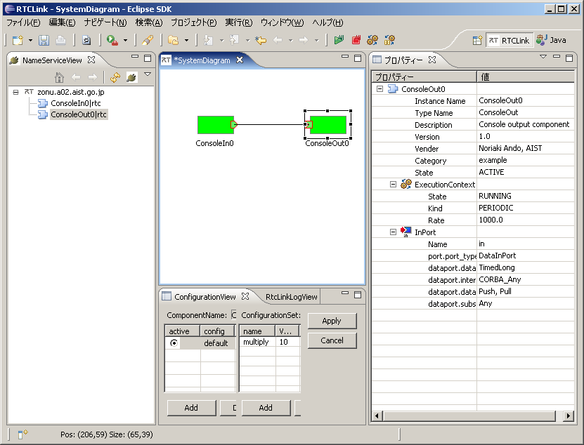

<!-- Title: RTコンポーネント作成の基本 -->
#contents


# Components with Data Ports
Here, we will create two components with data ports and try sending and receiving data between the two components.
The specifications of the components to be created are as follows.

- Component 1
  - Has one OutPort
  - The data type of the OutPort is TimedLong
  - Outputs the value entered from the console from the OutPort

- Component 2
  - Has one InPort
  - The data type of the InPort is TimeLong
  - Has one configuration parameter
  - The configuration parameter is of type int
  - The default value of the configuration parameter is 1
  - When reading from the InPort variable, reads the value multiplied by the parameter
  - Outputs the value read from the InPort to the console

## Source Generation Using rtc-template
To create components with the above specifications, prepare the following shell script named gen.sh.

```
 #!/bin/sh
 
 rtc-template -bcxx \
     --module-name=ConsoleIn --module-type='DataFlowComponent' \
     --module-desc='Console input component' \
     --module-version=1.0 --module-vendor='MyName' \
     --module-category=example \
     --module-comp-type=DataFlowComponent --module-act-type=SPORADIC \
     --module-max-inst=10 --outport=out:TimedLong
 
 rtc-template -bcxx \
     --module-name=ConsoleOut --module-type='DataFlowComponent' \
     --module-desc='Console output component' \
     --module-version=1.0 --module-vendor='MyName' \
     --module-category=example \
     --module-comp-type=DataFlowComponent --module-act-type=SPORADIC \
     --module-max-inst=10 --inport=in:TimedLong \
     --config="multiply:int:1"
```

The first execution of rtc-template creates Component 1: ConsoleInComp, and the next execution of rtc-template creates Component 2: ConsoleOutComp.

```
 > sh gen.sh 
   File "ConsoleIn.h" was generated.
   File "ConsoleIn.cpp" was generated.
   File "ConsoleInComp.cpp" was generated.
   File "Makefile.ConsoleIn" was generated.
   File "ConsoleInComp_vc8.vcproj" was generated.
   File "ConsoleIn_vc8.vcproj" was generated.
   File "ConsoleInComp_vc9.vcproj" was generated.
   File "ConsoleIn_vc9.vcproj" was generated.
   File "ConsoleIn_vc8.sln" was generated.
   File "ConsoleIn_vc9.sln" was generated.
   File "copyprops.bat" was generated.
   File "user_config.vsprops" was generated.
   File "README.ConsoleIn" was generated.
   File "ConsoleIn.yaml" was generated.
   File "ConsoleOut.h" was generated.
   File "ConsoleOut.cpp" was generated.
   File "ConsoleOutComp.cpp" was generated.
   File "Makefile.ConsoleOut" was generated.
   File "ConsoleOutComp_vc8.vcproj" was generated.
   File "ConsoleOut_vc8.vcproj" was generated.
   File "ConsoleOutComp_vc9.vcproj" was generated.
   File "ConsoleOut_vc9.vcproj" was generated.
   File "ConsoleOut_vc8.sln" was generated.
   File "ConsoleOut_vc9.sln" was generated.
 "copyprops.bat" already exists. Overwrite? (y/n)y
   File "copyprops.bat" was generated.
 "user_config.vsprops" already exists. Overwrite? (y/n)y
   File "user_config.vsprops" was generated.
   File "README.ConsoleOut" was generated.
   File "ConsoleOut.yaml" was generated.
```
## Implementing ConsoleIn
Edit the generated source files and implement the ConsoleIn component.

### ConsoleIn.h
This component waits for input when activated and outputs the entered value from the OutPort.
Therefore, it is only necessary to implement the onExecute member function, which is executed repeatedly in the active state. Remove the comment from the commented-out onExecute function in the generated ConsoleIn.h as follows.

```
     :略
   // The execution action that is invoked periodically
   // former rtc_active_do()
   virtual RTC::ReturnCode_t onExecute(RTC::UniqueId ec_id);
     :略
```

Also, near the bottom of ConsoleIn.h, there are variable declarations for the OutPort specified by rtc-template.

```
     :略
   // DataOutPort declaration
   // <rtc-template block="outport_declare">
   TimedLong m_out;
   OutPort<TimedLong> m_outOut;
   // </rtc-template>
```

The variable declared as **TimedLong m_out** is the variable bound to the OutPort.

The variable declared as **OutPort\<TimedLong> m_outOut** is the OutPort instance.


### ConsoleIn.cpp
The implementation of ConsoleIn is simple.
Remove the comment from the commented-out onExecute and implement it as follows.

```
 RTC::ReturnCode_t ConsoleIn::onExecute(RTC::UniqueId ec_id)
 {
   std::cout << "Please input number: ";
   std::cin >> m_out.data;
   std::cout << "Sending to subscriber: " << m_out.data << std::endl;
   m_outOut.write();
 
   return RTC::RTC_OK;
 }
```

The following operations are performed here:
1. Wait for input from the user with cin >> m_out.data.
1. Store the entered value in m_out.data (long type).
1. Display the entered value for confirmation.
1. Output data from the OutPort with m_outOut.write().


## Implementing ConsoleOut
The ConsoleOut component is slightly more complex.
It must store the value obtained by multiplying the data entering the InPort by the configuration parameter multiply.
This can be achieved by setting a callback object on the InPort.

### Callback Object
A callback object is an object in which **operator()** is defined and is called when an event occurs in the buffer of an InPort or OutPort.
This time, we will use the callback OnWriteConvert to convert the value when it is written to the InPort buffer.

Define the following class by inheriting RTC::OnWriteConvert.

```
 class Multiply
   : public RTC::OnWriteConvert<RTC::TimedLong>
 {
   int& m_mul;
 public:
   Multiply(int& multiply) : m_mul(multiply) {};
   RTC::TimedLong operator()(const RTC::TimedLong& value)
   {
     RTC::TimedLong ret(value);
     ret.data = value.data * m_mul;
     return ret;
   };
 };
```

### ConsoleOut.h
Insert the above callback class immediately after the include lines in ConsoleOut.h.
In addition, declare an instance of this callback class as a member variable of the ConsoleOut class.
A suitable location is just below private.

```
 private:
   Multiply m_owc;
   int dummy;
```


This component reads data from the InPort when activated and displays the data on standard output.
Therefore, it is only necessary to implement the onExecute member function, which is executed repeatedly in the active state. Remove the comment from the commented-out onExecute function in the generated ConsoleOut.h as follows.

```
     :略
   // The execution action that is invoked periodically
   // former rtc_active_do()
   virtual RTC::ReturnCode_t onExecute(RTC::UniqueId ec_id);
     :略
```

Also, near the bottom of ConsoleOut.h, there are declarations for the configuration variable specified by rtc-template and the InPort variable.

Since ConsoleOut uses RingBuffer as the InPort buffer, it is necessary to include **RingBuffer.h**.
Include **RingBuffer.h** near the beginning of ConsoleOut.h as follows.

```
 #include <rtm/idl/BasicDataTypeSkel.h>
 #include <rtm/Manager.h>
 #include <rtm/DataFlowComponentBase.h>
 #include <rtm/CorbaPort.h>
 #include <rtm/DataInPort.h>
 #include <rtm/DataOutPort.h>
 #include <rtm/RingBuffer.h> //これを追加する
```

Also, in the InPort declaration section, change the default **InPort\<TimedLong> m_inIn** to **InPort\<TimedLong, RTC::RingBuffer> m_inIn** so that the InPort uses RingBuffer.

```
     :略
   // Configuration variable declaration
   // <rtc-template block="config_declare">
   int m_multiply;
     
   // </rtc-template>
   
   // DataInPort declaration
   // <rtc-template block="inport_declare">
   TimedLong m_in;
   InPort<TimedLong, RTC::RingBuffer> m_inIn;
```

The variable declared as **int m_multiply** is the variable bound to the configuration "multiply".

The variable declared as **TimedLong m_in** is the variable bound to the InPort.

The variable declared as **InPort\<TimedLong> m_inIn** is the InPort instance.
### ConsoleOut.cpp
In the constructor of the ConsoleOut class, add initialization of the Multiply instance defined earlier.

```
 ConsoleOut::ConsoleOut(RTC::Manager* manager)
   : RTC::DataFlowComponentBase(manager),
     // <rtc-template block="initializer">
     m_inIn("in", m_in),
     
     // </rtc-template>
     m_owc(m_multiply), 
     dummy(0)
```
**Remark:**

Do not only add the part "m_owc(m_multiply),dummy(0)", but also remember to change "m_inIn("in", m_in)" to "m_inIn("in", m_in)<span style="color:red;">**,**</span>;" (be careful not to forget to add the comma ",").

<br>

Furthermore, to add the callback object to the InPort, write the following in the constructor.

```
   m_inIn.setOnWriteConvert(&m_owc); //これを追加
   // Registration: InPort/OutPort/Service
   // <rtc-template block="registration">
   // Set InPort buffers
   registerInPort("in", m_inIn);
```

Remove the comment from the commented-out onExecute and implement it as follows.

```
 RTC::ReturnCode_t ConsoleOut::onExecute(RTC::UniqueId ec_id)
 {
   if (m_inIn.isNew())
     {
       m_inIn.read();
       std::cout << "Received: " << m_in.data << std::endl;
       std::cout << "TimeStamp: " << m_in.tm.sec << "[s] ";
       std::cout << m_in.tm.nsec << "[ns]" << std::endl;
     }
   usleep(1000);
 
   return RTC::RTC_OK;
 }
```

The following operations are performed here:
1. Check whether data has entered the InPort with m_inIn.isNew().
 - The member function isNew() is defined in RingBuffer.
1. If new data has entered, read the data into the variable with m_inIn.read().
1. Display that data (m_in.data).

## Compilation
After completing the implementation, compile the source as follows.

```
 > make -f Makefile.ConsoleIn
 > make -f Makefile.ConsoleOut
```

If a compilation error occurs, check for spelling mistakes and other errors, then compile again.

## Execution
- Confirm that the name server is running.
- Create an appropriate rtc.conf * in advance.~
  - An appropriate rtc.conf is... The following is one example.
```
 corba.nameservers: localhost
 naming.formats: %h.host_cxt/%n.rtc
```
- Execute ConsoleInComp and ConsoleOutComp from two terminals.
- Start RtcLink, connect the two components, and activate them.

<br>

<div align="center"><a href="ConsoleInConsoleOut2.png"></a></div>

<br>

In the terminal where ConsoleIn was executed, the prompt **Please input number:** is displayed, so enter an appropriate number.

```
 Please input number: 1
 Sending to subscriber: 1
 Please input number: 2
 Sending to subscriber: 2
 Please input number: 3
 Sending to subscriber: 3
```

In the terminal where ConsoleOut was executed, it should be displayed as follows.

```
 Received: 1
 TimeStamp: 0[s] 0[ns]
 Received: 2
 TimeStamp: 0[s] 0[ns]
 Received: 3
 TimeStamp: 0[s] 0[ns]
```

Next, try changing the value of multiply to 10 in the RtcLink configuration view. Then, when input is entered from ConsoleIn as shown above, values multiplied by 10 should be output as follows.

```
 Received: 10
 TimeStamp: 0[s] 0[ns]
 Received: 20
 TimeStamp: 0[s] 0[ns]
 Received: 30
 TimeStamp: 0[s] 0[ns]
```

<br>

