init
<!-- Title: RTコンポーネント作成(Java版) -->
#contents


# Overview 
## OpenRTM-aist-Java Overview
OpenRTM-aist is an implementation of RT middleware implemented, distributed, and maintained by the Task Intelligence Research Group, Intelligent Systems Research Institute, National Institute of Advanced Industrial Science and Technology. RT middleware and OpenRTM-aist are software platforms that make it possible to build various robot systems by dividing the various functional elements of robots into component units called RT components and freely combining them. They also conform to The Robotic Technology Component Specification, a middleware specification for robots currently being standardized by the OMG (Object Management Group).<br> OpenRTM-aist-Java is a port of OpenRTM-aist, which has been provided for the C++ language, to the Java language. It has an interface compatible with the C++ version of OpenRTM-aist, and enables interoperability between RT components developed using the Java language and RT components developed using the C++ language.<br>
## Target Audience
This document explains how to develop Java-language RT components using OpenRTM-aist-Java. This document assumes that readers already have basic knowledge of the Java language.<br>
## Operating Environment
The environment required to run OpenRTM-aist-Java is as follows.<br>

<br>

<div align="center"><strong>Table 1-1 Operating Environment</strong></div>
<table class="table-alt">
  <tr style="text-align: center;">
    <th>Environment</th>
    <th>Remarks</th>
  </tr>
  <tr>
    <td><a href="http://java.sun.com/javase/downloads/index_jdk5.jsp">Java Development Kit 5.0 (JDK 5) </a><br>(http://java.sun.com/products/archive/j2se/5.0_14/index.html )</td>
    <td>Note: It does not work with Java 1.4.</td>
  </tr>
</table>
<br>
<br>
For details on how to install OpenRTM-aist-Java, refer to the ["OpenRTM-aist-Java Installation Manual (UNIX)"](/en/node/804) or the ["OpenRTM-aist-Java Installation Manual (Windows)"](/en/node/807). In particular, check the following before proceeding with the work below.
- The version displayed when executing "java -version" matches the JDK above
<!-- ---環境変数 JAVA_HOME に上記JDKのインストールフォルダーが設定されていること -->
- The path (base path) to the OpenRTM-aist-Java library is set in the environment variable RTM_JAVA_ROOT
<!-- ---<JAVA_HOME>\jre\lib\ext\にOpenRTM-aist-0.4.x.jarとcommons-cli-1.1.jar が存在すること -->
- The library files OpenRTM-aist-0.4.x.jar and commons-cli-1.1.jar exist in the directory "jar" directly under the path set by <RTM_JAVA_ROOT> (to set them as the classpath) **Note**
: **Note** It is also possible to set your own classpath by referring to [this page ](/en/node/6426#Antbuild).|

<br>

**◆Reference:**
  - [ JDK 5 installation method (UNIX) ](/en/node/805/), [ JDK 5 installation method (Windows) ](/en/node/807)
  - [ How to set system environment variables (UNIX)](/en/node/804#hensu), [ How to set system environment variables (Windows) ](/en/node/807#javazip)
<!-- --[[OpenRTM-aist-Java-0.4 のインストール（UNIX） >/ja/node/659#instjava04]][[OpenRTM-aist-Java-0.4のインストール（Windows） >/ja/node/666#instjava04]] -->
<!-- --[[FAQ: 「java -version」がインストールした JDK とは違うバージョンとなります（Windows） >/ja/node/1190#JDKver]] -->
  - [FAQ: Support for FedoraCore when installing Java ](/en/node/6425#javafedora)
  - [FAQ: How can I set a classpath to any folder and perform an Ant build? ](/en/node/6426#Antbuild)
<br>

&aname(javacomp);
# About Developing Java RT Components 
Here, we introduce the procedure for developing Java RT components. As a sample, we will use a component with the following specifications.<br>
<div align="center"><strong>Table 2-1 Sample Component Specifications</strong><br><br></div>

<table class="table-alt">
  <tr>
    <td colspan="2" style="text-align: center;"><strong>Basic Profile</strong></td>
  </tr>
  <tr>
    <td>Component name</td>
    <td>sample</td>
  </tr>
  <tr>
    <td>Description</td>
    <td>SampleComponent</td>
  </tr>
  <tr>
    <td>Version</td>
    <td>1.0</td>
  </tr>
  <tr>
    <td>Vendor</td>
    <td>AIST</td>
  </tr>
  <tr>
    <td>Category</td>
    <td>example</td>
  </tr>
  <tr>
    <td>Component type</td>
    <td>DataFlowComponent</td>
  </tr>
  <tr>
    <td>Activity type</td>
    <td>SPORADIC</td>
  </tr>
  <tr>
    <td>Maximum number of instances</td>
    <td>5</td>
  </tr>
  <tr>
    <td colspan="2" style="text-align: center;"><strong>Data InPort</strong></td>
  </tr>
  <tr>
    <td>Name</td>
    <td>in</td>
  </tr>
  <tr>
    <td>Type</td>
    <td>TimedLong</td>
  </tr>
  <tr>
    <td colspan="2" style="text-align: center;"><strong>Service Provider</strong></td>
  </tr>
  <tr>
    <td>IDL path</td>
    <td>IDLs/MyService.idl  <strong>Note</strong></td>
  </tr>
  <tr>
    <td>Port name</td>
    <td>MySvcPort</td>
  </tr>
  <tr>
    <td>Service name</td>
    <td>myservice0</td>
  </tr>
  <tr>
    <td>Service type</td>
    <td>MyService</td>
  </tr>
  <tr>
    <td colspan="2" style="text-align: center;"><strong>Configuration Parameter</strong></td>
  </tr>
  <tr>
    <td>Name</td>
    <td>multiply</td>
  </tr>
  <tr>
    <td>Type</td>
    <td>int</td>
  </tr>
  <tr>
    <td>Default value</td>
    <td>1</td>
  </tr>
</table>

<br>
**Note** Create the following IDL file, MyService.idl, using an appropriate editor. Also, describe the path to MyService.idl in the "IDL path" in the table above. In Windows, this "IDL path" must be the full path to MyService.idl.

```
 typedef sequence<string> EchoList;
 typedef sequence<float> ValueList;
 interface MyService
 {
   string echo(in string msg);
   EchoList get_echo_history();
   void set_value(in float value);
   float get_value();
   ValueList get_value_history();
 };
```
<div align="center"><strong>MyService.idl</strong></div>
<br>
The above MyService.idl is identical to the one in the "examples/Java/RTMExamples/SimpleService" directory of the samples included with OpenRTM-aist-0.4-Java.
<br>
<br>


## Procedure for Developing RT Components Using the GUI 
This section explains the procedure for developing RT components using RtcTemlate, a GUI tool. For details on RtcTemplate, refer to [Installing RtcLink and RtcTemplate](/node/) and [RtcTemplate](/node/).
### Integration of RtcTemplate and JDT
- **Open Eclipse as "New"**<br>
RT components can also be developed from projects in the Eclipse integrated development environment. Specify a new workspace and click the [OK] button. Eclipse starts. (At this time, a "Welcome" screen may be displayed; close it.)<br>

<div align="center"><a href="CheckedWorkSpace2.png">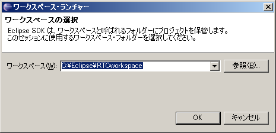</a></div>
<div align="center"><strong>Figure 2-2 Specifying a new Workspace</strong></div>

<br>

- **Creating a Java Project File**<br>
Select [File] > [New] > [Project] from the top menu.<br>
<div align="center"><a href="MakeProjectForBulid1.png"></a></div>
<div align="center"><strong>Figure 2-3 Creating a build project 1</strong></div>
<br>

In the "New Project" wizard, select "Java Project" and click the [Next] button.|<br>
<div align="center"><a href="MakeProjectForBulid2.png"></a></div>
<div align="center"><strong>Figure 2-4 Creating a build project 2</strong></div>
<br>

In the next step of the "New Project" wizard, enter the "Project name" to be created. Confirm that the setting in the "JDK Compliance" group is "5.0" or higher (or 1.5 or higher), and then click the [Next] button (**Figure 2-5**). On the other hand, depending on the environment, the "JDK Compliance" frame may be a "JRE" frame, and JDK5 (or JDK1.5) may not be selectable from the pull-down menu (**Figure 2-5**'). In that case, refer to [this page ](/en/node/159#errorjavaJDK) to make it possible to select the JDK.|<br>
<div align="center"><a href="MakeProjectForBulid3.png">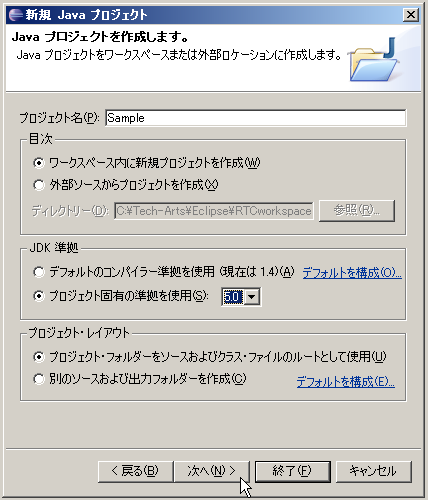</a></div>
<div align="center"><strong>Figure 2-5 Creating a build project 3</strong></div>
<br>

<div align="center"><a href="PullDownMenu_Default.png">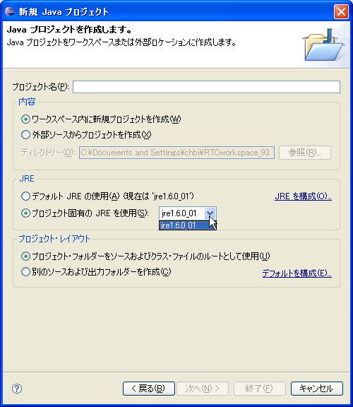</a></div>
<!-- #ref(http://openrtm.a01.aist.go.jp/~chbi/PullDownMenu_Default.png,nolink,center) -->
<div align="center"><strong>Figure 2-5' Depending on the environment, the JDK may not be selectable</strong></div>

<br>


- **Reference:**
  - → [FAQ: Q. A new Java project cannot be created as JDK5 (1.5) compliant ](/en/node/159#errorjavaJDK)|
<br>
<br>
<br>

In the displayed "New Java Project" screen, configure various settings for the project to be generated and click the [Finish] button.|

<div align="center"><a href="ProjectSettings.png"></a></div>
<div align="center"><strong>Figure 2-6 Complete after configuring various project settings</strong></div>

The specified project is generated and displayed in the "Package Explorer View".|

<div align="center"><a href="PackageExplorerView.png">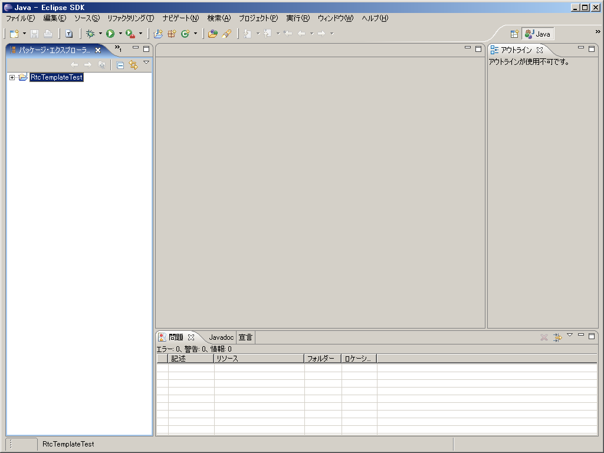</a></div>

<div align="center"><strong>Figure 2-7 Example display in the Package Explorer view</strong></div>
<br>
<br>
- **Disable automatic build**<br>
If [Project] > [Build Automatically] in the Eclipse menu bar is turned on, it is better to clear the check and disable it.
<br>
<br>


**Note** For details about Eclipse, such as options and settings when creating a project, refer to the [Eclipse site](http://www.eclipse.org/) and other resources.<br><br>
<br>
<br>
### Generating Skeleton Code Using RtcTemplate 
- **Starting the GUI RtcTemplate Editor**
Start the RtcTemplate editor screen.

<br>

- **Reference:**
  - → [Starting RtcTemplate directly](/en/node/737#startTemplate)
**Note** For information on how to use RtcTemplate, refer to [RtcTemplate](/node).
<br>
<br>

- **Editing settings in the RtcTemplate editor**
The settings for generating skeleton code for an RT component with the specifications shown in [Table 2-1>#javacomp](#javacomp) using the GUI version of RtcTemplate are shown below.
<br>

<div align="center"><a href="GUIrtc-templateSetting1.png"></a></div>

<div align="center"><a href="GUIrtc-templateSetting2.png">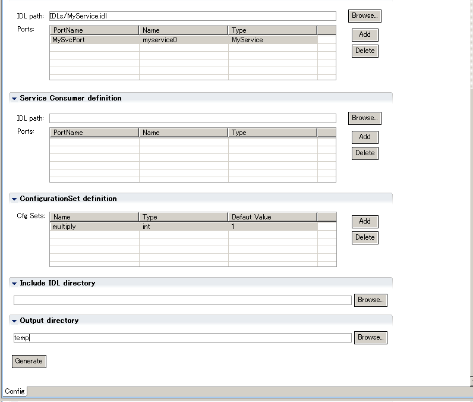</a></div>
<div align="center"><strong>Figure 2-8 GUI RtcTemplate settings</strong></div>
<br>
<br>
**Note**: In Windows, describe the above "Output directory" and "IDL path:" as full paths.
<br>
<br>

- **Generate code with the [Generate] button**<br>
Click the [Generate] button to execute code generation. At this time, be sure to specify the directory of the project generated earlier in the "Output directory" field at the bottom of the RtcTemplate editor (**Note** In Figure 2-8, it is "temp").

<br>


<div><a href="GenCode.png"></a></div><br>
<div align="center"><strong>Figure 2-9 Generating code</strong></div>
<br>


- **Generated files are added to the project**

The following files are generated in the directory specified as "Output directory".
  - Sample.java ................................ Component Profile, class defining initialization processing, etc.
  - Sampleimpl.java ...................... RT component main class
  - SampleComp.java ................... RT component startup class
  - MyServiceSVC_impl.java ......... Service implementation class
  - build_Sample.xml ................... RT component build file
  - README.Sample ................... Read Me file

<br>
By specifying the project directory in the "Output directory" field, the generated files are added to the project (automatically).


<div align="center"><a href="Done.png"></a></div>
<div align="center"><strong>Figure 2-10 Adding various files</strong></div>
<br>

**Note** Even after code generation is complete, the contents of the generated files may not be reflected in the project's "Package Explorer". You can update the information by right-clicking the target project and selecting [Refresh] from the context menu that appears.
<div align="center"><a href="UpdateProject.png">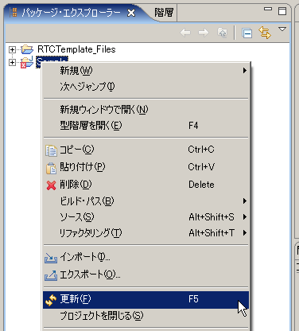</a></div>
<div align="center"><strong>Figure 2-11 Updating the project display</strong></div>
<br>

**Note** In the case of an RT component that defines a service port, errors will be displayed with only the files generated by Rtctemplate. This is because the corresponding files use classes that are automatically generated from the IDL file. These classes are automatically generated when the build is executed.<br><br>
<br>

**Note** If OpenRTM-aist-Java is not installed in a location where the classpath is valid, errors will be displayed. In this case, specify the OpenRTM-aist-Java installation folder (directory) from the project properties.
<br>

<div align="center"><a href="ProjectContextMenu.png">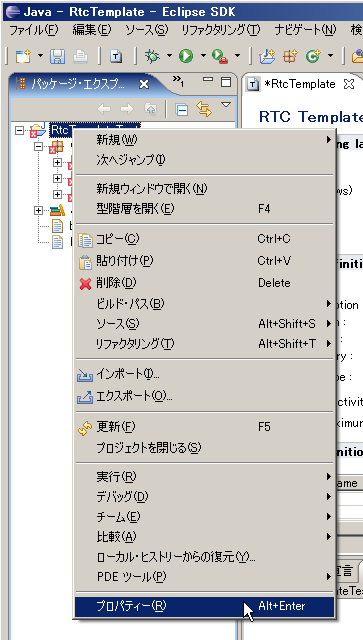</a></div>
<div align="center"><strong>Figure 2-12 Right-clicking the project</strong></div>

<br>

<div align="center"><a href="ProjectProperty.png"></a></div>
<div align="center"><strong>Figure 2-13 Adding the path to OpenRTM-aist-Java</strong></div>
<br>

<br>

- **Adding the IDL file to the "Output directory"**<br>
Manually copy the IDL file specified by "IDL path:" in the RtcTemplate editor to the "Output directory" where the generated Java source code is placed.
<br>

<br>
### Building with Eclipse

- **Ant build**~
You can build the target RT component by right-clicking build_Sample.xml in the Package Explorer and selecting [Run] > [Ant Build] from the displayed context menu. If you need to use your own jar libraries, or if OpenRTM-aist is installed in a different location, refer to [this page ](/en/node/159#Antbuild) to build by setting the classpath to any location.<br>

<div align="center"><a href="BuildProject.png">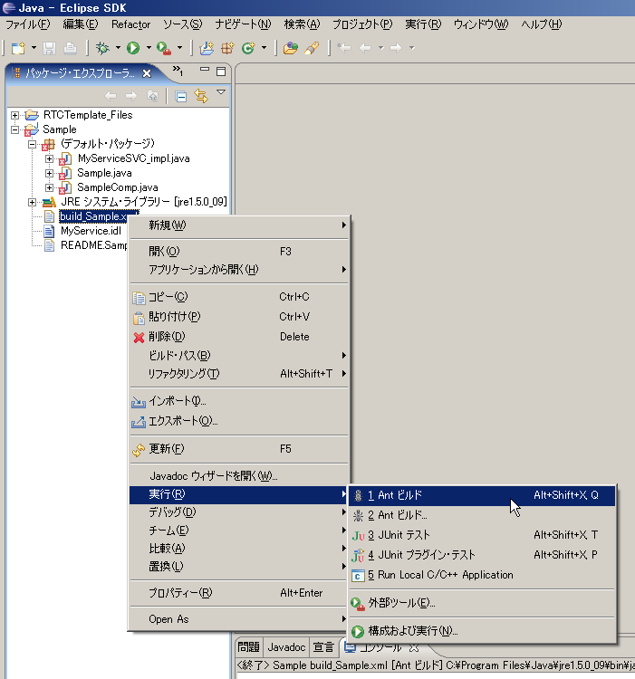</a></div>
<div align="center"><strong>Figure 2-14 Building the project</strong></div>
<br>

<div align="center"><a href="BuildProject-consoleview.png"></a></div>
<div align="center"><strong>Figure 2-15 Console screen when executing the build</strong><br></div>
<br>

When the build succeeds, class files are generated in the "classes" directory in the project.<br><br>
<br>
<br>
- **Reference**
  - [**FAQ**: Q. How can I set a classpath to any folder and perform an Ant build? ](/en/node/159#Antbuild)|
<br>
<br>
<br>

## Executing the Created RT Component

- **Creating rtc.conf**<br>
Create a file named **rtc.conf** with the following contents in "classes" in the project.

<br>

```
 corba.nameservers: localhost
 naming.formats: %n.rtc
```
<div align="center"><strong>rtc.conf</strong></div>
<br>

The above **rtc.conf** is identical to the one in the "examples/Java/RTMExamples/SimpleService" directory of the samples included with OpenRTM-aist-0.4-Java.
<br>
<br>
- **Starting the name server and RtcLink**~
Start the name server by double-clicking start-orbd.vbs in the "bin" directory included with OpenRTM-aist-0.4-Java (Windows), or by executing start-orbd.sh (UNIX). Also start [RtcLink](/node/).
  - Reference:
    - [ Starting the name server (UNIX) ](/en/node/660#samplecomponent), [ Starting the name server (Windows) ](/en/node/667#javasample)
    - [Starting RtcLink >RtcLink#startRtcLink](/node/)
<br>
<br>
- **Executing the RT component**<br>
Start a command prompt or terminal and make the above-mentioned "classes" directory the current directory.
<!-- > java SampleComp -->

  - **For UNIX systems**

```
 $ java -classpath .:$RTM_JAVA_ROOT/jar/OpenRTM-aist-0.4.1.jar:$RTM_JAVA_ROOT/jar/commons-cli-1.1.jar SampleComp

 あるいは、たとえば bash の場合などは、上記コマンドを分割して、
 
 $ export CLASSPATH=.:$RTM_JAVA_ROOT/jar/OpenRTM-aist-0.4.1.jar:$RTM_JAVA_ROOT/jar/commons-cli-1.1.jar
 $ java SampleComp
```

  - **For Windows systems**
 
```
 > java -classpath ".;%RTM_JAVA_ROOT%\jar\OpenRTM-aist-0.4.1.jar;%RTM_JAVA_ROOT%\jar\commons-cli-1.1.jar" SampleComp
 
 あるいは、上記コマンドを分割して、
 
 > set CLASSPATH=.;%RTM_JAVA_ROOT%\jar\OpenRTM-aist-0.4.1.jar;%RTM_JAVA_ROOT%\jar\commons-cli-1.1.jar
 > java SampleComp
```
By executing these commands, the RT component appears in RtcLink.

<br>
<br>

<div align="center"><a href="JavaSampleOnRtcLink.png">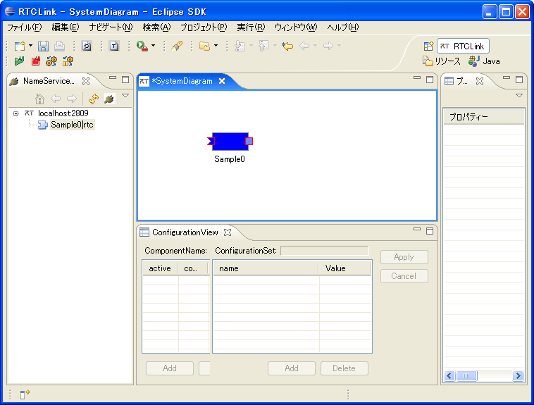</a></div>
<div align="center"><strong>Figure 2-16 RtcLink state when successfully executing the Sample component</strong></div>
<br>

<br>
# Details of Java RT Components 
## Structure of Java RT Components 
Figure 3-1 shows the relationship between the source files of a Java RT component and the outline functions executed in each file. For comparison, the structures of C++ RT components and Java RT components for OpenRTM-aist-0.3 are also shown.<br>
<div align="center"><a href="InnerRTcomponents.png">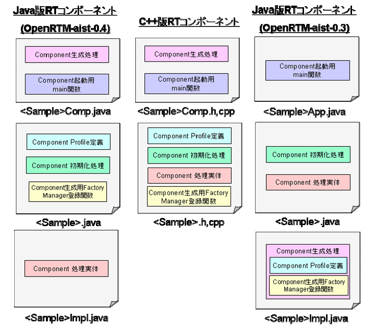</a></div>
<div align="center"><strong>Figure 3-1 Structure of an RT component</strong></div>
<br>


When comparing existing C++ RT components and Java RT components, the following points differ.<br>
- Separation of the actual RT component functionality
In Java RT components, due to startup processing and other factors, the actual RT component functionality has been moved to the XXXImpl class (<Sample>Impl.java in Figure 3-1). Accordingly, in the original RT component class (<Sample>.java in Figure 3-1), only the Component Profile definition and various component generation processing remain.<br>
- Conversion of callback functions into interfaces
The parts defined as callback functions in C++ RT components have been converted into interfaces in Java RT components.<br>
  - ModuleInitProc: Interface for starting the component startup class
  - RtcNewFunc: Interface for generating RT components
  - RtcDeleteFunc: Interface for destroying RT components

With this modification, the component startup class must implement the above interfaces.
<br>
<br>

## Differences Between Java RT Components and C++ Components

### Data Ports
OpenRTM-aist-Java adds a holder class (DataRef class) to pass data. Therefore, the definition and usage of data ports have been changed as follows.<br>
<br>

<div align="center"><a href="java_dataport.png"></a></div>

<br>For how to use data ports, refer to the "SeqIO" and "SimpleIO" samples.
<br><br>


### Service Ports 

OpenRTM-aist-Java adds an auxiliary variable (/<service name>Base) for using service ports. Therefore, the definition and usage of service ports have been changed as follows. For details, see the "SimpleService" sample.<br>
<br>

<div align="center"><a href="java_serviceport.png"></a></div>


### Configuration

As with data ports, when using configuration, holder classes are used for passing data. Therefore, the definition and usage of configuration data have been changed as follows.<br>
<br>

<div align="center"><a href="java_config.png">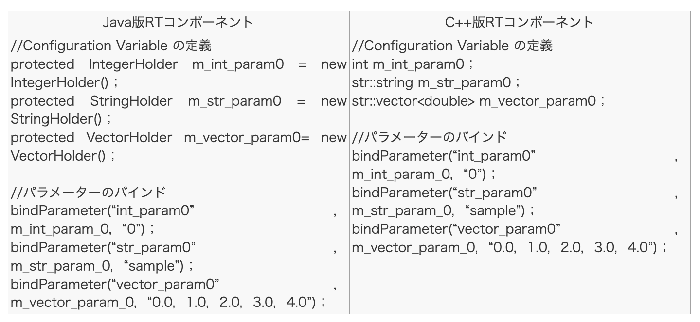</a></div>

For how to use configuration data, refer to the "ConfigSample" sample.<br>
Table 3-1 shows the relationship between the types of holder classes prepared by OpenRTM-aist-Java for configuration data holders and data types.<br>
<div align="center"><strong>Table 3-1 Correspondence of Configuration Data Holder Types</strong><br><br></div>
<table class="table-alt">
  <tr>
    <th>Data type</th>
    <th>Holder class</th>
  </tr>
  <tr>
    <td>short</td>
    <td>jp.go.aist.rtm.RTC.util.ShortHolder</td>
  </tr>
  <tr>
    <td>int</td>
    <td>jp.go.aist.rtm.RTC.util.IntegerHolder</td>
  </tr>
  <tr>
    <td>long</td>
    <td>jp.go.aist.rtm.RTC.util.LongHolder</td>
  </tr>
  <tr>
    <td>float</td>
    <td>jp.go.aist.rtm.RTC.util.FloatHolder</td>
  </tr>
  <tr>
    <td>double</td>
    <td>jp.go.aist.rtm.RTC.util.DoubleHolder</td>
  </tr>
  <tr>
    <td>byte</td>
    <td>jp.go.aist.rtm.RTC.util.ByteHolder</td>
  </tr>
  <tr>
    <td>String</td>
    <td>jp.go.aist.rtm.RTC.util.StringHolder</td>
  </tr>
</table>


<br>
As with the C++ version of OpenRTM-aist, OpenRTM-aist-Java also allows users to create configuration data holders for any user-defined type.<br>
When implementing a holder for configuration data, you must implement the stringFrom method of jp.go.aist.rtm.RTC.util.ValueHolder and add the Serializable interface to the implements clause.<br>The stringFrom method of jp.go.aist.rtm.RTC.util.ValueHolder is a method for converting a string passed as an argument into the target data type.<br>
For configuration data holders, refer to the VectorHolder class in the "ConfigSample" sample.<br>

## Startup Behavior of Java RT Components
The startup behavior of C++ RT components is shown below. The behavior at component startup is basically the same for Java RT components, but because the actual RT component functionality has been separated into the XXXImpl class, the message destination during component generation and component initialization has been changed to the XXX class.<br>

<div align="center"><a href="JavaRTcomponent1.png"></a></div>
<br>

<div align="center"><a href="JavaRTcomponent2.png"></a></div>
<br>

## Correspondence Between IDL Data Types and Java Language Data Types
Table 3-2 shows the correspondence between CORBA IDL data types and Java language data types.<br>
<div align="center"><strong>Table 3-2 Data Type Correspondence</strong></div>
<table class="table-alt">
  <tr style="text-align: center;">
    <th>CORBA IDL</th>
    <th>Java language</th>
  </tr>
  <tr>
    <td></td>
  </tr>
  <tr>
    <td>short</td>
    <td>short</td>
  </tr>
  <tr>
    <td>long</td>
    <td>int</td>
  </tr>
  <tr>
    <td>float</td>
    <td>float</td>
  </tr>
  <tr>
    <td>double</td>
    <td>double</td>
  </tr>
  <tr>
    <td>long long</td>
    <td>long</td>
  </tr>
  <tr>
    <td>long double</td>
    <td>double</td>
  </tr>
  <tr>
    <td>char</td>
    <td>char</td>
  </tr>
  <tr>
    <td>wchar</td>
    <td>char</td>
  </tr>
  <tr>
    <td>octet</td>
    <td>byte</td>
  </tr>
  <tr>
    <td>unsigned short</td>
    <td>short</td>
  </tr>
  <tr>
    <td>unsigned long</td>
    <td>int</td>
  </tr>
  <tr>
    <td>unsigned long long</td>
    <td>long</td>
  </tr>
  <tr>
    <td>boolean</td>
    <td>boolean</td>
  </tr>
  <tr>
    <td>string</td>
    <td>String</td>
  </tr>
  <tr>
    <td>wstring</td>
    <td>String</td>
  </tr>
  <tr>
    <td>any</td>
    <td>org.omg.CORBA.Any</td>
  </tr>
  <tr>
    <td>void</td>
    <td>void</td>
  </tr>
</table>

# Other

## Tips
### How to Configure Automatic Startup of Eclipse
- For Windows
  - 1. Select the ".project" file from within the Eclipse project directory and right-click it. Select [Properties] from the context menu that appears.~
* The Eclipse project to select can be any project.

<br>

<div align="center"><a href="SelectProject.png"></a></div>
<div align="center"><strong>Select the ".project" file</strong></div>


- 2. In the "General" tab of the displayed "Properties" screen, click the [Change] button on the right side of the "Program" row in the middle.
<div align="center"><a href="Property.png">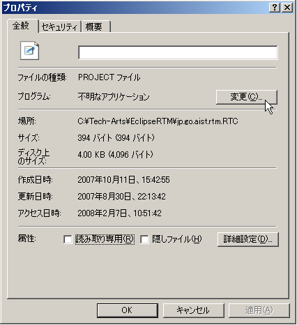</a></div>
<div align="center"><strong>Changing the application association</strong></div>

- 3. Click the [Browse] button at the bottom of the displayed "Open With" screen.
<div align="center"><a href="SelectApplication.png"></a></div>
<div align="center"><strong>Select Eclipse</strong></div>

- 4. A file selection screen appears. Select "eclipse.exe" from the directory where the Eclipse to be started automatically is installed.
- 5. Close the "Open With" screen and "Properties" by clicking the [OK] button.
<br>
By making the above settings, it becomes possible to automatically start the specified Eclipse by double-clicking the ".project" file.<br>
<br>
**Note** If multiple Eclipses are installed, note that the double-click operation will always start the version of Eclipse specified in the above operation.<br>
**Note** If the project you double-clicked is not included in the workspace set for the target Eclipse to be started, it will not be displayed in the Package Explorer of the started Eclipse. In this case, import the target project into the workspace or change the workspace settings.
<br>
<br>
- **For Linux**
  - It is possible to start Eclipse by specifying the workspace with the data option.
```
 > eclipse -data /home/devel/OpenRTM/workspace
```
Specify the workspace that contains the target project.
<br>
<br>

## Acknowledgments
OpenRTM-aist-Java was developed using the following libraries. We thank those involved in the development and design of these projects.<br>
- Apache Commons CLI 1.1<br>

This product includes software developed by The Apache Software Foundation (http://www.apache.org/ ).


