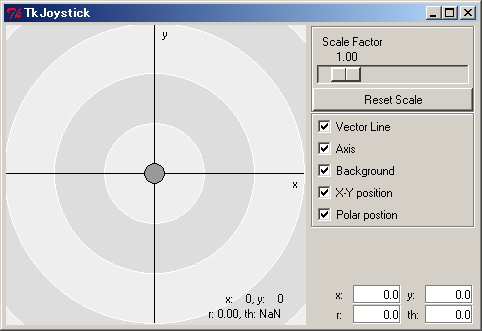
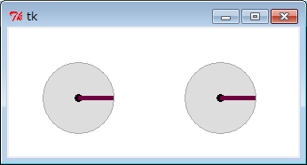

<!-- Title: NXT RTC 動作確認 -->
#contents


# NXT RTC Operation Check
Now, let us actually run the NXTRTC that we created.

## Starting the Name Server
Start the name server.
If OpenRTM-aist for Windows (C++ version) is installed, you can start it from "OpenRTM-aist" > "C++" > "tools" > "Start Naming Service" in the Start menu.

## Creating rtc.conf
Create rtc.conf.

```
 corba.nameservers: localhost
 naming.formats: %n.rtc
 manager.shutdown_auto: NO
```

Set the corna.nameservers item according to the address of the name server you want to use.
Here, we will use the local name server, so set it to **localhost**.

Copy it to each directory containing the components you want to start.
In addition to the NXTRTC created this time, we will start the following:
- TkJoystickComp
- TkMotorPosComp
- TkSliderMonitorComp


## Starting RTSystemEditor
Start RTSystemEditor.
After starting RTSystemEditor, connect to the name server (localhost here).
Also, to open the SystemDiagram editor, click the SystemDiagram icon on the toolbar.


## Starting the Components
Start the following components.
- NXTRTC
- TkJoystickComp
- TkMotorPosComp
- TkSliderMonitorComp
When they start, the components are displayed in the NameServcie view of RTSystemEditor.

### TkJoystickComp
TkJoyStickComp is a component for simulating a joystick on the GUI.
A GUI like the one shown in the figure appears, and by dragging the circle in the center, it outputs X-Y values from the OutPort (top) like a joystick.
TkJoyStickComp has another OutPort (bottom), which is a data port for outputting the speeds of the left and right wheels, useful for operating a differential-drive mobile robot.
If it is connected directly to the input port of NXTRTC, Tribot can be controlled.

<div align="center"><a href="TkJoystick.png"></a></div>

### TkMotorComp
TkMotorComp is a component for monitoring wheel rotation. A circular icon representing a wheel rotates on the GUI according to the data (angle) input to the InPort.
By connecting it to the OutPort that outputs the wheel angle of NXTRTC, you can see how the wheels of NXT are rotating.
You can also monitor the rotation even if you turn the NXT wheels by hand.
<div align="center"><a href="TkMotor.png"></a></div>

### TkSliderMonitorComp
TkSliderMonitorComp is a component for displaying the value of data input to the InPort using GUI sliders.
By connecting it to the sensor output port of NXTRTC, you can monitor NXT sensor data.


## Connecting the Components
After all components have started, connect them.
Drag and drop each component from the NameService view to the SystemDiagram editor.
You can connect ports by dragging and dropping from the port you want to connect to another port.
An example of several connected components is shown below.

<span style="color:red;">If an ultrasonic sensor is not attached to NXT, NXTRTC will enter the error state (red) after Activate.</span>;

RtcLink.png
<!-- div align="center"><a href="RtcLink.png"></a></div-->

Use these components to check whether NXTRTC is operating correctly.

<!-- **NXTを自由に動かすコンポーネントを作ってみる -->
<!-- これで、NXTをRTコンポーネント化することができました。 -->
<!-- 次は、NXT RTCを自分独自のロジックで動かすためのコンポーネントを作ってみましょう。 -->
<!-- 上記のように、Pythonで作っても、もちろんC++やJavaで作っても構いません。 -->
<!-- どういった言語で作ったコンポーネントとも、このNXT RTCは接続することができます。 -->

