<!-- Title: RTコンポーネント作成(NXTway編) -->
#contents
#clear

## Introduction
- This section explains how to connect NXT MINDSTORM with an OpenRTM Bluetooth component and control NXT MINDSTORM.
- It explains how to install software on NXT MINDSTORM, basic operations, and how to connect it to RT components.

<div align="center"><a href="gaiyou.png">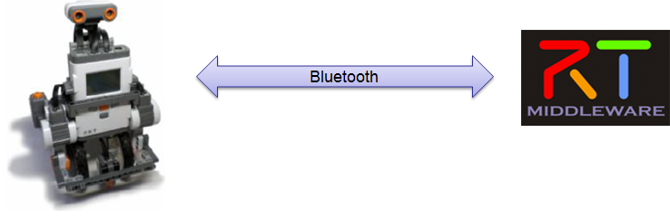</a></div>

## Environment Setup
### Assembling LEGO
- Required parts
  - LEGO MINDSTORMS Education NXT Base Set
    - Product ID: W979797
<div align="center"><a href="XL_979797withtrays.jpg">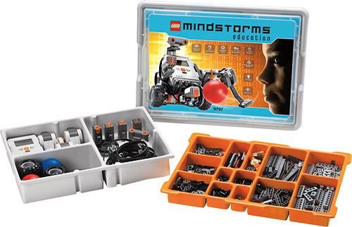</a></div>
  - LEGO Education Resource Set
    - Product ID: W979648
<div align="center"><a href="XL_9648Kit.jpg"></a></div>
  - NXT Gyro Sensor
    - Part No : NGY1044
<div align="center"><a href="Mindstorms_Gyro.jpg">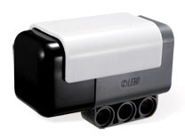</a></div>
- How to assemble LEGO
  - Refer to "NXTway-GS_Building_Instructions.pdf"
  - Download : http://lejos-osek.sourceforge.net/NXTway-GS_Building_Instructions.pdf

### nxtOSEK Environment Setup (Windows XP/Vista)

<div align="center"><a href="kannkyousetumei.png">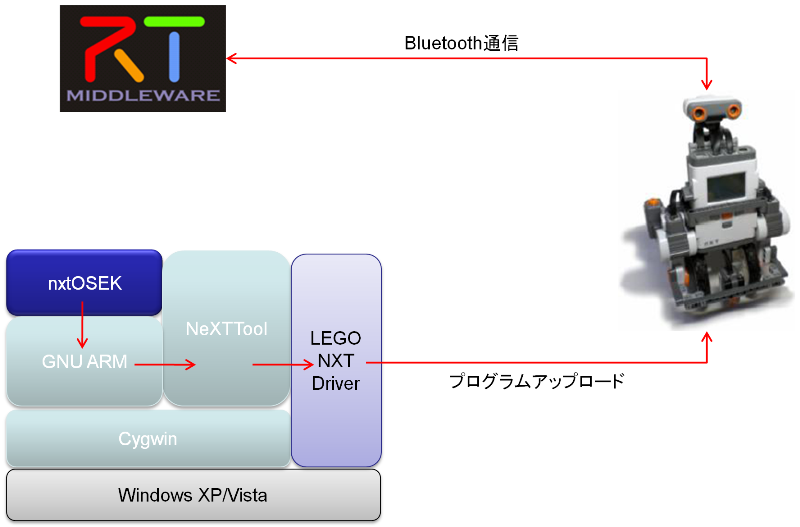</a></div>

- Installing Cygwin
  - Cygwin makes it possible to run various Linux software in a Windows environment
  - Download : [http://www.cygwin.com/](http://www.cygwin.com/)
  - Configuration options
    - Root Directory : `c:\cygwin`
    - Select Packages : Select and install "make 3.81-1" in the Devel category and "libintl3" in the Libs category

- Installing GNU ARM (must be 4.0.2) 
  - GNU ARM is a GCC compiler package that supports the ARM7 core processor (AT91SAM7S256) of NXT
  - Download : [bu-2.16.1_gcc-4.0.2-c-c++\_nl-1.14.0_gi-6.4.exe ](http://www.gnuarm.com/bu-2.16.1_gcc-4.0.2-c-c++_nl-1.14.0_gi-6.4.exe)
  - Configuration options
    - Diriectory : `c:\cygwin\GNUARM`
    - Select Components : Do not select "Floating Point Unit"
    - Select Additional Tasks : Do not select "Install Cygwin DLLs..."

- Installing the LEGO MINDSTORMS NXT Driver
  - This is a USB communication driver for NXT provided by LEGO
  - Download : http://mindstorms.lego.com/en-us/support/files/Driver.aspx
  - Install the PC version of Driver 1.02

- Downloading NeXTTool
  - NeXTTool is a PC console for communication with NXT, and can upload i\*.rxe (apps) and \*.rfw (firmware) to NXT
  - Download : [http://bricxcc.sourceforge.net/nexttool.zip](http://bricxcc.sourceforge.net/nexttool.zip)
  - Configuration options
    - Extraction directory : "c:\cygwin\nexttool"

- Downloading the enhanced NXT firmware
  - The enhanced NXT firmware is based on the standard NXT firmware and extends its functionality
  - It can also execute native code for the ARM7 core CPU of NXT
  - Download : [http://bricxcc.sourceforge.net/nexttool.zip](http://bricxcc.sourceforge.net/lms_arm_jch.zip)
  - Configuration options
    - Copy only `lms_arm_nbcnxc_107.rfw`
    - Copy directory : `c:\cygwin\nexttool`

- Downloading nxtOSEK
  - Download version 2.13
  - Download : [http://bricxcc.sourceforge.net/nexttool.zip](http://sourceforge.net/projects/lejos-osek/files/nxtOSEK/)
  - Configuration options
    - Extraction directory : `c:\cygwin\nxtOSEK`

- Adding the "sg.exe" file
  - Download : [http://www.toppers.jp/download.cgi/osek_os-1.1.lzh](http://www.toppers.jp/download.cgi/osek_os-1.1.lzh)
  - Extract it, and copy the "sg.exe" file located under the "sg" folder inside the "toppers_osek" folder to the "c:\cygwin\nxtOSEK\toppers_osek\sg" folder

## Uploading the Enhanced NXT Firmware to NXT 
- NXT firmware update mode
  - With the power ON, keep pressing the reset button with the tip of a safety pin for about 5 seconds
<div align="center"><a href="resetButton.jpg">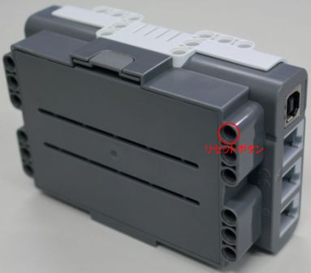</a></div>
  - You will hear a small clicking sound from the NXT speaker
  - Connect NXT and the PC via USB
- Starting Cygwin and uploading the enhanced firmware
<a href="cygwin-icon.gif"></a>
Start cygwin
  - Enter the following commands
```
 $cd c:\cygwin\nexttool
 $./NeXTTool.exe /COM=usb -firmware=lms_arm_nbcnxc_107.rfw
```
  - When the upload is complete, the NXT LCD screen will look like static noise
  - If the NXT buttons cannot be operated, remove the NXT battery and attach it again to start the enhanced NXT firmware

## Modifying and Compiling the NXTway Source
### Modifying, compiling, and uploading the source on the NXT side
- Source modification
  - In "sample.cpp" in the "c:\cygwin\nxtOSEK\samples_c++\cpp\NXTway_GS++" folder
<div align="center"><a href="samplecpp.png">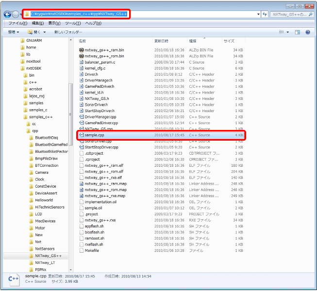</a></div>

  - If you search for "btConnection.connect", you can find the function in the following "Main Task"

```
 //=============================================================================
 // Main Task
 TASK(TaskMain)
 {
 	// establish blutooth connection with a PC to use a PC HID GamePad controller
 	BTConnection btConnection(bt, lcd, nxt);
 	(void)btConnection.connect(BT_PASS_KEY);
 
 	for (U32 i = 5; i <= Lcd::MAX_CURSOR_Y; i++) lcd.clearRow(i);
 	lcd.cursor(0,5);
 	lcd.putf("snsns", "TOUCH:START/STOP", "STAND IT UP AND", "WAIT FOR A BEEP.");
 	lcd.disp();
 	SetRelAlarm(Alarm4msec, 1, 4); // Set 4msec periodical Alarm for the drive event
 
 	while(1)
 	{
 		sonarDriver.checkObstacles(sonar);
 		clock.wait(40); // 40msec wait
 	}
 }
```

  - Modify "(void)btConnection.connect(BT_PASS_KEY);" as follows

```
 (void)btConnection.connect(BT_PASS_KEY, "alias")
```

  - Enter a name that you can identify in the "alias" part
- Compilation
<a href="cygwin-icon.gif"></a>Start cygwin
```
 $cd c:\cygwin\nxtOSEK\samples_c++\cpp\NXTway_GS++
```

  - On cygwin, in the folder above, "C:\cygwin\nxtOSEK\samples_c++\cpp\NXTway_GS++"
```
 $make all
 ...
 Generating binary image file: nxtway_gs++_rom.bin
 Generating binary image file: nxtway_gs++_ram.bin
 Generating binary image file: nxtway_gs++_.rxe
 $
```

  - If you see a message like the one above, compilation is complete
- Uploading to NXT
  - Connect the NXT containing the enhanced NXT firmware via USB
  - In the compiled cygwin state
```
 $sh ./rxeflash.sh
 Executing NeXTTool to upload nxtway_gs++.rxe...
 nxtway_gs++.rxe=34240
 NeXTTool is terminated.
 $
```
  - If you see a message like the one above, the upload is complete

## Operation Check 
### Starting on the NXT Side 
- Wait in state ⑦ in the figure below
<div align="center"><a href="NXTStart.jpg">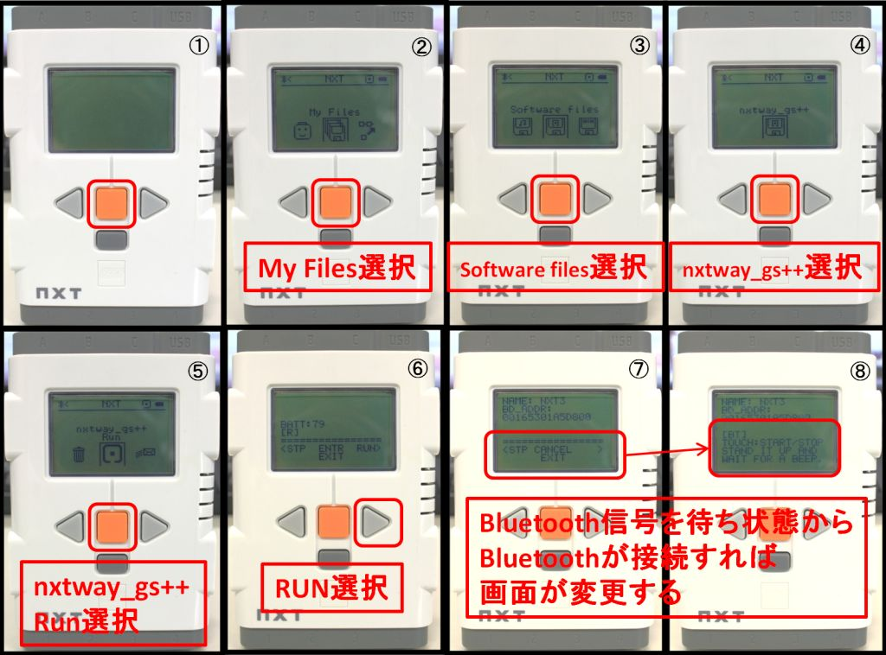</a></div>;

### Starting the RTC on the PC Side
- Start the OpenRTM-aist Naming Service
<div align="center"><a href="NamingServiceStart.png">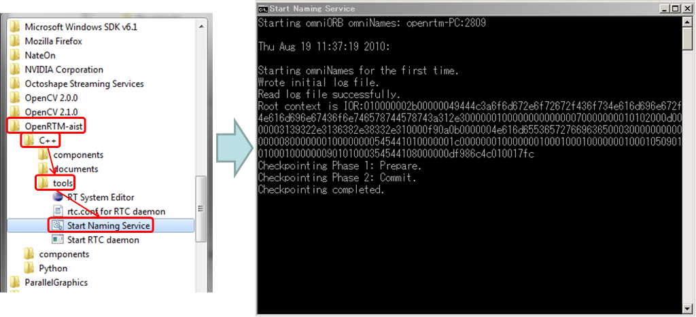</a></div>
- Start the TkJoyStickComp component
<div align="center"><a href="TkJoyStickCompStart.png">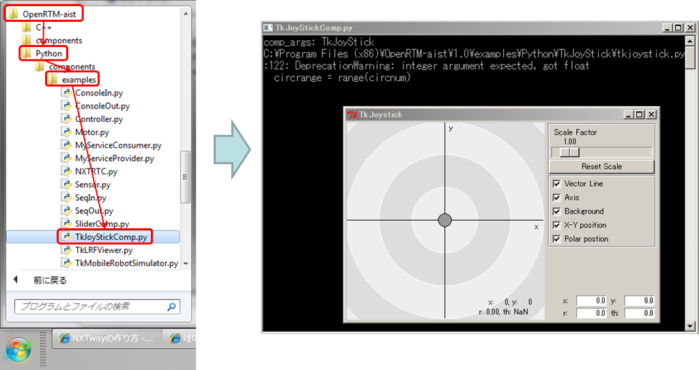</a></div>
- Bluetooth connection
  - Connect Bluetooth to the PC
<div align="center"><a href="BluetoothPlus.png">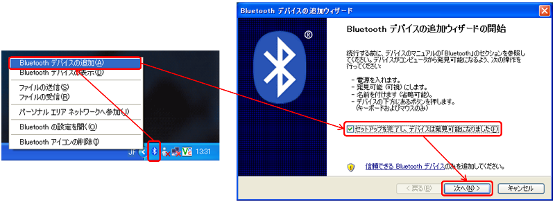</a></div>
  - Connect the Bluetooth device with the name entered in the "alias" part
<div align="center"><a href="BluetoothPlus2.png">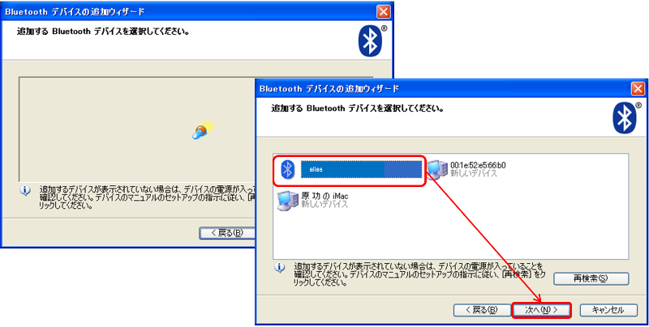</a></div>
  - The Password is basically set to "1234"
<div align="center"><a href="BluetoothPass.png">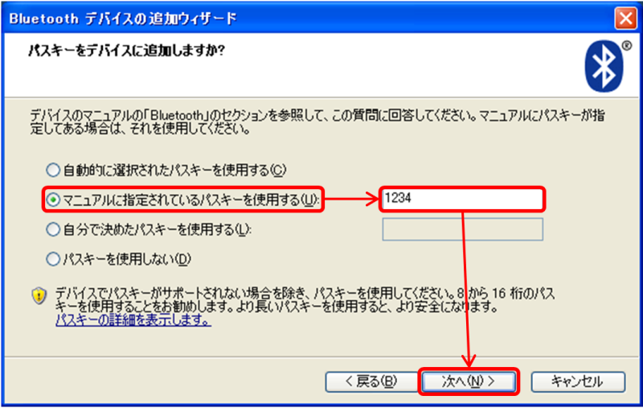</a></div>
  - Check the connected Bluetooth Comport
<div align="center"><a href="BluetoothComport.png">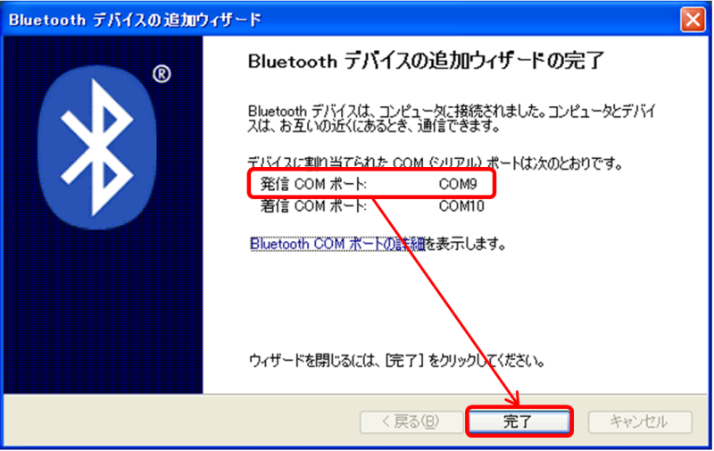</a></div>
- Starting the Bluetooth component
  - Download [BluetoothComp.zip](http://www.openrtm.org/OpenRTM-aist/download/SC2010/NXTBlueTooth.zip)
  - After extracting BluetoothComp.zip, execute the "NXTBlueToothComp.exe" file in the "components" folder
<div align="center"><a href="NXTBluetoothCompStart.png">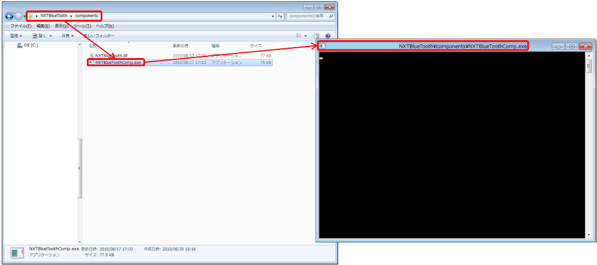</a></div>

- Starting RT System Editor
  - Start RT System Editor as shown in the figure below
<div align="center"><a href="RTSystemEditorStart.png">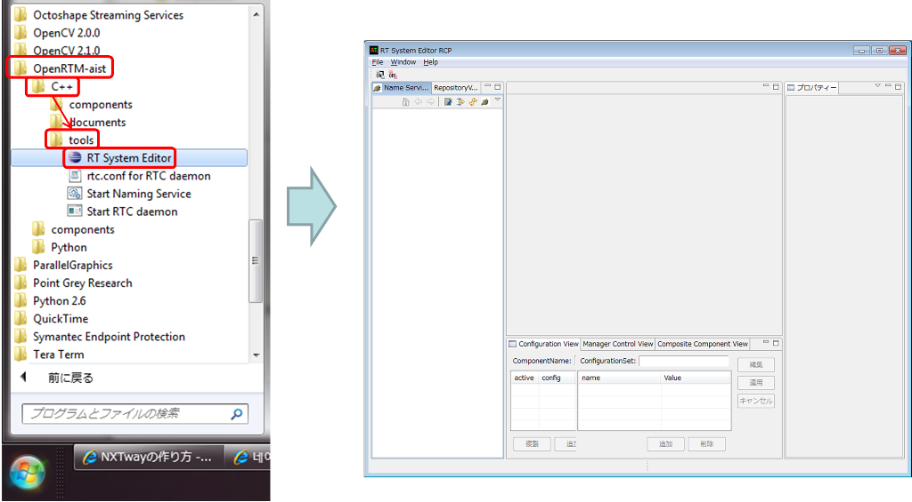</a></div>
- Adding Naming Service
  - Click the add button as shown in the figure below and add "127.0.0.1"
<div align="center"><a href="NamingServicetuika.png">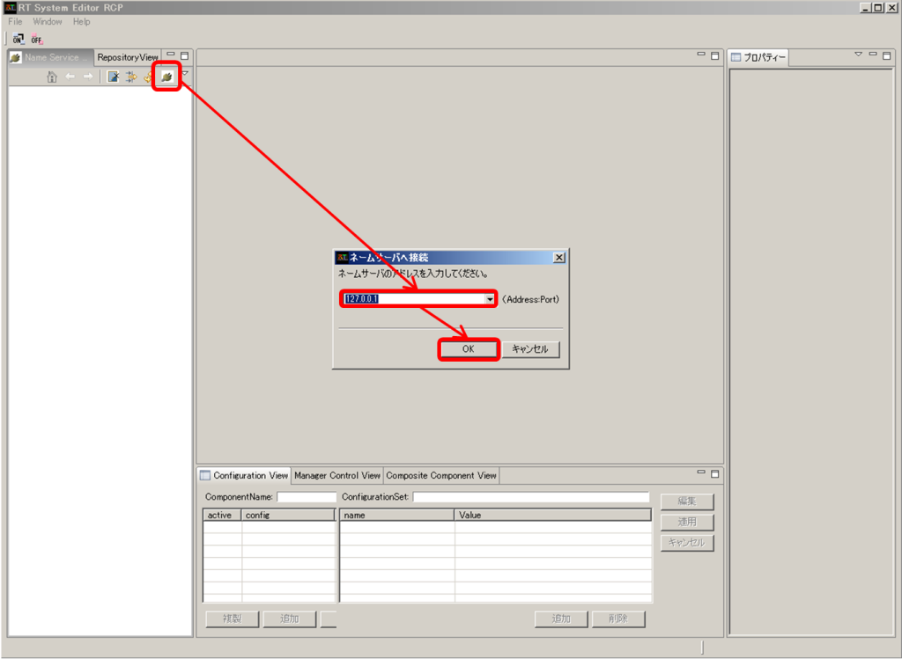</a></div>
- Placing components
  - Place the components as shown in the figure below
<div align="center"><a href="Componenthiichi.png">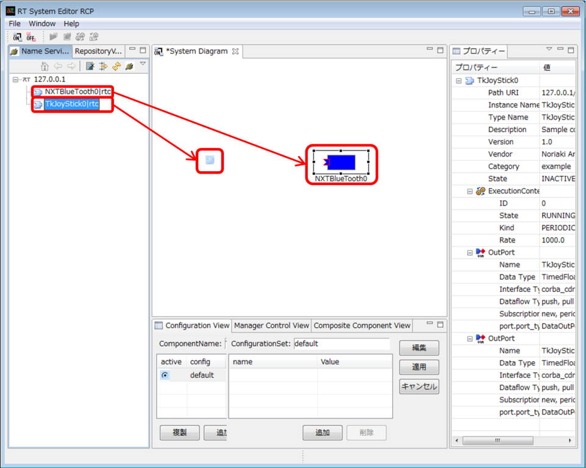</a></div>
- Connect TkJoyStickComp and the Bluetooth component
  - Connect TkJoyStickComp and BluetoothComp as shown in the figure below
<div align="center"><a href="Componentsetuzoku.png">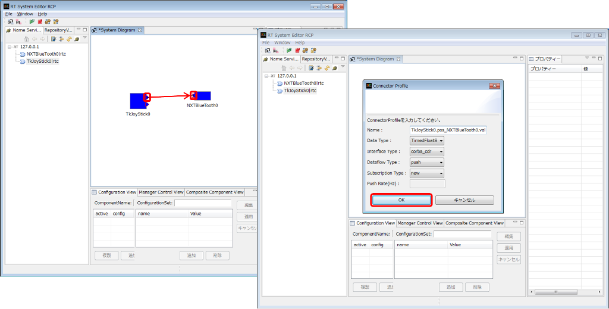</a></div>
  - In the Configuration View of the Bluetooth component, enter the confirmed Comport number in the "m_COM" variable
<div align="center"><a href="Setupm_COM.jpg">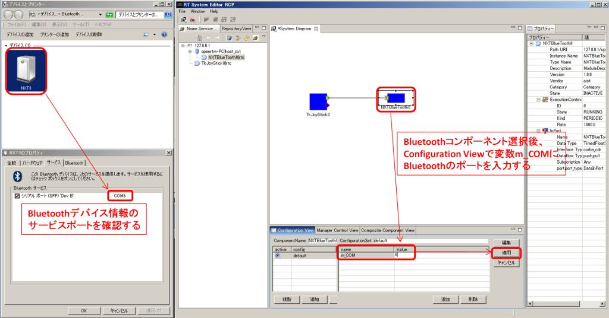</a></div>
- Activate
<div align="center"><a href="Activate.png">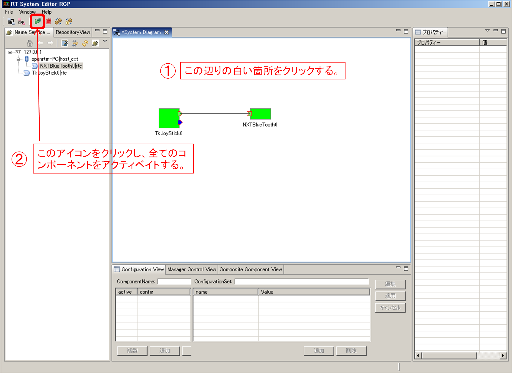</a></div>
  - When the connection is complete, the NXT side will look like the figure below
<div align="center"><a href="8.png">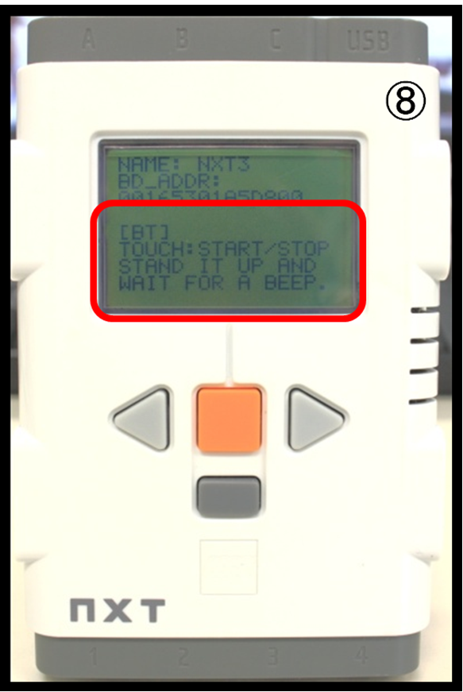</a></div>
