-------jp page!!-------

<!-- Title: RTコンポーネント作成(OpenCV編 for RTCB-RC1) -->
#contents

## はじめに
ここでは、OpenCV ライブラリを VC９ にて RTコンポーネント化する手順を紹介します。

### OpenCVとは 

[OpenCV](http://opencv.jp/)とはインテルが開発・公開しているオープンソースのコンピュー>タービジョン向けライブラリです。

[Wikipedia](http://ja.wikipedia.org/wiki/OpenCV)より抜粋。

### 作成する RTコンポーネント 

- Flip コンポーネント: OpenCV ライブラリのうち、cvFlip() 関数を用いて画像の反転を行う RTコンポーネント。

- ObjectTracking コンポーネント: OpenCV ライブラリを使用し、マウスで選択した対象物を追
跡するコンポーネント。
追跡中の画像表示、追跡画像を OutPort から出力、追跡対象の移動量を OutPort から出力など
の機能を持つ。

## OpenCV ライブリの RTコンポーネント化 (Flipコンポーネント) 
ここでは、OpenCV ライブラリのうち、画像の反転を行う cvFlip() を VC９ にて RTコンポーネ
ント化します。

以下は、作業の流れです。

- cvFlip 関数について
- コンポーネントの概要
- 動作環境・開発環境
- Flip コンポーネントの雛型の生成
- アクティビティ処理の実装
- コンポーネントの動作確認

### cvFlip 関数について

cvFlip 関数は、2次元配列を垂直、水平、または両軸で反転します。

```
 void cvFlip(IplImage* src, IplImage* dst=NULL, int flip_mode=0);
 #define cvMirror cvFlip

 src       入力配列
 dst       出力配列。もし dst=NULL であれば、src が上書きされます。
 flip_mode 配列の反転方法の指定内容:
 　flip_mode = 0: X軸周りでの反転(上下反転)
 　flip_mode > 0: Y軸周りでの反転(左右反転)
 　flip_mode < 0: 両軸周りでの反転(上下左右反転)
```
### コンポーネントの概要 
InPort からの入力画像を反転し OutPort から出力するコンポーネント。
<br>
反転の対象軸は、RTCのコンフィギュレーション機能を使用して flip_mode という名前のパラメ
ーターで指定します。

flip_mode は、反転したい方向に応じて下記のように指定してください。

- 上下反転したい場合、0

- 左右反転したい場合、1

- 上下左右反転したい場合、-1

<br>

作成する RTC の仕様は以下のとおりです。

- InPort
  - キャプチャされた画像データ (TimedOctetSeq)

- OutPort
  - 反転した画像データ (TimedOctetSeq)

- Configuration
  - 反転方法の指定 (int)
※ TimedOctetSeq型は、OpenRTM-aist の BasicDataType.idl にて下記のように定義されている>データ型です。

※ octet型とは、CORBA　IDL の基本型で、転送時にいかなるデータ変換も施されないことが保証
されている８ビット値です。

```
   struct Time
  {
        unsigned long sec;    // sec
        unsigned long nsec;   // nano sec
  };

   struct TimedOctetSeq
  {
        Time tm;
        sequence<octet> data;
  };
```


<br>
図1は、それぞれのflip_mode での画像処理のイメージ図です。

<br>

<br>

<div align="center"><a href="cvFlip_and_FlipRTC.png"></a></div>
<div align="center"><strong>図1. Flip コンポーネントのflip_mode の指定パターン</strong></div>
<br>

### 動作環境・開発環境
- OS: Windows XP SP2
- コンパイラ: [Visual C++ 2008 Express Edition 日本語版](http://www.microsoft.com/japan/msdn/vstudio/express/default.aspx)
- [omniORB: version 4.1.2](http://www.openrtm.org/pub/Windows/omniORB/omniORB-4.1.2_vc9.msi)
- [OpenCV: version 1.0](http://downloads.sourceforge.net/opencvlibrary/OpenCV_1.0.exe?modtime=1161287502&big_mirror=1)
- [OpenRTM-aist: version 1.0.0-RC1](http://www.openrtm.org/pub/Windows/OpenRTM-aist/cxx/OpenRTM-aist-1.0.0-RC1-jp_vc9.msi)

- [OpenCV サンプルRTC](http://www.openrtm.org/OpenRTM-aist/download/IREX2009/OpenCV_RTC-1.0_vc9_jp.msi)

- RTSystemEditor 1.0
- RTCBuilder 1.0
  - [全部入りパッケージ](http://www.openrtm.org/OpenRTM-aist/download/IREX2009/eclipse.zip_)

- [解凍ツール(Lhaplus)](http://www.forest.impress.co.jp/lib/arc/archive/archiver/lhaplus.html)

### Flip コンポーネントの雛型の生成

Flip コンポーネントの雛型の生成は、RTCBuilder を用いて行います。

### RTCBuilder の起動
新規ワークスペースを指定して Eclipse を起動すると、以下の「ようこそ」画面が表示されま>す。
この 「ようこそ」画面の左上の「X」をクリックすると以下の画面が表示されます。
<br>

<div align="center"><a href="fig1-1EclipseInit.png">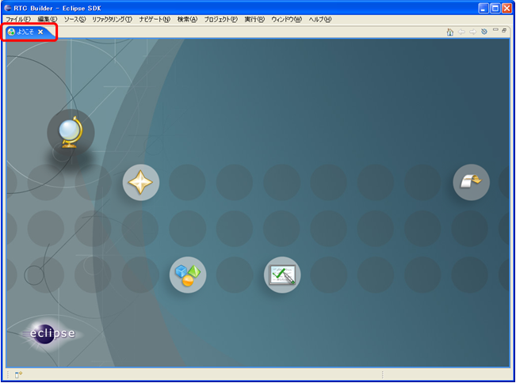</a></div>
<!-- CENTER:''図 1-1 Eclipseの初期起動時の画面'' -->
<div align="center"><strong>図2. Eclipse の初期起動時の画面</strong></div>
<br>
右上の [Open Perspective] ボタンをクリックし、プルダウンの「Other…」を選択します。
<br>

<div align="center"><a href="fig2-2PerspectiveSwitch.png">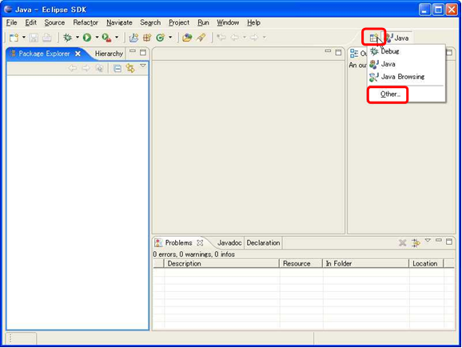</a></div>
<!-- CENTER:''図 2-2 パースペクティブの切り替え'' -->
<div align="center"><strong>図3. パースペクティブの切り替え</strong></div>
<br>
「RTC Builder」を選択し、[OK] ボタンをクリックします。

<div align="center"><a href="fig2-3PerspectiveSelection.png"></a></div>
<!-- CENTER:''図 2-3　パースペクティブの選択'' -->
<div align="center"><strong>図4. パースペクティブの選択</strong></div>
<br>
RTCBuilder が起動します。
<br>

<div align="center"><a href="fig2-4RTCBuilderInit.png">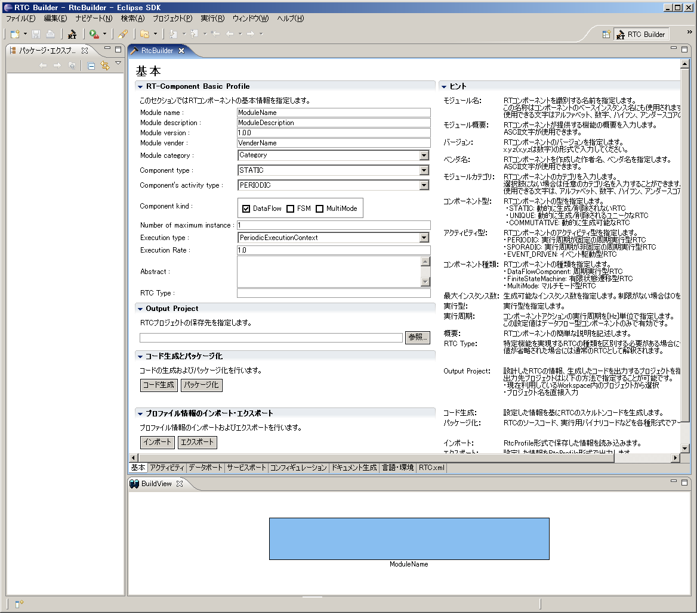</a></div>
<!-- CENTER:''図 2-4 RTC Builder の初期起動時画面'' -->
<div align="center"><strong>図5. RTC Builder の初期起動時画面</strong></div>
<br>

#### RTCBuilder 用プロジェクトの作成
まず最初に、RT コンポーネントを作成するための Eclipse プロジェクトを作成します。
画面上部のメニューから[ファイル] > [新規] > [プロジェクト] を選択します。
<br>

<div align="center"><a href="fig2-5CreateProject.png"></a></div>
<!-- CENTER:''図 2-5 RTC Builder 用プロジェクトの作成　１'' -->
<div align="center"><strong>図6. RTC Builder 用プロジェクトの作成　１</strong></div>
<br>
表示された｢新規プロジェクト｣画面において、[その他] > [RTC ビルダ] を選択し、[次へ] を>クリックします。
<br>

<div align="center"><a href="fig2-6CreateProject2.png"></a></div>
<!-- CENTER:''図 2-6 RTC Builder 用プロジェクトの作成　２'' -->
<div align="center"><strong>図7. RTC Builder 用プロジェクトの作成　２</strong></div>
<br>
｢プロジェクト名｣欄に作成するプロジェクト名を入力して [完了] をクリックします。
<br>

<div align="center"><a href="fig2-7CreteProject3.PNG">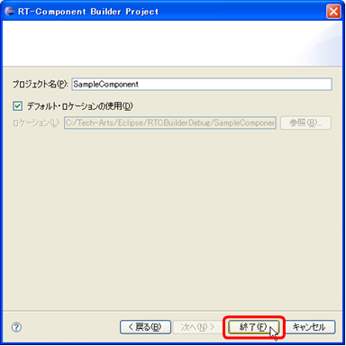</a></div>
<!-- CENTER:''図 2-7 RTC Builder 用プロジェクトの作成　３'' -->
<div align="center"><strong>図8. RTC Builder 用プロジェクトの作成　３</strong></div>
<br>
指定した名称のプロジェクトが生成され、パッケージエクスプローラー内に追加されます。
<br>

<div align="center"><a href="fig2-8CreateProject4.png">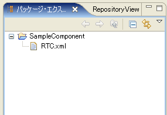</a></div>
<!-- CENTER:''図 2-8 RTC Builder 用プロジェクトの作成　４'' -->
<div align="center"><strong>図9. RTC Builder 用プロジェクトの作成　４</strong></div>
<br>
生成したプロジェクト内には、デフォルト値が設定された RTC プロファイル XML(RTC.xml) が>自動的に生成されます。

#### データポートで使用するデータタイプ定義ファイルの在り処の設定

データポートやサービスポートで使用するデータ型が定義された IDL ファイルが置いてある場>所を予め設定しておく必要があります。
<br>
※ ここでの設定内容は、ワークスペースを変更しない限り有効ですので、プロジェクト毎に設定
する必要はありません。
<br>
下記の手順にて、データ型が定義されている IDL ファイルの在り処を設定して下さい。
<br>

```
 1. メニューバーの [ウィンドウ] > [設定] をクリックし、設定ダイアログを表示させます。
 2. [RtcBuilder] > [Data Type] をクリックし、図12の Data Type 入力画面を出します。
 3. Data Type入力画面の [Add] ボタンをクリックし、"IDL File Directories"を入力します。
     OpenRTM-aist で定義されているデータ型の IDL ファイルはデフォルトでは下記にインス>トールされます。

      C:\Program Files\OpenRTM-aist\1.0\rtm\idl

 4. [OK] ボタンをクリックし、設定を終了します。
```

<br>

<div align="center"><a href="RTCBuilder_datatype_setup.png">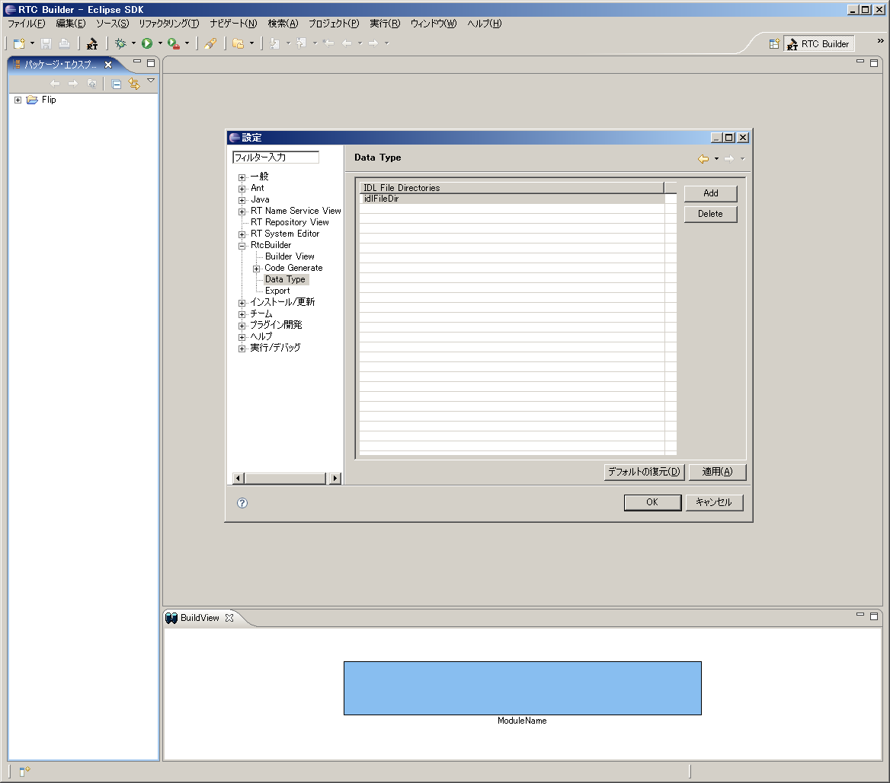</a></div>
<!-- CENTER:''図 2-10 File メニューから Open New Builder Editor'' -->
<div align="center"><strong>図12. データ型定義ファイルの在り処設定</strong></div>

#### RTC プロファイルエディタの起動
RTC プロファイルエディタを開くには、ツールバーの [Open New RtcBuilder Editor] ボタンを
クリックするか、メニューの [ファイル] > [Open New Builder Editor] を選択します。
<br>

<div align="center"><a href="fig2-9ToolsBarOpenNewRtcBuilder.png">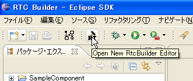</a></div>

<!-- CENTER:''図 2-9 ツールバーから Open New RtcBuilder Editor'' -->
<div align="center"><strong>図10. ツールバーから Open New RtcBuilder Editor</strong></div>
<br>
<br>

<div align="center"><a href="fig2-10FileMenuOpenNewBuilder.png"></a></div>
<!-- CENTER:''図 2-10 File メニューから Open New Builder Editor'' -->
<div align="center"><strong>図11. File メニューから Open New Builder Editor</strong></div>
<br>

#### コンポーネントのプロファイル情報入力とコードの生成

### コンポーネントのプロファイル情報入力とコードの生成

1. 「基本」タブを選択し、基本情報を入力します。

<br>
- Module name: Flip
- Module description: Flip image component
- Module version: 1.0.0
- Module vender: AIST
- Module category: Category
- Component type: STATIC
- Component's activity type: PERIODIC
- Component kind: DataFlowComponent
- Number of maximum instance: 1
- Execution type: PeriodicExecutionContext
- Execution Rate: 1.0
<br>
- Output Project: Flip


<br>

<div align="center"><a href="RTCBuilder_base.png">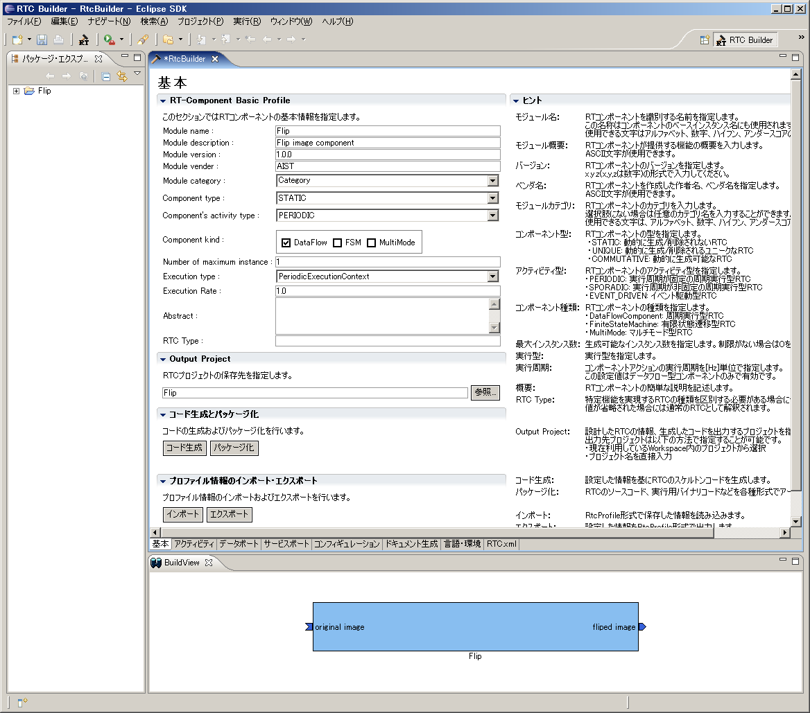</a></div>
<div align="center"><strong>図13. 基本情報の入力</strong></div>
<br>

2. 「アクティビティ」タブを選択し、使用するアクションコールバックを指定します。

Flipコンポーネントでは、onActivated()、onDeactivated()、onExecute() コールバックを使用
しますので、
図14のようにon_activated、on_deactivated、on_executeの３つにチェックを入れます。

<br>

<div align="center"><a href="RTCBuilder_activity.png">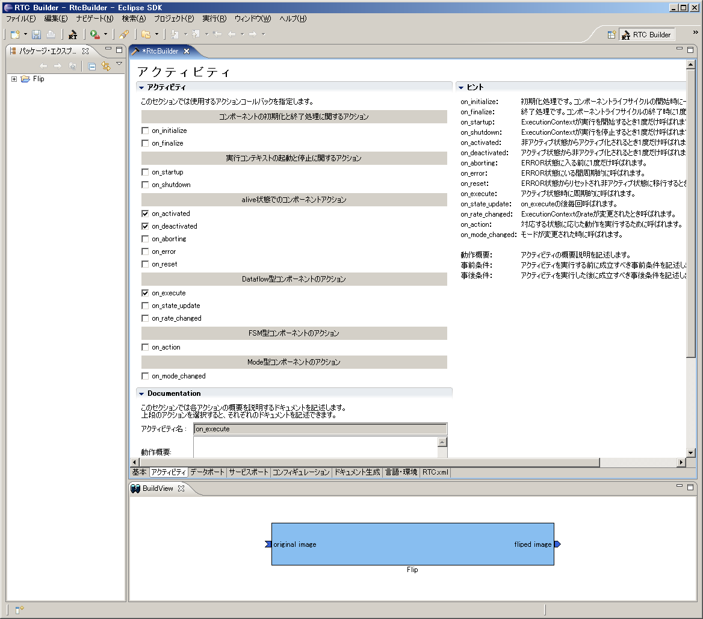</a></div>
<div align="center"><strong>図14. アクティビティコールバックの選択</strong></div>
<br>

3. 「データポート」タブを選択し、データポートの情報を入力します。

<br>

- InPort Profile:
  - Port Name: original_image
  - Data Type: TimedOctetSeq
  - Var Name:  image_orig
  - Disp. Position: left

<br>

- OutPort Profile:
  - Port Name: fliped_image
  - Data Type: TimedOctetSeq
  - Var Name:  image_flip
  - Disp. Position: right

<br>

<div align="center"><a href="RTCBuilder_dataport.png">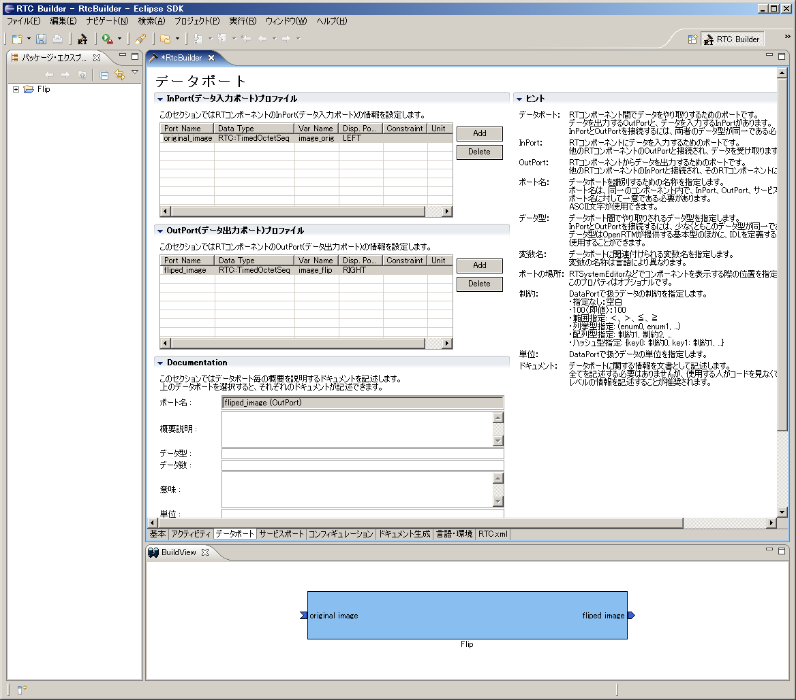</a></div>
<div align="center"><strong>図15. データポート情報の入力</strong></div>
<br>

4.　「コンフィギュレーション」タブを選択し、Configuration の変数を入力します。

<br>

- flip_mode
  - Name: flip_mode
  - TYpe: int
  - Default Value: 1
  - 変数名: flip_mode

<br>

<br>

- image_height
  - Name: image_height
  - TYpe: int
  - Default Value: 240
  - 変数名: img_height

<br>

- image_width
  - Name: image_width
  - TYpe: int
  - Default Value: 320
  - 変数名: img_width

<br>

<div align="center"><a href="RTCBuilder_config.png">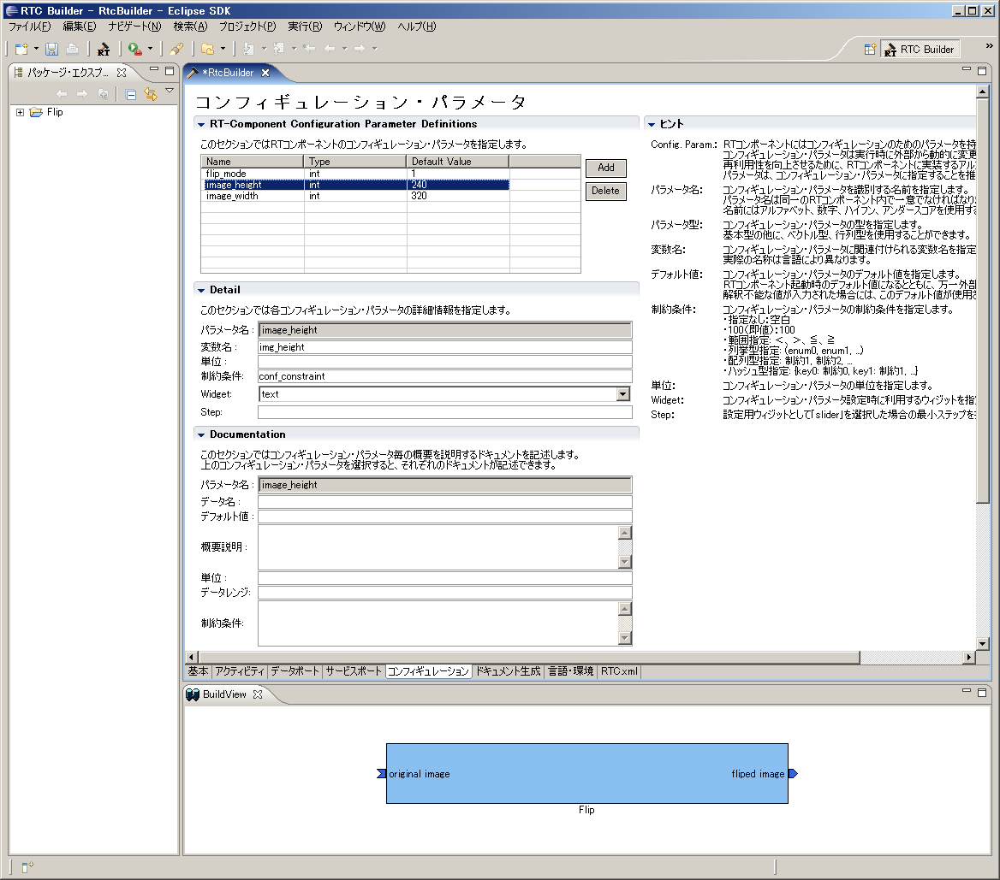</a></div>
<div align="center"><strong>図16. コンフィグレーション情報の入力</strong></div>
<br>

5.　「言語・環境」タブを選択し、プログラミング言語を選択します。

今回は、C++(言語) を選択します。

<br>

<div align="center"><a href="RTCBuilder_lang.png">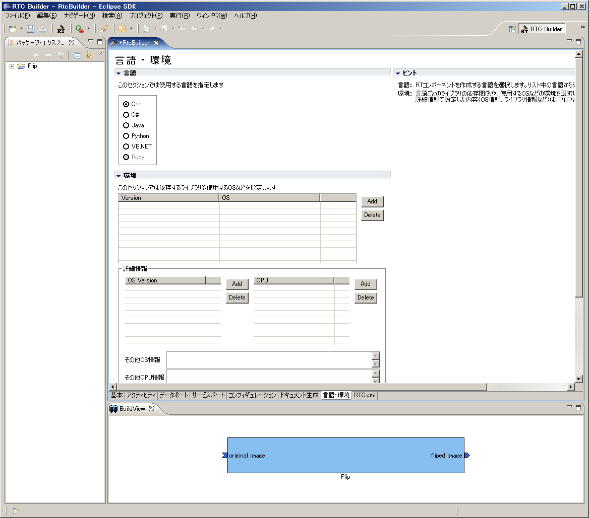</a></div>
<div align="center"><strong>図17. プログラミング言語の選択</strong></div>
<br>

6.　「基本」タブにある [コード生成] ボタンをクリックし、コンポーネントの雛型を生成しま
す。

<br>

<div align="center"><a href="RTCBuilder_base.png"></a></div>
<div align="center"><strong>図18. 雛型の生成(Generate)</strong></div>
<br>

<span style="color:red;">※ 生成されるコード群は、Eclipse 起動時に指定したワークスペー>スフォルダーの中に生成されます。現在のワークスペースは、[ファイル] > [ワークスペースの
切り替え] で確認することができます。</span>;

### アクティビティ処理の実装

Flip コンポーネントでは、InPort から受け取った画像を画像保存用バッファに保存し、その保
存した画像を OpenCV の cvFlip() 関数にて変換します。その後、変換された画像を OutPort >から送信します。
<br>

<br>
onActivated()、onExecute()、onDeactivated()での処理内容を図19に示します。
<br>

<div align="center"><a href="FlipRTC_State.png"></a></div>
<div align="center"><strong>図19. アクティビティ処理の概要</strong></div>
<br>

onExecute() での処理を図20に示します。

<br>

<div align="center"><a href="FlipRTC.png"></a></div>
<div align="center"><strong>図20. onExucete()での処理内容</strong></div>
<br>


#### OpenCV 用ユーザープロパティシートのコピー

プロパティシートとは、コンパイルに必要な種々のオプション（インクルードパス、ライブラリ
ロードバス、ライブラリ）やマクロを記述した VC の設定ファイルの一種です。
RTCBuilder や rtc-template で生成した VC 用のプロジェクトでは、VC のプロパティシートを
使用して各種オプションを与えています。また、ユーザーがオプションを追加できるように、ユ
ーザー定義のプロパティシートもインクルードするようになっています。
- rtm_config.vsprop：OpenRTM に関する情報を含むプロパティシート。インストールされてい>る OpenRTM-aist に依存するファイルであるため、copyprops.bat を使用して OpenRTM のシス>テムディレクトリーからカレントのプロジェクトへコピーします。
- user_config.vsprops：ユーザー定義のプロパティシート。デフォルトでは空っぽです。使い>方は、ソースコード：OpenRTM-aist/win32/OpenRTM-aist/example/USBCamera の中に入っている
 user_config.vsprops (OpenCV 用の設定)を参考にしてください。

以下の内容を user_config.vsprops というファイル名で保存し、Flip フォルダーにコピーして
ください。

もしくは、下記より vsprops ファイルをダウンロードし、Flip フォルダーに保存してください
。

<br>
[user_config.vsprops](http://www.openrtm.org/OpenRTM-aist/download/ROBOMEC2009/user_config.vsprops)

※　既にFlipフォルダーには user_config.vsprops ファイルが存在しておりますが、上書きして
構いません。

<br>
```
 <?xml version="1.0" encoding="shift_jis"?>
 <VisualStudioPropertySheet
    ProjectType="Visual C++"
    Version="8.00"
    Name="OpenCV"
    >
    <Tool
        Name="VCCLCompilerTool"
        AdditionalIncludeDirectories="$(cv_includes)"
    />
    <Tool
        Name="VCLinkerTool"
        AdditionalLibraryDirectories="$(cv_libdir)"
    />
    <UserMacro
        Name="user_lib"
        Value="$(cv_lib)"
    />
    <UserMacro
        Name="user_libd"
        Value="$(cv_libd)"
    />
    <UserMacro
        Name="cv_root"
        Value="C:\Program Files\OpenCV"

    />
    <UserMacro
        Name="cv_includes"
        Value="&quot;$(cv_root)\cv\include&quot;;&quot;$(cv_root)\cvaux\include&quot;;&quot;$(cv_root)\cxcore\include&quot;;&quot;$(cv_root)\otherlibs\highgui&quot;;&quot;$(cv_root)\otherlibs\cvcam\include&quot;"
    />
    <UserMacro
        Name="cv_libdir"
        Value="&quot;$(cv_root)\lib&quot;"
    />
    <UserMacro
        Name="cv_bin"
        Value="$(cv_root)\bin"
    />
    <UserMacro
        Name="cv_lib"
        Value="cv.lib cvcam.lib highgui.lib cxcore.lib"
    />
    <UserMacro
        Name="cv_libd"
        Value="cv.lib cvcam.lib highgui.lib cxcore.lib"
    />
 </VisualStudioPropertySheet>
```
#### copyprops.bat の実行

copyprops.bat というファイルを実行することで、rtm_config.vsprops というファイルがコピ>ーされます。

rtm_config.vsprops ファイルは、RTコンポーネントを VC++ でビルドするために必要なインク>ルードパスやリンクするライブラリ等が記述されたファイルです。

#### ヘッダファイルの編集
- OpenCV のライブラリを使用するため、OpenCV のインクルードファイルをインクルードします
。

```
 //OpenCV 用インクルードファイルのインクルード
 #include<cv.h>
 #include<cxcore.h>
 #include<highgui.h>
```

- この cvFlip コンポーネントでは、画像領域の確保、Flip 処理、確保した画像領域の解放の>それぞれの処理を行います。これらの処理は、それぞれ onActivated()、onDeactivated()、onExecute() のコールバック関数で呼ぶことにしますので、これら3つの関数のコメントアウトを解
除します。

```
   /***
    *
    * The activated action (Active state entry action)
    * former rtc_active_entry()
    *
    * @param ec_id target ExecutionContext Id
    *
    * @return RTC::ReturnCode_t
    *
    *
    */
   virtual RTC::ReturnCode_t onActivated(RTC::UniqueId ec_id);

   /***
    *
    * The deactivated action (Active state exit action)
    * former rtc_active_exit()
    *
    * @param ec_id target ExecutionContext Id
    *
    * @return RTC::ReturnCode_t
    * 
    * 
    */
   virtual RTC::ReturnCode_t onDeactivated(RTC::UniqueId ec_id);

   /***
    *
    * The execution action that is invoked periodically
    * former rtc_active_do()
    *
    * @param ec_id target ExecutionContext Id
    *
    * @return RTC::ReturnCode_t
    * 
    * 
    */
   virtual RTC::ReturnCode_t onExecute(RTC::UniqueId ec_id);
```

- 反転した画像の保存用にメンバー変数を追加します。

```
   IplImage* m_image_buff;
   IplImage* m_flip_image_buff;
```

#### ソースファイルの編集 

下記のように、onActivated()、onDeactivated()、onExecute()を実装します。

```
 RTC::ReturnCode_t Flip::onActivated(RTC::UniqueId ec_id)
 {
   // イメージ用メモリーの確保
   m_image_buff = cvCreateImage(cvSize(m_img_width, m_img_height), IPL_DEPTH_8U, 3);
   m_flip_image_buff = cvCreateImage(cvSize(m_img_width, m_img_height), IPL_DEPTH_8U, 3);
   return RTC::RTC_OK;
 }


 RTC::ReturnCode_t Flip::onDeactivated(RTC::UniqueId ec_id)
 {
   // イメージ用メモリーの解放
   cvReleaseImage(&m_image_buff);
   cvReleaseImage(&m_flip_image_buff);
   return RTC::RTC_OK;
 }


 RTC::ReturnCode_t Flip::onExecute(RTC::UniqueId ec_id)
 {
   // 新しいデータのチェック
   if (m_image_origIn.isNew()) {
     // InPortデータの読み込み
     m_image_origIn.read();

     // InPortの画像データをIplImageのimageDataにコピー
     memcpy(m_image_buff->imageData,(void *)&(m_image_orig.data[0]),m_image_orig.data.length());
 
     // InPortからの画像データを反転する。 m_flip_mode 0: X軸周り, 1: Y軸周り, -1: 両>方の軸周り
     cvFlip(m_image_buff, m_flip_image_buff, m_flip_mode);
 
     // 画像データのサイズ取得
     int len = m_flip_image_buff->nChannels * m_flip_image_buff->width * m_flip_image_buff->height;
     m_image_flip.data.length(len);
 
     // 反転した画像データを OutPort にコピー
     memcpy((void *)&(m_image_flip.data[0]),m_flip_image_buff->imageData,len);
 
     // 反転した画像データを OutPort から出力する。
     m_image_flipOut.write();
   }
   return RTC::RTC_OK;
 }

```
#### ビルドの実行

図21のようにし、コンポーネントのビルドを行います。

<br>

<div align="center"><a href="VC++_build.png"></a></div>
<div align="center"><strong>図21. ビルドの実行</strong></div>
<br>

#### Flip コンポーネントの動作確認

ここでは、OpenRTM-aist のサンプルコンポーネントに含まれている USBCameraAqcuireComp コ>ンポーネントと、USBCameraMonitorCom コンポーネント、それと、Flip コンポーネントを接続>し動作確認を行います。

#### NameService の起動

omniORB のネームサービスを起動します。

<br>
[スタート] > [すべてのプログラム] > [OpenRTM-aist] > [C++] > [examples] をクリックし、
[Start Naming Service] をクリックしてください。

#### rtc.conf の作成

RTコンポーネントでは、ネームサーバーのアドレスやネームサーバーへの登録フォーマットなど
の情報を rtc.conf というファイルで指定する必要があります。

下記の内容を rtc.conf というファイル名で保存し、Flip\FlipComp\Debug (もしくは、Release) フォルダーに置いてください。

```
 corba.nameservers: localhost
 naming.formats: %n.rtc
```

#### Flip コンポーネントの起動

Flip コンポーネントを起動します。

先程 rtc.conf ファイルを置いたフォルダーにある、FlipComp.exe ファイルを実行してくださ>い。

#### USBCameraAqcuire、USBCameraMonitor コンポーネントの起動 

USB カメラのキャプチャ画像を OutPort から出力する USBCameraAqcuireComp コンポーネント>と、InPort で受け取った画像を画面に表示する USBCameraMonitorCOmp コンポーネントを起動>します。

これら２つのコンポーネントは、下記の手順にて起動できます。

[スタート] > [すべてのプログラム] > [OpenRTM-aist] > [C++] > [examples] をクリックし、
「USBCameraAqcuireComp」と「USBCameraMonitorCOmp」をそれぞれクリックして実行します。

#### コンポーネントの接続

図22のように、RTSystemEditor にて USBCameraAqcuireComp,Flip、USBCameraMonitorComp コン
ポーネントを接続します。

<br>

<div align="center"><a href="RTSystemEditor_connection_flip.png">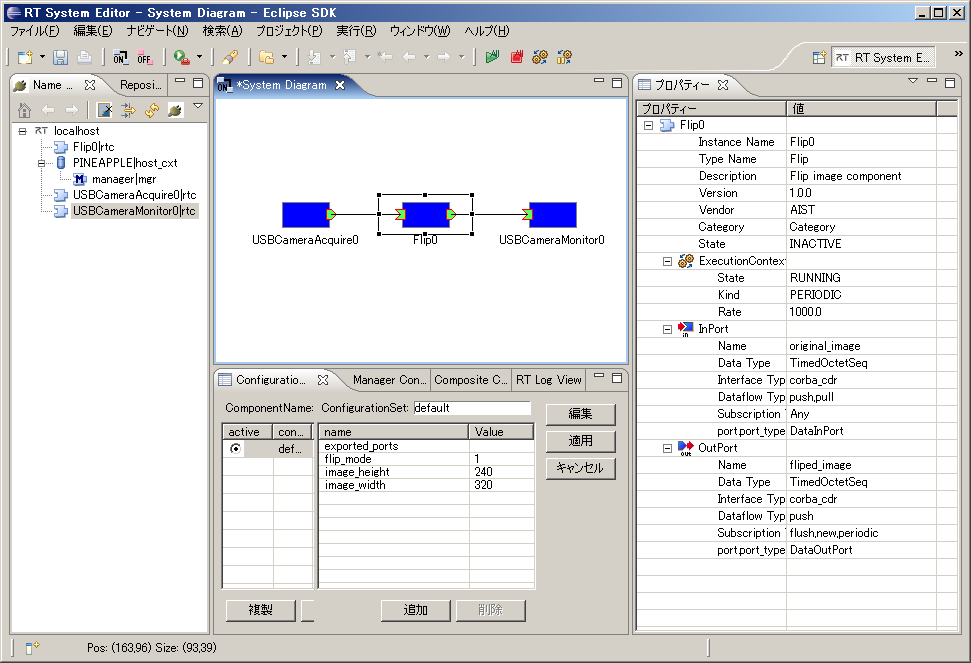</a></div>
<div align="center"><strong>図22. コンポーネントの接続</strong></div>
<br>

#### Flip コンポーネントのコンフィギュレーションの変更

図23のようにコンフィギュレーションビューにてコンフィギュレーションを変更することができ
ます。

ELECOM製 の UCAM-DLM 130HWH (白いUSBカメラ) を使用の場合は、image_height と image_width パラメーターを下記のように変更してください。

```
 image_height : 480
 image_width  : 640
```

また、ELECOM製 の UCAM-DLM 130HWH (白いUSBカメラ) を使用の場合は、USBCameraMonitor の image_height,image_width パラメーターも
上記のように変更する必要があります。

<br>

<div align="center"><a href="RTSystemEditor_config_edit.png">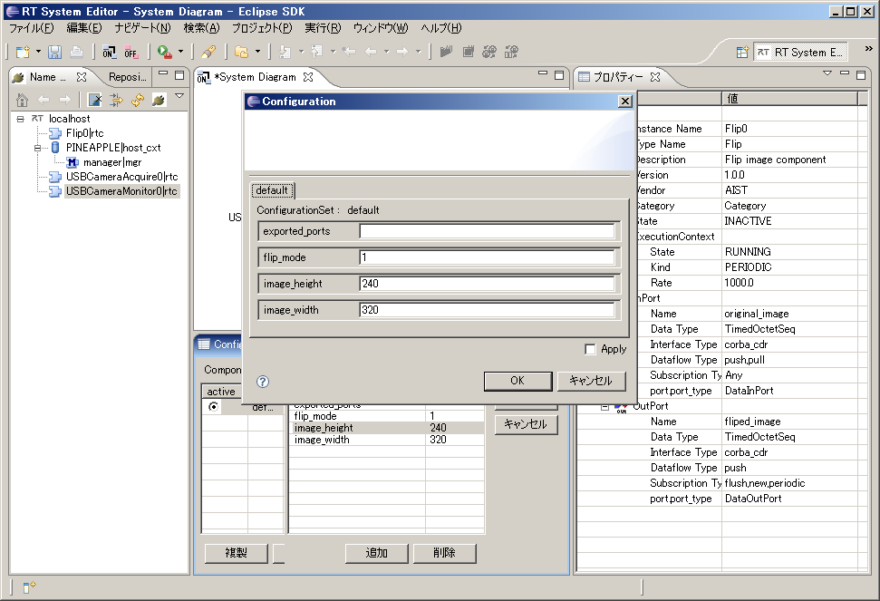</a></div>
<div align="center"><strong>図23. コンフィギュレーションパラメータの変更</strong></div>
<br>

#### コンポーネントの Activate

RTSystemEditor の上部にあります「ALL」というアイコンをクリックし、全てのコンポーネント
をアクティベートします。

正常にアクティベートされた場合、図24のように黄緑色でコンポーネントが表示されます。

<br>

<div align="center"><a href="RTSystemEditor_activate.png">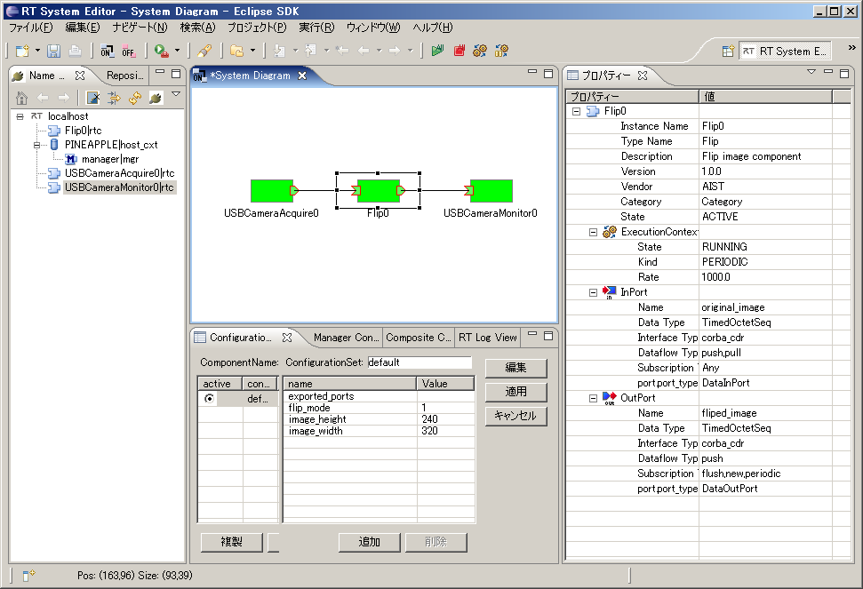</a></div>
<div align="center"><strong>図24. コンポーネントのアクティベート</strong></div>
<br>

#### 動作確認


Flip コンポーネントのコンフィギュレーションパラメーター「flip_mode」を「0」や「-1」などに変更し、画像の反転が行われるかを確認してください。

## Flip コンポーネントのソースファイル

```
 // -*- C++ -*-
 /*!
  * @file  Flip.cpp
  * @brief Flip image component
  * @date $Date$
  *
  * $Id$
  */
 
 #include "Flip.h"
 
 // Module specification
 static const char* flip_spec[] =
   {
     "implementation_id", "Flip",
     "type_name",         "Flip",
     "description",       "Flip image component",
     "version",           "1.0.0",
     "vendor",            "AIST",
     "category",          "Category",
     "activity_type",     "PERIODIC",
     "kind",              "DataFlowComponent",
     "max_instance",      "1",
     "language",          "C++",
     "lang_type",         "compile",
     "exec_cxt.periodic.rate", "1.0",
     // Configuration variables
     "conf.default.flip_mode", "1",
     "conf.default.image_height", "240",
     "conf.default.image_width", "320",
     ""
   };
 
 /*!
  * @brief constructor
  * @param manager Maneger Object
  */
 Flip::Flip(RTC::Manager* manager)
   : RTC::DataFlowComponentBase(manager),
     m_image_origIn("original_image", m_image_orig),
     m_image_flipOut("fliped_image", m_image_flip),
     dummy(0),
     m_image_buff(0),
     m_flip_image_buff(0)
 {
   // Registration: InPort/OutPort/Service
 
   // Set InPort buffers
   registerInPort("original_image", m_image_origIn);
   
   // Set OutPort buffer
   registerOutPort("fliped_image", m_image_flipOut);
 }
 
 /*!
  * @brief destructor
  */
 Flip::~Flip()
 {
 }
 
 
 RTC::ReturnCode_t Flip::onInitialize()
 {
   // Bind variables and configuration variable
   bindParameter("flip_mode", m_flip_mode, "1");
   bindParameter("image_height", m_img_height, "240");
   bindParameter("image_width", m_img_width, "320");
   return RTC::RTC_OK;
 }
 
 RTC::ReturnCode_t Flip::onActivated(RTC::UniqueId ec_id)
 {
   // イメージ用メモリーの確保
   m_image_buff = cvCreateImage(cvSize(m_img_width, m_img_height), IPL_DEPTH_8U, 3);
   m_flip_image_buff = cvCreateImage(cvSize(m_img_width, m_img_height), IPL_DEPTH_8U, 3);
   return RTC::RTC_OK;
 }
 
 
 RTC::ReturnCode_t Flip::onDeactivated(RTC::UniqueId ec_id)
 {
   // イメージ用メモリーの解放
   cvReleaseImage(&m_image_buff);
   cvReleaseImage(&m_flip_image_buff);
   return RTC::RTC_OK;
 }
 
 
 RTC::ReturnCode_t Flip::onExecute(RTC::UniqueId ec_id)
 {
   // 新しいデータのチェック
   if (m_image_origIn.isNew()) {
     // InPort データの読み込み
     m_image_origIn.read();
 
     // InPortの 画像データを IplImage の imageData にコピー
     memcpy(m_image_buff->imageData,(void *)&(m_image_orig.data[0]),m_image_orig.data.length());
 
     // InPortからの画像データを反転する。 m_flip_mode 0: X軸周り, 1: Y軸周り, -1: 両方の軸周り
     cvFlip(m_image_buff, m_flip_image_buff, m_flip_mode);
 
     // 画像データのサイズ取得
     int len = m_flip_image_buff->nChannels * m_flip_image_buff->width * m_flip_image_buff->height;
     m_image_flip.data.length(len);
 
     // 反転した画像データを OutPort にコピー
     memcpy((void *)&(m_image_flip.data[0]),m_flip_image_buff->imageData,len);
 
     // 反転した画像データを OutPort から出力する。
     m_image_flipOut.write();
   }
   return RTC::RTC_OK;
 }
 
 extern "C"
 {
  
   void FlipInit(RTC::Manager* manager)
   {
     RTC::Properties profile(flip_spec);
     manager->registerFactory(profile,
                              RTC::Create<Flip>,
                              RTC::Delete<Flip>);
   }
   
 };
```

### Flip コンポーネントのヘッダファイル

```
 // -*- C++ -*-
 /*!
  * @file  Flip.h
  * @brief Flip image component
  * @date  $Date$
  *
  * $Id$
  */
 
 #ifndef FLIP_H
 #define FLIP_H
 
 #include <rtm/Manager.h>
 #include <rtm/DataFlowComponentBase.h>
 #include <rtm/CorbaPort.h>
 #include <rtm/DataInPort.h>
 #include <rtm/DataOutPort.h>
 #include <rtm/idl/BasicDataTypeSkel.h>
 
 // (1)  OpenCV 用インクルードファイルのインクルード
 #include<cv.h>
 #include<cxcore.h>
 #include<highgui.h>
 
 
 using namespace RTC;
 
 /*!
  * @class Flip
  * @brief Flip image component
  *
  */
 class Flip
   : public RTC::DataFlowComponentBase
 {
  public:
   /*!
    * @brief constructor
    * @param manager Maneger Object
    */
   Flip(RTC::Manager* manager);
 
   /*!
    * @brief destructor
    */
   ~Flip();
 
 
   /*!
    *
    * The initialize action (on CREATED->ALIVE transition)
    * formaer rtc_init_entry() 
    *
    * @return RTC::ReturnCode_t
    * 
    * 
    */
    virtual RTC::ReturnCode_t onInitialize();
 
   /***
    *
    * The activated action (Active state entry action)
    * former rtc_active_entry()
    *
    * @param ec_id target ExecutionContext Id
    *
    * @return RTC::ReturnCode_t
    * 
    * 
    */
   virtual RTC::ReturnCode_t onActivated(RTC::UniqueId ec_id);
 
   /***
    *
    * The deactivated action (Active state exit action)
    * former rtc_active_exit()
    *
    * @param ec_id target ExecutionContext Id
    *
    * @return RTC::ReturnCode_t
    * 
    * 
    */
   virtual RTC::ReturnCode_t onDeactivated(RTC::UniqueId ec_id);
 
   /***
    *
    * The execution action that is invoked periodically
    * former rtc_active_do()
    *
    * @param ec_id target ExecutionContext Id
    *
    * @return RTC::ReturnCode_t
    * 
    * 
    */
   virtual RTC::ReturnCode_t onExecute(RTC::UniqueId ec_id);
 
 
  protected:
   // Configuration variable declaration
   /*!
    * flip_mode = 0: flipping around x-axis 
    * flip_mode > 1: flipping around y-axis 
    * flip_mode < 0: flipping around both axises
    * - Name: flip_mode flip_mode
    * - DefaultValue: 1
    */
   int m_flip_mode;
   /*!
    * 
    * - Name:  m_img_height
    * - DefaultValue: 240
    * - 画像の高さ
    */
   int m_img_height;
   /*!
    * 
    * - Name:  m_img_width
    * - DefaultValue: 320
    * - 画像の幅
    */
   int m_img_width;
 
 
   // DataInPort declaration
   TimedOctetSeq m_image_orig;
   InPort<TimedOctetSeq> m_image_origIn;
   
 
   // DataOutPort declaration
   TimedOctetSeq m_image_flip;
   OutPort<TimedOctetSeq> m_image_flipOut;
   
  private:
   int dummy;
   IplImage* m_image_buff;
   IplImage* m_flip_image_buff;
 };
 
 
 extern "C"
 {
   void FlipInit(RTC::Manager* manager);
 };
 
 #endif // FLIP_H
```


### Flip コンポーネントのビルド済みパッケージ 

ビルド済みパッケージを下記からダウンロードできます。

拡張子を"zip_"としてますので、"zip"にリネームしてから解凍して下さい。


- [ビルド済みパッケージ](http://www.openrtm.org/OpenRTM-aist/download/ROBOMEC2009/Flip.zip_)

## おまけ(物体追跡コンポーネント) 

OpenCVのライブラリを用いて、物体追跡を行うコンポーネントです。

### コンポーネントの概要

InPort からの画像データを表示し、マウスで選択されたオブジェクトを追跡するコンポーネント。

OutPort からは、物体追跡画像と、マウスで選択した位置からの移動量を出力する。

画像のサイズと、明度、彩度はコンフィグレーションにて変更可能。

作成する RTC の仕様は以下のとおりです。

- InPort
  - キャプチャされた画像データ (TimedOctetSeq)

- OutPort
  - 物体追跡画像データ (TimedOctetSeq)

- OutPort
  - マウスで選択したオブジェクトの中心位置の移動量 (TimedFloatSeq)

- Configuration
  - 明度の最大値(int) default: 256
  - 明度の最小値(int) default: 10
  - 彩度の最小値(int) default: 30
  - 画像の高さ(int)   default: 240
  - 画像の幅(int)     default: 320

### RTCBuilder でのプロファイル情報入力内容
#### 基本情報

- Module name: ObjectTracking
- Module description: Object tracking component
- OutputProject: ObjectTracking

#### データポート

<br>

- InPort Profile:
  - Port Name: in_image
  - Data Type: TimedOctetSeq
  - Var Name:  in_image
  - Disp. Position: left
<br>

- OutPort Profile:
  - Port Name: tracing_image
  - Data Type: TimedOctetSeq
  - Var Name:  tracking_image
  - Disp. Position: right
<br>

- OutPort Profile:
  - Port Name: displacement
  - Data Type: TimedFloatSeq
  - Var Name:  displacement
  - Disp. Position: right

#### コンフィギュレーションパラメーター

<br>

- brightness_max
  - Name: brightness_max
  - TYpe: int
  - Default Value: 256
  - 変数名: b_max

<br>

- brightness_min
  - Name: brightness_min
  - TYpe: int
  - Default Value: 10
  - 変数名: b_min

<br>

- saturation_min
  - Name: saturation_min
  - TYpe: int
  - Default Value: 30
  - 変数名: s_min

<br>

- image_height
  - Name: image_height
  - TYpe: int
  - Default Value: 240
  - 変数名: img_height

<br>

- image_width
  - Name: image_width
  - TYpe: int
  - Default Value: 320
  - 変数名: img_width

### ObjectTracking コンポーネントのソースファイル 

```
 // -*- C++ -*-
 /*!
  * @file  ObjectTracking.cpp
  * @brief Object tracking component
  * @date $Date$
  *
  * $Id$
  */
 
 #include "ObjectTracking.h"
 
 #define HIST_RANGE_MAX 180.0
 #define HIST_RANGE_MIN 0.0
 
 // 入力画像用 IplImage
 IplImage* g_image;
 
 // CamShift トラッキング用変数
 CvPoint g_origin;
 CvRect g_selection;  // 
 
 // 初期追跡領域の設定判別フラグ値 (0: 設定なし, 1: 設定あり)
 int g_select_object;
 
 // トラッキングの開始/停止用フラグ値 (0: 停止, -1: 開始, 1: トラッキング中)
 int g_track_object;
 
 // オブジェクト選択判定用フラグ(0: 1以外 1: 選択された直後)
 int g_selected_flag;
 
 // 選択された範囲の中心座標
 float g_selected_x;
 float g_selected_y;
 
 
 // Module specification
 static const char* objecttracking_spec[] =
   {
     "implementation_id", "ObjectTracking",
     "type_name",         "ObjectTracking",
     "description",       "Object tracking component",
     "version",           "1.0.0",
     "vendor",            "AIST",
     "category",          "Category",
     "activity_type",     "PERIODIC",
     "kind",              "DataFlowComponent",
     "max_instance",      "1",
     "language",          "C++",
     "lang_type",         "compile",
     "exec_cxt.periodic.rate", "1.0",
     // Configuration variables
     "conf.default.brightness_max", "256",
     "conf.default.brightness_min", "10",
     "conf.default.saturation_min", "30",
     "conf.default.image_height", "240",
     "conf.default.image_width", "320",
     ""
   };
 
 /*!
  * @brief constructor
  * @param manager Maneger Object
  */
 ObjectTracking::ObjectTracking(RTC::Manager* manager)
   : RTC::DataFlowComponentBase(manager),
     m_in_imageIn("in_image", m_in_image),
     m_tracking_imageOut("tracing_image", m_tracking_image),
     m_displacementOut("displacement", m_displacement),
     dummy(0),
     m_hsv(0), m_hue(0), m_mask(0), m_backproject(0),
     m_hist(0), m_backproject_mode(0),m_hdims(16),
     m_init_flag(0)
 {
   // Registration: InPort/OutPort/Service
   // Set InPort buffers
   registerInPort("in_image", m_in_imageIn);
   
   // Set OutPort buffer
   registerOutPort("tracing_image", m_tracking_imageOut);
   registerOutPort("displacement", m_displacementOut);
 
   m_hranges_arr[0] = HIST_RANGE_MIN;
   m_hranges_arr[1] = HIST_RANGE_MAX;
   m_hranges = m_hranges_arr;
 }
 
 /*!
  * @brief destructor
  */
 ObjectTracking::~ObjectTracking()
 {
 }
 
 
 
 RTC::ReturnCode_t ObjectTracking::onInitialize()
 {
   // Bind variables and configuration variable
   bindParameter("brightness_max", m_b_max, "256");
   bindParameter("brightness_min", m_b_min, "10");
   bindParameter("saturation_min", m_s_min, "30");
   bindParameter("image_height", m_img_height, "240");
   bindParameter("image_width", m_img_width, "320");
   m_displacement.data.length(2);
   return RTC::RTC_OK;
 }
 
 
 RTC::ReturnCode_t ObjectTracking::onActivated(RTC::UniqueId ec_id)
 {
   m_init_flag = 0;
   // ウインドウを生成する
   cvNamedWindow( "ObjectTracking", 1 );
   // マウス操作時のコールバック処理の登録
   cvSetMouseCallback( "ObjectTracking", on_mouse, 0 );
   g_selected_flag = 0;
   g_selected_x = 0.0;;
   g_selected_y = 0.0;;
 
   return RTC::RTC_OK;
 }
 
 
 RTC::ReturnCode_t ObjectTracking::onDeactivated(RTC::UniqueId ec_id)
 {
   if (m_init_flag) {
     // メモリーを解放する
     cvReleaseImage(&g_image);
     cvReleaseImage(&m_hsv);
     cvReleaseImage(&m_hue);
     cvReleaseImage(&m_mask);
     cvReleaseImage(&m_backproject);
   }
   // ウインドウを破棄する
   cvDestroyWindow("ObjectTracking");
   m_init_flag = 0;
   return RTC::RTC_OK;
 }
 
 
 RTC::ReturnCode_t ObjectTracking::onExecute(RTC::UniqueId ec_id)
 {
   if (m_in_imageIn.isNew()) {
     m_in_imageIn.read();
 
     if(!m_init_flag) allocateBuffers();
 
     memcpy(g_image->imageData,(void *)&(m_in_image.data[0]),m_in_image.data.length());
     cvShowImage("ObjectTracking", g_image);
 
     // キャプチャされた画像を HSV 表色系に変換して hsv に格納
     cvCvtColor( g_image, m_hsv, CV_BGR2HSV );
 
     // g_track_objectフラグが0以下なら、以下の処理を行う
     if( g_track_object )
       {
 	cvInRangeS( m_hsv, cvScalar(HIST_RANGE_MIN,m_s_min,MIN(m_b_min,m_b_max),0),
 		    cvScalar(HIST_RANGE_MAX,256,MAX(m_b_min,m_b_max),0), m_mask );
 	cvSplit( m_hsv, m_hue, 0, 0, 0 );
 
 	if( g_track_object < 0 ) calcHistogram();
 
 	// バックプロジェクションを計算する
 	cvCalcBackProject( &m_hue, m_backproject, m_hist );
 	// backProjectionのうち、マスクが1であるとされた部分のみ残す
 	cvAnd( m_backproject, m_mask, m_backproject, 0 );
 	// CamShift法による領域追跡を実行する
 	cvCamShift( m_backproject, m_track_window,
 		    cvTermCriteria( CV_TERMCRIT_EPS | CV_TERMCRIT_ITER, 10, 1 ),
 		    &m_track_comp, &m_track_box );
 	m_track_window = m_track_comp.rect;
 	
 	if( m_backproject_mode )
 	  cvCvtColor( m_backproject, g_image, CV_GRAY2BGR );
 	if( g_image->origin )
 	  m_track_box.angle = -m_track_box.angle;
 	cvEllipseBox( g_image, m_track_box, CV_RGB(255,0,0), 3, CV_AA, 0 );
 
 	// マウスで選択された領域の中心座標を保存
 	if (g_selected_flag) {
 	  g_selected_x = m_track_box.center.x;
 	  g_selected_y = m_track_box.center.y;
 	  g_selected_flag = 0;
 	}
 
 	// マウスで選択された位置からの移動量をOutPortから出力
 	m_displacement.data[0] = m_track_box.center.x - g_selected_x;
 	m_displacement.data[1] = -(m_track_box.center.y - g_selected_y);
 	m_displacementOut.write();
       }
         
     // マウスで選択中の初期追跡領域の色を反転させる
     if( g_select_object && g_selection.width > 0 && g_selection.height > 0 )
       {
 	cvSetImageROI( g_image, g_selection );
 	cvXorS( g_image, cvScalarAll(255), g_image, 0 );
 	cvResetImageROI( g_image );
       }
 
     // 画像を表示する
     cvShowImage( "ObjectTracking", g_image );
 
     // 画像をOutPortから出力する
     int len = g_image->nChannels * g_image->width * g_image->height;
     m_tracking_image.data.length(len);
     memcpy((void *)&(m_tracking_image.data[0]),g_image->imageData,len);
     m_tracking_imageOut.write();
 
     // キー入力を待ち、押されたキーによって処理を分岐させる
     int c = cvWaitKey(10);
     // while無限ループから脱出（プログラムを終了）
     if( (char) c == 27 ) {
       this->exit();
     }
   }
   return RTC::RTC_OK;
 }
 
 /*!
  * 全てのイメージ用メモリーの確保
  */
 void ObjectTracking::allocateBuffers() {
   g_image = cvCreateImage( cvSize(m_img_width,m_img_height),8, 3 );
   m_hsv = cvCreateImage( cvSize(m_img_width,m_img_height),8, 3 );
   m_hue = cvCreateImage( cvSize(m_img_width,m_img_height),8, 1 );
   m_mask = cvCreateImage( cvSize(m_img_width,m_img_height),8, 1 );
   m_backproject = cvCreateImage( cvSize(m_img_width,m_img_height),8, 1 );
   m_hist = cvCreateHist( 1, &m_hdims, CV_HIST_ARRAY, &m_hranges, 1 );
   m_init_flag = 1;
 }
 
 /*!
  * ヒストグラムの計算
  */
 void ObjectTracking::calcHistogram() {
   float max_val = 0.f;
   cvSetImageROI( m_hue, g_selection );
   cvSetImageROI( m_mask, g_selection );
   // ヒストグラムを計算し、最大値を求める
   cvCalcHist( &m_hue, m_hist, 0, m_mask );
   cvGetMinMaxHistValue( m_hist, 0, &max_val, 0, 0 );
   // ヒストグラムの縦軸（頻度）を0-255のダイナミックレンジに正規化
   cvConvertScale( m_hist->bins, m_hist->bins, max_val ? 255. / max_val : 0., 0 );
   // hue,mask画像に設定された ROI をリセット
   cvResetImageROI( m_hue );
   cvResetImageROI( m_mask );
   m_track_window = g_selection;
   // track_object をトラッキング中にする
   g_track_object = 1;
 }
 
 
 extern "C"
 {
  
   void ObjectTrackingInit(RTC::Manager* manager)
   {
     RTC::Properties profile(objecttracking_spec);
     manager->registerFactory(profile,
                              RTC::Create<ObjectTracking>,
                              RTC::Delete<ObjectTracking>);
   }
   
 
   //
   //	マウスドラッグによって初期追跡領域を指定する
   //
   //	引数:
   //		event	: マウス左ボタンの状態
   //		x		: マウスが現在ポイントしているx座標
   //		y		: マウスが現在ポイントしているy座標
   //		flags	: 本プログラムでは未使用
   //		param	: 本プログラムでは未使用
   //
   void on_mouse( int event, int x, int y, int flags, void* param )
   {
     // 画像が取得されていなければ、処理を行わない
     if( !g_image )
       return;
 
     // 原点の位置に応じてyの値を反転（画像の反転ではない）
     if( g_image->origin )
       y = g_image->height - y;
 
     // マウスの左ボタンが押されていれば以下の処理を行う
     if( g_select_object )
       {
 	g_selection.x = MIN(x,g_origin.x);
 	g_selection.y = MIN(y,g_origin.y);
 	g_selection.width = g_selection.x + CV_IABS(x - g_origin.x);
 	g_selection.height = g_selection.y + CV_IABS(y - g_origin.y);
         
 	g_selection.x = MAX( g_selection.x, 0 );
 	g_selection.y = MAX( g_selection.y, 0 );
 	g_selection.width = MIN( g_selection.width, g_image->width );
 	g_selection.height = MIN( g_selection.height, g_image->height );
 	g_selection.width -= g_selection.x;
 	g_selection.height -= g_selection.y;
       }
 
     // マウスの左ボタンの状態によって処理を分岐
     switch( event )
       {
       case CV_EVENT_LBUTTONDOWN:
 	// マウスの左ボタンが押されたのであれば、
 	// 原点および選択された領域を設定
 	g_origin = cvPoint(x,y);
 	g_selection = cvRect(x,y,0,0);
 	g_select_object = 1;
 	break;
       case CV_EVENT_LBUTTONUP:
 	// マウスの左ボタンが離されたとき、width と height がどちらも正であれば、
 	// g_track_objectフラグを開始フラグにする
 	g_select_object = 0;
 	if( g_selection.width > 0 && g_selection.height > 0 ) {
 	  g_track_object = -1;
 	  g_selected_flag = 1;
 	}
 	break;
       }
   }
 
 };

```

### ObjectTracking コンポーネントのヘッダファイル

```
// -*- C++ -*-
 /*!
  * @file  ObjectTracking.h
  * @brief Object tracking component
  * @date  $Date$
  *
  * $Id$
  */

 #ifndef OBJECTTRACKING_H
 #define OBJECTTRACKING_H

 #include <rtm/Manager.h>
 #include <rtm/DataFlowComponentBase.h>
 #include <rtm/CorbaPort.h>
 #include <rtm/DataInPort.h>
 #include <rtm/DataOutPort.h>
 #include <rtm/idl/BasicDataTypeSkel.h>

 #include <cv.h>
 #include <highgui.h>
 #include <stdio.h>
 #include <ctype.h>

 using namespace RTC;

 /*!
  * @class ObjectTracking
  * @brief Object tracking component
  *
  */
 class ObjectTracking
   : public RTC::DataFlowComponentBase
 {
  public:
   /*!
    * @brief constructor
    * @param manager Maneger Object
    */
   ObjectTracking(RTC::Manager* manager);

   /*!
    * @brief destructor
    */
   ~ObjectTracking();

   /*!
    *
    * The initialize action (on CREATED->ALIVE transition)
    * formaer rtc_init_entry()
    *
    * @return RTC::ReturnCode_t
    *
    *
    */
    virtual RTC::ReturnCode_t onInitialize();


   /***
    *
    * The activated action (Active state entry action)
    * former rtc_active_entry()
    *
    * @param ec_id target ExecutionContext Id
    *
    * @return RTC::ReturnCode_t
    *
    *
    */
   virtual RTC::ReturnCode_t onActivated(RTC::UniqueId ec_id);

   /***
    *
    * The deactivated action (Active state exit action)
    * former rtc_active_exit()
    *
    * @param ec_id target ExecutionContext Id
    *
    * @return RTC::ReturnCode_t
    *
    *
    */
   virtual RTC::ReturnCode_t onDeactivated(RTC::UniqueId ec_id);

   /***
    *
    * The execution action that is invoked periodically
    * former rtc_active_do()
    *
    * @param ec_id target ExecutionContext Id
    *
    * @return RTC::ReturnCode_t
    *
    *
    */
   virtual RTC::ReturnCode_t onExecute(RTC::UniqueId ec_id);

   /*!
    *    入力された1つの色相値を RGB に変換する
    *
    *    引数:
    *        hue        : HSV表色系における色相値H
    *    戻り値：
    *        CvScalar: RGB の色情報が BGR の順で格納されたコンテナ
    */

   CvScalar hsv2rgb( float hue ) {
     int rgb[3], p, sector;
     static const int sector_data[][3]=
     { {0,2,1}, {1,2,0}, {1,0,2}, {2,0,1}, {2,1,0}, {0,1,2} };
     hue *= 0.033333333333333333333333333333333f;
     sector = cvFloor(hue);
     p = cvRound(255*(hue - sector));
     p ^= sector & 1 ? 255 : 0;
 
     rgb[sector_data[sector][0]] = 255;
     rgb[sector_data[sector][1]] = 0;
     rgb[sector_data[sector][2]] = p;
     
     return cvScalar(rgb[2], rgb[1], rgb[0],0);
   }

   /*!
    * 全てのイメージ用バッファの確保
    */
   void allocateBuffers();

   /*!
    * ヒストグラムの計算
    */
   void calcHistogram();

  protected:
   // Configuration variable declaration
   /*!
    *
    * - Name:  b_max
    * - DefaultValue: 256
    * - 明度の最大値
    */
   int m_b_max;
   /*!
    *
    * - Name:  b_min
    * - DefaultValue: 10
    * - 明度の最小値
    */
   int m_b_min;

  /*!
    *
    * - Name:  s_min
    * - DefaultValue: 30
    * - 彩度の最小値
    */
   int m_s_min;
   /*!
    *
    * - Name:  m_img_height
    * - DefaultValue: 240
    * - 画像の高さ
    */
   int m_img_height;
   /*!
    *
    * - Name:  m_img_width
    * - DefaultValue: 320
    * - 画像の幅
    */
   int m_img_width;

  // DataInPort declaration
   TimedOctetSeq m_in_image;
   InPort<TimedOctetSeq> m_in_imageIn;

   // DataOutPort declaration
   TimedOctetSeq m_tracking_image;
   OutPort<TimedOctetSeq> m_tracking_imageOut;

   TimedFloatSeq m_displacement;
   OutPort<TimedFloatSeq> m_displacementOut;

  private:
   int dummy;
   IplImage* m_hsv;         // HSV 表色系用 IplImage
   IplImage* m_hue;         // HSV 表色系のHチャンネル用 IplImage
   IplImage* m_mask;        // マスク画像用 IplImage
   IplImage* m_backproject; // バックプロジェクション画像用 IplImage

   CvHistogram * m_hist; // ヒストグラム処理用構造体

  // 処理モード選択用フラグ
   int m_backproject_mode; // バックプロジェクション画像の表示/非表示用フラグ値 (0: 非
表示, 1: 表示)

   // CamShiftトラッキング用変数
   CvRect m_track_window;
   CvBox2D m_track_box;
   CvConnectedComp m_track_comp;

   // ヒストグラム用変数
   int m_hdims;                // ヒストグラムの次元数
   float m_hranges_arr[2]; // ヒストグラムのレンジ
   float* m_hranges;

   // 初期化判定フラグ
   int m_init_flag;
 };

 extern "C"
 {
   void ObjectTrackingInit(RTC::Manager* manager);
   void on_mouse( int event, int x, int y, int flags, void* param );
 };

 #endif // OBJECTTRACKING_H

```

### コンポーネントの接続

図25は、USBCameraAcquire,Flip,ObjectTracking,SeqIn コンポーネントの接続例です。

まず、USBCameraAcquire コンポーネントにて USBカメラの画像を取得します。

次に、Flip コンポーネントにて左右を反転させます。

反転させている理由は、物体追跡コンポーネントの出力をジョイスティックとして使用する場合に、画像が鏡のように表示されていた方が操作しやすいためです。

次に、ObjectTracking コンポーネントで、あらかじめ選択された追跡対象物の移動量を OutPort (displacement) から出力し、SeqIn コンポーネントで移動量を表示します。


<br>

<div align="center"><a href="RTSystemEditor_connection.png">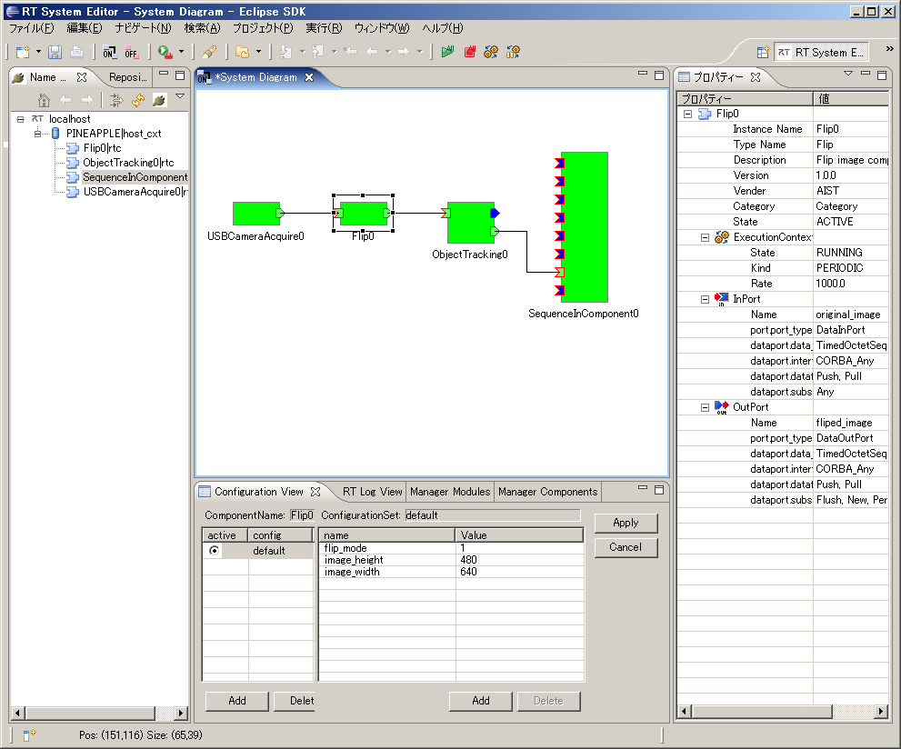</a></div>
<div align="center"><strong>図25. コンポーネントの接続例</strong></div>
<br>
## ObjectTrackingコンポーネントのビルド済みパッケージ 

ビルド済みパッケージを下記からダウンロードできます。

<!-- 拡張子を"zip_"としてますので、"zip"にリネームしてから解凍して下さい。-->

 
- [ビルド済みパッケージ(No Link)](http://www.openrtm.org/OpenRTM-aist/download/ROBOMEC2009/ObjectTracking.zip_)

-------jp page!!-------
