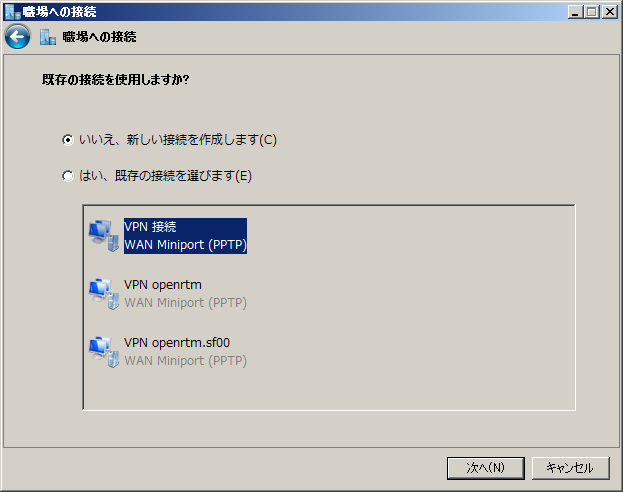
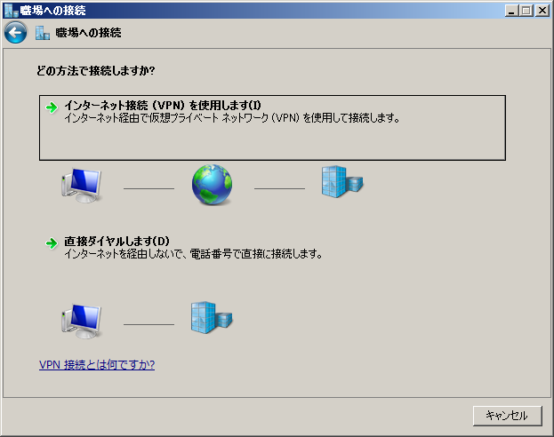
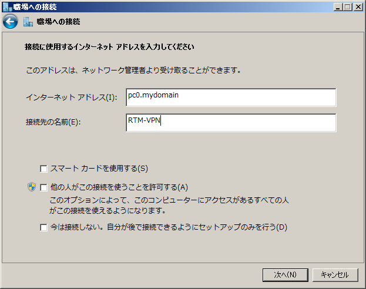
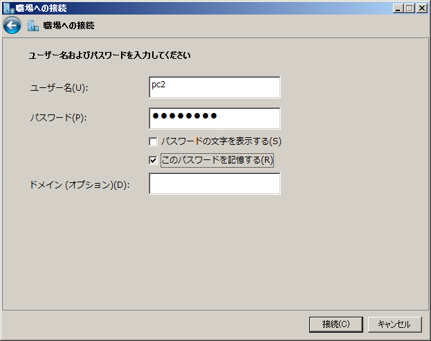
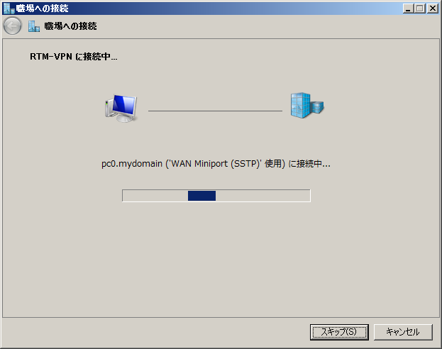

<!-- Title: VPNを利用したRTMネットワーク設定方法 -->
#contents

When using OpenRTM-aist, there may be cases where you want to connect RTCs inside and outside a router, firewall, or NAT.
If you can change the NAT settings yourself, it is also possible to make RTCs inside and outside NAT work together by using the NAT port forwarding function and specifying the [corba.alternate_iiop_addresses](http://www.openrtm.org/openrtm/ja/content/rtcconf_reference_ja#toc23) option in rtc.conf.
However, port forwarding settings are required for each RTC, and this method cannot be used for NATs that you cannot configure yourself or for company or school firewalls.

Therefore, by constructing a virtual network using VPN and performing all communication between RTCs over the VPN, RTCs inside and outside firewalls and similar environments can work together.
This document describes how to construct a VPN virtual network and connect RTCs through it.

## VPN Server Setup (Linux)

### Installing pptpd

First, install the VPN server PPTPD. Packages are provided for Ubuntu, Debian, and similar systems, so you can install it with apt-get as follows.

```
 $ sudo apt-get install pptpd
 [sudo] password for openrtm

 :
 
 Starting PPTP Daemon: pptpd.
```

### Configuring pptpd.conf

Next, edit /etc/pptpd.conf and configure the pptpd server.

```
$ sudo vi /etc/pptpd.conf
```

Open pptpd.conf with an editor such as vi, and set localip and remoteip near the bottom of the configuration file.
In the following example, the last two lines set 192.168.22.1 as localip and 192.168.22.10-100 as remoteip.

```
 [/etc/pptpd.confファイル］
 #localip 192.168.0.1
 #remoteip 192.168.0.234-238,192.168.0.245
 # or
 #localip 192.168.0.234-238,192.168.0.245
 #remoteip 192.168.1.234-238,192.168.1.245
 localip 192.168.22.1
 remoteip 192.168.22.10-100
```

For the addresses set here, basically specify a network and IP addresses that are not currently being used.
In this example, clients connecting from outside are assigned addresses from 192.168.22.10 to 100.


### Network Configuration

Usually, VPN servers are often configured to assign appropriate IP addresses to VPN clients, but when configuring an RTM network, it is easier to configure RTCs if the IP addresses of client PCs are fixed.

Here, the following network settings are assumed for the RTM network.

<table class="table-alt">
  <tr>
    <th>PC name</th>
    <th>IP address</th>
    <th>Remarks</th>
  </tr>
  <tr>
    <td>PC0</td>
    <td>192.168.22.1</td>
    <td>VPN server, CORBA name server</td>
  </tr>
  <tr>
    <td>PC1</td>
    <td>192.168.22.10</td>
    <td>PC on which RTCs run</td>
  </tr>
  <tr>
    <td>PC2</td>
    <td>192.168.22.11</td>
    <td>PC on which RTCs run</td>
  </tr>
  <tr>
    <td>PC3</td>
    <td>192.168.22.12</td>
    <td>PC on which RTCs run</td>
  </tr>
</table>

### Configuring /etc/ppp/chap-secrets

Based on the above network configuration, next set the user IDs and passwords for PPTP connections in the /etc/ppp/chap-secrets file.


```
 $ sudo vi /etc/ppp/chap-secrets
 
 [/etc/ppp/chap-secretsファイル]
 # Secrets for authentication using CHAP
 # client     server     secret               IP addresses
 pc1 pptpd openrtm1 192.168.22.10
 pc2 pptpd openrtm1 192.168.22.11
 pc3 pptpd openrtm1 192.168.22.12
```

Here, pc1, pc2, and pc3 are defined as clients (user IDs), pptpd is set as the server, openrtm1, openrtm2, and openrtm3 are set as the secrets (passwords), and the IP addresses decided above are set as the IP addresses to be assigned to the clients.

### Restarting the Server

After completing the above, restart pptpd.

```
 $ sudo /etc/init.d/pptpd restart
```


## VPN Client Setup (Linux)

Configure the VPN client. For Linux, install pptpd first, just as on the server.

### Creating an Entry

Create the configuration information for connecting to the VPN using the pptpsetup command.

```
 $ sudo pptpsetup --create pc1 --server pc0.mydomain --username pc1 --password openrtm1 --encrypt
```

The meanings of the command arguments are as follows.

- **pc1:** Entry name
- **--server pc0.mydomain:** Specify the VPN server
- **--username pc1:** The user name **pc1** configured above
- **--password openrtm1:** The password **openrtm1** configured above
- ''--encrypt::' Encryption option

### Connecting to the Server

Connect to the VPN server using the pppd command as follows.

```
 $ sudo pppd call pc1
```

This connects to the VPN server. Check whether the IP address is the pc1 address set above (192.168.22.10).

```
 $ ifconfig ppp0
 
 ppp0      Link encap:Point-to-Pointプロトコル  
           inetアドレス:192.168.22.10  P-t-P:192.168.22.1  マスク:255.255.255.255
           UP POINTOPOINT RUNNING NOARP MULTICAST  MTU:1496  メトリック:1
           RXパケット:5 エラー:0 損失:0 オーバラン:0 フレーム:0
           TXパケット:5 エラー:0 損失:0 オーバラン:0 キャリア:0
           衝突(Collisions):0 TXキュー長:3 
           RXバイト:62 (62.0 B)  TXバイト:68 (68.0 B)
```

You can confirm that the IP address 192.168.22.10 set above has been assigned.

### Routing Settings

With the above operations, a VPN tunnel has been created between pc1 and pc0. Therefore, from pc1, pc0 is accessible using the IP address 192.168.22.1.
However, other clients connected to the VPN server cannot be reached. Try pinging PC2 (192.168.22.11) while it is connected to the VPN.

```
 $ ping 192.168.22.11
 PING 192.168.22.11 (192.168.22.11) 56(84) bytes of data.
```

It stops after displaying this. Exit with Ctrl+C.

Set routing so that VPN clients can communicate with each other.

```
 $ sudo route add -net 192.168.22.0 gw 192.168.22.1 netmask 255.255.255.0
```

Ping again to check.

```
 $ ping 192.168.22.11
 PING 192.168.22.11 (192.168.22.11) 56(84) bytes of data.
 64 bytes from 192.168.22.11: icmp_seq=1 ttl=127 time=46.2 ms
 64 bytes from 192.168.22.11: icmp_seq=2 ttl=127 time=32.3 ms
 64 bytes from 192.168.22.11: icmp_seq=3 ttl=127 time=29.8 ms
 ^C
 --- 192.168.22.11 ping statistics ---
 3 packets transmitted, 3 received, 0% packet loss, time 2003ms
 rtt min/avg/max/mdev = 29.868/36.146/46.203/7.185 ms
```

Now you can reach another client as well.

### Disconnecting the VPN

When disconnecting from the VPN, use pkill to kill the pptp process.

```
 $ sudo pkill pptp
```

## VPN Client Setup (Windows)

In Windows, VPN is built in by default, and you can easily set up a VPN using the wizard.

### VPN Setup Wizard

First, open "Network and Sharing Center" from the Control Panel.
Click "Change your networking settings" → "Set up a new connection or network".

<div align="center"><a href="vpn_windows_00.png"></a></div>
<div align="center"><strong>Network and Sharing Center</strong></div>

The following "Set Up a Connection or Network" screen appears. Click [Connect to a workplace] here, then click the [Next] button.

<div align="center"><a href="vpn_windows_01.png"></a></div>
<div align="center"><strong>Set Up a Connection or Network</strong></div>

Next, create a new connection. Select the upper radio button "No, create a new connection" and click the [Next] button.

<div align="center"><a href="vpn_windows_02.png"></a></div>
<div align="center"><strong>Connect to a Workplace (1): Creating a New Connection</strong></div>

Next, choose the connection method. Select VPN here.

<div align="center"><a href="vpn_windows_03.png"></a></div>
<div align="center"><strong>Connect to a Workplace (2): Using VPN</strong></div>

Next, enter the VPN server address and connection name. Enter the VPN server name or IP address. The destination name is a name used to distinguish this connection from others. Here, it is set to RTM-VPN.

<div align="center"><a href="vpn_windows_04.png"></a></div>
<div align="center"><strong>Connect to a Workplace (3): Setting the Server Address</strong></div>

Next, enter the user name and password. Enter the user name and password configured on the server. Here, pc2/openrtm2 is set. Finally, click the [Connect] button to connect.

<div align="center"><a href="vpn_windows_05.png"></a></div>
<div align="center"><strong>Connect to a Workplace (4): Entering the User Name and Password</strong></div>

Connection takes about 10 or more seconds.

<div align="center"><a href="vpn_windows_06.png"></a></div>
<div align="center"><strong>Connect to a Workplace (5): Connecting</strong></div>

When the connection is complete, the following screen appears.

<div align="center"><a href="vpn_windows_07.png"></a></div>
<div align="center"><strong>Connect to a Workplace (6): Connection Complete</strong></div>

### Routing Settings

As in the Linux case described above, routing settings must be configured.

First, open Command Prompt with administrator privileges.
Enter **cmd** in "Search programs and files" in the Start menu and press Ctrl+Shift+Enter.
The entire screen darkens and the User Account Control dialog appears, so click [Yes] to continue.

```
 C:\> route add 192.168.22.0 mask 255.255.255.0 192.168.22.1
```

Use the ipconfig command to confirm that the VPN address is 192.168.22.11.

```
 C:\> ipconfig
```

Furthermore, try pinging another client, pc1.

```
 C:\ ping 192.168.22.11
```

If the ping succeeds, the VPN connection has succeeded.

### Connecting and Disconnecting the VPN

To disconnect the VPN, select "Change adapter settings" on the right side of "Network and Sharing Center".

<div align="center"><a href="vpn_windows_00.png"></a></div>
<div align="center"><strong>Network and Sharing Center</strong></div>

RTM-VPN appears in the list of adapters, and you can disconnect by right-clicking it and selecting "Disconnect".
To connect again, you can also right-click RTM-VPN on this screen and select "Connect".

<div align="center"><a href="vpn_windows_08.png"></a></div>
<div align="center"><strong>Change Adapter Settings</strong></div>

## Settings for RTCs and Other Components

With the above settings, the VPN network has been configured. Next, configure the settings for running RTCs on this network.

### Name Server

The name server is assumed to run on pc0, the same PC as the VPN server.
After connecting to the VPN, restart the name server with the rtm-naming command.

```
 $ rtm-naming
```

### RTC Settings (rtc.conf)


When running RTCs on the VPN server (pc0) or VPN clients (pc1, pc2, pc3), set the endpoint as follows.

```
 [pc0用のrtc.conf]
 corba.nameservers: 192.168.22.1
 corba.endpoints: 192.168.22.1
```
　
```
 [pc1用のrtc.conf]
 corba.nameservers: 192.168.22.1
 corba.endpoints: 192.168.22.10
```
　
```
 [pc2用のrtc.conf]
 corba.nameservers: 192.168.22.1
 corba.endpoints: 192.168.22.11
```
　
```
 [pc3用のrtc.conf]
 corba.nameservers: 192.168.22.1
 corba.endpoints: 192.168.22.12
```

With this, all communication between RTCs is performed through the VPN.

## Performance

When communicating through a VPN connection, performance may be lower than usual.
This section does not describe in detail how to improve performance, but as a simple benchmark, it gives an example of performance when transferring images using a camera component and a viewer component.

- pc0
  - Ubuntu 10.04 x86_64
  - Dell PowerEdge 2900
    - Intel(R) Xeon(R) CPU X5450 @3.00GHz x2
    - Memory 16GB

- pc1
  - Ubuntu 10.04 i386
  - VMware Fusion 6 (on Mac Book Retina 2.7GHz Corei7, 16GB Memory, OS X 10.9)
    - 2.7GHz Corei7 x2
    - Memory 1GB

- pc2
  - Windows7 64bit
  - VMware Fusion 6 (on Mac Book Retina 2.7GHz Corei7, 16GB Memory, OS X 10.9)
    - 2.7GHz Corei7 x2
    - Memory 4GB

<table class="table-alt">
  <tr>
    <th></th>
    <th>Normal</th>
    <th>With encryption</th>
    <th>Without encryption</th>
  </tr>
  <tr>
    <td>pc1->pc2 (VGA)</td>
    <td>8 fps</td>
    <td>0.5 fps</td>
    <td>1.1 fps</td>
  </tr>
  <tr>
    <td>pc2->pc1 (QVGA)</td>
    <td>22 fps</td>
    <td>2.3 fps</td>
    <td>5.8 fps</td>
  </tr>
</table>

There is roughly a twofold difference in speed between the encrypted and unencrypted cases, but in both cases, the speed is about 1/10 to 1/20 compared with normal communication.
There are also reports that Windows VPN is particularly slow, but the details are unknown.

