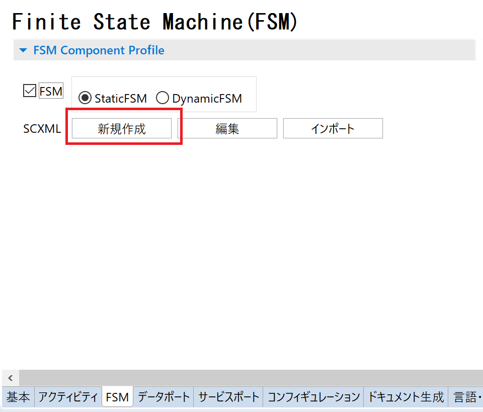
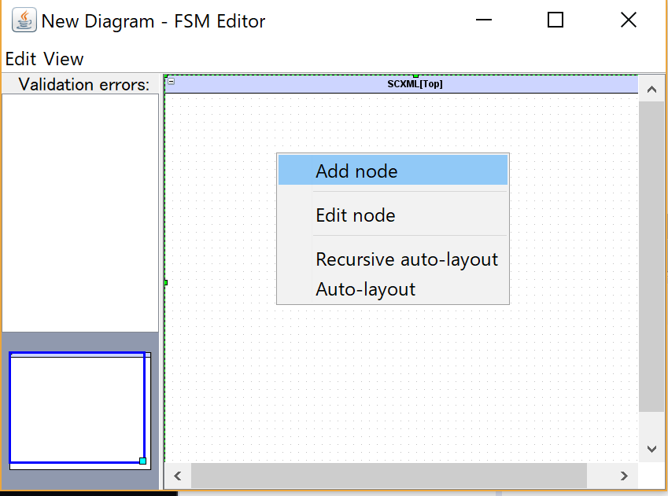
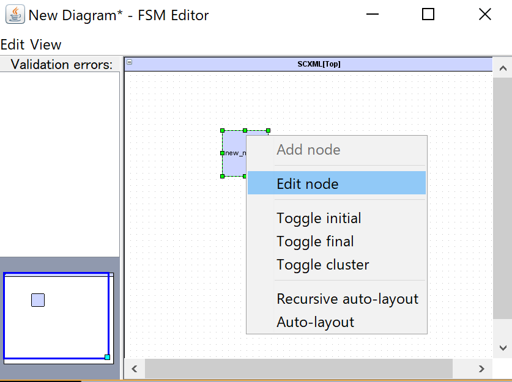
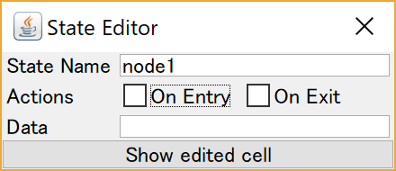
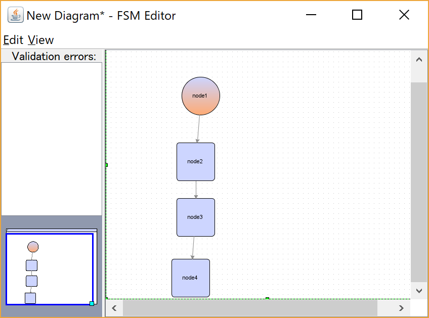
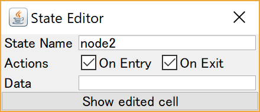
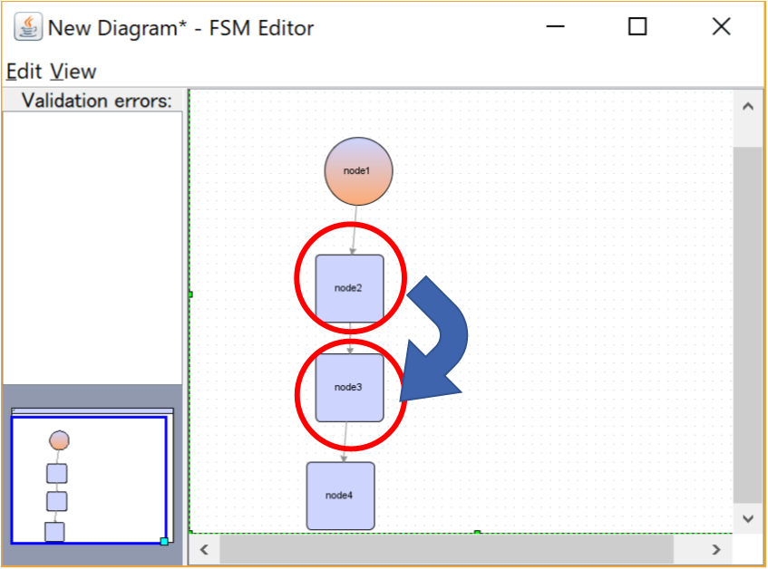
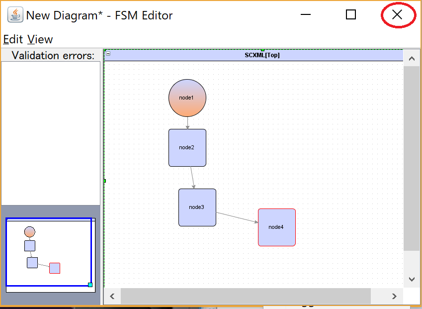
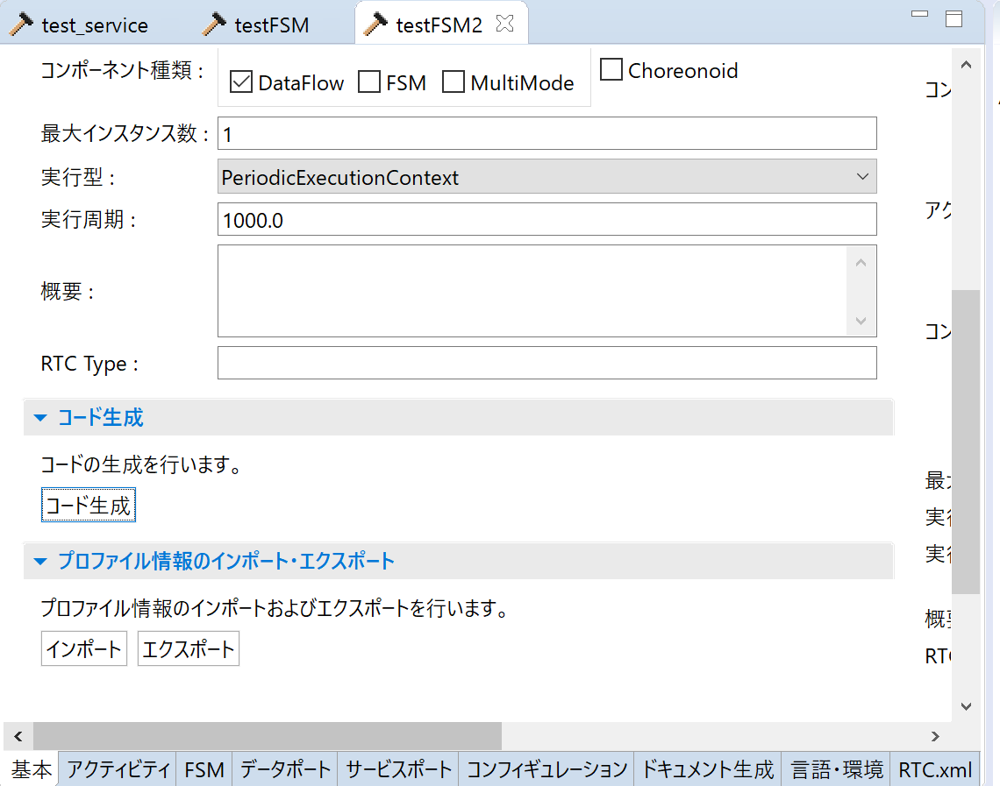

<!-- Title: FSMコンポーネント作成手順 -->
## Code Generation with RTCBuilder

First, create a project, set the module name, and set the language (C++) in the same way as the normal RTC creation procedure.

Next, turn on the FSM checkbox from the FSM tab.
Then press the New button to start the GUI editor.

<div align="center"><a href="fsm1.png"></a></div>


Right-click in the editor that starts and select **Add node**.

<div align="center"><a href="fsm2.png"></a></div>

Right-click the created node and select **Edit node**.

<div align="center"><a href="fsm3.png"></a></div>

Change **State Name** to an appropriate name.

<div align="center"><a href="fsm4.png"></a></div>

Create multiple nodes by following the same procedure.
In the figure below, there are nodes where Toggle Initial and Toggle final are set, but this setting does not seem to change the generated code.

<div align="center"><a href="fsm8.png"></a></div>

For some nodes, turn on **On Entry** and **On Exit**.

<div align="center"><a href="fsm7.png"></a></div>

You can also define state transitions by dragging and dropping from one node to another.

<div align="center"><a href="fsm8-2.png"></a></div>

Close the editor.

<div align="center"><a href="fsm10.png"></a></div>

After that, generate the code.

<div align="center"><a href="fsm11.png"></a></div>


## Building the RTC
OpenRTM-aist 2.0 is required for the build.
Build with OpenRTM-aist by following the procedure below.

- [https://openrtm.org/openrtm/en/content/cmake_build_rtm](https://openrtm.org/openrtm/en/content/cmake_build_rtm)

After that, build the INSTALL project and install it in an appropriate location.
To change the installation location, change the CMAKE_INSTALL_PREFIX option.

Run the following commands in the folder where the RTC code was generated.

```
 mkdir build
 cd build
 set OPENRTM_DIR={directory where OpenRTM-aist is installed}\2.0.0\cmake\
 cmake -G "Visual Studio 15 2017" -A x64 ..
 cmake --build . --config Release
```

## Editing the Code
Under writing

## Operation Check Procedure

