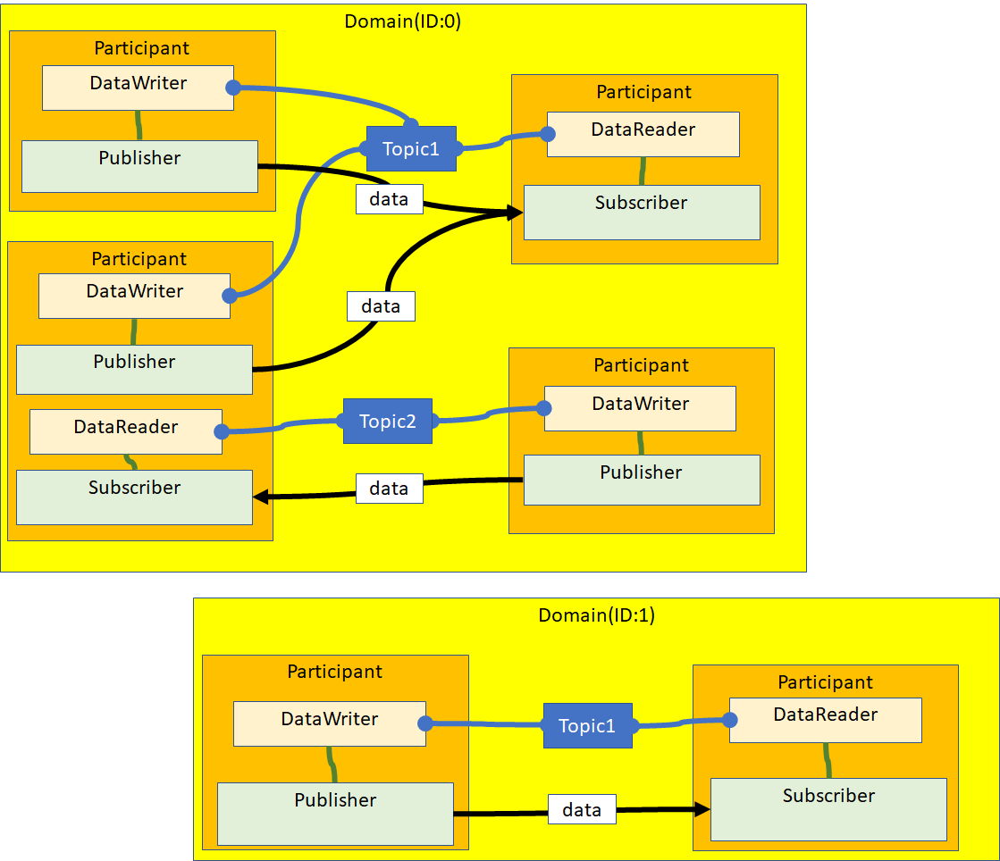
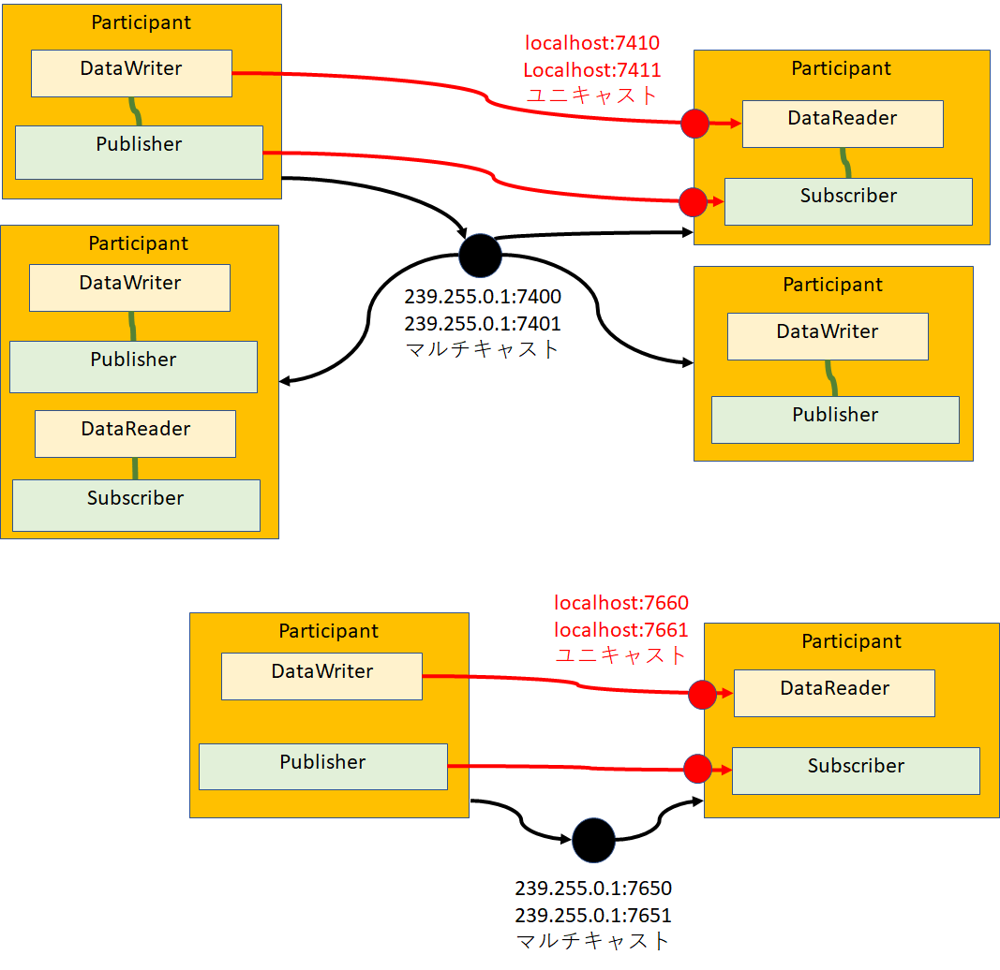

-------jp page!!-------

<!-- Title: DDS通信機能の利用 -->
#contents

DDS(Data Distribution Service)はOMGが策定した出版・購読型モデルの通信ミドルウェア仕様です。
ドメイン内のDomain Participantがデータ配信を行うDDS Publisher、データ受信を行うDDS Subscriberにより他のDomain Participantと相互通信を行います。
Publisherは指定のトピック向けにデータを配信し、Subscriberは指定のトピック向けのデータを受信することができます。

DDSの概念図は上の図のようになっていますが、内部的にはUDP/IPによるマルチキャスト通信とユニキャスト通信によって通信しています。

ParticipantはPDP(Participant Discovery Protocol)で互いのParticipantを検出します。この時、マルチキャスト通信でユニキャストアドレスなどのメッセージを送信します。
次にSEDP(Endpoint Discovery Protocol)でユニキャスト通信によりDataWriterとDataReaderの情報を共有します。トピックとデータ型が一致した場合はエンドポイントが一致していると判定してデータの送受信を開始します。

この他にDDSには通信のQoS(Quality of Service)制御の機能があります。

## 利用可能な実装
現状、以下のDDS実装に対応している。

- [Fast DDS]({{ site.baseurl }}/ja/doc/developersguide/advanced_rt_system_programming/dds_comm_use/fast-rtps)
- [OpenSplice]({{ site.baseurl }}/ja/doc/developersguide/advanced_rt_system_programming/dds_comm_use/opensplice)

-------jp page!!-------
