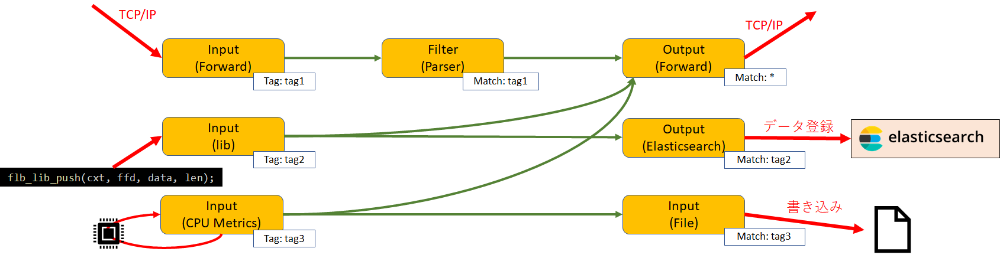
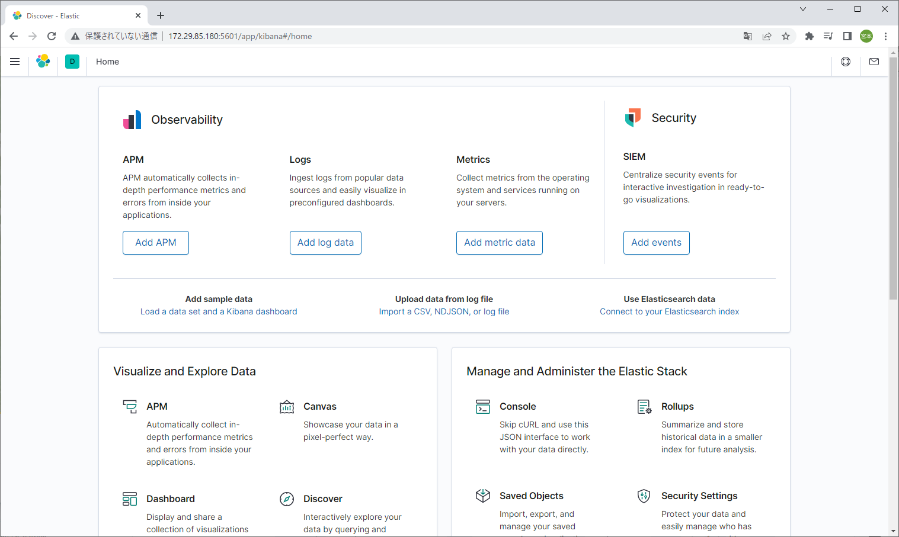
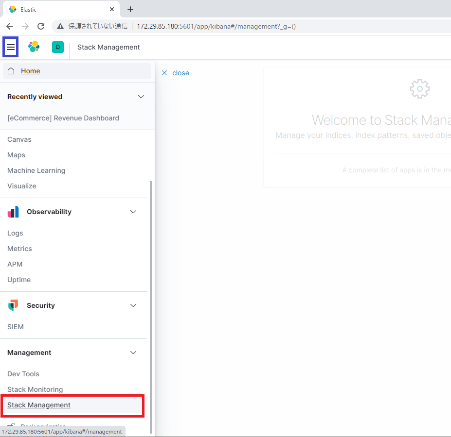
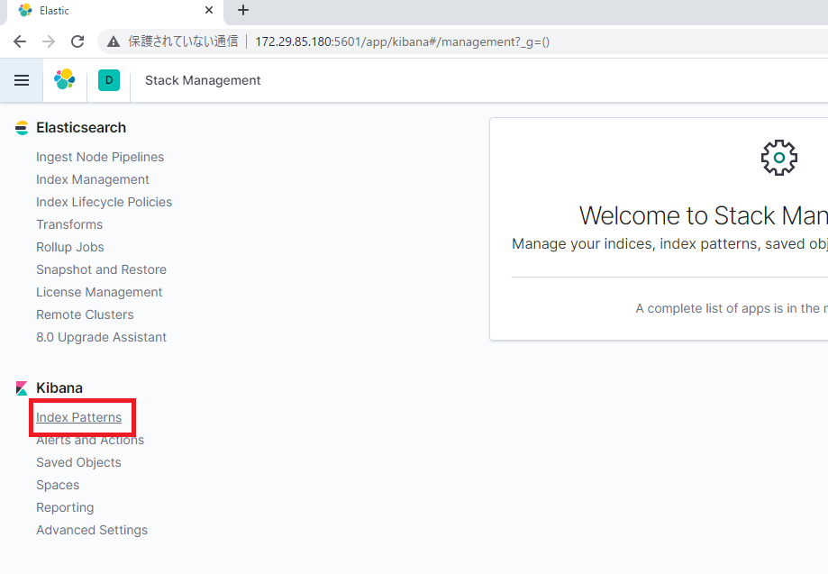
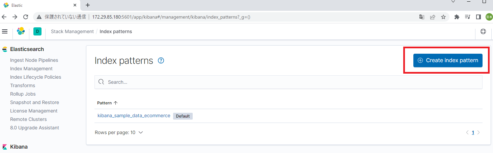
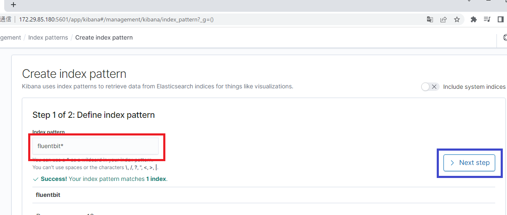
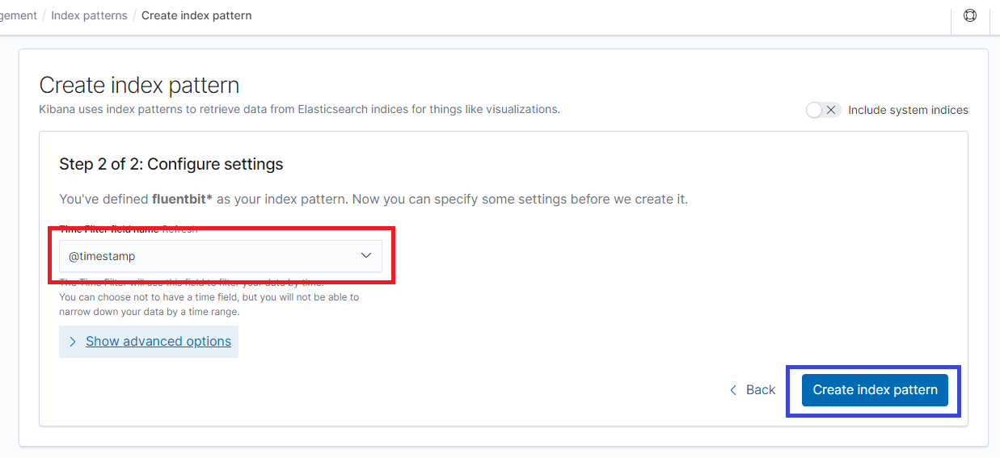
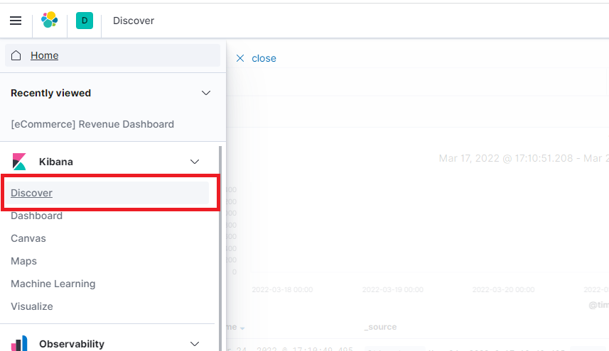
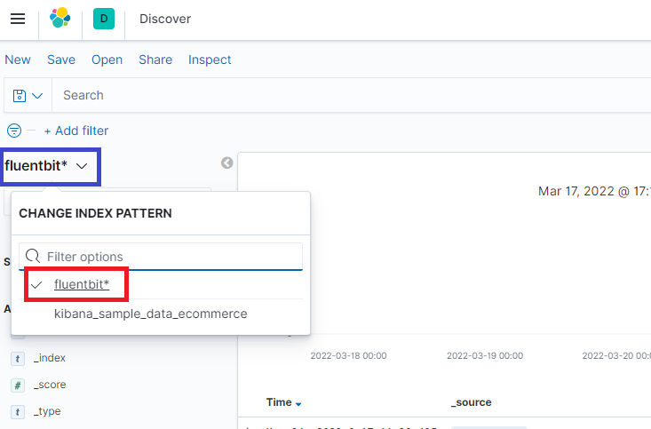
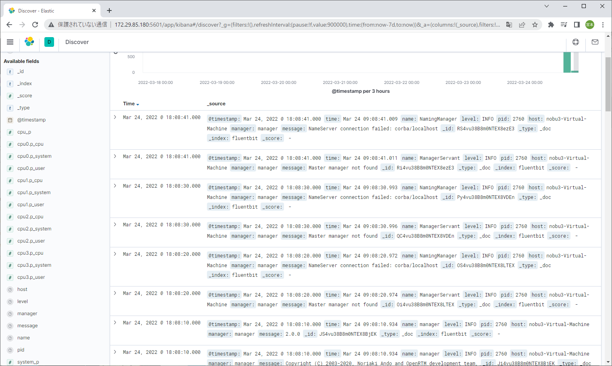

<!-- Title: Fluent Loggerによるログ収集 -->
#contents

Fluentd、Fluent Bitはログの処理や転送を行うオープンソースのソフトウェアライブラリです。

- [fluentd](https://www.fluentd.org/)
- [fluentbit](https://fluentbit.io/)

Fluentd、Fluent Bitはデータを収集するInputプラグイン、データを送信するOutputプラグインを設定できます。
Fluentd、Fluent Bitの概要図は以下のようになっています。

<div align="center"><a href="fluentbit2.png"></a></div>

Inputは外部プロセスから受信、プロセス内部からのログ書き込み、CPU使用率やディスク使用率等を取得するなどで収集したデータをOutputに渡します。
Outputは受け取ったデータを外部プロセスへ送信、ファイルへ書き込み、標準出力等します。
Input、Outputはプラグインとして実装されており、プラグインを変更することでデータの収集方法や送信方法を変更できるため、以下のような様々なデータの収集方法、送信方法を選択できます。

- [Inputs - Fluent Bit: Official Manual](https://docs.fluentbit.io/manual/pipeline/inputs)
- [Outputs - Fluent Bit: Official Manual](https://docs.fluentbit.io/manual/pipeline/outputs)

またInputからOutputにデータを渡す前にFilterでデータの変換、追加、除外等を実行できます。

Inputにはタグが設定でき、Output、Filterにはマッチングルールを設定できます。
Output、Filerはマッチングルールに一致したタグのデータを受け取ることができます。

このページではOpenRTM-aistのFluent Loggerプラグインの使用方法を説明します。

## C++版

### Windows
#### Fluent Bitのインストール

Fluent BitのビルドにBison/Flexが必要なため適当な場所に展開して環境変数PATHに設定します。

- https://sourceforge.net/projects/winflexbison/

set PATH=%WORKDIR%\win_flex_bison-2.5.24;%PATH%


OpenSSLを適当な場所に展開してください。

- [SSLTransportの使用方法]({{ site.baseurl }}/ja/doc/developersguide/advanced_rt_system_programming/ssltransport_use)


Windows用に修正したFluent Bitのソースコードを適当な場所に展開してPowerShellでそのフォルダに移動してください。

- https://github.com/Nobu19800/fluent-bit

PowerShellで以下のコマンドを実行するとFluent Bitをビルドします。

```
 cmake -DFLB_RELEASE=On -DFLB_TRACE=Off -DFLB_SHARED_LIB=On -DFLB_EXAMPLES=Off  -DCMAKE_BUILD_TYPE=Release -DOPENSSL_ROOT_DIR=${OpenSSL_INSTALL_DIR} -DCMAKE_BUILD_TYPE=Release -DCMAKE_INSTALL_PREFIX=${FLUENTBIT_INSTALL_DIR}
 cmake --build . --config Release
 cmake --build . --target install --config Release
```


#### 各種ライブラリのインストール
以下のコマンドで必要なヘッダーファイルをコピーします。

```
 $FLUENTBIT_BUILD_DIR = "${FLUENTBIT_SOURCE_DIR}\build"
```

```
 Copy-Item $FLUENTBIT_SOURCE_DIR\lib\monkey\include\monkey\mk_core\external -destination $FLUENTBIT_INSTALL_DIR\include\monkey\mk_core -recurs
 Copy-Item $FLUENTBIT_SOURCE_DIR\lib\monkey\mk_core\deps\libevent\include\event.h $FLUENTBIT_INSTALL_DIR\include
 Copy-Item $FLUENTBIT_SOURCE_DIR\lib\monkey\mk_core\deps\libevent\include\evutil.h $FLUENTBIT_INSTALL_DIR\include
 Copy-Item $FLUENTBIT_SOURCE_DIR\lib\monkey\mk_core\deps\libevent\include\event2 -destination $FLUENTBIT_INSTALL_DIR\include -recurs
 Copy-Item $FLUENTBIT_BUILD_DIR\lib\monkey\mk_core\deps\libevent\include\event2\event-config.h $FLUENTBIT_INSTALL_DIR\include\event2
 Copy-Item $FLUENTBIT_SOURCE_DIR\lib\msgpack-*\include\msgpack.h $FLUENTBIT_INSTALL_DIR\include
 Copy-Item $FLUENTBIT_SOURCE_DIR\lib\msgpack-*\include\msgpack -destination $FLUENTBIT_INSTALL_DIR\include -recurs
 Copy-Item $FLUENTBIT_SOURCE_DIR\lib\mbedtls-*\include\mbedtls -destination $FLUENTBIT_INSTALL_DIR\include -recurs
 Copy-Item $FLUENTBIT_SOURCE_DIR\lib\c-ares-*\include\*.h $FLUENTBIT_INSTALL_DIR\include
 Copy-Item $FLUENTBIT_BUILD_DIR\lib\c-ares-*\ares_build.h $FLUENTBIT_INSTALL_DIR\include
 Copy-Item $FLUENTBIT_BUILD_DIR\lib\c-ares-*\ares_config.h $FLUENTBIT_INSTALL_DIR\include
 Copy-Item $FLUENTBIT_BUILD_DIR\lib\c-ares-*\ares_config.h $FLUENTBIT_INSTALL_DIR\include
 New-Item $FLUENTBIT_INSTALL_DIR\lib\fluent-bit -ItemType Directory
 Copy-Item $FLUENTBIT_BUILD_DIR\library\Release\fluent-bit.lib $FLUENTBIT_INSTALL_DIR\lib\fluent-bit
 Copy-Item $FLUENTBIT_SOURCE_DIR\lib\cmetrics\include\cmetrics -destination $FLUENTBIT_INSTALL_DIR\include -recurs
 Copy-Item $FLUENTBIT_SOURCE_DIR\lib\cmetrics\include\prometheus_remote_write -destination $FLUENTBIT_INSTALL_DIR\include -recurs
```

#### OpenRTM-aistのビルド

- [OpenRTM-aistのビルド手順]({{ site.baseurl }}/ja/doc/installation/install_2_0/cpp_2_0/build_2_0/openrtm_cpp_cmake_build)

CMake実行時に**FLUENTBIT_ENABLE**、**FLUENTBIT_ROOT**のオプションを設定します。

```
 cmake -DORB_ROOT=$ORB_ROOT -DFLUENTBIT_ENABLE=ON -DFLUENTBIT_ROOT=$FLUENTBIT_INSTALL_DIR -DCMAKE_INSTALL_PREFIX=$OPENRTM_INSTALL_DIR
```

他の手順は通常のビルド手順と同じです。

以下のコマンドでインストールしてください。

```
 cmake --build . --target install --config Release
```

#### 動作確認

td-agent、もしくはtd-agent-bitをインストール、起動する必要があります。

- [ログ収集ソフトウェアのインストール、起動手順]({{ site.baseurl }}/ja/doc/developersguide/advanced_rt_system_programming/fluent_logger_install)


##### RTCの起動


rtc.confで以下のように設定する。tagの名前は適宜変更する。

```
 
 logger.plugins: C:\\Program Files\\OpenRTM-aist\\logger\\2.0.0\\FluentBit.dll
 logger.logstream.fluentd.output0.plugin: forward
 logger.logstream.fluentd.output0.conf.match:*
 
 logger.logstream.fluentd.input0.plugin: lib
 logger.logstream.fluentd.input0.conf.tag: test.simpleio
```

RTCを実行するとログを送信する。

またはOpenRTM-aistに含まれる**rtc.fluentbit_stream.conf**を使用して起動することもできます。

```
 ${OPENRTM_INSTALL_DIR}\2.0.0\Components\C++\Examples\vc16\ConsoleOutComp.exe -f ${OPENRTM_INSTALL_DIR}\2.0.0\ext\logger\rtc.fluentbit_stream.conf
```

### Ubuntu
#### Fluent Bitのインストール

```
 sudo apt install flex bison
 wget https://github.com/fluent/fluent-bit/archive/v1.8.9.tar.gz
 tar xf v1.8.9.tar.gz
 cd fluent-bit-1.8.9/
 sed  -i -e 's/jemalloc-5.2.1\/configure/jemalloc-5.2.1\/configure --disable-initial-exec-tls/g' CMakeLists.txt
 cd build
 cmake .. -DFLB_RELEASE=On -DFLB_TRACE=Off -DFLB_JEMALLOC=On -DFLB_TLS=On -DFLB_SHARED_LIB=On -DFLB_EXAMPLES=Off -DFLB_HTTP_SERVER=On -DFLB_IN_SYSTEMD=On -DFLB_OUT_KAFKA=Off
 cmake --build . --config Release -- -j$(nproc)
 sudo cmake --build . --target install
```

#### 各種ライブラリのインストール
以下のコマンドで必要なヘッダーファイルをコピーします。

```
 export FLUENTBIT_SOURCE_DIR=${WORKSPACE}/fluent-bit-1.8.9
 export FLUENTBIT_BUILD_DIR = ${FLUENTBIT_SOURCE_DIR}/build
 export FLUENTBIT_INSTALL_DIR=/usr/local
```

```
 mkdir -p ${FLUENTBIT_INSTALL_DIR}/include/lib/flb_libco
 cp -r ${FLUENTBIT_SOURCE_DIR}/lib/flb_libco/libco.h ${FLUENTBIT_INSTALL_DIR}/include/lib/flb_libco
 cp -r ${FLUENTBIT_BUILD_DIR}/include/jemalloc ${FLUENTBIT_INSTALL_DIR}/include/
 cp -r ${FLUENTBIT_SOURCE_DIR}/lib/msgpack-*/include/* ${FLUENTBIT_INSTALL_DIR}/include/
 cp -r ${FLUENTBIT_SOURCE_DIR}/lib/monkey/include/monkey ${FLUENTBIT_INSTALL_DIR}/include/
 cp -r ${FLUENTBIT_SOURCE_DIR}/lib/mbedtls-*/include/mbedtls ${FLUENTBIT_INSTALL_DIR}/include/
 cp -r ${FLUENTBIT_SOURCE_DIR}/lib/c-ares-*/include/* ${FLUENTBIT_INSTALL_DIR}/include/
 cp -r ${FLUENTBIT_BUILD_DIR}/lib/c-ares-*/ares_build.h ${FLUENTBIT_INSTALL_DIR}/include/
 cp -r ${FLUENTBIT_BUILD_DIR}/lib/c-ares-*/ares_config.h ${FLUENTBIT_INSTALL_DIR}/include/
 cp -r ${FLUENTBIT_SOURCE_DIR}/lib/cmetrics/include/* ${FLUENTBIT_INSTALL_DIR}/include/
 cp ${FLUENTBIT_SOURCE_DIR}/lib/flb_libco/libco.h ${FLUENTBIT_INSTALL_DIR}/include/
```

#### OpenRTM-aistのビルド

- [OpenRTM-aistのビルド手順]({{ site.baseurl }}/ja/doc/installation/install_2_0/cpp_2_0/build_2_0/openrtm_cpp_cmake_build)

CMake実行時に**FLUENTBIT_ENABLE**、**FLUENTBIT_ROOT**のオプションを設定します。

```
 cmake -DFLUENTBIT_ENABLE=ON -DFLUENTBIT_ROOT=${FLUENTBITINSTALLDIR} ..
```

他の手順は通常のビルド手順と同じです。

以下のコマンドでインストールしてください。

```
 cmake --build . --target install
```

#### 動作確認

td-agent、もしくはtd-agent-bitをインストール、起動する必要があります。

- [ログ収集ソフトウェアのインストール、起動手順]({{ site.baseurl }}/ja/doc/developersguide/advanced_rt_system_programming/fluent_logger_install)


##### RTCの起動


rtc.confで以下のように設定する。tagの名前は適宜変更する。


```
 logger.plugins: /usr/local/lib/openrtm-2.0/logger/FluentBit.so
 logger.logstream.fluentd.output0.plugin: forward
 logger.logstream.fluentd.output0.conf.match:*
 
 logger.logstream.fluentd.input0.plugin: lib
 logger.logstream.fluentd.input0.tag: test.simpleio
```

RTCを実行するとログを送信する。

動作しない場合は/etc/ssl/certsから壊れたリンクを削除する。


またはOpenRTM-aistに含まれる**rtc.fluentbit_stream.conf**を使用して起動することもできます。

```
 ${OPENRTM_INSTALL_DIR}/share/openrtm-2.0/components/c++/examples/ConsoleOutComp -f ${OPENRTM_INSTALL_DIR}/etc/logger/rtc.fluentbit_stream.conf
```

## Python版
Python版のFluent LoggerプラグインはForward Outputのみに対応しています。
別にForward通信を受信するFluentd、Fluent Bitを起動して、処理して他のOutputプラグインで送信するという使い方ができます。

### fluent-logger-pythonのインストール
fluent-logger-pythonのインストールが必要です。

```
 pip install fluent-logger
```

<!-- - https://github.com/fluent/fluent-logger-python/releases -->

<!-- fluent-logger-python-0.9.3.zipを適当な場所に展開して以下のコマンドを実行してください。 -->

<!-- python setup.py install -->

Ubuntuの場合はsudoで実行してください。

### 動作確認
td-agent、もしくはtd-agent-bitをインストールする必要があります。

- [ログ収集ソフトウェアのインストール、起動手順]({{ site.baseurl }}/ja/doc/developersguide/advanced_rt_system_programming/fluent_logger_install)

#### RTCの起動
rtc.confに以下のように記述してRTCを起動するとfluentdにログが送信されます。

```
 manager.modules.load_path: C:\\Python37\\Lib\\site-packages\\OpenRTM_aist\\ext\\logger\\fluentlogger
 logger.plugins: FluentLogger.py
 logger.logstream.fluentd.output0.tag: test.simpleio
```

**manager.modules.load_path**はOpenRTM-aistをインストールしたPythonのパスによって適宜変更してください。
Ubuntuの場合は**/usr/local/lib/python2.7/dist-packages/OpenRTM_aist/ext/logger/fluentlogger**等になります。

fluentdでログは以下のように表示される。

```
 2018-12-26 09:06:18.000000000 +0900 test.simpleio: {"message":"exit","time":"2018-12-26 09:06:18,841","name":"fluent.ec_worker","level":"TRACE"}
```

メッセージの内容、名前、ログを送信した時間、ログレベルが送信される。


## 簡単な動作確認
OpenRTM-aistをビルド、インストールすると、Fluent Loggerプラグインの簡単な動作確認用の設定ファイルがインストールされます。

```
 %RTM_ROOT%\ext\environment-setup.omniorb.vc16.bat
 %RTM_ROOT%\Components\C++\Examples\vc16\ConsoleOutComp.exe -f %RTM_ROOT%\ext\logger\rtc.fluentbit_stream.conf
```

```
 source ${OPENRTM_INSTALL_DIR}/etc/environment-setup.sh
 ${OPENRTM_INSTALL_DIR}/share/openrtm-2.0/components/c++/examples/ConsoleOutComp -f ${OPENRTM_INSTALL_DIR}/etc/logger/rtc.fluentbit_stream.conf
```

## Kibana+Elasticsearchによるログ可視化

[Kibana](https://www.elastic.co/jp/kibana/)はElastic社の開発したデータ可視化ツールです。
分析エンジン[ElasticSearch](https://www.elastic.co/jp/elasticsearch/)と連携してWebブラウザ上でグラフなどのデータ可視化ができるようになります。

OpenRTM-aistのFluent BitプラグインからElasticSearchにログを送信して、Kibanaでデータを可視化する手順を説明します。

### Elasticsearchのインストール
Ubuntu 18.04環境で以下のコマンドによりElasticsearchをインストールします。
Ubuntu 18.04ではElasticsearchのバージョン次第で動作しない場合があるので、こちらで動作を確認した7.8.0をインストールします。

```
 wget -qO - https://artifacts.elastic.co/GPG-KEY-elasticsearch | sudo apt-key add -
 add-apt-repository "deb https://artifacts.elastic.co/packages/7.x/apt stable main"
 sudo apt update
 sudo apt install elasticsearch=7.8.0
 sudo systemctl daemon-reload
 sudo systemctl enable elasticsearch.service
```

**/etc/elasticsearch/elasticsearch.yml**を編集します。

```
 network.bind_host: 0
 discovery.seed_hosts: ["127.0.0.1", "[::1]"]
```


編集後にサービスを再起動します。

```
 sudo systemctl restart elasticsearch.service
```

メモリの不足で起動できない場合は**/etc/elasticesearch/jvm.options**を編集して調節してください。

 -Xms1g
 -Xmx1g


### Kibanaのインストール
以下のコマンドでKibanaをインストールします。Elasticsearchと同じバージョンを指定します。

```
 sudo apt install kibana=7.8.0
 sudo systemctl daemon-reload
 sudo systemctl enable kibana.service
```

また、**/etc/kibana/kibana.yml**に以下の行を追加します。

```
 server.port: 5601
 server.host: "0.0.0.0"
```

**server.host**にNICに設定されたIPアドレスを指定してください。

```
 server.host: "192.168.11.2"
```


サービスを再起動します。

```
 sudo systemctl restart kibana.service
```

### 動作確認

以下のrtc.confを作成してください。

```
 logger.enable: YES
 logger.log_level: INFO
 
 
 logger.plugins: ${OPNRTM_INSTALL_DIR}/lib/openrtm-2.0/logger/FluentBit.so
 
 logger.logstream.fluentd.input.plugin: lib
 logger.logstream.fluentd.input.conf.tag: myRTCs_log
 
 logger.logstream.fluentd.output0.plugin: es
 logger.logstream.fluentd.output0.conf.match: *
 logger.logstream.fluentd.output0.conf.host: 127.0.0.1
 logger.logstream.fluentd.output0.conf.port: 9200
 logger.logstream.fluentd.output0.conf.Index: fluentbit
```

${OPNRTM_INSTALL_DIR}はOpenRTM-aistをインストールしたパスに置き換えてください。
**host**、**port**にElasticsearchのアドレスとポート番号を指定してください。
**Index**や**tag**は任意の文字列を設定します。

このrtc.confを指定してRTCを起動します。

```
 ./share/openrtm-2.0/components/c++/examples/ConsoleOutComp -f rtc.conf
```


次にWebブラウザからKibanaにアクセスしてログを確認します。
**http://127.0.0.1:5601**にアクセスしてください。別の端末からアクセスする場合はIPアドレスを変更してください。


<div align="center"><a href="kibana1.png"></a></div>

可視化するデータのインデックスパターンを設定します。今回の例ではrtc.confでIndexを**fluentbit**に指定しました。
ページが開いたら左上をクリックして表示されたメニューからManagmentの**Stack Management**をクリックしてください。

<div align="center"><a href="kibana2.png"></a></div>

Stack Managementのページの左側の**Index Patterns**をクリックします。

<div align="center"><a href="kibana3.png"></a></div>

Index patternsのページの**Create Index pattern**ボタンを押します。

<div align="center"><a href="kibana4.png"></a></div>

Create index patternのページでIndex patternを**fluentbit***に指定してNext stepボタンを押します。

<div align="center"><a href="kibana5.png"></a></div>

Step 2でTime Filter field nameは**@timestamp**のままCreate index patternボタンを押します。

<div align="center"><a href="kibana6.png"></a></div>

ここからはデータを確認します。
ページ左上をクリックして、メニューからKibanaの**Discover**をクリックしてください。

<div align="center"><a href="kibana7.png"></a></div>

Discoverの画面で左側にインデックスパターンが表示されているため、インデックスパターンをクリックして先ほど設定した**fluentbit***に切り替えます。

<div align="center"><a href="kibana8.png"></a></div>

これでログの一覧が確認できます。グラフなどで利用する手順についてはKibanaのマニュアルなどを参考にしてください。

<div align="center"><a href="kibana9.png"></a></div>


### Pythonで動作確認
OpenRTM-aist Python版で動作確認する場合はElasticsearch Loggerプラグインを使用します。
まずはelasticsearchのPythonライブラリ、ECSentbit:https://fluentbit.io/]]

Fluentd、Fluent Bitはデータを収集するInputプラグイン、データを送信するOutputプラグインを設定できます。
Fluentd、Fluent Bitの概要図は以下のようになっています。

<div align="center"><a href="fluentbit2.png"></a></div>

Inputは外部プロセスから受信、プロセス内部からのログ書き込み、CPU使用率やディスク使用率等を取得するなどで収集したデータをOutputに渡します。
Outputは受け取ったデータを外部プロセスへ送信、ファイルへ書き込み、標準出力等します。
Input、Outputはプラグインとして実装されており、プラグインを変更することでデータの収集方法や送信方法を変更できるため、以下のような様々なデータの収集方法、送信方法を選択できます。

- [Inputs - Fluent Bit: Official Manual](https://docs.fluentbit.io/manual/pipeline/inputs)
- [Outputs - Fluent Bit: Official Manual](https://docs.fluentbit.io/manual/pipeline/outputs)

またInputからOutputにデータを渡す前にFilterでデータの変換、追加、除外等を実行できます。

Inputにはタグが設定でき、Output、Filterにはマッチングルールを設定できます。
Output、Filerはマッチングルールに一致したタグのデータを受け取ることができます。

このページではOpenRTM-aistのFluent Loggerプラグインの使用方法を説明します。

## C++版

### Windows
#### Fluent Bitのインストール

Fluent BitのビルドにBison/Flexが必要なため適当な場所に展開して環境変数PATHに設定します。

- https://sourceforge.net/projects/winflexbison/

set PATH=%WORKDIR%\win_flex_bison-2.5.24;%PATH%


OpenSSLを適当な場所に展開してください。

- [SSLTransportの使用方法]({{ site.baseurl }}/ja/doc/developersguide/advanced_rt_system_programming/ssltransport_use)


Windows用に修正したFluent Bitのソースコードを適当な場所に展開してPowerShellでそのフォルダに移動してください。

- https://github.com/Nobu19800/fluent-bit

PowerShellで以下のコマンドを実行するとFluent Bitをビルドします。

```
 cmake -DFLB_RELEASE=On -DFLB_TRACE=Off -DFLB_SHARED_LIB=On -DFLB_EXAMPLES=Off  -DCMAKE_BUILD_TYPE=Release -DOPENSSL_ROOT_DIR=${OpenSSL_INSTALL_DIR} -DCMAKE_BUILD_TYPE=Release -DCMAKE_INSTALL_PREFIX=${FLUENTBIT_INSTALL_DIR}
 cmake --build . --config Release
 cmake --build . --target install --config Release
```


#### 各種ライブラリのインストール
以下のコマンドで必要なヘッダーファイルをコピーします。

```
 $FLUENTBIT_BUILD_DIR = "${FLUENTBIT_SOURCE_DIR}\build"
```

```
 Copy-Item $FLUENTBIT_SOURCE_DIR\lib\monkey\include\monkey\mk_core\external -destination $FLUENTBIT_INSTALL_DIR\include\monkey\mk_core -recurs
 Copy-Item $FLUENTBIT_SOURCE_DIR\lib\monkey\mk_core\deps\libevent\include\event.h $FLUENTBIT_INSTALL_DIR\include
 Copy-Item $FLUENTBIT_SOURCE_DIR\lib\monkey\mk_core\deps\libevent\include\evutil.h $FLUENTBIT_INSTALL_DIR\include
 Copy-Item $FLUENTBIT_SOURCE_DIR\lib\monkey\mk_core\deps\libevent\include\event2 -destination $FLUENTBIT_INSTALL_DIR\include -recurs
 Copy-Item $FLUENTBIT_BUILD_DIR\lib\monkey\mk_core\deps\libevent\include\event2\event-config.h $FLUENTBIT_INSTALL_DIR\include\event2
 Copy-Item $FLUENTBIT_SOURCE_DIR\lib\msgpack-*\include\msgpack.h $FLUENTBIT_INSTALL_DIR\include
 Copy-Item $FLUENTBIT_SOURCE_DIR\lib\msgpack-*\include\msgpack -destination $FLUENTBIT_INSTALL_DIR\include -recurs
 Copy-Item $FLUENTBIT_SOURCE_DIR\lib\mbedtls-*\include\mbedtls -destination $FLUENTBIT_INSTALL_DIR\include -recurs
 Copy-Item $FLUENTBIT_SOURCE_DIR\lib\c-ares-*\include\*.h $FLUENTBIT_INSTALL_DIR\include
 Copy-Item $FLUENTBIT_BUILD_DIR\lib\c-ares-*\ares_build.h $FLUENTBIT_INSTALL_DIR\include
 Copy-Item $FLUENTBIT_BUILD_DIR\lib\c-ares-*\ares_config.h $FLUENTBIT_INSTALL_DIR\include
 Copy-Item $FLUENTBIT_BUILD_DIR\lib\c-ares-*\ares_config.h $FLUENTBIT_INSTALL_DIR\include
 New-Item $FLUENTBIT_INSTALL_DIR\lib\fluent-bit -ItemType Directory
 Copy-Item $FLUENTBIT_BUILD_DIR\library\Release\fluent-bit.lib $FLUENTBIT_INSTALL_DIR\lib\fluent-bit
 Copy-Item $FLUENTBIT_SOURCE_DIR\lib\cmetrics\include\cmetrics -destination $FLUENTBIT_INSTALL_DIR\include -recurs
 Copy-Item $FLUENTBIT_SOURCE_DIR\lib\cmetrics\include\prometheus_remote_write -destination $FLUENTBIT_INSTALL_DIR\include -recurs
```

#### OpenRTM-aistのビルド

- [OpenRTM-aistのビルド手順]({{ site.baseurl }}/ja/doc/installation/install_2_0/cpp_2_0/build_2_0/openrtm_cpp_cmake_build)

CMake実行時に**FLUENTBIT_ENABLE**、**FLUENTBIT_ROOT**のオプションを設定します。

```
 cmake -DORB_ROOT=$ORB_ROOT -DFLUENTBIT_ENABLE=ON -DFLUENTBIT_ROOT=$FLUENTBIT_INSTALL_DIR -DCMAKE_INSTALL_PREFIX=$OPENRTM_INSTALL_DIR
```

他の手順は通常のビルド手順と同じです。

以下のコマンドでインストールしてください。

```
 cmake --build . --target install --config Release
```

#### 動作確認

td-agent、もしくはtd-agent-bitをインストール、起動する必要があります。

- [ログ収集ソフトウェアのインストール、起動手順]({{ site.baseurl }}/ja/doc/developersguide/advanced_rt_system_programming/fluent_logger_install)


##### RTCの起動


rtc.confで以下のように設定する。tagの名前は適宜変更する。

```
 
 logger.plugins: C:\\Program Files\\OpenRTM-aist\\logger\\2.0.0\\FluentBit.dll
 logger.logstream.fluentd.output0.plugin: forward
 logger.logstream.fluentd.output0.conf.match:*
 
 logger.logstream.fluentd.input0.plugin: lib
 logger.logstream.fluentd.input0.conf.tag: test.simpleio
```

RTCを実行するとログを送信する。

またはOpenRTM-aistに含まれる**rtc.fluentbit_stream.conf**を使用して起動することもできます。

```
 ${OPENRTM_INSTALL_DIR}\2.0.0\Components\C++\Examples\vc16\ConsoleOutComp.exe -f ${OPENRTM_INSTALL_DIR}\2.0.0\ext\logger\rtc.fluentbit_stream.conf
```

### Ubuntu
#### Fluent Bitのインストール

```
 sudo apt install flex bison
 wget https://github.com/fluent/fluent-bit/archive/v1.8.9.tar.gz
 tar xf v1.8.9.tar.gz
 cd fluent-bit-1.8.9/
 sed  -i -e 's/jemalloc-5.2.1\/configure/jemalloc-5.2.1\/configure --disable-initial-exec-tls/g' CMakeLists.txt
 cd build
 cmake .. -DFLB_RELEASE=On -DFLB_TRACE=Off -DFLB_JEMALLOC=On -DFLB_TLS=On -DFLB_SHARED_LIB=On -DFLB_EXAMPLES=Off -DFLB_HTTP_SERVER=On -DFLB_IN_SYSTEMD=On -DFLB_OUT_KAFKA=Off
 cmake --build . --config Release -- -j$(nproc)
 sudo cmake --build . --target install
```

#### 各種ライブラリのインストール
以下のコマンドで必要なヘッダーファイルをコピーします。

```
 export FLUENTBIT_SOURCE_DIR=${WORKSPACE}/fluent-bit-1.8.9
 export FLUENTBIT_BUILD_DIR = ${FLUENTBIT_SOURCE_DIR}/build
 export FLUENTBIT_INSTALL_DIR=/usr/local
```

```
 mkdir -p ${FLUENTBIT_INSTALL_DIR}/include/lib/flb_libco
 cp -r ${FLUENTBIT_SOURCE_DIR}/lib/flb_libco/libco.h ${FLUENTBIT_INSTALL_DIR}/include/lib/flb_libco
 cp -r ${FLUENTBIT_BUILD_DIR}/include/jemalloc ${FLUENTBIT_INSTALL_DIR}/include/
 cp -r ${FLUENTBIT_SOURCE_DIR}/lib/msgpack-*/include/* ${FLUENTBIT_INSTALL_DIR}/include/
 cp -r ${FLUENTBIT_SOURCE_DIR}/lib/monkey/include/monkey ${FLUENTBIT_INSTALL_DIR}/include/
 cp -r ${FLUENTBIT_SOURCE_DIR}/lib/mbedtls-*/include/mbedtls ${FLUENTBIT_INSTALL_DIR}/include/
 cp -r ${FLUENTBIT_SOURCE_DIR}/lib/c-ares-*/include/* ${FLUENTBIT_INSTALL_DIR}/include/
 cp -r ${FLUENTBIT_BUILD_DIR}/lib/c-ares-*/ares_build.h ${FLUENTBIT_INSTALL_DIR}/include/
 cp -r ${FLUENTBIT_BUILD_DIR}/lib/c-ares-*/ares_config.h ${FLUENTBIT_INSTALL_DIR}/include/
 cp -r ${FLUENTBIT_SOURCE_DIR}/lib/cmetrics/include/* ${FLUENTBIT_INSTALL_DIR}/include/
 cp ${FLUENTBIT_SOURCE_DIR}/lib/flb_libco/libco.h ${FLUENTBIT_INSTALL_DIR}/include/
```

#### OpenRTM-aistのビルド

- [OpenRTM-aistのビルド手順]({{ site.baseurl }}/ja/doc/installation/install_2_0/cpp_2_0/build_2_0/openrtm_cpp_cmake_build)

CMake実行時に**FLUENTBIT_ENABLE**、**FLUENTBIT_ROOT**のオプションを設定します。

```
 cmake -DFLUENTBIT_ENABLE=ON -DFLUENTBIT_ROOT=${FLUENTBITINSTALLDIR} ..
```

他の手順は通常のビルド手順と同じです。

以下のコマンドでインストールしてください。

```
 cmake --build . --target install
```

#### 動作確認

td-agent、もしくはtd-agent-bitをインストール、起動する必要があります。

- [ログ収集ソフトウェアのインストール、起動手順]({{ site.baseurl }}/ja/doc/developersguide/advanced_rt_system_programming/fluent_logger_install)


##### RTCの起動


rtc.confで以下のように設定する。tagの名前は適宜変更する。


```
 logger.plugins: /usr/local/lib/openrtm-2.0/logger/FluentBit.so
 logger.logstream.fluentd.output0.plugin: forward
 logger.logstream.fluentd.output0.conf.match:*
 
 logger.logstream.fluentd.input0.plugin: lib
 logger.logstream.fluentd.input0.tag: test.simpleio
```

RTCを実行するとログを送信する。

動作しない場合は/etc/ssl/certsから壊れたリンクを削除する。


またはOpenRTM-aistに含まれる**rtc.fluentbit_stream.conf**を使用して起動することもできます。

```
 ${OPENRTM_INSTALL_DIR}/share/openrtm-2.0/components/c++/examples/ConsoleOutComp -f ${OPENRTM_INSTALL_DIR}/etc/logger/rtc.fluentbit_stream.conf
```

## Python版
Python版のFluent LoggerプラグインはForward Outputのみに対応しています。
別にForward通信を受信するFluentd、Fluent Bitを起動して、処理して他のOutputプラグインで送信するという使い方ができます。

### fluent-logger-pythonのインストール
fluent-logger-pythonのインストールが必要です。

```
 pip install fluent-logger
```

<!-- - https://github.com/fluent/fluent-logger-python/releases -->

<!-- fluent-logger-python-0.9.3.zipを適当な場所に展開して以下のコマンドを実行してください。 -->

<!-- python setup.py install -->

Ubuntuの場合はsudoで実行してください。

### 動作確認
td-agent、もしくはtd-agent-bitをインストールする必要があります。

- [ログ収集ソフトウェアのインストール、起動手順]({{ site.baseurl }}/ja/doc/developersguide/advanced_rt_system_programming/fluent_logger_install)

#### RTCの起動
rtc.confに以下のように記述してRTCを起動するとfluentdにログが送信されます。

```
 manager.modules.load_path: C:\\Python37\\Lib\\site-packages\\OpenRTM_aist\\ext\\logger\\fluentlogger
 logger.plugins: FluentLogger.py
 logger.logstream.fluentd.output0.tag: test.simpleio
```

**manager.modules.load_path**はOpenRTM-aistをインストールしたPythonのパスによって適宜変更してください。
Ubuntuの場合は**/usr/local/lib/python2.7/dist-packages/OpenRTM_aist/ext/logger/fluentlogger**等になります。

fluentdでログは以下のように表示される。

```
 2018-12-26 09:06:18.000000000 +0900 test.simpleio: {"message":"exit","time":"2018-12-26 09:06:18,841","name":"fluent.ec_worker","level":"TRACE"}
```

メッセージの内容、名前、ログを送信した時間、ログレベルが送信される。


## 簡単な動作確認
OpenRTM-aistをビルド、インストールすると、Fluent Loggerプラグインの簡単な動作確認用の設定ファイルがインストールされます。

```
 %RTM_ROOT%\ext\environment-setup.omniorb.vc16.bat
 %RTM_ROOT%\Components\C++\Examples\vc16\ConsoleOutComp.exe -f %RTM_ROOT%\ext\logger\rtc.fluentbit_stream.conf
```

```
 source ${OPENRTM_INSTALL_DIR}/etc/environment-setup.sh
 ${OPENRTM_INSTALL_DIR}/share/openrtm-2.0/components/c++/examples/ConsoleOutComp -f ${OPENRTM_INSTALL_DIR}/etc/logger/rtc.fluentbit_stream.conf
```

## Kibana+Elasticsearchによるログ可視化

[Kibana](https://www.elastic.co/jp/kibana/)はElastic社の開発したデータ可視化ツールです。
分析エンジン[ElasticSearch](https://www.elastic.co/jp/elasticsearch/)と連携してWebブラウザ上でグラフなどのデータ可視化ができるようになります。

OpenRTM-aistのFluent BitプラグインからElasticSearchにログを送信して、Kibanaでデータを可視化する手順を説明します。

### Elasticsearchのインストール
Ubuntu 18.04環境で以下のコマンドによりElasticsearchをインストールします。
Ubuntu 18.04ではElasticsearchのバージョン次第で動作しない場合があるので、こちらで動作を確認した7.8.0をインストールします。

```
 wget -qO - https://artifacts.elastic.co/GPG-KEY-elasticsearch | sudo apt-key add -
 add-apt-repository "deb https://artifacts.elastic.co/packages/7.x/apt stable main"
 sudo apt update
 sudo apt install elasticsearch=7.8.0
 sudo systemctl daemon-reload
 sudo systemctl enable elasticsearch.service
```

**/etc/elasticsearch/elasticsearch.yml**を編集します。

```
 network.bind_host: 0
 discovery.seed_hosts: ["127.0.0.1", "[::1]"]
```


編集後にサービスを再起動します。

```
 sudo systemctl restart elasticsearch.service
```

メモリの不足で起動できない場合は**/etc/elasticesearch/jvm.options**を編集して調節してください。

 -Xms1g
 -Xmx1g


### Kibanaのインストール
以下のコマンドでKibanaをインストールします。Elasticsearchと同じバージョンを指定します。

```
 sudo apt install kibana=7.8.0
 sudo systemctl daemon-reload
 sudo systemctl enable kibana.service
```

また、**/etc/kibana/kibana.yml**に以下の行を追加します。

```
 server.port: 5601
 server.host: "0.0.0.0"
```

**server.host**にNICに設定されたIPアドレスを指定してください。

```
 server.host: "192.168.11.2"
```


サービスを再起動します。

```
 sudo systemctl restart kibana.service
```

### 動作確認

以下のrtc.confを作成してください。

```
 logger.enable: YES
 logger.log_level: INFO
 
 
 logger.plugins: ${OPNRTM_INSTALL_DIR}/lib/openrtm-2.0/logger/FluentBit.so
 
 logger.logstream.fluentd.input.plugin: lib
 logger.logstream.fluentd.input.conf.tag: myRTCs_log
 
 logger.logstream.fluentd.output0.plugin: es
 logger.logstream.fluentd.output0.conf.match: *
 logger.logstream.fluentd.output0.conf.host: 127.0.0.1
 logger.logstream.fluentd.output0.conf.port: 9200
 logger.logstream.fluentd.output0.conf.Index: fluentbit
```

${OPNRTM_INSTALL_DIR}はOpenRTM-aistをインストールしたパスに置き換えてください。
**host**、**port**にElasticsearchのアドレスとポート番号を指定してください。
**Index**や**tag**は任意の文字列を設定します。

このrtc.confを指定してRTCを起動します。

```
 ./share/openrtm-2.0/components/c++/examples/ConsoleOutComp -f rtc.conf
```


次にWebブラウザからKibanaにアクセスしてログを確認します。
**http://127.0.0.1:5601**にアクセスしてください。別の端末からアクセスする場合はIPアドレスを変更してください。


<div align="center"><a href="kibana1.png"></a></div>

可視化するデータのインデックスパターンを設定します。今回の例ではrtc.confでIndexを**fluentbit**に指定しました。
ページが開いたら左上をクリックして表示されたメニューからManagmentの**Stack Management**をクリックしてください。

<div align="center"><a href="kibana2.png"></a></div>

Stack Managementのページの左側の**Index Patterns**をクリックします。

<div align="center"><a href="kibana3.png"></a></div>

Index patternsのページの**Create Index pattern**ボタンを押します。

<div align="center"><a href="kibana4.png"></a></div>

Create index patternのページでIndex patternを**fluentbit***に指定してNext stepボタンを押します。

<div align="center"><a href="kibana5.png"></a></div>

Step 2でTime Filter field nameは**@timestamp**のままCreate index patternボタンを押します。

<div align="center"><a href="kibana6.png"></a></div>

ここからはデータを確認します。
ページ左上をクリックして、メニューからKibanaの**Discover**をクリックしてください。

<div align="center"><a href="kibana7.png"></a></div>

Discoverの画面で左側にインデックスパターンが表示されているため、インデックスパターンをクリックして先ほど設定した**fluentbit***に切り替えます。

<div align="center"><a href="kibana8.png"></a></div>

これでログの一覧が確認できます。グラフなどで利用する手順についてはKibanaのマニュアルなどを参考にしてください。

<div align="center"><a href="kibana9.png"></a></div>


### Pythonで動作確認
OpenRTM-aist Python版で動作確認する場合はElasticsearch Loggerプラグインを使用します。
まずはelasticsearchのPythonライブラリ、ECSフォーマッタ をインストールします。elasticsearchのバージョンには注意してください。

```
 pip install elasticsearch==7.8.0
 pip install ecs-logging
```

以下のようなrtc.confを用意して**ESLogger.py**をロードしてください。

```
 logger.enable: YES
 logger.log_level: PARANOID
 
 logger.plugins: C:\\Python37\\Lib\\site-packages\\OpenRTM_aist\\ext\\logger\\eslogger\\ESLogger.py
 
 logger.logstream.elasticsearch.output0.host: 127.0.0.1
 logger.logstream.elasticsearch.output0.port: 9200
 logger.logstream.elasticsearch.output0.index: fluentbit
```

接続先のElasticsearchサーバーのアドレス、ポート番号、データを登録するインデックスを指定してください。

このrtc.confを指定してRTCを起動します。

```
 ConsoleOut.py -f rtc.conf
```

