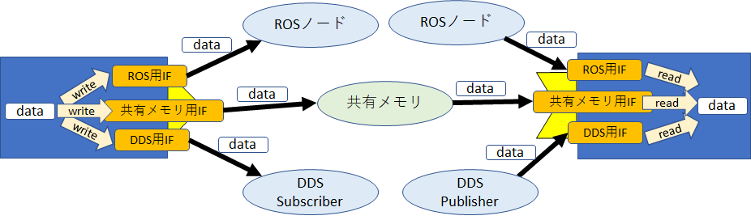
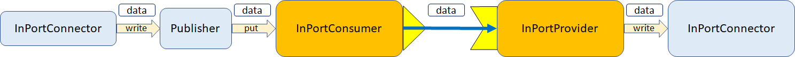
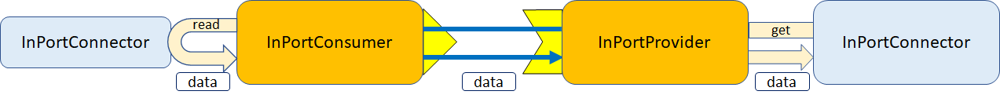

-------jp page!!-------

<!-- Title: データポートの独自インターフェース型の実装手順 -->
#contents

OpenRTM-aistのデータポートは基本的にCORBAのメソッド呼び出しでデータを転送しますが、通信インターフェースのプラグインを追加することで様々な通信プロトコルを選択可能になります。

 

 

このページでは独自通信インターフェースの追加方法を説明します。
以下の独自シリアライザ作成方法も参考にしてください。

- [独自シリアライザの実装手順]({{ site.baseurl }}/ja/doc/developersguide/advanced_rt_system_programming/implement_original_serializer)

OpenRTM-aistにはデータフロー型がPush型の通信とPull型の通信、まだ実装中ですが双方向通信のduplex型があります。
Push型通信は**InPortConsumer**、**InPortProvider**で構成されており、Pull型通信は**OutPortConsumer**、**OutPortProvider**で構成されています。

Push型通信ではOutPort側でPublisherがInPortConsumerの**put**関数を呼び出して、put関数内でInPortProviderへデータを転送します。
InPortProviderではInPortConnectorオブジェクトのwrite関数を呼んでデータを追加します。

 

 

Pull型通信ではInPort側でOutPortConsumerの**get**関数を呼び出して、get関数内でOutPortProviderからデータを取得します。
OutPort側でOutPortProviderがOutPortConnectorのread関数を呼んでデータを取得してOutPortConsumerに渡します。

 

 

このため、Push型通信のためのInPortConsumer、InPortProvider、もしくはPull型通信のためのOutPortConsumer、OutPortProviderを実装することで独自の通信インターフェースが実現できます。

以下に独自インターフェース型の実装手順を記載します。

- [独自インターフェース型の実装手順(C++)]({{ site.baseurl }}/ja/doc/developersguide/advanced_rt_system_programming/implement_dataport_interface_type/cpp/)
- [独自インターフェース型の実装手順(Python)]({{ site.baseurl }}/ja/doc/developersguide/advanced_rt_system_programming/implement_dataport_interface_type/python/)
- [独自インターフェース型の実装手順(Java)]({{ site.baseurl }}/ja/doc/developersguide/advanced_rt_system_programming/implement_dataport_interface_type/java/)
-------jp page!!-------
