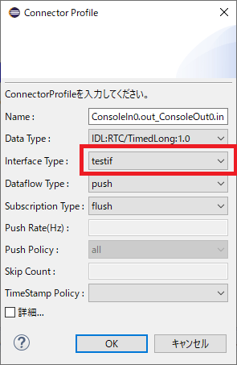

-------jp page!!-------

<!-- Title: 独自インターフェース型の実装手順(Python) -->
#contents

このページではPythonで独自インターフェースを作成する手順を説明します。

以下のソースコードのサンプルでは重要でない部分は省略しているため、詳細なソースコードは以下から取得してください。

- [(https://github.com/Nobu19800/openrtm_testinterface](https://github.com/Nobu19800/openrtm_testinterface)

### Push型通信
Push型通信実装のためにTestInPortConsumer(InPortConsumer)、TestInPortProvider(InPortProvider)を実装します。

#### InPortConsumerの実装
まず以下のようなPythonファイル(TestInPortConsumer.py)を用意します。

```
 #!/usr/bin/env python3
 # -*- coding: utf-8 -*-
 
 
 import OpenRTM_aist
 
 
 class TestInPortConsumer(
        OpenRTM_aist.InPortConsumer):
    
    def __init__(self):
        pass
 
    def __del__(self):
        pass
 
    def init(self, prop):
        if not prop.propertyNames():
            return
 
 
    def put(self, data):
            return self.PORT_OK
 
    def publishInterfaceProfile(self, properties):
        pass
 
    def subscribeInterface(self, properties):
        return True
 
    def unsubscribeInterface(self, properties):
        pass
     
    
 def TestInPortConsumerInit():
    factory = OpenRTM_aist.InPortConsumerFactory.instance()
    factory.addFactory("testif",
                       TestInPortConsumer)
```


今回はここにファイルの読み書きでデータを転送する独自インターフェースを実装します。

まずコネクタの初期化時に**init**関数が呼ばれます。
変数**prop**にはRTSystemEditor等で設定したコネクタの接続情報が格納されています。
以下の例ではpropからtestif.filenameのパラメータを取得してファイル名に設定しています。
init関数は複数回呼ばれる可能性があるので、その点は注意する必要があります。

```
    def init(self, prop):
        if not prop.propertyNames():
            return
        self._filename = prop.getProperty("testif.filename", "test.dat")
```


データの書き込み時には**put**関数が呼ばれます。
変数**data**はbytes型のシリアライズしたデータが格納されています。

```
    def put(self, data):
        with open(self._filename, 'wb') as fout:
            self._dataid += 1
            try:
                fout.write(struct.pack('L', self._dataid))
                fout.write(struct.pack('L', len(data)))
                fout.write(data)
            except BaseException:
                return self.PORT_ERROR
            return self.PORT_OK
```

この例ではファイルにデータのID、データサイズ、バイト列データを書き込んでいます。
変数dataの**getDataLength**関数でデータサイズ、**getBuffer**関数でバイト列データを取得して、取得したデータを何らかの方法でInPortProviderへ送信します。

その他の関数は基本的に実装の必要はありませんが、InPortProvider側で追加の情報を設定する場合は**subscribeInterface**関数でその情報の取得をする必要があります。
**unsubscribeInterface**はコネクタ切断時に呼ばれるので、subscribeInterface関数での処理に関して何らかの終了処理が必要な場合は記述します。

#### InPortProviderの実装

まず以下のようなPythonファイル(TestInPortProvider.py)を用意します。

```
 #!/usr/bin/env python3
 # -*- coding: utf-8 -*-
 
 
 import OpenRTM_aist
 
 
 class TestInPortProvider(OpenRTM_aist.InPortProvider):
 
    def __init__(self):
        OpenRTM_aist.InPortProvider.__init__(self)
 
        self.setInterfaceType("testif")
 
 
    def __del__(self):
        pass
 
    def exit(self):
        pass
 
    def init(self, prop):
        if not prop.propertyNames():
            return
 
    def setBuffer(self, buffer):
        pass
 
    def setListener(self, info, listeners):
        pass
 
    def setConnector(self, connector):
        self._connector = connector
 
 
 def TestInPortProviderInit():
    factory = OpenRTM_aist.InPortProviderFactory.instance()
    factory.addFactory("testif",
                       TestInPortProvider)
```


ここに処理を追加していきます。
今回の例では、**init**関数で指定ファイルが変更されているかをポーリングするスレッドを作成しています。

```
    def init(self, prop):
        if not prop.propertyNames():
            return
        filename = prop.getProperty("testif.filename", "test.dat")
        
        def polling():
            self._running = True
            lastid = 0
            while self._running:
                if self._connector:
                    if os.path.exists(filename):
                        with open(filename, 'rb') as fin:
                            try:
                                id = struct.unpack("L", fin.read(struct.calcsize("L")))[0]
                                if id != lastid:
                                    lastid = id
                                    size = struct.unpack("L", fin.read(struct.calcsize("L")))[0]
                                    if size > 0:
                                        data = fin.read(size)
                                        self._connector.write(data)
                            except BaseException:
                                pass
        
        self._thread = threading.Thread(target=polling)
        self._thread.start()
```


ファイルからデータを取得後に、m_connectorの**write**関数を呼び出してデータをInPortConnectorに渡しています。
InPortConsumerのデータをファイルに書き込んで、InPortProviderでファイルからデータを読み込むというデータ転送を実装できました。

### Pull型通信
Pull型通信実装のためにTestInPortConsumer(OutPortConsumer)、TestInPortProvider(OutPortProvider)を実装します。
ただし、Push型通信のみを実装する場合はここは飛ばしてください。

#### InPortConsumerの実装
まず以下のようなPythonファイル(TestOutPortConsumer.py)を用意します。

```
 #!/usr/bin/env python3
 # -*- coding: utf-8 -*-
 
 
 import OpenRTM_aist
 
 
 class TestOutPortConsumer(
        OpenRTM_aist.OutPortConsumer):
 
    def __init__(self):
        pass
 
    def __del__(self):
        pass
 
    def init(self, prop):
        if not prop.propertyNames():
            return
 
 
    def setBuffer(self, buffer):
        pass
 
    def setListener(self, info, listeners):
        pass
 
    def get(self):
        return self.PORT_ERROR, ""
 
    def subscribeInterface(self, properties):
        return True
 
    def unsubscribeInterface(self, properties):
        pass
 
 
 def TestOutPortConsumerInit():
    factory = OpenRTM_aist.OutPortConsumerFactory.instance()
    factory.addFactory("testif",
                       TestOutPortConsumer)
    return
```


今回の例では**init**関数で読み書きするファイル名を指定します。

```
    def init(self, prop):
        if not prop.propertyNames():
            return
        self._filename_in = prop.getProperty(
            "testif.filename_in", "test_in.dat")
        self._filename_out = prop.getProperty(
            "testif.filename_out", "test_out.dat")
```


ここに処理を追加していきます。
Pull型通信ではデータ読み込み時に**get**関数を呼びますが、以下の例ではファイルAに呼び出しのIDを書き込みます。
次にファイルBからデータサイズとバイト列データを読み込んで値を返しています。

```
    def get(self):
        with open(self._filename_in, 'wb') as fout:
            self._dataid += 1
            try:
                print(self._dataid)
                fout.write(struct.pack('L', self._dataid))
            except BaseException:
                return self.PORT_ERROR
        
        for i in range(100):
            if os.path.exists(self._filename_out):
                with open(self._filename_out, 'rb') as fin:
                    try:
                        id = struct.unpack("L", fin.read(struct.calcsize("L")))[0]
                        if id == self._dataid:
                            self._dataid = id
                            size = struct.unpack("L", fin.read(struct.calcsize("L")))[0]
                            if size > 0:
                                data = fin.read(size)
                                return self.PORT_OK, data
                    except BaseException:
                        pass
        
        return self.PORT_ERROR, ""
```


#### OutPortProviderの実装
まず以下のようなPythonファイル(TestOutPortProvider.py)を用意します。

```
 #!/usr/bin/env python3
 # -*- coding: utf-8 -*-
 
 
 import OpenRTM_aist
 
 
 class TestOutPortProvider(OpenRTM_aist.OutPortProvider):
 
    def __init__(self):
        OpenRTM_aist.OutPortProvider.__init__(self)
        self.setInterfaceType("testif")
 
        self._thread = None
        self._running = False
        self._connector = None
 
    def __del__(self):
        pass
 
    def exit(self):
        if self._running:
            self._running = False
            self._thread.join()
 
    def init(self, prop):
        if not prop.propertyNames():
            return
 
    def setBuffer(self, buffer):
        pass
 
    def setListener(self, info, listeners):
        pass
 
    def setConnector(self, connector):
        self._connector = connector
 
 
 def TestOutPortProviderInit():
    factory = OpenRTM_aist.OutPortProviderFactory.instance()
    factory.addFactory("testif",
                       TestOutPortProvider)
```


ここに処理を追加していきます。
以下の例では**init**関数でファイルが変更されたかをポーリングして、変更時に別のファイルにデータを書き込むスレッドを起動しています。

```
    def init(self, prop):
        if not prop.propertyNames():
            return
        
        filename_in = prop.getProperty("testif.filename_in", "test_in.dat")
        filename_out = prop.getProperty("testif.filename_out", "test_out.dat")
        
        def polling():
            self._running = True
            lastid = 0
            while self._running:
                if self._connector:
                    if os.path.exists(filename_in):
                        with open(filename_in, 'rb') as fin:
                            try:
                                id = struct.unpack("L", fin.read(struct.calcsize("L")))[0]
                                if id == lastid:
                                    continue
                            except BaseException:
                                continue
                        with open(filename_out, 'wb') as fout:
                            try:
                                fout.write(struct.pack('L', id))
                                ret, data = self._connector.read()
                                fout.write(struct.pack('L', len(data)))
                                if ret == OpenRTM_aist.BufferStatus.BUFFER_OK:
                                    fout.write(data)
                                    lastid = id
                            except BaseException:
                                pass
```

まずm_connectorの**read**関数を呼んでOutPortConnectorから転送するデータを取得します。
getDataLength関数でデータサイズを取得、getBuffer関数でバイト列データを取得してファイルに書き込んでいます。

これにより、OutPortConsumerでファイルAにデータのIDを書き込み後にOutPortProviderでファイルAからIDを読み込んで前回読み込んだデータのIDと一致しているかを判定します。
新しいデータだと判定したらファイルBにデータを書き込んで、OutPortConsumerでファイルBが新しいデータかを判定してOutPortConnectorにデータを渡します。

### 独自インターフェースの登録
ここまでに実装した独自インターフェースを使用可能にするためファクトリに登録します。
以下の内容の**TestIF.py**を作成してください。

```
 #!/usr/bin/env python
 # -*- coding: utf-8 -*-
 # -*- Python -*-
 
 
 import TestInPortConsumer
 import TestInPortProvider
 import TestOutPortConsumer
 import TestOutPortProvider
 
 
 def TestIFInit(mgr):
    TestInPortConsumer.TestInPortConsumerInit()
    TestInPortProvider.TestInPortProviderInit()
    TestOutPortConsumer.TestOutPortConsumerInit()
    TestOutPortProvider.TestOutPortProviderInit()
```

TestInPortProviderInit、TestInPortConsumerInit、TestOutPortProviderInit、TestOutPortConsumerInit関数では**InPortProviderFactory**、**InPortConsumerFactory**、**OutPortProviderFactory**、**OutPortConsumerFactory**の**addFactory**関数で実装した独自インターフェースを登録しています。
**testif**という名前をポート接続時に指定することで使用できます。
TestIFInit関数はPythonモジュールをロードする時に呼び出す関数です。〇〇.pyであれば**〇〇Init**というように、初期化関数はPythonファイルの名前+Initにしてください。
Push型のみ、もしくはPull型通信のみの実装の場合は、必要なモジュールだけを登録してください。

### 動作確認

以下のrtc.confを作成してください。
${TestIF_DIR}にはTestIF.pyのフォルダのパスを指定してください。

```
 manager.modules.load_path: .
 manager.modules.preload: TestIF.py
```

作成したrtc.confを指定してConsoleIn、ConsoleOutのサンプルコンポーネントを起動します。これでOpenRTM-aistがTestIF.pyをロードします。

```
 python ConsoleIn.py -f rtc.conf
```

```
 python ConsoleOut.py -f rtc.conf
```

RTSystemEditorでデータポートを接続しようとすると、以下のようにInterface Typeでtestifが選択可能になっています。

<br>

<div align="center"><a href="if4.png"></a></div>

<br>


Interface Typeにtestifを選択して接続すると、実装したファイル読み書きによるデータ転送ができることが確認できます。

Pull型通信を動作確認する場合について、Pull型通信ではInPortのisNew関数が使えず新規のデータが存在するかは確認できません。
このため、ConsoleOutコンポーネントのisNew関数を実行している部分をコメントアウトする必要があります。

```
        # if self._inport.isNew():
```


### 接続時のオプションを設定
今回の例ではtestif.filename、testif.filename_in、testif.filename_outというオプションで読み書きするファイル名を指定できるようにしましたが、これらをデータポートのプロファイルからオプションの情報を取得するように設定を追加できます。ただし、リリース版のOpenRTM-aist 2.0では使えない場合があるので、OpenRTM-aistをソースコードからビルドしてください。


```
 testifpush_option = [
    "filename_in.__value__", "test_in.dat",
    "filename_in.__widget__", "text",
    "filename_in.__constraint__", "none",
    "filename_out.__value__", "test_out.dat",
    "filename_out.__widget__", "text",
    "filename_out.__constraint__", "none",
    ""
 ]
 
 
 def TestInPortProviderInit():
    prop = OpenRTM_aist.Properties(defaults_str=testifpush_option)
    factory = OpenRTM_aist.InPortProviderFactory.instance()
    factory.addFactory("testif",
                       TestInPortProvider,
                       prop)
```


-------jp page!!-------
