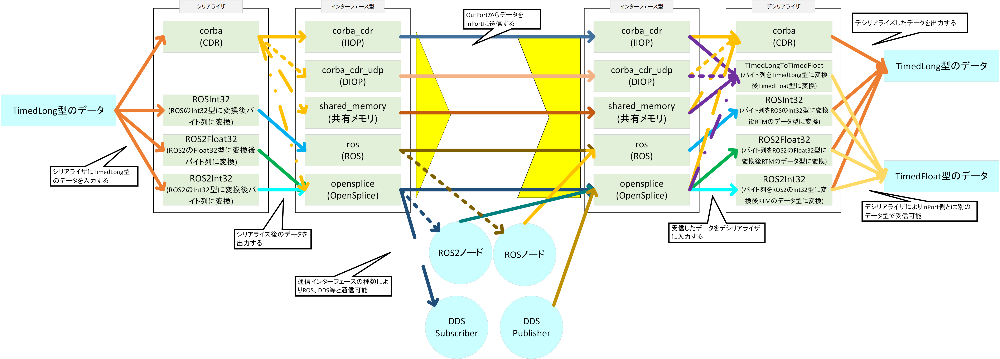

<!-- Title: 独自シリアライザの実装手順 -->
#contents

In the OpenRTM-aist data port, you can select from multiple implementations for both the serializer that converts data into a byte stream and the communication interface used to transmit the data, as shown below.

Since the interface type can be selected, it is possible to exchange data not only between RTCs but also with ROS nodes or processes that communicate using DDS, such as ROS 2.
In addition, since the serializer can be selected, it is possible to convert a data type such as **TimedLong** into another data type, as shown in the figure, enabling flexible connections between ports with different data types.

Currently, this feature is available in the C++ and Python versions.

The following sections describe the procedure for creating a custom serializer.
