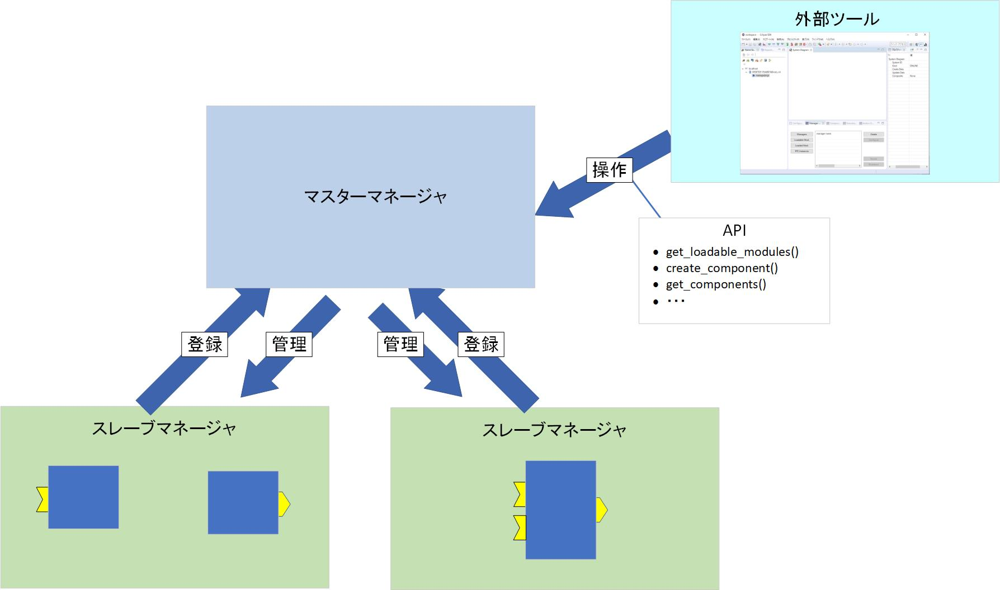
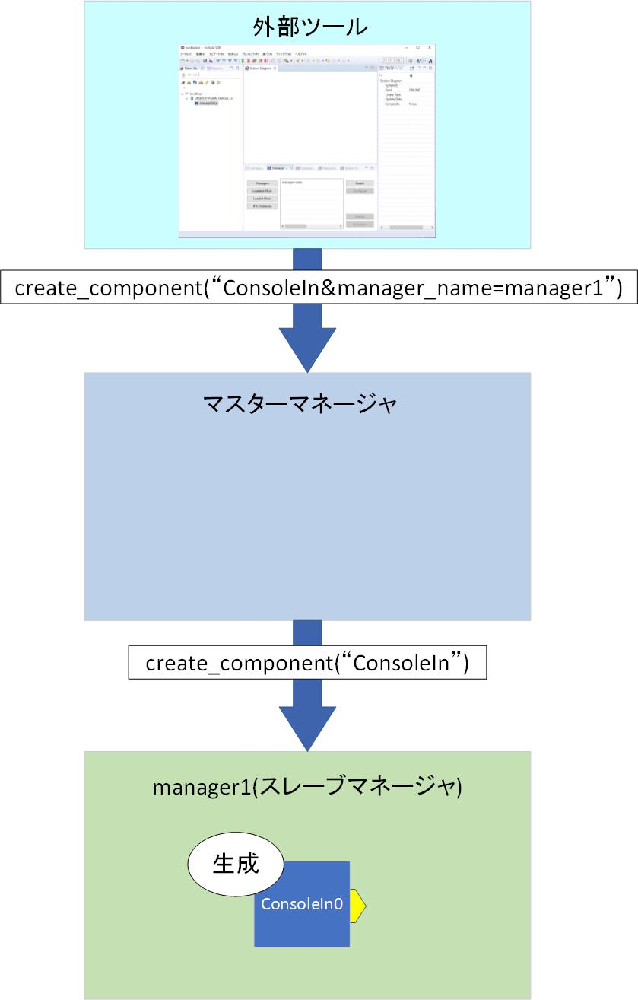

-------jp page!!-------

<!-- Title: マスターマネージャ、スレーブマネージャ -->
#contents

## 概要
### マネージャ
マネージャはRTCを管理する仕組みです。
1つのプロセスに1つのマネージャが起動します。


### マスターマネージャ、スレーブマネージャ
マネージャにはマスターマネージャとスレーブマネージャの2種類あります。
マスターマネージャはスレーブマネージャを管理する上位のマネージャであり、スレーブマネージャはRTCの生成、実行するためのマネージャです。

<div align="center"><a href="manager1.jpg"></a></div>

RTSystemEditor等の外部のツールからマスターマネージャのAPIを呼び出すことでRTCの生成、削除などが実行できます。
RTCはマスターマネージャ上では直接起動せずに、マスターマネージャがスレーブマネージャのAPIを呼び出してRTCを起動するように指令します。

<div align="center"><a href="manager2.jpg"></a></div>

以下はPythonでマスターマネージャにRTCの生成を指令するプログラムの例です。

```
 import sys
 from omniORB import CORBA
 import RTM
 
 orb = CORBA.ORB_init(sys.argv, CORBA.ORB_ID)
 obj = orb.string_to_object("corbaloc:iiop:localhost:2810/manager")
 mgr = obj._narrow(RTM.Manager)
 
 rtc = mgr.create_component("ConsoleIn&manager_name=samplemaneger")
```

マスターマネージャを起動する場合はrtcdを**-d**オプションを付けて実行します。

```
 rtcd -d -f rtc.conf
```

rtc.confでモジュール探索パスを設定しておく必要があります。

```
 manager.modules.load_path: C:/Program Files/OpenRTM-aist/1.2.2/Components/C++/OpenCV/vc14
```

スレーブマネージャを起動する場合は特にオプションは必要ありませんが、rtc.confでマネージャ名、モジュール探索パスを設定してください。
またデフォルトの設定ではRTCが1つも実行してない場合にマネージャを自動終了する機能があるためそれをオフにしてください。

```
 manager.instance_name: samplemaneger
 manager.modules.load_path: C:/Program Files/OpenRTM-aist/1.2.2/Components/C++/OpenCV/vc14
 manager.shutdown_auto:NO
```

## API
### load_module
### unload_module
### get_loadable_modules
### get_loaded_modules
### get_factory_profiles
### create_component
**create_component**はRTCを生成するためのAPIです。
以下のように引数に起動するRTCのベンダ名、カテゴリ名、コンポーネント名、言語名、バージョン番号を入力することでRTCを生成します。

```
 mgr.create_component("RTC:AIST:Example:ConsoleIn:C++:1.0.0")
```

引数の文字列は以下のような内容で入力します。

```
 RTC:[vendor]:[category]:[implementation_id]:[version]
```

ただし、implementation_id以外は省略できるため、以下のようにRTC名だけを入力しても生成できます。

```
 mgr.create_component("ConsoleIn")
```

RTCはスレーブマネージャ上で起動しますが、RTCを起動するスレーブマネージャを指定する場合は以下のように**manager_name**のオプションで指定します。

```
 mgr.create_component("ConsoleIn&manager_name=samplemaneger")
```

起動するスレーブマネージャをアドレスとポート番号を指定してRTCを起動する場合は**manager_address**のオプションで指定します。

```
 mgr.create_component("Flip&manager_address=localhost:2811")
```

#### マネージャの動作について
##### スレーブマネージャ名を指定した場合に指定のスレーブマネージャが起動していない場合
**manager_name**オプションでスレーブマネージャ名を指定した場合に指定のスレーブマネージャが起動していない場合、マスターマネージャは指定の名前のスレーブマネージャを起動します。
例えば、以下の**samplemaneger**という名前のスレーブマネージャが起動していない場合、新たに**samplemaneger**という名前のスレーブマネージャを起動します。

```
 mgr.create_component("ConsoleIn&manager_name=samplemaneger")
```

##### スレーブマネージャ名を指定しない場合
以下のように**manager_name**オプションを指定しない場合、**manager_[プロセスID]**の名前のスレーブマネージャを新たに起動します。

```
 mgr.create_component("ConsoleIn")
```

##### 同一コンポーネント名のRTCがロード可能な場合

例えばOpenRTM-aistのサンプルコンポーネントにはC++、Python、Javaで実装したConsoleInコンポーネントの3種類が使用できます。
同一コンポーネント名のRTCを区別して起動する場合、以下のように言語名で区別することができます。

```
 mgr.create_component("RTC:AIST:Example:ConsoleIn:Python:1.0.0")
```

言語名でも区別できない場合は、予めRTCを起動するスレーブマネージャを起動しておいて、**create_component**でマネージャ名を指定することで対応できます。

### delete_component
### get_components
### get_component_profiles
### get_components_by_name
### get_profile
### get_configuration
### set_configuration
### is_master
### get_master_managers
### add_master_manager
### remove_master_manager
### get_slave_managers
スレーブマネージャのAPIを直接呼び出す場合は**get_slave_managers**でマスターマネージャからスレーブマネージャを取得して実行します。
以下は指定の名前のスレーブマネージャでモジュールをロードしてRTCを起動する例です。

```
 import sys
 from omniORB import CORBA
 import RTM
 import OpenRTM_aist
 
 orb = CORBA.ORB_init(sys.argv, CORBA.ORB_ID)
 obj = orb.string_to_object("corbaloc:iiop:localhost:2810/manager")
 mgr = obj._narrow(RTM.Manager)
 print(mgr.create_component("Flip&manager_name=samplemaneger"))
 
 
 def getSlaveManager(master, slavename):
     slavemgrs = master.get_slave_managers()
     for slavemgr in slavemgrs:
         prof = slavemgr.get_configuration()
         prop = OpenRTM_aist.Properties()
         OpenRTM_aist.NVUtil.copyToProperties(prop, prof)
         name = prop.getProperty("manager.instance_name")
         if name == slavename:
             return slavemgr
     return None
 
 
 samplemaneger = getSlaveManager(mgr, "samplemaneger")
 samplemaneger.load_module(
     "C:\\Program Files\\OpenRTM-aist\\1.2.2\\Components\\C++\\Examples\\vc14\\ConsoleIn.dll", "ConsoleInInit")
 samplemaneger.create_component("ConsoleIn")
```


### add_slave_manager
### remove_slave_manager
### fork
### shutdown
### restart
### get_service

-------jp page!!-------
