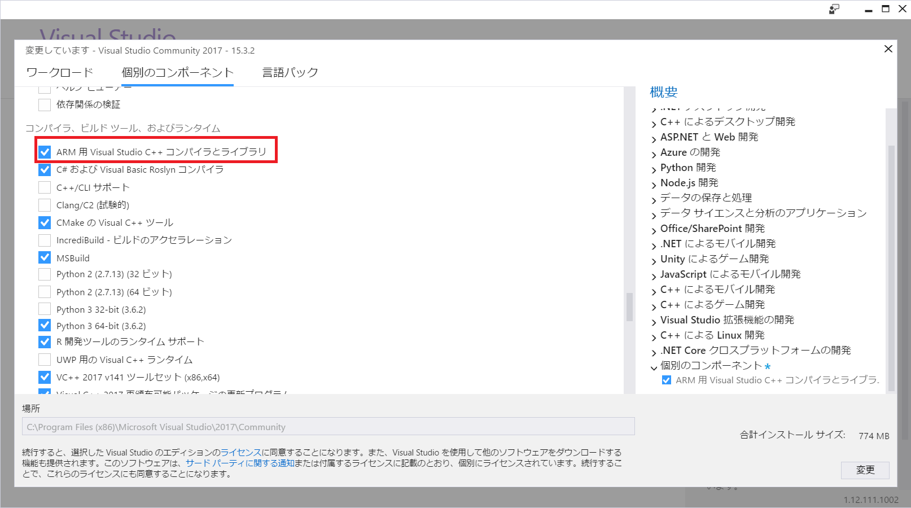
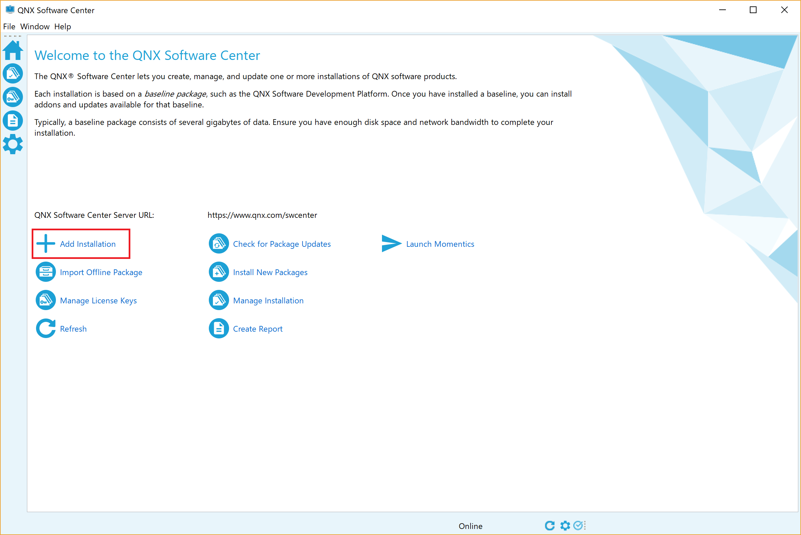
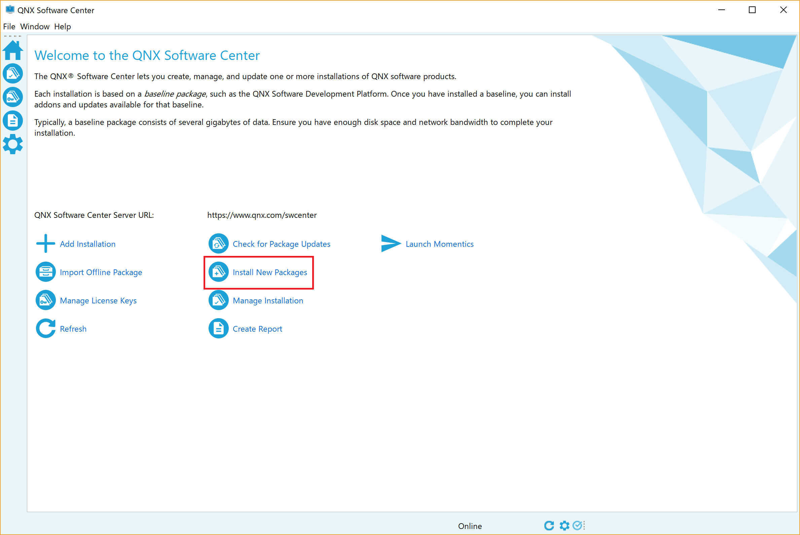
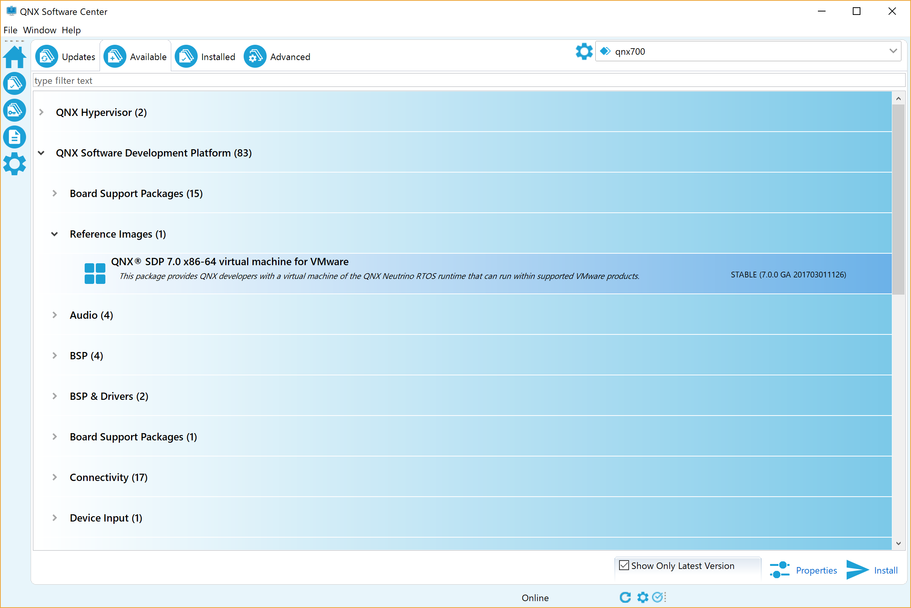

<!-- Title: OpenRTM-aist(C++版)のCMakeによるビルド手順 -->
#contents

## Windows + omniORB

&aname(windowsomniorb);

Obtain the OpenRTM-aist source code from the following repository.

- [https://github.com/OpenRTM/OpenRTM-aist](https://github.com/OpenRTM/OpenRTM-aist)

Download the prebuilt omniORB package from the following location.

- [https://openrtm.org/pub/omniORB/win32/](https://openrtm.org/pub/omniORB/win32/)

Move to the checked-out OpenRTM-aist directory and execute the following commands.

```sh
mkdir build
cd build
cmake -DORB_ROOT=C:/workspace/omniORB-4.2.3-win64-vc141 -G "Visual Studio 16 2019" -DCMAKE_INSTALL_PREFIX=C:/workspace/openrtminstall ..
cmake --build . --config Release
cmake --build . --config Release --target install
```

<table class="table-alt">
  <tr>
    <th>Variable</th>
    <th>Description</th>
    <th>Available Values</th>
  </tr>
  <tr>
    <td>CORBA</td>
    <td>CORBA library</td>
    <td>omniORB</td>
  </tr>
</table>

## Windows + TAO

Obtain the OpenRTM-aist source code from the following repository.

- [https://github.com/OpenRTM/OpenRTM-aist](https://github.com/OpenRTM/OpenRTM-aist)

Build TAO by following the procedure below.

- [Building TAO]({{ site.baseurl }}/en/doc/installation/install_1_1/cpp_1_1/install_qnx_1_1/qnx_build_proc_1_2/tao_buildn#windows)

Move to the checked-out OpenRTM-aist directory and execute the following commands.

```sh
mkdir build
cd build
cmake -DORB_ROOT=C:/workspace/ACE_wrappers -DCORBA=TAO -G "Visual Studio 16 2019" -DCMAKE_INSTALL_PREFIX=C:/workspace/openrtminstall ..
set PATH=%PATH%;C:\workspace\ACE_wrappers\lib;
cmake --build . --config Release
cmake --build . --config Release --target install
```

## Windows 10 IoT + omniORB

Since prebuilt binaries of omniORB for Windows 10 IoT are not currently distributed, you must build omniORB yourself.

Cygwin is required.

- [https://www.cygwin.com/](https://www.cygwin.com/)

Download the omniORB source code.

- [https://sourceforge.net/projects/omniorb/files/omniORB/omniORB-4.2.2/](https://sourceforge.net/projects/omniorb/files/omniORB/omniORB-4.2.2/)

Extract **omniORB-4.2.2.tar.bz2** to an appropriate location.

First, apply the patch for ARM + Windows.

Download the patch from the following location.

- [http://svn.openrtm.org/omniORB/trunk/windows/omniORB-4.2.2-windows-iot.patch](http://svn.openrtm.org/omniORB/trunk/windows/omniORB-4.2.2-windows-iot.patch)

Execute the following command in Cygwin.

```sh
patch -p1 -d omniORB-4.2.2 < omniORB-4.2.2-windows-iot.patch
```

Edit **mk/platforms/arm_win32_vs_14.mk** in the extracted **omniORB-4.2.2** directory.

If you are using a different version of Visual Studio, select the corresponding file.

Specify the Python directory as shown below.

```make
PYTHON = /cygdrive/c/Python27/python
```

Next, edit **config/config.mk**.

Specify the corresponding mk file as shown below.

If you are using a different version of Visual Studio, modify the setting accordingly.

```make
platform = arm_win32_vs_14
```

Since cross-compilation is performed, executable tools such as the IDL compiler must be prepared for the development environment.

Download the x86 build of omniORB from the following location.

- [http://openrtm.org/pub/omniORB/win32/omniORB-4.2.2/](http://openrtm.org/pub/omniORB/win32/omniORB-4.2.2/)

Copy the contents of **bin/x86_win32** from the extracted ZIP archive into **bin/x86_win32** of the extracted **omniORB-4.2.2.tar.bz2** directory.

Move to the extracted **omniORB-4.2.2** directory and execute the following commands.

```sh
set PATH=C:\cygwin64\bin;%PATH%;
call "C:\Program Files (x86)\Microsoft Visual Studio 14.0\VC\vcvarsall.bat" x86_arm
cd src
make export
```

The executable files will be generated in **bin/ARM_win32**, and the libraries will be generated in **lib/ARM_win32**.

For **vcvarsall.bat**, use the version that matches your Visual Studio installation.

For Visual Studio 2017, use:

**C:\Program Files (x86)\Microsoft Visual Studio\2017\Community\VC\Auxiliary\Build\vcvarsall.bat**

Building OpenRTM-aist is almost the same as the standard procedure.

Specify the ARM compiler using a CMake option such as **Visual Studio 14 2015 ARM**.

```sh
mkdir build
cd build
cmake -DORB_ROOT=C:/workspace/omniORB-4.2.2 -G "Visual Studio 14 2015" -A ARM -DCMAKE_INSTALL_PREFIX=C:/workspace/openrtminstall ..
cmake --build . --config Release
cmake --build . --config Release --target install
```

If the ARM compiler is not installed in Visual Studio, the build cannot be performed.

If you have not installed the ARM compiler, launch **Visual Studio Installer** and install **ARM Visual Studio C++ Compiler and Libraries**.

<br>
<br>

<div align="center"><a href="arm1.png"></a></div>

<br>
<br>

## Ubuntu + omniORB

&aname(ubuntuomniorb);

```sh
sudo apt install libomniorb4-dev omniidl omniorb-nameserver
git clone https://github.com/OpenRTM/OpenRTM-aist
cd OpenRTM-aist/
mkdir build
cd build/
cmake -DCMAKE_BUILD_TYPE=Release ..
cmake --build . --config Release -- -j$(nproc)
sudo cmake --build . --config Release --target install
```

<table class="table-alt">
  <tr>
    <td>Variable</td>
    <td>Description</td>
    <td>Available Values</td>
  </tr>
  <tr>
    <td>CORBA</td>
    <td>CORBA library</td>
    <td>omniORB</td>
  </tr>
</table>

## Ubuntu + TAO

Build TAO by following the procedure below.

- [Building TAO]({{ site.baseurl }}/en/doc/installation/install_1_1/cpp_1_1/install_qnx_1_1/qnx_build_proc_1_2/tao_buildn#ubuntu)

Build OpenRTM-aist with the following commands.

```sh
git clone https://github.com/OpenRTM/OpenRTM-aist
cd OpenRTM-aist/
mkdir build
cd build
cmake -DCORBA=TAO -DCMAKE_BUILD_TYPE=Release ..
cmake --build . --config Release -- -j$(nproc)
sudo cmake --build . --config Release --target install
```

## VxWorks + omniORB

The home directory of Wind River Workbench must be specified in advance.
Set the directory where Wind River Workbench is installed to the variable **WIND_HOME**.

```sh
export WIND_HOME=/home/openrtm/WindRiver
```

Before building OpenRTM-aist, you must build omniORB.

### omniORB

Download the omniORB source code.

- [http://omniorb.sourceforge.net/](http://omniorb.sourceforge.net/)

Download the patch for VxWorks support in omniORB.

- [http://svn.openrtm.org/omniORB/trunk/vxworks/omniORB-4.2.2-vxworks.patch](http://svn.openrtm.org/omniORB/trunk/vxworks/omniORB-4.2.2-vxworks.patch)

Build it with the following commands.

```sh
wget https://jaist.dl.sourceforge.net/project/omniorb/omniORB/omniORB-4.2.2/omniORB-4.2.2.tar.bz2
tar xf omniORB-4.2.2.tar.bz2
wget http://svn.openrtm.org/omniORB/trunk/vxworks/omniORB-4.2.2-vxworks.patch
patch -p1 -d omniORB-4.2.2 < omniORB-4.2.2-vxworks.patch
cd omniORB-4.2.2
mkdir build
cd build
../configure
make
cd ..
sed -i '1s/^/platform = ${VXWORKS_PLATFORM}\n/' config/config.mk
cd src
make export
```

However, enter a value for **VXWORKS_PLATFORM** that matches your operating environment.

<table class="table-alt">
  <tr>
    <th>VXWORKS_PLATFORM</th>
    <th>CPU</th>
    <th>VxWorks Version</th>
    <th>Implementation Method</th>
  </tr>
  <tr>
    <td>powerpc_vxWorks_kernel_6.6</td>
    <td>PowerPC</td>
    <td>6.6</td>
    <td>Kernel module</td>
  </tr>
  <tr>
    <td>powerpc_vxWorks_RTP_6.6</td>
    <td>PowerPC</td>
    <td>6.6</td>
    <td>RTP</td>
  </tr>
  <tr>
    <td>powerpc_vxWorks_kernel_6.9</td>
    <td>PowerPC</td>
    <td>6.9</td>
    <td>Kernel module</td>
  </tr>
  <tr>
    <td>powerpc_vxWorks_RTP_6.9</td>
    <td>PowerPC</td>
    <td>6.9</td>
    <td>RTP</td>
  </tr>
  <tr>
    <td>simlinux_vxWorks_kernel_6.6</td>
    <td>Simulator on Linux</td>
    <td>6.6</td>
    <td>Kernel module</td>
  </tr>
  <tr>
    <td>simpentium_vxWorks_RTP_6.6</td>
    <td>Simulator on Linux</td>
    <td>6.6</td>
    <td>RTP</td>
  </tr>
  <tr>
    <td>simlinux_vxWorks_kernel_6.9</td>
    <td>Simulator on Linux</td>
    <td>6.9</td>
    <td>Kernel module</td>
  </tr>
  <tr>
    <td>simpentium_vxWorks_RTP_6.9</td>
    <td>Simulator on Linux</td>
    <td>6.9</td>
    <td>RTP</td>
  </tr>
</table>

### OpenRTM-aist

Enter the following commands.

```sh
git clone https://github.com/OpenRTM/OpenRTM-aist
cd OpenRTM-aist/
mkdir build
cd build/
cmake -DCMAKE_TOOLCHAIN_FILE=${TOOLCHAIN_FILE} -DVX_VERSION=${VX_VERSION} -DORB_ROOT=${ORB_ROOT} -DOMNI_VERSION=42 -DCORBA=omniORB -DVX_CPU_FAMILY=${ARCH} ..
make
```

However, set **TOOLCHAIN_FILE**, **VX_VERSION**, **ORB_ROOT**, and **ARCH** as follows.

<table class="table-alt">
  <tr>
    <th>TOOLCHAIN_FILE</th>
    <th>For VxWorks 6.6 (kernel module, PowerPC), use <strong>../Toolchain-vxworks6.6-Linux.cmake</strong>. For other cases, use <strong>../Toolchain-vxworks6.cmake</strong>.</th>
  </tr>
  <tr>
    <td>VX_VERSION</td>
    <td><strong>vxworks-6.6</strong> or <strong>vxworks-6.9</strong></td>
  </tr>
  <tr>
    <td>ORB_ROOT</td>
    <td>omniORB directory (example: /home/openrtm/omniORB-4.2.2)</td>
  </tr>
  <tr>
    <td>VX_CPU_FAMILY</td>
    <td><strong>ppc</strong> (PowerPC), <strong>simlinux</strong> (kernel module, simulator), <strong>simpentium</strong> (RTP, simulator)</td>
  </tr>
</table>

For RTP, you must add **-DRTP=ON** to the cmake command.

```sh
cmake -DCMAKE_TOOLCHAIN_FILE=${TOOLCHAIN_FILE} -DVX_VERSION=${VX_VERSION} -DORB_ROOT=${ORB_ROOT} -DOMNI_VERSION=42 -DCORBA=omniORB -DVX_CPU_FAMILY=${ARCH} -DRTP=ON ..
cmake --build . --config Release
```

## VxWorks + ORBexpress

※ Currently, the supported environment is VxWorks 6.6 and PowerPC only.

Enter the following commands.

```sh
git clone https://github.com/OpenRTM/OpenRTM-aist
cd OpenRTM-aist/
mkdir build
cd build/
cmake -DCMAKE_TOOLCHAIN_FILE=${TOOLCHAIN_FILE} -DORB_ROOT=${ORB_ROOT} -DCORBA=ORBexpress ..
make
```

Set **TOOLCHAIN_FILE** and **ORB_ROOT** as follows.

<table class="table-alt">
  <tr>
    <th>TOOLCHAIN_FILE</th>
    <th>For a kernel module, use <strong>../Toolchain-vxworks6.6-Linux.cmake</strong>. For RTP, use <strong>../Toolchain-vxworks6.cmake</strong>.</th>
  </tr>
  <tr>
    <td>ORB_ROOT</td>
    <td>ORBexpress directory (example: /home/openrtm/OIS/ORBexpress/RT_2.8.4_PATCH_KC1)</td>
  </tr>
</table>


## QNX 6.5 + omniORB

Build on QNX 6.5 running on VMWare.
Download the ISO image from the following page.

- [http://www.qnx.com/download/group.html?programid=16780](http://www.qnx.com/download/group.html?programid=16780)

### pkgsrc

First, install the package management system **pkgsrc**.
Obtain the source code with the following command.

```sh
svn checkout --username ユーザ名 --password パスワード http://community.qnx.com/svn/repos/pkgsrc/HEAD_650/pkgsrc
```

For the username and password, specify the email address and password of your QNX account.

Next, install it with the following commands.
Run the commands using **su**.

```sh
(cd pkgsrc/bootstrap && ./bootstrap)
(cd pkgsrc/misc/figlet && ../../bootstrap/work/bin/bmake install)
```

Set the **PKG_PATH** environment variable.

```sh
export PKG_PATH=ftp://ftp.netbsd.org/pub/pkgsrc/packages/QNX/i386/6.5.0_head_20110826/All/
```

### libuuid

First, build **libuuid**.
Download **libuuid-1.0.3.tar.gz** and transfer it to QNX.

- [https://sourceforge.net/projects/libuuid/files/](https://sourceforge.net/projects/libuuid/files/)

Extract the file.

```sh
tar xf libuuid-1.0.3.tar.gz
```

Building **libuuid** requires **sys/syscall.h**, **bits/syscall.h**, **asm/unistd.h**, and **asm/unistd_32.h** (or **asm/unistd_64.h**).
Obtain these files and copy them under **libuuid-1.0.3**.

```text
libuuid-1.0.3
  |-sys
  | |-syscall.h
  |-bits
  | |-syscall.h
  |-asm
  | |-unistd.h
  | |-unistd_32.h(or unistd_64.h)
  |-(omitted)
```

Build and install it with the following commands.

```sh
cd libuuid-1.0.3
./configure
make
make install
cd ..
```

### omniORB

First, obtain **omniORB-4.2.3.tar.bz2** and transfer it to QNX.

- [https://sourceforge.net/projects/omniorb/files/omniORB/](https://sourceforge.net/projects/omniorb/files/omniORB/)

Extract the file.

```sh
tar xf omniORB-4.2.3.tar.bz2
```

The following files need to be modified.

- configure
- /beforeauto.mk.in

First, two changes are required for **configure**.
Add the following **\*-*-nto-qnx)** line.

```sh
case "$host" in
  *-*-linux-*)   plat_name="Linux";    plat_def="<u>linux</u>";    os_v="2";;
  *-*-nto-qnx)   plat_name="Linux";    plat_def="<u>linux</u>";    os_v="2";;
```

Add the following **x86-pc-\*)** part.

```sh
case "$host" in
  i?86-*)   proc_name="x86Processor";     proc_def="__x86__";;
  x86-pc-*) proc_name="x86Processor"; proc_def="__x86__";;
```

Modify the following part of **mk/beforeauto.mk.in**.

```make
#OMNITHREAD_LIB += -lpthread #削除
OMNITHREAD_LIB += -lsocket #追加
```

Build it with the following commands.

```sh
./configure
make
make install
cd ..
```

### OpenRTM-aist

Building OpenRTM-aist requires **cmake**, **pkg-config**, and **Python 2.7**.

```sh
/usr/pkg/sbin/pkg_add -v pkg-config-0.25nb1
/usr/pkg/sbin/pkg_add -v cmake-2.8.5
/usr/pkg/sbin/pkg_add -v python27-2.7.2
```

Set the **PKG_CONFIG_PATH** environment variable.

```sh
export PKG_CONFIG_PATH=/usr/local/lib/pkgconfig/
```

Obtain the OpenRTM-aist source code and transfer it to QNX.

Move to the OpenRTM-aist directory and execute the following commands.

```sh
mkdir build
cd build/
ln -s /usr/pkg/bin/python2.7 ./python
export PATH=$PWD:$PATH
cmake -DCORBA=omniORB ..
cmake --build . --config Release -- -j$(nproc)
cmake --build . --target install
```

## QNX 7.0 + omniORB

Install and build using **QNX Software Development Platform 7.0** on Ubuntu.

First, install **QNX Software Center**.

- [http://www.qnx.com/download/group.html?programid=29178](http://www.qnx.com/download/group.html?programid=29178)

```sh
sudo apt-get install libgtk2.0-0:i386
chmod a+x qnx-setup-201808201144-lin.run
./qnx-setup-201808201144-lin.run
```

Launch **QNX Software Center** and install **QNX Software Development Platform** from **Add Installation**.

```sh
/home/openrtm/qnx/qnxsoftwarecenter/qnxsoftwarecenter
```

<div align="center"><a href="qnx9.png"></a></div>

### libuuid

First, build **libuuid**.

```sh
wget https://jaist.dl.sourceforge.net/project/libuuid/libuuid-1.0.3.tar.gz
tar xf libuuid-1.0.3.tar.gz
```

Building **libuuid** requires **sys/syscall.h**, **bits/syscall.h**, **asm/unistd.h**, and **asm/unistd_32.h** (or **asm/unistd_64.h**).

Obtain these files and copy them under **libuuid-1.0.3**.

```sh
cd libuuid-1.0.3
mkdir sys
cp /usr/include/x86_64-linux-gnu/sys/syscall.h sys
mkdir asm
cp /usr/include/x86_64-linux-gnu/asm/unistd.h asm
cp /usr/include/x86_64-linux-gnu/asm/unistd_64.h asm
mkdir bits
cp /usr/include/x86_64-linux-gnu/bits/syscall.h bits
```

Run the following script to configure the QNX cross-compilation environment.

```sh
source ~/qnx700/qnxsdp-env.sh
```

Build with the following commands.

Modify the **qnx700** path as appropriate for your environment.

```sh
./configure --prefix=/home/openrtm/qnx700/target/qnx7/usr/ CC="qcc -V5.4.0,gcc_ntox86_64_gpp" CXX="q++ -V5.4.0,gcc_ntox86_64_gpp" AR=ntox86_64-ar RANLIB=ntox86_64-ranlib --host=x86_64-unknown-linux-gnu
make
make install
cd ..
```

### omniORB

First, obtain the omniORB source code.

```sh
wget https://jaist.dl.sourceforge.net/project/omniorb/omniORB/omniORB-4.2.3/omniORB-4.2.3.tar.bz2
tar xf omniORB-4.2.3.tar.bz2
cd omniORB-4.2.3
```

You must first build **omniidl** on Ubuntu.

Build and install omniORB in an environment where **qnxsdp-env.sh** has **not** been executed.

```sh
./configure
make
make install
```

To build for QNX, modify the following section.

```make
#OMNITHREAD_LIB += -lpthread
OMNITHREAD_LIB += -lsocket
```

Build with the following commands.

```sh
make clean
./configure --prefix=/home/openrtm/qnx700/target/qnx7/usr/ CC="qcc -V5.4.0,gcc_ntox86_64_gpp" CXX="q++ -V5.4.0,gcc_ntox86_64_gpp" AR=ntox86_64-ar RANLIB=ntox86_64-ranlib --host=x86_64-unknown-linux-gnu
make
make install
```

### OpenRTM-aist

Set the **PKG_CONFIG_PATH** environment variable so that **omniORB** and **uuid** can be detected by **pkg-config**.

```sh
export PKG_CONFIG_PATH=/home/openrtm/qnx700/target/qnx7/usr/lib/pkgconfig
```

Build with the following commands.

```sh
git clone https://github.com/OpenRTM/OpenRTM-aist
cd OpenRTM-aist/
mkdir build
cd build
cmake -DCORBA=omniORB -DCMAKE_TOOLCHAIN_FILE=../Toolchain-QNX7.cmake -DCMAKE_INSTALL_PREFIX=/home/openrtm/qnx700/target/qnx7/usr/ ..
cmake --build . --config Release -- -j$(nproc)
```

### Obtaining the VMWare Image

To obtain the VMWare image, download it from **QNX Software Center**.

<div align="center"><a href="qnx10.png"></a></div>

Install **QNX Software Development Platform → Reference Images → QNX SDP 7.0 x86-64 virtual machine for VMWare**.

<div align="center"><a href="qnx.png"></a></div>

Open the installed **QNX_SDP.vmx** with VMware to start the virtual machine.

<hr>

- [CMake Options](./cmake_option/)
- [Building omniORB](./omniorb_build/)
- [Building TAO](./tao_build)
- [Building OpenRTM-aist and Operation Verification]({{ site.baseurl }}/en/doc/installation/install_1_1/cpp_1_1/install_qnx_1_1/qnx_build_proc_1_2/openrtm_cpp_cmake_run/)
