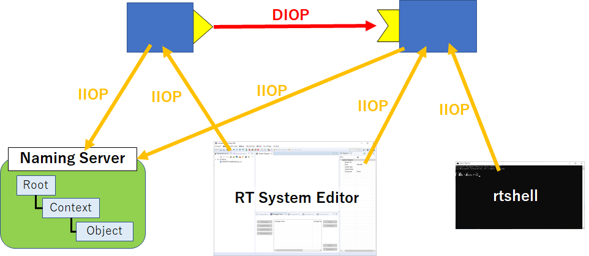
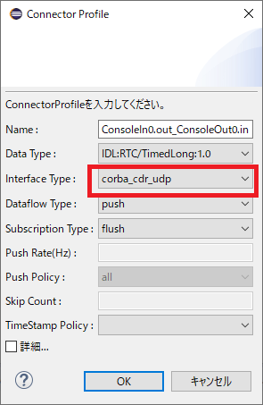

<!-- Title: TAO関連の設定 -->
#contents

このページではOpenRTM-aistで通信ミドルウェアにTAOを使用した場合に各種通信プロトコルを使用するための設定ファイルの作成方法を説明します。
TAOではIIOP、DIOP、UIOP、HTIOP、SHMIOP、SSLIOP、SCIOP、MIOP、COIOP、ZIOP通信が使用可能です。
ただし、IIOP、SSLIOP、ZIOP通信以外は独自規格のプロトコルのため、他のCORBA実装との互換性はありません。

## DIOP

DIOP(Datagram Inter-ORB Protocol)はGIOPをUDP/IP上の実装であり、IIOP(TCP/IP)と比較すると軽量ですが到達保障がない通信プロトコルです。
IIOP通信との大きな違いとしてCORBAサービスの呼び出しが一方通行であり、戻り値を取ることができません。
例えば、外部のツールからRTCのコンポーネントプロファイルを取得する場合には、DIOP通信では戻り値(コンポーネントプロファイル)を取得できないため使用できません。

OpenRTM-aistでDIOP通信を使用するために、データポートのデータ転送用に以下のoneway属性のメソッドを定義しています。

```
 module OpenRTM
 {
   interface InPortCdrUDP
   {
     oneway void put(in CdrData data);
   };
 };
```

実際に使用する場合は、以下の図のようにデータポートのデータ送信にDIOP通信を用いて、それ以外はIIOP等の別の通信で接続する必要があります。

<br>

<div align="center"><a href="diop.png"></a></div>

<br>

以下にrtc.confの設定例を記載します。
IIOPとDIOPのエンドポイントを設定します。

corba.args: -ORBEndpoint iiop://: -ORBEndpoint diop://: -ORBSvcConf svc.conf


svc.confはTAOの設定ファイルです。
svc.confという名前のファイルが実行パスに存在すれば自動的に読み込みますが、ORBSvcConfオプションで明示的に指定もできます。

以下にsvc.confでは以下のようにORBProtocolFactoryの設定を行います。

```
 static Advanced_Resource_Factory "-ORBProtocolFactory DIOP_Factory -ORBProtocolFactory IIOP_Factory -ORBReactorType select_st"
```

OpenRTM-aistでインストールされるrtc.diop.conf、svc.confを使用することもできます。

```
 %RTM_ROOT%Components\C++\Examples\%RTM_VC_VERSION%\ConsoleInComp.exe -f ext\tao_diop\rtc.diop.conf
 %RTM_ROOT%Components\C++\Examples\%RTM_VC_VERSION%\ConsoleOutComp.exe -f ext\tao_diop\rtc.diop.conf
```


ポート接続時にInterface Typeに**corba_cdr_udp**を指定して接続することでDIOP通信によりデータの転送を行います。

RT System EditorではConnector Profileで設定します。

<br>

<div align="center"><a href="diop2.png"></a></div>

<br>

rtc.confでは**interface_type**を**corba_cdr_udp**に設定して事前接続設定をします。

```
 manager.components.preconnect: ConsoleIn0.out?port=rtcname://localhost:2809/*/ConsoleOut0.in&interface_type=corba_cdr_udp
```


## HTIOP
HTIOP(HTTP Tunneling Inter-ORB Protocol)はGIOPメッセージをHTTPパケットで送信する通信プロトコルです。
HTIOP通信の利点としては、ファイアーウォールやHTTPプロキシサーバを経由した通信が容易になる事や、リバースプロキシやロードバランサー等の既存の仕組みを流用しやすいという事が挙げられます。

まずはネームサーバーを起動しますが、ネームサーバーにもHTIOPのエンドポイントを設定する必要があります。
以下の内容の設定ファイル**svc.names.htiop.conf**を作成してください。

```
 dynamic HTIOP_Factory Service_Object *
        TAO_HTIOP:_make_TAO_HTIOP_Protocol_Factory ()
        "-config ./HT_Config.conf"
 
 static Resource_Factory "-ORBProtocolFactory HTIOP_Factory"
```

TAO付属のネームサーバー**tao_cosnaming**を起動します。
WindowsでOpenRTM-aistをビルドした場合、**${RTM_ROOT}/ACE/${RTM_VC_VERSION}/bin/tao_cosnaming.exe**にコピーしています。Ubuntuの場合はTAOをインストールした時に${OPENRTM_INSTALL_DIR}/binに入っているものを使用してください。

以下のように作成したsvc.names.htiop.confを指定してtao_cosnamingを起動します。

```
 ACE\vc16\bin\tao_cosnaming.exe -ORBEndpoint htiop://127.0.0.1:2809 -ORBSvcConf ext/svc.names.htiop.conf
```


CosoleIn、ConsoleOutコンポーネントを以下の内容のrtc.confで起動します。

```
 corba.args: -ORBEndpoint htiop:// -ORBSvcConf ext/tao_htiop/svc.htiop.conf
 
 corba.nameservers: corbaloc:htiop:localhost:2809
 corba.master_manager: htiop://127.0.0.1:2810
 
 manager.components.preactivation: ConsoleIn0, rtcname.htiop://localhost:2809/*/ConsoleOut0
 manager.components.preconnect: ConsoleIn0.out?port=rtcname.htiop://localhost:2809/*/ConsoleOut0.in
```

**corba.args**オプションはTAOのORB_init関数への引数を指定します。
HTIOPのエンドポイントとTAOの設定ファイル(ext/svc.htiop.conf)を設定しています。

設定ファイル**svc.htiop.conf**は以下の内容で作成します。

```
 dynamic HTIOP_Factory Service_Object *
        TAO_HTIOP:_make_TAO_HTIOP_Protocol_Factory ()
        "-config ext/tao_htiop/HT_Config.conf"
 
 static Advanced_Resource_Factory "-ORBProtocolFactory HTIOP_Factory"
```


また、接続するネームサーバーの設定を行います。
ネームサーバーはHTIOPのエンドポイント(htiop:localhost:2809)を指定します。

HTIOP通信を使用する場合、RT System EditorやrtshellではRTCを操作できません。
現在のところ、独自にプログラムを作成するか、マネージャ起動時の事前接続(preconnect)、事前アクティブ化(preactivation)の設定を行う必要があります。

**HT_Config.conf**でプロキシサーバーの設定を行うことができます。

```
 [htbp]
 
 proxy_port=3128
 proxy_host=localhost
```


以下にHTIOP通信時のHTTPパケットの内容の一例を掲載します。
GETメソッド実行後にPOSTメソッドを実行します。POSTメソッドのボディにGIOPメッセージを格納して送信します。


```
 GET http://127.0.0.1:2809//1/request1647425846.html HTTP/1.1
```

```
 POST http://127.0.0.1:2809//1/request1647418153.html HTTP/1.1
 Content-Type: application/octet-stream
 Content-Length: 123
 
 
 GIOP\x01\x00\x01\x00o\x00\x00\x00\x01\x00\x00\x00\x01\x00\x00\x00\x0c\x00\x00\x00\x01\xc0N\r\x01\x00\x01\x00\t\x01\x01\x00\x01\x00\x00\x00\x01\x00\x00\x00\x0b\x00\x00\x00NameService\x00\x06\x00\x00\x00_is_a\x00\x00\x00\x00\x00\x00\x00+\x00\x00\x00IDL:omg.org/CosNaming/NamingContextExt:1.0\x00
```

## SSLIOP
SSLIOP(Secure Sockets Layer (SSL) Inter-ORB Protocol)は、GIOPにSSL/TLSによるサーバー・クライアント認証、通信内容の暗号化を適用した通信プロトコルでセキュアな通信が可能になります。

まず、OpenRTM-aistをビルドする時にCMake実行で**SSL_ENABLE**オプションをオンにしてください。

```
 cmake .. -DSSL_ENABLE=ON
```


OpenRTM-aistをビルド、インストール後に、まずはネームサーバーを起動します。
ネームサーバーにはSSLIOPのエンドポイントを指定するため、以下の内容の設定ファイル**svc.names.ssliop.conf**を作成してください。

```
 dynamic SSLIOP_Factory Service_Object *
        TAO_SSLIOP:_make_TAO_SSLIOP_Protocol_Factory()
        "-SSLAuthenticate SERVER_AND_CLIENT -SSLPrivateKey PEM:./etc/ssl/server.pem -SSLCertificate PEM:./etc/ssl/root.crt -SSLPassword passward -SSLCAfile PEM:./etc/ssl/root.crt"
 static Resource_Factory "-ORBProtocolFactory SSLIOP_Factory"
```

**SSLPrivateKey**オプションでは秘密鍵、**SSLCertificate**オプションではサーバー証明書、**SSLCAfile**ではルート証明書を指定します。

TAO付属のネームサーバー**tao_cosnaming**を起動します。

以下のように作成したsvc.names.ssliop.confを指定してtao_cosnamingを起動します。

```
 tao_cosnaming -ORBEndpoint iiop://localhost:/ssl_port=2809 -ORBSvcConf etc/svc.names.ssliop.conf
```


CosoleIn、ConsoleOutコンポーネントを以下の内容のrtc.confで起動します。

```
 corba.args: -ORBEndpoint htiop:// -ORBSvcConf ./etc/tao_htiop/svc.ssliop.conf
 
 corba.nameservers: corbaloc:ssliop:127.0.0.1:2809
 corba.master_manager: ssliop://127.0.0.1:2810
 
 manager.components.preactivation: ConsoleIn0, rtcname.ssliop://localhost:2809/*/ConsoleOut0
 manager.components.preconnect: ConsoleIn0.out?port=rtcname.ssliop://localhost:2809/*/ConsoleOut0.in
```

**corba.args**オプションはTAOのORB_init関数への引数を指定します。
SSLIOPのエンドポイントとTAOの設定ファイル(ext/svc.ssliop.conf)を設定しています。

''svc.ssliop.conf'は以下の内容で作成します。

```
 dynamic SSLIOP_Factory Service_Object *
        TAO_SSLIOP:_make_TAO_SSLIOP_Protocol_Factory()
        "-SSLAuthenticate SERVER_AND_CLIENT -SSLPrivateKey PEM:./etc/ssl/server.pem -SSLCertificate PEM:./etc/ssl/root.crt -SSLPassword passward -SSLCAfile PEM:./etc/ssl/root.crt"
 static Advanced_Resource_Factory "-ORBProtocolFactory SSLIOP_Factory"
```


また、接続するネームサーバーの設定を行います。
ネームサーバーはSSLIOPのエンドポイント(ssliop:127.0.0.1:2809)を指定します。

SSLIOP通信はOMG CORBA Security Service仕様の規格のため、omniORBやOiL等の他の実装との通信も可能です。
このため、rtshellでポートの接続、RTCのアクティブ化の操作ができます。rtshellによるSSLIOP通信の利用方法はについては以下のページを参考にしてください。

- [SSLTransportの使用方法]({{ site.baseurl }}/ja/doc/developersguide/advanced_rt_system_programming/ssltransport_use#rtshell)

rtc.confに記述したように、マネージャ起動時の事前接続(preconnect)、事前アクティブ化(preactivation)の設定を行う事もできます。


## SHMIOP
SHMIOP(Shared Memory Inter-ORB Protocol)は共有メモリでGIOPメッセージをやり取りするための通信プロトコルです。
共有メモリの読み書きでデータを転送するためTCP/IP通信での転送と比較するとパフォーマンスの向上が期待できます。
ただし、データの転送は共有メモリですが、データ書き込みの通知にTCP/IP通信を使用しています。

```
 corba.args: -ORBListenEndpoints shmiop:// -ORBSvcConf /home/nobu/testlib/etc/tao_shmiop/svc.shmiop.conf -ORBDebugLevel 5
 
 
 corba.nameservers: corbaloc:shmiop:1.0@2809
 corba.master_manager: shmiop://1.0@hostname:2810
```


```
 static Advanced_Resource_Factory "-ORBProtocolFactory SHMIOP_Factory -ORBProtocolFactory IIOP_Factory -ORBReactorType select_st"
```


## 簡単な動作確認
OpenRTM-aistをビルド、インストールすると、上記の通信プロトコルの簡単な動作確認用の設定ファイルがインストールされます。

### DIOP

```
 %RTM_ROOT%\ext\environment-setup.tao.vc16.bat
 %RTM_ROOT%\Components\C++\Examples\vc16\ConsoleOutComp.exe -f %RTM_ROOT%\ext\tao_diop\rtc.diop.conf
```

```
 source ${OPENRTM_INSTALL_DIR}/etc/environment-setup.sh
 ${OPENRTM_INSTALL_DIR}/share/openrtm-2.0/components/c++/examples/ConsoleOutComp -f ${OPENRTM_INSTALL_DIR}/etc/tao_diop/rtc.diop.conf
```

### HTIOP

```
 %RTM_ROOT%\ext\environment-setup.tao.vc16.bat
 %RTM_ROOT%\ACE\vc16\bin\tao_cosnaming.exe  -ORBEndpoint htiop://127.0.0.1:2809 -ORBSvcConf %RTM_ROOT%\ext\svc.names.htiop.conf
```

```
 %RTM_ROOT%\ext\environment-setup.tao.vc16.bat
 %RTM_ROOT%\Components\C++\Examples\vc16\ConsoleOutComp.exe -f %RTM_ROOT%\ext\tao_htiop\rtc.htiop.conf
```


```
 source ${OPENRTM_INSTALL_DIR}/etc/environment-setup.sh
 ${OPENRTM_INSTALL_DIR}/bin/openrtmNames -ORBEndpoint htiop://127.0.0.1:2809 -ORBSvcConf  ${OPENRTM_INSTALL_DIR}/etc/svc.names.htiop.conf
```

```
 source ${OPENRTM_INSTALL_DIR}/etc/environment-setup.sh
 ${OPENRTM_INSTALL_DIR}/share/openrtm-2.0/components/c++/examples/ConsoleOutComp -f ${OPENRTM_INSTALL_DIR}/etc/tao_htiop/rtc.htiop.conf
```


### SSLIOP
```
 %RTM_ROOT%\ext\environment-setup.tao.vc16.bat
 %RTM_ROOT%\ACE\vc16\bin\tao_cosnaming.exe -ORBEndpoint iiop://localhost:/ssl_port=2809 -ORBSvcConf %RTM_ROOT%\ext\svc.names.ssliop.conf
```

```
 %RTM_ROOT%\ext\environment-setup.tao.vc16.bat
 %RTM_ROOT%\Components\C++\Examples\vc16\ConsoleOutComp.exe -f %RTM_ROOT%\ext\tao_ssliop\rtc.ssliop.conf
```

```
 source ${OPENRTM_INSTALL_DIR}/etc/environment-setup.sh
 ${OPENRTM_INSTALL_DIR}/bin/openrtmNames -ORBEndpoint iiop://localhost:/ssl_port=2809 -ORBSvcConf  ${OPENRTM_INSTALL_DIR}/etc/svc.names.ssliop.conf
```

```
 source ${OPENRTM_INSTALL_DIR}/etc/environment-setup.sh
 ${OPENRTM_INSTALL_DIR}/share/openrtm-2.0/components/c++/examples/ConsoleOutComp -f ${OPENRTM_INSTALL_DIR}/etc/tao_ssliop/rtc.ssliop.conf
```


