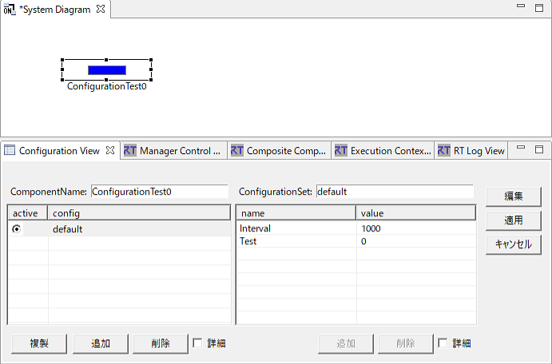
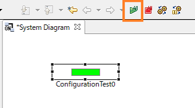
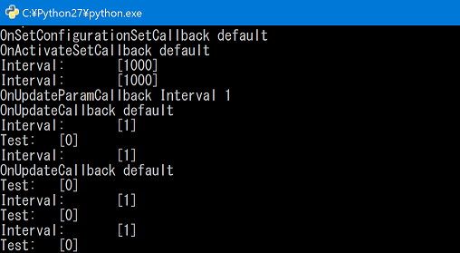
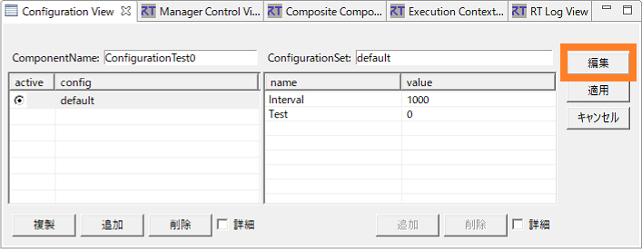
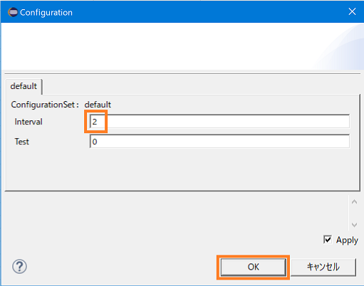
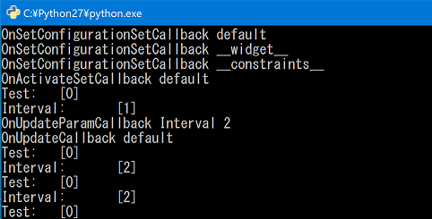
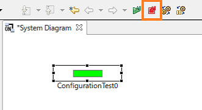
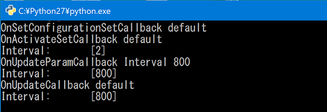
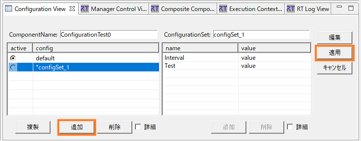

<!-- Title: コンフィギュレーション (応用編) -->
#contents

In Configuration (Basics), we explained the basic usage of configuration. In this advanced section, we explain more in-depth usage.

## Using Callbacks
This section explains the use of callbacks for configuration parameters.<br>
Configuration has the following callbacks.

- OnUpdateCallback
- OnUpdateParamCallback
- OnSetConfigurationSetCallback
- OnAddConfigurationAddCallback
- OnRemoveConfigurationSetCallback
- OnActivateSetCallback

Set callbacks as follows.

### OnUpdateCallback
```
 class MyOnUpdate
 	: public RTC::OnUpdateCallback
 {
 public:
 	MyOnUpdate(ConfigurationTest *obj)
 	{
 		myobj = obj;
	}
	virtual void operator()(const char* config_set)
	{
		RTC::ExecutionContextList_var ecs;
		ecs = myobj->get_owned_contexts();
		ecs[(CORBA::ULong)0]->set_rate(myobj->m_interval);
		std::cout << "OnUpdateCallback\t" << config_set << std::endl;
	}
 private:
 	ConfigurationTest *myobj;
 };
```

### OnUpdateParamCallback
```
 class MyOnUpdateParam
	: public RTC::OnUpdateParamCallback
 {
 public:
	MyOnUpdateParam(ConfigurationTest *obj)
	{
		myobj = obj;
	}
	virtual void operator()(const char* config_set, const char* config_param)
	{
		RTC::ExecutionContextList_var ecs;
		ecs = myobj->get_owned_contexts();
		ecs[(CORBA::ULong)0]->set_rate(myobj->m_interval);
		std::cout << "OnUpdateParamCallback\t" << config_set << "\t" << config_param <<  std::endl;
	}

 private:
	ConfigurationTest *myobj;
 };
```

### OnSetConfigurationSetCallback

```
 class MyOnSetConfigurationSet
	: public RTC::OnSetConfigurationSetCallback
 {
 public:
	MyOnSetConfigurationSet(ConfigurationTest *obj)
	{
		myobj = obj;
	}
	virtual void operator()(const coil::Properties& config_set)
	{
		RTC::ExecutionContextList_var ecs;
		ecs = myobj->get_owned_contexts();
		ecs[(CORBA::ULong)0]->set_rate(myobj->m_interval);
		std::cout << "OnSetConfiguration\t" << config_set.getName() << "\t" << config_set.getValue() << std::endl;
	}

 private:
	ConfigurationTest *myobj;
 };
```

### OnAddConfigurationAddCallback

```
 class MyOnAddConfigurationAdd
	: public RTC::OnAddConfigurationAddCallback
 {
 public:
	MyOnAddConfigurationAdd(ConfigurationTest *obj)
	{
		myobj = obj;
	}
	virtual void operator()(const coil::Properties& config_set)
	{
		RTC::ExecutionContextList_var ecs;
		ecs = myobj->get_owned_contexts();
		ecs[(CORBA::ULong)0]->set_rate(myobj->m_interval);
		std::cout << "OnAddConfigurationAdd\t" << config_set.getName() << "\t" << config_set.getValue() << std::endl;
	}

 private:
	ConfigurationTest *myobj;
 };
```

### OnRemoveConfigurationSetCallback
```
 class MyOnRemoveConfigurationSet
	: public RTC::OnRemoveConfigurationSetCallback
 {
 public:
	MyOnRemoveConfigurationSet(ConfigurationTest *obj)
	{
		myobj = obj;
	}
	virtual void operator()(const char* config_set)
	{
		RTC::ExecutionContextList_var ecs;
		ecs = myobj->get_owned_contexts();
		ecs[(CORBA::ULong)0]->set_rate(myobj->m_interval);
		std::cout << "OnRemoveConfigurationSet\t" << config_set << std::endl;
	}

 private:

	ConfigurationTest *myobj;

 };
```

### OnActivateSetCallback
```
 class MyOnActivateSet
	: public RTC::OnActivateSetCallback
 {

 public:
	MyOnActivateSet(ConfigurationTest *obj)
	{
		myobj = obj;
	}
	virtual void operator()(const char* config_id)
	{
		RTC::ExecutionContextList_var ecs;
		ecs = myobj->get_owned_contexts();
		ecs[(CORBA::ULong)0]->set_rate(myobj->m_interval);
		std::cout << "OnActivateSet\t" << config_id << std::endl;
	}

 private:

	ConfigurationTest *myobj;

 };
```

### Sample
For reference, here is an example in which, when a callback is called, the execution cycle is set to the configuration parameter Interval.
We confirm that the configuration parameter is changed by the callback when transitioning to active and inactive states.

Refer to Configuration (Initial Section) and set the initial parameters.
```
 static const char* configurationtest_spec[] =
  {
    "implementation_id", "ConfigurationTest",
    "type_name",            "ConfigurationTest",
    "description",            "Configuration Test Component",
    "version",                  "1.0.0",
    "vendor",                  "hogehoge",
    "category",               "TEST",
    "activity_type",         "PERIODIC",
    "kind",                     "DataFlowComponent",
    "max_instance",       "1",
    "language",              "C++",
    "lang_type",             "compile",
    // Configuration variables
    "conf.default.Interval",   "1000",
    "conf.default.Test",        "0",
    // Widget
    "conf.__widget__.Interval",   "text",
    "conf.__widget__.Test",        "text",
    // Constraints
    "conf.__constraints__.Interval",    "0 < x < 10000",
    ""
  };
```

```
 RTC::ReturnCode_t ConfigurationTest::onInitialize()
 {
   this->m_configsets.setOnUpdate(new MyOnUpdate(this));
   this->m_configsets.setOnUpdateParam(new MyOnUpdateParam(this));
   this->m_configsets.setOnSetConfigurationSet(new MyOnSetConfigurationSet(this));
   this->m_configsets.setOnRemoveConfigurationSet(new MyOnRemoveConfigurationSet(this));
   this->m_configsets.setOnAddConfigurationSet(new MyOnAddConfigurationAdd(this));
   this->m_configsets.setOnActivateSet(new MyOnActivateSet(this));
 
   bindParameter("Interval", m_interval, "1000");
   bindParameter("Test", m_test, "0");
  
   return RTC::RTC_OK;
 }
```

m_configsets is the ConfigAdmin class (configuration information management object), and callback definitions are in ConfigAdmin.h.

First, start the RTC and place the RTC. The console displays the following.
<div align="center"><a href="ConfigurationCallback01.png"></a></div>
<br>
<div align="center"><a href="ConfigurationCallback01-1.png"></a></div>
<br>
<br>

Next, activate the RTC. The console displays the following.
<div align="center"><a href="ConfigurationCallback05.png"></a></div>
<br>
<div align="center"><a href="ConfigurationCallback02-1.png"></a></div>
<br>

```
 RTC::ReturnCode_t ConfigurationTest::onActivated(RTC::UniqueId ec_id)
 {
    coil::Properties cproperties("default");
    cproperties.setProperty("Interval", "1");
    this->m_configsets.setConfigurationSetValues(cproperties);
    this->m_configsets.activateConfigurationSet("default");
    std::cout << "Interval:\t" << m_interval << std::endl;
    this->m_configsets.update("default","Test");
    std::cout << "Interval:\t" << m_interval << std::endl;
    this->m_configsets.update("default");
    std::cout << "Interval:\t" << m_interval << std::endl;
 
    return RTC::RTC_OK;
 }
```

<br>

Set Interval from "1000" to "1".
```
 cproperties.setProperty("Interval", "1");
```

<br>

Get and add the configuration set. At this time, OnSetConfiguration is called.
```
 this->m_configsets.setConfigurationSetValues(cproperties);
```

<br>

Activate the configuration set. At this time, OnSetActivateSet is called, but the configuration parameter has not yet been changed.
```
 this->m_configsets.activateConfigurationSet("default");
```

<br>

Update only the other configuration parameter, Test. Interval remains "1000".
```
 this->m_configsets.update("default","Test");
```

<br>

Update the configuration set and set Interval to "1".
```
 this->m_configsets.update("default");
```

<br>
<br>

Next, while still activated, change Interval to "2" in RTSystemEditor. The console displays the following.


<div align="center"><div align="center"><a href="ConfigurationCallback03.png"></a></div>;  <div align="center"><a href="ConfigurationCallback04.png"></a></div>;</div>
<br>
<div align="center"><a href="ConfigurationCallback03-1.png"></a></div>
<br>
First, as described above, the updated parameter is added to the configuration set and activated.
The update is performed after onExecute or immediately after onStateUpdate().

<br>
<br>

Next, deactivate the RTC. The console displays the following.

<div align="center"><a href="ConfigurationCallback06.png"></a></div>
<br>
<div align="center"><a href="ConfigurationCallback06-1.png"></a></div>
<br>

```
 RTC::ReturnCode_t ConfigurationTest::onDeactivated(RTC::UniqueId ec_id)
 {
    coil::Properties cproperties("default");
    cproperties.setProperty("Interval", "800");
    this->m_configsets.setConfigurationSetValues(cproperties);
    this->m_configsets.activateConfigurationSet("default");
    std::cout << "Interval:\t" << m_interval << std::endl;
    this->m_configsets.update("default","Interval");
    std::cout << "Interval:\t" << m_interval << std::endl;
    this->m_configsets.update("default");
    std::cout << "Interval:\t" << m_interval << std::endl;
 
   return RTC::RTC_OK;
 }
```

The differences from when it was activated are the part where Interval is set to 800, and the part where only Interval is updated with m_configsets.update("default","Interval").
This time, you can confirm that the value is updated by m_configsets.update("default","Interval").

<br>
<br>

Next, add a configuration set in RTSyetemEditor.
After clicking the [Add] button in the figure, click the [Apply] button to call OnAddConfigurationAddCallback.
The console displays the following.

<div align="center"><a href="ConfigurationCallback07.png"></a></div>
<br>
<div align="center"><a href="ConfigurationCallback07-1.png"></a></div>
<br>

Similarly, you can call OnRemoveConfigurationSetCallback by deleting a configuration set.

<br>

Basically, parameter changes are not reflected even if configuration parameters are changed externally until an RTC activity is called, but using callbacks makes it possible to configure various settings.

