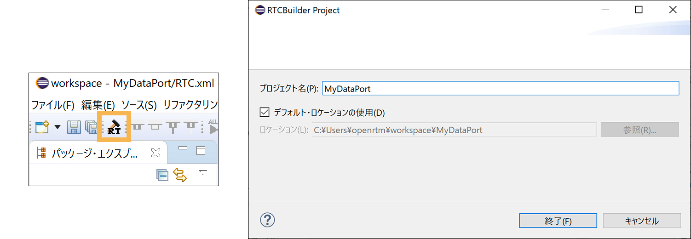
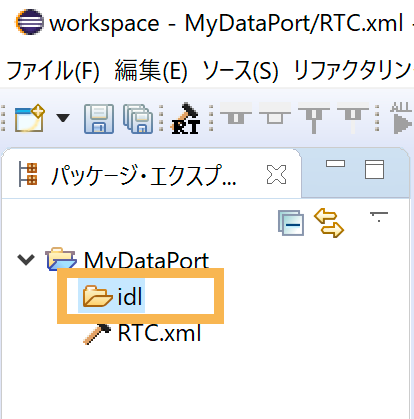
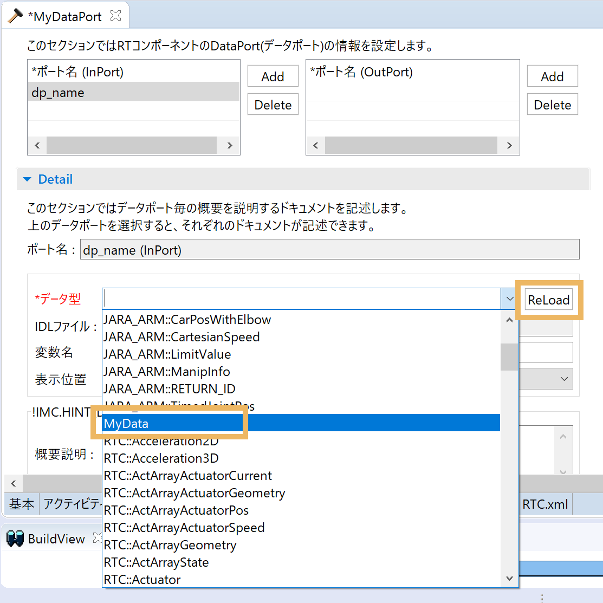

<!-- Title: データポート (応用編) -->
<!-- -*- pukiwiki-edit -*- -->
<!-- *データポート(応用編) -->

#contents

In Data Port (Basics), we explained the basic usage of data ports. In this advanced section, we explain more in-depth usage.

<!-- ------------------------------------------------------------ -->
<!-- inaba **独自データ型の利用 -->
## Using Data Types

In data ports, in addition to predefined data types (for example, TimedLong, TimedDouble, etc.), you can also use data types that you define yourself.
However, before creating a new data type yourself, we recommend checking whether a similar data type has already been defined, and defining a new data type only if the required data type is not among them.

In OpenRTM-aist, the data types used for data ports are defined in the following IDL files.

- BasicDataType.idl
- ExtendedDataTypes.idl
- InterfaceDataTypes.idl

The storage locations are as follows. This is called the IDL directory.
- For UNIX: {prefix}/include/rtm/idl,{prefix}/include/openrtm-x.y/rtm/idl ({prefix} is /usr/, /usr/local/, /opt/local/, etc.)
- For Windows: {ProgramFiles}/OpenRTM-aist/x.y/rtm/idl, etc. ({Program Files} is C:/ProgramFiles, C:/Program Files (x86), etc.)

<!-- (場所は UNIXなら {prefix}/include/rtm/idl,{prefix}/include/openrtm-x.y/rtm/idl, Windowsなら {ProgramFiles}/OpenRTM-aist/x.y/rtm/idl など。{prefix}はインストールprefix(/usr/, /usr/local/, /opt/local/ など), {Program Files} は C:/ProgramFiles, C:/Program Files (x86)などです。これを IDL ディレクトリーと呼びます。) -->


<!-- inaba*** IDLファイルの作成 -->
### Creating an IDL File for a Custom Data Type

Create an IDL file that defines the data type. Data types are defined with the struct keyword. The following basic types, string types, and sequence types can be used.

<table class="table-alt">
  <tr>
    <th>Type</th>
    <th>Meaning</th>
    <th>Declaration Example</th>
  </tr>
  <tr>
    <td>short</td>
    <td>short-type integer</td>
    <td>short shortVariable;</td>
  </tr>
  <tr>
    <td>long</td>
    <td>long-type integer</td>
    <td>long longVariable;</td>
  </tr>
  <tr>
    <td>unsinged short</td>
    <td>short-type integer</td>
    <td>unsigned short ushortVariable;</td>
  </tr>
  <tr>
    <td>unsigned long</td>
    <td>long-type integer</td>
    <td>unsigned long ulongVariable;</td>
  </tr>
  <tr>
    <td>float</td>
    <td>Single-precision floating point</td>
    <td>float floatVariable;</td>
  </tr>
  <tr>
    <td>double</td>
    <td>Double-precision floating point number</td>
    <td>double doubleVariable;</td>
  </tr>
  <tr>
    <td>char</td>
    <td>Character type</td>
    <td>char charVariable;</td>
  </tr>
  <tr>
    <td>wchar</td>
    <td>wchar character type</td>
    <td>char charVariable;</td>
  </tr>
  <tr>
    <td>boolean</td>
    <td>bool type</td>
    <td>bool shortVariable;</td>
  </tr>
  <tr>
    <td>octet</td>
    <td>octet type</td>
    <td>octet octetVariable;</td>
  </tr>
  <tr>
    <td>longlong</td>
    <td>longlong-type integer</td>
    <td>longlong longlongVariable;</td>
  </tr>
  <tr>
    <td>ulonglong</td>
    <td>unsinged longlong-type integer</td>
    <td>ulonglong ulonglongVariable;</td>
  </tr>
  <tr>
    <td>sequence &lt;T&gt;</td>
    <td>Sequence type</td>
    <td>sequence &lt;double&gt; doubleSeqVariable;</td>
  </tr>
</table>

Here, we will define a data type named MyData in MyDataType.idl.
Spaces are added at the beginning for display purposes, but they are unnecessary when actually using the IDL file, so remove them.

```
 // @file MyDataType.idl
 #include "BasicDataType.idl"

 module MyModule
{
  struct MyData
 {
    RTC::Time tm;
    short shortVariable;
    long longVariable;
    sequence<double> data;
 };
};
```

On the second line,
```
 #include "BasicDataType.idl"
```
is necessary in order to use the very first field tm (RTC::Time type) of the MyData type.
Unless there is a particular reason, even for custom data types, declare the first field as RTC::Time tm; to store the timestamp.
Also, module MyModule specifies the namespace. When defining a data type, always define an appropriate namespace and define the data type inside it.

<!-- inaba 上記内容のファイルを、C:\UserDefTypeフォルダーに作成します。 -->

<!-- 3行目はダミーの interface 定義です。これは RTCBuilder で読み込ませるために必要です。(RTCBuilderの将来のバージョンではこれは不要になるかもしれません。) -->
<!--  -->
<!-- interface dummy {}; -->

<!-- *** IDLファイルのコピー -->
<!--  -->
<!-- BasicDataType.idl など OpenRTM-aist で定義されている IDLファイルをインクルードする場合は、上記 BasicDataType.idl などが入っているディレクトリーからユーザー定義の IDLファイルが格納されているフォルダーに IDLファイルをコピーします。 -->
<!-- （BasicDataType.idlをC:\UserDefTypeにコピー） -->
<!--  -->
<!-- BasicDataType.idl 保存場所の例は以下のとおりです。 -->
<!-- - UNIX の場合： {prefix}/include/rtm/idl,{prefix}/include/openrtm-x.y/rtm/idl　( {prefix} は /usr/, /usr/local/, /opt/local/ など ) -->
<!-- - Windows の場合： {ProgramFiles}/OpenRTM-aist/x.y/rtm/idl など。( {Program Files} は C:/ProgramFiles, C:/Program Files (x86)など) -->


<!-- inaba *** RTCBuilder での確認 -->

<!-- &color(red){※ 新規プロジェクトを作成する際には、”デフォルト・ロケーションの使用(D)”のチェックを外し、先程作成したフォルダー(C:\UserDefType)を指定します。}; -->

<!-- #ref(data_port_01.png,100%,center) -->
<!-- CENTER: ロケーションに「UserDefType」 指定 -->

<!-- inaba RTCBuilder で以下のことを確認します。 -->

<!-- inaba データポート設定タブを開き、''Detail'' の ''*データ型'' のプルダウンをクリックし、MyData があるかどうか確認します。 -->

<!-- inaba #ref(data_port_03.png,100%,center) -->
<!-- inaba CENTER: Detail のデータ型 -->

<!-- inaba もし見つからなければ以下のことを確認します。 -->

<!-- - MyData.idl が BasicDataType.idl などが入っているディレクトリーにコピーされているか？ -->
<!-- inaba - Eclipse の [ウィンドウ] > [設定] > [RTCBUilder] > [データ型: IDLFile Directories] にユーザー定義の IDLファイルが入っているディレクトリー(C:\UserDefType)が設定されているかを確認します。設定されていなければ、MyDataType.idl が入っているディレクトリーを「新規」から追加し、Eclipse を再起動します。 -->

<!-- inaba #ref(data_port_02.png,100%,center) -->
<!-- inaba CENTER: MyData が表示されていない場合 -->

### Creating a Project with RTC Builder

Create a project with RTCBuilder.

Click the "RTC Builder Project" icon, enter the project name in the displayed window, and click "Finish"; the generated project file will appear in the window on the left.
<div align="center"><a href="idl_00000.png"></a></div>
<div align="center">Display the "RTC Builder Project" window</div>

<div align="center"><a href="idl_002.png"></a></div>
<div align="center">Checking the idl folder</div>

There is an idl folder where custom data types are placed, so place the custom data type IDL file (MyDataType.idl) there by drag and drop, [right-click] > [Paste], or similar.

If you proceeded with the default in "Select a directory as workspace" displayed immediately after starting RTCBuilder, the project folder is under the [ c:\Users\user name\workspase ] folder.

<!-- idlディレクトリ下に独自データ型のIDLファイル（MyDataType.idl）を置いてください。 -->

### Creating a Data Port

Create a component using an IDL custom data type with RTCBuilder.

Open the data port settings tab and define the data ports (InPort/OutPort).

If you want to use a custom data type in the created data port, click [Reload]; MyDataType.idl in the idl folder will be loaded, and the newly defined MyData can be selected from the ***Data Type** dropdown.

<div align="center"><a href="idl_000.png"></a></div>
<div align="center">Click [Reload] and select the MyData data type</div>

<!-- inaba RTCBuilder でコンポーネントの作成を行います。 -->
<!-- inaba データポート設定タブでは、新たに定義した MyData 型が選択できるようになっているので、新規データポート (InPort もしくは OutPort) を作成、データポート名とデータ型を設定します。 -->

<!-- inaba #ref(data_port_03.png,100%,center) -->
<!-- inaba CENTER: MyData のデータ型 -->
<!-- inaba CENTER: Detail のデータ型 -->

After setting the other items required to create the component, return to the Basic tab and click the [Generate Code] button to generate the code.


<!-- *** プロジェクトディレクトリーへの IDL のコピー -->
<!--  -->
<!-- コード生成によってできたプロジェクトのディレクトリーへ先ほどの MyDataType.idl をコピーします。 -->


<!-- *** Windows での作業 -->

<!-- Windows では、プロジェクトディレクトリー内にある IDLファイルを自動的にコンパイルするようになっていますので、RTコンポーネントを試しに1度コンパイルします。 -->
<!-- すると、MyDataTypeSkel.h や MyDataTypeSkel.cpp などのファイルが生成されます。 -->
<!-- ただし、MyData を宣言したヘッダファイルがインクルードされていないので、コンポーネントのコンパイルには失敗するはずです。 -->

<!-- *** Linux での作業 -->
<!-- Makefile.<コンポーネント名> 中の SKEL_OBJ にオブジェクトファイルを指定します。(既に以下のような記述がある場合は不要。) -->

<!-- STUB_OBJ = MyDataTypeStub.o -->

<!-- こうすることで、MydataType のスタブオブジェクトがコンポーネントにリンクされます。 -->
<!-- また、MyDataType.idl から MyDataTypeStub.h と MyDataTypeStub.cpp を生成するための以下の行を追加します。(既に以下のような記述がある場合は不要。) -->

<!-- MyDataTypeStub.cpp : MyDatatype.idl -->
<!-- $(IDLC) $(IDLFLAGS) $< -->
<!-- $(WRAPPER) $(WRAPPER_FLAGS) --idl-file=$< -->
<!-- MyDataTypeStub.h : MyDatatype.idl -->
<!-- $(IDLC) $(IDLFLAGS) $< -->
<!-- $(WRAPPER) $(WRAPPER_FLAGS) --idl-file=$< -->
<!-- MyDataTypeStub.o: MyDataTypeStub.cpp MyDataTypeStub.h -->
<!-- $(CXX) $(CXXFLAGS) -c -o $@ $< -->

<!-- これらにより、MyDatatype.idl から MyDataTypeStub.cpp MyDataTypeStub.h が作成され、MyDataTypeStub.cpp MyDataTypeStub.h から MyDataTypeStub.o が作成されます。 -->

<!-- *** ヘッダの編集 -->
<!--  -->
<!-- コンポーネントのヘッダファイル (コンポーネント名が MyComponent の場合 MyComponent.h) をエディタで開き、以下のように MyDataTypeStub.h をインクルードします。 -->
<!--  -->
<!-- // Service Consumer stub headers -->
<!-- // <rtc-template block="consumer_stub_h"> -->
<!-- #include <MyDatatypeStub.h> -->
<!--  -->
<!-- // </rtc-template> -->

<!-- *** ビルド -->

<!-- ここまで終了したら、再度ビルドしてみます。 -->
<!-- エラーなどなくビルドが終了するはずです。 -->


<!-- ------------------------------------------------------------ -->
## Using Data Port and Connector Callbacks

As described earlier, an InPort checks whether data has arrived with isNew() and reads it with read(), while an OutPort sends data with write().

For example, after data arrives at an InPort, the data cannot be obtained until isNew() is called and read() is called inside a function such as onExecute().
Even if the onExecute() cycle is very fast, the timing at which data arrives at the InPort and the timing at which processing is actually performed are asynchronous.

What should you do if you want processing to be performed immediately after data arrives, that is, synchronously? To achieve this, OpenRTM-aist defines callbacks that are called at various processing timings of data ports and connectors.

Callbacks are broadly divided into four types: 1) InPort, 2) OutPort, 3) connector, and 4) port callbacks.

<!-- ------------------------------------------------------------ -->
### InPort Callbacks

The following two types of callbacks are provided for InPort.
They are defined in rtm/PortCallback.h.

<table class="table-alt">
  <tr>
    <td>OnRead</td>
    <td>Called when InPort read() is called. Set with the InPort::setOnRead() function.</td>
  </tr>
  <tr>
    <td>OnReadConvert</td>
    <td>Called to convert data when InPort read() is called. Set with the InPort::setOnReadConvert() function.</td>
  </tr>
</table>

The OnRead callback is used when read() is called, and OnReadConvert is a callback used to return data that has undergone some kind of conversion to the caller when read() is called.

Each callback is implemented by inheriting from the corresponding functor base class defined in rtm/PortCallback.h.

>A functor makes an object callable with syntax similar to an ordinary function. In C++, this can be achieved by overloading operator(). In C, callbacks are implemented by giving the caller a function pointer, but with only function pointers, it is difficult to give state variables to the callback itself. Since a functor is itself an object, it can have state variables and can be called in the same way as a C function.

Implementation examples are shown below.

```
 #include <rtm/Portcallback.h>

 template <class T>
 class MyOnRead
  : public RTC::OnRead<T>
{
 public:
   MyOnRead(std::ostream& os) : m_os(os) {};
   virtual void operator()()
  {
     m_os      << "read() 関数が呼ばれました。" << std::endl;
     std::cout << "read() 関数が呼ばれました。" << std::endl;
  }
 private:
   std::ostream& m_os;
};

 template <class T> 
 class MyOnReadConvert
  : public RTC::OnReadConvert<T>
{
 public:
   virtual T operator()(const T& value)
  {
     T tmp;
     tmp.data = value.data * value.data;
     return tmp;
  }
};
```

In the MyOnRead functor, which inherits from OnRead, an output stream std::ostream is passed in the constructor. This is intended to receive a file output stream std::ofstream or similar that has been opened somewhere.
In operator()(), which is the actual body of the functor, a string is output to the output stream and to standard output. In this way, by passing state variables in advance through the constructor or similar, functors can also call other objects.

On the other hand, MyOnReadConvert, which inherits from OnReadConvert<T>, implements only operator()(constT&). The argument of this function receives the data before it is read into the InPort variable when read() is called.
Data processed in some way inside this function and returned with return is written to the InPort variable. In this example, the square is calculated and returned on the assumption that the data type has a member named data and that the multiplication operator is defined.
If a variable type without an appropriate member is used, a compile error will occur.

Now, let us actually incorporate this functor into a component. As a sample that uses InPort, we will use ConsoleOut, a sample included in OpenRTM-aist. When the OpenRTM-aist source is extracted, ConsoleOut is under

```
 OpenRTM-aist-<version>/examples/SimpleIO/
```

and when installed from a package on Linux or similar systems, the source code is under

```
 /usr/share/OpenRTM-aist/examples/src/
```

First, write the above class definitions in ConsoleOut.h. Class definitions should originally be written in another source file, but since the functor classes are used only within this component and their contents are short, in such cases it is acceptable to define them including the implementation in the header.

```
 // ConsoleOut.h

  中略
 // Service Consumer stub headers
 // <rtc-template block="consumer_stub_h">

 // </rtc-template>

 using namespace RTC; 

 // ここから追加分
 template <class T>
 class MyOnRead

  : public RTC::OnRead<T>
{
 public:
   MyOnRead(std::ostream& os) : m_os(os) {};
   virtual void operator()()
  {
     m_os      << "read() 関数が呼ばれました。" << std::endl;
     std::cout << "read() 関数が呼ばれました。" << std::endl;
  }
 private:
   std::ostream& m_os;
};

 template <class T> 
 class MyOnReadConvert

  : public RTC::OnReadConvert<T>

{
 public:
   virtual T operator()(const T& value)
  {
     T tmp;
     tmp.data = value.data * value.data;
     return tmp;
  }
};
 // ここまで追加分

 class ConsoleOut

   : public RTC::DataFlowComponentBase

{

  中略

  protected:
   // DataInPort declaration
   // <rtc-template block="inport_declare">
   TimedLong m_in;
   InPort<TimedLong> m_inIn;

  中略

  private:
   //ここから追加分
   MyOnRead<TimedLong>* m_onread;
   MyOnReadConvert<TimedLong>* m_onreadconv;
   //ここまで追加分
};
```

First, before the declaration of the ConsoleOut class, declare the callback functors MyOnRead and MyOnReadConvert.
To have pointer variables for these classes as members, declare each pointer variable in the private section.
At this time, note that both MyOnRead and MyOnReadConvert are given TimedLong as the class template type argument, the same as the type of this component's InPort.


<!-- ------------------------------------------------------------ -->
### OutPort Callbacks

The following two types of callbacks are provided for OutPort.
They are defined in rtm/PortCallback.h.

<table class="table-alt">
  <tr>
    <td>OnWrite</td>
    <td>Called when OutPort write() is called. Set with the OutPort::setOnWrite() function.</td>
  </tr>
  <tr>
    <td>OnWriteConvert</td>
    <td>Called to convert data when OutPort write() is called. Set with the OutPort::setOnWriteConvert() function.</td>
  </tr>
</table>

The OnWrite callback is used when write() is called, and OnWriteConvert is used to send data that has undergone some kind of conversion when write() is called.

As with InPort, each callback is implemented by inheriting from the corresponding functor base class defined in rtm/PortCallback.h.

Implementation examples are shown below.

```
 #include <rtm/Portcallback.h>

 template <class T>
 class MyOnWrite

  : public RTC::OnWrite<T>

{
 public:
   MyOnWrite(std::ostream& os) : m_os(os) {};
   virtual void operator()()
  {
     m_os      << "write() 関数が呼ばれました。" << std::endl;
     std::cout << "write() 関数が呼ばれました。" << std::endl;
  }
 private:
   std::ostream& m_os;
};

 template <class T> 
 class MyOnWriteConvert

  : public RTC::OnWriteConvert<T>

{
 public:
   virtual T operator()(const T& value)
  {
     T tmp;
     tmp.data = 2 * value.data;
     return tmp;
  }
};
```

The way to write functors for callbacks is almost the same as InPort OnRead/OnReadConvert. In the MyOnWrite functor, which inherits from OnWrite, an output stream std::ostream is passed in the constructor.
This is intended to receive a file output stream std::ofstream or similar that has been opened somewhere. In operator(), which is the actual body of the functor, a string is output to the output stream and to standard output.
In this way, by passing state variables in advance through the constructor or similar, functors can also call other objects.

On the other hand, MyOnReadConvert, which inherits from OnReadConvert<T>, implements only operator()(constT&). The argument of this function receives the data before it is read into the InPort variable when read() is called. Data processed in some way inside this function and returned with return is written to the InPort variable.
In this example, the square is calculated and returned on the assumption that the data type has a member named data and that the multiplication operator is defined. If a variable type without an appropriate member is used, a compile error will occur.

### Connector and Buffer Callbacks

#### Connector

A connector is an object that abstracts a buffer and communication path. As shown in the figure, it exists between an OutPort and an InPort; data is written from the OutPort by the write() function, and data is read from the InPort by the read() function.
The connector abstracts and hides how data is transmitted from the OutPort to the InPort.


For the buffer inside the connector, an OutPort can:
- write data,
- perform various controls (readback, access to unread data, etc.),
- notify or receive notification of buffer full status and timeouts.
- read data,
- perform various controls (readback, access to unread data, etc.),
- notify or receive notification of buffer empty status and timeouts.

An OutPort can be connected to multiple InPorts, and one connector is generated for each connection. (In practice, an InPort can also have multiple connections at the same time, but this is not normally used because there is no way to distinguish the data.) 
In other words, if there are three connections, there are three connectors, and each has its own write status.

It can also be seen that for these functions, one connector must exist for each OutPort/InPort pair.
Furthermore, when modeling connectors at the implementation level corresponding to subscription types, an object called a publisher was introduced for asynchronous communication.

When a data port connection is established, one connector object is generated for each connection. A connector is an abstract channel of the data stream that connects an OutPort and an InPort.

<table class="table-alt">
  <tr>
    <td>ON_BUFFER_WRITE</td>
    <td>When writing to the buffer</td>
  </tr>
  <tr>
    <td>ON_BUFFER_FULL</td>
    <td>When the buffer is full</td>
  </tr>
  <tr>
    <td>ON_BUFFER_WRITE_TIMEOUT</td>
    <td>When buffer write times out</td>
  </tr>
  <tr>
    <td>ON_BUFFER_OVERWRITE</td>
    <td>When overwriting the buffer</td>
  </tr>
  <tr>
    <td>ON_BUFFER_READ</td>
    <td>When reading from the buffer</td>
  </tr>
  <tr>
    <td>ON_SEND</td>
    <td>When sending to InProt</td>
  </tr>
  <tr>
    <td>ON_RECEIVED</td>
    <td>When sending to InProt is complete</td>
  </tr>
  <tr>
    <td>ON_RECEIVER_FULL</td>
    <td>When the InProt-side buffer is full</td>
  </tr>
  <tr>
    <td>ON_RECEIVER_TIMEOUT</td>
    <td>When the InProt-side buffer times out</td>
  </tr>
  <tr>
    <td>ON_RECEIVER_ERROR</td>
    <td>When an error occurs on the InProt side</td>
  </tr>
</table>

<table class="table-alt">
  <tr>
    <td>ON_BUFFER_EMPTY</td>
    <td>When the buffer is empty</td>
  </tr>
  <tr>
    <td>ON_BUFFER_READTIMEOUT</td>
    <td>When the buffer is empty and times out</td>
  </tr>
  <tr>
    <td>ON_SENDER_EMPTY</td>
    <td>OutPort-side buffer is empty</td>
  </tr>
  <tr>
    <td>ON_SENDER_TIMEOUT</td>
    <td>When the OutPort side times out</td>
  </tr>
  <tr>
    <td>ON_SENDER_ERROR</td>
    <td>When an error occurs on the OutPort side</td>
  </tr>
  <tr>
    <td>ON_CONNECT</td>
    <td>When a connection is established</td>
  </tr>
  <tr>
    <td>ON_DISCONNECT</td>
    <td>When a connection is disconnected</td>
  </tr>
</table>

### Port Callbacks
#### Status
Data ports return a status when sending or receiving data.
Statuses are defined in rtm/DataPortStatus.h.

<table class="table-alt">
  <tr>
    <td>PORT_OK</td>
    <td>Normal completion</td>
  </tr>
  <tr>
    <td>PORT_ERROR</td>
    <td>Abnormal completion</td>
  </tr>
  <tr>
    <td>BUFFER_ERROR</td>
    <td>Buffer error</td>
  </tr>
  <tr>
    <td>BUFFER_FULL</td>
    <td>Buffer full</td>
  </tr>
  <tr>
    <td>BUFFER_EMPTY</td>
    <td>Buffer empty</td>
  </tr>
  <tr>
    <td>BUFFER_TIMEOUT</td>
    <td>Buffer timeout</td>
  </tr>
  <tr>
    <td>SEND_FULL</td>
    <td>Data was sent, but the peer side is in a buffer-full state</td>
  </tr>
  <tr>
    <td>SEND_TIMEOUT</td>
    <td>Data was sent, but the peer side timed out</td>
  </tr>
  <tr>
    <td>RECV_EMPTY</td>
    <td>Data was sent, but the data is empty</td>
  </tr>
  <tr>
    <td>RECV_TIMEOUT</td>
    <td>An attempt was made to receive data, but it timed out</td>
  </tr>
  <tr>
    <td>INVALID_ARGS</td>
    <td>Invalid argument</td>
  </tr>
  <tr>
    <td>PRECONDITION_NOT_MET</td>
    <td>Precondition not met</td>
  </tr>
  <tr>
    <td>CONNECTION_LOST</td>
    <td>Connection was disconnected</td>
  </tr>
  <tr>
    <td>UNKNOWN_ERROR</td>
    <td>Unknown error</td>
  </tr>
</table>

These error codes are used to convey error information from the location where an error occurred on the data path of the data port to the caller.
Mainly, errors on the transmission path, errors at the transmission destination, and similar errors can be considered. Errors that occur in each part are shown below.
<br>

- Push type
  - Return codes that occur between InPortConsumer and Publisher/Activity
<br>
PORT_OK, PORT_ERROR, SEND_FULL, SEND_TIMEOUT, CONNECTION_LOST, UNKNOWN_ERROR
  - Return codes that occur between Activity and the OutPort Buffer/Connector
<br>
PORT_OK, PORT_ERROR, BUFFER_ERROR, BUFFER_FULL, BUFFER_TIMEOUT, UNKNOWN_ERROR
- Pull type
  - Return codes that occur between Activity and InPort
<br>
PORT_OK, PORT_ERROR, RECV_EMPTY, RECV_TIMEOUT, CONNETION_LOST, UNKNOWN_ERROR

<br>

## Creating a Custom Data Port Interface
An example of creating a custom data port interface is shown.

The following functions and classes must be defined.

- Provider class (InPortTestProvider)
- Consumer class (InPortTestConsumer)
- Provider and consumer registration function (InPortTestInterfaceInit)

### Provider Class (InPortTestProvider)
This is the provider class for the data port interface (Push type).
When the put function is called on the consumer side, data must be transferred to the provider side by some method.
In this sample, data is transferred by writing data to a file when the put function is called on the consumer side, and reading the data from the file on the provider side.

```
 //InPortTestProvider.cpp

 #include "InPortTestProvider.h"
 #ifdef WIN32
 #pragma warning( disable : 4290 )
 #endif

 namespace RTC
{
   InPortTestProvider::InPortTestProvider(void)

	  : m_buffer(0), m_running(true), m_filename("data.dat")

 {
    setInterfaceType("test");
    activate();
 }
 
  InPortTestProvider::~InPortTestProvider(void)
 {
	  m_running = false;
	  wait();
 }

  //プロバイダ生成時に呼び出される関数
  //コネクタプロファイル、ポートのプロパティの情報を受け取る
  void InPortTestProvider::init(coil::Properties& prop)
 {
 }

  void InPortTestProvider::
  setBuffer(BufferBase<cdrMemoryStream>* buffer)
 {
    m_buffer = buffer;
 }

  void InPortTestProvider::setListener(ConnectorInfo& info, ConnectorListeners* listeners)
 {
    m_profile = info;
    m_listeners = listeners;
 }

  void InPortTestProvider::setConnector(InPortConnector* connector)
 {
    m_connector = connector;
 }

  //別スレッドにより実行される関数
  //周期的にファイルからデータを読み込んでバッファに書き込む
  //この関数はこのサンプルでは必要ですが、独自インターフェースを作成するうえで
  //必須ではありません
  int InPortTestProvider::svc()
 {
     coil::sleep(1);
     while (m_running)
    {

	  std::ifstream  fin;
	  fin.open(m_filename, std::ios::in | std::ios::binary);

          if (fin)
         {
               while (!fin.eof())
              {
                    int data_size = 0;
                    fin.read((char*)&data_size, sizeof(int));
                    if (data_size > 0)
                   {
                        CORBA::OctetSeq data;
                        data.length(data_size);
                        fin.read((char*)&data[0], data_size);

                        //cdrMemoryStream型変数にデータを格納してバッファに書き込む
                        //以下の記述方法はomniORB特有なため、TAOやORBexpressに対応する場合は
                        //分ける必要がある
                        cdrMemoryStream cdr;
                        //エンディアンの設定を行う
                        bool endian_type = m_connector->isLittleEndian();
                        cdr.setByteSwapFlag(endian_type);
                        //データを書き込む
                        cdr.put_octet_array(&(data[0]), data.length());
                        //バッファに書き込む
                        m_buffer->write(cdr);
                   }
              }
               fin.close();

	  }

    }
     return 0;
 }

  //コネクタ接続時に呼び出される関数
  //この関数はコンシューマ側のsubscribeInterface関数よりも前に呼び出される
  //このため、publishInterface関数で設定した情報をコンシューマ側のsubscribeInterface関数で
  //取得することができる
  //何か問題があった時はfalseを返してコネクタを切断する
  bool InPortTestProvider::

	  publishInterface(SDOPackage::NVList& properties)

  {
        //データを書き込むファイル名の情報を格納する
        CORBA_SeqUtil::
                  push_back(properties,
                  NVUtil::newNV("dataport.test.filename", m_filename.c_str()));

	return true;

  }
};

 extern "C"
{
     //この関数をモジュールロード時に呼び出す必要がある
    void InPortTestProviderInit(void)
   {
         RTC::InPortProviderFactory& factory(RTC::InPortProviderFactory::instance());
         factory.addFactory("test",

                       ::coil::Creator< ::RTC::InPortProvider,
                                        ::RTC::InPortTestProvider>,
                       ::coil::Destructor< ::RTC::InPortProvider,
                                           ::RTC::InPortTestProvider>);

    }
};
```

<br>

This is the consumer class for the data port interface (Push type). It must inherit InPortProvider.
Inheritance from the Task class is specific to this sample and is not mandatory.

```
 //InPortTestProvider.h

 #ifndef RTC_INPORTTESTPROVIDER_H
 #define RTC_INPORTTESTPROVIDER_H
 #include <rtm/BufferBase.h>
 #include <rtm/InPortProvider.h>
 #include <rtm/CORBA_SeqUtil.h>
 #include <rtm/Manager.h>
 #include <rtm/ConnectorListener.h>
 #include <rtm/ConnectorBase.h>
 #include <fstream>
 #ifdef WIN32
 #pragma warning( disable : 4290 )
 #endif

 namespace RTC
{
    class InPortTestProvider

      : public InPortProvider,
	public coil::Task

   {
    public:
       InPortTestProvider(void);
       virtual ~InPortTestProvider(void);
       virtual void init(coil::Properties& prop);
       virtual void setBuffer(BufferBase<cdrMemoryStream>* buffer);
       virtual void setListener(ConnectorInfo& info,
                             ConnectorListeners* listeners);
       virtual void setConnector(InPortConnector* connector);
       virtual bool publishInterface(SDOPackage::NVList& properties);
       virtual int svc();

  private:
      CdrBufferBase* m_buffer;
      ConnectorListeners* m_listeners;
      ConnectorInfo m_profile;
      InPortConnector* m_connector;
      bool m_running;
      std::string m_filename;
  }; 
};

 extern "C"
{

	DLL_EXPORT void InPortTestProviderInit(void);

};

 #ifdef WIN32
 #pragma warning( default : 4290 )
 #endif
 #endif
```

<br>

### Consumer Class (InPortTestConsumer)
This is the consumer class for the data port interface (Push type). In the Push type, a consumer is generated on the InPort side and a provider is generated on the OutPort side.
When the put function is called on the consumer side, data must be transferred to the provider side by some method.
In this sample, data is transferred by writing data to a file when the put function is called on the consumer side, and reading the data from the file on the provider side.

```
 //InPortTestConsumer.cpp

 #include <rtm/NVUtil.h>
 #include "InPortTestConsumer.h"

 namespace RTC
{
    InPortTestConsumer::InPortTestConsumer(void)

    : rtclog("InPortTestConsumer")

   {
   }
 
    InPortTestConsumer::~InPortTestConsumer(void)
   {
       RTC_PARANOID(("~InPortTestConsumer()"));
   }

    //コネクタプロファイル、ポートのプロパティの情報を受け取る
    void InPortTestConsumer::init(coil::Properties& prop)
   {
       m_properties = prop;
   }
 
    //データ転送時に呼び出される関数
    //put関数内でプロバイダ側にデータを転送する処理を記述する
    InPortConsumer::ReturnCode InPortTestConsumer::

	  put(const cdrMemoryStream& data)

   {
         RTC_PARANOID(("put()"));

         //このサンプルでは、コンシュマー側でファイルにデータを書き込んで、プロバイダ側で
         //ファイル内のデータを読み込むことにしている
         //バイナリファイルを開く
         m_file.open(m_filename, std::ios::out | std::ios::binary | std::ios::trunc);
         //データサイズと生データをファイルに書き込む
         int data_size = data.bufSize();	
         m_file.write((char*)&data_size, sizeof(int));
         m_file.write((char*)data.bufPtr(), data_size);
         //ファイルを閉じる
         m_file.close();

         return PORT_OK;
     }

      //コネクタ接続時に呼び出される関数
      //この関数はプロバイダ側のpublishInterface関数よりも後に呼び出される
      //このため、プロバイダ側のpublishInterface関数で設定した情報を取得することができる
      //return: 何か問題があった時はfalseを返してコネクタを切断する

      bool InPortTestConsumer::
      subscribeInterface(const SDOPackage::NVList& properties)
     {
          //プロバイダ側で設定したファイル名を取得する
          CORBA::Long index = NVUtil::find_index(properties,
                                          "dataport.test.filename");
          const char* filename(0);
          properties[index].value >>= filename;

          //取得したファイル名のファイルを開く
          m_filename = filename;
          m_file.open(m_filename, std::ios::out | std::ios::binary | std::ios::trunc);
          m_file.close();
 
         return true;
    }
 
     //コネクタ切断時に呼び出される関数
     void InPortTestConsumer::
     unsubscribeInterface(const SDOPackage::NVList& properties)
    {
    }

     void InPortTestConsumer::publishInterfaceProfile(SDOPackage::NVList& properties)
    {
    }
};

 extern "C"
{ 
     //コンシューマ登録関数
     //この関数をモジュールロード時に呼び出す必要がある
     void InPortTestConsumerInit(void)
   {
        RTC::InPortConsumerFactory& factory(RTC::InPortConsumerFactory::instance());
        factory.addFactory("test",

                       ::coil::Creator< ::RTC::InPortConsumer,
                                        ::RTC::InPortTestConsumer>,
                       ::coil::Destructor< ::RTC::InPortConsumer,
                                           ::RTC::InPortTestConsumer>);

    }
};
```

<br>

This is the consumer class for the data port interface (Push type). It must inherit InPortConsumer.

```
 //InPortTestConsumer.h

 #ifndef RTC_INPORTTESTCONSUMER_H
 #define RTC_INPORTTESTCONSUMER_H
 #include <rtm/InPortConsumer.h>
 #include <rtm/Manager.h>
 #include <fstream>

 namespace RTC
{
     class InPortTestConsumer

       : public InPortConsumer

   {
       public:
        DATAPORTSTATUS_ENUM
        InPortTestConsumer(void);
        virtual ~InPortTestConsumer(void);
        virtual void init(coil::Properties& prop);
        virtual ReturnCode put(const cdrMemoryStream& data);
        virtual void publishInterfaceProfile(SDOPackage::NVList& properties);
        virtual bool subscribeInterface(const SDOPackage::NVList& properties);
        virtual void unsubscribeInterface(const SDOPackage::NVList& properties);

      private:
        mutable Logger rtclog;
        coil::Properties m_properties;
        std::ofstream  m_file;
        std::string m_filename;
  };
};

 extern "C"
{

	DLL_EXPORT void InPortTestConsumerInit(void);

};
 #endif
```

<br>

### Provider and Consumer Registration Function (InPortTestInterfaceInit)
When the OpenRTM-aist manager loads a dynamic link library named "XXX.dll", it calls the "XXXInit" function.
In this sample, it loads "InPortTestInterface.dll" and calls the following "InPortTestInterfaceInit" function.

```
 //InPortTestInterface.cpp

 #include "InPortTestConsumer.h"
 #include "InPortTestProvider.h"

 extern "C"
{

	DLL_EXPORT void InPortTestInterfaceInit(RTC::Manager* manager)
	{
		InPortTestProviderInit();
		InPortTestConsumerInit();
	}

};
```

### Confirmation Procedure
1. Prepare an environment where OpenRTM-aist is installed.<br>
<br>
2. Create a CMake configuration file (CMakeLists.txt) for the build.<br>
The following is a CMake configuration file for building the custom interface sample.

```
 //OpenRTM-aistのライブラリを見つけるための記述

 cmake_minimum_required (VERSION 2.6)

 find_package(OpenRTM HINTS /usr/lib64/openrtm-1.1/cmake)
 if(${OpenRTM_FOUND})
   MESSAGE(STATUS "OpenRTM configuration Found")
 else(${OpenRTM_FOUND})
   message(STATUS "Use cmake/Modules/FindOpenRTM.cmake in the project")
   list(APPEND CMAKE_MODULE_PATH ${PROJECT_SOURCE_DIR}/cmake/Modules)
   find_package(OpenRTM REQUIRED)
 endif(${OpenRTM_FOUND})

 if (DEFINED OPENRTM_INCLUDE_DIRS)
   string(REGEX REPLACE "-I" ";"
     OPENRTM_INCLUDE_DIRS "${OPENRTM_INCLUDE_DIRS}")
   string(REGEX REPLACE " ;" ";"
     OPENRTM_INCLUDE_DIRS "${OPENRTM_INCLUDE_DIRS}")
 endif (DEFINED OPENRTM_INCLUDE_DIRS)

 if (DEFINED OPENRTM_LIBRARY_DIRS)
   string(REGEX REPLACE "-L" ";"
     OPENRTM_LIBRARY_DIRS "${OPENRTM_LIBRARY_DIRS}")
   string(REGEX REPLACE " ;" ";"
     OPENRTM_LIBRARY_DIRS "${OPENRTM_LIBRARY_DIRS}")
 endif (DEFINED OPENRTM_LIBRARY_DIRS)

 if (DEFINED OPENRTM_LIBRARIES)
   string(REGEX REPLACE "-l" ";"
     OPENRTM_LIBRARIES "${OPENRTM_LIBRARIES}")
   string(REGEX REPLACE " ;" ";"
     OPENRTM_LIBRARIES "${OPENRTM_LIBRARIES}")
 endif (DEFINED OPENRTM_LIBRARIES)

 include_directories(${OPENRTM_INCLUDE_DIRS})
 include_directories(${OMNIORB_INCLUDE_DIRS})
 add_definitions(${OPENRTM_CFLAGS})
 add_definitions(${OMNIORB_CFLAGS})

 link_directories(${OPENRTM_LIBRARY_DIRS})
 link_directories(${OMNIORB_LIBRARY_DIRS})

 //プロジェクト名設定
 project (InPortTestInterface)

 //動的ライブラリを作成する
 add_library(InPortTestInterface SHARED InPortTestProvider.cpp InPortTestConsumer.cpp InPortTestProvider.h InPortTestConsumer.h InPortTestInterface.cpp)

 //リンクするライブラリの設定
 target_link_libraries(InPortTestInterface ${OPENRTM_LIBRARIES})
```

3. Generate the Visual Studio project file with CMake.
<br>
<br>
4. Build with Visual Studio.<br>
After the build, InPortTestInterface.dll is generated in the Debug folder.
<br>
<br>
5. Create rtc.conf<br>
Create rtc.conf and specify InPortTestInterface.dll as the module to load when starting the Manager.

```
 manager.modules.preload: InPortTestInterface.dll
```

If InPortTestInterface.dll is in a directory different from the directory where the RTC is executed, separately set the module search path.

```
 manager.modules.load_path: C:¥workspace¥InPortTestInterface¥build¥Debug
```
<br>

6. Start the RTC by loading the above rtc.conf.<br>
```
 ConsoleInComp.exe -f ../rtc.conf
```
<br>

7. Specify "test" as the Interface Type when connecting the port.<br>
The Interface Type can be specified from RTSystemEditor.

