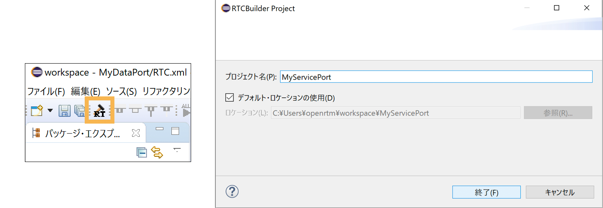
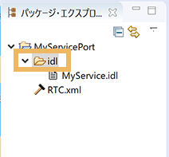
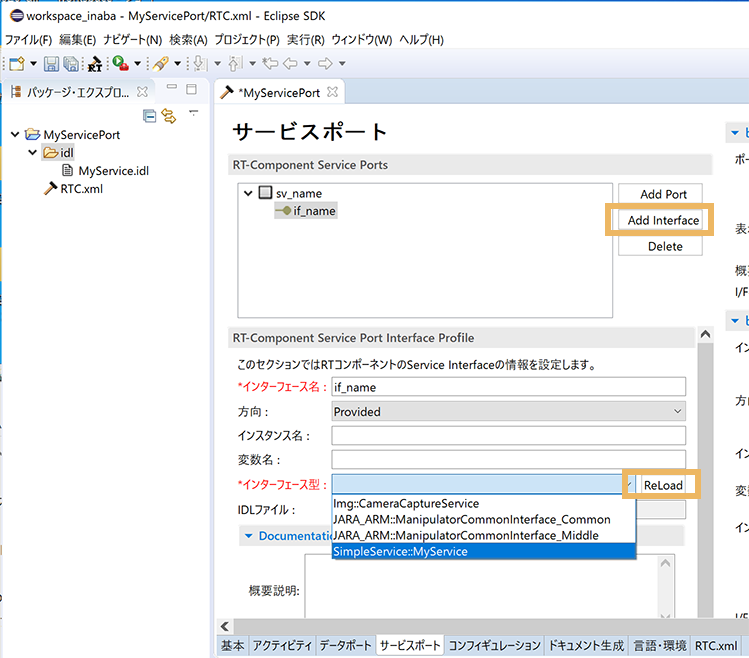

<!-- Title: サービスポート (応用編) -->
#contents

## IDL Syntax
### Structures / Object References 

CORBA structures are mapped to C++ structures "struct" as follows.
<!-- -*- IDL -*- -->
```
 struct Profile
 {

	short short_value;
	long  long_value;
  
};
```

```
 // -*- C++ -*-
 struct Profile
 {

	CORBA::Short short_value;
	CORBA::Long  long_value;

};
```

```
 class Profile_var
 {
  
};
```

- Fixed-length structures and variable-length structures<br>
If a structure contains variable-length members as shown below, the structure is regarded as variable-length data.
In this case, C++ code different from that for fixed-length structures is generated, and handling for return values and out parameters differs.
  - Bounded or unbounded strings
  - Bounded or unbounded sequences
  - Structures or unions containing variable-length members
  - Arrays with variable-length element types
  - typedefs to variable-length types

If a type does not fall under the above list, that type is fixed-length. 

- _var type The IDL compiler automatically generates a C++ structure and a _var type class from a structure in IDL. The _var type class behaves like a smart pointer, and when the _var class is used for a variable-length structure, memory allocated to variable-length members is managed automatically. When assignment is performed from one _var type variable (var1) to another _var type variable (var2), ownership of that pointer is transferred to var2, and after that var1 cannot be used until it is initialized or assigned again.
<br><br>
- When a structure goes out of scope, all memory associated with variable-length members is automatically released. However, when a _var type variable that has already transferred ownership to another object goes out of scope, it has already transferred ownership, so the original data is not released.
<br><br>
- If a structure that has been initialized or assigned is initialized or assigned again, the memory associated with the original data is automatically released.
<br><br>
- When an object reference is assigned to a variable-length member, a copy of that object reference is always created. When a pointer is assigned to a variable-length member, no copy is created.


### _var Type
#### Conversion Constructor (T_ptr)

- Implementation example

```
 _CORBA_ObjRef_Var(T_ptr p) : pd_objref(p) {}
```

Ownership of the _ptr type object reference is transferred to the _var type, so the reference count does not increase or decrease.

```
 MyObject_ptr ptr = obj->get_myobject();
 // ptr は適切なタイミングで release されなければならない

 MyObject_var var(ptr); 
 // 所有権は var に移ったため、ptr をリリースする必要はない
 // var がスコープを抜けるなどして解体されると、参照カウントは release される

```
#### Conversion Constructor (const T_var&)
- Implementation example

```
 Object_var(const T_var& p) : pd_ref(T::_duplicate(p.pd_ref)) {}
```

Ownership of the assignment-source _var type object reference is copied.

```
 MyObject_var var0 = obj->get_myobject();  // var0 は所有権を持つ
 MyObject_var var1(var0);  // リファレンスカウントはインクリメントされ var1も所有権を持つ
```

#### Conversion Constructor (const T_member) 
- Implementation example

#### in Argument and in() Function
This simply returns a _ptr type pointer to the object reference. Ownership is not transferred.

- Implementation example

```
 T_ptr  in() const { return pd_objref; }
```

This is normally used when passing an object reference to an in argument of a function.
The function receiving the object reference does not have ownership, so it must not release it inside the function.
After returning from the function, ownership is still held by the _var type variable, and the object is released when the _var type variable is destroyed.

When defining a function that receives an object reference as an in argument, define it as a _ptr type argument.
Furthermore, inside the function, only call operations of that object; do not perform release or similar operations.
Also, if you want to save the object reference somewhere inside the function (global variable, static variable, object member, etc.), you must duplicate it with the duplicate function to copy ownership.

- Usage example

```
 void myfunc(MyObject_ptr obj)
{

	obj->function();
	CORBA::release(obj); // ×これはしてはいけない
	m_obj = obj; // ×所有権を持っていない
	m_obj = MyObject::duplicate(obj); // ○所有権を複製

}

 {// 別のコンテキスト 

	MyObject_var obj(hoge->get_object());
	myfunc(obj.in()); // 所有権は移行されない

}
 // スコープを抜けたので参照カウントがデクリメントされる
```

#### out Argument and out() Function 
This releases the currently owned reference, sets the reference pointer to nil, and returns it.
That is, if an object reference is held before the out() function call, ownership of it is relinquished and the reference is destroyed.

- Implementation example

```
 T_ptr& out()
{
	T_Helper::release(pd_objref);
	pd_objref = T_Helper::_nil();
	return pd_objref;
}
```

This is normally used when passing an object reference to an out argument of a function.
That is, after returning from the function, this variable is expected to hold a new object reference.
At this time, ownership of the object reference is considered to be held by this variable.
The function side that receives the variable via out() must generate or duplicate an object reference in some form and pass ownership to the argument.

When defining a function that receives an object reference as an out argument, define it as a _ptr type reference argument.
Inside the function, the argument is always a nil object reference, and normally it is expected that some object will be assigned to it with ownership given.

- Usage example

```
 void myfunc(MyObject_ptr& obj)
{
	assert(CORBA::is_nil(obj)); // 必ず nil オブジェクトを指定する
	obj->function(); // nil なのでオペレーションは呼べない

	// m_obj は_var型のメンバ変数
	obj = m_obj; // ×所有権を複製していない。
	// return後、関数の外で勝手に release されるかもしれない。

	obj = MyObject::duplicate(obj); // ○所有権を複製している。
	// return後、関数の外で release されても、オブジェクト参照は解体されない。
	return;
}

 {// 別のコンテキスト
	MyObject_var obj;
	obj = get_object(); // △out変数として使うので渡す前には何も入れない方がよい
	myfunc(obj.out());
	// オブジェクトが代入され返ってきたはず
	assert(!CORBA::is_nil(obj));
	obj->function();
}
 // スコープを抜けたので参照カウントがデクリメントされる。

```
#### inout()
This returns a reference to the pointer to the reference.

- Implementation
```
 T_ptr& inout()    { return pd_objref; }
```

This is normally used when passing an object reference to an inout argument of a function.
That is, inside the function, some object reference is expected to be contained in the argument, and ownership of the object is transferred to the function side.
The function is also expected to return by giving some object reference to this argument, and it gives ownership to the argument, that is, the caller's variable.
Inside the function, when setting a new object reference to the argument, you must first release it, then generate or duplicate a new object reference and pass ownership to the argument.

From a design perspective, functions that take object references as inout arguments are not highly recommended.
If it is necessary to define a function that takes an inout argument, define it as a _ptr type reference argument.

- Usage example

```
 void myfunc(MyObject_ptr& obj)
{
	if (!CORBA::is_nil(obj))
	{
		obj->function(); // obj が nil でなければオペレーションを呼ぶことができる。
	}
   
	CORBA::release(obj); // releaseする責任はこの関数にある
	/*
	* この関数内で、obj に新たなオブジェクト参照がある場合に限り、
	* 引数を受け取った直後に、_var変数に代入しておくことで、
	* 関数終了時に自動的に参照カウントをデクリメント
	* するテクニックを使用してもよい。
	* MyObject_var deleter = obj;
	*/
  
	// MyObject_var m_obj とする
	obj = m_obj; // × 所有権を複製していない
	// return 後、関数の外で release されるかもしれない。
	obj = MyObject::_duplicate(m_obj); // ○ obj にも MyObject の所有権が与えられた
	// return 後、関数の外で release されても、オブジェクト参照は解体されない。
}
  
 {// 別のコンテキスト
	MyObject_var obj;
	obj = get_object(); // obj は所有権を持っている
	myfunc(obj); // 関数内で releae される
	// obj の指すものは入れ替わっているかもしれない。
}
 // スコープを抜けたので参照カウントがデクリメントされる。
```

#### _retn()

This relinquishes ownership of the currently held object reference and returns the pointer.

```
 T_ptr _retn()
{
	T_ptr tmp = pd_objref;
	pd_objref = T_Helper::_nil();
	return tmp;
}
```

This is normally used when returning an object reference as a function return value.
Ownership is passed to the function caller, so the caller must destroy the object reference.
Therefore, the caller must either release it or receive it with a _var type variable.

Conversely, when returning an object reference as a return value, the reference count is decremented by the caller calling release, so ownership must be duplicated inside the function with _duplicate() or similar before returning.

- Usage example

```
 MyObject_ptr myfunc()
{
	MyObject_var ret;
	ret = m_obj; // ×所有権がretに移ってしまう。
	// return 後、関数の外で release されるかもしれない。

	ret = MyObject::_duplicate(m_obj); // ○所有権の複製
	// return 後、release が呼ばれても、m_obj は所有権を保持し続ける。

	return ret._retn();
}

 { // 別のコンテキスト

	MyObject_var obj;
	obj = myfunc(); // オブジェクトの所有権を取得
	obj->function();

	MyObject_ptr ptr;
	ptr = myfunc(); //オブジェクトの所有権を取得
	ptr->function();

	CORBA::release(ptr); // 参照カウントをデクリメント

 }
  // スコープを抜けたので参照カウントがデクリメントされる
```


#### Summary of Rules

<table class="table-alt">
  <tr>
    <th>Function</th>
    <th>Type</th>
    <th>Responsibility for release</th>
    <th>Inside the function</th>
  </tr>
  <tr>
    <td>in</td>
    <td>T_ptr</td>
    <td>Caller side</td>
    <td>Operation call</td>
  </tr>
  <tr>
    <td>out</td>
    <td>T_ptr&</td>
    <td>Caller side</td>
    <td>&#95;duplicate assignment</td>
  </tr>
  <tr>
    <td>inout</td>
    <td>T_ptr&</td>
    <td>in: function, out: caller side</td>
    <td>After release, &#95;duplicate assignment</td>
  </tr>
  <tr>
    <td>&#95;retn</td>
    <td>T_ptr</td>
    <td>Caller side</td>
    <td>&#95;duplicate and return</td>
  </tr>
</table>

### Reference Counts in Assignment of _var Type and _ptr Type
#### Assignment of _var Type to _ptr Type

Assignment to a pointer.

No duplication, no release.

- Usage example

```
{ 
	MyObject_var var;
	var = myfunc(); // オブジェクトの所有権を取得

	MyObject_ptr ptr
	ptr = MyObject::_duplicate(var); //オブジェクトの所有権を取得(参照カウントのインクリメント)

	// ptr = var;
	// これは参照カウントエラーを引き起こす恐れがある。呼び出し後、ptrとvarは同じオブジェクト
	// をさすであろうが、参照カウントの保守はなされな。varは、その対象オブジェクトの所持を維持
	// する。また、ptrがそれが以前に指していたオブジェクトやプロキシへの唯一のポインタであった
	// とすれば、メモリリークが生じる。

	CORBA::release(ptr); // 参照カウントをデクリメント
}
 // var に関しては、スコープを抜けたので参照カウントがデクリメントされる
```

#### Assignment of _ptr Type to _var Type

release() is performed on the object held by _var, but duplicate() is not performed on the _ptr type object passed as an argument.


No duplication, release performed.

- Implementation (omniORB)

```
  inline T_var& operator= (T_ptr p)
{
	T_Helper::release(pd_objref);
	pd_objref = p;
	return *this;
 }
```

- Usage example

```
{ 
	MyObject_ptr ptr;
	ptr = myfunc(); // オブジェクトの所有権を取得

	MyObject_var obj;
	obj = MyObject::_duplicate(ptr); //オブジェクトの所有権を取得(参照カウントのインクリメント)

	CORBA::release(ptr); // 参照カウントをデクリメント

}
 // objに関しては、スコープを抜けたので参照カウントがデクリメントされる
```

#### Assignment of _var Type to _var Type

release() is called on the object held by _var,
and duplicate() is also called on the object passed as an argument.


Duplication performed, release performed.


- Implementation (omniORB)

```
  inline T_var& operator= (const T_var& p)
{
	if( &p != this )
	{
		T_Helper::duplicate(p.pd_objref);
		T_Helper::release(pd_objref);
		pd_objref = p.pd_objref;
 	}
	return *this;
 }
```

- Usage example

```
{ 
	MyObject_var var1;
	var1 = myfunc(); // オブジェクトの所有権を取得

	MyObject_var var2;
	var2 = var1; //オブジェクトの所有権を取得(参照カウントは自動でインクリメントされる)

	} // var1, var2に関しては、スコープを抜けたので参照カウントがデクリメントされる
```

### Reference Counts in _narrow()

In the process of _narrow(), if the _narrow() call succeeds, the reference count of the target object is incremented; if it fails, it is not incremented.

No decrement is performed.

- Implementation (RTCSK.cc)

```
 RTC::RTObject_ptr
 RTC::RTObject::_narrow(::CORBA::Object_ptr obj)
{
	if( !obj || obj->_NP_is_nil() || obj->_NP_is_pseudo() ) return _nil();
	_ptr_type e = (_ptr_type) obj->_PR_getobj()->_realNarrow(_PD_repoId);
	return e ? e : _nil();
}
```

- Implementation (omniObjRef.cc)

```
void*
 omniObjRef::_realNarrow(const char* repoId)
{
	// Attempt to narrow the reference using static type info.
	void* target = _ptrToObjRef(repoId);

	if( target )
	{
		if (!lid ||
			(lid && !lid->deactivated() && lid->servant() &&
	 		lid->servant()->_ptrToInterface(repoId)))
		{
 		      omni::duplicateObjRef(this);
   		}
   		else
		{
      			omniObjRef* objref;
      			omniIOR*    ior;

			ior = pd_ior->duplicateNoLock();
      		}

		objref = omni::createObjRef(repoId,ior,1,0);
	}
	else
	{

    		if( _real_is_a(repoId) )
		{
			omniObjRef* objref;
			omniIOR* ior;
			{
				ior = pd_ior->duplicateNoLock();
			}
			{
				objref = omni::createObjRef(repoId,ior,1,_identity());
			}
 		}
 	 }
	return target;
}
```

### Rules 

#### Client Side

If a client receives an object reference from an invocation, the client must release that object reference when it is no longer needed.

(Quote: "CORBA Distributed Objects Using Orbix", p.98, Memory Management for Object References)

#### Server Side 

Ownership of the reference passed to the caller is relinquished (that is, its reference count is decremented by one. Therefore, normally, an appropriate _duplicate() function is called before returning the reference.)

(Quote: "CORBA Distributed Objects Using Orbix", p.98, Memory Management for Object References)

#### References
- "CORBA Distributed Objects Using Orbix", Author: Sean Baker, Publisher: Pearson Education


## Obtaining the State of a Service Provider from a Service Consumer

When calling a provider from a consumer, the service port must be connected, and the peer RTC must be in the Active state. A consumer can check whether it is connected and whether the peer RTC is active using the following method.

A CORBA consumer type (RTC::CorbaComsumer<T> in C++) can take the following three states.

<!-- You can also know the state of an RTC through service ports if -->
<!-- the RTC has provided interfaces (provider) on it. -->
<!-- RTC::CorbaComsumer<> can be three states: nil, inactive, active. -->

- **nil**: A state in which the provider object reference is not set in the consumer (not connected)
- **active**: A state in which the provider object reference has been assigned and the peer object is activated (the RTC is also in the Active state)
- **inactive**: A state in which the provider object reference has been assigned, but the peer object is deactivated (the RTC is in the Inactive state)

The provider state and the RTC state are linked.
- Reference: [cxx/classreference_en/classRTC_1_1CorbaPort](https://www.openrtm.org/OpenRTM-aist/documents/current/cxx/classreference_en/classRTC_1_1CorbaPort.html#a1b9efe804a293b2c38a9cbe3b5ba54a0)

Whether RTC::CorbaComsumer<T> is nil can be checked with the standard CORBA function CORBA::is_nil().
Furthermore, whether the object is active can be checked with the CORBA object member function _non_existent().

Such information can be obtained from CORBA manuals and documentation. The most reliable approach is to read the CORBA specifications available from OMG.

- [List of CORBA Specifications](http://www.omg.org/spec/CORBA)
- [CORBA Interface Specification (v3.3)](http://www.omg.org/spec/CORBA/3.3/Interfaces/PDF)

However, these standard specifications have many pages, so it may be useful to use manuals for CORBA products such as VisiBroker.

Based on the above information, sample code such as the following can be written.

```
 RTC::ReturnCode_t MyServiceConsumer::onExecute(RTC::UniqueId ec_id)
{
  try
    {
       if (CORBA::is_nil(m_myservice0._ptr()))
        {
           std::cout << "[nil] object reference is not assigned." << std::endl;
        }
      else
        {
           if (m_myservice0->_non_existent())
            {
               std::cout << "[inactive] provider is inactive." << std::endl;
            }
          else
            {
               std::cout << "[active] provider is active." << std::endl;
            }
        }
    }
   catch (...)
    {
       std::cout << "Unknown exception." << std::endl;
    }
   coil::sleep(1);
   return RTC::RTC_OK;
}
```

Replace the onExecute function in this code with the oExecute function in MyServiceConsumer.cpp of the OpenRTM-aist SimpleService sample, and try running it together with MyServiceProviderComp.
When MyServiceConsumerComp is activated, the state of the consumer (m_myserivce0) is nil until the service port of MyServiceProviderComp is connected. When the port of MyServiceProviderComp is connected, it becomes inactive, and after MyServiceProvider is activated, it becomes active.

In this way, you can also know the state of the peer RTC through a service port.

## Using a Custom IDL File

### Creating a Project with RTC Builder

Create a project with RTCBuilder.

Click the "RTC Builder Project" icon, enter the project name in the displayed window, and click "Finish"; the generated project file will be displayed in the window on the left.
<div align="center"><a href="sp_idl_0.png"></a></div>
<div align="center">Display the "RTC Builder Project" window</div>

<div align="center"><a href="sp_idl_00.png"></a></div>
<div align="center">Checking the idl folder</div>

There is an idl folder where custom data types are placed, so place the idl file there by drag and drop, [right-click] > [Paste], or similar.

Here, we will use the IDL file (MyService.idl) used by the sample component SampleService component.
The storage location of the IDL file (MyService.idl) is as follows.
- If the package is installed in a Windows environment, it is [installation directory\OpenRTM-aist\1.2.2\Components\Python\Examples\SimpleService\MyService.idl].
<!-- -- ソースコードの場合は[./examples/SimpleService/MyService.idl]にあります。 -->

If you proceeded with the default in "Select a directory as workspace" displayed immediately after starting RTCBuilder, the project folder is under the [ c:\Users\user name\workspase ] folder.

### Creating a Custom IDL

Create a component using a custom idl with RTCBuilder.


Open the Service Port settings tab, select [Add Port], and define a service port (ServicePort).

Click the [ Add Interface ] button twice, and when [ Service Interface ] is displayed and selected, [ Service Interface Profile ] is displayed.

<div align="center"><a href="sp_idl_01_0.png"></a></div>
<div align="center">Use a custom interface</div>

When you click [Reload], the idl file in the idl folder is loaded, and you can select the newly defined custom interface from the ***Interface Type** dropdown.

After setting the other items required to create the component, return to the Basic tab and click the [Generate Code] button to generate the code.

