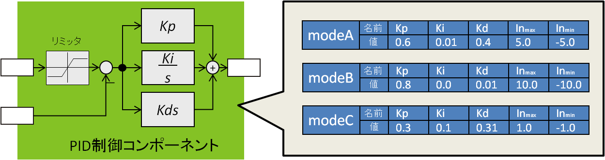
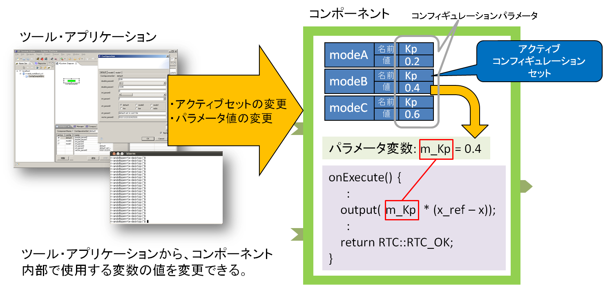
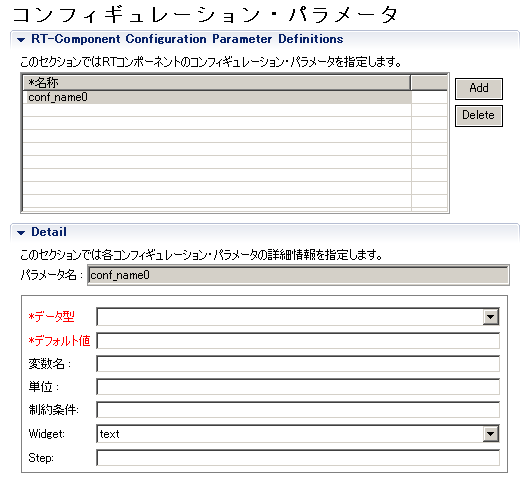
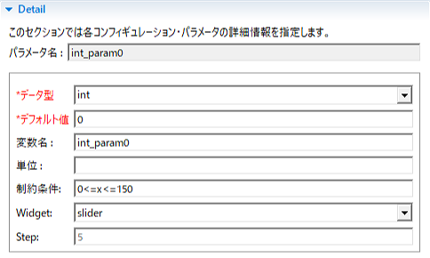
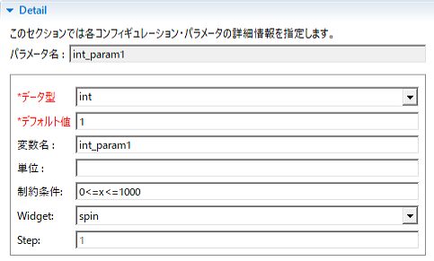
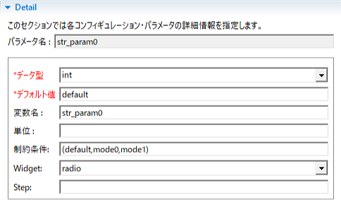
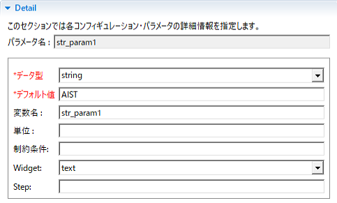
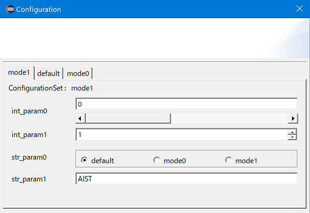

<!-- Title: コンフィギュレーション(基礎編) -->

#contents(4)

<!-- ============================================================ -->
## What Is Configuration?

When building a robot system, you often need to change parameters in the program you create according to the system's external environment, usage conditions, individual devices, and robot characteristics.
For a simple program used for a simple experiment, you might be able to deal with this by hard-coding (embedding) parameters and directly rewriting and compiling the program each time you change them.
Taking this a little further, by devising ways to read parameters from a file or pass them as command-line arguments, reusability increases significantly.
To reuse a single program according to different purposes, it becomes very important to externalize these parameters rather than embedding them.

In an RT System built with RT Components, diverse components created by various people operate in cooperation, so a function is provided that allows users to freely define parameters used inside the core logic and change them externally at runtime.
This is called the configuration (function). A configuration can have multiple parameter sets, and parameter sets can also be switched all at once.
By making parameters changeable in advance, RTCs can be easily reused in various systems.

<div align="center"><a href="configuration_example_ja.png"></a></div>
<div align="center"><strong>Example of Configuration</strong></div>

In this section, we will explain the mechanism and actual usage of configuration, one of the important functions of RT Components.

## Configuration Mechanism

The figure below shows the general mechanism of configuration.

<div align="center"><a href="configuration_functionality_ja.png"></a></div>
<div align="center"><strong>Configuration Mechanism</strong></div>

A pair consisting of a parameter <strong>name</strong> and <strong>value</strong> is called a <strong>configuration parameter</strong>.
A single component can define multiple configuration parameters, and this collection is called a <strong>configuration set</strong>.

Furthermore, a single component can have multiple configuration sets, and only one of them becomes the actual parameter values.
This configuration set is called the <strong>active configuration</strong>. Configuration sets can be named and are distinguished by those names.

Using external tools (such as RTSystemEditor and rtshell), you can change individual parameters or the active configuration set.
The contents of the configuration are reflected in variables (<strong>parameter variables</strong>) bound to the configuration, and can be used in the logic inside the RT Component.
In this way, by making it easy to change parameters used inside the logic from outside, component reusability can be improved.


- <strong>Configuration</strong>: An RTC function for externalizing parameters inside a component
- <strong>Configuration parameter</strong>: The actual parameter externalized inside the component. It consists of a key and a value.
- <strong>Configuration set</strong>: A list of parameters consisting of a list of keys and values. An RTC can have multiple sets.
- <strong>Configuration set name</strong>: A name assigned to a configuration set. Sets are distinguished by their names.
- <strong>Active configuration</strong>: An RTC can have multiple configuration sets, and the valid set that is actually reflected in the parameters is called the active configuration.
- <strong>Parameter variable</strong>: A variable bound to a configuration parameter. When the configuration content is changed, the value assigned to the variable is changed.

In typed languages, a configuration parameter can use any type available in that language as a parameter.
Of course, the same applies to untyped languages, but the important point is that when such parameters are set externally, their values are given as strings.

Configuration converts strings into the respective parameter types and sets them in the actual variables.
Even for data types that cannot easily be converted from strings to data, such as structures and arrays, any type of data can be handled in the same way by defining conversion functions.
This is a major difference from data ports and service ports, which require IDL definitions in advance.

<!-- ============================================================ -->
## Defining Parameters

There are several ways to define parameters used inside an RT Component.

- Define them when designing the component with RTCBuilder
- Define configuration parameters with rt-template
- Write the necessary code manually

Each method is described below.

<!-- ------------------------------------------------------------ -->
### Definition Using RTCBuilder

The easiest way to define configuration parameters is to define them during RTC design using RTCBuilder, the RTC design tool.

The figure below shows the configuration definition screen of RTCBuilder.
By defining the necessary parameters on this screen, the code required to use configuration parameters is automatically generated regardless of the language.

<div align="center"><a href="configuration_rtcb00_ja.png"></a></div>
<div align="center"><strong>RTCBuilder Settings Screen</strong></div>

To use configuration parameters, click the Configuration tab in RTCBuilder, and click the [Add] button next to the parameter list.
Then one configuration parameter is added, so enter the appropriate

- Name (required)
- Data type (required)
- Default value (required)

items.

For the name (which defaults to something like conf_name0), give it an easy-to-understand name that concisely represents the nature of the parameter.
The type names that can be selected from the dropdown list are appropriately converted and defined in each language.
In languages such as Python where explicit type declarations are not required, the type name set here may not appear in the code.

As mentioned above, configuration parameters can support various parameter types by giving values as strings and converting those strings to specific types.
However, since values are entered externally as strings, if an invalid parameter input such as a non-convertible string is given, conversion may result in an error.
The default value set here is the value used instead when conversion of the set value is invalid.

In addition, the following optional items are available. Enter them as needed.

- Variable name: The string used as the variable name. If empty, the name is used.
- Unit: The unit of this parameter. Currently, it is not used except for human reading.
- Constraint: Specifies the constraint condition for this parameter. This condition is used by RTSystemEditor. For continuous values, inequalities can be specified; for enumerated values, comma-separated values can be specified.
- Widget: The control used when operating the parameter in RTSystemEditor. You can select from text, slider, spin, and radio.
- Step: Specifies the step when the above Widget is slider or spin.
<br>
<br>

<div align="center"><div align="center"><a href="param1_slider_ja.png"></a></div>;  <div align="center"><a href="param2_spin_ja.png"></a></div>;</div>
<div align="center"><strong>Slider and Spin Settings</strong></div>

<div align="center"><div align="center"><a href="param3_radio_ja.png"></a></div>;  <div align="center"><a href="param4_text_ja.png"></a></div>;</div>
<div align="center"><strong>Radio Button and Text Settings</strong></div>

For details, refer to the hints on the right side of the screen or the RTCBuilder manual.

<!-- ------------------------------------------------------------ -->
### Definition Using rtc-template

rtc-template is a component template generator used from the command line.
To use configuration with rtc-template, specify it as follows.

```
    /usr/local/bin/rtc-template -bcxx --module-name=ConfigSample 
```
    --module-type=DataFlowComponent 
    --module-desc=Configuration example component --module-version=1.0 
    --module-vendor=Noriaki Ando, AIST --module-category=example 
    --module-comp-type=DataFlowComponent --module-act-type=SPORADIC 
    --module-max-inst=10 --config=int_param0:int:0 
    --config=int_param1:int:1 --config=double_param0:double:0.11 
    --config=double_param1:double:9.9 
    --config=str_param0:std::string:hoge 
    --config=std_param:std::string:dara 
    --config=vector_param0:std::vector<double>:0.0,1.0,2.0,3.0,4.0
```
 
    # 実際には1行で入力するか、継続文字を行末に(UNIXでは\、Windowsでは^)を補ってください
```

This is an example specification for ConfigSample included with the samples.

  --config=<name>:<data type>:<default value>

Specify it in this format. For the data type, specify a data type used in that language, but with non-primitive types, it may not work properly or manual correction may be required.

<!-- ------------------------------------------------------------ -->
### Manual Definition

Although it is not very recommended, configuration parameters can also be defined manually.
This is useful when you want to add a new parameter, but if you do not update the documentation, RTC.xml file, etc., a third party using this RTC may be confused because the specification and implementation are inconsistent, so please be careful.

However, it is meaningful to know how configuration is declared and used, so it is explained here.

To use configuration, the following procedure is required.

#### Decide the purpose, name, and type of the configuration parameter (hereafter, parameter)

As described above, decide where in the component the parameter will be used, as well as the name that represents the characteristics of the parameter and the type name used during implementation (in the case of typed languages).

#### Declare the parameter variable in the component header (private/protected)

If the file was generated by RTCBuilder or rtc-template, there is a section enclosed by tags like the following, so declare the variables for the configuration parameters here.

```
  // Configuration variable declaration
  // <rtc-template block="config_declare">
 
  // </rtc-template>
```

For the ConfigSample example above, it is as follows.

```
  // Configuration variable declaration
  // <rtc-template block="config_declare">
  int m_int_param0;
  int m_int_param1;
  double m_double_param0;
  double m_double_param1;
  std::string m_str_param0;
  std::string m_str_param1;
  std::vector<double> m_vector_param0;
  
  // </rtc-template>
```

#### Add parameter declarations and default values to the static variable <component name>_spec[] in the component implementation file

Configuration parameters are stored and managed inside the component in a data store called Properties. In this Properties object,

```
 conf.<コンフィギュレーションセット名>.<パラメーター名>
```

configuration parameters are held using keys like this. The configuration set name <strong>default</strong> is reserved as the default value, and all default values are defined as this <strong>default</strong> configuration set.

In the ConfigSample example above, add them as follows.

```
 // Module specification
 // <rtc-template block="module_spec">
 static const char* configsample_spec[] =
  {
     "implementation_id", "ConfigSample",
     "type_name",         "ConfigSample",
     "description",       "Configuration example component",
     "version",           "1.0",
     "vendor",            "Noriaki Ando, AIST",
     "category",          "example",
     "activity_type",     "DataFlowComponent",
     "max_instance",      "10",
     "language",          "C++",
     "lang_type",         "compile",
     // Configuration variables
     "conf.default.int_param0", "0",
     "conf.default.int_param1", "1",
     "conf.default.double_param0", "0.11",
     "conf.default.double_param1", "9.9",
     "conf.default.str_param0", "hoge",
     "conf.default.str_param1", "dara",
     "conf.default.vector_param0", "0.0,1.0,2.0,3.0,4.0",
  
    ""
  };
 // </rtc-template>
```

The section below Configuration variables defines the default configuration set.

#### Initialize each variable with an initializer

Variables generated by RTCBuilder or rtc-template are not initialized by constructor initializers, but if possible, all variables should be initialized by constructor initializers.
Also, since default values are set in each variable after the bindParameter() function is called inside the onInitialize() function, in principle they must not be used before that.


#### Bind parameters and variables with the bindParameter() function

Finally, by binding variables, parameter names, default values, and conversion functions, ordinary variables become configuration parameters.
Use bindParameter(), a member function (method) of the RTObject class.

```
 bindParameter(<パラメーター名称(文字列)>, 変数, <デフォルト値(文字列)>, <変換関数>)
```

In the ConfigSample above (C++ example), it is as follows.

```
  // <rtc-template block="bind_config">
  // Bind variables and configuration variable
  bindParameter("int_param0", m_int_param0, "0");
  bindParameter("int_param1", m_int_param1, "1");
  bindParameter("double_param0", m_double_param0, "0.11");
  bindParameter("double_param1", m_double_param1, "9.9");
  bindParameter("str_param0", m_str_param0, "hoge");
  bindParameter("str_param1", m_str_param1, "dara");
  bindParameter("vector_param0", m_vector_param0, "0.0,1.0,2.0,3.0,4.0");
  
  // </rtc-template>
```

By doing this, each variable is bound to a configuration parameter, and configuration parameters become available that can be operated from RTSystemEditor and similar tools.

Note that for built-in types, the conversion function given to bindParameter() is not necessary, as in the example above, and does not need to be explicitly provided.
However, if you want to use your own structures, complex types, etc. as configuration parameters, you need to define conversion from strings to those types and provide it here.
Details of conversion functions are described later.

<!-- ============================================================ -->
## Using Parameters

Using parameters is very easy. As described so far, you simply use the variables declared as configuration parameters.
However, there are several conditions for use, and they must be observed.

<!-- ------------------------------------------------------------ -->
### Callback Functions in Which Variables Can Be Used

Configuration variables can be used only inside specific callback functions (onXXX()).
Changes to configuration variables from outside are performed asynchronously.
Normally, in such cases, exclusive access control to variables must be performed using mutexes or similar mechanisms, but to achieve this, component developers also need to protect access to each variable with a mutex.
To avoid this, in OpenRTM-aist, external configuration changes are made outside the callback functions.

The callback functions that can be used are as follows.

- onInitialize() (※)
- onActivated()
- onExecute()
- onStateUpdate()
- onDeactivate()
- onAborting()
- onError()
- onReset()
- onFinalize() (※)

Configuration parameters can be used in almost all callback functions.
However, in onInitialize(), configuration parameters naturally cannot be used before bindParameter() is performed.
Also, in onFinalize(), changes made to configuration parameters immediately before the call may not be reflected.

<!-- ------------------------------------------------------------ -->
### Variables Are Read-Only

Configuration parameter variables are changed from outside the component, and their values are assigned to the parameter variables. However, even if you write to a parameter variable
inside an internal function such as onExecute(), it will not be reflected in the parameter value visible from outside.

In this way, changes to variable values are one-way, so writing to variables from inside the component has no meaning.
Use configuration variables as read-only.

<!-- ------------------------------------------------------------ -->
### Always Check Whether Values Are Correct

As described above, configuration parameter values are assigned to the variables actually used after being converted by a conversion function from strings given from outside.
Because they are strings, a string may be assigned where a numeric value should originally be assigned, or a numeric value larger than the upper limit may be assigned to a variable declared as short int.
Therefore, on the receiving side, it is recommended to always check in the program before use whether the variable is within the expected value range and whether an impossible value has been assigned.


<!-- ============================================================ -->
## Setting Parameters

It was mentioned above that configuration parameters can have several sets and that they can be changed simultaneously at runtime.
On the other hand, when designing components with RTCBuilder or rtc-template, only the default configuration set could be defined.
Here, we will explain how to use configuration sets.

<!-- ------------------------------------------------------------ -->
### Component Configuration File

The default configuration set is embedded in the source code.
In principle, other configuration sets can also be increased by embedding them in the source code in the same way.
However, the purpose of the RTC configuration function is to use a single component for various purposes by changing parameters according to the purpose without changing the source code, so embedding other configuration sets in the source code defeats the purpose.

Configuration sets can be provided in the component configuration file.
There is rtc.conf as a file for configuring the component, but this is mainly a configuration file for the middleware that manages the component, and the configuration file for the component can be specified in rtc.conf as follows.

```
 corba.nameservers: localhost
 naming.formats: %h.host_cxt/%n.rtc
 example.ConfigSample.config_file: configsample.conf
```

The example.ConfigSample.config_file part is the part that specifies the component configuration file. The part that specifies the configuration file is as follows.

```
 <カテゴリ名>.<モジュール名>.config_file: <ファイル名>
```

You can also give an instance name instead of the component module name.

```
 <カテゴリ名>.<インスタンス名>.config_file: <ファイル名>
```

Therefore, different configuration files can also be given for each instance.

```
 example.ConfigSample0.config_file: consout0.conf
 example.ConfigSample1.config_file: consout1.conf
 example.ConfigSample2.config_file: consout2.conf
```

<!-- ------------------------------------------------------------ -->
### Configuration Set Settings

In the configuration file, describe the configuration sets you want to use.

```
 configuration.active_config: mode1
 
 conf.mode0.int_param0: 12345
 conf.mode0.int_param1: 98765
 conf.mode0.double_param0: 3.141592653589793238462643383279
 conf.mode0.double_param1: 2.718281828459045235360287471352
 conf.mode0.str_param0: mode0
 conf.mode0.str_param1: foo
 conf.mode0.vector_param0: 0.0,0.1,0.2,0.3,0.4
 
 conf.mode1.int_param0: -999
 conf.mode1.int_param1: 999
 conf.mode1.double_param0: 297992458
 conf.mode1.double_param1: 2.97992458e+8
 conf.mode1.str_param0: mode1
 conf.mode1.str_param1: AIST
 conf.mode1.vector_param0: 1,2,3,4,5,6,7,8,9
 
 conf.__widget__.int_param0: slider.1
 conf.__widget__.int_param1: spin
 conf.__widget__.double_param0: slider.0.1
 conf.__widget__.double_param1: text
 conf.__widget__.str_param0: radio
 conf.__widget__.str_param1: text
 conf.__widget__.vector_param0: text
 
 conf.__constraints__.int_param0: 0<=x<=150
 conf.__constraints__.int_param1: 0<=x<=1000
 conf.__constraints__.double_param0: 0<=x<=100
 conf.__constraints__.double_param1: 
 conf.__constraints__.str_param0: (default,mode0,mode1,foo,bar,radio)
 conf.__constraints__.str_param1: 
 conf.__constraints__.vector_param0: 
```

<!-- ------------------------------------------------------------ -->
### Specifying the Active Configuration Set

The first line, configuration.active_config, specifies the active configuration set name. Here the set name is mode1, and naturally, an existing set name must be specified.

```
 configuration.active_config: mode1
```

<!-- ------------------------------------------------------------ -->
### Configuration Set Settings

Next, there is a list of parameters starting with conf.mode0, which is the list of configuration parameters for the set named <strong>mode0</strong>. The specification method is almost the same as in the source code:

```
 conf.<セット名>.<パラメーター名>: <デフォルト値>
```

Be sure to specify all existing configuration parameters.
If no specification is given, the default value is used. Next, there is a list of parameters starting with conf.mode1, which, like mode0, is the parameter settings for the set named mode1.

<!-- ------------------------------------------------------------ -->
### Extensions
#### conf._ widget_ Settings
Next, there is a list of settings starting with conf._ widget_. These are special parameters used by RTSystemEditor.
It was explained above that you can specify a widget when setting configuration parameters in RTCBuilder, and the contents set here are set as conf.<u>widget</u>.
Four types can be set: slider, radio, spin, and text. When the configuration parameter settings dialog is opened in RTSystemEditor, parameters can be operated using sliders, radio buttons, spin buttons, and text boxes, respectively.

```
 conf.__widget__.<パラメーター名>: ウィジェット名
```

- When setting a slider
```
 conf.__widget__.int_param0: slider.5
```

By setting it as shown above, the slider step width can be set to 5. Currently, this step width cannot be a decimal value.
However, this may be improved in future version upgrades.

- When setting a spin button
```
 conf.__widget__.int_param1: spin
```

The step width of a spin button is always 1. It is recommended to use it only for integer parameters such as int.

- When setting a radio button
```
 conf.__widget__.str_param0: radio
```

- When setting text
```
 conf.__widget__.str_param1: text
```

When these conf.<u>widget</u> parameters are set, the conf._ constraints_ parameters must also be set.

#### conf.__onstraints_ Settings
The conf._ constraints_ parameter is a special parameter for setting the range of values. Setting examples are shown below. Note that if invalid parameters are set, the widget will not be displayed properly.

- When a slider is set, specify it using the temporary variable <strong>x</strong> and equality/inequality signs as follows.
```
 conf.__constraints__.int_param0: 0<=x<=150
```

- When a spin button is set, specify it using the temporary variable <strong>x</strong> and equality/inequality signs in the same way as for a slider.
```
 conf.__constraints__.int_param0: 0<=x<=1000
```

- When a radio button is set, separate button names with commas inside parentheses. Multiple button names can be specified.
```
 conf.__constraints__.str_param0: (default,mode0,mode1)
```

- When text is set, specify the text you want to display.
```
 conf.__constraints__.str_param1: AIST
```

Below is an example display in RTSystemEditor using the above settings.

<div align="center"><a href="configuration_constraints_ja.png"></a></div>
<div align="center"><strong>Display Example of conf.__onstraints_</strong></div>

<!-- ------------------------------------------------------------ -->
### About Conversion Functions

In C++ and similar languages, it is not necessary to specify conversion functions for built-in types such as int and double. On the other hand, there may be cases where you want to use user-defined types such as structures or STL containers.
In this case, you need to provide bindParameter() with a function that defines how to convert from a string to each type.

There are rules for conversion functions for each language, as described below. The methods for each language are described below.

#### Conversion Functions in C++

In C++, the prototype declaration of bindParameter is

```
 template <typename VarType>
     bool bindParameter(const char* param_name, VarType& var,
 		       const char* def_val,
 	            bool (*trans)(VarType&, const char*) = coil::stringTo)
               
```

as shown above, and conversion from a string to the corresponding type is performed by giving an appropriate function pointer to the fourth argument, trans. By default, the coil library function stringTo() is given.
You can also write your own conversion function equivalent to this stringTo() and provide its function pointer, but coil::stringTo() itself is also a function template, and if the operator >>() function for std::stream

```
 std::istream& operator>>(std::istream&, T)
```

is defined, this is automatically used to convert a string to the specific type.

In other words, if you can write something like std::cin >> <variable of some type>, then operator>>() is defined for that type, and it can be used as a configuration parameter without writing a special conversion function.

If there is no conversion function, for example, the conversion function for converting a comma-separated numeric sequence such as

```
 0.0,1.0,2.0,3.0,4.0
```

to std::vector<double> is

```
 #include <istream>
 #include <ostream>
 #include <vector>
 #include <string>
 #include <coil/stringutil.h>
 
 template<typename T>
 std::istream& operator>>(std::istream& is, std::vector<T>& v)
 {
   std::string s;
   std::vector<std::string> sv;
   is >> s;
   sv = coil::split(s ,",");
   v.resize(sv.size());
   for (int i(0), len(sv.size()); i < len; ++i)
    {
      T tv;
       if (coil::stringTo(tv, sv[i].c_str()))
        {
           v[i] = tv;
        }
    }
   return is;
}
```

It can be implemented in this way. Note that this is VectorConvert.h included in the source of the ConfigSample component, a sample of the C++ version of OpenRTM-aist.

If this is included in the source where bindParameter() is called (for example, ConfigSample.cpp for the ConfigSample component), which is usually the component implementation source, the compiler will determine the appropriate conversion function at compile time and use it.

#### Conversion Functions in Java

In Java, rather than separately providing something called a conversion function, conversion from a string to the actual type is written in the stringFrom() method defined in the holder class of the configuration variable.

Below is a conversion function defined in ConfigSampole of the Java version of OpenRTM-aist for converting a comma-separated numeric sequence to the Vector type.

```
 package RTMExamples.ConfigSample;
 
 import java.io.Serializable;
 import java.util.Vector;
 
 import jp.go.aist.rtm.RTC.util.ValueHolder;
 
 public class VectorHolder  implements ValueHolder, Serializable {
 
    /
```
      * Vector型データ設定値
     */
```
     public Vector value = null;
 
    /**
```
      * デフォルトコンストラクタ
     *
     */
```
     public VectorHolder() {
    }
 
    /**
```
      * コンストラクタ
     *
      * @param initialValue　初期値
     *
     */
```
     public VectorHolder(Vector initialValue) {
         value = new Vector(initialValue);
    }
 
    /**
```
      * 文字列からVector型に変換して設定
     *
      * @param def_val　設定値文字列表現
     *
     */
```
     public void stringFrom(String def_val) throws Exception {
         value = new Vector();
         String values[] = def_val.split(",");
         for( int intIdx=0;intIdx<values.length;intIdx++ ) {
             value.add(values[intIdx]);
        }
    }
    /**
```
      * 設定値の取得
     *
 　   * @return 設定値
     *
     */
```
     public Vector getValue(){
         return value;
    }
    /**
```
      * 設定値を文字列に変換
     *
 　   * @return 変換文字列
     *
     */
```
     public String toString(){
         StringBuffer retVal = new StringBuffer();
         while(value.iterator().hasNext()) {
             retVal.append(value.iterator().next());
             if(value.iterator().hasNext()) retVal.append("'");
        }
         return retVal.toString();
    }
}
```


#### Conversion Functions in Python

In the Python version of OpenRTM-aist, basic types and their lists are supported by default. If other conversions are needed, define a function such as bool stringTo(type, string) and pass the function object as the fourth argument to bindParameter().


<!-- ============================================================ -->
## What Should Be Made a Parameter?

When creating an RT Component, consider what should be made a configuration parameter.

When there is a certain parameter, several methods can be considered for changing it from outside.
These include changing it using a data port, changing it using a service port, and changing it using configuration.

The configuration function is a function for changing parameters inside a component.
Therefore, parameters inside the logic should be made changeable externally as configuration parameters.
However, there may be cases where you are unsure whether a certain quantity should be a configuration parameter or not.
Here, we will think a little about such cases.

<!-- ------------------------------------------------------------ -->
### Update Frequency

Configuration parameters are normally used to provide parameters externally only once before the system starts operating, or only when settings need to be changed.
If the update frequency is only once or a few times during the system lifecycle, configuration is a good choice.

Also, as mentioned above, configuration is given as strings from tools or applications and converted to each type inside the component.
Conversion takes a certain amount of time (several microseconds to several hundred microseconds on recent PCs), so it is not suitable, for example, for sending data at a 1 ms cycle.
So how often can parameters be changed? In actual use, it depends on the number of parameters and the speed of the computer and network, but parameters can be changed practically without problems at intervals of several hundred milliseconds or longer.
However, for things whose values need to be changed periodically and repeatedly in that way, data ports should be used.

<!-- ------------------------------------------------------------ -->
### Update Timing

Configuration parameters can be updated at any time from tools such as RTSystemEditor and rtshell.
However, actually changed parameters are reflected in the actual variables at a certain timing before they are referenced inside functions such as onExecute and onActivated.
The update timings are as follows.

<table class="table-alt">
  <tr>
    <td>At initialization</td>
    <td>Immediately after onInitialize()</td>
  </tr>
  <tr>
    <td>At activation</td>
    <td>Immediately before onActivated() is called</td>
  </tr>
  <tr>
    <td>At error</td>
    <td>Immediately after onError()</td>
  </tr>
  <tr>
    <td>Active state</td>
    <td>Immediately after onStateUpdate() ≒ after onExecute and immediately before the next onExecute()</td>
  </tr>
</table>

<!-- ------------------------------------------------------------ -->
### Data or Parameter?

For example, consider a system that periodically sends data from a remote sensor to a central server.
Suppose the data is sent only once per hour, and the server side records it in a log.
In this case, should this data be sent using a data port? Or should a service port be used, or should configuration be used?

What is being sent is sensor <strong>data</strong>, so it is most appropriate to send it using a data port.
Configuration is a mechanism for <strong>setting</strong> parameters from outside, so even if the update frequency is once per hour, it is inappropriate to transmit this data to the component through configuration.
However, if you want to implement complex interaction (transactions, etc.) between the client and server side that cannot be realized with data ports, a service port may be used.

<!-- ------------------------------------------------------------ -->
### Service or Parameter?

In practice, you probably will not have much trouble deciding whether something should be a data port or configuration.
On the other hand, there are many cases where you may be unsure whether a parameter in RTC logic should be changed from a service port or made a configuration parameter.

When a component provides a certain typical and somewhat cohesive function, that function is provided externally through the service port interface.
A service interface provides operations for obtaining the state of the target and changing settings, modes, and parameters.
Aside from obtaining the state, functions for setting or changing modes and parameters are very similar to configuration.

In the end, there is not much difference whichever method you use for settings, but if the target RTC function is already defined as a service interface, or if somewhat complex functions are provided, such as requiring state acquisition and settings, operation through a service interface can be considered suitable.
For other simple settings such as parameters and modes, using configuration is recommended.

<!-- ============================================================ -->
## Summary

Here, we explained how to define and use the configuration function.
Parameters inside logic should be externalized using this function as much as possible in order to improve component reusability.
It is also necessary to pay attention to what should and should not be made a configuration parameter.
If the configuration function is used effectively, the components you create will also have high reusability.

