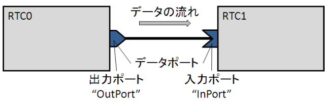
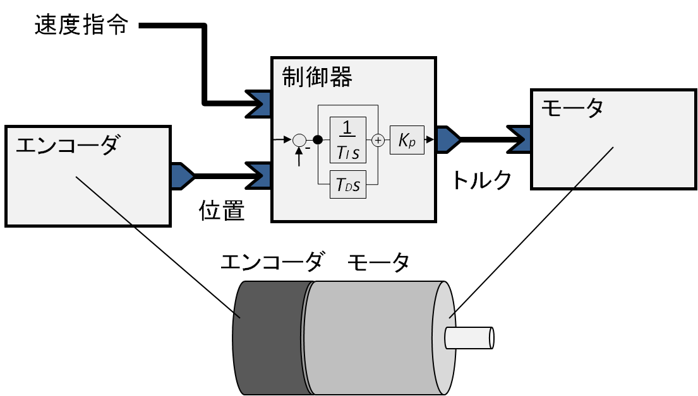
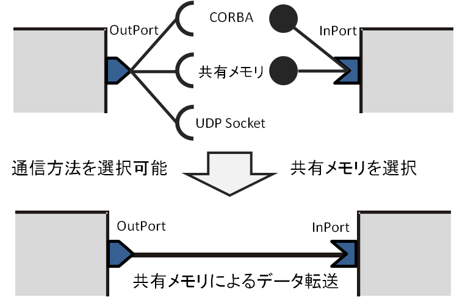
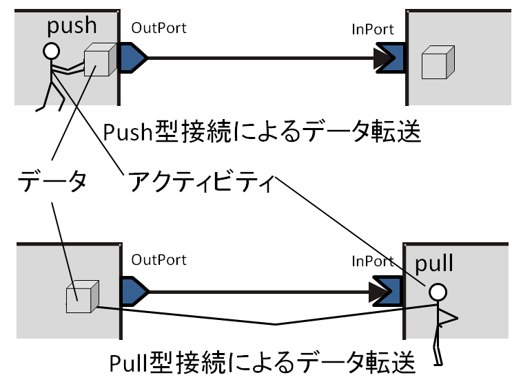
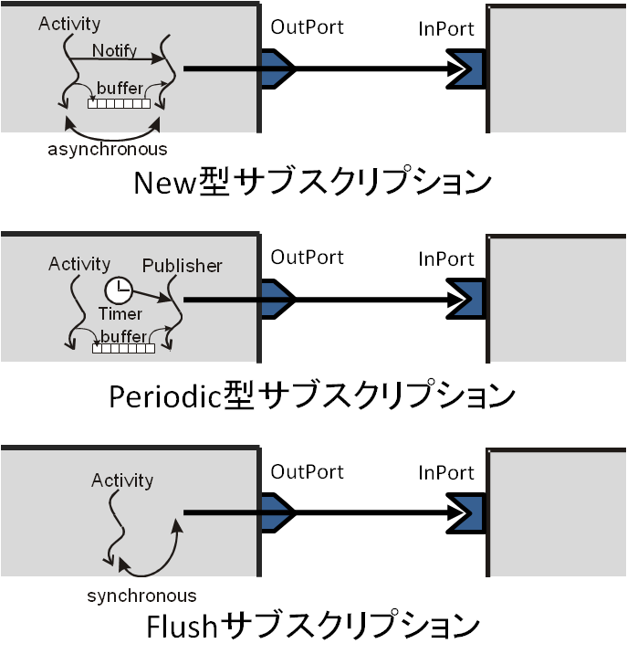
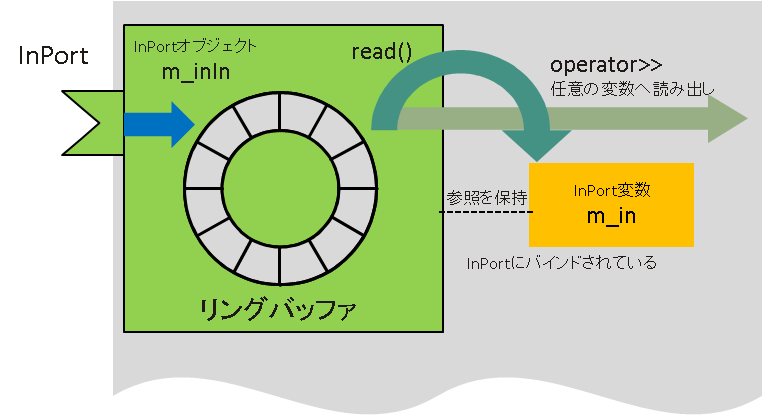
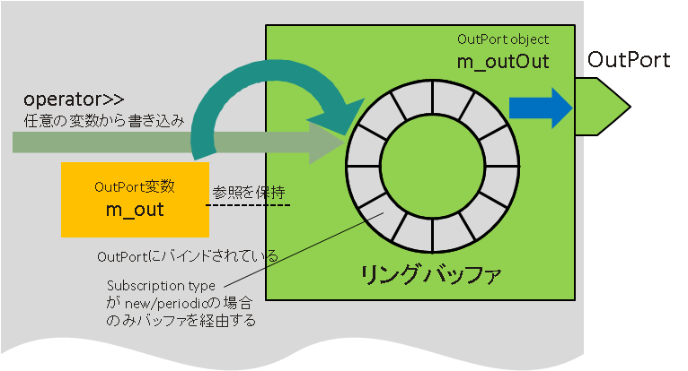

<!-- Title: データポート (基礎編) -->
<!-- -*- pukiwiki-edit -*- -->
<!-- *データポート(基本編) -->
<!-- #contents -->


## What Is a Data Port?

A data port is a port mainly used to exchange continuous data between RTCs.
A data port for sending data to another RTC is called an OutPort, and a data port for receiving data from another RTC is called an InPort. "InPort" and "OutPort" are sometimes collectively called "data ports (DataPort)."


<div align="center"><a href="dataport_ja.png"></a></div>
<div align="center"><strong>Data Ports (InPort and OutPort)</strong></div>


RTCs can be written in various programming languages. RT Components can also be distributed over a network, placed on the same node, or placed in the same process.
Data is passed transparently between data ports regardless of what language the RTCs at both ends are written in or whether they are distributed over a network.

An RTC can have any number of data ports as needed. For example, suppose you create a component that acquires data from a sensor.
This component will need at least one OutPort for outputting sensor data.

Alternatively, suppose you create a component that drives a motor according to a specified torque value. This component will need at least one InPort that receives a torque value command.
If you create a controller component for feedback control using these components, you will need an InPort that receives sensor data, an InPort that receives command values (for example, velocity commands), and an OutPort that outputs torque values.


<div align="center"><a href="dataport_example_ja.png"></a></div>
<div align="center"><strong>Example of Sensors, Controllers, Motors, and Data Ports</strong></div>


Let's look at a simple example of actually using InPort and OutPort in a program. Each object has the following role.

- encoderDevice: An object that implements functionality for controlling hardware (for example, a counter board) and reading the current angle from an encoder. If the hardware vendor does not provide such a library, you need to implement it yourself.
- encoderData: A variable that holds encoder data for the OutPort. Here, it is assumed to have a field (a structure member) named data that holds the encoder value.
- encoderDataOut: An OutPort object. It is associated with the encoderData object.


```
 // エンコーダコンポーネントの例
 encoderData.data = encoderDevice.read(); // カウンタから現在値を取得
 encoderDataOut.write();                  // OutPort からデータが出ていく
```


In the first line, the read() function of the encoderDevice object is called to read the current value of the encoder. The read data is assigned to the data member of the encoderData object.
When write() is called, the encoderDataOut object, which is an instance of OutPort, retrieves data from the encoderData object and outputs it to the connected InPort.

On the other hand, a motor component that has an InPort can be written as follows.

- motorDevice: An object for controlling hardware (for example, a DA board connected to a motor driver) and performing motor control. If such a library is not provided by the vendor, you need to implement it yourself.
- motorData: A variable that holds the value input from the InPort. Here, it is assumed to have a field (a structure member) named data that holds the encoder value.
- motorDataIn: An InPort object. It is associated with the motorData object.


```
 // モーターコンポーネントの例
 if (motorDataIn.isNew() {
   motorData.data = motorDataIn.read(); // InPort からデータを読む
   motorDevice.output(motorData.data);  // モータードライバへ指令値を出力
}
```


In the first line, it first checks whether data has arrived at the InPort. If data has arrived, the read() function of motorDataIn is called to read data from the InPort into the data member of motorData. Next, the output function of the motorDevice object is called to actually pass the command value to the motor.
Similarly, a controller component with InPort and OutPort would be as follows.


```
 // 制御器コンポーネントの例
 if (positionDataIn.isNew() && referenceDataIn.isNew()) {

   positionDataIn.read();  // 位置データを InPort から読み込む
   referenceDataIn.read(); // 速度指令を InPort から読み込む

   // 制御アルゴリズムに従ってモーターに与えるトルク値を計算
   torqueData.data = controller.calculate(positionData.data,
                                           referenceaData.data);
   torqueDataOut.write(); // モータートルク値を OutPort から出力
}
```

What is being done is not very different from the cases of only InPort or only OutPort, so a detailed explanation is omitted. Differences such as what language the peer RTC is written in, or whether it is on another node on the network or local, are hidden by the RT Component framework, so data can be sent and received easily in this way.


<!-- ------------------------------------------------------------ -->
## Variable Types

In the examples so far, the declarations of each object have not been shown, so those who are familiar with typed languages such as C++ and Java may have wondered what types the variables in the sample programs are.

### Basic Types
The data storage variable assumed in the example above is a data type called TimedDouble.
Written as a C/C++ structure, it is almost equivalent to the following structure.

```
 struct Time
{
   long int sec;
   long int usec;
};

 struct TimedDouble
{
   Time tm;
   double data;
};
```

The following rules and characteristics apply to data port types.

- Each data port has a specific type.
- Type definitions are determined by IDL (Interface Definition Language), a language-independent interface definition language.
- Even if the languages are different, ports can be connected if the IDL-defined type is the same.
- Data ports with different types cannot be connected, and data cannot be sent or received.

Therefore, in the above example, in order to connect the encoder, controller, and motor components, the data type of each port must be TimedDouble.


OpenRTM-aist provides the following data port types by default, which can be used without any special definition. These default basic types have a tm field for holding a timestamp.

<table class="table-alt">
  <tr>
    <th>Type Name</th>
    <th>Contents</th>
  </tr>
  <tr>
    <td>TimedShort</td>
    <td>Timestamp and short int type</td>
  </tr>
  <tr>
    <td>TimedUShort</td>
    <td>Timestamp and unsigned short int type</td>
  </tr>
  <tr>
    <td>TimedLong</td>
    <td>Timestamp and long int type</td>
  </tr>
  <tr>
    <td>TimedULong</td>
    <td>Timestamp and unsigned long int type</td>
  </tr>
  <tr>
    <td>TimedFloat</td>
    <td>Timestamp and float type</td>
  </tr>
  <tr>
    <td>TimedDouble</td>
    <td>Timestamp and double type</td>
  </tr>
  <tr>
    <td>TimedString</td>
    <td>Timestamp and string type</td>
  </tr>
  <tr>
    <td>TimedWString</td>
    <td>Timestamp and wstring type</td>
  </tr>
  <tr>
    <td>TimedChar</td>
    <td>Timestamp and char type</td>
  </tr>
  <tr>
    <td>TimedWChar</td>
    <td>Timestamp and wchar type</td>
  </tr>
  <tr>
    <td>TimedOctet</td>
    <td>Timestamp and byte type</td>
  </tr>
  <tr>
    <td>TimedBool</td>
    <td>Timestamp and bool type</td>
  </tr>
</table>


Among these, TimedChar, TimedWChar, and TimedOctet may not have many situations where they are used.

The correspondence between IDL types and language-specific types is called mapping. For the mapping from each type to the type in each language, refer to the CORBA language mapping specification or the "Language Mapping" chapter.


### Slightly More Complex Data Types

The above basic types also provide types called sequence types, with names ending in ~Seq.
Simply put, these are types that can hold arrays.

```
 seqdata.length(10); // 配列を10個分確保する
 for (int i(0); i < seqdata.length(); ++i) // 引数なし length は長さを返す
{
   seqdata[i] = i; // 代入する
}
```

In C++, they can be used in this way. They are more convenient than arrays and are similar to STL vector, but they have far fewer functions than vector.
In Java, a holder class dedicated to arrays is automatically generated and can be used.
In Python, they are directly mapped to Python arrays.

In the previous example, there was one encoder and one motor, but in an actual robot it is necessary to handle many degrees of freedom.
In that case, providing a port for each degree of freedom is not advisable from the standpoint of communication efficiency, synchronization issues, and so on.
In such cases, using these sequence types makes it possible to handle multiple pieces of data efficiently.

### Custom Data Types

Furthermore, there may be cases where you want to handle more complex data structures. In that case, you can define your own data type and use it with a data port. For details, refer to "Data Port (Advanced)."

<!-- ------------------------------------------------------------ -->
## Connecting Data Ports

### Connector

Tools such as RTSystemEditor and rtcshell are used to connect InPorts and OutPorts that an RTC has. When ports are connected, data sent from an OutPort is received by an InPort via the network or similar.
Several types of connections can be selected as follows, according to the system structure and component characteristics.

- Data flow type
- Interface type
- Subscription type
- Data transmission policy

### Interface Type

The interface type specifies which protocol is used to send and receive data. By default, only a method called the corba_cdr type is available, and normally there is no particular problem if you use this.
However, depending on the system configuration, it is also possible to extend it so that another interface type can be used.


<div align="center"><a href="dataport_interfacetype_ja.png"></a></div>
<div align="center"><strong>Interface Type</strong></div>

### Data Flow Type

Methods for sending and receiving data include the push type, in which the OutPort sends data to the InPort, and the pull type, in which the InPort queries the OutPort and retrieves data.

In the push type, the activity of the component on the OutPort side (usually the on_execute() callback function) mainly takes the initiative in sending data to the receiving side. The timing of sending is specified by the subscription type described next.
On the other hand, in the pull type, the activity of the component on the InPort side (usually the on_execute() callback function) mainly takes the initiative in sending data to the receiving side.
The timing at which data is received is when the InPort side calls read().

<div align="center"><a href="dataport_dataflowtype_ja.png"></a></div>
<div align="center"><strong>Data Flow Type</strong></div>

### Subscription Type

The subscription type is a property that is valid only when the data flow type is push. By default, three types are provided: flush, which is a synchronous transmission method, and new and periodic, which are asynchronous transmission methods.

When pushing data from an OutPort to an InPort, the flush type sends data directly inside the write function of the OutPort. In other words, when the write() function returns, it is guaranteed that the data has arrived at the InPort.
On the other hand, if the peer InPort is far away on the network and communication takes time, write() may be forced to wait for a long time. Therefore, for example, if you want to execute activity logic in real time, problems may occur with the flush type.

For the new type and periodic type, a transmission thread called a publisher is prepared for each connection. In these types, when the OutPort write() function is called, the data is first written to the buffer, and the write() function ends immediately.
The actual transmission of data is performed by another thread of the publisher.

<div align="center"><a href="dataport_subscriptiontype_ja.png"></a></div>
<div align="center"><strong>Subscription Type</strong></div>

The new type sends a signal to the publisher waiting for transmission at the same time as writing, and the awakened publisher thread performs the actual data transmission.
If the data transmission time is sufficiently short compared with the cycle of writing data to the buffer, it is almost the same as flush, but if data transmission takes time, note that not all data will necessarily reach the receiving side.
In that sense, the new type is a best-effort data transmission method.

On the other hand, in the periodic type, the publisher retrieves data from the buffer and sends it at a fixed cycle. The transmission cycle can be given externally when connecting.
If the data transmission time is longer than the data transmission cycle, the transmission cycle may not be maintained. Also, unless consistency is considered among the cycle of writing data to the buffer (the activity cycle), the cycle of retrieving data from the buffer and transmitting it (the publisher cycle), and the data transmission policy described later, a constant buffer-full or buffer-empty state may occur. This is a connection type that requires consideration of the so-called producer-consumer problem.


#### Summary of Subscription Types

<table class="table-alt">
  <tr>
    <td> <strong>Subscription Type</strong></td>
    <td> <strong>Synchronous/Asynchronous</strong></td>
    <td> <strong>Overview</strong></td>
  </tr>
  <tr>
    <td><strong>New</strong></td>
    <td><strong>Asynchronous communication</strong></td>
    <td>After data is written to the data port, it is sent asynchronously <strong>as quickly as possible</strong>. <br> Basically, arrival is not guaranteed, but if the interface type is corba_cdr, TCP communication is used, so arrival is guaranteed at the transport layer level. For other interface types, it depends on the transmission method. <br> <strong>[Use case]:</strong> If the data sender executes in real time and the data receiver is an external node, use New or Periodic.</td>
  </tr>
  <tr>
    <td><strong>Periodic</strong></td>
    <td><strong>Asynchronous communication</strong></td>
    <td>After data is written to the data port, it is sent asynchronously <strong>periodically</strong>. <br> Basically, arrival is not guaranteed, and <strong>thinning</strong> is also possible, so there is no guarantee that all data will be sent. However, for the data that is sent, if the interface type is corba_cdr, TCP communication is used, so arrival is guaranteed at the transport layer level. For other interface types, it depends on the transmission method. <br> <strong>[Use case]:</strong> Use this when the data generation cycle on the data sending side differs from the consumption cycle on the receiving side.</td>
  </tr>
  <tr>
    <td><strong>Flush</strong></td>
    <td><strong>Synchronous communication</strong></td>
    <td>After data is written to the data port, the data is transferred synchronously. When the write function returns, it is guaranteed that the data has arrived at the receiving side.
(Except when the receiving side has disappeared.) <br> <strong>[Use case]</strong> When multiple RTCs are composited and executed in real time, communication between those RTCs is usually performed with Flush. Use Flush for data communication with a remote node as well when you want to guarantee arrival.</td>
  </tr>
</table>


### Data Transmission Policy

When the subscription type is new or periodic, the OutPort has a buffer. The policy for sending data accumulated in the buffer at the timing of data transmission is called the data transmission policy.

There are four types of data transmission policies: <strong>all</strong>, which sends all data held in the buffer; <strong>fifo</strong>, which sends data one by one in first-in, first-out order; <strong>skip</strong>, which sends data held in the buffer at intervals; and <strong>new</strong>, which sends only the latest value and discards all other data.

<table class="table-alt">
  <tr>
    <th>Policy Name</th>
    <th>Meaning</th>
  </tr>
  <tr>
    <td>all</td>
    <td>Sends all data remaining in the buffer</td>
  </tr>
  <tr>
    <td>fifo</td>
    <td>Sends data one by one in first-in, first-out order</td>
  </tr>
  <tr>
    <td>skip</td>
    <td>Sends every n-th item of data and discards the rest</td>
  </tr>
  <tr>
    <td>new</td>
    <td>Sends only the latest value and discards old values</td>
  </tr>
</table>

When the subscription type is an asynchronous type such as new or periodic, it is necessary to estimate in advance the data generation speed, consumption speed, and communication channel bandwidth, and then set these policies appropriately.


<!-- ------------------------------------------------------------ -->
## InPort Programming

From here, we will look at how data ports are used in actual programs.

When using InPort, it is recommended that you program with the following rules in mind.

- Process data on the assumption that data may not have arrived
- Process data on the assumption that data may not be correct
- Process data on the assumption that the length of an array may always change
- Process data on the assumption that data may stop arriving partway through

The OutPort connected to the InPort may be the OutPort of an RTC on another node. The port may not be connected, or it may not be sending data.
If the data type includes an array, the array length may change in the next data. Also, if the network connection is disconnected or the peer RTC stops, data may stop being sent partway through.

When modularizing, it is very important to reduce assumptions and preconditions and to design so that the module does not depend on other elements. This can determine whether the module is highly reusable and easy to use.

Now, before looking at the actual use of InPort, let's explain the structure of InPort.

<div align="center"><a href="dataport_inport_ja.png"></a></div>
<div align="center"><strong>Structure of InPort</strong></div>

The actual entity of an InPort is an object. In C++, it is defined as the class template InPort<T>. T contains the data type used by the data port. The example below is an example of an InPort declaration in the ConsoleOut component included with the samples.
You can see that InPort is declared with the TimedLong type.

```
  TimedLong m_in;
  InPort<TimedLong> m_inIn;
```

If you use RTCBuilder or rtc-template, declarations and initialization are written automatically. When using InPort, one variable of type T bound to the InPort object is defined.
In the previous example, the variable is m_in of type TimedLong. This is called the InPort variable.

The InPort and the InPort variable are associated during initialization. When the InPort data read function read() is called, one item of data is read from the buffer held by the InPort and copied to the InPort variable.
When using data that has arrived at the InPort, it is used through the InPort variable in this way.

### InPort Object

The following table shows the functions defined in the InPort class template.

These are functions of the C++ InPort class, but the functions are provided with almost the same names in other languages as well.
The reference manuals for these functions can be viewed on Windows from "Start" > "OpenRTM-aist" > "C++" > "documents" > "Class reference".
On Linux and similar systems, if the documentation is installed,
it can be accessed from ${prefix}/share/OpenRTM-aist/docs/ClassReference and similar locations.
The manual is written in doxygen format. Display the class list from "Namespaces" in the top menu and refer to InPort.

<table class="table-alt">
  <tr>
    <th>InPort (const char *name, DataType &value)</th>
    <th>Constructor</th>
  </tr>
  <tr>
    <td>`InPort` (void)</td>
    <td>Destructor</td>
  </tr>
  <tr>
    <td>const char *  name ()</td>
    <td>Gets the port name.</td>
  </tr>
  <tr>
    <td>bool  isNew ()</td>
    <td>Checks whether the latest data exists</td>
  </tr>
  <tr>
    <td>bool  isEmpty ()</td>
    <td>Checks whether the buffer is empty</td>
  </tr>
  <tr>
    <td>bool  read ()</td>
    <td>Reads a value from the DataPort</td>
  </tr>
  <tr>
    <td>void  update ()</td>
    <td>Reads the latest value from the InPort buffer into the bound T-type variable</td>
  </tr>
  <tr>
    <td>void  operator>> (DataType &rhs)</td>
    <td>Reads the latest InPort value data into T-type data</td>
  </tr>
  <tr>
    <td>void setOnRead (OnRead< DataType > *on_read)</td>
    <td>Sets the callback for reading data into the InPort buffer</td>
  </tr>
  <tr>
    <td>void  setOnReadConvert (OnReadConvert< DataType > *on_rconvert)</td>
    <td>Sets the callback for reading data from the InPort buffer</td>
  </tr>
</table>


The main functions used are isNew() and read(). Let's look at an actual usage example.

```
 RTC::ReturnCode_t ConsoleOut::onExecute(RTC::UniqueId ec_id)
{
   if (m_inIn.isNew())
    {
       m_inIn.read();
       std::cout << "Received: " << m_in.data << std::endl;
       std::cout << "TimeStamp: " << m_in.tm.sec << "[s] ";
       std::cout << m_in.tm.nsec << "[ns]" << std::endl;
    }
   return RTC::RTC_OK;
}
```

m_inIn.isNew() checks whether data has arrived, and m_inIn.read() reads data into the InPort variable m_in. After that, the contents of m_in are displayed with cout.

Usually, as in this example, InPort data processing is performed inside the onExecute() function, and the program is written so that data arriving at the InPort is processed periodically.

The other functions should be clear from their descriptions, but the functions setOnRead and setOnRedConvert, which set callback objects, will be explained again in the advanced section.


## OutPort

Compared with InPort, OutPort is a little simpler because it merely sends data out by itself.

<div align="center"><a href="dataport_outport_ja.png"></a></div>
<div align="center"><strong>Structure of OutPort</strong></div>

Its structure is almost the same as InPort. In C++, OutPort is a class template that takes a type argument of type T. T is the data type of the OutPort, and data can be sent only to an InPort with the same T.
Like InPort, OutPort is used together with an OutPort variable. After writing data to the OutPort variable, calling the write() function of the OutPort sends the data from the OutPort to the connected InPort.

### OutPort Object

The following table shows the functions defined in the OutPort class template.

As with InPort, functions with almost the same names are provided for OutPort in other languages as well. For the reference manual, as with InPort, look at <strong>OutPort</strong> from "Namespaces" in doxygen.

<table class="table-alt">
  <tr>
    <th>OutPort (const char *name, DataType &value)</th>
    <th>Constructor</th>
  </tr>
  <tr>
    <td>`OutPort` (void)</td>
    <td>Destructor</td>
  </tr>
  <tr>
    <td>bool  write (DataType &value)</td>
    <td>Data write</td>
  </tr>
  <tr>
    <td>bool  write ()</td>
    <td>Data write</td>
  </tr>
  <tr>
    <td>bool  operator<< (DataType &value)</td>
    <td>Data write</td>
  </tr>
  <tr>
    <td>DataPortStatus::Enum  getStatus (int index)</td>
    <td>Gets the write status for a specific connector</td>
  </tr>
  <tr>
    <td>DataPortStatusList  getStatusList ()</td>
    <td>Gets the write status list for a specific connector</td>
  </tr>
  <tr>
    <td>void  setOnWrite (OnWrite< DataType > *on_write)</td>
    <td>Sets the OnWrite callback</td>
  </tr>
  <tr>
    <td>void  setOnWriteConvert (OnWriteConvert< DataType > *on_wconvert)</td>
    <td>Sets the OnWriteConvert callback</td>
  </tr>
</table>


The main functions used with OutPort are write() and getStatusList().


```
 RTC::ReturnCode_t ConsoleIn::onExecute(RTC::UniqueId ec_id)
{
   std::cout << "Please input number: ";
   std::cin >> m_out.data;
   if (!m_outOut.write())
    {
       DataPortStatusList stat = m_outOut.getStatusList();

       for (size_t i(0), len(stat.size()); i < len; ++i)
        {
           if (stat[i] != PORT_OK)
            {
               std::cout << "Error in connector number " << i << std::endl;
            }
        }
    }
   return RTC::RTC_OK;
}
```

First, std::cin >> m_out.data assigns data from standard input to the OutPort. Then m_outOut.write() sends the data from the OutPort.
If the return value is false, the port status is checked and which connection has an error is displayed.


## Summary of Data Ports

Here, we explained the basic concepts and usage of data ports (InPort and OutPort).
Data port declarations are performed by RTCBuilder or rtc-template, but component developers need to write how data is actually given or used.
However, for simple use, it is enough to remember only the isNew() and read() functions for InPort, and only the write() and getStatusList() functions for OutPort.
