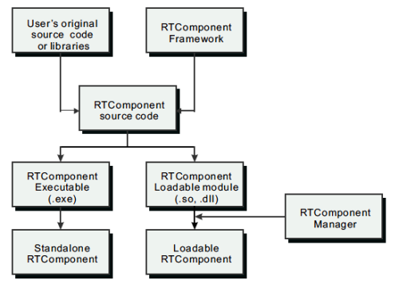
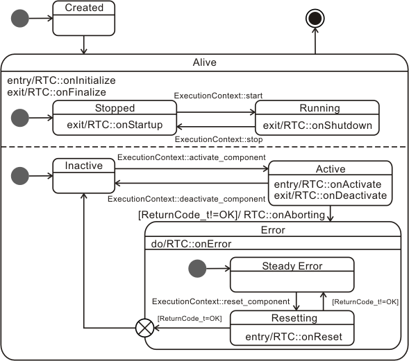
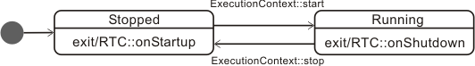
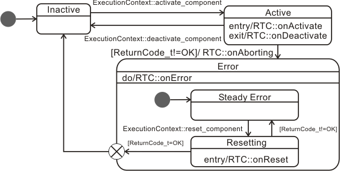

<!-- Tilte: RTCプログラミングの流れ -->
#contents(4)
#clear

## RTC Programming Flow
OpenRTM-aist provides a framework that allows users who want to develop components (component developers) to easily turn existing software assets or newly created software into RT Components (RTCs).
The general flow of component creation is shown in the figure below.

<br>
<div align="center"><a href="ComponentDevelFlow.png"></a></div>
<div align="center"><strong>RT Component Development Flow</strong></div>
<br>

Component developers create components by embedding library functions, class libraries, and other existing software assets into the component framework.
By doing this, existing software resources can be created as RT Components, which are software parts, and reused in various situations.
The created RT Components can be placed at appropriate locations on the network and used as distributed objects from anywhere on the network. 

As shown in the figure, RT Components created according to the RT Component framework can be broadly created as two types of binary files.
A Standalone RT-Component is an executable binary that can be run as a single file.
A Loadable Module RT-Component is a binary file in a dynamically loadable module format. 
RT Components can be created, distributed, and executed in these two formats. 

## Basics of RTC Programming
There are several major differences between ordinary programming and RT Component programming.


### A Program Without a main Function
Unlike ordinary programs, RT Component programs do not have a main function.
Instead, one RT Component is usually implemented as a single class that inherits from a special base class.

The processing you want the RT Component to perform is written by overriding member functions (methods) of that base class.
For example, processing such as initialization is written in a function called onInitialize. Or, processing you want to perform at termination is written in a function called onFinalize.

```
 ReturnCode_t MyComponent::onInitialize()
 {
   // 初期化処理など
 }
 ReturnCode_t MyComponent::onFinalize()
 {
   // 終了処理など
 }
```

So when are the initialization processing and termination processing written here executed?
To understand that, you need to know the lifecycle of an RT Component.

### Component Lifecycle
The sequence of events from the birth to the death of an RT Component is called the component lifecycle.

A component basically has the following three states:

- Created
- Alive
- Terminated

(The Alive state has further internal states (described later).)

As mentioned above, a component is a single class.
Therefore, the creation of a component is almost the same as the creation of an object (instance).
Usually, an RT Component is created by a manager (RTC Manager), and after that the manager manages the lifecycle of the RT Component.

Specifically, after creating an RT Component instance, the manager calls the onInitialize function mentioned above.
Also, when the RT Component terminates, the manager calls the onFinalize function.
In this way, RT Component programming is performed by writing the necessary processing for each process (called an action) assigned to a specific timing in the RT Component lifecycle.
### Execution Context
When an ordinary program is executed, a thread is assigned, and that thread executes the processing written as the program.
Programs that control robots usually have loops (control loops or processing loops) executed by threads, and they continue processing sensor data or controlling actuators.
In RT Components, the main processing for performing or controlling something like this is called the core logic.

When an RT Component is created and enters the Alive state, usually one thread is assigned, and the main processing (core logic) as an RT Component is executed.
In RT Components, this thread is called an ExecutionContext.
In actuality, an execution context is not the thread itself, but an abstract representation of a thread, and it has an execution cycle and state.
In other words, when an RT Component is created, an execution context is associated with the RT Component, and by driving the core logic, the RT Component performs some kind of processing (for example, controlling a robot).

### RTC State Transitions 
As described above, an RT Component has states, and processing is written as actions assigned to those states and transitions.
The figure below shows the state transition diagram (UML state machine diagram) of an RT Component.

<br><br>
<div align="center"><a href="RTCStateMachine040.png"></a></div>
<div align="center"><strong>RT Component State Transitions</strong></div>
<br><br>

Created and Alive are states of an RT Component.
There are also several states within the Alive state.

#### Stopped and Running States of the Thread 
First, let us look at the Stopped and Running states in the upper part inside the Alive state.

<br><br>
<div align="center"><a href="RTCStateMachineStartStop.png"></a></div>
<div align="center"><strong>Stopped and Running States of the Thread</strong></div>
<br><br>

These states indicate whether the thread is stopped (Stopped) or running (Running) when the execution context is viewed as a thread.

When an execution context in the Stopped state receives a start event, it executes the RT Component's onStartup and transitions to the Running state.
Conversely, with a stop event, the execution context executes the RT Component's onShutdown and transitions to the Stopped state.

Core logic actions are executed only in the Running state, and no actions are executed in the Stopped state.


#### Active and Inactive States 
The lower part inside the Alive state shows state transitions related to the Active, Inactive, and Error states of the core logic.

Immediately after an RT Component is created, the RT Component is in the Inactive state.
When the RT Component is activated, onActivate, which is an action of the RT Component, is called, and the component transitions to the Active state.
While in the Active state, the RT Component action onExecute is normally executed repeatedly.
Usually, the main processing of the RT Component is performed inside this onExecute.
For example, basic repetitive processing in a robot, such as reading data from sensors and sending it to other components, or controlling motors based on data received from other components, will be written in onExecute.

The RT Component continues to remain in the Active state until it is deactivated or an error occurs.
When it is deactivated, onDeactivate is called, and the component transitions to the Inactive state.
If some kind of error occurs during processing in the Active state, onAborting, which is an action of the RT Component, is called, and the component transitions to the Error state.

When the component transitions to the Error state, it remains in the Error state until it is reset from outside, and onError continues to be called.
When a reset is performed, onReset is called.
If the processing of onReset succeeds, the component transitions to the Inactive state and can become Active again, but if onReset fails, it remains in the Error state.

<br><br>
<div align="center"><a href="RTCStateMachineActiveInactive.png"></a></div>
<div align="center"><strong>Inactive State, Active State, and Error State</strong></div>
<br><br>

### Summary of Actions 
The main task of an RT Component developer is to consider what processing should be performed in each state of the RT Component described so far for the component they are creating, and to implement the functions corresponding to each action.
In other words, you only need to override the **on???** functions required for the component you are creating and write the contents of those functions.

The following shows the component action functions and their roles.
<table class="table-alt">
  <tr>
    <td>onInitialize</td>
    <td>Initialization processing. Called only once at the start of the component lifecycle.</td>
  </tr>
  <tr>
    <td>onActivated</td>
    <td>Called only once when the component is activated from the inactive state.</td>
  </tr>
  <tr>
    <td>onExecute</td>
    <td>Called periodically while in the active state.</td>
  </tr>
  <tr>
    <td>onDeactivated</td>
    <td>Called only once when the component is deactivated from the active state.</td>
  </tr>
  <tr>
    <td>onAborting</td>
    <td>Called only once before entering the ERROR state.</td>
  </tr>
  <tr>
    <td>onReset</td>
    <td>Called only once when the component is reset from the error state and transitions to the inactive state.</td>
  </tr>
  <tr>
    <td>onError</td>
    <td>Called periodically while in the error state.</td>
  </tr>
  <tr>
    <td>onFinalize</td>
    <td>Called only once at the end of the component lifecycle.</td>
  </tr>
  <tr>
    <td>onStateUpdate</td>
    <td>Called every time after onExecute.</td>
  </tr>
  <tr>
    <td>onRateChanged</td>
    <td>Called when the rate of the ExecutionContext is changed.</td>
  </tr>
  <tr>
    <td>onStartup</td>
    <td>Called only once when the ExecutionContext starts execution.</td>
  </tr>
  <tr>
    <td>onShutdown</td>
    <td>Called only once when the ExecutionContext stops execution.</td>
  </tr>
</table>

