<!-- Title: サービスポート (基礎編) -->
#contents

This page explains the overview of service ports.
A simple procedure for configuring service ports is described on the following page.

- [Service Port Configuration Procedure]({{ site.baseurl }}/en/doc/developersguide/basic_rtc_programming/servcieport/tutorial)

## What Is a Service Port?

To build a robot system in a component-oriented manner, data communication between components alone is not sufficient; command-level (or function-level) communication between components becomes necessary.
For example, in the case of a manipulator component that controls a robot arm, the end-effector position, velocity, and so on are data that should be sent from an upper-level application or component through a data port.

On the other hand, it is not appropriate to perform various robot arm settings, coordinate system settings, control parameter settings, operation mode settings, and so on through data ports. From an object-oriented perspective, it is natural for functions such as setCoordinationSystem(), setParameter(), and setMode() to be provided for the manipulator object, and for these functions to be called at appropriate times as needed.

<div align="center"><a href="serviceport_example_ja.png">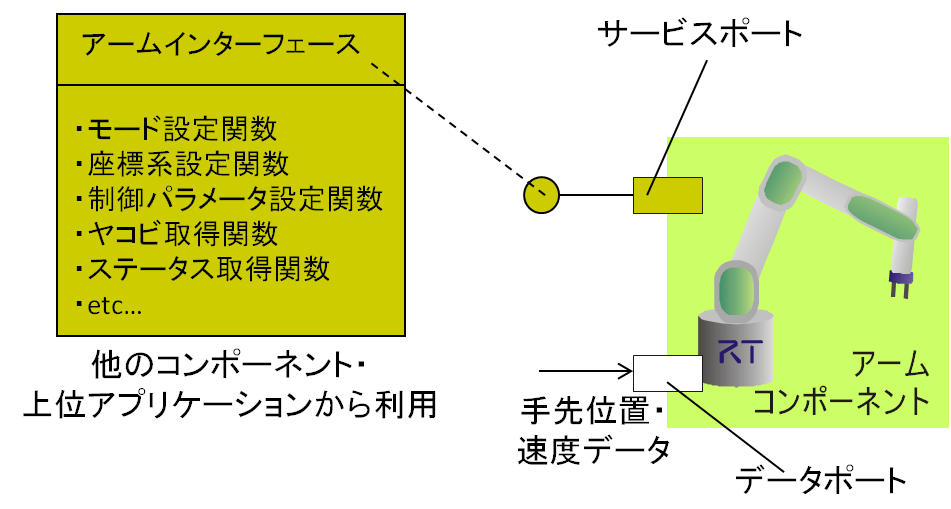</a></div>
<div align="center"><strong>Example of a Service Port</strong></div>

Service ports provide a mechanism for such command-level exchanges between components.

In general, a service is a group of functionally related commands (also called functions, methods, operations, and so on). In OpenRTM-aist, the side that provides this function is called a service provider (interface), and the side that uses the function is called a service consumer (interface).

In UML and similar conventions, a service provider is called a Provided Interface, and a service consumer is called a Required Interface. They are represented by symbols such as those shown below: a lollipop and a socket, respectively.
These are common terms and notation, so it is useful to remember them. From the perspective of the direction of calling or being called, the called side can be viewed as the provider (Provided Interface), and the calling side as the consumer (Required Interface).

<div align="center"><a href="provider_and_consumer_ja.png">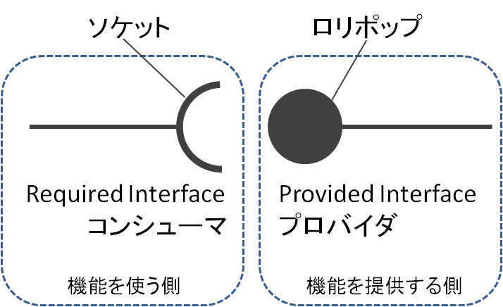</a></div>
<div align="center"><strong>Provider and Consumer</strong></div>

- Provider (Provided Interface): The called side, the side that provides the service
- Consumer (Required Interface): The calling side, the side that uses the service 

Providers and consumers are collectively called interfaces or service interfaces, and ports that have these service interfaces are called service ports.

## Service Ports and Interfaces

This section explains in detail the relationship between service interfaces and service ports.

<div align="center"><a href="component_port_interface_ja.png">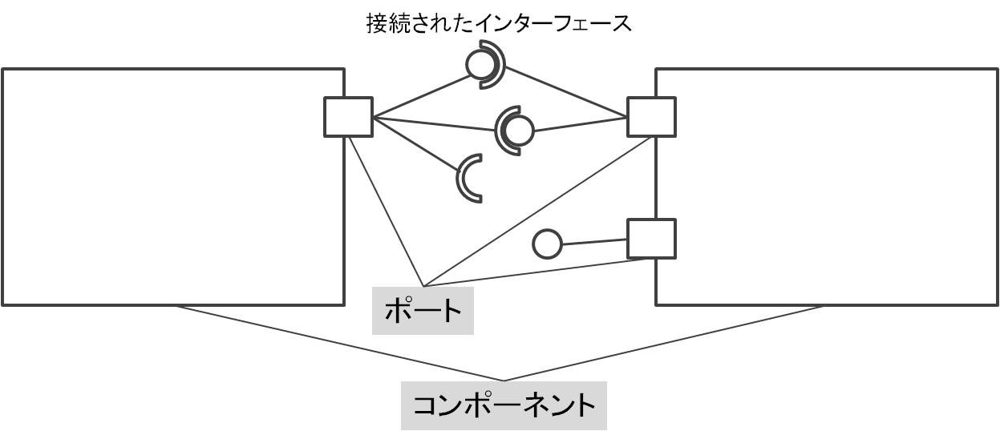</a></div>
<div align="center"><strong>Components, Ports, and Interfaces</strong></div>

A port is a part attached to a component that serves as an endpoint for connections between components. A connection between components means that connection-related negotiation is performed between ports attached to the components, making it possible for some kind of interaction (exchange of data or commands) to take place.

The port itself does not provide any functionality for exchanging data or commands. The actual exchange of commands is performed by service interfaces (providers and consumers).
In general, any number of functionally related interfaces in any direction can be attached to a port. This makes it possible to exchange commands not only in one direction but also in both directions.

Consumers and providers are connected based on certain conditions when ports are connected, and it becomes possible for the consumer to call the provider's functions.
To connect a consumer and a provider, their **types** must be the same or compatible.

Being the same type means having the same interface definition, and being compatible means that the provider's interface is one subclass of the consumer's interface (conversely, the consumer's interface is one superclass of the provider's interface).


### Service Port

Like data ports, an RT Component can have any number of service ports. In addition, any type and number of providers or consumers can be attached to a service port.

The following is code for registering a port and provider excerpted from the OpenRTM-aist sample component MyServiceProvider.

```
 RTC::ReturnCode_t MyServiceProvider::onInitialize()
{
   // Set service provider to Ports
   m_MyServicePort.registerProvider("myservice0", "MyService", m_myservice0);
   
   // Set CORBA Service Ports
   addPort(m_MyServicePort);
   
   return RTC::RTC_OK;
}
```

The provider is registered with the service port object m_MyServicePort by m_MyServicePort.registerProvider(). The third argument is the actual provider object.
Next, the port is registered with the component using the addPort() function of the RTObject class, which is the component framework class.

Similarly, the following code is excerpted from the sample component MyServiceConsumer.

```
 RTC::ReturnCode_t MyServiceConsumer::onInitialize()
{
   // Set service consumers to Ports
   m_MyServicePort.registerConsumer("myservice0", "MyService", m_myservice0);
   
   // Set CORBA Service Ports
   addPort(m_MyServicePort);
 
   return RTC::RTC_OK;
}
```

This is almost the same as the provider case: the consumer is registered with the port using the m_MyServicePort.registerConsumer() function, and that port is registered with the component using the addPort() function.

So far, without any particular explanation, code examples have been shown assuming that the object m_myservice0 is a provider or a consumer. Below, we explain how these interfaces are defined and how the objects are implemented.

### Interface Definition

What is an interface? In C++, pure virtual classes are sometimes called interfaces, and Java provides the interface keyword at the language level.

OpenRTM-aist has characteristics such as being independent of languages and operating systems and being network-transparent. This is achieved by using distributed object middleware called CORBA.
CORBA is distributed object middleware standardized by the international standards organization OMG, and many companies, organizations, individuals, and others provide various implementations according to the standard.

In OpenRTM-aist, interfaces are defined using CORBA's interface definition language called IDL. IDL provides a language-independent method for defining interfaces, and by using tools called IDL compilers that generate stubs and skeletons, code corresponding to various languages is automatically generated. A stub is code for a proxy object used to call a remote object, and a skeleton is base code used to implement a provider.

Thanks to this automatically generated code, calls between different languages can also be made seamlessly. For example, a provider implemented in C++ can be easily called from Python, Java, and so on.

The following is the IDL definition used in an OpenRTM-aist sample.

```
 module SimpleService {
   typedef sequence<string> EchoList;
   typedef sequence<float> ValueList;
   interface MyService
  {
     string echo(in string msg);
     EchoList get_echo_history();
     void set_value(in float value);
     float get_value();
     ValueList get_value_history();
  };
};
```

A module is similar to a namespace in C++, and it can qualify interface names and prevent conflicts.

As in C and similar languages, the typedef keyword is available. In the example above, dynamic array types called sequences are defined.
One defines the EchoList type as a list of string (string type), and the other defines the ValueList type as a list of float values.
In particular, sequence types cannot be used directly in definitions without typedef, so they must be typedefed in advance in this way.

Next, the part beginning with interface is the actual interface definition.
The MyService interface defines five functions (called operations in IDL).
Most definitions are similar to C, Java, and so on, but in IDL, modifiers such as **in**, **out**, or **inout** are attached before argument declarations to clarify whether the argument is input or output.

### IDL Compilation

The figure shows the flow from IDL definition to IDL compilation, provider implementation, and stub usage.

<div align="center"><a href="idlcompile_stub_skel_ja.png">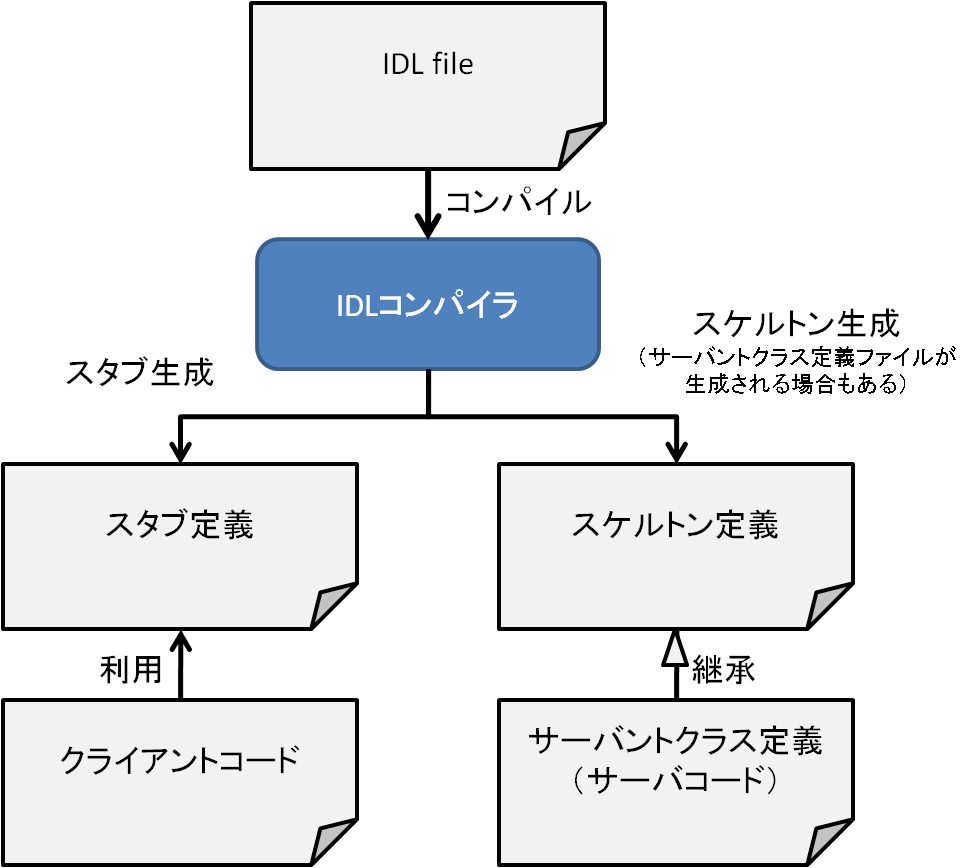</a></div>
<div align="center"><strong>IDL Compilation, Stubs, and Skeletons</strong></div>

When the defined IDL is given to an IDL compiler and compiled, code for stubs and skeletons (sometimes also called servers and clients) is usually generated.

The client, that is, the side using the service, includes the stub code and uses the proxy object defined as the stub to access the functions of the remote server. A C++ code example is shown below.

```
 MyService_var mysvobj = <何からの方法でリモートオブジェクトの参照を取得>
 Retval retval = mysvobj->myoperation(argument);
```

MyService_var is the declaration for the proxy object.
When a remote object reference is somehow assigned to mysvobj, the myoperation() function call performed below it is actually performed on the object that exists remotely.
The stub is where this MyService_var class is defined.

On the other hand, the server-side object that is actually called by the above method is implemented by inheriting from the skeleton class as follows.

```
 class MyServiceSVC_impl
```
   : public virtual MyService,
```
     public virtual PortableServer::RefCountServantBase
{
 public:
    MyServiceSVC_impl() {};
    virtual ~MyServiceSVC_impl() {};
    Retval myoperation(ArgType argument)
   {
      return do_ something(argument);
   }
};
```

Furthermore, by instantiating the servant class defined here and activating it as a CORBA object, operations can be called remotely.

```
 // CORBAのORB等を起動するためのいろいろなおまじない
 MyServiceSVC_impl mysvc;
 POA->activate_object(id, mysvc);
```

By defining and compiling IDL, most of the code required to define and use distributed objects is automatically generated.
However, tasks such as "somehow obtain a reference to the remote object" and "various incantations for starting the CORBA ORB" described above are still parts that must be coded when using CORBA directly. These are also difficult to understand and require tedious work when using CORBA.

However, by using OpenRTM-aist, most of these various CORBA calls are hidden, and implementers can focus only on client calls and servant implementation. Below, we will look in detail at how to implement a servant and register it with a component as a provider, and how to use a provider as a consumer.

## Service Port Implementation

When implementing service ports, it is convenient to use RTCBuilder.
You can implement service ports, providers, and consumers yourself, but this requires familiarity with CORBA and IDL compilers, and it requires rewriting Makefiles and various parts of the code, so it is not highly recommended.

For detailed usage of RTCBuilder, refer to the RTCBuilder manual.

### IDL Definition

To use a service port, you need to define the interface to be used in IDL in advance, or place an existing IDL file in an appropriate directory.

Details of how to define IDL are not described here, but it can generally be defined in the following format. Readers familiar with C or Java should be able to define it relatively easily.

```
 // 名前空間のためにモジュールを定義することができる。
 // モジュール定義は積極的に利用することが推奨される。
 module <モジュール名>
{
   // 構造体を定義することができる。
   struct MyStruct // 構造体名
  {
     short x; // int型は short と longの み利用可能
     short y;
     long  a;
     long  b;
     double dval; // 浮動小数点型は float と double のみ利用可能
     float fval;
     string strval; // 文字列のために string が利用可能
  };
 
   // 動的配列 sequence 型は予め typedef する必要がある
   typedef sequence<double> DvalueList;
   typedef sequence<MyStruct> MyStructList; // 任意の構造体もsequence型にできる
 
   // インターフェース定義
   interface MyInterface // インターフェース名
  {
     void op1(); // 戻り値なし、引数なしの場合
 
     // NG: 大文字・小文字を区別しない言語では以下の定義が問題になるため IDLではエラーになる
     // short op2(in MuStruct mystruct);
     short op2(in MyStruct mydata); // 引数は {in, out, inout} で方向を指定
 
     oneway void op3(); // 戻り値なしのオペレーションは onway キーワードが利用可能
 
     void op4(in short inshort, out short outshort, inout short ioshort);
 
     void op5(MyInterface myif); // MyInterface 自身を引数に利用することも可能
  };
 
   // 同一の IDL ファイルに複数の interface を定義することも可能
   interface YourInterface
  {
     void op1();
  };
};
```


### Design Using RTCBuilder

To use the interface defined in IDL as shown above as a provider or consumer of a service port of the RT Component you will develop, you need to design the service port with RTCBuilder, the component code generator, and provide this IDL definition at that time.

Create a new RTCBuilder project and open the perspective. After making the necessary settings such as various profiles (component name, category name, etc.), open the Service Port tab, and a screen like the following will appear.

<div align="center"><a href="rtcbuilder_serviceport_tab1_ja.png">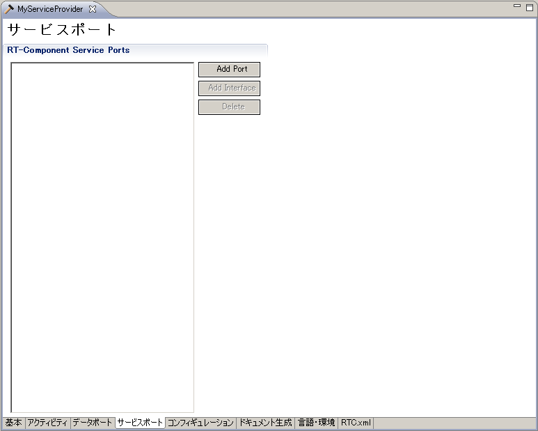</a></div>
<div align="center"><strong>Service Port Design Tab</strong></div>

First, click the [Add Port] button and add one service port. This adds one service port named sv_name, and one small square port is added to the component box in the BuildView below. When you click sv_name in the port list on the left side of the RTCBuilder editor, the **RT-Component Service Port Profile** is displayed on the right side, so change the port name to an appropriate name (here, **MyServiceProviderPort**).

<div align="center"><a href="rtcbuilder_serviceport_tab2_ja.png">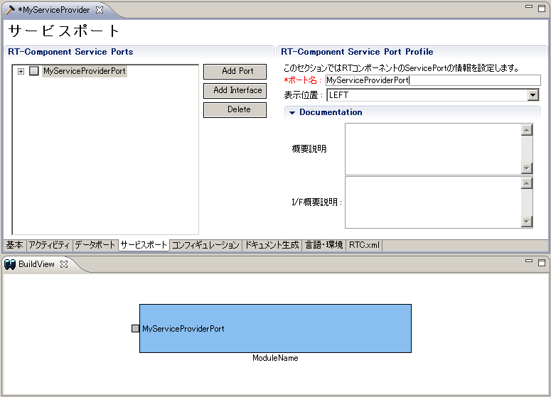</a></div>
<div align="center"><strong>Adding a Service Port</strong></div>

Click MyServiceProviderPort in the port list on the left side of the editor, and then click the [Add Interface] button. An interface named **if_name** is added to MyServiceProviderPort. As before, click **if_name** on the left side of the editor, and change **if_name** to an appropriate name (here, MyServiceProvider) in the **RT-Component Service Port Interface Profile**. In the BuildView below, a lollipop is added to the square port, making it visually clear that a provider (Provided Interface) has been attached to the port.

<div align="center"><a href="rtcbuilder_serviceport_tab3_ja.png">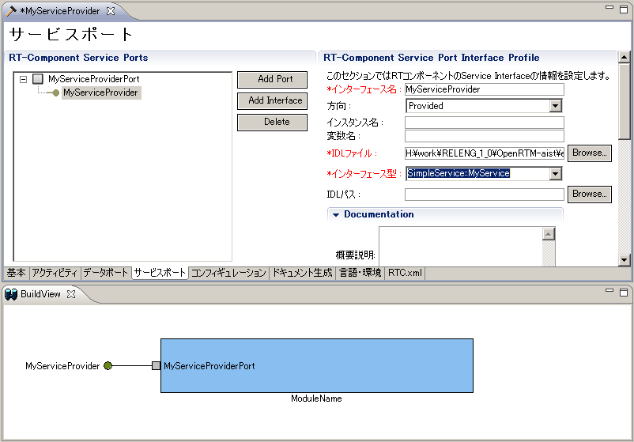</a></div>
<div align="center"><strong>Adding a Service Interface (Provider)</strong></div>

In the Interface Profile on the right side of the editor, set the interface profile. For example, in the **Direction** dropdown list, specify whether the target interface is a provider (Provided) or a consumer (Required).

<div align="center"><a href="rtcbuilder_direction_ddown_ja.png">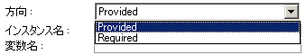</a></div>
<div align="center"><strong>Setting the "Direction" of the Service Interface</strong></div>

Here, since we are trying to add a provider, leave it as Provided. In addition, you can specify an instance name, variable name, and so on, but they are not required. The instance name is used when, at connection time, if the provider and consumer instance names are the same, the port connection is performed automatically without specifying the correspondence.

<div align="center"><a href="serviceif_autoconnection_ja.png">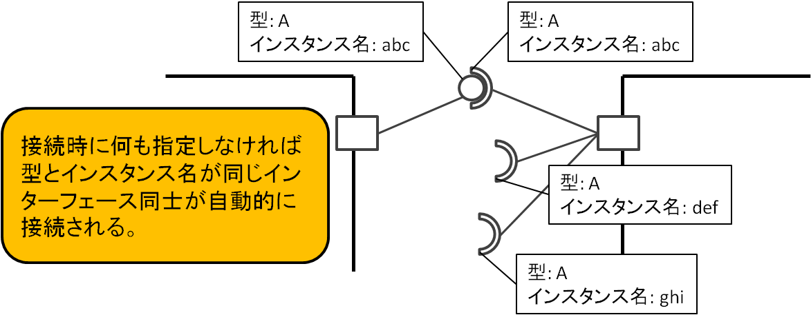</a></div>
<div align="center"><strong>Service Interface Instance Name and Automatic Connection</strong></div>

However, even if the instance names differ, arbitrary interfaces can be connected at connection time, so entering it is not required.
Also, the variable name is an item for specifying the variable name to which the provider object will be assigned when code is generated, but this is also generated automatically from the interface name, so entering it is optional.

Next, specify the IDL and the interface type. Place the IDL defined above in an appropriate directory, click the [Browse] button next to the IDL file specification box, and specify the target IDL. Then the interfaces defined in the specified IDL appear in the interface type dropdown list below it. In this dropdown list, select the interface name attached to this port. If there is a syntax error or similar problem in the IDL file, the desired interface will not appear in the dropdown list. Check the IDL file definition again.

<div align="center"><a href="rtcbuilder_interfacetype_ddwon_ja.png">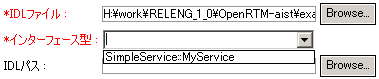</a></div>
<div align="center"><strong>Selecting the Interface Type</strong></div>

If <strong>Required</strong> is specified in the **Direction** dropdown list described above, this interface becomes a consumer.
The following is an example of the service port and interface settings screen for another component, <strong>MyServiceConsumer</strong>.

<div align="center"><a href="rtcbuilder_serviceport_tab4_ja.png">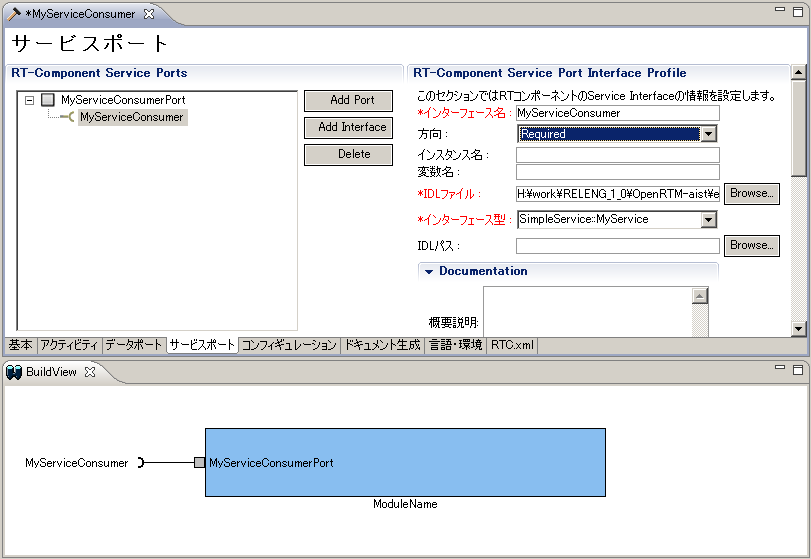</a></div>
<div align="center"><strong>Adding a Service Interface (Consumer)</strong></div>

In the BuildView below the editor, a socket is added to the port, making it visually clear that a consumer (Required interface) has been attached to the port.

### Implementing a Service Provider

A provider is literally an interface for providing a service. Therefore, it is necessary to implement the contents of the service that has the interface defined in IDL.

When a component that has a provider interface is designed with RTCBuilder, code generation generates not only the component source template, but also, for example in C++, templates for provider implementation code named <service interface name>SVC_impl.cpp and <service interface name>SVC_impl.h.

<div align="center"><a href="rtcbuilder_svcimpl_cxxsrc_ja.png">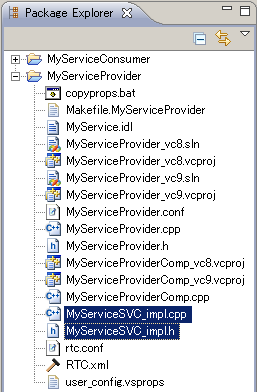</a></div>
<div align="center"><strong>Service Provider Implementation Files (C++, Python, Java)</strong></div>

The following shows the filenames of the provider implementation template code generated in each language.

hogehogehoge

<div align="center"><a href="rtcbuilder_svcimpl_pysrc_ja.png">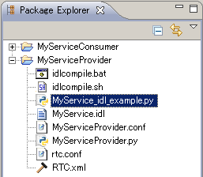</a></div>
<div align="center"><strong>Service Provider Implementation File (Python)</strong></div>

<div align="center"><a href="rtcbuilder_svcimpl_javasrc_ja.png">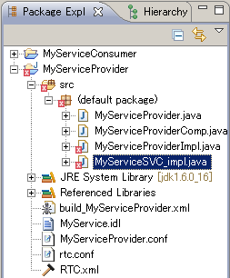</a></div>
<div align="center"><strong>Service Provider Implementation File (Java)</strong></div>

In these implementation templates, classes corresponding to the interfaces defined in IDL are already defined.

Here, we will take the C++ implementation method as an example and implement some of the operations defined in IDL.

#### Implementing the echo() Function

First, let us look at the echo() member function.

```
/*
  * Methods corresponding to IDL attributes and operations
  */

 char* MyServiceSVC_impl::echo(const char* msg)
{
   // Please insert your code here and remove the following warning pragma
 #ifndef WIN32
   #warning "Code missing in function <char* MyServiceSVC_impl::echo(const char* msg)>"
 #endif
   return 0;
}
```

There is a #warning preprocessor directive, but this is only to warn that this function has not been implemented when compiled with gcc, so remove it together with #ifndef.

```
 char* MyServiceSVC_impl::echo(const char* msg)
{
   return msg;
}
```

Suppose this function simply provides the functionality of returning the string given as the argument of echo() to the caller. Therefore, it might seem sufficient to implement it as follows.

```
 char* MyServiceSVC_impl::echo(const char* msg)
{
   return msg;
}
```

However, this results in a compile-time error because const char* is being passed to char*. It is also incorrect as an implementation method for CORBA objects. This is because in CORBA there is a rule that objects returned by return are destroyed by the ORB (Object Request Broker, the part that handles calls to remote objects, the core of CORBA). (This is also described as relinquishing ownership of the object at return time.)

Therefore, return must return a string for which memory has been separately allocated and the contents of msg have been copied. Based on this, you might think that it should be implemented as follows.

```
 char* MyServiceSVC_impl::echo(const char* msg)
{
   char* msgcopy;
   msgcopy = malloc(strlen(msg));
   strncpy(msgcopy, msg, strlen(msg));
   return msgcopy;
}
```

Here, memory is allocated with malloc, but it is unclear whether the ORB will release the memory with free or delete.
In fact, CORBA separately defines methods for handling objects (including structures, arrays, and composite types of these) and strings, and function arguments and return values must be handled according to those methods.

According to the method defined by CORBA, the echo() function must be implemented as follows.

```
 char* MyServiceSVC_impl::echo(const char* msg)
{
   CORBA::String_var msgcopy = CORBA::string_dup(msg);
   return msgcopy._retn();
}
```

In the first line inside the function, the CORBA::String_var type is declared, which is a smart pointer to the CORBA string class CORBA::String. The String_var type is a smart pointer for managing so-called ownership and is similar to STL auto_ptr.

```
 CORBA::String_var msgcopy = CORBA::string_dup(msg);
```

The CORBA::string_dup() function copies the string stored in the argument msg into the variable msgcopy of this String_var type. This function allocates enough memory to store the string given as the argument and copies the argument string into that area.

In the next line, the string in msgcopy is returned to the caller with return, while relinquishing ownership of the object and transferring ownership to the return side. As shown in the figure below, in the ORB, the string returned by return is transmitted to the caller over the network, and then the string object is released.

<div align="center"><a href="serviceport_orb_and_provider_ja.png">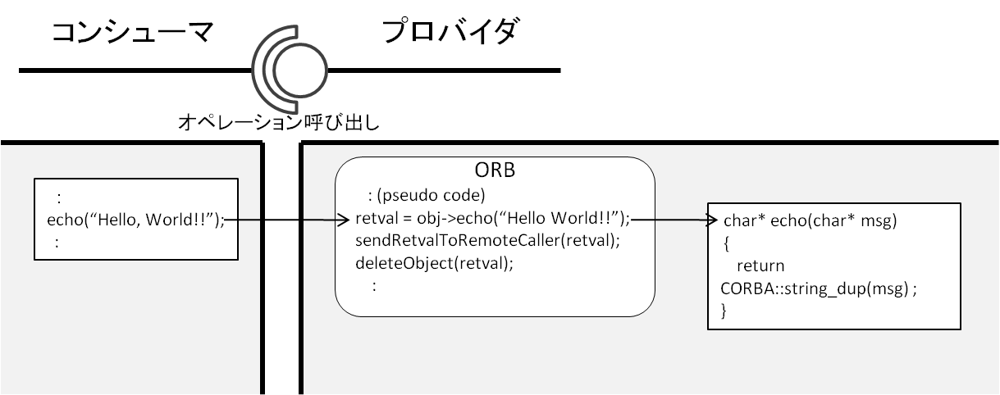</a></div>
<div align="center"><strong>Relationship Between ORB, Operation Calls, and Memory Management</strong></div>

If you understand this rule well, since the msgcopy object is not used inside the echo() function, the final implementation of the echo() function can also be written as follows.

```
 char* MyServiceSVC_impl::echo(const char* msg)
{
   return CORBA::string_dup(msg);
}
```

This means that CORBA::string_dup() allocates memory for the string and copies the contents, and then directly gives ownership to the caller.

In this way, a service provider is a CORBA object, so its implementation must be done in a way that is slightly different from ordinary C++ implementation.
In particular, the rules for passing function arguments and return values may look a little complicated. However, as described above, if you think with the concept of object ownership in mind, it naturally becomes clear how arguments should be received and how return values should be returned.
For details, refer to the Appendix and other CORBA reference books.


#### set_value(), get_value(), and get_value_history()

Next, we will implement the set_value() function, get_value() function, and get_value_list() function together.
These functions are simple: the float value set by set_value() is stored, and that value is returned by get_value().
In get_value_history(), the history of values that have been set so far is stored and returned as a list.

First, prepare variables to store the values. The current value is prepared as a private member of type CORBA::Float in the MyServiceSVC_impl class.
On the other hand, get_value_history() uses a CORBA sequence type called SimpleService::ValueList as the return value, so this is also held as a member variable.
Add these variable declarations near the end of the MyServiceSVC_impl class definition in MyServiceSVC_impl.h as follows.

```
 class MyServiceSVC_impl
```
   : public virtual POA_SimpleService::MyService,
```
    public virtual PortableServer::RefCountServantBase
{
```
   : (中略)
```
 private:
   CORBA::Float m_value; // この行を追加する
   SimpleService::ValueList m_valueList; // この行を追加する
  };
```

Do not forget to initialize the variables. In the constructor of MyServiceSVC_impl.cpp, initialize m_value to 0.0 and m_valueList to length 0.

```
 MyServiceSVC_impl::MyServiceSVC_impl()
```
 : m_value(0.0), m_valueList(0)
```
{
   // Please add extra constructor code here.
}
```

Next, implement the set_value() function. It assigns the numeric value given as an argument to the member variable m_value and also adds it to m_valueList.
CORBA sequence types are dynamic array types, and the functions length() and length(CORBA::ULong) can be used together with the [] operator. The length() function returns the current length of the array, and the length(CORBA::ULong) function sets the current length of the array.
The implementation is as follows.

```
 void MyServiceSVC_impl::set_value(CORBA::Float value)
   throw (CORBA::SystemException)
{
   m_value = value; // 現在値
 
   CORBA::ULong len(m_valueList.length()); // 配列の長さを取得
   m_valueList.length(len + 1); // 配列の長さを1つ増やす
   m_valueList[len] = value; // 配列の最後尾にvalueを追加
 
   return;
}
```

Unlike the echo() function, the CORBA::Long type is equivalent to C++ long int, and there is no need to consider object ownership, memory allocation, or disposal.
Therefore, a simple assignment as shown above is sufficient. Also, for the array type, the array length is increased by one using the two types of length() functions and the [] operator, and the argument value is assigned to the end.
OpenRTM-aist provides function templates for using CORBA sequence types in a form close to STL vector. Using them, this can be written as follows.

```
 void MyServiceSVC_impl::set_value(CORBA::Float value)
   throw (CORBA::SystemException)
{
   m_value = value; // 現在値
   CORBA_SeqUitl::push_back(m_valueList, value);
 
   return;
}
```

In CORBA_SeqUtil.h, functions such as for_each(), find(), push_back(), insert(), front(), back(), erase(), and clear() are defined.

get_value() is as follows.

```
 CORBA::Float MyServiceSVC_impl::get_value()
   throw (CORBA::SystemException)
{
   return m_value;
}
```

It simply returns the stored value to the caller with return. Here again, unlike the previous echo() example, CORBA::Float is a primitive type, so there is no need to consider ownership or similar issues.

Finally, let us look at the implementation of get_value_history(). It may seem that you only need to return m_valueList, which stores the value history, but because of the ownership and memory release issues described earlier, it must be implemented as follows.

```
 SimpleService::ValueList* MyServiceSVC_impl::get_value_history()
   throw (CORBA::SystemException)
{
   SimpleService::ValueList_var vl;
   vl = new SimpleService::ValueList(m_valueList);
   return vl._retn();
}
```

In the first line inside the function, a variable of type SimpleService::valueList_var is declared, which is a smart pointer for a sequence-type object. In the next line, the pointer is assigned to this smart pointer by calling the copy constructor.
This simultaneously allocates memory and copies the values. Finally, with vl._retn(), ownership of the sequence-type object held by vl is relinquished, and the object is passed to the return side.

And since vl is not used inside the function, it can also be written as follows.

```
 SimpleService::ValueList* MyServiceSVC_impl::get_value_history()
   throw (CORBA::SystemException)
{
   return new SimpleService::ValueList(m_valueList);
}
```


So far, we have looked at provider implementation. Since a provider is a so-called CORBA object, it must be implemented according to CORBA rules, such as the types used and how variables are passed.
At first this may feel troublesome, but if you understand that primitive types can be implemented as before, and for complex objects where memory allocation and release occur and which side has ownership, you will understand how they should be implemented.


### Implementing a Service Consumer

In a consumer, you call the service provider implemented above and use its functionality. If you generate template code for a component that has a consumer using RTCBuilder, unlike the provider case, no special file is generated.

Instead, a consumer object, which is a placeholder for the provider, is declared in the component header as follows.

```
      : (中略)
   // Consumer declaration
   // <rtc-template block="consumer_declare">
  /*!
   */
   RTC::CorbaConsumer<SimpleService::MyService> m_MyServiceConsumer;
 
   // </rtc-template>
 
  private:
      : (中略)
```

This declares a consumer of type MyService by giving the type argument SimpleService::MyService to the RTC::CorbaConsumer class template.
In the implementation file, you can also confirm that in the onInitialize() function, the consumer is registered with the port and the port is registered with the component.

```
 RTC::ReturnCode_t MyServiceConsumer::onInitialize()
{
   : (中略)   
  // Set service consumers to Ports
   m_MyServiceConsumerPortPort.registerConsumer("MyServiceConsumer",
                                                "SimpleService::MyService",
                                                m_MyServiceConsumer);
  
   // Set CORBA Service Ports
   addPort(m_MyServiceConsumerPortPort);
   // </rtc-template>
 
   return RTC::RTC_OK;
}
 
```

You can see that the variable m_MyServiceConsumer declared in the header is registered with the port by the registerConsumer() member function.
The first argument gives the "instance variable" of this consumer, the second argument gives the "interface type" of the consumer, and the third argument gives the m_MyServiceConsumer variable, which is the consumer instance.
This associates the consumer with the port by both instance name and type name.


As mentioned above, the consumer m_MyServiceConsumer is a placeholder for the provider.
In C++, it can be handled like a pointer to an object.

In the MyService interface, the echo() operation, which takes one string type (CORBA string type) argument, was defined.
Therefore, for example, the echo() function can be called as follows.

```
 m_MyServiceConsumer->echo("Hello World");
```

In C++, operations can be called as through a pointer as shown above, and in Java or Python as through a reference.

Now, those with sharp intuition may wonder what exactly the pointer or reference points to. Even in C++ and similar languages, code such as the following immediately crashes with a segmentation fault.

```
 class A {
 public:
   const char* echo(const char* msg) {
     std::cout << msg << std::endl;
     return msg;
  }
};
 
 int main (void) {
  A* a;
   a->echo("Hello World!!");
}
```

Since a is a null pointer, it does not point to any object. Similarly, immediately after the component is started, the m_MyServiceConsumer above does not point to any object, so naturally an operation cannot be called.
In the case of class A above,

```
 int main (void) {
  A* a;
   a = new A();
   a->echo("Hello World!!");
}
```

if an object is created with new and assigned to the variable a, then a is a valid pointer pointing to an object at that point, so the member function echo() of class A can be called.

However, what the consumer inside a component wants to call is an operation of an object located somewhere on the network.
Therefore, what m_MyServiceConsumer points to is a remote object reference (CORBA object reference).

In fact, as shown in the figure below, the consumer receives the corresponding object reference when its port is connected to a port that has a provider.
Through the connection, the consumer points to a valid object, and only then can operations be called.

hogehogee

<div align="center"><a href="serviceport_connection_and_reference_ja.png">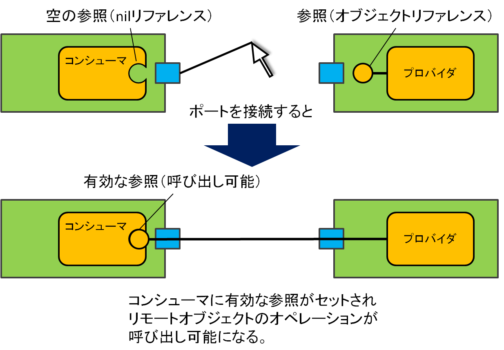</a></div>
<div align="center"><strong>Service Port Connection and Object Reference</strong></div>

After connection, consumer operations can be called (if an appropriate provider exists on the other port), but if the port is not connected, or if a valid reference is not set, the consumer object throws an exception.
When using a consumer, you do not know when a connection will be made or when it will be disconnected, so you must always catch this exception and handle it appropriately.

```
try
{
   m_MyServiceConsumer->echo("Hello World!!");
}
 catch (CORBA::SystemException &e)
{
   // 例外捕捉時の処理
      std::cout << "ポートが接続されていません"" << std::endl;
}
 catch (...)
{
   // その他の例外
}
```

If an exception occurs inside the onExecute() member function and is not caught inside the function, the RTC transitions to the error state.

Based on the above, we will implement the MyServiceConsumer component. In this example, onExecute() waits for input from the user, receives commands corresponding to each operation, calls the operation of the remote provider according to the command, and returns the result.

First, let us look at the part that presents available commands to the user.

RTC::ReturnCode_t MyServiceConsumer::onExecute(RTC::UniqueId ec_id)
{
```
 try
   {
      std::cout << std::endl;
      std::cout << "Command list: " << std::endl;
      std::cout << " echo [msg]       : echo message." << std::endl;
      std::cout << " set_value [value]: set value." << std::endl;
      std::cout << " get_value        : get current value." << std::endl;
      std::cout << " get_echo_history : get input messsage history." << std::endl;
      std::cout << " get_value_history: get input value history." << std::endl;
      std::cout << "> ";
      
      std::string args;
      std::string::size_type pos;
      std::vector<std::string> argv;
      std::getline(std::cin, args);
```

First, as described above, the code is enclosed in a try block to catch exceptions thrown by the consumer.
It displays the list of available commands and receives user input with the getline() function.

```
      
      pos = args.find_first_of(" ");
      if (pos != std::string::npos)
       {
          argv.push_back(args.substr(0, pos));
          argv.push_back(args.substr(++pos));
       }
     else
       {
          argv.push_back(args);
       }
```

Among these commands, only echo and set_value take arguments, and these commands take only one argument.
The received string is split at the first space and stored in a string vector as argv[0] = command and argv[1] = argument.
For the echo and set_value commands, argv[1] is used as the argument, and for other commands it is simply ignored.

```
        
      if (argv[0] == "echo" && argv.size() > 1)
       {
          CORBA::String_var retmsg;
          retmsg = m_myservice0->echo(argv[1].c_str());
          std::cout << "echo return: " << retmsg << std::endl;
          return RTC::RTC_OK;
       }
```

This is the implementation of the echo command. If argv[0] is <strong>echo</strong>, the echo() function is called with argv[1] as the argument.
retmsg is declared as a variable for receiving the return value of echo(), which is a CORBA string type.
Ownership of the return value of echo() is on this side, so after receiving it, the memory must be released appropriately. However, when the String_var smart pointer type is used, it releases the memory appropriately when it is no longer needed.
It displays the return value and exits the onExecute() function with return RTC::RTC_OK.

```
        
      if (argv[0] == "set_value" && argv.size() > 1)
       {
          CORBA::Float val(atof(argv[1].c_str()));
          m_myservice0->set_value(val);
          std::cout << "Set remote value: " << val << std::endl;
          return RTC::RTC_OK;
       }
```

This is the implementation of the set_value command. The string argument argv[1] is converted to the CORBA::Float type and given as the argument of the set_value() operation.

```
        
      if (argv[0] == "get_value")
       {
          std::cout << "Current remote value: "
                    << m_myservice0->get_value() << std::endl;
          return RTC::RTC_OK;
       }
```

The get_value command obtains the value set by the set_value command.
The get_value() operation returns CORBA::Float by value, so there is no need to consider object ownership or similar issues.
Here, the return value is displayed as-is on the console with std::cout.

```
      if (argv[0] == "get_echo_history")
       {
          EchoList_var elist = m_myservice0->get_echo_history();
          for (CORBA::ULong i(0), len(elist.length(); i <len; ++i)
         {
            std::cout << elist[i] << std::endl;
         }
          return RTC::RTC_OK;
       }
```

The get_echo_history command receives the result of get_echo_history() and returns the list of strings that have been given as arguments to the echo command so far.
The return value of the get_echo_history() function is EchoList, which is a CORBA sequence type.
A smart pointer _var type is also defined for sequence types, so this is used.
Since the length() function for obtaining the length of the array can be used, the length is checked and all elements are displayed with a for statement.
With the _var type of a sequence type, elements can be accessed like a C language array using the [] operator as shown above.

```
      if (argv[0] == "get_value_history")
       {
          ValueList_var vlist = m_myservice0->get_value_history();
          for (CORBA::ULong i(0), len(vlist.length()); i < len; ++i)
         {
            std::cout << vlist[i] << std::endl;
         }
          return RTC::RTC_OK;
       }
```

Finally, this is the get_value_history command. It calls the get_value_history() operation and displays the list of values set so far.
The return value of the get_value_hitory() function is ValueList, a sequence type of CORBA::Float. Since the elements are CORBA::Float, there is no need to consider object ownership, but a sequence type is itself an object, so ownership must be considered. Therefore, it is received here with a variable of the _var type.

```
 std::cout << "Invalid command or argument(s)." << std::endl;
    }
   catch (CORBA::SystemException &e)
    {
       std::cout << "No service connected." << std::endl;
    }
   return RTC::RTC_OK;
}
```

Finally, a message is output if the command does not match any of the above. There is also a catch block to catch exceptions including the case where no reference is set in the consumer.

This concludes the explanation of how to call operations from a consumer with a simple example.
When using a consumer, keep in mind that an object reference is not necessarily always set, so exceptions must always be caught and handled, and each operation call is performed according to CORBA rules.

