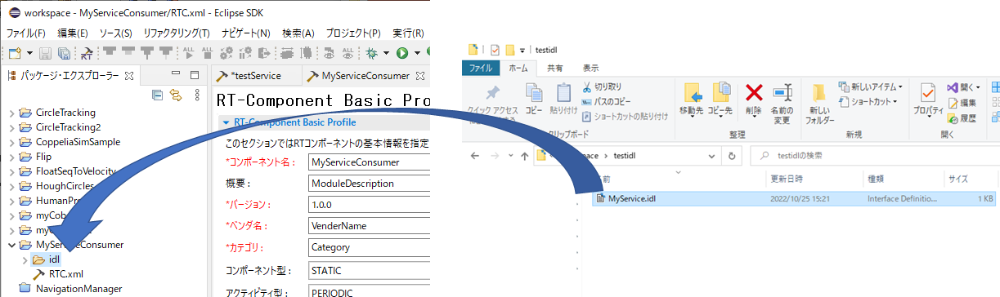
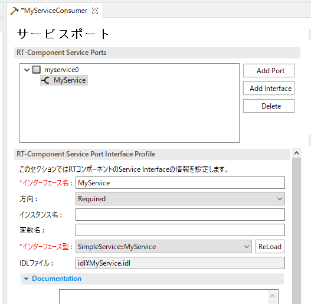
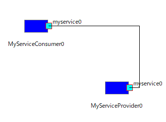

#contents

## IDLファイルの作成

使用するIDLファイルを作成します。
OpenRTM-aistのサンプルコンポーネントに付属しているMyService.idlを使用します。
以下のコードをコピーして使用する場合は、行頭のスペースを削除してください。


```
 module SimpleService {
 typedef sequence<string> EchoList;
 typedef sequence<float> ValueList;
 interface MyService
 {
   string echo(in string msg);
   EchoList get_echo_history();
   void set_value(in float value);
   float get_value();
   ValueList get_value_history();
 };
 };
```


## RTCの作成

### Required側のRTC作成

RTC Builderでモジュール名が**MyServiceConsumer**のRTCを作成してください。
アクティビティはonExecuteを有効にしてください。

次に、作成したIDLファイル(MyService.idl)をRTC Builderのパッケージエクスプローラーから、MyServiceConsumerの**idl**フォルダにドラッグアンドドロップして、ファイルをコピーします。

<div align="center"><a href="service1.png"></a></div>

サービスポートの設定で、Add Portボタンを押してサービスポート、Add Interfaceボタンを押してサービスインターフェースを追加します。

今回は、ポート名をmyservice0、インターフェース名をMyService、方向をRequired、インターフェース型をSimpleService::MyServiceに設定します。

<div align="center"><a href="service2.png"></a></div>

RTCの仕様をまとめると、以下のようになっています。

<table class="table-alt">
  <tr>
    <th>コンポーネント名</th>
    <th>MyServiceConsumer</th>
  </tr>
  <tr>
    <td>言語</td>
    <td>C++</td>
  </tr>
  <tr>
    <td>アクティビティ</td>
    <td>onInitialize、onExecute</td>
  </tr>
  <tr>
    <td>></td>
    <td>CENTER: Service</td>
  </tr>
  <tr>
    <td>ポート名</td>
    <td>myservice0</td>
  </tr>
  <tr>
    <td>></td>
    <td>CENTER: Interface</td>
  </tr>
  <tr>
    <td>インターフェース名</td>
    <td>MyService</td>
  </tr>
  <tr>
    <td>方向</td>
    <td>Required</td>
  </tr>
  <tr>
    <td>インターフェース型</td>
    <td>SimpleService::MyService</td>
  </tr>
</table>


RTC Builderでコード生成して、onExecute関数を以下のように編集してください。


```
 RTC::ReturnCode_t MyServiceConsumer::onExecute(RTC::UniqueId /*ec_id*/)
 {
    try
    {
      std::cout << m_MyService._ptr()->echo("test") << std::endl;
    }
    catch (...)
    {
    }
   return RTC::RTC_OK;
 }
```

IDLファイルで定義したMyServiceインターフェースのecho関数を呼び出しています。
サービスポートを接続すると、Provided側で実装したecho関数が呼ばれます。
Provided側のRTCがアクティブ状態ではない場合、echo関数は例外を投げるためtry～catchで例外処理しています。例外処理をしなかった場合、RTCがError状態に遷移することがあります。

後はビルドして実行ファイルを生成してください。

### Provided側のRTC作成

RTC Builderで以下の仕様のRTCを作成してください。
インターフェースの方向は**Provided**に設定してください。

<table class="table-alt">
  <tr>
    <th>コンポーネント名</th>
    <th>MyServiceProvider</th>
  </tr>
  <tr>
    <td>言語</td>
    <td>C++</td>
  </tr>
  <tr>
    <td>アクティビティ</td>
    <td>onInitialize</td>
  </tr>
  <tr>
    <td>></td>
    <td>CENTER: Service</td>
  </tr>
  <tr>
    <td>ポート名</td>
    <td>myservice0</td>
  </tr>
  <tr>
    <td>></td>
    <td>CENTER: Interface</td>
  </tr>
  <tr>
    <td>インターフェース名</td>
    <td>MyService</td>
  </tr>
  <tr>
    <td>方向</td>
    <td>Provided</td>
  </tr>
  <tr>
    <td>インターフェース型</td>
    <td>SimpleService::MyService</td>
  </tr>
</table>


コード生成したら、**MyServiceSVC_impl.cpp**の**SimpleService_MyServiceSVC_impl::echo**関数を編集します。

```
 #include <iostream>
 /*
```
  * Methods corresponding to IDL attributes and operations
  */
```
 char* SimpleService_MyServiceSVC_impl::echo(const char* msg)
 {
   std::cout << msg << std::endl;
 
   return CORBA::string_dup(msg);
 }
```


MyServiceConsumerのonExecute関数でecho関数を呼びましたが、サービスポート接続時にはSimpleService_MyServiceSVC_impl::echo関数が呼ばれます。
戻り値の型が文字列(char*)の場合、CORBA::string_dup関数でmsgからメモリをコピーする必要があります。


編集が完了したらビルドしてください。

## 動作確認

以下のようにRT System Editorでポートを接続して、RTCをアクティブ化してください。

<div align="center"><a href="service3.png"></a></div>

ウィンドウにtestと連続して表示されていたら正常に動作しています。
これはRequired側ではProvided側のecho関数を呼び出して文字列を渡しています。
Provided側では、受け取った文字列を標準出力後に、Required側に返しています。
最後にRequired側で返された文字列を標準出力しています。


文字列以外のデータを利用する方法、Python、Java、Luaでの使用方法は以下のサンプルコンポーネントを参考にしてください。

- [C++サンプルコンポーネント](https://github.com/OpenRTM/OpenRTM-aist/tree/master/examples/SimpleService)
- [Pythonサンプルコンポーネント](https://github.com/OpenRTM/OpenRTM-aist-Python/tree/master/OpenRTM_aist/examples/SimpleService)
- [Javaサンプルコンポーネント](https://github.com/OpenRTM/OpenRTM-aist-Java/tree/master/jp.go.aist.rtm.RTC/src/RTMExamples/SimpleService)
- [Luaサンプルコンポーネント](https://github.com/Nobu19800/RTM-Lua/tree/master/examples)

